# A la Somme Avec Wine Bob

* [pd-allen](https://www.paulsbattlefieldtours.com/profile/pd-allen/profile)
* Jan 23, 2024
* 3 min read

Updated: Jun 29, 2025

Recently I did a tour of the First World War Battlefields with my good buddy and fellow war story fan (Wine) Bob Drummond. We did a pilgrimage for several of our family members and visited a number Somme Sights.

# Pozieres Memorial

Our first stop was the Pozieres Memorial and Cemetery.

The memorial lists 14,657 British and South African soldiers with no known grave who were killed during the German spring offensive between 21 March and 07 August 1918.

There are over 300,000 Commonwealth soldiers with no known grave, and are commemorated in 29 sites. The memorials at the Menin Gate and Thiepval are the best known mostly British memorials, along with Vimy Ridge for the Canadians, and the Beaumont Hamel Memorial park for the Newfoundlanders.

The official numbers are 1,081,938 Commonwealth soldiers killed during the First World War 314,176 with no known grave and 189,002 Unknown Grave markers in CWGC cemeteries. This means approximately 125,000 souls remain on the battlefields. About 200 WWI bodies are discovered every year. These numbers are staggering and explains the power of the cemeteries, memorials and battle fields generated by the souls of the fallen.

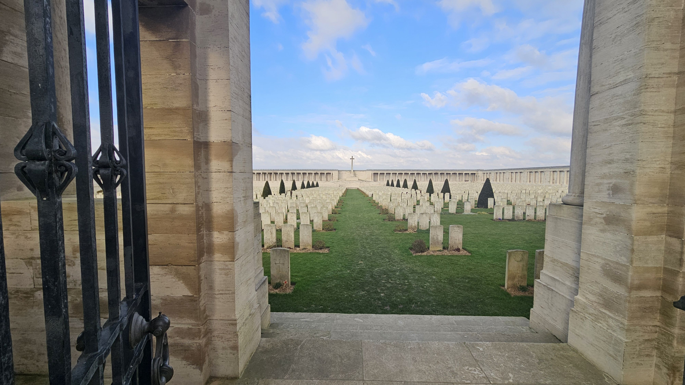

The cemetery contains 2,758 Commonwealth soldiers. There are 272 soldiers from the original cemetery from 1916-1918, the rest of the cemetery contains graves consolidated from other nearby burial locations. There are 151 Canadians buried here, all from the 1916 Battle of the Somme from 15 Sep to 20 Nov 1916.

# Mill Road Cemetery

In a previous visit, I did a post about the Ulster Tower, and the losses of the 36th Ulster Division on the first day of the Battle of the Somme. Although it was near by, we didn’t have a chance to visit the Mill Road Cemetery, just up the hill from the Ulster trenches in the Thiepval Woods just behind the Connaught Cemetery.

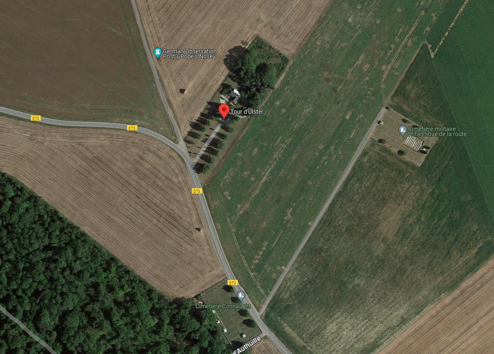

Mill Road Cemetery contained 260 grave markers at the end of the war, but when the bodies from Beaumont Hamel and Thiepval were brought in from the battlefield, and a number of smaller cemeteries in the area concentrated here, a total of 1,304 servicemen are buried or commemorated here, with 815 unknowns.

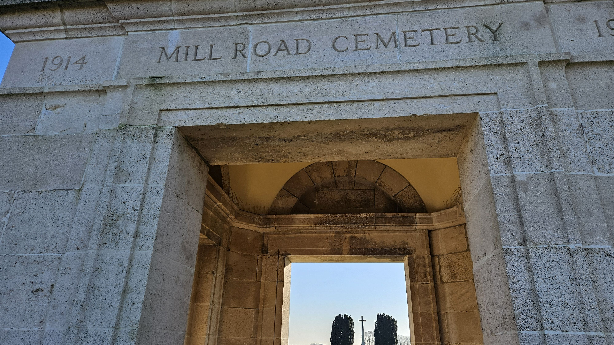

The view from the cemetery down to the Connaught cemetery visible in the oval at the top right of the photo, shows the change in elevation of 30 ft. The cemeteries are just over 500 yards apart, and as was almost always the case, the Germans occupied the high ground, and the Ulstermen had to cross no man’s land in full view of the enemy.

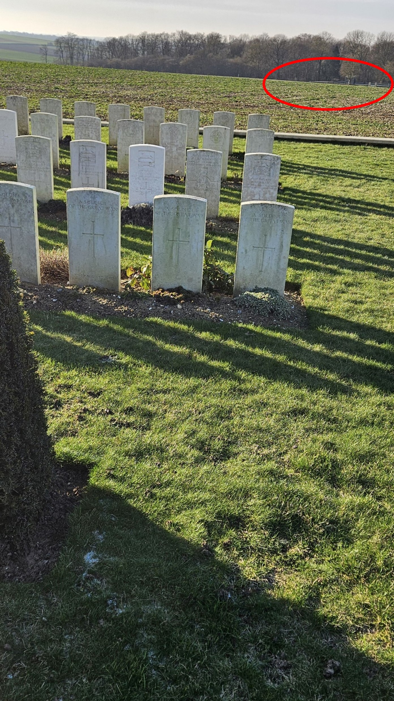

The unique feature of this cemetery is that all of the stones from Plot 1 were laid flat in the 1950s because they were sited over a dugout. The Ulster tower is just visible above the hedge at the left.

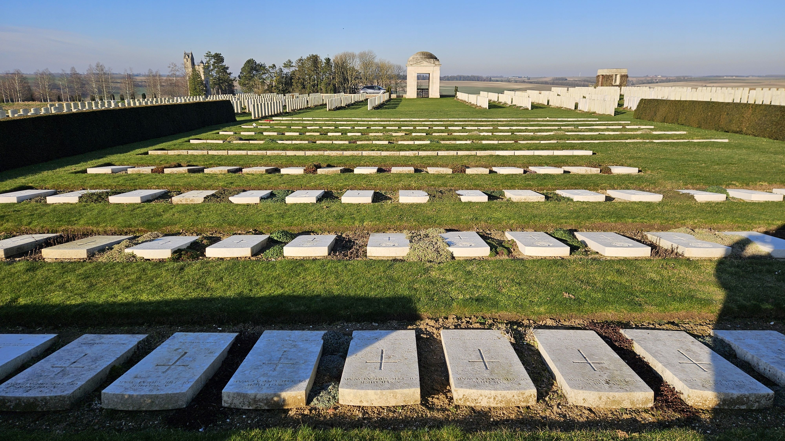

This layout makes the headstones very easy to read.

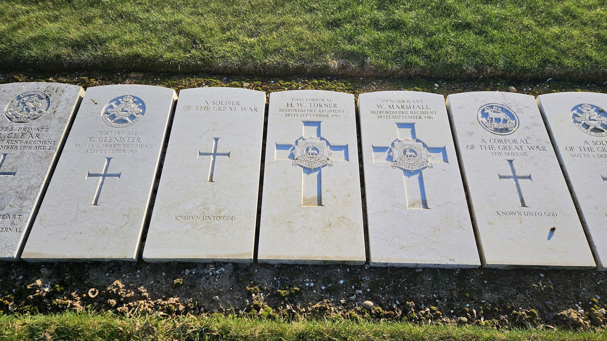

# Tank Corps Memorial

Tanks were first used during the Battle of Courcelette on 15 Sep 1916. The Tank Memorial is located on the main road between Albert and Bapaume near the start line for the Canadian troops.

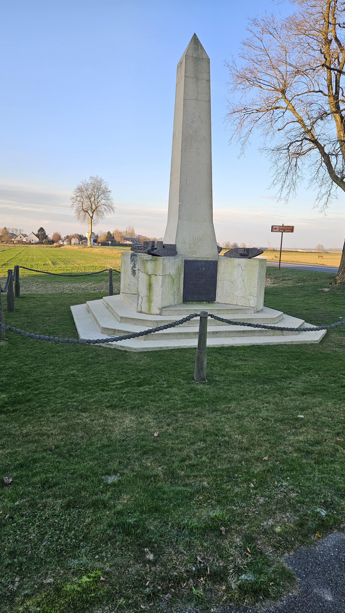

The memorial has 4 different tank models on the corners, and lists the battles that featured tank action.

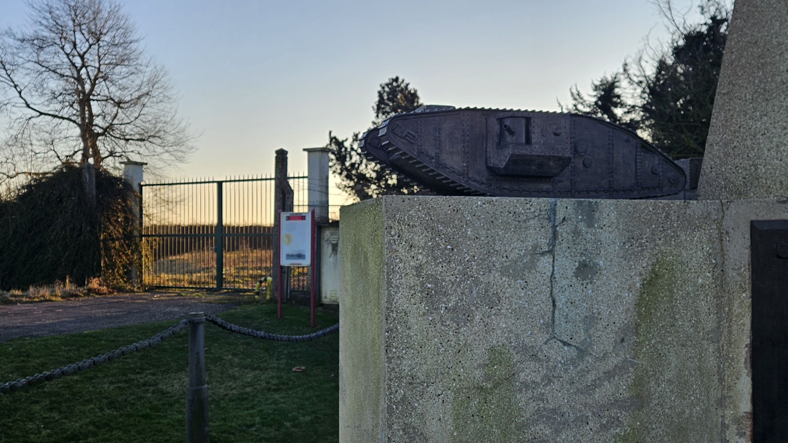

The fence posts are made of gun barrels and the fence is made of a tank drive chain.

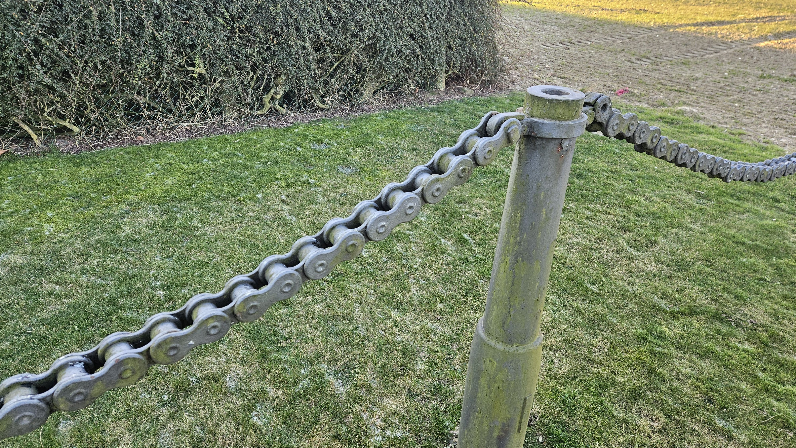

# The Windmill Memorial

The Windmill Memorial is at the site of a former Windmill near Pozieres, the high point of ground around the area. The site commemorates the Australian losses around Pozieres and their attempts to take Mouquet Farm.

The pile of rubble is all that is left of the windmill, but the dominating views from this point show why this was a heavily contested location. The memorial to the Animals of the First World War is in the foreground of this picture.

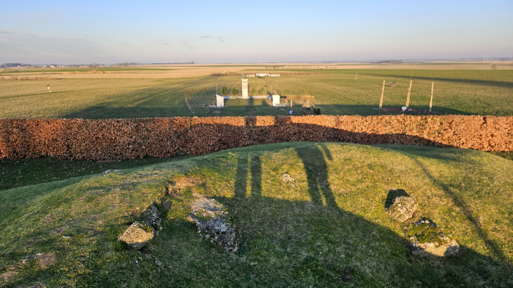

The dedication to the Australian forces is placed on a memorial bench. In 42 days of fighting the Australians suffered 23,000 casualties in 19 separate assaults on the German forces, mainly at the fortified location of Mouquet Farm. The farm was finally captured by the Canadians on 20 Sep, with the farm being retaken by the Germans in a counter-attack the next day.

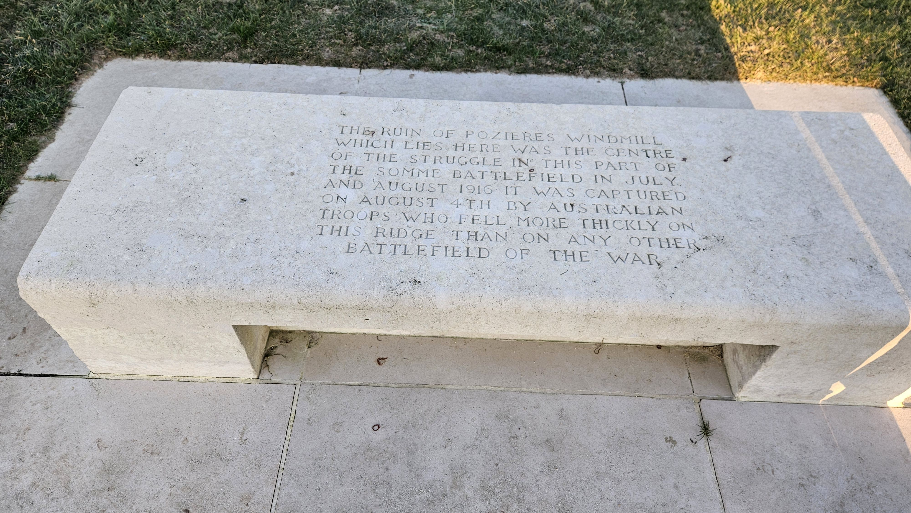

There are several other memorials to the Australians in the region including the 1st Australian Division memorial in Pozieres, and the AIF memorial at Mouquet Farm.

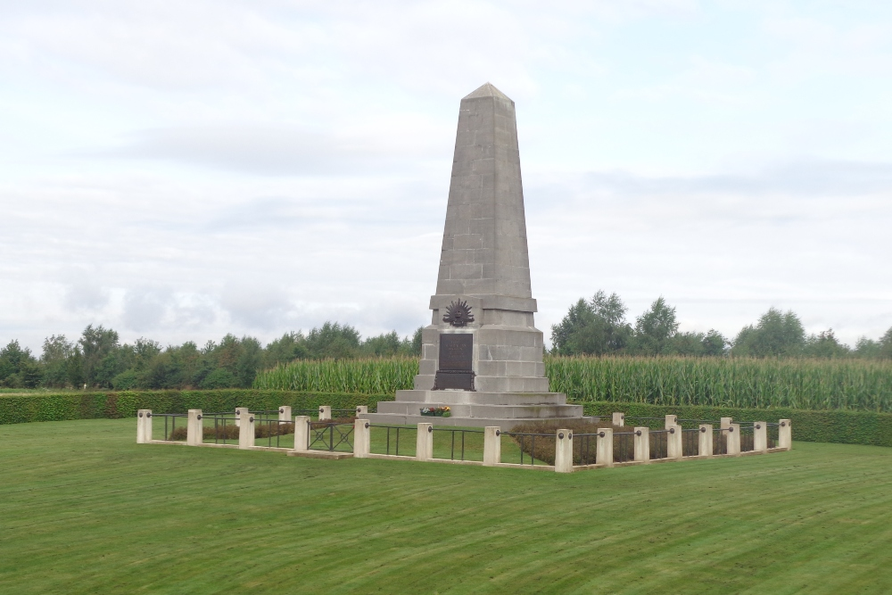

The plaque on the memorial shows a map of the contested area and gives a good idea of the proximity of the sites on the Somme.

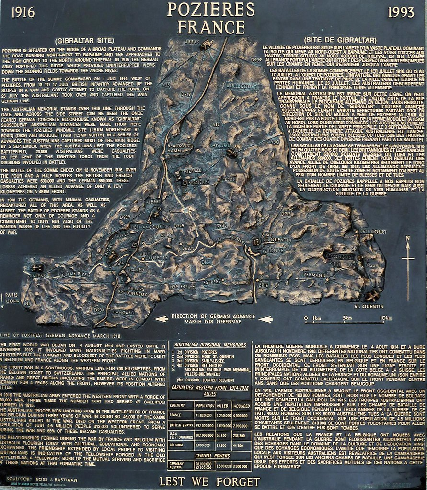

The Australian Imperial Force (AIF) monument at Mouquet farm commemorates the sacrifice the AIR made in attempting to take this location and contains the same map as shown above.

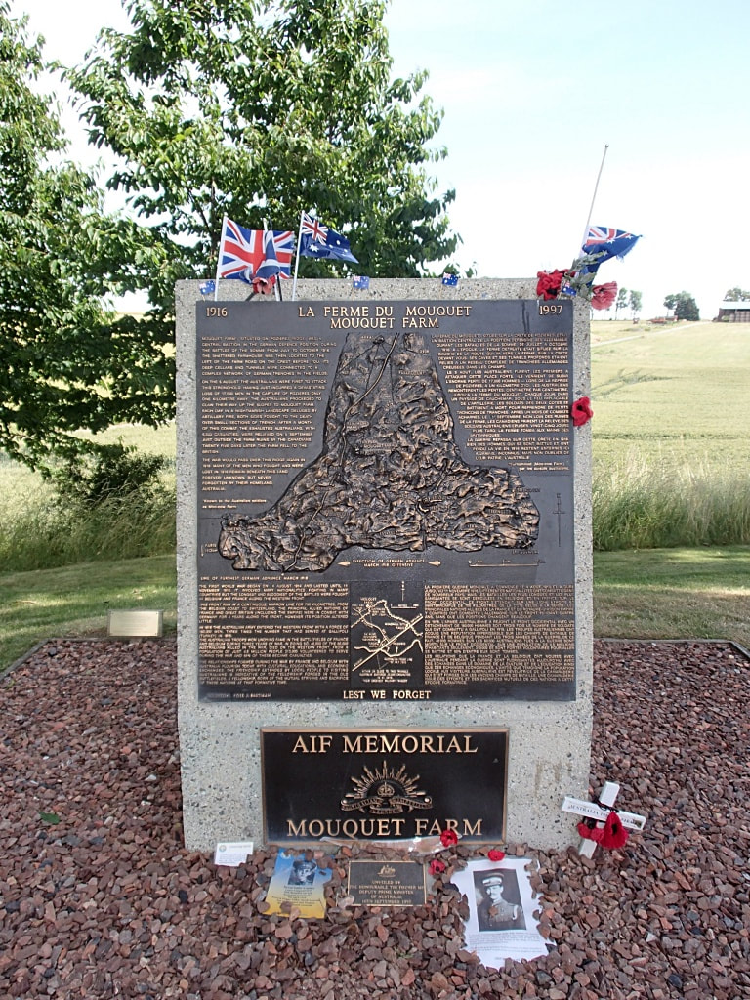

* [First World War](https://www.paulsbattlefieldtours.com/blog/categories/first-world-war)
* [Family](https://www.paulsbattlefieldtours.com/blog/categories/family)