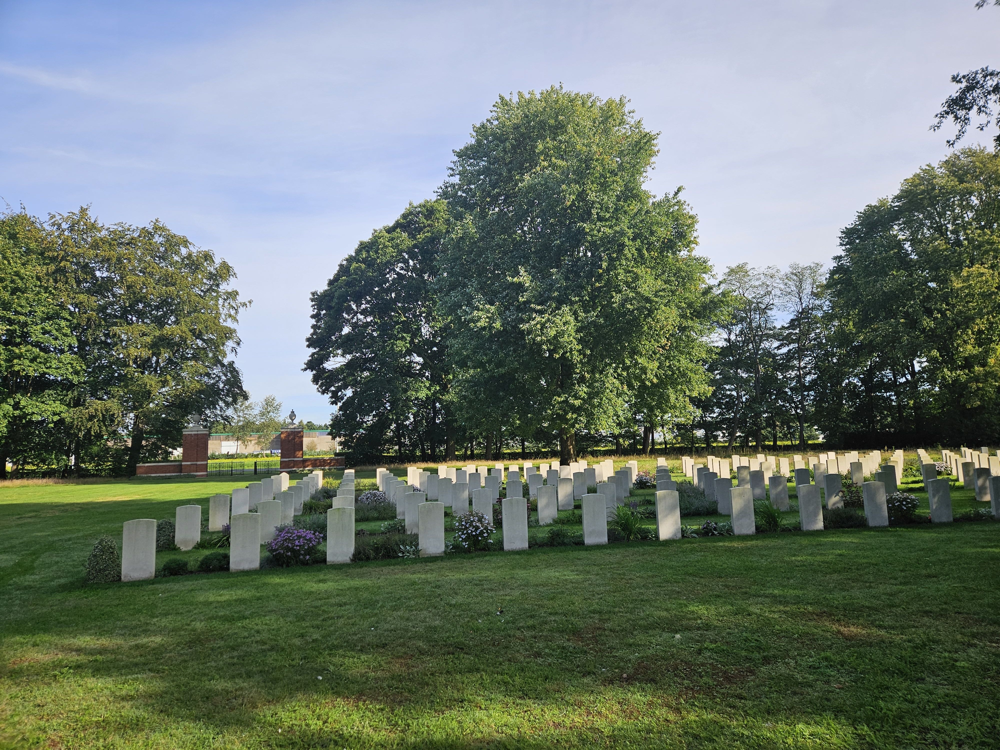
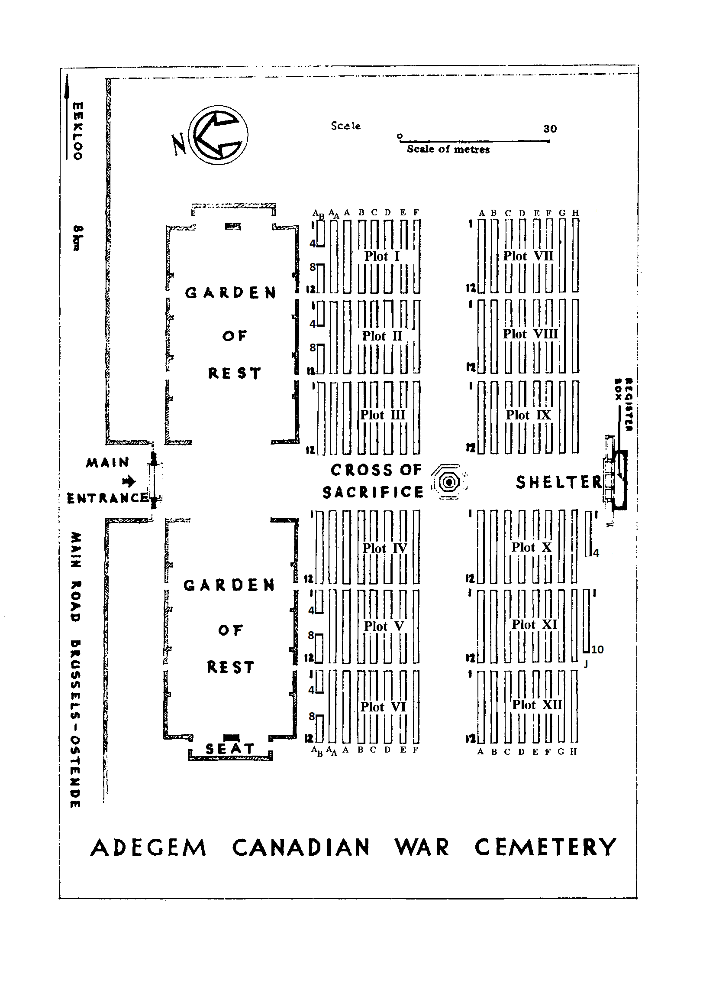
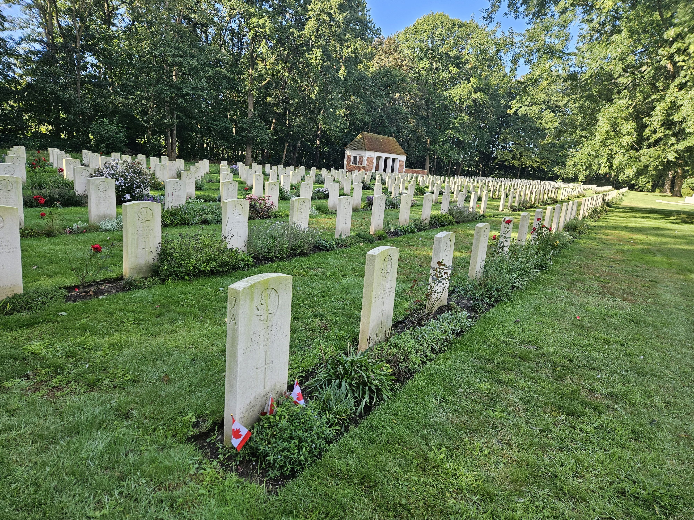
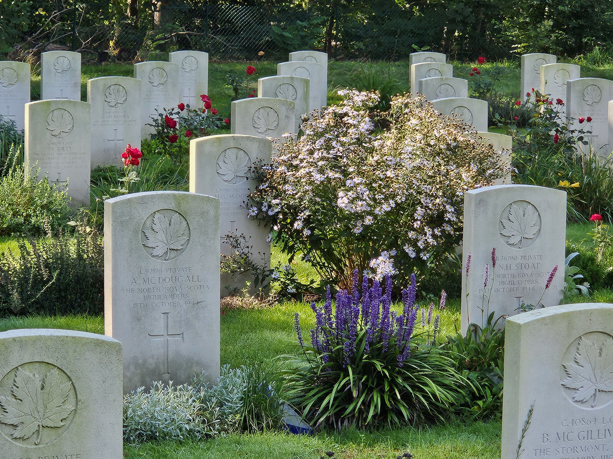
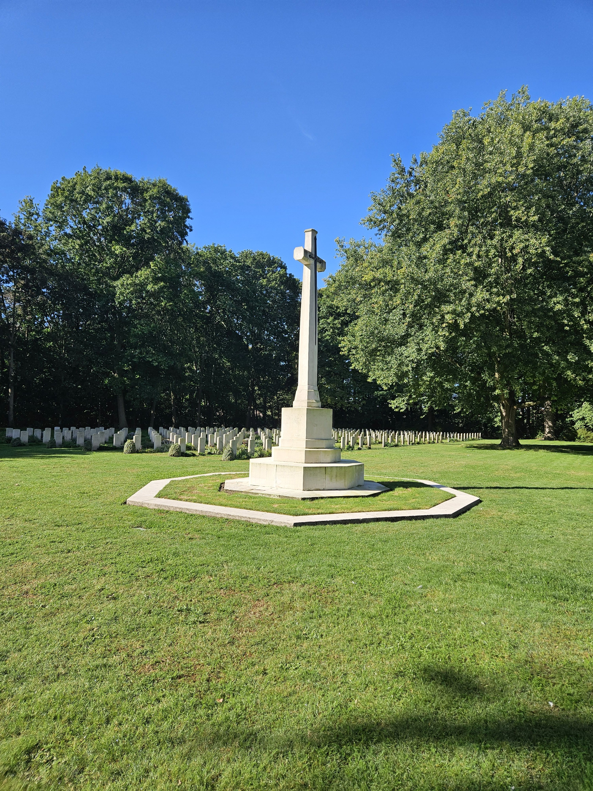

# Adegem Canadian War Cemetery

* [pd-allen](https://www.paulsbattlefieldtours.com/profile/pd-allen/profile)
* Sep 25, 2023
* 1 min read

Updated: Oct 11, 2023

Adegem Canadian War Cemetery

Adegem Cemetery

I visited the Adegem Canadian War Cemetery between Bruges and Gent to pay respects to Joseph Christopher Raymond Cadeau, a cousin to my sister-in-law Marg Allen (Columbus). Christopher was the son of Joseph Cadeau and Marie Ether Columbus of Penetanguishene, ON. I will post Christopher's story separately.

Adegem contains the remains of 1109 soldiers, including 838 Canadians. The bulk of the casualties were killed during the Battle of the Scheldt in Sep-Oct 1944.

The cemetery is ringed by Silver Maples giving it a park-like setting.

Christopher Cadeau was killed on 27 Oct 1944, just outside Breskins, as part of Operation Switchback which was designed to clear out the German presence south of the Scheldt Estuary, the entrance to the important port of Antwerp.

Christopher’s head stone is located in section VII Row A1.

Christopher’s Marker is the first one (with the flags).

38 of his colleagues from the Canadian Scottish Regiment are buried here, including 4 killed the same day as Christopher.

As with all the Commonwealth War Graves, flowers abound.

I stayed in the area, and everyone I spoke with was very appreciative of the Canadians who liberated this area of Belgium and the Netherlands.

We honour their sacrifice.

* [Second World War](https://www.paulsbattlefieldtours.com/blog/categories/second-world-war)
* [Family](https://www.paulsbattlefieldtours.com/blog/categories/family)