# Australia's Worst Day - Battle of Fromelles

* [pd-allen](https://www.paulsbattlefieldtours.com/profile/pd-allen/profile)
* Oct 12, 2023
* 5 min read

The Battle of Formelles was fought by the British 61st Division and the 5th Australian Division on 19 and 20 Jul 1916. The Australians had fought at Gallipoli but had arrived in France in Jun 1916, so this was their first engagement in France. The 61st Division was a territorial Division who had only arrived in France in May 1916 and had no battle experience. It was decided to make a diversionary attack at Fromelles to prevent the Germans from moving reinforcements to the Somme Region. Brigade commanders warned of the strong German positions, and reported there were no Germans leaving the area, but the attack was ordered, nonetheless.

The land here is extremely flat, and the one bit of high ground called the Sugar Loaf allowed the Germans to dominate the area and control no man’s land completely. The land was so flat that an observation tour in the steeple of the church allowed the Germans to monitor the troop movement, and as the Australians and British massed in their front-line trenches for the assault, devastating artillery fire killed hundreds of men before the battle started. Inexperienced Australian gunners also compounded the problem as many of their rounds fell short into the Australian Front Line Trenches.

This church was rebuilt after the war but had the same prominent steeple.

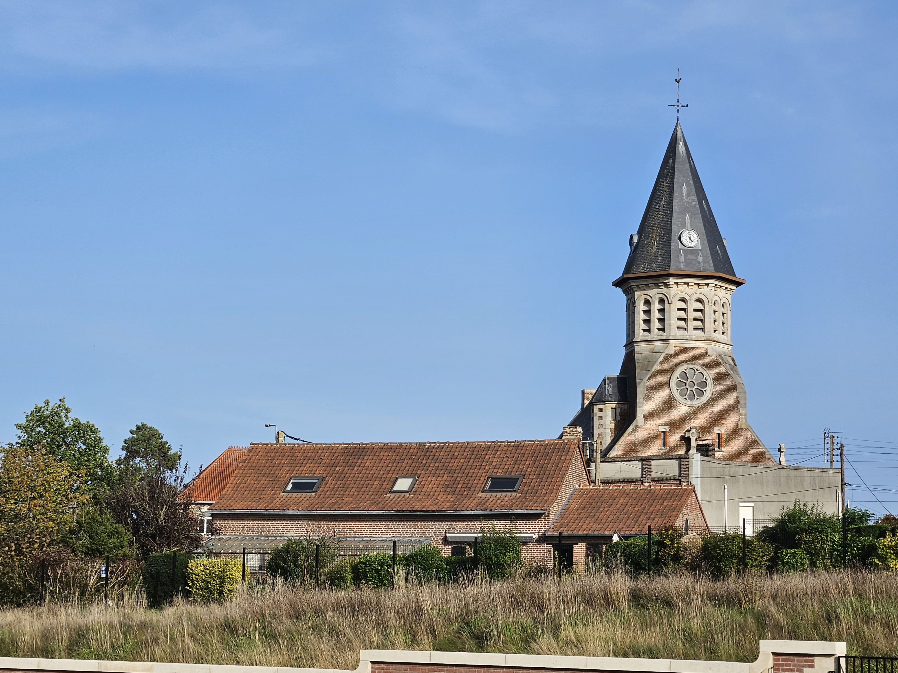

The water table is very high in this area, so traditional trenches could not be dug. Instead, sandbag parapets were built by the Allies.

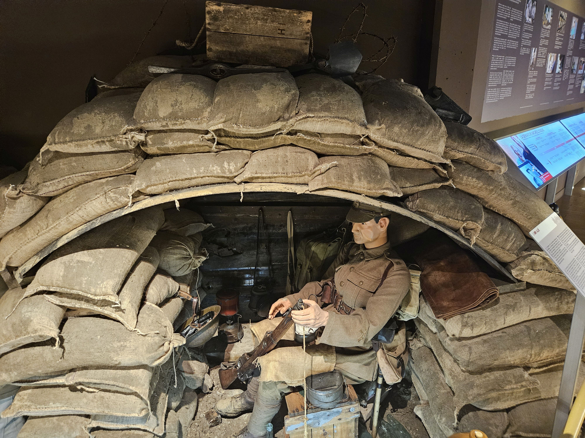

The Germans had been in place since the start of the war, so had built over 700 concrete bunkers for observation and machine gun posts, as well as an intricate series of second- and third-line trenches.

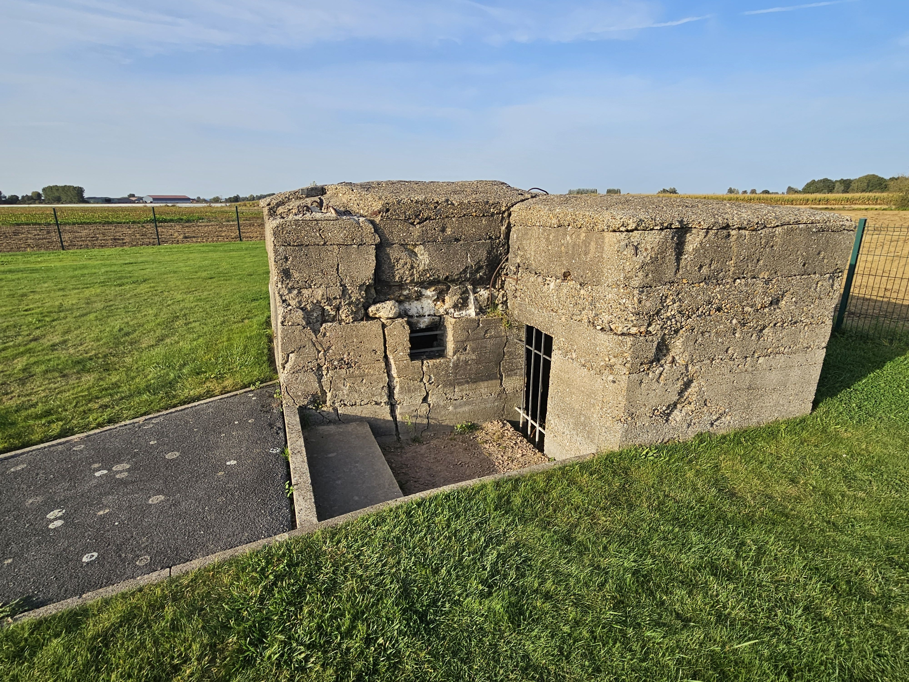

The battle started with a 7-hour barrage, and the attack went in at 6PM. No man’s land was 400 yds wide at the Sugar Loaf, and the Australians were cut down by machine gun fire as soon as they exited the trenches. Wave after wave of Australians were decimated. They eventually got into the first line trenches that had been abandoned, and withstood ferocious counterattacks over night. Finally, the order to withdraw was given at 0500 on 20 Jul, and more men were lost during the retreat.

In less than a 24-hour period, the Australian 5th Division suffered 5,533 casualties with almost 2,000 killed, 1,335 missing and 470 captured. The 61st Division suffered 1,547 casualties. This was the greatest loss by a single division in the War and the most tragic day in Australian Military History. More than 7,000 casualties and not one foot of ground was gained.

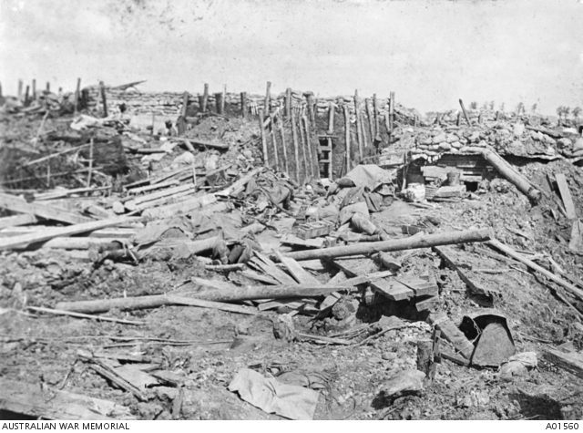

German front line trenches after the failed attack.

At the German second line trench position the Australian Memorial Park is located. The park was opened in 1998, and is located at the point where the German front lines crossed the road.

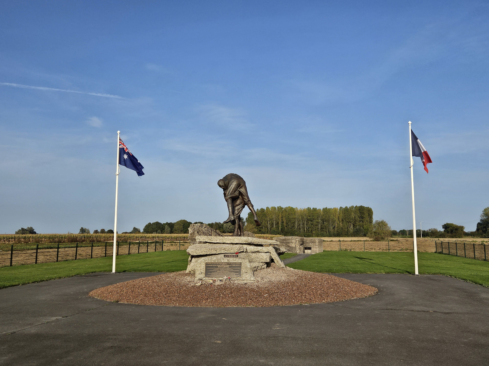

There are a number of bunkers on the site, but the central point is the statue of an Australian soldier carrying a wounded comrade on his back. The plaque quotes a soldier:

*… for the next3 days we did great work getting the wounded from the front and I must say the Germans treated us very fairly, we must have brought in more than 250 men in our company alone.*

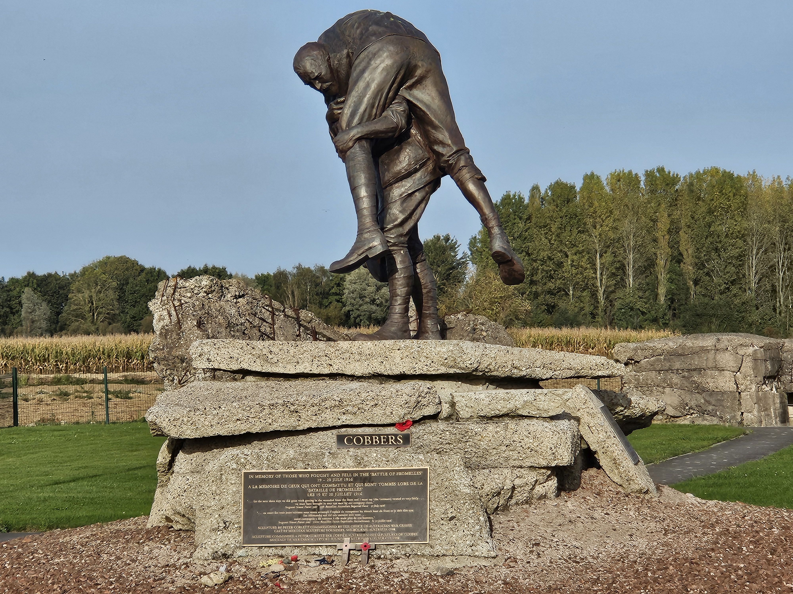

Close up view.

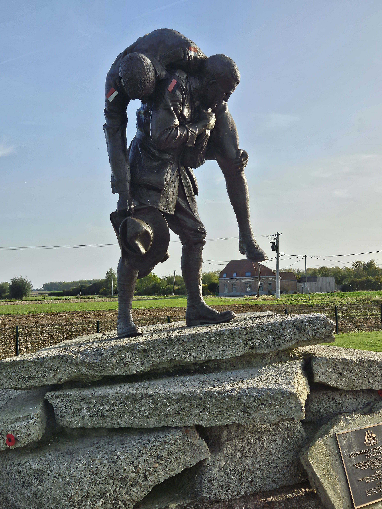

At the going down of the sun and in the morning, we shall remember them.

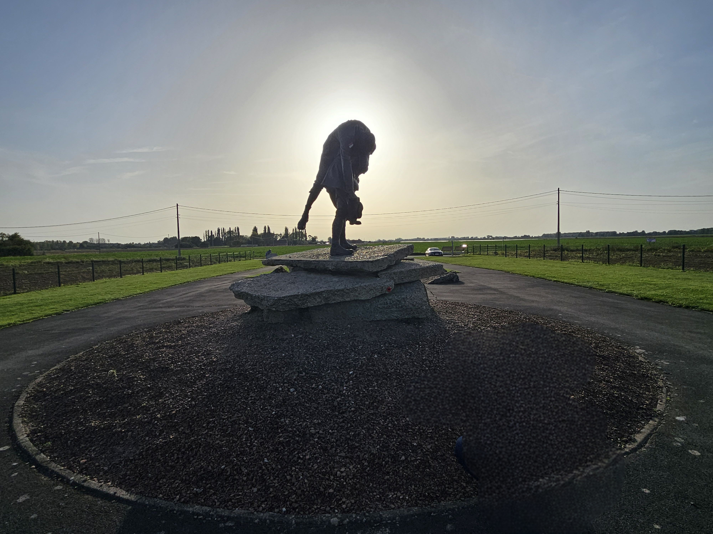

200 m down the road is the VC Corner Cemetery where the Allied lines crossed the road, the only all Australian cemetery on the western front. It is unique in that there are no headstones.

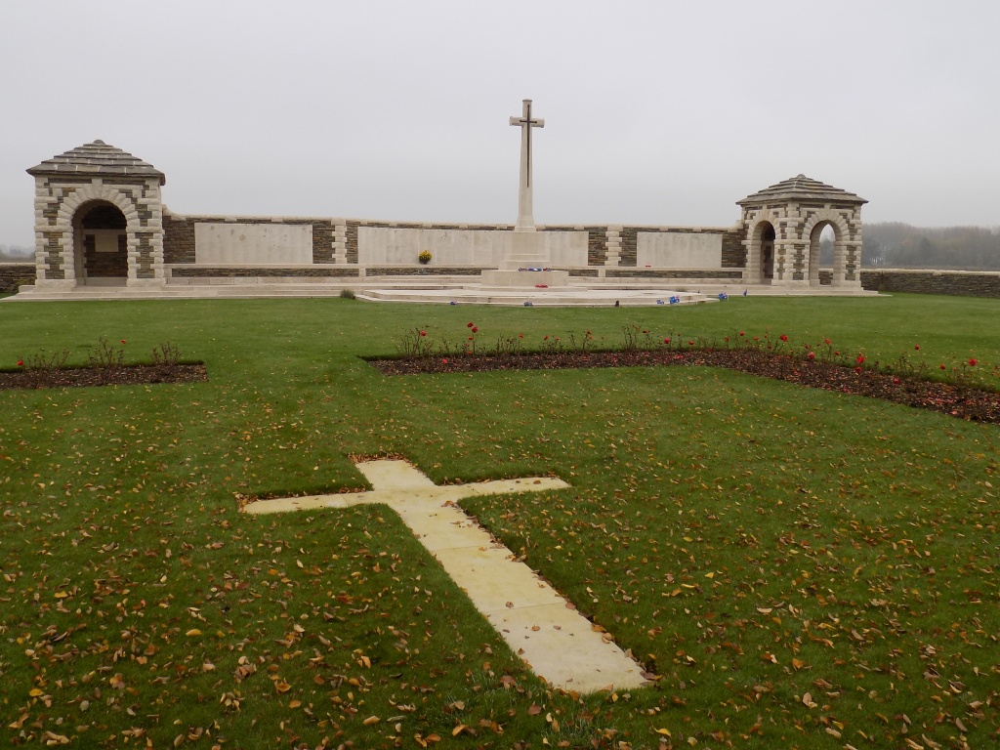

V.C. Corner Cemetery was made after the Armistice. It contains the graves of 410 Australian soldiers who died in the Attack at Fromelles and whose bodies were found on the battlefield, but not a single body could be identified. It was therefore decided not to mark the individual graves, but to record on a memorial the names of all the Australian soldiers who were killed in the engagement and whose graves were not known. It is the point of commemoration for 1,100 Australian casualties.

In 2002 a retired Australian schoolteacher named Lambis Englezos started to research the missing as the numbers did not add up. Due to the number of casualties, the Germans had to clear the front lines, so they dug a collective burial ground, recorded the burials and documented the ID Discs and personal items that were sent back to the families. The area had been searched in 1920, and no grave site found, so the research was treated as circumstantial by an Australian review panel. Finally, a document was found in the German archives for the burial of 400 bodies in the Pheasant Woods area near Formelles. A non-invasive study was done by the University of Glasgow, and the surface scan indicated the presence of bodies. Due to a teacher’s persistence, an archaeological dig in 2009 retrieved the bodies.

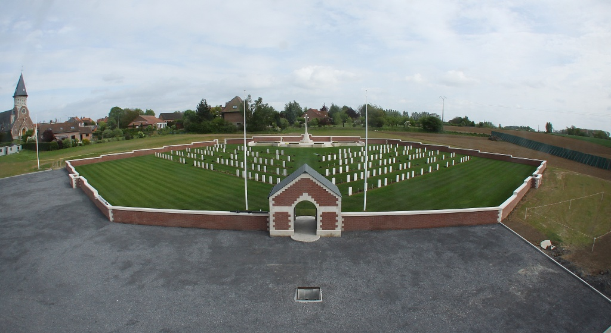

The first new cemetery in 50 years, the Fromelles Pheasant Wood Cemetery was built 200 m from the burial location in 2009. The cemetery contains a total of 250 Australian and British soldiers. 225 are Australians, of which 59 are unidentified, 2 are unidentified British soldiers and 23 are entirely unidentified Commonwealth soldiers.

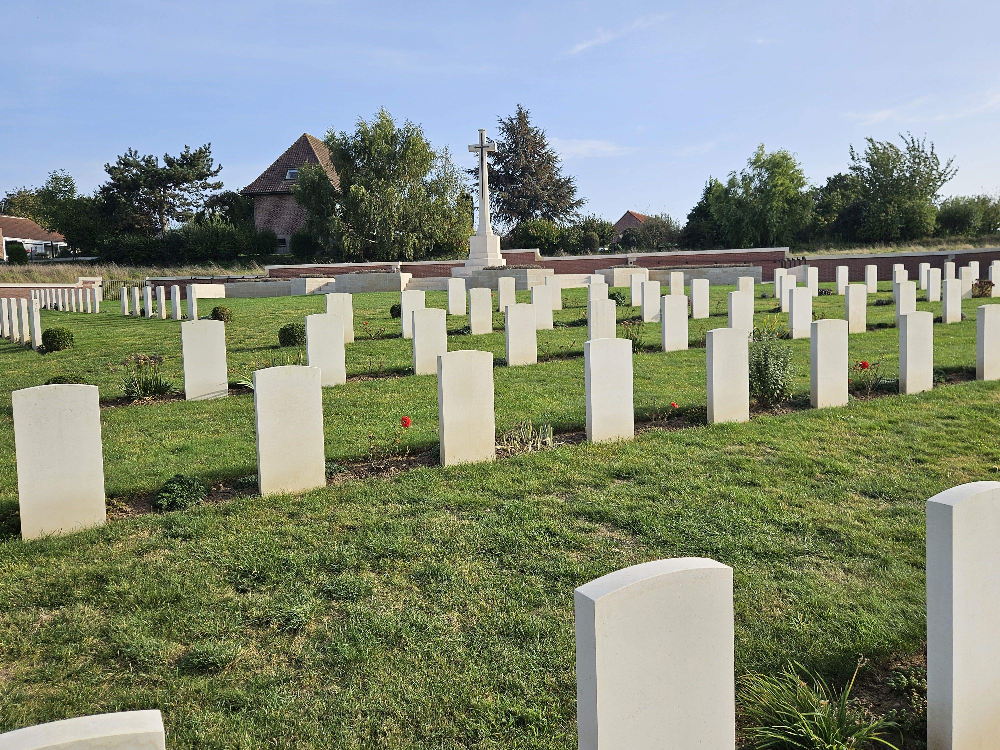

The burials were started in 2010. A wide-spread campaign was undertaken to use DNA analysis to identify the fallen and 166 soldiers were named through the use of DNA analysis. More than 3,000 family members provided data. The analysis is ongoing, as the latest 5 soldiers were identified in April 2023.

It is very disconcerting that all of the men were killed either 19 or 20 Jul 1916. The inscription on Pte Pflaum’s stone appropriately reads:

*I once was lost but now am found.*

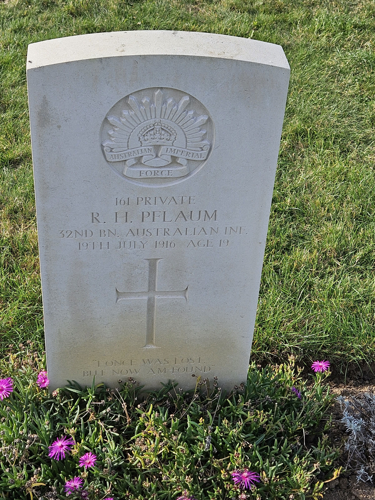

As their initiation at Fromelles showed, Australian soldiers were undoubtedly unprepared for warfare on the Western Front. They had much still to learn, and the lessons would be hard and costly. The major failing at Fromelles, however, lay not with the inexperience of the men but with the piecemeal planning of the attack, which in turn stemmed from the ineptitude of senior commanders. The attack was planned unimaginatively on rigid, linear waves, assaulting on a narrow front over open ground in broad daylight, identical to the disastrous British attack on the Somme on 1 July. As in the attack on the Somme, the plan had no identified and realistic objectives, and it imposed unrealistic demands on both the men and their available artillery support. The carnage on the Somme had not taught their leaders anything.

The battle of Fromelles was a model of how not to attack on the Western Front. It reflected the lowest point of military incompetence in the Great War and signalled how much would need to be learned before the allied armies could achieve victory.

The Australians learned from this disaster, and by 1918, along with the Canadians were the shock troops of the British Empire.

* [First World War](https://www.paulsbattlefieldtours.com/blog/categories/first-world-war)
* [Battlefield Tours](https://www.paulsbattlefieldtours.com/blog/categories/battlefield-tours)