# Battle of the Scheldt

* [pd-allen](https://www.paulsbattlefieldtours.com/profile/pd-allen/profile)
* Sep 18, 2023
* 5 min read

Updated: Sep 19, 2023

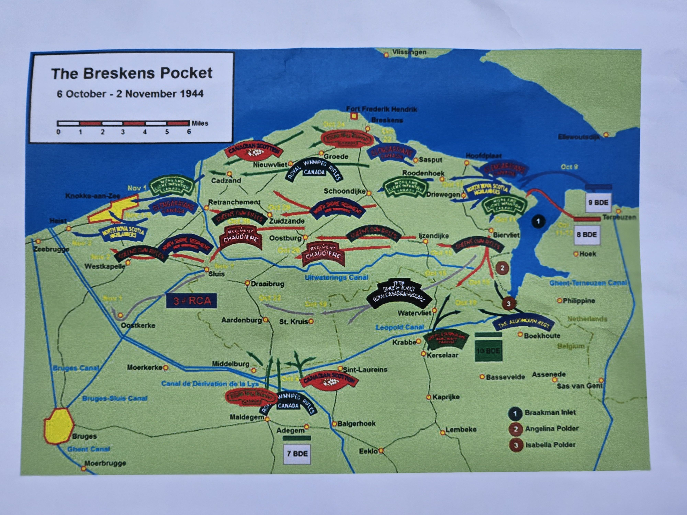

The Canadians were given the task of clearing the Scheldt Estuary, so that the liberated port of Antwerp could be used to supply the Allied Advance, as the Normandy ports were too far away and the long supply lines hampered progress.

The [First Canadian Army](https://www.veterans.gc.ca/eng/remembrance/history/second-world-war/canada-and-the-second-world-war/canarm) in northwestern Europe during the final phases of the war was a powerful force, the largest army that had ever been under the control of a Canadian general. The strength of this army ranged from approximately 105,000 to 175,000 Canadian soldiers to anywhere from 200,000 to over 450,000 when including the soldiers from other nations.

The flooded, muddy terrain and the tenacity of the well-fortified German defences made the Battle of the Scheldt especially gruelling and bloody. Indeed, the battle is considered by some historians to have been waged on the most difficult battlefield of the Second World War. At the end of the five-week offensive, the victorious First Canadian Army had taken 41,043 prisoners, but suffered 12,873 casualties (killed, wounded, or missing), 6,367 of whom were Canadians.

Fighting on the left flank of the Allied forces, the First Canadian Army pushed rapidly eastward through France toward Belgium. September began with the 2nd Canadian Infantry Division being welcomed to Dieppe. The 2nd Canadian Corps left a number of units to guard the heavily defended ports and pushed into Belgium, reaching Ostend, Bruges and Ghent by the middle of the month. By October 1, the port cities of Boulogne, Cap Gris Nez, Calais, and Dunkirk were all under Allied control. The 2nd Canadian Corps had also captured the launching sites of German rockets and put an end to their attacks on southern England.

Our first stop was the Leopold Canal which was a major stumbling block for Canadians. The Leopold Canal is not very wide, but crossing it inflicted many casualties on the Canadians.

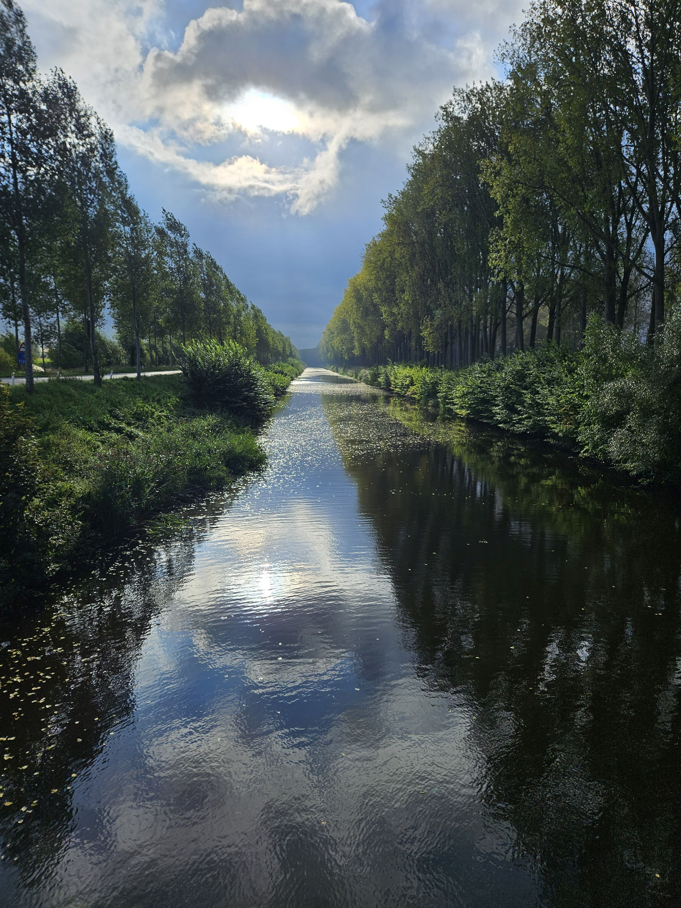

The 3rd Canadian Division encountered tenacious German opposition as it fought to cross the Leopold Canal and clear the Breskens pocket behind the canal. The attack began on October 6 against fierce opposition, and for three days a slender bridgehead was in constant danger of elimination. Finally, on October 9, an amphibious assault broke the enemy's hold on the canal, and the bridgehead was deepened. Troops and tanks crossed the canal and the Germans withdrew into concrete bunkers along the coast. More fighting followed, but by November 3 the south shore of the Scheldt was secured.

Our next stop was a Bailey Bridge that crosses the Leopold Canal. It was originally erected to help the Canadian Scottish Cross the Canal, but was moved a few km after the war, and now is part of a bicycle/walking route.

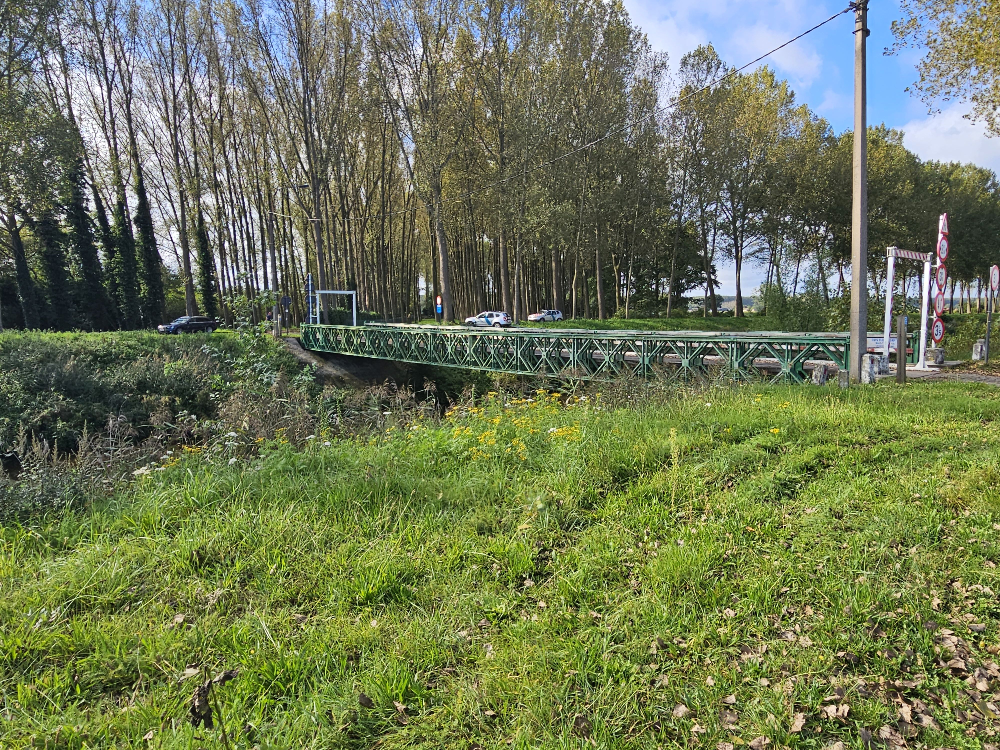

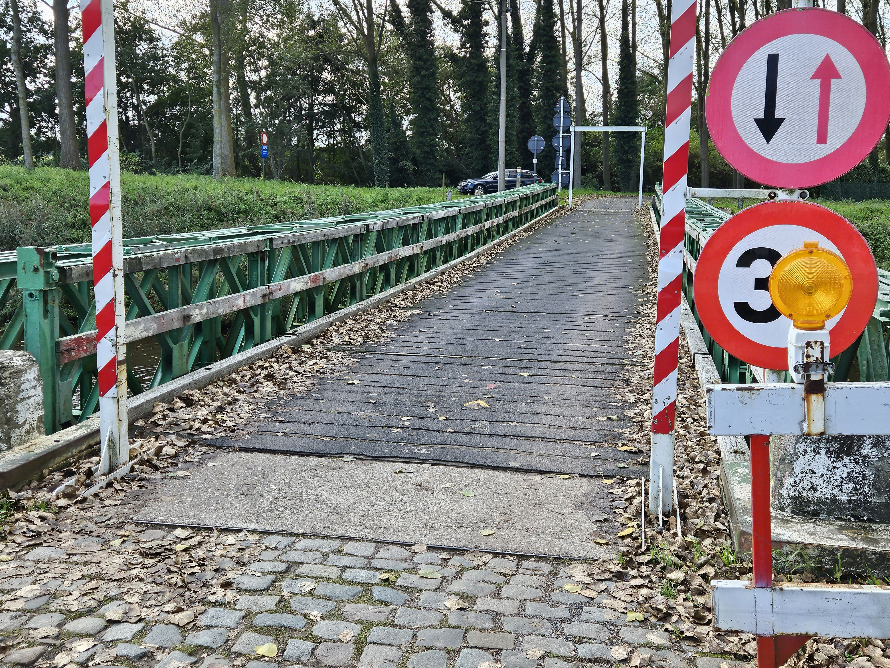

Since this area is all land reclaimed from the sea, it is very difficult tank country as they are restricted to traveling on roads or on dykes, that were heavily fortified and mined by the Germans.

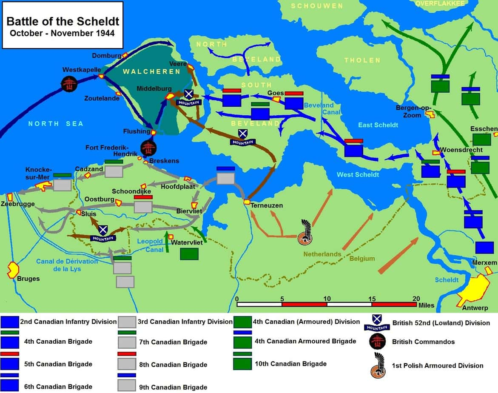

The 3rd Canadian Division attacked from several locations to squeeze the Germans out of the area south of the Scheldt Estuary. Our next stop was Hoofdplat, where the Canadians liberated the city enroute to clearing the area.

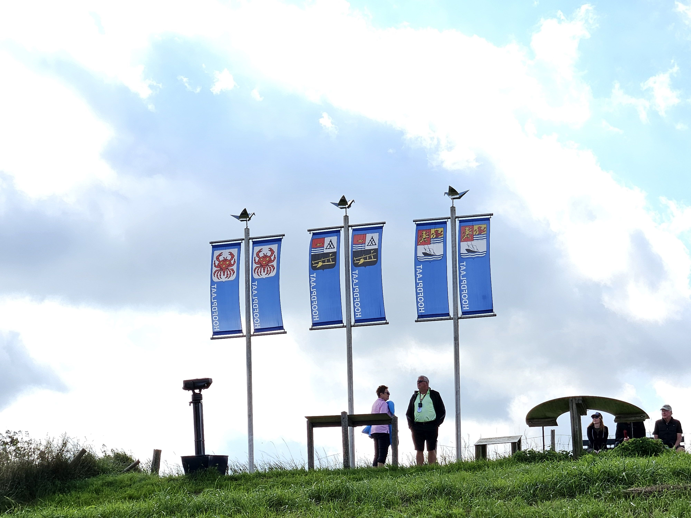

During the Battle of the Scheldt, my sister-in-law Marg Allen's cousin (also cousin to Kathy Peacock) Christoper Cadeau was killed on 27 Oct 1944, just west of Breskens, then temporally buried just outside Hoofdplaat on the sand dunes on the river side of the dyke. We were not able to get to the exact position, but the grid reference is known. He was later reburied at the Adegem Cemetery in Belgium.

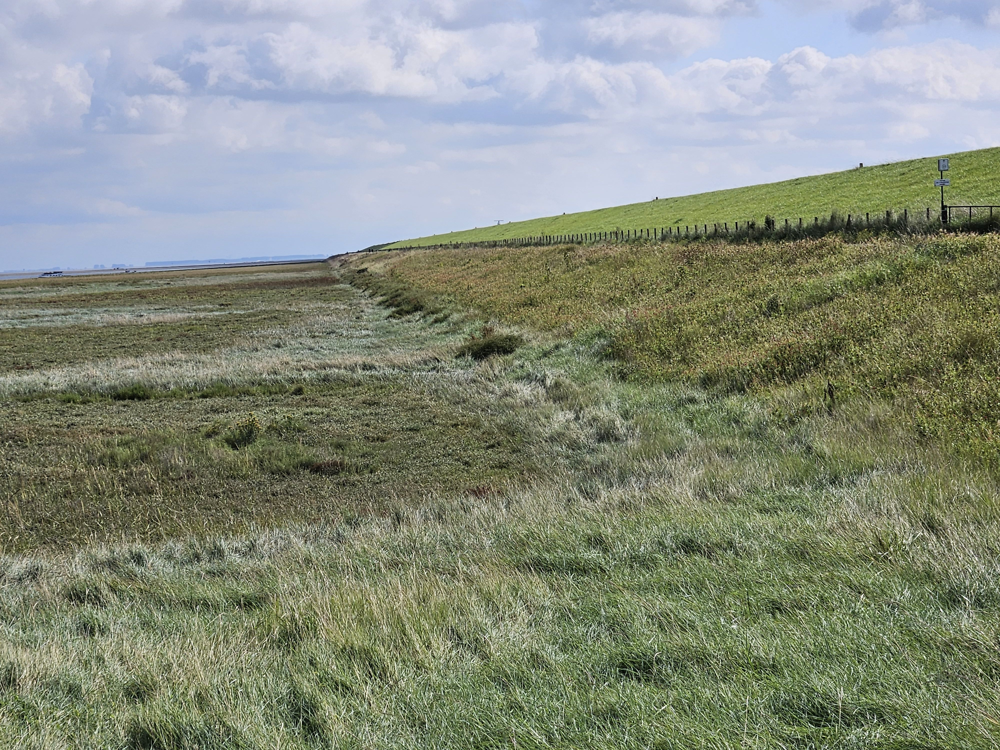

The amazing happenstances of the tour continued. While were were at Hoofdplaat, this lady cycled by, and when she saw we were Canadians she stopped and chatted. She had been a child in the war, and after the liberation of their town Maj Slater of the Black Watch Stayed with them.

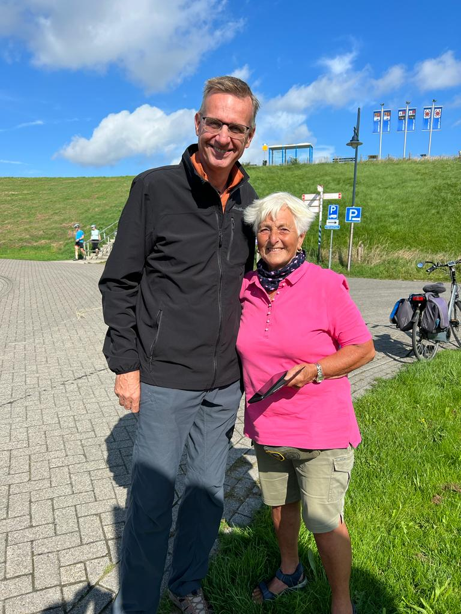

We then left for lunch about a 10 min bus ride away. Just after we were seated, the lady cycled up with her husband, and she took photos with the Canadians. Maj Slater had been killed later in the war, and she had kept in touch with his family, and had visited them in Duncan BC. Maj Slater is buried in the Bergen Op Zoom Canadian Cemetery, which we happened to visit as our last stop of the day, so we got to pay our respects.

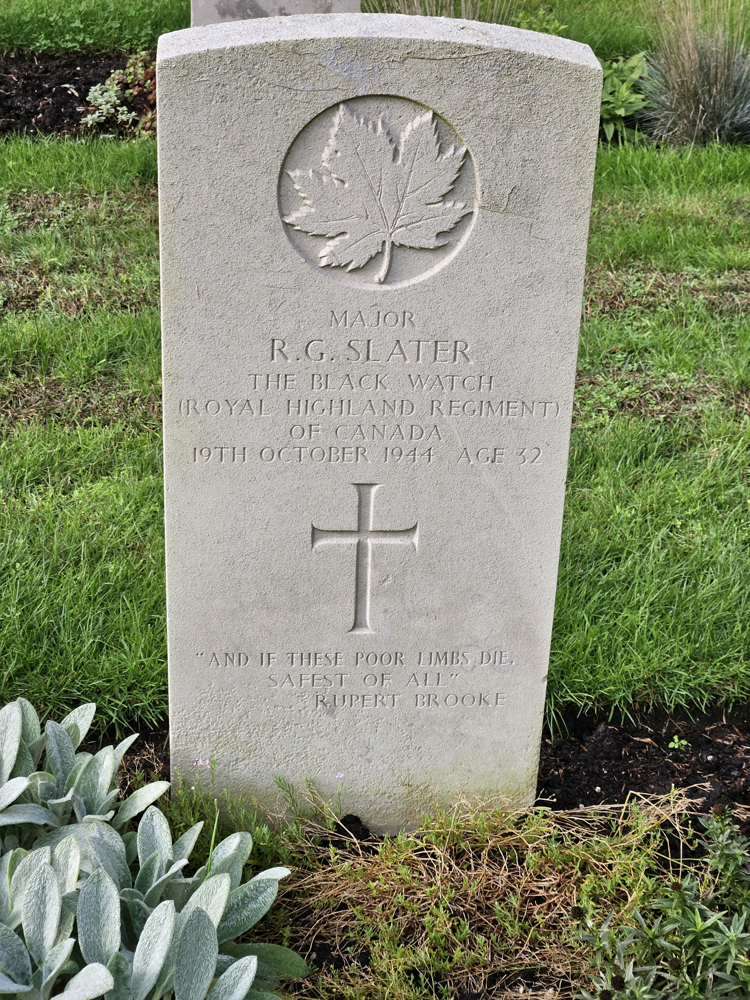

Our next stop was the battle of Walcheren Island. The Canadians had cleared the area south of the Scheldt, but a large island in the middle of the river was occupied. The only access to the island was a raised railway line.

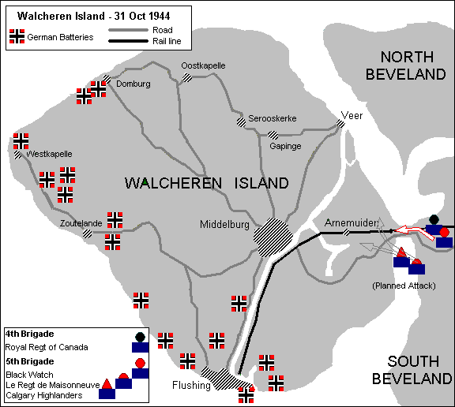

After plans for an amphibious assault on the island were scrapped, the Allies were left with only one option: to access the island via the Walcheren Causeway. On October 31st, the members of the Canadian Royal Highland Regiment, or the Black Watch, would assault the causeway while raining artillery shells upon the German defences. They would make it half way across before being repelled by the German defences. That same day, The Calgary Highlanders would also attempt to storm the island, but they would make it no further than the crater. Those two setbacks would not stand for long.

At dawn the next day, “D” Company (of The Calgary Highlanders) would attack and secure their western objective by 09:33 hours. As the fighting continued, “D” Company would suffer heavy losses, including all of its officers, but the company would hold its position. By the end of the day, the Highlanders would be ordered to hand over their bridgehead to the Le Regiment de Maisonneuve and they would be pulled from the island.

The Calgary Highlanders would lose 64 men during the Battle of Walcheren Causeway, but the event would stand a testament to regiment’s courage, determination, and endurance.

Our last stop was the Bergen Op Zoom Canadian Cemetery.

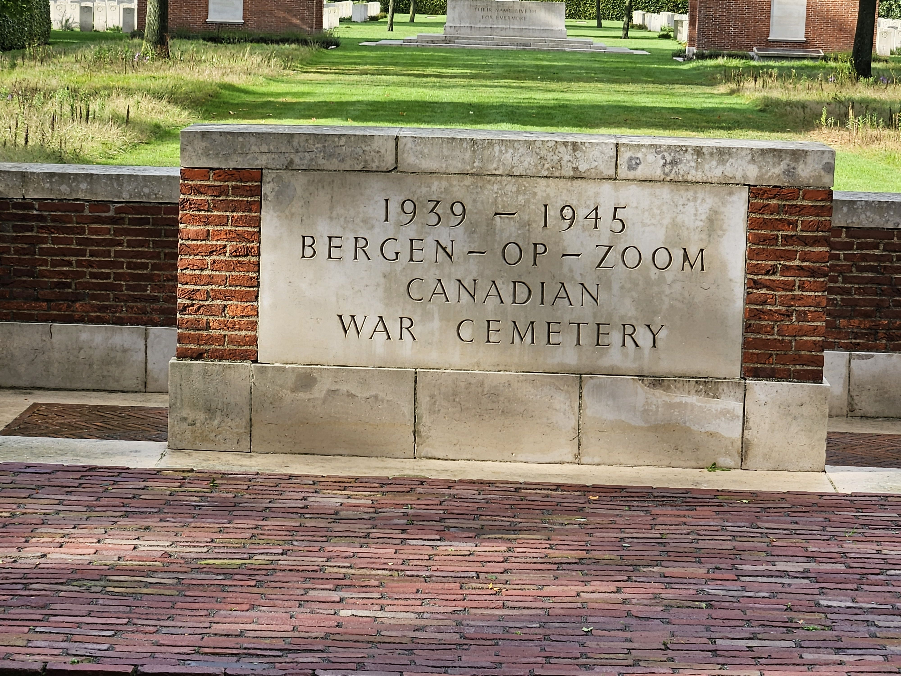

The cemetery has 1115 graves including 968 Canadians. The Bergen Op Zoom cemetery is about 100 yards further down the road with an addition 1296 burials including 45 Canadians.

Whenever touring a cemetery I look for unusual headstones. The first one was a single headstone list 3 RAF aircrew. A bit of research showed they were a Lancaster I crew, shot Down By A Bf110 Night Fighter At Waverveen 2 Miles West of Vinkeveen When Returning From A Raid on Berlin on 30 Mar 1943.

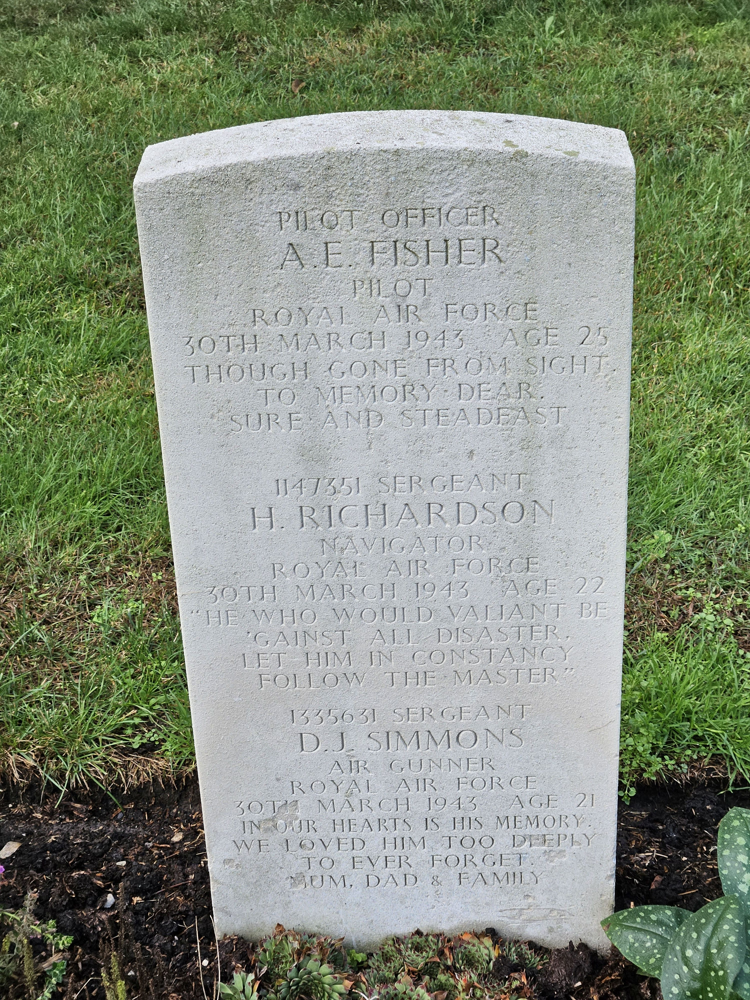

The second oddity was two headstones very close together. That usually means there were 2 casualties, but their remains could not properly be identified.

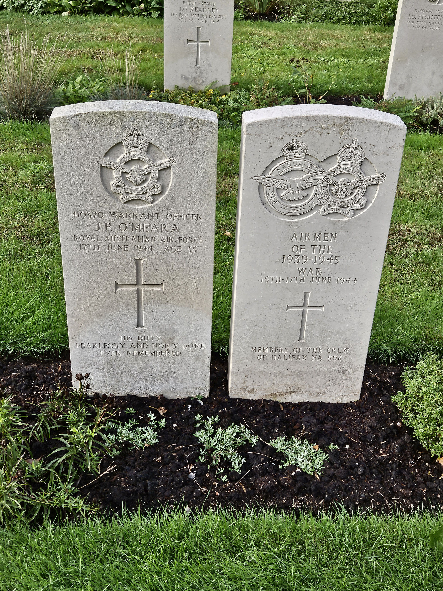

Their aircraft was was Handley Page Halifax RAF NA508 of 77 Squadron RAF, which was shot down on a mission to Sterkrade in the German Ruhr area. All crew were lost. The second marker shows that one of the unknown airmen was Australian, and the other British.

There were 5 Australians on the crew and 2 Brits.

The crew list:

Pilot F/Sgt RA Blair Aus

Navigator Sgt D Moore UK

Flight Engineer F/SGT PG Pratt Aus

Wireless Operator F/Sgt GA Armstrong Aus

Bomb Aimer WO O'Meara JP Aus

Mid Upper Gunner Sgt DG Tustin UK

Rear Gunner F/O JM Date Aus

* [Second World War](https://www.paulsbattlefieldtours.com/blog/categories/second-world-war)
* [Family](https://www.paulsbattlefieldtours.com/blog/categories/family)
* [Battlefield Tours](https://www.paulsbattlefieldtours.com/blog/categories/battlefield-tours)