# Breaking the Gothic Line

* [pd-allen](https://www.paulsbattlefieldtours.com/profile/pd-allen/profile)
* Apr 22
* 22 min read

# Introduction

This Easter, Rachel and I visited Italy, spending the week in the beach town of Rimini. Throughout our travels we have reached an exchange rate of competing interests, this trip we negotiated two days of battlefield touring in exchange for one tiny country.

Rachel is on a quest to visit all the tiny countries of Europe, so most of our tours involve at least one tiny country. This trip included a visit to San Marino, a teeny mountain top town that is completely embedded inside Italy.

Rachel was, justifiably, concerned about driving in Italy. We were mainly going to smaller places so I thought it would be ok. As my high school driving instructor used to say, “Assume the person coming towards you is an idiot and 9 times out of 10 you will be correct!” Well, Italy upped that ante to 100%, not only with people coming towards you, but behind you and beside you. The many roundabouts were the worst as the Italians like cutting across from the inside lane to the exit. There was one young gal on a scooter who came from behind us and cut across to the exit. From the size of her eyes, she found the Lord that day, as it was only because of some great defensive driving by Rachel that she did not become a hood ornament.

The first day of Battlefield touring involved following Uncle Norm Kightley, a tanker in the 8th Hussars as they broke through the Gothic Line near the Adriatic in September 1944.

After a brutal fight up the Liri Valley, the Hussars and the 5th Canadian Armoured Division spent much of the summer in Volturno, about an hour north of Naples, resting, rebuilding their staff and training for a fall push up the eastern coast of Italy.  After a rejuvenating summer, the Division removed all the markings from their uniforms and vehicles and moved across the Apennines to disguise the Canadian movements.

This is the Hussar’s Route in Eastern Italy that we followed.

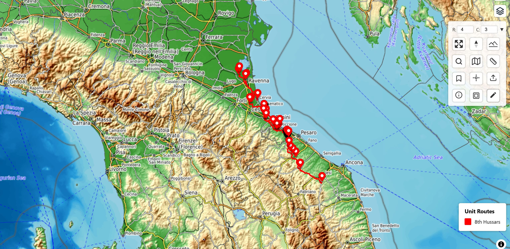

An interactive link is provided [here](https://pd-allen.github.io/docs/html/8thHussarsRimini.html).

# The Gothic Line

## The Battle

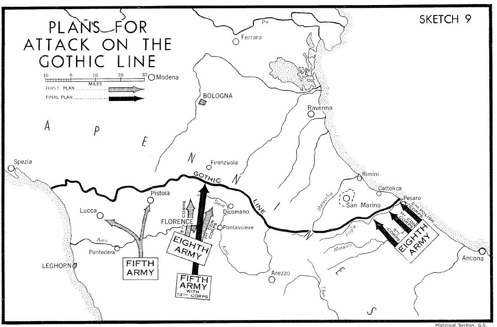

A German report details the Gothic Line as a formidable obstacle. The numbers include installations of 2375 machine-gun posts, 479 antitank gun, mortar and assault-gun positions, 3604 dug-outs and shelters of various kinds (including 27 caves), 16,006 riflemen's positions, 72,517 "T" (Teller, anti-tank) mines and 23,172 "S" (anti-personnel) mines laid, 117,370 metres of wire obstacles, and 8944 metres of anti-tank ditch. Only four Panther turrets however had been completed (with 18 still under construction and seven more projected), 18 out of an intended 46 smaller tank gun turrets (for 1- and 2-cm. guns) were ready, and of 22 Organization Todt steel shelters being constructed, not one was finished.

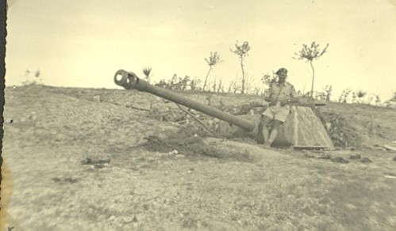

**A photo of a Captured Panzer Turret.**

On 26 August, the 1st Canadian Division opened the attack and after three days of ferocious fighting, destroying three German battalions and reaching the main Gothic line. The Hussars followed behind and waited for the main assault to start a few days later, but infantry patrols on 29 August, prisoner reports and intercepted messages indicated the Germans had been decimated and were unable to man all the defences. The Canadians decided to take advantage and attack immediately.

Norm’s B squadron of the 8th Hussars was supporting the Cape Breton Highlanders, but the rapid change of plans caused massive traffic jams. The Capers ran into heavy fire in their attempt to take Point 120 and B squadron raced through the checkpoint to help out. The area was heavily mined, so the tanks stood off and fired on the Germans while a path was being cleared. The Capers tried three desperate times to take Point 120 but were beaten back each time. The next night C squadron along with the Irish Regiment attacked Point 120 from the back and surrounded the fortress. With heavy fire from B Squadron and the Artillery, the Irish were on the Germans before they could stand up and took the hill and 130 prisoners.

The next night the Cape Breton Highlanders took Monte Marrone and the Irish Regiment moved on to Tomba di Pesaro. The Hussars supported the house-to-house clearance clearing out every machine gun nest threatening the Irish. The Germans pulled back and 1st Canadian Division cleared Monte Luro, and the Gothic Line was broken. The Hussars Maj Ross looked back down the valley and *stated:*

*"From up there, we were at a loss to understand why Gerry hadn't been able to hold the hill indefinitely. Concrete emplaced 88 and 75 mm. high-velocity guns mounted in steel tank turrets were all over the place. They covered every avenue of advance. A great many of them had been captured still intact by Canadian units. They were sited with perfect fields of fire, and it certainly looked as though they should have been able to wipe us out in detail as we crossed the completely open ground. It was the old case of a heavily fortified line being breached in one place and then outflanked. Some of our tanks and infantry were able to get to the tops of the ridges in more than one place. Once there, the German guns couldn't reach them.”*

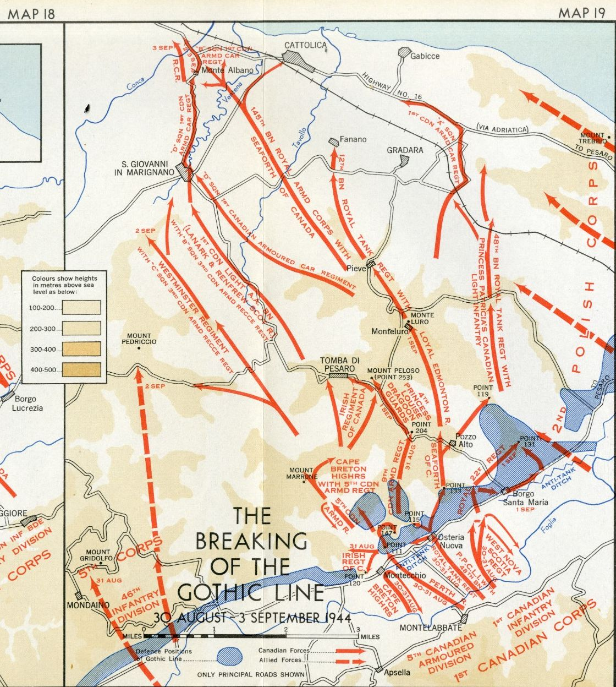

The book New Brunswick Hussar, the story of Corporal Harold Skaarup, who was killed in the Battle of the Gothic Line on 31 August 1944, was written by Harold Skaarup, nephew of the deceased. In Corporal Skaarup’s belongings was a camera with a partially exposed roll of film. The family had the film processed and it contained a number of photos, mostly of Harold’s crew. One of the photos potentially includes Uncle Norm.

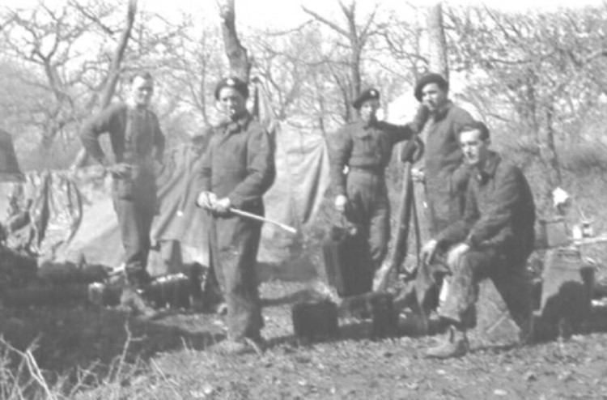

**Harold’s tank crew in the field in Italy. Sherman Allen is the first on the left, [#2](https://www.paulsbattlefieldtours.com/blog/hashtags/2) is M.T. Brewer G522, Harold is third from the left, [#4](https://www.paulsbattlefieldtours.com/blog/hashtags/4) (unknown), and [#5](https://www.paulsbattlefieldtours.com/blog/hashtags/5) seated on the right is “Doc” MacCallum. (This is either Guy E. MacCallum G800, or Vincent G. MacCallum G804).**

We think the unknown tanker second from the right may have been Uncle Norm. The facial features are similar, and his pose is very similar to other family photos according to brother Kurt. So, we are not positive but will claim him until proven wrong. Norm was promoted to Sgt in August 1944, so would have had his own tank by the time that Harold was killed. This is a picture of Norm (on the right) in Italy. Looks the same to me!

The story of the battle from the book New Brunswick Hussar:

*The battle continued for most of the day, but at some time between 0915 and 1030 hours on the morning of the 31st of August, Harold’s tank (a Sherman Mark V nick-named “Acorn”) was hit by a shell fired from a German 88mm anti-tank gun. The shot entered the side of the tank just under the turret and took off both of Harold’s feet. All four of the tank’s crewmembers baled out of the burning tank, but just as they did so, a salvo of German mortar shells (possibly from a six-barreled “Nebelwerfer” mortar) landed in the midst of Harold’s tank crew. Already badly injured, Harold was hit again, this time with shrapnel fragments entering his chest. He was evacuated to a field hospital in the rear area but died from his wounds at the age of 24 on the 6th of September 1944.*

## Montecchio

We started the tour at Montecchio War Cemetery as it is overlooked by Point 120 and Point 111, some of the strongest defences of the Gothic line. Point 120 is the knob of land directly in line with the cross of sacrifice.

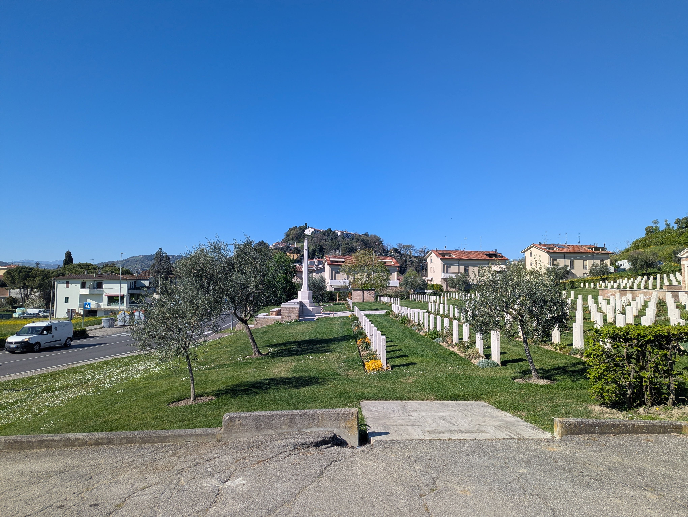

Point 111 is directly behind the cemetery, the memorial is in the middle of the horizon where the flags are barely visible (under the arrow).

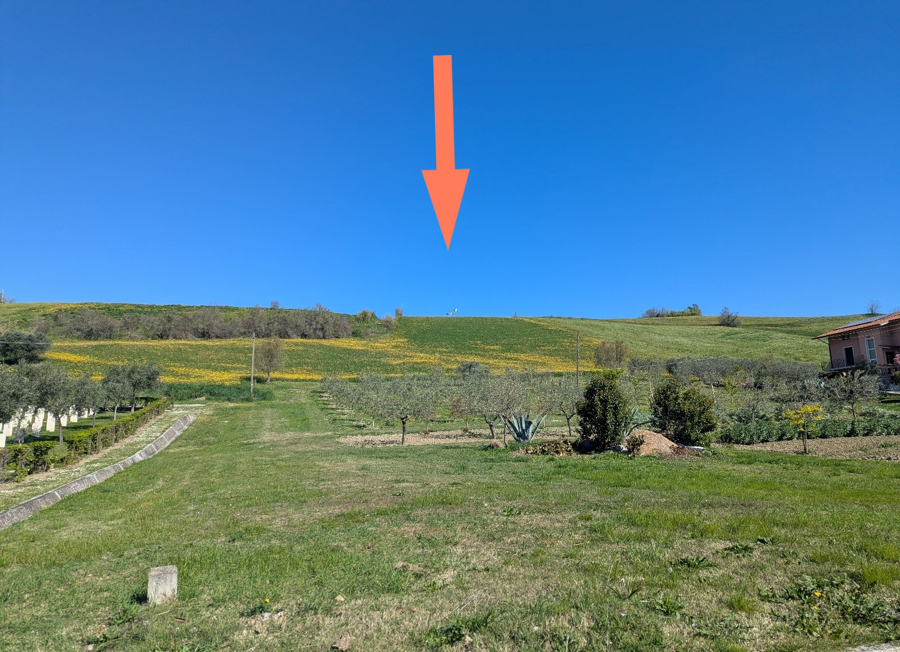

The Montecchio Cemetery has 582 burials, 289 of whom are Canadians. The initial burials were done in Sep 1944, and the remainder consolidated after the war.

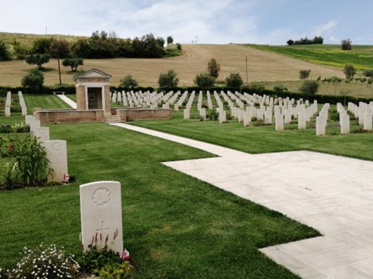

Since Uncle Norm was in the 8th Hussars Armoured Regiment, I took photos of all of the Hussars buried in all of the cemeteries that we visited to honour the fallen.

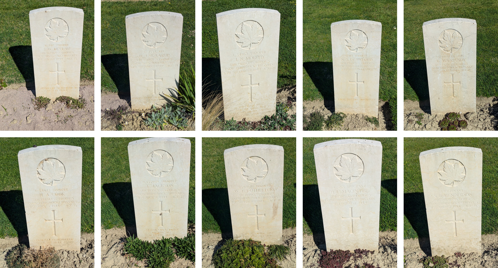

Deveau, Skaarup, Morphy, Crawford, Waniady

Cook, Jackson, Rutherford, MacIntee, Henderson

A view from the back of the cemetery shows the rolling landscape.

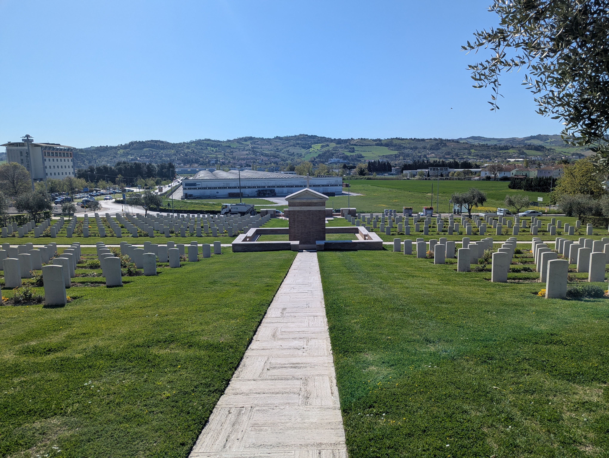

Our next stop was at Point 111, one of the key German strongholds.

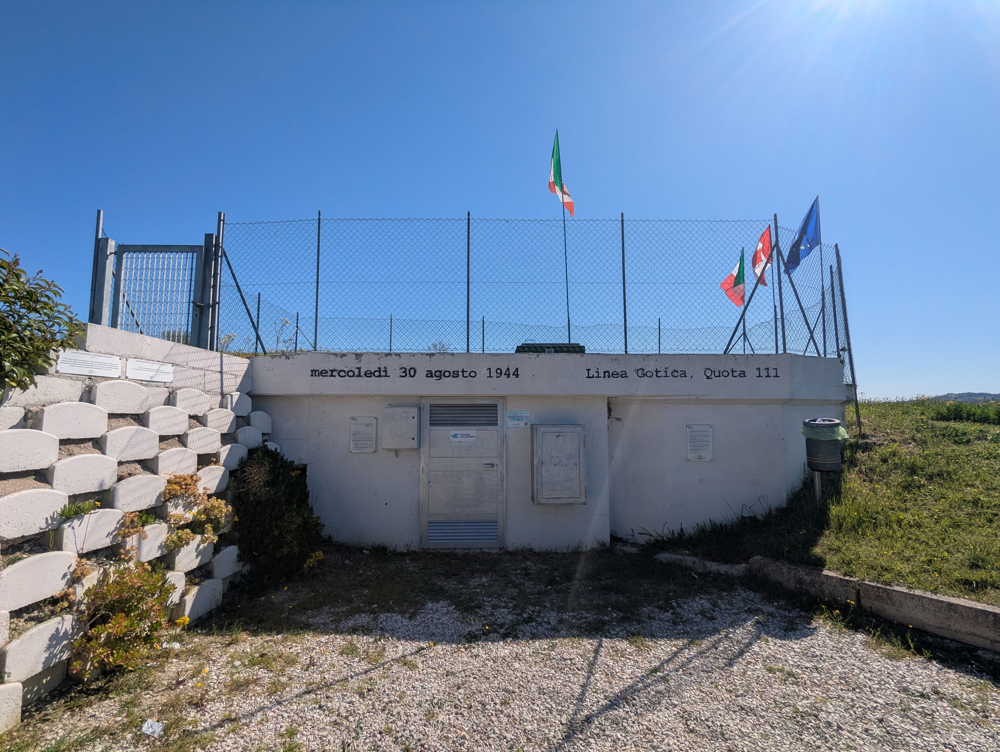

On the wall of the memorial are excerpts from the book by Stanley Scislowski of the Perth Regiment “Not All of Us Were Brave” describing the attack. His book is very interesting as it describes the war from the more prevalent perspective of a soldier who is more interested in surviving and seeing what loot he could collect than saving the world.

*By the amount of racket on the knoll we knew the CBH were having one hell of a rough time. The night echoed to the whole gamut of battlefield noises, the deep crunch of mortar bombs, the muffled thud of grenades, the sharper crack of artillery fire accompanied by the steady clatter of machine-gun fire, ours and theirs. The mortar bomb blasts in particular, were so earsplitting loud I had to believe that Jerry had brought up his heaviest howitzers to unload their fortress-busting hardware onto the boys from the Bay. Every time one landed you’d swear the very hill was being ripped apart. Finally Sammy gave the magic word: “Okay, up we go!” This was our first bayonet charge.*

*With our spike bayonets fixed, full mags in weapons, safety catches off and rounds up the spouts we went up, leaning into the slope, which was a lot longer than it appeared from the road. Halfway up I felt my thighs and calves tightening from strain. Everything quiet up above. But not for long. The Jerries awoke to the fact that something was amiss, that the Canadians were across the big ditch and moving in on them. They cut loose with their Spandau. We hit the ground as the quick, short bursts sliced through the air inches above our heads.*

*Who was going to be the big hero? I didn’t think it’d be me. Yet I could feel a growing urge to leap up and make a one-man charge to take the gun out. “Here’s my chance for the Victoria Cross.” But, as much as I dreamed of being a one-man army, I had sense enough to know I’d never make it. And so, like the others around me, I lay there glued to the ground, wondering who’d be crazy or brave enough to get up and go. Only a sudden uncontrollable impulse would stir me into heroic action. That impulse never came. Instead I buried my nose deeper into the thick grass, bracing my body against the 7.92mm rounds that at any second might punch holes in me from head to toes. I felt so inadequate, so helpless. By the same token, there were apparently no other potential VC types around on Point 111 slope that night.*

*And then it happened. From close behind us I heard Sammy Ridge give out a bellow of orders. I couldn’t make out exactly what he was hootin’ and hollerin’ about but it sounded like, “Come on Dog Company, up and at ’em, what the hell are you waiting for?” I raised my head high enough to take a sidewise glance and saw someone off to my right a short ways stand up. And then right next to him somebody else got up. And then, as if by magic, the whole company was up and moving. No one now had to tell us what we had to do, we knew what our job was. “Take the high ground!” Up we went. The man at the trigger squeezed off a burst again, but this time, though we must have made better targets, no one was hit. Another miracle. And with me hardly knowing it, all of a sudden we were going up that last fifty yards as fast as the slope and the strength and endurance of our legs allowed, with everyone hooting and hollering at the tops of their lungs. To this day I can’t be sure the noise I made was from blood lust or fright. Maybe a little of both. Anyway, the vocal racket we made going in with the bayonet was, as we were later told, loud enough for our people a way back at the Foglia River to hear us. I guess it served its purpose because it took all the fight out of the Jerries.*

*A surge of exhilaration and extreme excitement swept over me. For that moment, at least, I’d forgotten what fear was. In fact I felt so full of piss and vinegar, I actually felt like I could do this every day. As we hit a five-foot forty-five-degree incline directly below the Jerry gun position, a grenade went off with one hell of a bang knocking me and Thomas ass over teakettle. Whether it was one of ours or the enemy’s I couldn’t tell. But neither of us had been hurt, and we bounced right back up on our feet and went up and over. But there was no bayonet work or trench clearing of any kind to do. A trench full of Jerries were standing there with their hands high, all crying out in unison, “Kameraden! Kameraden! Kameraden!”*

*A beautiful sight. Once the prisoners were rooted out of their dugouts and the hill secured, we got ourselves ready for a counter-attack, which we felt sure would come inside the hour, or at first light. We’d taken Point 111 and were pretty damn proud of ourselves. After all, Dog Company was the first unit in the Corps to take its objective. In seizing Point 111, we got the ball rolling not only for the regiment, but also for 11th Brigade and subsequently for the Corps itself. Within the hour, Major Jack Tipler’s Able Company passed through our foothold, and in a classic example of a left hook took Point 147 some three hundred yards to the northeast.*

*Stanley S at the dedication of the memorial in 1997.*

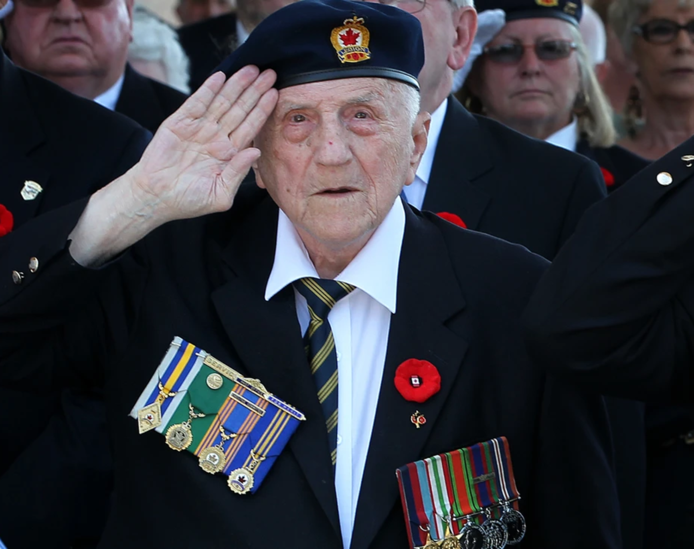

There is a plaque at the site. The quotes are from Stanley Scislowski (above) and from War Correspondent Maria Gellhorn:

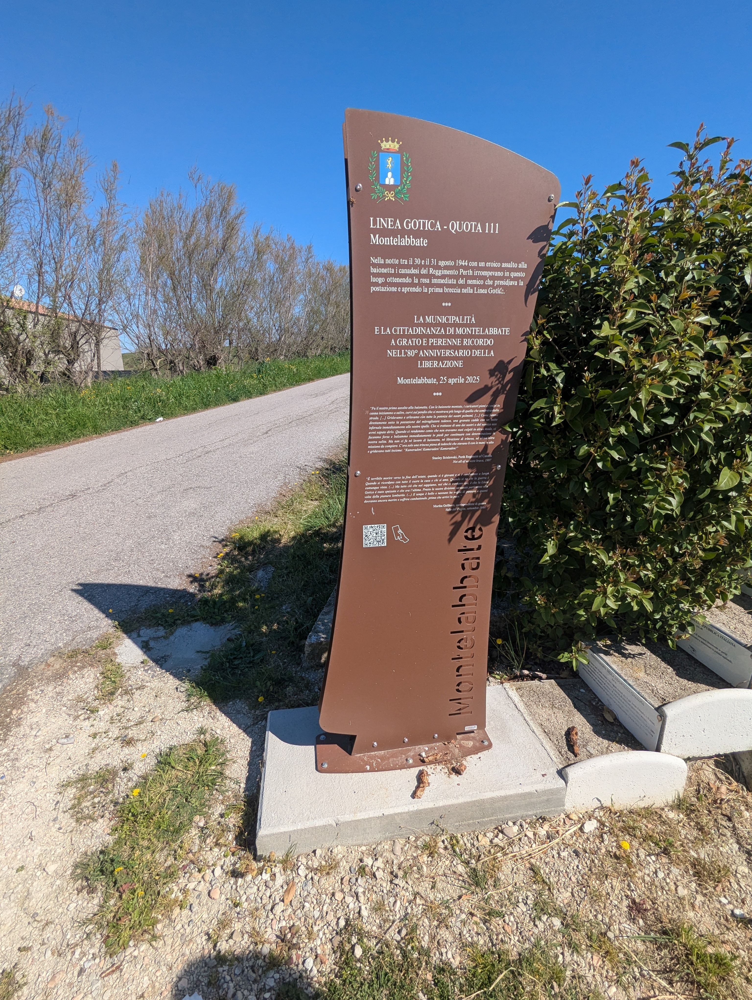

*"It is terrible to die towards the end of summer, when you are young and have fought a long time. When you remember with all your heart your home and those you love. When you know that the war is won anyway. (...) But all we know, we who are here, is that the Gothic Line has been broken and that it was the last. Soon our armored divisions will leave for the Lombard plain. (...) The weather is beautiful and no one wants to think of how many more will have to die and suffer fighting, before peace comes."*

The view from Point 111 shows how the location dominated the valley. The Cemetery is in the middle right of the picture. The hill is only 50 metres above the cemetery but controls the entire area.

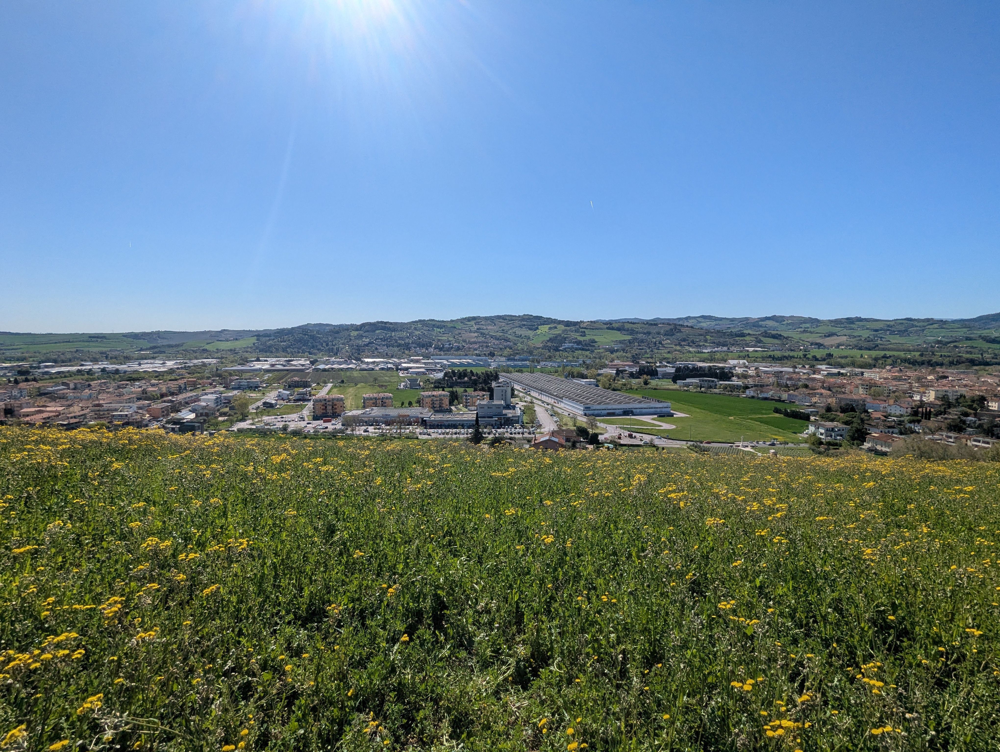

Rachel standing guard over the valley.

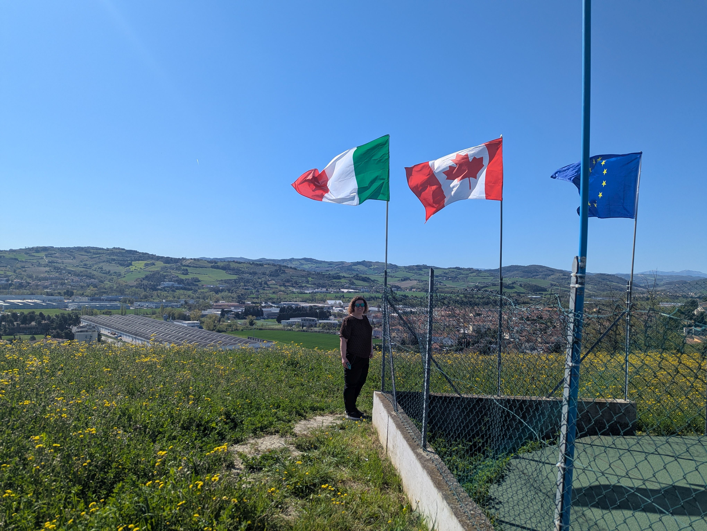

## Point 204

Point 204 is one of the few Canadian memorials on the Gothic Line route. The memorial was dedicated in 1997.

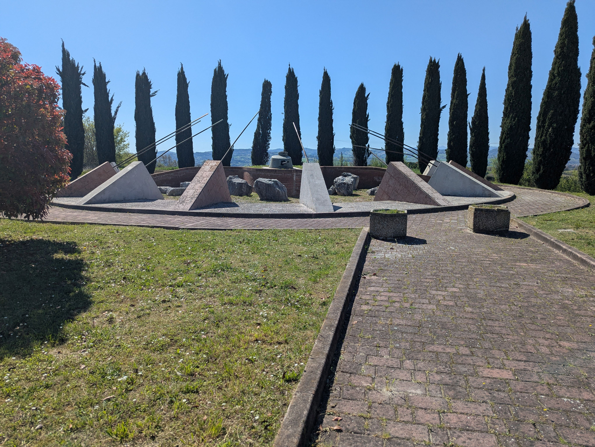

There are several plaques on site.

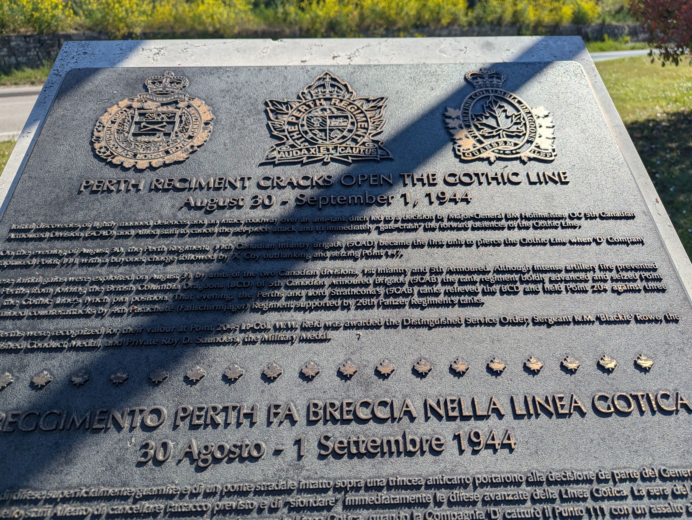

**Perth Regiment Cracks Open the Gothic Line**

**August 30 – September 1, 1944**

Initial discoveries of lightly manned defences and an intact roadway over an anti-tank ditch led to a decision by Major-General B.M. Hoffmeister, GOC 5th Canadian Armoured Division (5CAD), and Allied staff to cancel the set-piece attack and to immediately "gate-crash" the forward defences of the Gothic Line.

On the evening of August 30, the Perth Regiment, 11th Canadian Infantry Brigade (11CIB) became the first unit to pierce the Gothic Line when 'D' Company captured Point 111 with a bayonet charge, followed by 'A' Coy outflanking and seizing Point 147.

These initial gains were exploited on August 31 by units of the two Canadian divisions; 1st Infantry and 5th Armoured. Although intense artillery fire prevented the Perths from joining, the British Columbia Dragoons (BCD) of 5th Canadian Armoured Brigade (5CAB) the tank regiment boldly advanced and seized Point 204, the Gothic Line's lynch-pin position. That evening, the Perths and Lord Strathcona's (5CAB) tanks relieved the BCD and held Point 204 against three determined counterattacks by 4th Parachute (Fallschirmjäger) Regiment supported by 26th Panzer Regiment's tanks.

Several Perths were recognized for their valour at Point 204: Lt-Col. W.W. Reid was awarded the Distinguished Service Order, Sergeant K.M. "Blackie" Rowe, the Distinguished Conduct Medal, and Private Roy D. Saunders, the Military Medal.

The plaque listing the units involved is mounted at an angle and difficult to read.

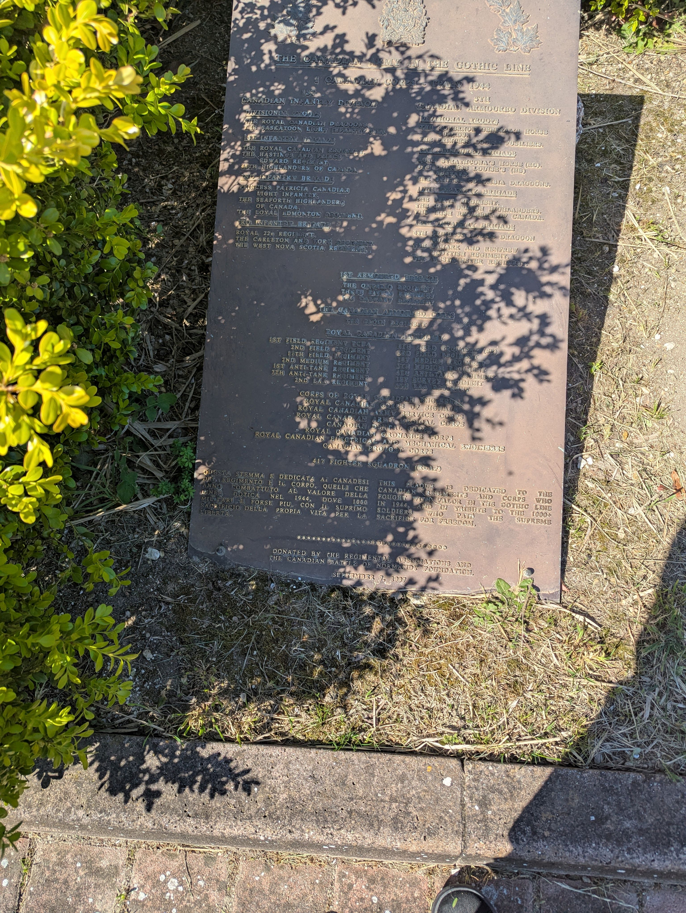

**THE CANADIAN ARMY IN THE GOTHIC LINE**

**1 CANADIAN CORPS, AUGUST 1944**

**1ST CANADIAN INFANTRY DIVISION**

**DIVISIONAL TROOPS**

* THE ROYAL CANADIAN DRAGOONS
* THE SASKATOON LIGHT INFANTRY (M.G.)

**1ST INFANTRY BRIGADE**

* THE ROYAL CANADIAN REGIMENT
* THE HASTINGS AND PRINCE EDWARD REGIMENT
* 48TH HIGHLANDERS OF CANADA

**2ND INFANTRY BRIGADE**

* PRINCESS PATRICIA'S CANADIAN LIGHT INFANTRY
* THE SEAFORTH HIGHLANDERS OF CANADA
* THE LOYAL EDMONTON REGIMENT

**3RD INFANTRY BRIGADE**

* ROYAL 22e REGIMENT
* THE CARLETON AND YORK REGIMENT
* THE WEST NOVA SCOTIA REGIMENT

**5TH CANADIAN ARMOURED DIVISION**

**DIVISIONAL TROOPS**

* THE GOVERNOR GENERAL'S HORSE GUARDS
* THE PRINCESS LOUISE FUSILIERS (M.G.)

**5TH ARMOURED BRIGADE**

* LORD STRATHCONA'S HORSE (ROYAL CANADIANS)
* 8TH CANADIAN ARMOURED REGIMENT (THE BRITISH COLUMBIA DRAGOONS)
* THE PERTH REGIMENT (MOTOR)

**11TH INFANTRY BRIGADE**

* THE PERTH REGIMENT
* THE CAPE BRETON HIGHLANDERS
* THE IRISH REGIMENT OF CANADA

**12TH INFANTRY BRIGADE**

* THE WESTMINSTER REGIMENT (MOTOR)
* THE LANARK AND RENFREW SCOTTISH REGIMENT
* THE PRINCESS LOUISE REGINA REGIMENT

**1ST ARMOURED BRIGADE**

* THE ONTARIO REGIMENT
* THE THREE RIVERS REGIMENT
* THE CALGARY REGIMENT

**1ST CANADIAN ARMOURED CAR REGIMENT**

* THE ROYAL CANADIAN DRAGOONS

**ROYAL CANADIAN ARTILLERY**

* 1ST FIELD REGIMENT R.C.A.
* 2ND FIELD REGIMENT
* 3RD FIELD REGIMENT
* 2ND MEDIUM REGIMENT
* 1ST ANTI-TANK REGIMENT
* 11TH ANTI-TANK REGIMENT
* 2ND L.A.A. REGIMENT
* 8TH FIELD REGIMENT
* 17TH FIELD REGIMENT
* 1ST MEDIUM REGIMENT
* 5TH MEDIUM REGIMENT
* 6TH ANTI-TANK REGIMENT
* 1ST SURVEY REGIMENT
* 4TH L.A.A. REGIMENT
* **CORPS OF ROYAL CANADIAN ENGINEERS**
* **ROYAL CANADIAN CORPS OF SIGNALS**
* **ROYAL CANADIAN ARMY SERVICE CORPS**
* **ROYAL CANADIAN ARMY MEDICAL CORPS**
* **CANADIAN DENTAL CORPS**
* **ROYAL CANADIAN ORDNANCE CORPS**
* **ROYAL CANADIAN ELECTRICAL AND MECHANICAL ENGINEERS**
* **CANADIAN POSTAL CORPS**

**417 FIGHTER SQUADRON (R.C.A.F.)**

THIS PLAQUE IS DEDICATED TO THE CANADIAN REGIMENTS AND CORPS WHO FOUGHT WITH VALOR IN THE GOTHIC LINE IN 1944, AND IN TRIBUTE TO THE 1000+ SOLDIERS WHO PAID THE SUPREME SACRIFICE FOR FREEDOM.

**DONATED BY THE REGIMENTAL ASSOCIATIONS AND THE CANADIAN BATTLE OF NORMANDY FOUNDATION.**

**SEPTEMBER 1, 1997**

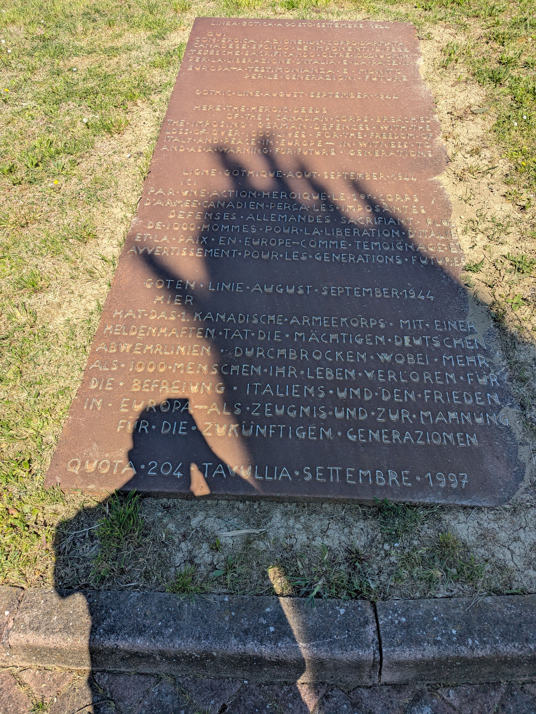

**GOTHIC LINE AUGUST - SEPTEMBER 1944**

**HERE THE HEROIC DEEDS** **OF THE I CANADIAN CORPS BREACHED** **THE IMPOSING GERMAN DEFENCES WITH THE** **LOSS OF OVER 1000 LIVES FOR THE FREEDOM OF** **ITALY AND PEACE IN EUROPE - IN WITNESS TO** **AND AS A WARNING FOR FUTURE GENERATIONS**

The plaque repeats the message in French, German and Italian.

The memorial itself is an interesting design focused on an embedded gun turret.

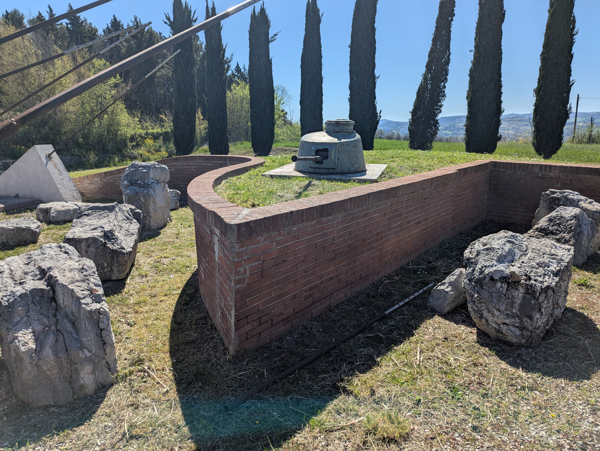

The view from Point 204 indicates why this was such a strategic location.

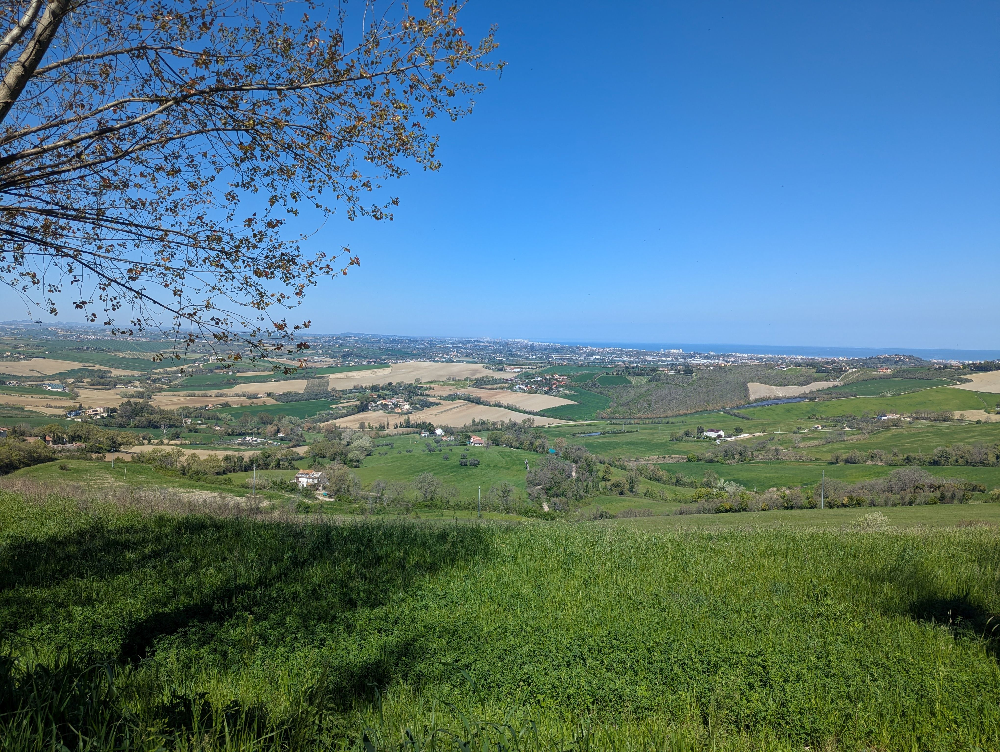

## Gradara Castle

The next stop on the tour was the Gradara Castle that dominates the local landscape. The original castle tower was built in 1150 and the walls added in the 14th century. The castle was extended in the 15th century and restored in the 1920s. The Germans used the fortress as an observation post and artillery platform. When the Allies approached, a British Tank Regiment attempted to take the fortress but could not get their tanks into the walled gates. So, the Allies sealed off the area and the Germans withdrew once they were in danger of being surrounded, so the castle was undamaged by the conflict.

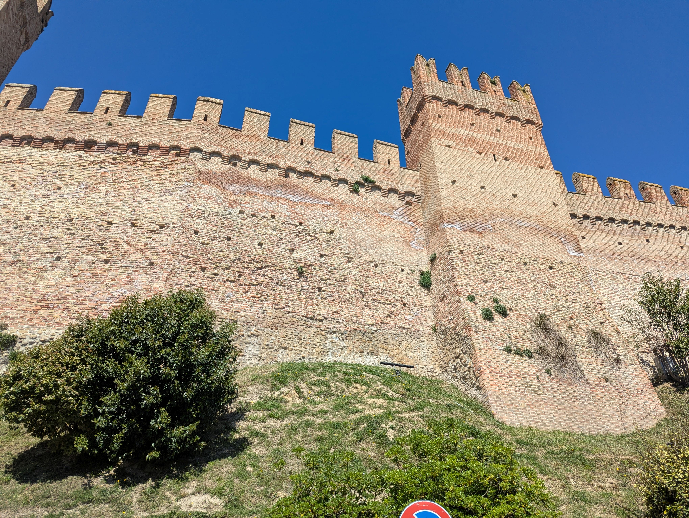

The castle is very well preserved and has a large number of shops and restaurants inside.

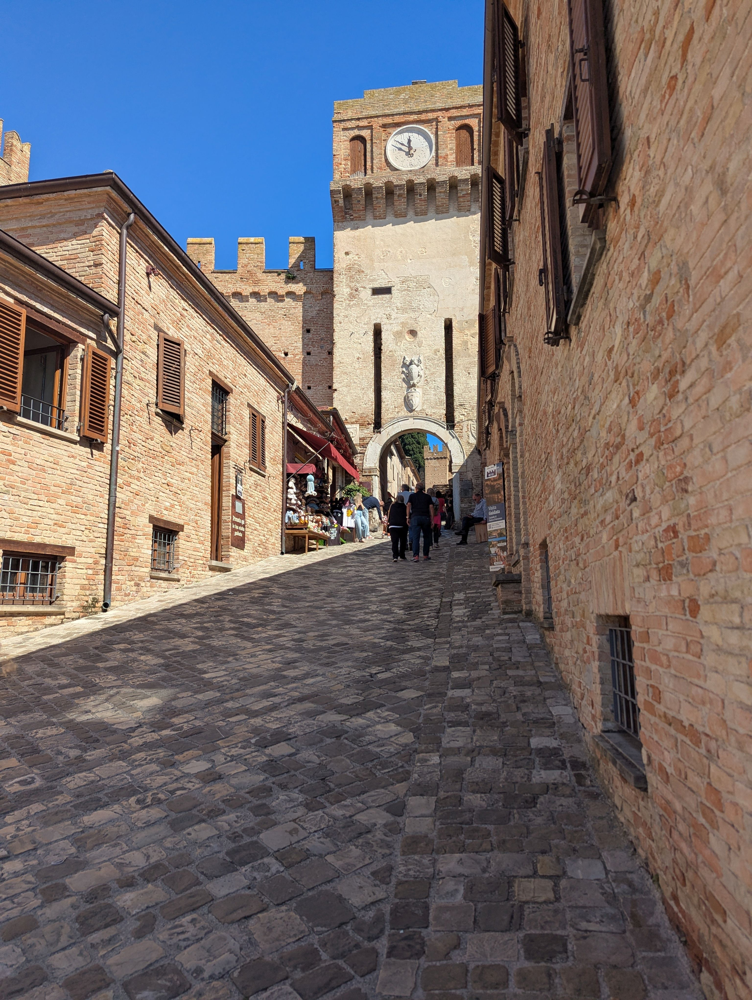

One of the many excellent meals we had during our Italian Invasion.

The view from the Castle wall showing why this was an important German observation point. The Gradara cemetery is circled. The view from this aspect gives no clue on the unique configuration of the cemetery.

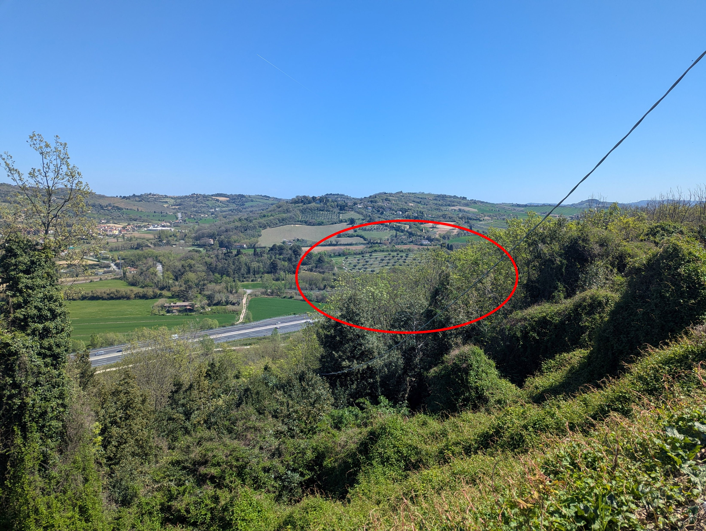

## Gradara Cemetery

Gradara War Cemetery contains 1181 burials including 369 Canadians, and 8 Hussars. This unique cemetery is built on a very steep hill with 8 terraced rows of headstones. The steep terraces mean that only one or two rows are visible from any location.

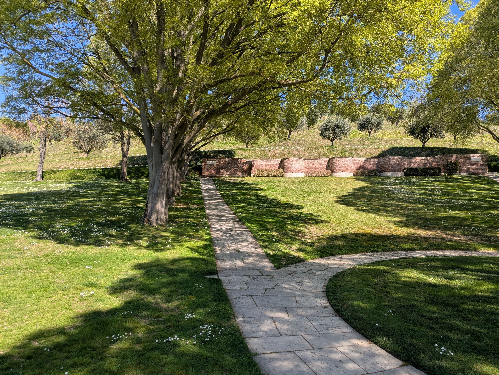

The long rows make finding folks a challenge.

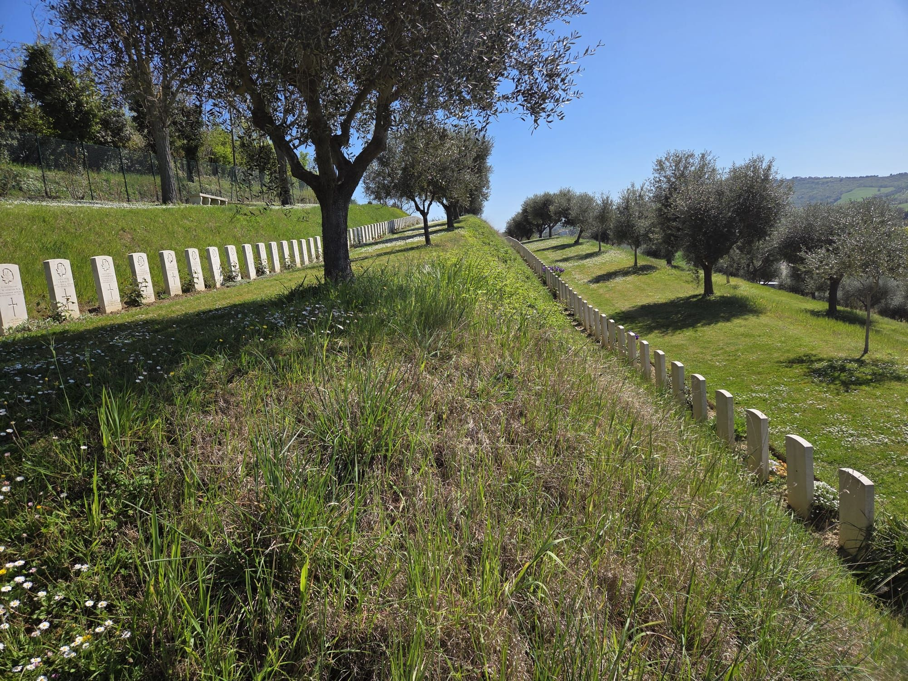

Fortunately, the designer took pity on the visitors and built beautiful seating areas.

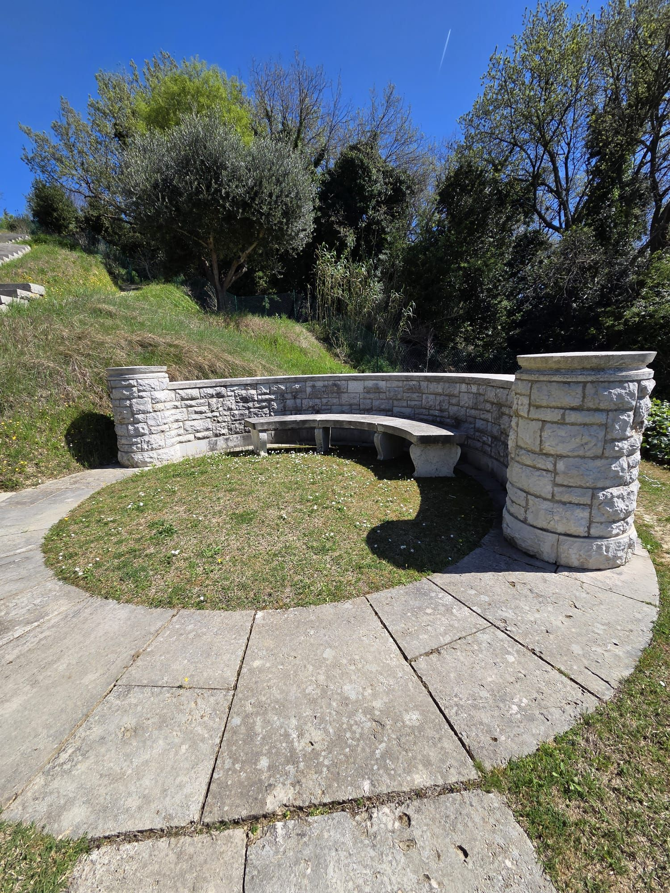

The Canadians were in the top rows, so I sent Rachel up to seek out the Hussars.

Grennen, Holt, Adams, Doucette

Watkins, Fraser, Harper, Duffus

Rachel on her way back down.

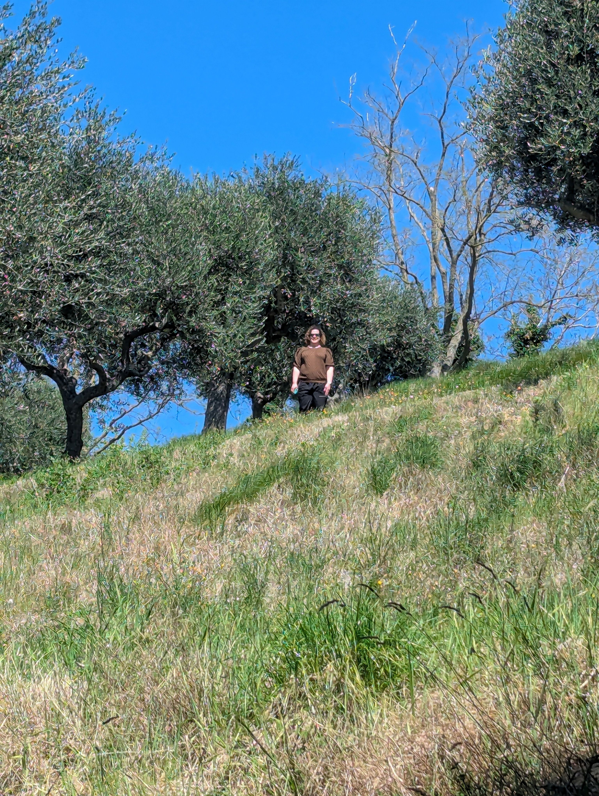

# Coriano Ridge

On 04 September, A and B Squadron of the Hussars along with the Westminster Motorized Regiment headed out to take Coriano. They didn’t know if the Germans were still in Coriano, but as soon as the crested the ridge opposite, they found out as heavy shell fire took out a number of tanks. The British 5th Corps was supposed to be on their left but had not yet shown up so B Squadron charged down the Valley until they reached the Besanigo Stream at the bottom. Heavy anti-tank fire took out more tanks and B Squadron was cut off far in advance of the main force and forced to hide in the meagre brush along the stream. They fought off German Infantry who were using Panzerfaust anti-tank weapons. They were sheltered from fire from Coriano but were completely isolated.

The British were delayed as they had lost over 200 tanks in their ill fated attempt to take Coriano.

A Squadron attempted to rescue B Squadron, firing smoke to cover their retreat and despite anti-tank ditches and heavy shellfire 6 B Squadron Tanks made it out of the trap. Six tankers were still stranded a kilometre from the nearest friendly forces. The Irish Regiment went forward to try to rescue the men, but the Germans got there first killing and wounding the remaining crew. The Irish heard nothing but German and assumed the troops had all been killed. Five days later, the stranded men were finally discovered by the Perth Regiment. The three remaining men were rescued, one didn’t survive, the second fully recovered after months in hospital and Sgt Fisher was awarded the Military Medal for staying and caring for his wounded comrades despite being initially uninjured.

The enemy force on Coriano Ridge was the strongest the 8th Hussars had ever faced in terms of both men and weapons. The mission now was not to break through the enemy line and seize a glorious prize, but to wade into a powerful enemy force and destroy it. The 5th Division rested and reorganized for a week. The Germans had reinforced Coriano with fresh troops and constantly shelled the Canadian positions, subjecting them to the heaviest shelling and bombing of the War.

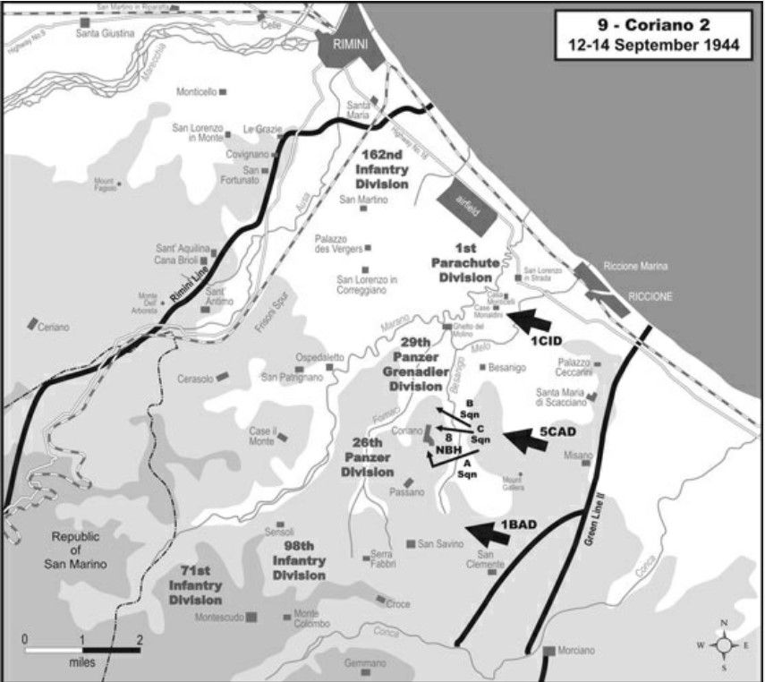

The Brits had taken three shots at Coriano Ridge, and three times they had been pushed back. Starting at 0100 13 September it was the Canadian’s turn. A Squadron tanks supported the Perth Regiment on the left flank; B Squadron tanks supported the Cape Breton Highlanders on the right flank and C squadron along with the Irish Regiment were to push up the middle and clear the town once the flanks were secure.

The attack commenced with 700 guns shelling the German positions. A creeping barrage advanced the firing line on a complicated timing basis. Unfortunately, the Germans quickly figured out the pattern and aimed their fire at the previous Allied artillery line to catch the Canadians in the open as they advanced behind the barrage.

The CBH ran into extensive mine fields and heavy enemy fire. The tanks were held up by the Besanigo Stream at the bottom of the valley so the engineers used Sherman Bulldozers under heavy fire to make a passage for the Hussars. The tanks protected the engineers and shelled the ridge from the stream side getting their bearings from lighted cigarettes placed on stakes. The tanks finally crossed the stream at 0630 and joined the infantry in clearing Coriano. The tanks fought off the German tanks and shelled buildings to help the CBH clear the town.

The houses of the town were all linked with tunnels so as the Irish Regiment moved to clear the houses, they were empty as the Germans scuttled back and forth. Brutal street fighting went on through the night with heavy losses on both sides. The tanks finally pulled back to the crest of the ridge to rest and reload. On the morning of 14 September, the town was quiet as the Jerries had fled. The Hussars found an abandoned Panzer Mark IV tank. A charge had been set, but the fuze fizzled out so the intact tank was claimed as a prize of war and later presented to MGen Hoffmeister.

But amid all the violence, the most lasting episode of all at Coriano was quite a different thing.

Out on the Besanigo slopes, the mechanics of the Regiment were working in the darkness of the night of Sept. 15th, working to get abandoned tanks back into service. From time to time, the Germans opened fire and they lunged for cover. Once as they huddled under the tanks, they heard a scream. On investigation, they came across a gaunt young colt of three or four months. Nearby lay the corpse of her mother. The colt, half starved and bleeding, had worn a path around the body. She kept trying to feed where her mother had died. She was wounded in the leg and in the stomach.

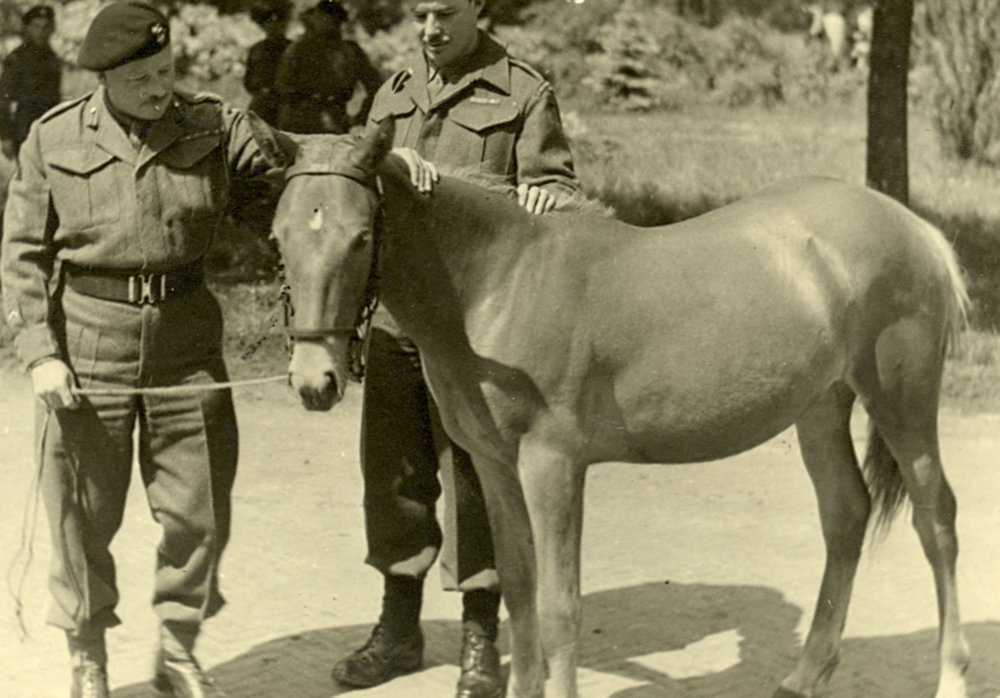

With that bizarre streak in man that can react with tenderness even amid the very annihilation of tenderness, the fitters were pierced to the core. They finally got the infant back to the Hussar lines. The Medical Officer protested that he was no horse doctor--and then reacted exactly as the fitters had. That day, in addition to his normal duties, he had helped a wounded Italian woman give birth to a child. He bandaged the colt and later changed the bandages.

She was given a shot of rum. From the beginning, she was a true Maritimer in her appreciation of a shot of rum. From that day on, she was first on the sick parade until her health was restored. Almost at once, she was called Princess Louise and no one thought of anything but keeping her.

### Touring Coriano

Coriano is yet another small Italian village situated on top of a long ridge that provides visibility down to the Adriatic on a clear day. After the first failed attempt, the Hussars spent a week on the ridge opposite Coriano shelling and being shelled relentlessly. The view across the valley.

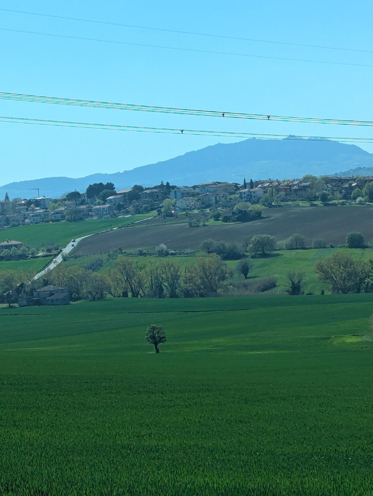

A kilometer of deadly ground.

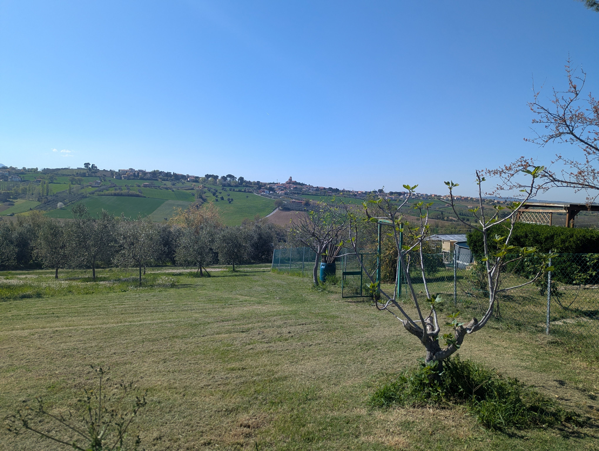

Zooming in to see the castle at Coriano.

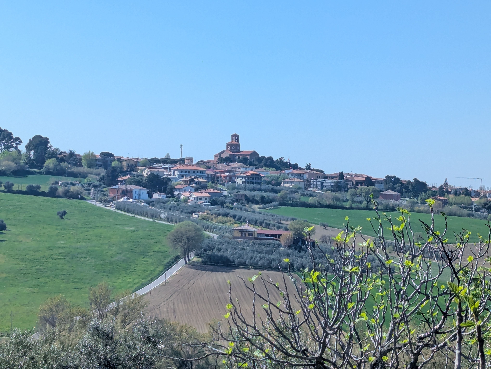

When the attack finally went in, the tanks were stopped by a tiny stream that was an effective tank trap. Since these streams are mountain fed, most of the time they can be walked over, but in the rainy season they become torrents so the small streams have very deep banks that require engineers to build a bridge or bulldoze the banks so the tanks can ford the streams. So, the infantry must cross by themselves and establish enough of a bridgehead so the engineers can do their jobs and make a passage for the tanks.

In this case, the attack went in at 0100 and it was 0630 before the tanks could cross the stream. We were out in the boonies, so I expected to be able to stop and jump out and take some pictures. The mad Italian drivers made it impossible, the narrow roads and the inability of any of the locals to read the speed limits meant we did drive bys of several locations and Rachel was in need of a dye job by the end of the trip to cover up her grey hairs.

The tiny stream that stopped the tanks.

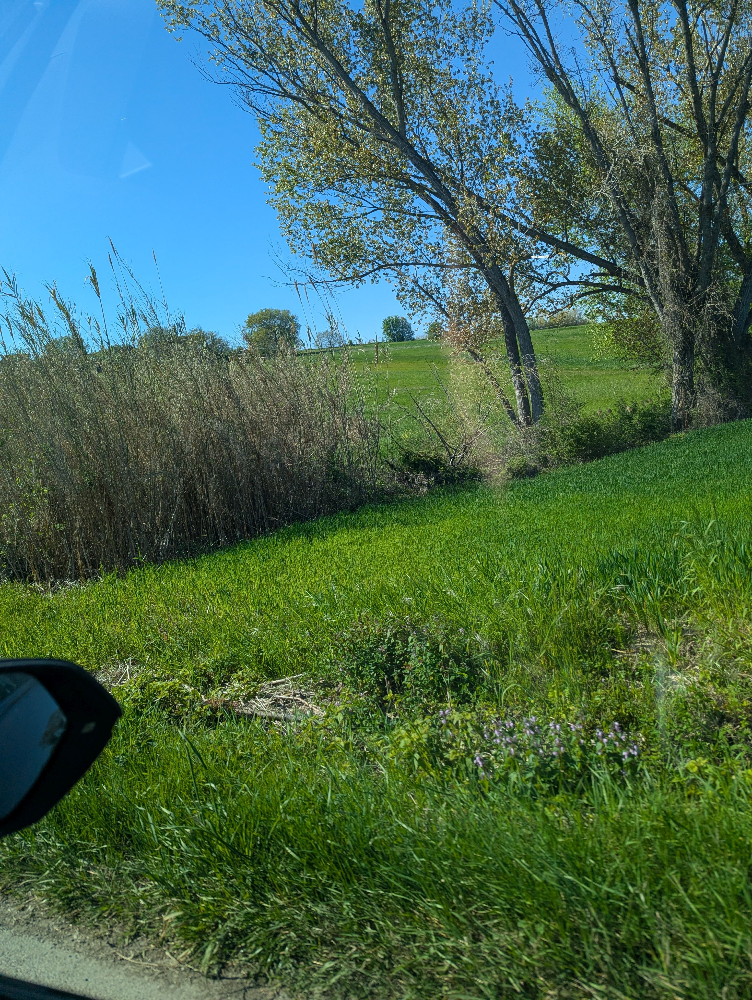

When the tanks finally joined the infantry in Coriano, there was house to house fighting in the very narrow streets. The infantry would identify a sniper, usually after the sniper had taken out a few soldiers and the tanks would blow a hole in the building and the sniper. The buildings were joined by tunnels so often a building was cleared then the Germans would move back to the building and start sniping again. After a day of desperate street fighting, Coriano was finally taken at a heavy cost. The Canadians suffered more than 1,300 casualties with more than 300 killed, the Brits had 1,200 casualties and the Indian Army more than 900. The Germans suffered approximately 3,000 casualties.

### Trooper Billy Hills

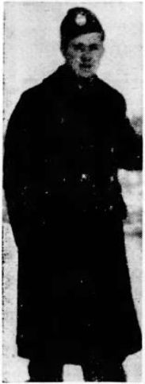

*Even after the Germans had left the battlefield, they were still dangerous. Their engineers had developed the deadly practice of laying Improvised Explosive Devices (I.E.D.s) long before wars of the twenty-first century gave them notoriety. In “A” Squadron’s area south of town, Trooper Hills asked Captain Hunter Dunn if he could go scrounging for German cooking pots; his crew’s pot set had been blown off the stowage racks on their turret during the battle. Dunn agreed, but went with him, searching through the wreckage of blown-out pillboxes and trenches left from the battle for Point 124 the day before. After a brief search, Dunn told Hills it was time to get back to the tanks. Hills asked if he could keep looking. Dunn gave him the OK and returned to the rear link tank. As he reached it, he heard an explosion.*

*A trooper ran to Dunn’s tank to report that Hills had hit a mine or booby-trap and was wounded. “I told him to run back and tell Hills not to move.” Apparently, Hills had given up his search after Dunn left but then spotted a container on a dead German only fifty metres from his tank. It looked like it might do as the crew’s new pot. His crewmates warned him there were mines and booby-traps all around, but he went on anyway, eager to provide for his mates. Dunn got on the radio in his tank to call for the medics. In the meantime, he ordered his crew to fire up their engines and get over to the blast site, calculating that anti-personnel mines or explosive traps could not stop his Sherman. “I planned to drive up to Hills and have two members of my crew lift him onto the tank. I was in the process of turning the tank around when there was another explosion.” The same Hussar who had first alerted Dunn ran back and told him there was “nothing anyone could do.” Hills had tried to move, triggering a secondary device, and died at the scene. Trooper William John Hills was the same brazen Hussar who had rescued the trapped driver from a stricken Sherman ten days earlier during the first attempt to reach Coriano. He knew no fear. Hunter Dunn carried the burden of Hills’s death for decades after the war. “I still wish I had told him to return with me.” Dunn visits the twenty-five-year-old’s grave whenever he returns to the Coriano Ridge War Cemetery.*

The loss of Billy Hills hit my Uncle Norm very hard. He and Billy had grown up on the same dirt road in Songis, Ontario and enlisted the same day (their service numbers were sequential). They were on the same Armoured Course in Camp Borden, served in England in the same unit, were assigned to the Hussars on the same day, and fought their way across Italy together.

Like most of the deaths at Coriano, Billy Hills was initially buried in an orchard on the reverse slope of the ridge adjacent to Coriano where the Hussars spent more than a week. Today, there are no indications that there was a temporary cemetery, but the reinterment documents have a map reference indicating where the bodies were initially buried. There were likely more than 30 burials from the fighting from 12-14 September.

The burial location is now a run-down farmyard with a single tree left as an indication of the former orchard. Billy is now buried in the Coriano Ridge Cemetery.

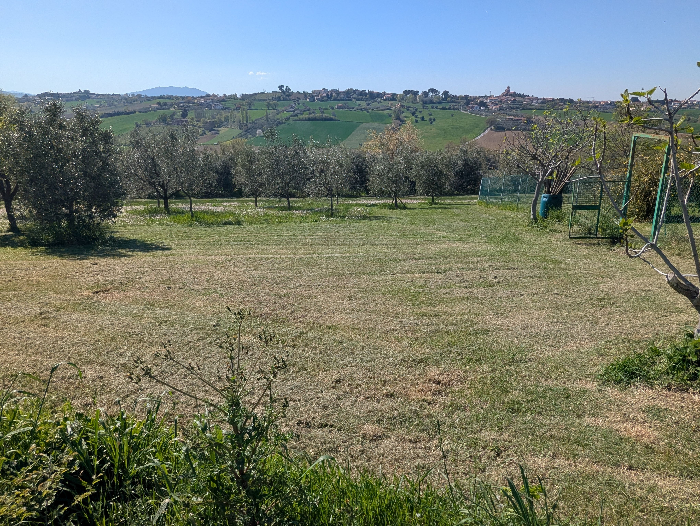

### Coriano Ridge Cemetery

Our next stop was the Coriano Ridge Cemetery. The cemeteries in Italy are much more varied than those in France and Belgium. It’s always obvious that it is a Commonwealth War Graves Cemetery, but their layouts are quite varied.

Coriano Ridge War Cemetery is one of the major Commonwealth cemeteries in northern Italy, created to hold the dead from the battles of Coriano and Rimini during the Allied assault on the Gothic Line in September 1944. It contains 1,939 burials, including 427 Canadians, and was formally established in April 1945 on land donated by the Italian government.

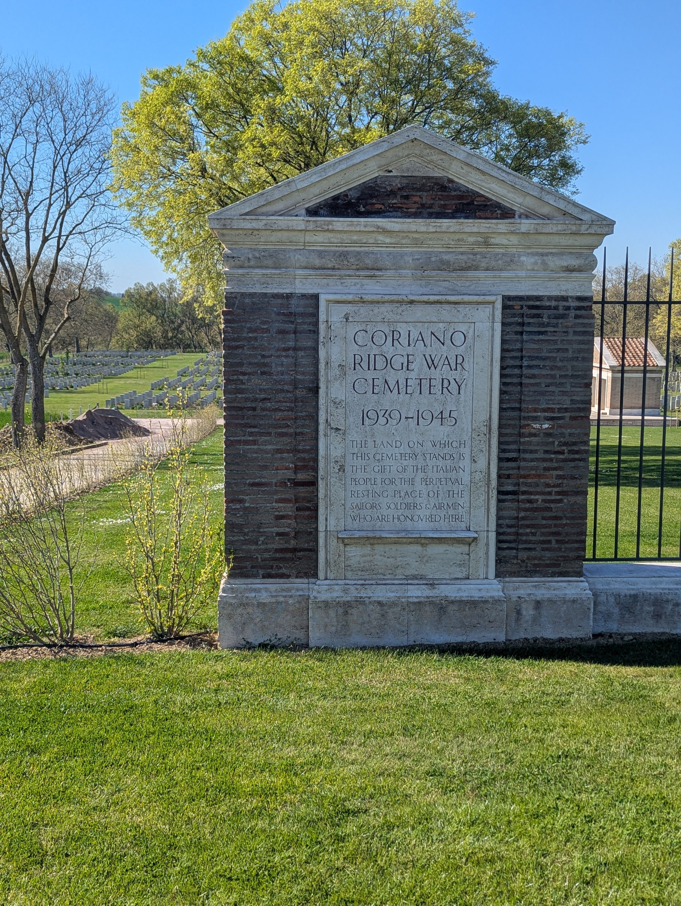

Coriano had a long distance between the gate and the graves, and a unique platform before reaching the graves.

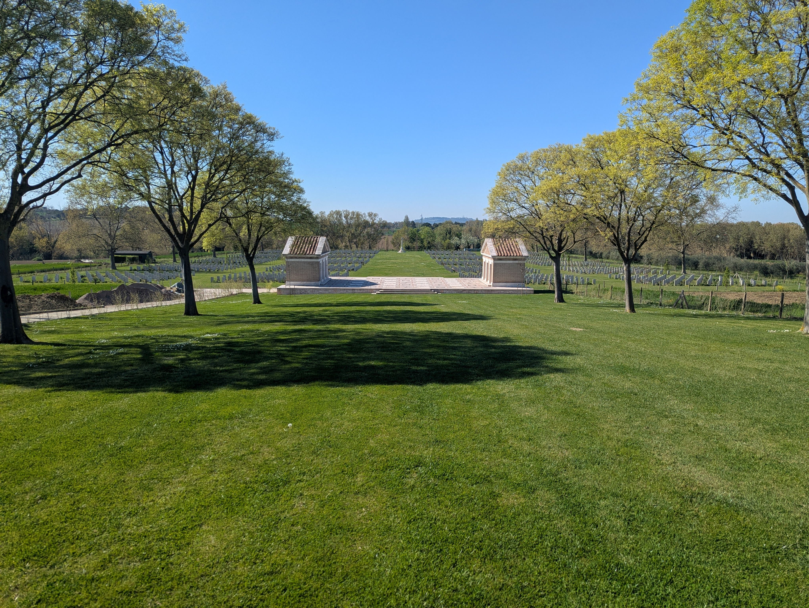

The platform creates a formal threshold between the outside world and the burial ground. CWGC cemeteries often use a raised terrace to give visitors a moment of pause before descending into the graves area. This is consistent with the layout described: a courtyard with raised mosaic pebbles and paving, reached by steps from the entrance.

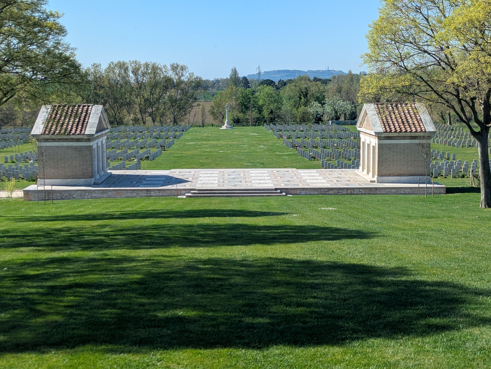

The platform provides a vantage point over the cemetery. Because the burial area slopes downward, the platform allows visitors to look out across the entire cemetery before walking down into it. This is a deliberate CWGC design principle used in many Italian campaign cemeteries. It forms the architectural “front” of the cemetery and frames the visitor’s approach and provides a place for ceremonies.

The 8th Hussars buried in Coriano Ridge Cemetery.

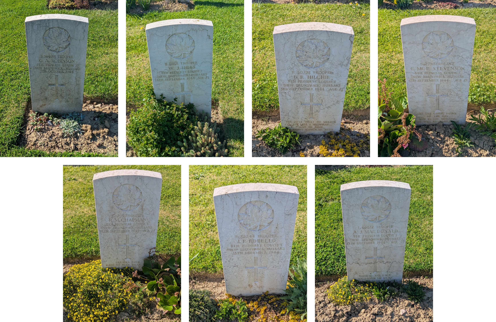

Robinson, Hills, Hilchie, Stevens

Chapman, Robello, MacDonald

Rachel honouring Billy Hills.

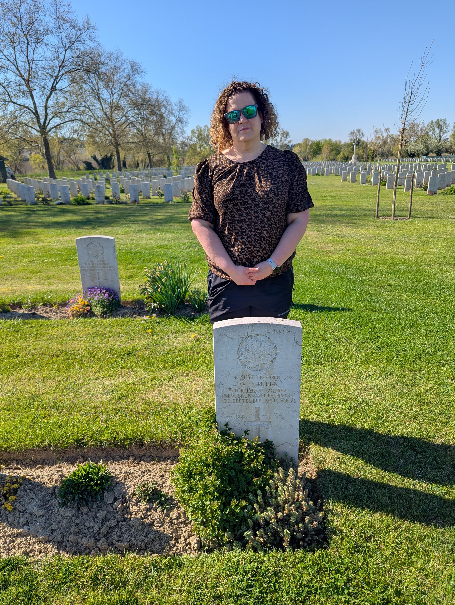

Billy’s personal inscription:

OUR LOVING SON AND BROTHER BILLY WHO WAS LOYAL, BRAVE AND TRUE TO THE END

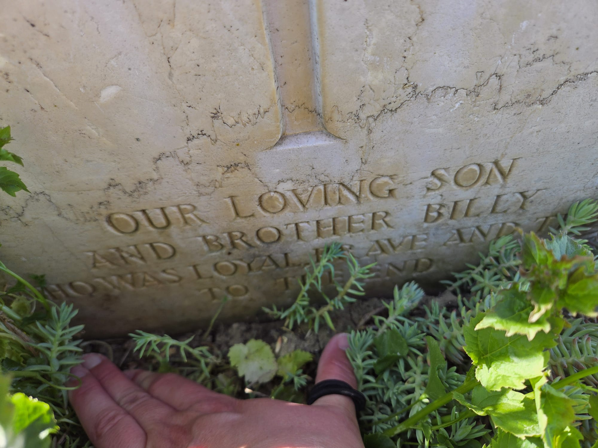

# Final Thoughts

Despite some some scary traffic moments, it is very emotional to follow in the footsteps of Uncle Norm and the Canadian Corps some 80 years on. There is very little left of the massive Gothic Line Defences, but standing on the high points of ground you get a clear picture of the enormous challenge that faced the Canadians.

The Hussars fought side by side with the three Infantry Regiments, and often along side the Westminsters as well. It was more dangerous to be in the infantry than in a tank. The losses for the Westminsters were high as the motorized Regiments had fewer soldiers.

I recently discovered that another uncle, Don Wilson, was in the 5th Medium Regiment Royal Canadian Artillery and they fought throughout Italy with the rest of the 5th Armoured Division. The Medium Regiment had the heavier (5.5 inch) guns, so were usually further behind the action, so there losses are quite heavy for an Artillery Regiment

|  |  |
| --- | --- |
| **Regiment** | **Deaths in Italy** |
| 8th Hussars (Uncle Norm’s Regiment) | 110 |
| Perth Regiment | 260 |
| Cape Breton Highlanders Regiment | 250 |
| Irish Regiment | 220 |
| Westminster Motorized Regiment (Wine Bob’s father and uncle’s Regiment) | 150 |
| 5th Medium Regiment Royal Canadian Artillery (Uncle Don Wilson’s Regiment) | 45 |

The Italian Campaign was overshadowed by the Normandy Invasion so it was great to be able to acknowledge their efforts and sacrifice.

* [Second World War](https://www.paulsbattlefieldtours.com/blog/categories/second-world-war)
* [Family](https://www.paulsbattlefieldtours.com/blog/categories/family)
* [Battlefield Tours](https://www.paulsbattlefieldtours.com/blog/categories/battlefield-tours)