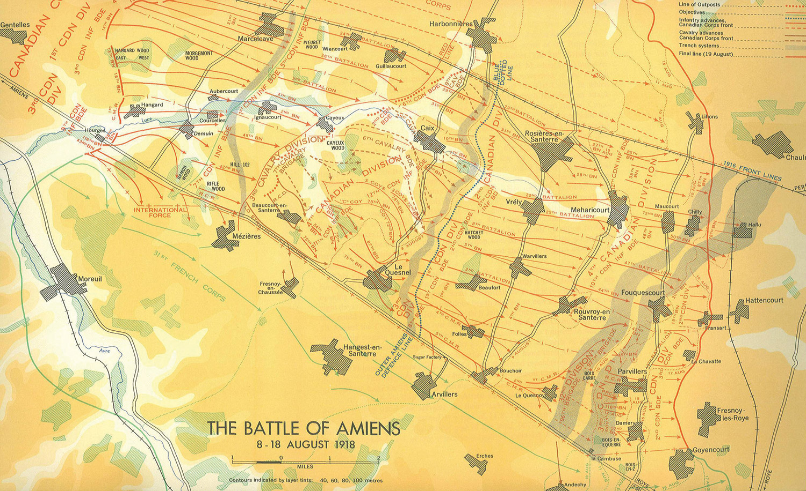
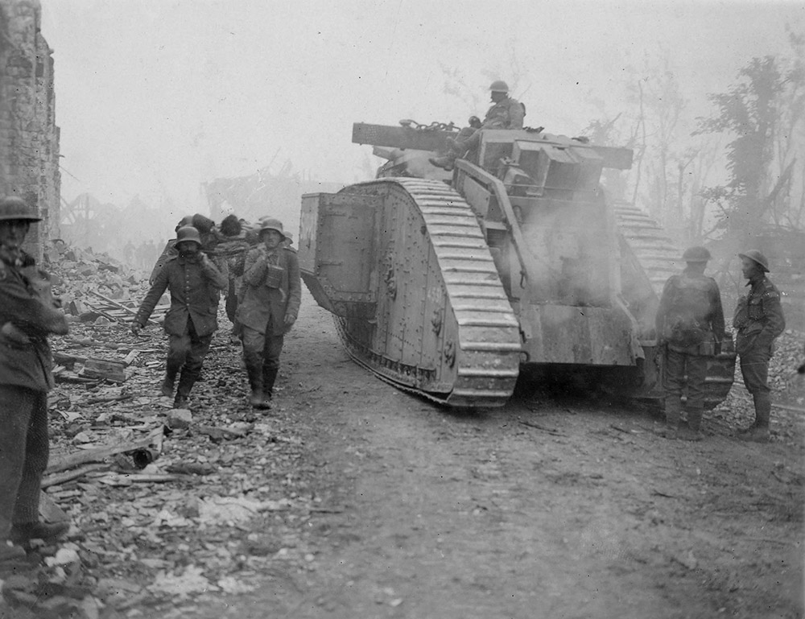
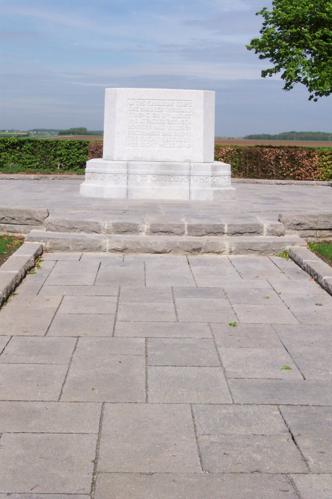
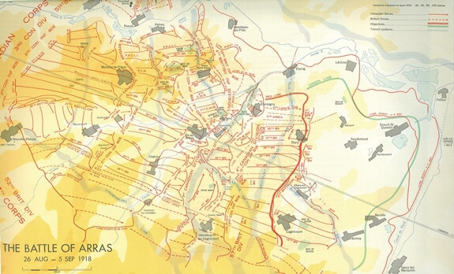
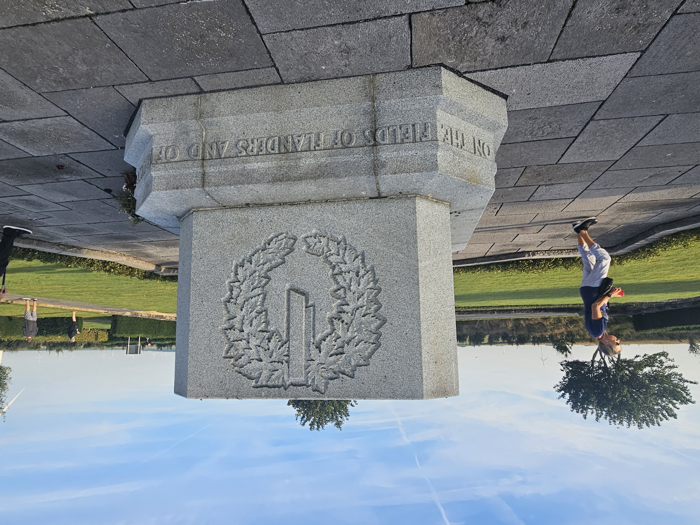
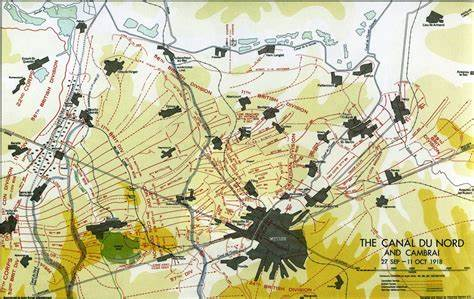
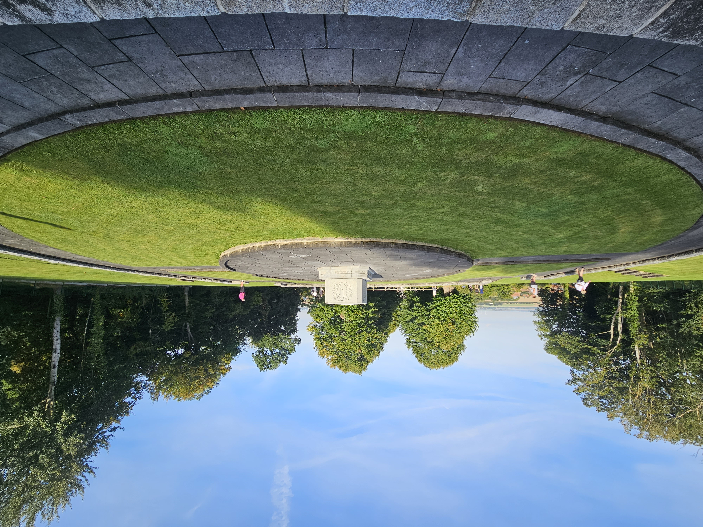
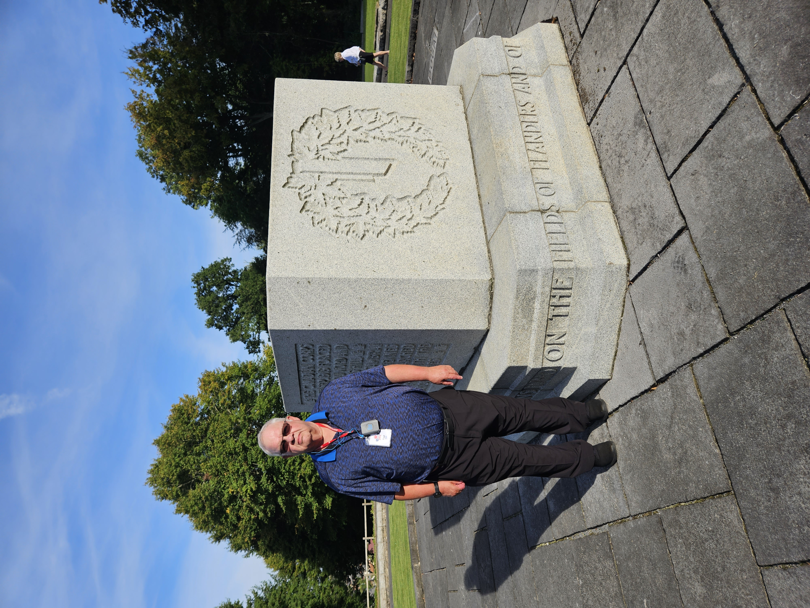
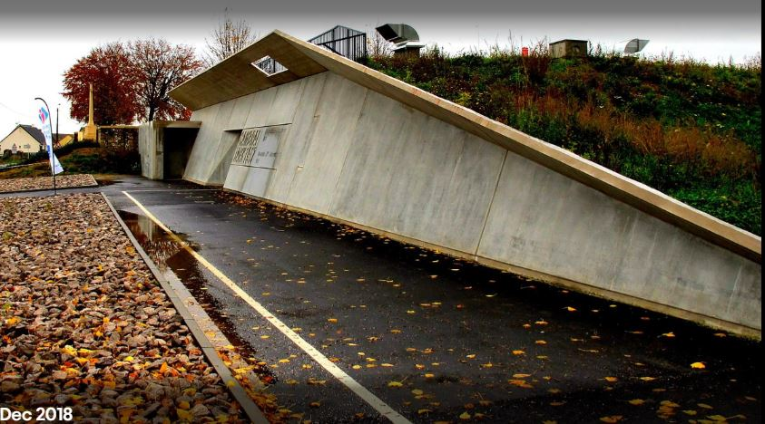
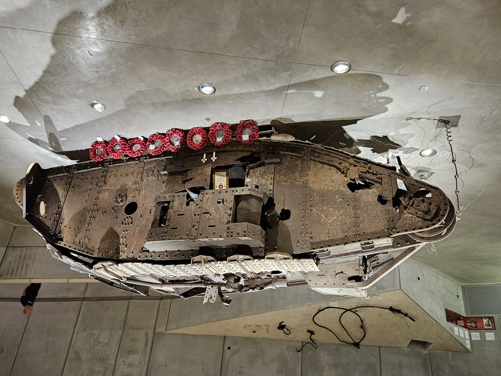

# Canada's Hundred Days

* [pd-allen](https://www.paulsbattlefieldtours.com/profile/pd-allen/profile)
* Sep 16, 2023
* 4 min read

Updated: Sep 25, 2023

By 1918, the Canadians were known as the Allied Shock troops, so an elaborate deception took place to make the Germans think the Canadians were still in Belgium.

The Allies sneaked into position with thousands of heavy and super-heavy field guns, howitzers, more than 600 tanks, and 2,000 aircraft. The attack was scheduled for 8 August at 4:20 a.m. Unlike earlier attacks in the war, the Amiens assault would not be preceded by bombardment. This would keep the assault secret as long as possible.

At 0420,on 8 August the guns opened up, and 120 tanks set out with the Canadians in the first combined arms action of the war. The Germans were taken by surprise, and the Canadians advanced 13 km, the largest single day action of the war. The German resistance stiffened, but the Canadians Advanced an additional 5km. After that, the casualties mounted, and the assault was halted on 1 Aug. The Canadians paid a high price for the gains, suffering 11,800 casualties. This typifies the last 100 days, spectacular gains by the Canadian with heavy casualties.

This was the first large scale use of combined arms, integrating artillery, infantry and tanks together.

We didn't visit the Canadian Memorial at Le Quesnel, but a picture is attached. The memorial reads:

THE CANADIAN CORPS ONE HUNDRED THOUSAND STRONG ON 8TH AUGUST 1918 ATTACKED BETWEEN HOURGES AND VILLERS-BRETONNEUX AND DROVE THE ENEMY EASTWARD FOR EIGHT MILES

Two weeks later, the Canadians were back in the front line assaulting the Drocourt-Quéant Line. The Drocourt-Quéant Line, a section of the infamous Hindenburg Line, was one of the most strongly defended German defence systems in the First World War.

The Canadian Corps were ordered to attack just after dawn on the morning of September 2, 1918. With limited time to plan the attack the Canadians were forced to rely on brute force. As they advanced, the Canadians found themselves pined down by heavy machine-gun fire and unable to move. Over the course of the day seven Canadians earned the Victoria Cross for braving the machine gun fire to save the lives of their comrades. After a desperate battle, the Germans withdrew to the other side of the Canal du Nord. The Canadians suffered 5600 casualties in a single day's fighting.

We visited the Canadian memorial at Dury, mounted on a small rise that resulted in many of the casualties.

The inscription on the monument reads:

THE CANADIAN CORPS 100,000 STRONG ATTACKED AT ARRAS ON AUGUST 26TH 1918, STORMED SUCCESSIVE GERMAN LINES AND HERE ON SEPT. 2ND BROKE AND TURNED THE MAIN GERMAN POSITION ON THE WESTERN FRONT AND REACHED THE CANAL DU NORD

The next stop along the way looked at the Battle of Canal du Nord.

The Canadian Corps Commander, Sir Arthur Currie, carried out a local reconnaissance. He noted that to the right of the Canadian lines was a dry section of canal opposite the village of Inchy-en-Artois. With the permission of Field-Marshal Haig, the Canadian Corps boundary was stretched 2600 yards south to incorporate this piece of terrain. Currie then planned on a crossing on an extremely narrow three-brigade front. Once over the obstacle the Corps would be funneled through this narrow opening fanning out on the far bank to take the German lines from the rear. On the night of 26 – 27 September the assault crossing was successfully completed. Pre-built and positioned bridging was then deployed over the canal as the artillery and follow-on infantry forces crossed in the wake of the assault brigades. The following day the 4th Canadian Division captured the steep hill crowned with the ancient oak trees of Bourlon Wood a feature which dominated the approaches to the city of Cambrai.

The Canadians took more than 10,000 casualties, including my relative Sgt Robert Connelly. He was 35 years old, and had won the Military Medal at Passchendaele. He had joined the first Battalion in 1916 after the losses at Mont Sorrel, and fought in all of the Canadian battles. He was killed on 30 Sep just outside Epinoy. A separate post is available on Sgt Connelly.

We visited the Canadian Memorial at Bourlon Wood that commemorates this action. The monument is on a piece of high ground overlooking Bourlon.

The inscription on the monument reads:

THE CANADIAN CORPS ON 27TH SEP. 1918 FORCED THE CANAL DU NORD AND CAPTURED THIS HILL. THEY TOOK CAMBRAI, DENAIN, VALENCIENNES & MONS; THEN MARCHED TO THE RHINE WITH THE VICTORIOUS ALLIES

Our last stop before moving into Belgium was the was the Cambrai Tank 1917 museum.

The Battle of Cambrai was the first battle that used a large number of tanks in a combined arms action that was used extensively in WW2. The museum is shaped like a Mk 4 Tank, the star attraction of the show.

In 1988 a very complete model of a Mk 4 tank, named Deborah, was dug out out 3 m of earth, and in 2017 on the 100th anniversary of the Battle, the purpose built museum was opened with Deborah as the star attraction.

The tank is remarkably complete, and is shown crushing some barbed wire entanglements. The site for the museum was chosen as it is adjacent to the British Hill Museum where 4 members of the tank crew are buried.

* [First World War](https://www.paulsbattlefieldtours.com/blog/categories/first-world-war)
* [Battlefield Tours](https://www.paulsbattlefieldtours.com/blog/categories/battlefield-tours)
* [Family](https://www.paulsbattlefieldtours.com/blog/categories/family)