# Commanding the High Ground

* [pd-allen](https://www.paulsbattlefieldtours.com/profile/pd-allen/profile)
* Oct 16, 2023
* 4 min read

During my recent tour of the Somme, it became evident that the catastrophic losses on the first day of the Battle of the Somme was due in no small part to the fact the Germans had carefully selected their defensive positions on and spent almost 2 years fortifying their strong points. We visited 3 battle sites that illustrated the position.

I had previously posted how Hawthorn Ridge was a classic example of the Germans dominating the high ground in the area.

The view the British had looking up at Hawthorn Ridge (clump of trees). The British had to cross 500 yards of open ground up the hill in full view of the Germans on the Ridge.

The German view from the ridge allowed them full view of the British advance, and lead to devastating casualties to the British during the attack. There is no coincidence that there is a cemetery in the foreground, many of the troops were mowed down shortly after they left the trench.

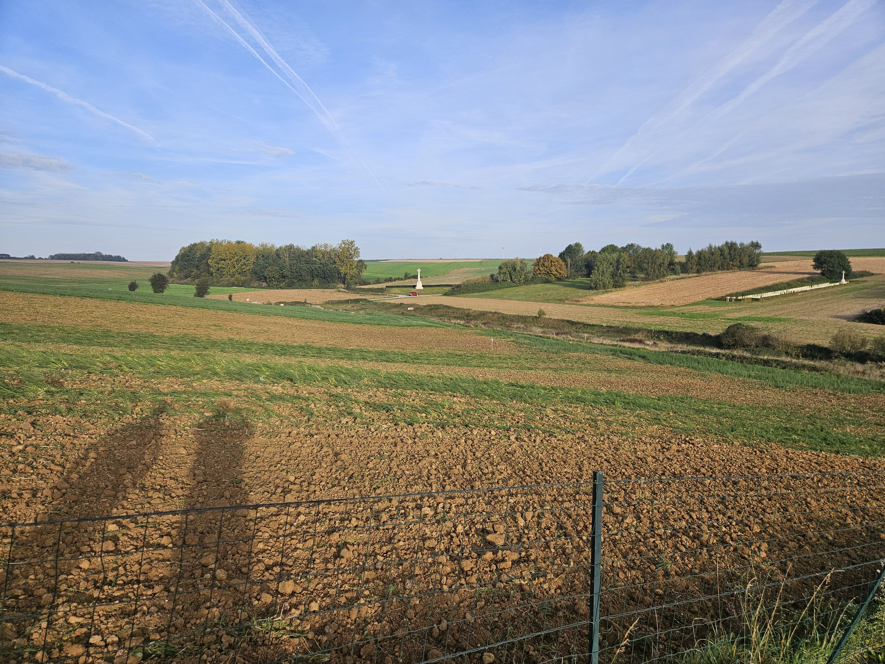

We next visited Sheffield Memorial Park, where the Pals Divisions attempted to take Serre. The Pals divisions were created from men of the same region, or men with a common interest, the idea being that they would fight more effectively is they knew the people they were fighting with. The unintended consequence of this was when the Divisions were decimated during battle, a single city would suffer tremendous losses.

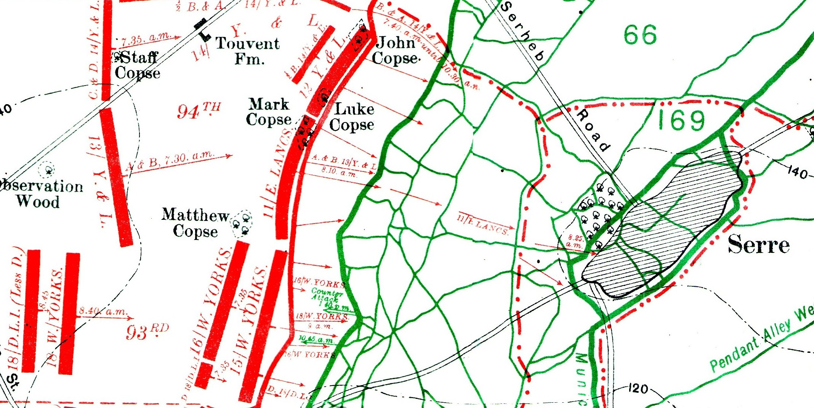

All but 2 battalions of the 31st Division were recruited from Yorkshire, including the Sheffield City Battalion, Barnsley Pals, Bradford Pals and Accrington Pals. The British trenches were in a series of trees named Matthew, Mark, Luke and John Copses (wooded areas), and once again they were forced to attack up hill.

The plan was to attack from the Copses, cross the 4 lines of German trenches and capture Serre. A few soldiers made it into the second line trenches, but a German counterattack rapidly drove them back. Most of the soldiers made it less than 100 yards into no man’s land. By the end of the Day, the 31st Division had suffered 3,500 casualties and gained no ground. In the words of John Harris of the Accrington Pals: “Two years in the making, ten minutes in the destroying.”

A second attempt to take Serre in Nov 1916 also failed, and the village was only occupied in Feb 1917 because the Germans had withdrawn to the Hindenburg line. Serre was recaptured by the Germans in the Spring offensive of 1918 and finally retaken in the 100 days Offensive on 14 Aug 1918.

This is the view from the British front line trench up to Queen’s Cemetery near the German Front line.

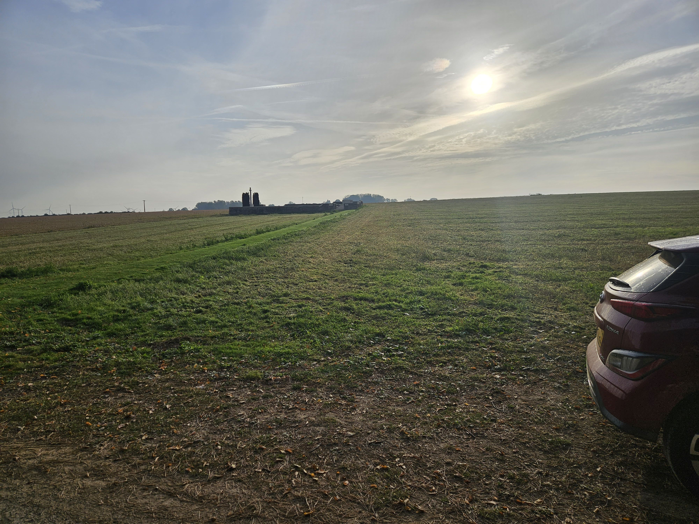

The view down from Queen’s Cemetery shows the dominating view of the German Position. The British Trenches were in the woods, just behind the car.

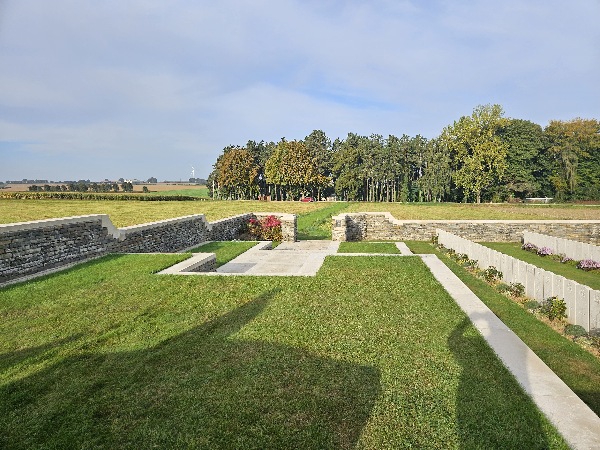

The Sheffield Memorial Park has a number of trench lines still visible.

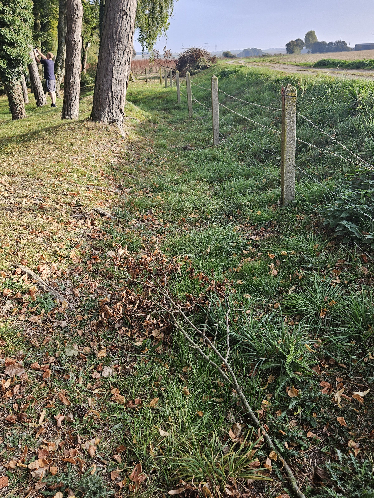

Shell holes are also visible in the trench lines. The trenches are much shallower today than they would have been prior to the attack.

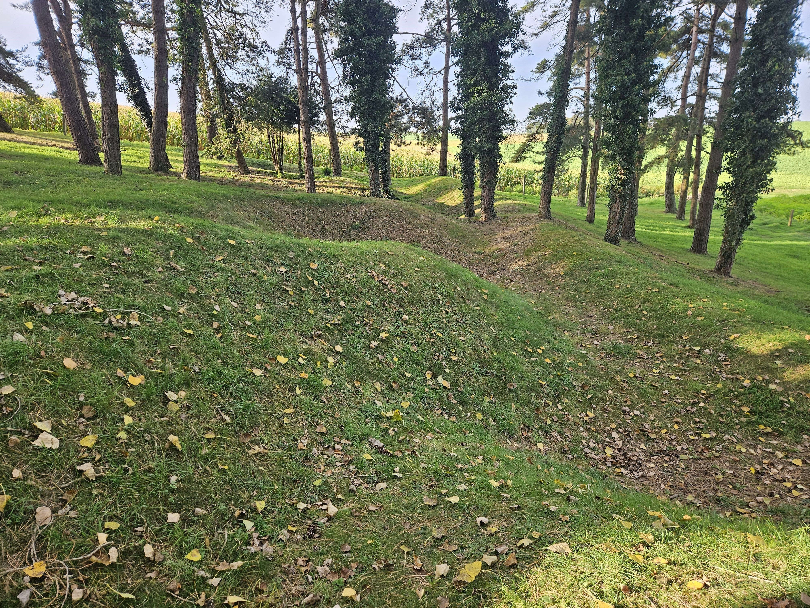

The Railway Hollow Cemetery is just behind the British Front lines. The cemetery has 107 commonwealth burials, 44 of which are unknown. In this cemetery, as well as several others, all the headstones are oriented in the direction of the attack.

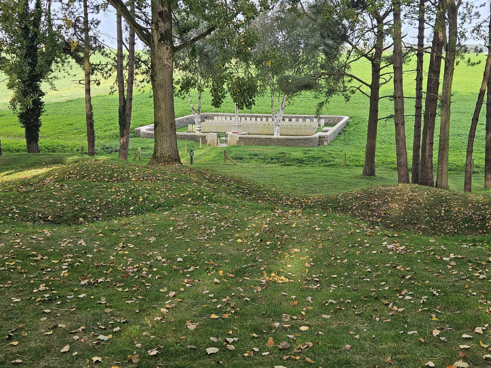

As is common on the Somme from the Queen’s Cemetery, 3 other cemeteries are visible, Luke Copse Cemetery, Railway Hollow Cemetery and Serre Road No 3. Just over the next hill is Serre Road No 2 cemetery, the largest Cemetery in the region, containing 7,127 burials with 4,944 unidentified.

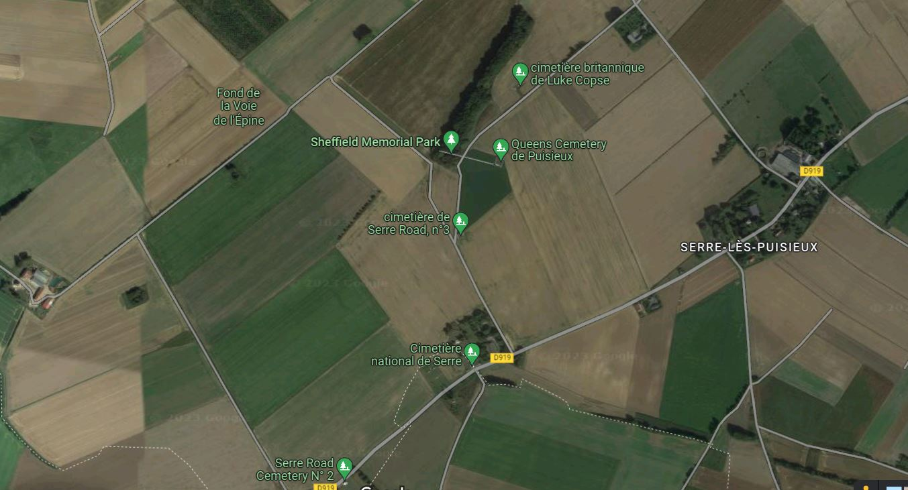

The final example was the ground beside Thiepval Woods where the 36th (Ulster) Division made their attack between the Ancre Valley and Thiepval.

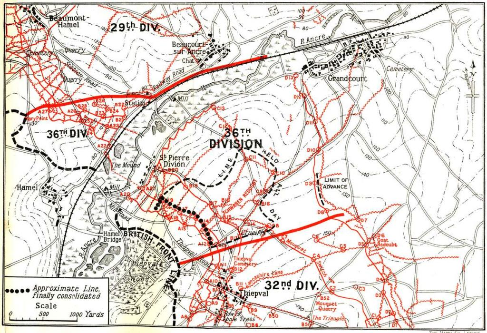

The 36th Division formed up in Thiepval Woods, and the night before the attack they abandoned their equipment, crawled forward and lie flat in no man’s land. At 0730 they surprised Germans, and made the furthest advance of any unit on 01 Jul. Unfortunately, the 32nd Division were immediately stopped by murderous machine gun fire from Thiepval, so the Ulstermen were isolated. They held their advance all day, but repeated German counterattacks forced them back to the original lines.

Their heroics earned 4 of the 9 Victoria Crosses given out to the British Expeditionary Force on 01 Jul, but they suffered over 5,500 casualties including 2,000 dead during the first two days of the Battle. The 36th Division would go on to earn 9 Victoria Crosses throughout the war.

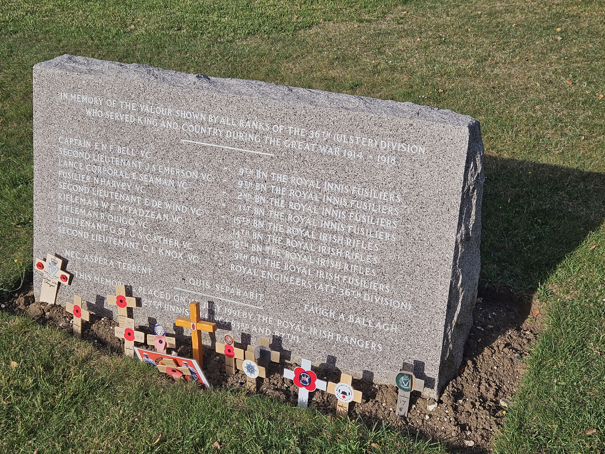

The Somme region generally consists of gently rolling hills. The view from the Road to Mill Road Cemetery (in the clump of trees) shows the slope the Ulster’s had to attack over.

The Germans usually have a redoubt, a bulge in the line at the highest point. This permitted them to fire down no man’s land as well as directly in front of their position. The map shows the Schwaben Redoubt which was the Ulster’s initial Objective. The view from the Cemetery shows the commanding view from the Schwaben Redoubt.

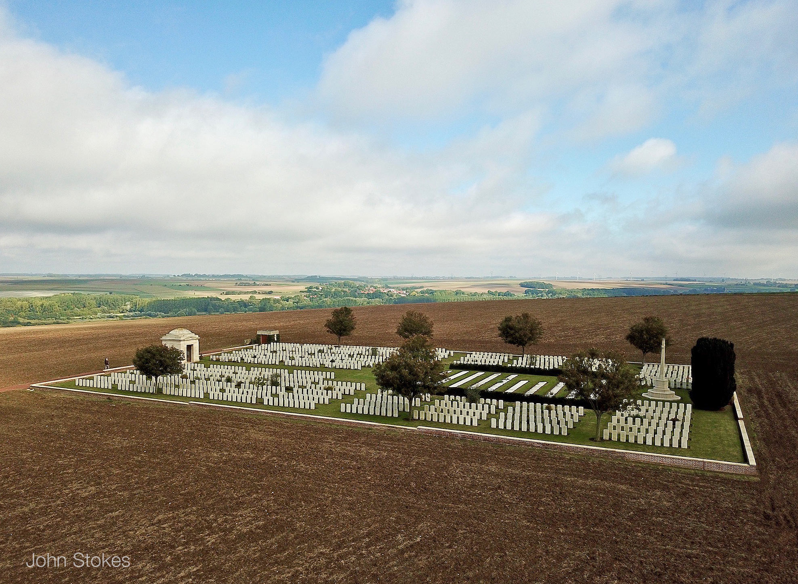

Ulster Tower, the monument to the Ulster division is a direct replica of Lady Helen’s tower which stands in the grounds of the Clandeboye Estate, near Bangor, County Down, Northern Ireland. Many of the men of the Ulster Division trained in the estate before moving to England and then France early in 1916. The tower is located on the former German second line. The tower is staffed by volunteers from Belfast.

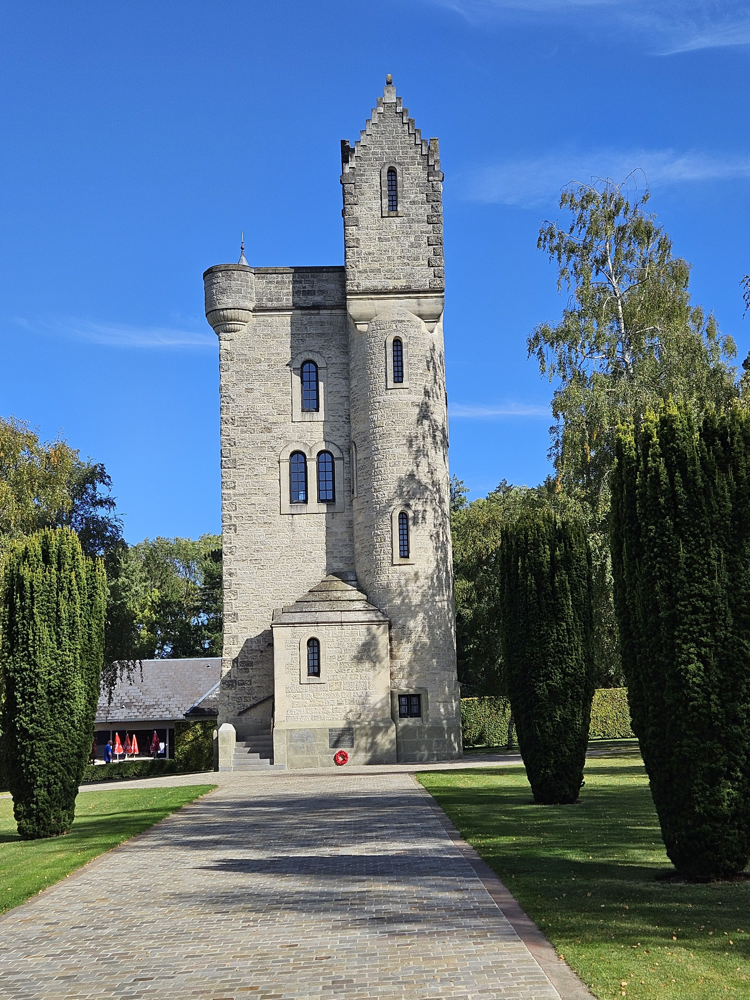

We were able to go on a tour of the 36th Division trenches in the adjacent Thiepval Woods. The woods are owned by the Somme Association, and in the last 20 years they have excavated a number of trenches.

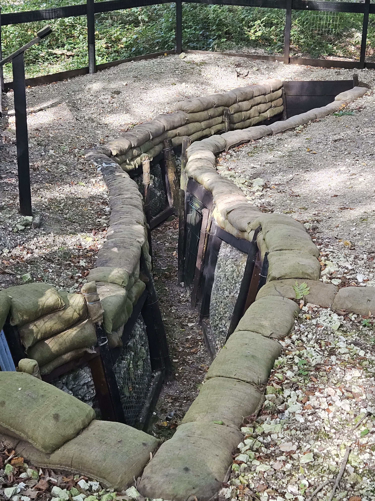

The tour was given by Austin an engaging Ulsterman with the gift of the gab. In true Irish fashion, his stories took many detours. He had several relatives who fought, and some died on the first day of the Somme, so his stories were always heartfelt.

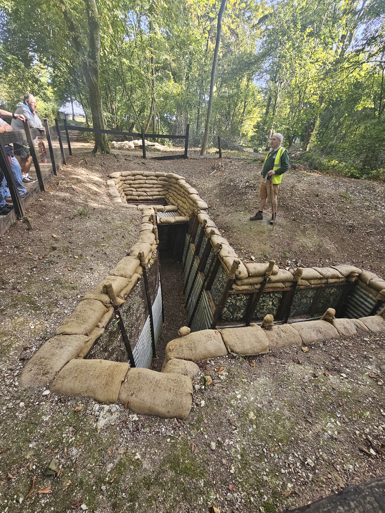

A communications trench was neglected during Covid, and now stands as a reminder how nature reclaims its own.

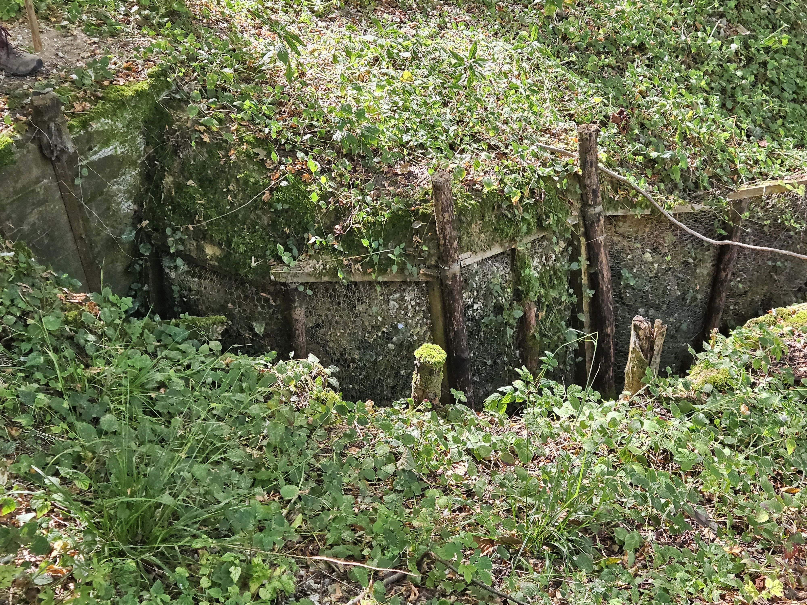

The Connaught Cemetery is located near the Division Start line adjacent to the Ulster Tower and contains 1,268 bodies, half of whom are unknown soldiers. In typical Somme fashion, the Connaught Cemetery is on one side of the road, and the Mill Road Cemetery up a short path on the other side of the road.

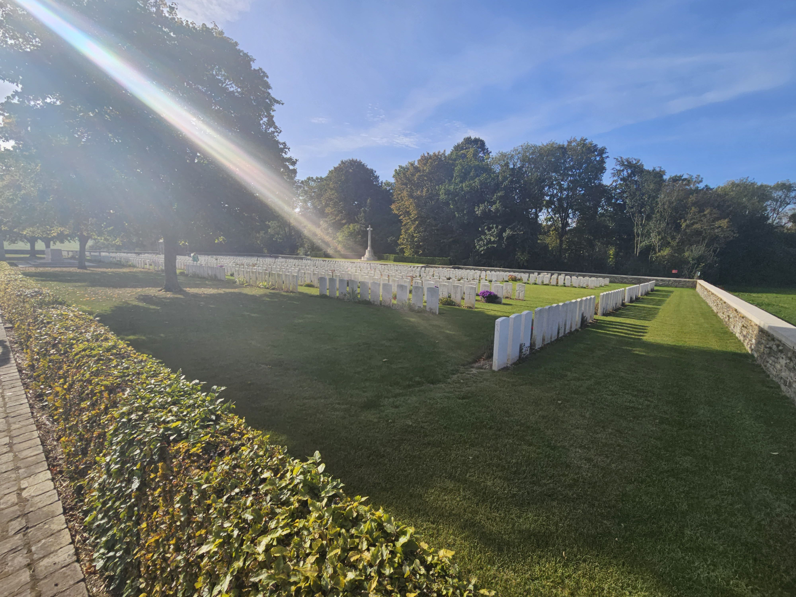

Mill Road Cemetery.

The tragedy of the first day of the Somme was due to the mistaken belief that the extended barrage would completely destroy the German wire, trenches and bunkers. The well-fortified German positions on the high ground ensured it would be the costliest day in British Military History.

* [First World War](https://www.paulsbattlefieldtours.com/blog/categories/first-world-war)
* [Battlefield Tours](https://www.paulsbattlefieldtours.com/blog/categories/battlefield-tours)