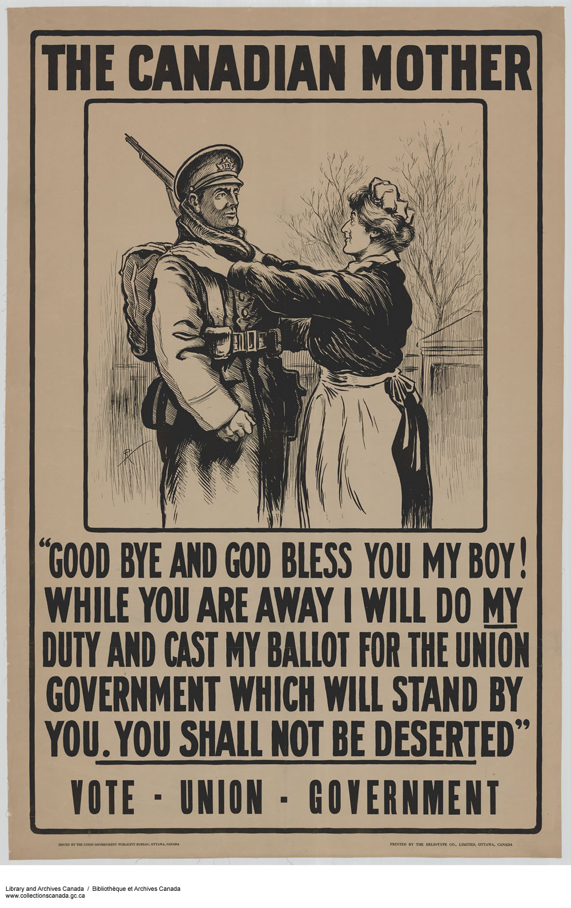
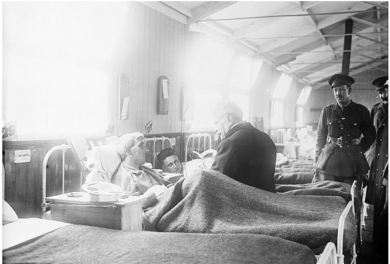
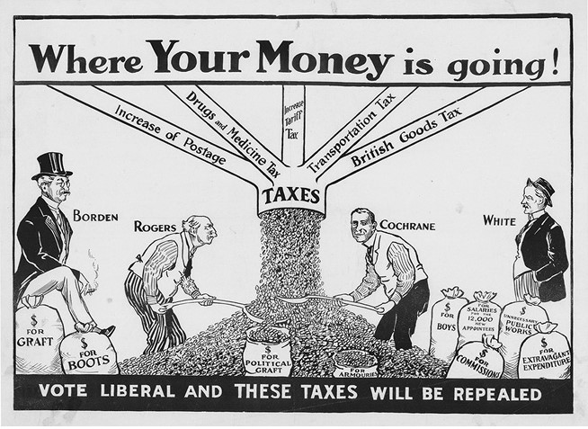
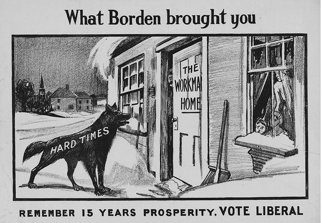
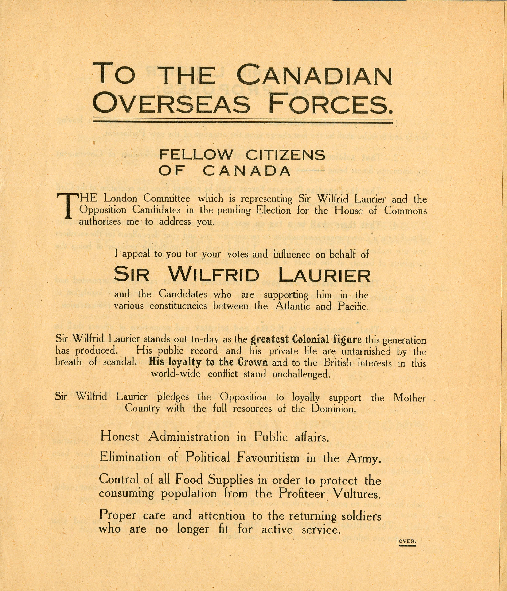
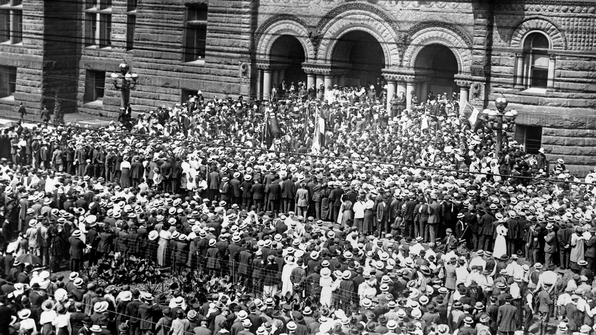
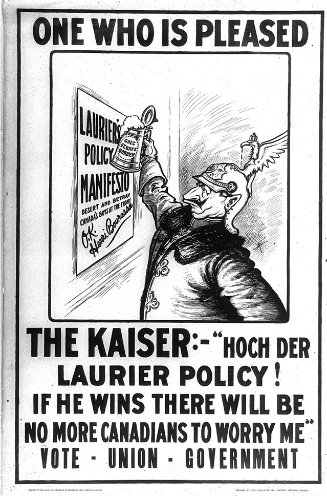
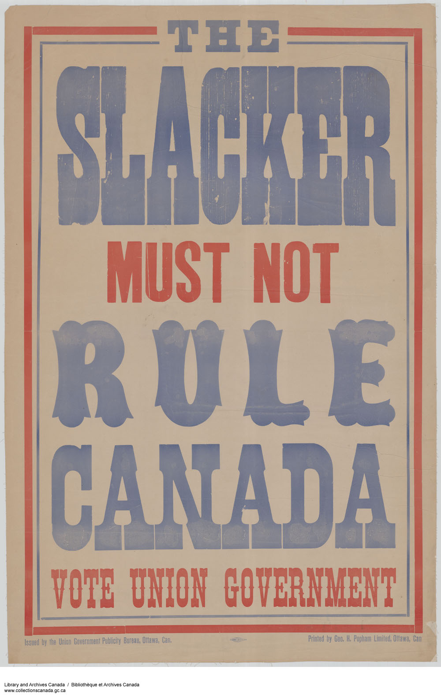
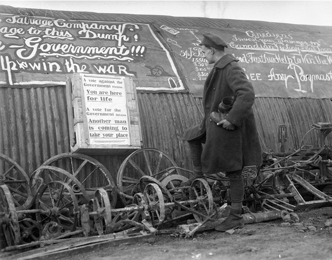
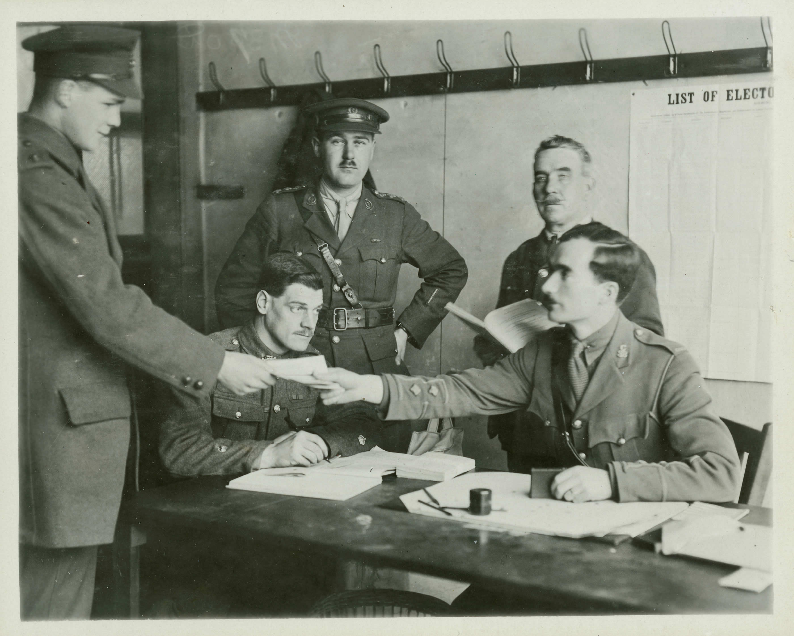

# Conscription During the Great War

* [pd-allen](https://www.paulsbattlefieldtours.com/profile/pd-allen/profile)
* Feb 21, 2024
* 7 min read

Updated: Jun 29, 2025

# Background

One of the things I have enjoyed most about documenting the Battlefield Touring is the Collateral Knowledge that you uncover when you are looking at something else.

During the Wine Bob tour, we visited the Hill 70 memorial, an excellent private memorial that was dedicated in 2017 on the 100th anniversary of the battle and completed in 2019. The foundation that sponsored the monument also commissioned a book commemorating the battle called Capturing Hill 70. Leading Canadian Historians each contributed a chapter describing the battle and the contributions of the Canadian soldiers.

Jack Granatstein, a renown Canadian Historian, and RMC Graduate wrote the chapter covering the debate and subsequent implementation of Conscription during 1917. I knew Canada had Conscription during the First World War but didn’t know any details, so his chapter provided great insight for me.  Here is the summary of my trip down this rabbit hole.

More than 330,000 soldiers had volunteered during 1914 and 1915, but by late 1916, the length of the war, and the heavy casualties had reduced recruitment to a great degree. Based on the 1911 census, there were 3.8 million males in Canada, but just over 1 million were British subjects between 18 and 45. About 20 percent of them were unfit for service so there were 800,000 potential recruits available in total.

From a late 1916 analysis, 9.6 percent of the male population had enlisted. 38 percent of the British born Canadians had enlisted, while only 6.1 percent of Canadian born males, and 1.4 percent of French Canadians had enlisted. Many Canadians were content making their contribution at their jobs, rather than getting involved in a fight that they considered the business of Imperial powers.

The first attempt was to create a Canadian Defence Force (CDF) to allow the 50,000 soldiers involved in the protection of Canada to participate in the battles. There was a great deal of pressure on the home front to do your duty and serve, so no one wanted to join a force that proved you were fit for service but chose not to go overseas.

# Heading Towards Conscription

Conservative Prime Minister Robert Borden spent several months in England in early 1917 and got a firsthand look at the dire situation on the Western Front.

He returned home in May convinced that conscription was necessary, and that a coalition government was required to enforce the legislation. The losses at Vimy and subsequent battles highlighted the problem, in April and May 1917, the Canadians suffered 24,000 casualties but only had 11,300 recruits. English Canada was very strongly in favour of conscription and French Canada strongly opposed.

Borden’s government was extremely unpopular, French Canada thought him too imperialist, English Canada believed he was doing too little for the war, and his government was seen as weak and indecisive.

The Liberal leader, Wilfrid Laurier, who had been Prime Minister from 1896 to 1911, had a strong base in French Canada, and was very concerned that a coalition would alienate his constituents and further divide the country. Laurier proposed a referendum on conscription. The outcome of the referendum would have been very uncertain, and Borden was convinced that conscription was essential to winning the war.

# Conscription Legislation

The Conservatives had been elected with a majority in 1911. The election was scheduled for 1916 but was put off for a year due to the war. Laurier decided against a coalition and wanted to use the election to decide the conscription question. A number of Liberals from Ontario and West crossed the floor to support conscription and the Conservatives passed four critical pieces of legislation that ensured that conscription would survive the upcoming election.

The Military Service Bill was fiercely debated all summer and finally approved 0n 29 August 1917, making all males aged 20 to 45 subject for callup for military service throughout the war. The bill included an appeals process, whereby essential workers and conscientious objectors could be exempt from service.

The next key piece of legislation was the Income War Tax Act. Many of the opponents to conscription were upset that groups and individuals involved in the war effort were making great profits and felt their earnings should be conscripted as well. Canada had been funding the war through borrowing, tariffs, and excise taxes, so the tax on individuals and corporations was introduced to show they were doing their bit as well. This tax was supposed to be a temporary measure, but as we well know, quickly became permanent.

The next step to ensuring electoral success was the Military Voters Act. This bill gave the vote to all Military members who had served, including new residents of Canada, men under the age of 21 as well as Aboriginals who served, and all women in uniform, the idea being if they served their country they deserved the right to vote. This added about 400,000 military votes to the electorate. The members could vote for their home riding, or just select the party and have an electoral officer assign the vote at his discretion. This gave the Conservatives a great deal of leverage, as the votes could be added to any riding that had a close race, since the military members were overwhelmingly in favour of conscription.

**A crowd outside the temporary Parliament Buildings awaiting the outcome of the Conscription vote.**

The final piece of legislature was the Wartime Elections Act. This bill granted voting rights to widows, mothers, wives, sisters, and daughters of serving members, thereby becoming the first Canadian females with the right to vote. In addition, all immigrants from Germany and Austria since 1902, as well as conscientious objectors lost their right to vote. This bill gave the vote to 450,000 women while removing the vote from more than 50,000 foreign born men.

These bills were blatant Gerrymandering devices. Normally Gerrymandering implies the movement of electoral boundaries to exploit population distributions, in this case it was manipulating the electorate to get the desired result. The Liberals protested vehemently, and French Canadian protested violently, but the four bills were all passed. Borden knew the measures were distasteful, but he believed:

*“Our first duty is to win, at any cost, the coming election in order that we may continue to do our part in winning the war and that Canada be not disgraced.”*

The Conservatives integrated the Liberals who crossed the floor and called themselves Unionists for the election. Many of the Liberals who crossed the floor were supporters of conscription, but a significant amount of them saw this as their only chance for re-election. The remaining Liberals were known as Laurier Liberals.

Canada was still heavily rural, so the farm vote was of great concern for the Unionists. Farmers had prospered during the war, but men volunteering and women moving to the city to work in munition factories, so conscription was a threat to the already short-staffed farms. Therefore, in November anyone working directly on the farm would be exempt from conscription.

# The Election

The election was a very bitterly fought contest with both sides using scare tactics to try to win voters. Over 92% of military members voted for the Unionists, to get additional troops in the field, get French Canada to do their bit and due to propaganda that Canada would drop out of the war if the Liberals won. There was much questionable handling of the military votes, they were often directed at hotly contested ridings to sway the balance of the election.

The women voters were told that if your husband or father is fighting on the line, he will have less chance of being killed if we send more men to help him… Vote to save your kin. And vote they did, in the December 1917 election, over 86% of the eligible women voted, leading to voting rights for all Canadian Women (except for Aboriginals and Asians) in April 1918.

The Unionists took 153 seats, and the Liberals 82, but only 20 outside Quebec. Unionist members were routinely threatened in Quebec, and more than 20 Liberals ran unopposed. The Gerrymandering had its desired effect and ensured conscription would proceed, but the cost was great. The conscription issue had been resolved, but violent protests in Quebec continued throughout the spring. The election cost the Conservatives dearly for several decades, both in Quebec and out west. The first talk of the separation of Quebec from Canada was also raised during this period.

This [1917 Election Video](https://www.youtube.com/watch?v=FX85Afumru8&t=1s) highlights the bitter conflict over conscription.

The process of call-ups began in January 1918. Certain exemptions from call-up were also lifted in the spring of 1918. Over 90% of the conscripts sought exemption for their status, with only a small portion being successful. Of the 401,882 men who registered for military service, 124,588 men were drafted to the Canadian Expeditionary Force. Of those, 99,651 were taken on strength, while the rest were found unfit for service or discharged. In total, 47,509 conscripted men were sent overseas and 24,132 served in France. The rest served in Canada.  There was some hazing of the conscripts during initial training, but by the time they got to the field, they were part of the constant stream of replacements after every battle, so they were readily accepted.

# Aftermath

Despite the seat count, the vote was a close-run affair, and caused a significant rift in Canadian politics. There is some question of the effectiveness of the conscripts, but if not for the valiant effort and sacrifice of the Canadian soldiers in the Final 100 Days, the war could easily have gone into 1919 and the impact of the conscripts would have been much more significant.

Laurier remained leader of the Liberals after the election, but would not run again, as he passed away in 1919.  Borden remained Prime Minister until 1920, and represented Canada as a nation in the Paris Peace Conference and signed the Treaty of Versailles. Due to ill health, he resigned in 1920, and the Conservatives did poorly in the 1921 election, a backlash to the conscription crisis. He lived until 1937, serving as the Chancellor of Queens University, and chairman of several financial institutions.

# Bibliography

Cook, Tim, Warlords, Penguin Group, Toronto, ON, 2012.

Delaney, Douglas and Durflinger, Serge, Capturing Hill 70, Canada’s Forgotten Battle of the First World War, UBC Press, Vancouver, BC, 2016.

Dutil, Patrice, MacKenzie, David, Embattled Nation, Canada’s Wartime Election of 1917, Dundurn Publishing, Toronto, ON, 2017.

Granatstein, Jack and Hitsman, JM, Broken Promises, A History of Conscription in Canada, Copp Clark Pitman Ltd, Toronto ON, 1985.

* [First World War](https://www.paulsbattlefieldtours.com/blog/categories/first-world-war)