# Corporal William Sullivan - Royal Newfoundland Regiment

* [pd-allen](https://www.paulsbattlefieldtours.com/profile/pd-allen/profile)
* Sep 20, 2025
* 14 min read

Updated: Sep 30, 2025

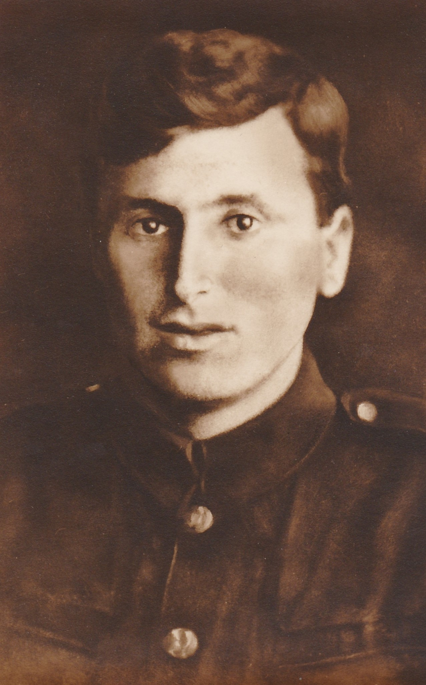

# Introduction

This fall we are going on a Caribou Trail tour to visit all of the Royal Newfoundland Regiment Memorials in France and Belgium with my good Newfoundland buddies Terry Sullivan and Sandy Cyr, along with a number of his siblings and partners. Their grandfather William Sullivan served in the Royal Newfoundland Regiment and his story is one of the threads we will be following.

# Early Life

William Sullivan was born February 22nd, 1893, in the village of King’s Cove, Newfoundland. His parents were Mary Margaret Doyle and Thomas Sullivan. William was the middle child, with an older sister Anne and a younger brother James. His father Thomas worked for Ryan Brothers in King’s Cove, and at the age of 12 William began working there seasonally. William transferred to Ryan Brothers in Trinity in 1914, where he boarded with Mrs Hoskins in Fisher’s Cove. There he met his future wife, Rose Hoskins. In March of 1916, William left Ryan Brothers in Trinity to enlist in the Newfoundland Regiment.

# Military Service

William Sullivan enlisted at St John’s on 24 Mar 1916 at age 23 and spent several months at the Newfoundland Regiment training area at Pleasantville. He sailed to the UK on the SS Sicilian as part of the 3rd Battalion C Company First Newfoundland Regiment draft consisting of 8 Officers and 235 men.

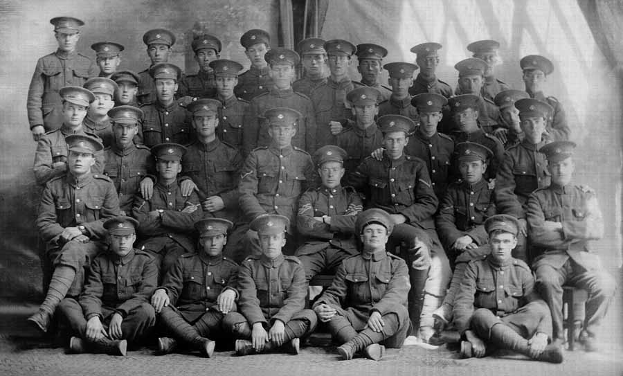

Upon arrival in England, he was sent to the 2nd Battalion (Reserve) in Ayr, Scotland. After several months in Scotland, William was sent to France, sailing from Southampton to Rouen on 30 Nov 1916, joining the 1st Battalion on 12 December 1916, part of a draft of 173 soldiers, bringing the Regiment strength up to 663 soldiers. The Regiment was in Reserve for more than a month, training, and reorganizing.

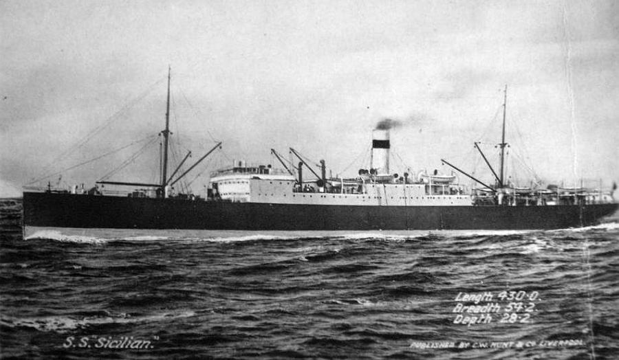

**SS Sicilian**

William was fortunate to miss two major, costly battles before joining the regiment. He missed the 01 Jul 1916 Battle at Beaumont-Hamel where 619 of 721 troops (85 percent casualty rate) became casualties. Only 68 men answered roll call the next day. On 12 October 1916, William also missed the Battle of Gueudecourt where the Regiment suffered 239 casualties.

On 19 Jan 1917, the regiment moved up to Le Transloy to replace the 1st Borderer Regiment. After a week in the line, they moved out of the line to Coisy, for further training for two weeks. During this period, they also received an additional draft of 160 soldiers. On 23 Feb they moved to Sailly-Saillisel for a few days in the line. They moved back into the trenches at Sailly-Saillisel on 01 Mar.

## Battle of Sailly-Saillisel - War Diary Entries 03 Mar 1917

On the night of 1-2 Mar, the Nfld Regt relieved the 2nd Royal Fusiliers, 1st Dublin and 1st Lancashire Fusiliers in PALZ and POTSDAM trenches occupying about 120 yards. On 02 Mar, our dispositions were:

·       PALZ Trench B Company

·       POTSDAM Trench, C and D Company

·       Communications trench between PALZ and POTSDAM 1 Platoon of A Company

·       Old Firing line Platoon of A Company

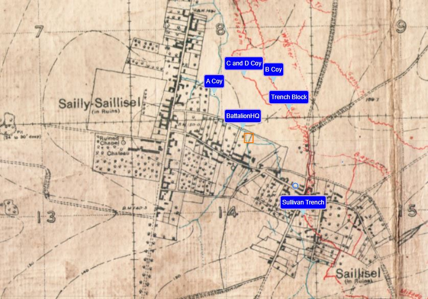

On 02 Mar and during the night of 2/3 Mar there were several small bombing attacks made down PLANET Trench on to the left block of PALZ Trench. Also, a trench mortar was very active in BRUNSWICK trench enfilading PALZ. Enemy snipers were very active, particularly at a gap in the trench about the centre of POTSDAM. A Stokes Mortar was placed in the old firing line to fire on the enemy block in PLANET, and also to cover our own blocks in the left of PALZ trench and WEIMER trench.

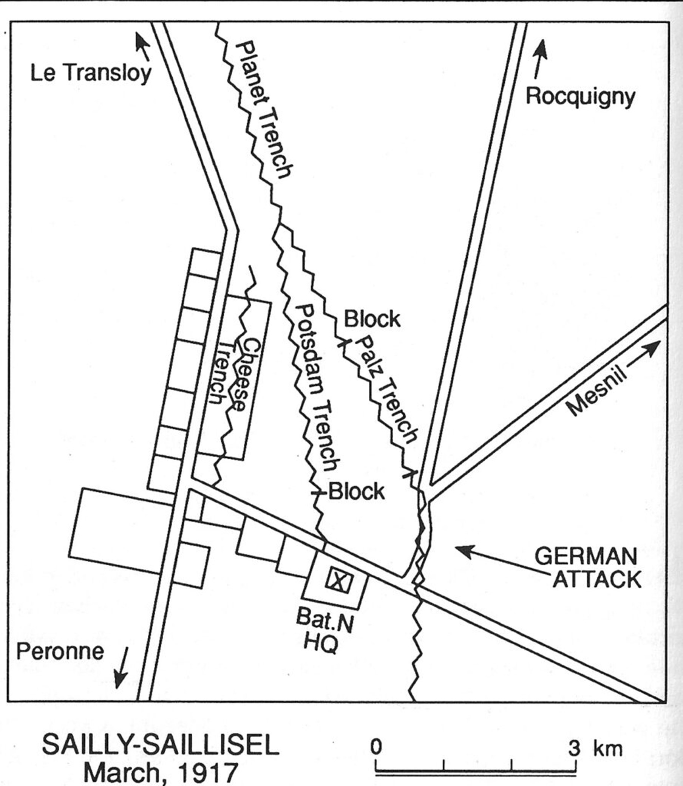

Also trench head wire was cut 20 yards from the left block in PALZ Trench to provide the ability to shoot up PLANET Trench and near the head of our communications trench to PALZ trench to shoot over the right block of PALZ trench.

About 0700 on 03 Mar, the enemy commenced a heavy bombardment of PALZ trench and a 0730 I asked our artillery to retaliate. At 0800, the enemy bombardment became intense and at 0815 the enemy attacked PALZ trench from the south. There was a mist at the time and smoke bombs were also reported. The attackers in the open got to within about 50 yards without being seen. About 50 of the enemy in extended order were reported between PALZ and WIEMER trenches, two men carrying what appeared to be a large wooden box between them. About 50 men also extended on the west side of PALZ trench and a strong bombing attack up PALZ trench itself.

At the moment of the attack a shell pitched just inside the right block of PALZ Trench, killing 2 of the bombing group and wounding 1 of a Lewis Gun team supporting them. The platoon commander had also been severely wounded during the preliminary bombardment. The enemy obtained a footing in the trench, the bombers had thrown all of their stock of bombs and were then driven down the communications trench towards POTSDAM trench, the enemy being checked by the rifle grenadiers in the Trench head near the head of the communications trench. The SOS had been telephoned at 0818 and immediately after all telephonic communication was cut. As the barrage had not started at 0825, I reported the SOS, meanwhile two rockets had been fired from PALZ, and before the third could be fired, the NCO firing them was wounded by a bullet. Owing to the mist, none of the rockets were visible at Bttn HQ. The Lewis Gun near the right block of PALZ trench was damaged and put out of action by the first bomb thrown. The second Lewis Gun in PALZ near the head of the communications trench was put out of action by dirt thrown up by bombs, clogging the action which left only one Lewis Gun bearing on the attackers, the one in the communication trench belonging to the platoon of A Company. The following 3 Lewis Guns were soon brought into action, one from the old firing line, one from support to block WIEMAR trench, one from WEIMAR trench, with the result that there were 4 Lewis Guns on the attackers at less than 200 yards range.

In his attack, the enemy got as far as the head of our communications trench in PALZ, the line of skirmishers to the west of the PALZ occupied an old trench running parallel and about 50 yards to the right of the PALZ-POTSDAM communications trench, and the skirmishers to the east of PALZ occupied the shell holes between PALZ and WEIMAR trenches. At this stage, our barrage had been going for two or three minutes. Lt Byrne made a bombing attack from the left along PALZ trench and Corp Picco up the communications trench. Both attacks were covered by rifle grenadiers. The Rifle grenadiers also fired into the shell holes and old trench occupied by the enemy and drove them out. The Lewis Guns did good work as they retreated.

The counterattack was pushed beyond our original block in the PALZ trench, the retreating enemy being followed up some 100 yards beyond our original block. A new block was made in the PALZ trench some 40 yards in advance of the old one and consolidated.

Casualties: 6 Other Ranks (OR) killed, 2/LT Manuel (seriously) and 26 OR wounded, including William Sullivan.

The Battalion was relieved at night by the 1st Lancashire Fusiliers, except 2 platoons of D company under Lt Paterson who came from the details at Bronfay. They took up their position in CHEESE Support Trench, supporting the Lancs, under the command of their CO. Battalion proceeded to Bronfay in lorries from Combles after having hot soup, at HAYE WOOD from the Battalion Cooker.

## William is Wounded

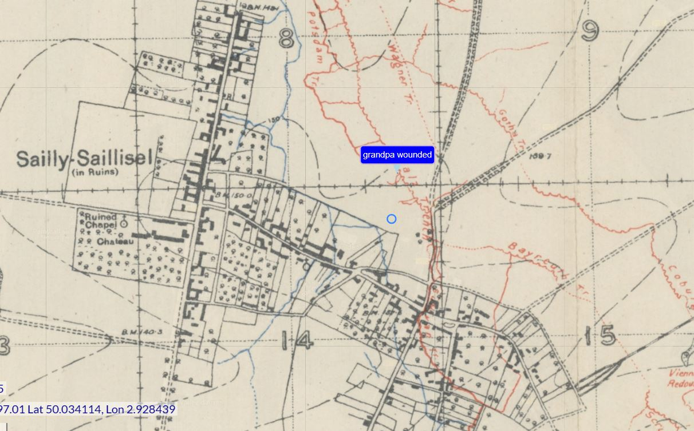

William was wounded in France on 03 Mar 1917 at the Battle of Sailly-Saillisel. We visited the site to pay tribute to his sacrifice.

Based on the trench maps, we were able to locate the field that used to contain the Palz and Potsdam trenches.

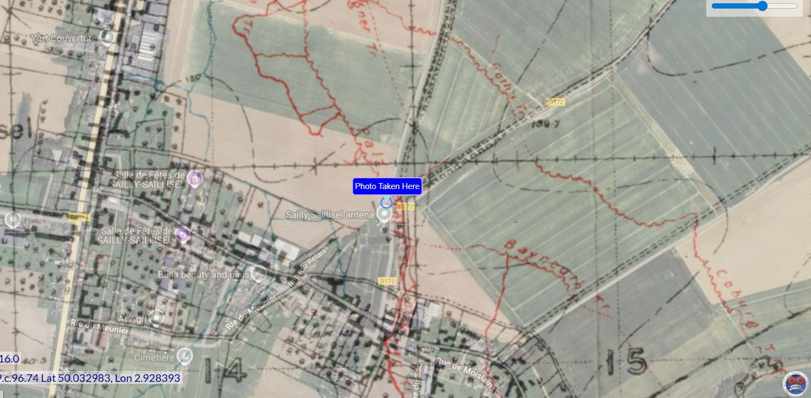

A photo of four Sullivans with their backs to the trench lines. Standing on the ground where a relative was wounded generates indescribably powerful emotions.

William was sent originally to the 60 Field Ambulance, a mobile medical facility then the 2/2nd London Casualty Clearing Station at Meaulte, about 20 km from the battle. On 05 Mar he was sent to the 11th Stationary Hospital in Rouen and was sent to Wandsworth London General Hospital in England the next day.  William suffered severe gunshot wounds in the left thigh (two large wounds in the left thigh and two smaller wounds on the left leg) and slight wounds on the left arm and forehead. By the time he got to the hospital his wounds were septic and was diagnosed with Typhoid Fever.

At the hospital in London, an X-Ray determined he had metal fragments in the left upper arm and forearm, left thigh and outside of the left leg and went through an operation to have them removed. William spent four months in the Wandsworth Hospital, another four months in the Enteric Depot Convalescent Hospital, London before being returned to the Newfoundland Regiment Depot in Ayr, Scotland.

## 2nd Battalion Ayr, Scotland

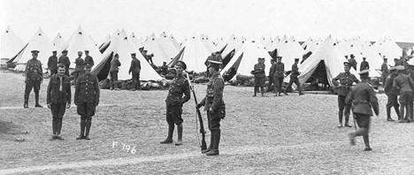

In Nov 1917, William was finally healthy and was sent to the 2nd Battalion (Reserve) in Ayr, Scotland where he remained until 08 Feb 1918 when he was sent back to France, rejoining the unit on 20 Feb in Poperinghe, Belgium. The Regiment was placed in reserve in December 1917 and remained there until the German Spring offensive started on 21 March1918.

The Regiment received the Royal designation in December 1917. The Royal Newfoundland Regiment was the only regiment on which this honour was bestowed during the War, and only the third time that this honour had been given to a regiment in time of war. (The other times were in 1695 and in 1885).

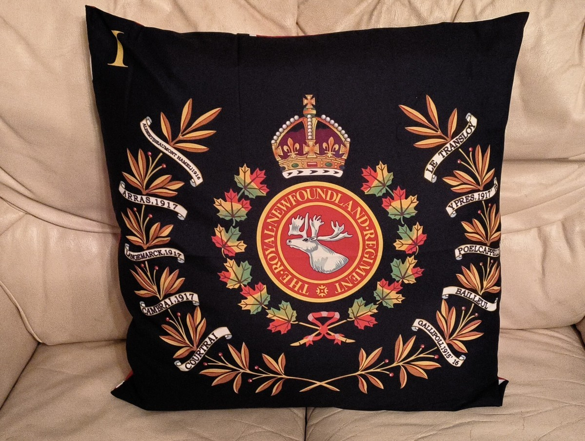

## Rejoining the Regiment

Shortly after returning to the Regiment, William was sent to the 89th Field Ambulance (front line medical unit assigned to the 29th Division) with Cellulitis (a bacterial infection likely caused by his existing wounds) in the leg on 28 Feb. He was transferred to 15 Casualty Clearing Station in Ebberingham, France on 22 Mar, and returned to the unit on 04 April.

The Regiment moved to Mosselmarkt, north of Passchendaele on 08 March 1918 and spent 10 days in the front line before returning to Poperinghe. They returned to the Passchendaele region on 05 April and spent 5 days in the front-line trenches near the Vindictive Crossroads.  William rejoined the regiment in time for this rotation.

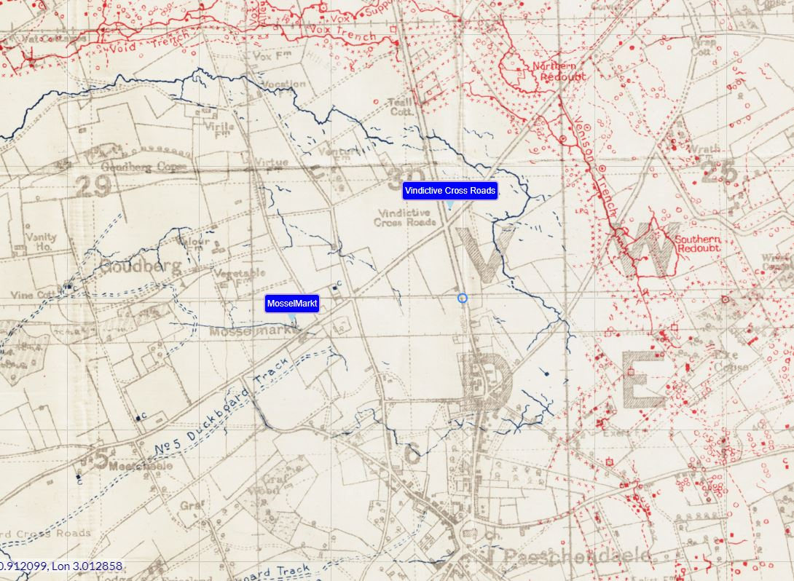

## Bailleul

On their way out of the front lines, the Regiment were sent to Bailleul to stop a potential German break though which threatened the British lines. The Newfoundlanders fought off multiple German attacks, before being finally relieved on 21 April. Casualties amounted to six officers and one hundred and seventy men. The fighting around Bailleul had left the Regiment far below strength, only being able to muster 15 officers and 297 OR. As no immediate reinforcements were available, the Regiment was taken out of the line. On April 19, 1918, the Royal Newfoundland Regiment left the 29th Division of which they had been a part since 1915. The Regiment was assigned to Guard Sir Douglas Haig’s headquarters at Montreuil. They would spend 6 months out of the line, rebuilding the unit.

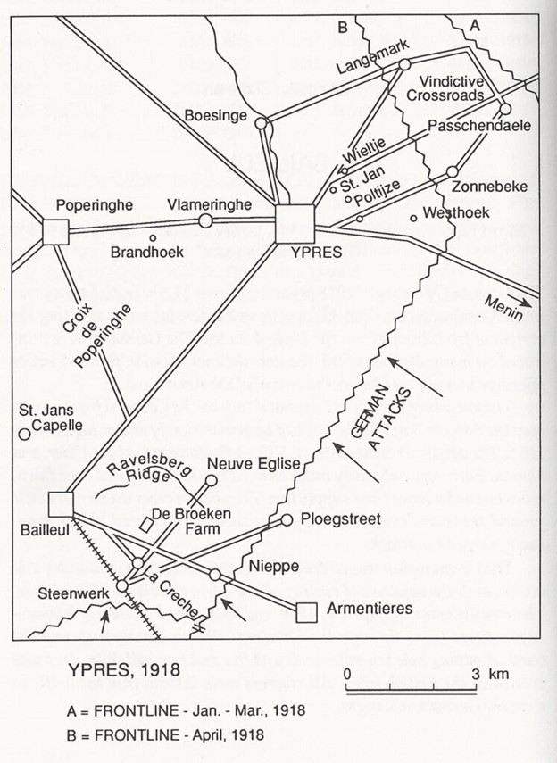

## Ypres 1918

In September 1918, the Royal Newfoundland Regiment as assigned to the 28th Infantry Brigade, of the 9th (Scottish) Division. All of the other battalions in the Brigade were Scottish Units, and the Regiment was bitterly disappointed not to be reassigned to the 29th Division, as they had fought as an integral part of the Division since 1915. The Canadians ensured their units stayed and fought together, but the British moved battalions around with regularity.

On 19 September, the Regiment moved to a position near Hellfire Corner, just east of Ypres. The regiment numbered 724 all ranks. In 10 days, they advanced nearly nine miles.

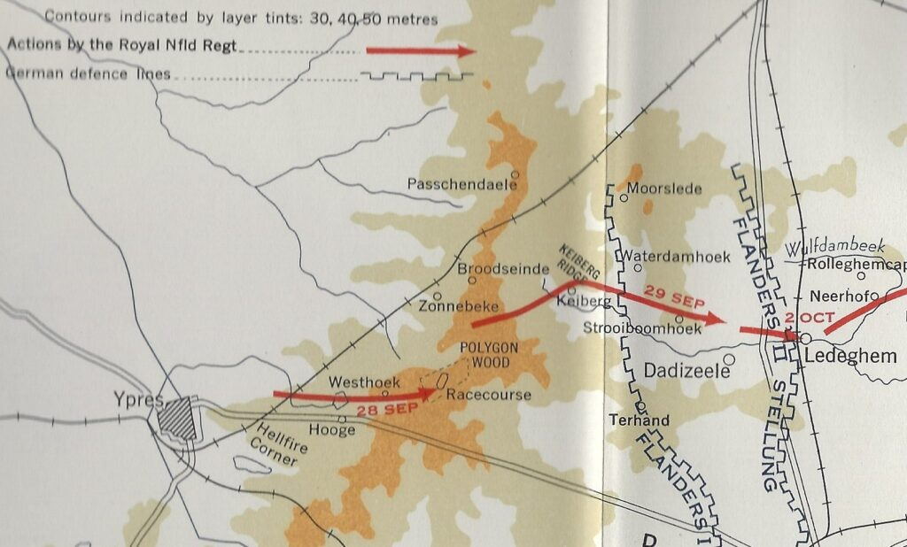

On 28 Sep, they advanced to Polygon Wood, gaining 3 miles and suffering only 15 casualties. The fighting was much more intense the next day as the Regiment took Keiberg Ridge. The Regiment was under direct enemy observation as they attacked the ridge and were able to finally capture the ridge by moving forward in groups of 2 or 3, in short bounds. The regiment was down to half strength by the time they took the ridge but pressed on to the next valley.

LEDEGHEM 2 Oct 1918

After a brief rest, the Regiment moved forward to the outskirts of Ledeghem and for 4 days, stopped multiple German counterattacks. On 14 October, the Regiment pushed the assault forward.

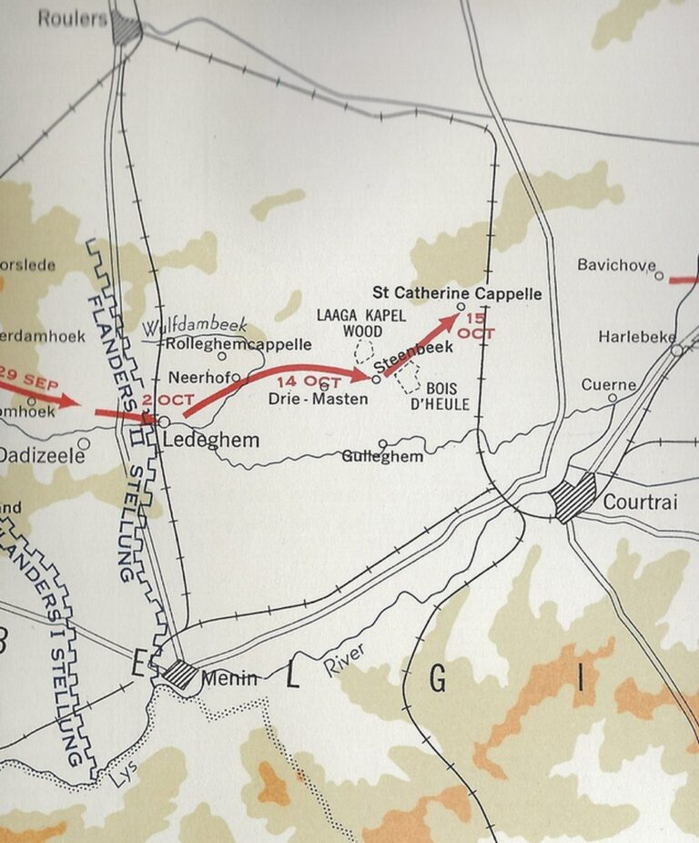

Under a combination of mist and a smoke cover, the Regiment pressed forward. They had difficulty maintaining contact with their unit, but the cover prevented the German Machine Guns from wreaking havoc. The regiment suffered heavy casualties while crossing a small stream but continued pressing forward until heavy fire from the Woods near Drie-Masten threatened their advance.

## Courtrai (Kortrijk)

On 19 October, the Brigade crossed the Lys Canal on rafts and pontoon bridges. The Newfoundlanders were in reserve and were forced to wade across 18-inch duckboards that were under 2 feet of water. The Regiment pushed forward to Vichte, then Ingoyhem facing heavy machine gun fire. They had advanced more than 50 km since the 28th of September and had less than 250 men left in the Regiment. This would be the last battle of the War for the Newfoundlanders.

William was promoted to acting Corporal on 10 October 1918, and had his promotion confirmed on 14 January 1919. The Regiment did no more fighting in the war, and as part of the 9th Division, marched to Germany as part of the Occupation Forces.

William returned to 2nd Brigade, Winchester on 19 Jan 1919, sailed for Newfoundland on 30 Jan 1919, and was demobilized from the Royal Newfoundland Regiment on 24 Apr 1919.

# Post War Life

After the war ended in 1919, William returned to work at Ryan Brothers in Trinity, and board again at Mrs Hoskins home. In 1924 he moved to New York, where his brother James was living. Rose Hoskins, his landlady’s daughter in Trinity, was also living in New York at this time, working and living with her sister, Angela. By 1928 William had returned to Trinity and was again working at Ryan Brothers.

William married Rose Hoskins in 1930, and they had three children, William (Bill) – Terry’s father, Arthur and Lily. They moved in with Rose’s aged mother, Margaret, to help her look after Rose’s three intellectually, disabled siblings. A photo of William and Rose in 1958.

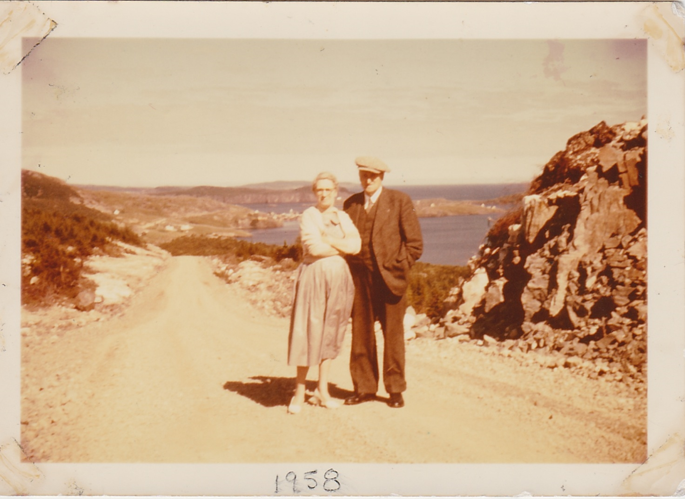

Rose was heavily involved in her community, writing plays, stories and poems about Newfoundland. William was a jack of all trades; he could build a house, including all the furniture and install and maintain the plumbing. In Newfoundland they would say, “William could put an arse in a cat.” A photo of Lily, William and Rose.

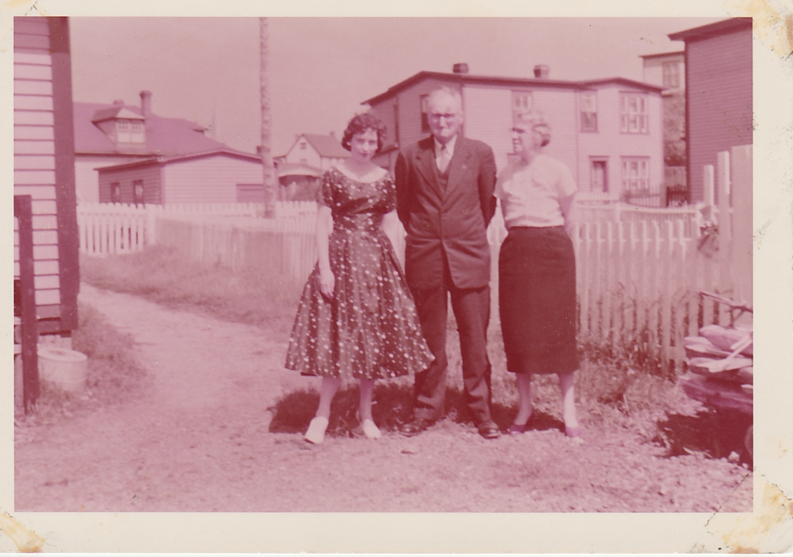

William worked at Ryan Brothers until it closed in 1952 and then became caretaker of the property. Rose died of cancer on 17 March 1964. William then moved into St. John’s to live with his son, Arthur, and his family. On 28 April 1978 William Sullivan died of a heart attack at the Sullivan residence in St John’s.

William is buried in Holy Sepulchre Cemetery, Mount Pearl, Newfoundland. He is buried with his wife Rose and son William.

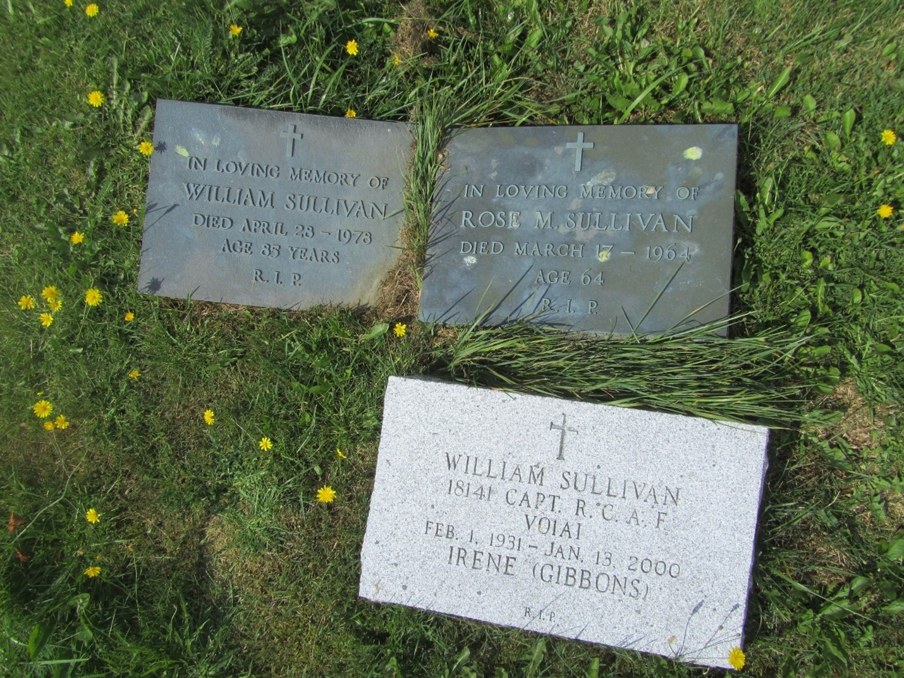

At his funeral, William’s son, Arthur, gave the following eulogy that spoke of William’s loyalty, hard work, and talent.

## William’s Eulogy 01 May 1978 by son Arthur

I would like to say a few words of praise in honour of my father. William Sullivan, Sr. lived for 85 years and 2 months. In all that time, as far as I know, no word of public praise was ever said about him. This was not because he did not deserve it. It was because he neither needed nor wanted public praise, and would, in fact, have been acutely embarrassed by it. But now that he is beyond embarrassment - it would be wrong for him to leave us forever without some public acknowledgement of the fact that his was a remarkably successful and rich life.

He was not a rich man in terms of this world's material possession. For most of his working life - which stretched from the age of 12 to the age of 65 - his earnings placed us, as a family, so far below the poverty line as to make that concept entirely meaningless, It is greatly to the credit of my father and my mother who, unfortunately predeceased him by 14 years, that we - my brother and sister and I lived in complete ignorance of the fact that we were poor. This was partly because everybody else was in the same boat. This was the time when the most accurate and relevant advice about the value of money and about the necessity for careful financial planning was the admonition "Once you break ten cents - he's gone “. But more importantly, we did not know we were poor because my parents, in some way, provided us with all of the necessities of life and even a few of the luxuries. They managed to provide both the inspiration and the resources necessary for an adequate education for each of their children. I do not know exactly what sacrifices my parents made to attain this goal, but I do know that in all the years in which I lived at home, my parents never had a holiday, and my father never had a new suit.

But if my father was not rich in worldly goods, he was rich in all of those things which really matter. He was the epitome of all those qualities which represented the best of outport Newfoundland.

He worked incredibly hard. His workday would begin at 6:00 a.m. or earlier and end at 10:00 p.m. or later and included the hardest kind of physical labour.

He was incredibly loyal. In all the years in which I knew him he never uttered one word of complaint or dissatisfaction concerning his long years of unrewarded drudgery or about the firm which employed him.

He had an incredible range and variety of talents. He was the proverbial jack-of-all-trades. He could build a house, including the chimney and even the furniture, he could install and maintain the plumbing, etc. And he did all of these things with can only be described as professional competence. His genius for repairing things was legendary in Trinity, and, in later years, in St. John's as well.

He took a fierce and tremendous pride in his work and gained great satisfaction from it. No work ever left his hands until he could be proud to have his name and reputation associated with it.

He enjoyed the love of his family and of all those close to him. He enjoyed the respect of all who knew him - an incredibly large number of people knew and liked Billy Sullivan of Trinity.

He died without debts, without enemies, and without regrets - suddenly - in the way that he wanted - because his greatest fear was that he would have to be a burden on his family.

He was one of the last and best that outport Newfoundland produced. When his generation has gone, we shall not see its like again.

His life did not make headlines, but my dearest wish for me and for you is that when we go, we will have, in our lives, as much to give cause for satisfaction and as little to give cause for regret as he had.

# Newfoundland Regiment in France

A total of 8,707 men enlisted in the dominion's three services - the Royal Newfoundland Regiment, the Newfoundland Royal Naval Reserve, and the Newfoundland Forestry Corps. Another 3,296 joined the Canadian Expeditionary Force (CEF). These 12,003 men represented nearly 10 per cent of the dominion's total male population, or 35.6 per cent of all men of military age (between 19 and 35 years old). Newfoundlanders and Labradorians sustained high fatality and casualty rates during the First World War. Fatalities claimed 1,281 (some accounts say 1,305) of the Royal Newfoundland Regiment's men. Another 2,284 were wounded. Rates for the Royal Naval Reserve were lower, but still far too high - about nine per cent of those who enlisted died in the war.

The losses of the Royal Newfoundland Regiment at major battles are given below.

|  |  |  |  |  |  |  |
| --- | --- | --- | --- | --- | --- | --- |
|  |  |  |  |  |  | Royal Newfoundland Regiment Losses |
| Date | Location | Killed | Wounded | Missing/ Captured | Illness | Total |
| Aug-15 | Gallipoli | 22 | 80 |  |  | 102 |
| Jul-16 | Beaumont   (85% casualties) | 233 | 386 |  |  | 619 |
| Oct-16 | Gueudecourt | 120 | 119 |  |  | 239 |
| Mar-17 | Sailly-Saillisel | 27 | 44 |  |  | 71 |
| Apr-17 | Monchy-le-Preux | 166 | 141 | 150 |  | 457 |
| Jul-17 | 3rd Ypres | 67 | 127 |  |  | 194 |
| Nov-17 | Cambrai | 175 | 272 |  |  | 447 |
| Apr-18 | Bailleul | 71 | 105 |  |  | 176 |
| Sep-18 | Ypres | 103 | 203 |  |  | 306 |
| Oct-18 | Ledeghem | 41 | 171 | 15 | 107 | 334 |
|  | Total | 1025 | 1648 | 165 | 107 | 2945 |

My own Grandfather was wounded in WWI and I often think about the difference between surviving the war and the end of a family line being a matter of inches.  That’s why visiting the cemeteries is so powerful, a chance to honour the fallen who did not get the opportunity to have their own families.

# Bibliography

Gogos, Frank, The Royal Newfoundland Regiment in the Great War, Flanker Press, St John’s, NFLD, 2015.

Nicholson, G.W.L, The Fighting Newfoundlander, a History of the Royal Newfoundland Regiment, Government of Newfoundland, St John’s, NFLD, 1964.

A copy of this book is available online:

<https://collections.mun.ca/digital/collection/cns/id/163779>

Parsons, David, Pilgrimage: A guide to the Royal Newfoundland Regiment in World War One, Creative Publishers, St John’s, NFLD, 1994.

Royal Newfoundland Regiment Museum

<https://rnfldrmuseum.ca/history/regimental-history/first-world-war-1914-1918/>

War Diaries

<https://www.therooms.ca/sites/default/files/war_diary_-_complete_-_sept_1915_-_feb_1919.pdf>

* [First World War](https://www.paulsbattlefieldtours.com/blog/categories/first-world-war)
* [Family](https://www.paulsbattlefieldtours.com/blog/categories/family)
* [Battlefield Tours](https://www.paulsbattlefieldtours.com/blog/categories/battlefield-tours)