# Disaster at Dieppe

* [pd-allen](https://www.paulsbattlefieldtours.com/profile/pd-allen/profile)
* Sep 13, 2023
* 4 min read

Updated: Sep 25, 2023

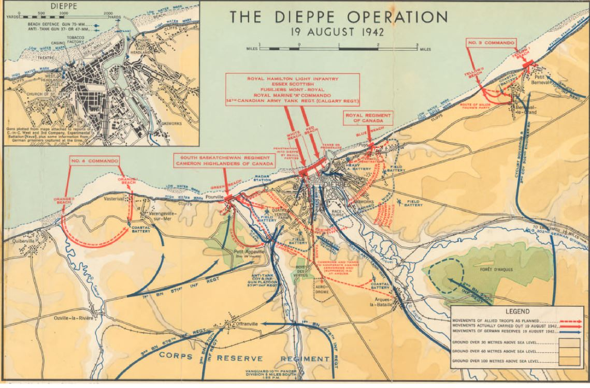

In 1942 the Allies were under pressure to open up a second front against the Germans. They did not have the resources for a full scale invasion, so it was decided to execute a one tide assault on the French port of Dieppe. The Canadians had been in England since 1940 and were desperate to get their troops into action, so insisted in being part of the raid despite have no input in the planning. Lord Louis Mountbatten (cousin to the king) had overall responsibility for the Raid, and since his organization had participated in several successful raids, decided to press on despite a lack of intelligence on the German defences, a lack of supporting naval and ultimately no pre attack bombing as there were concerns about civilian casualties.

Dieppe is a large harbour with a stone beach and large cliffs on either side that contained substantial gun batteries. The first picture is looking west, and the second one is looking to the east from the main beach in front of the port.

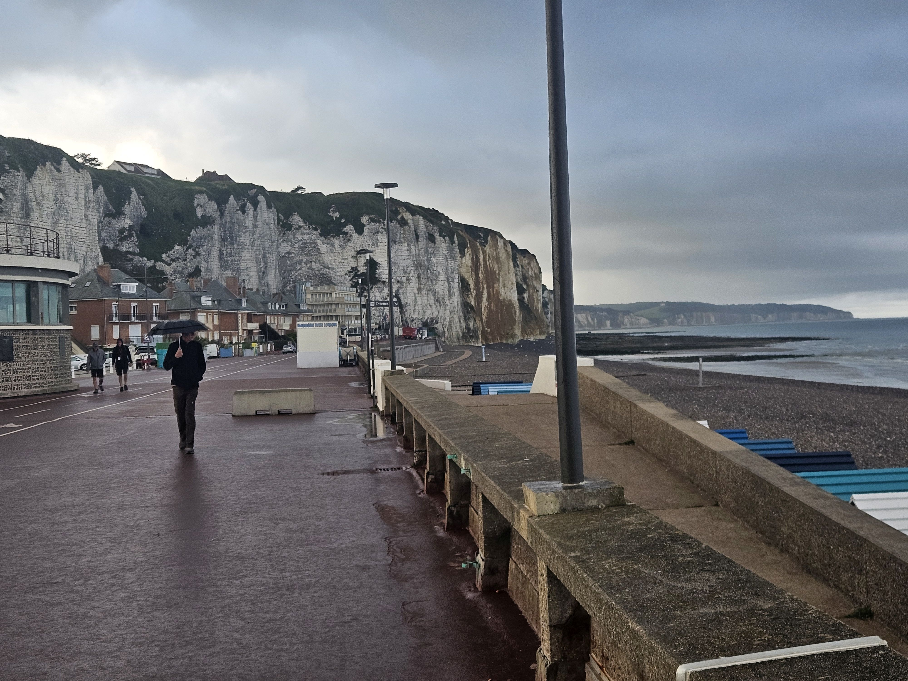

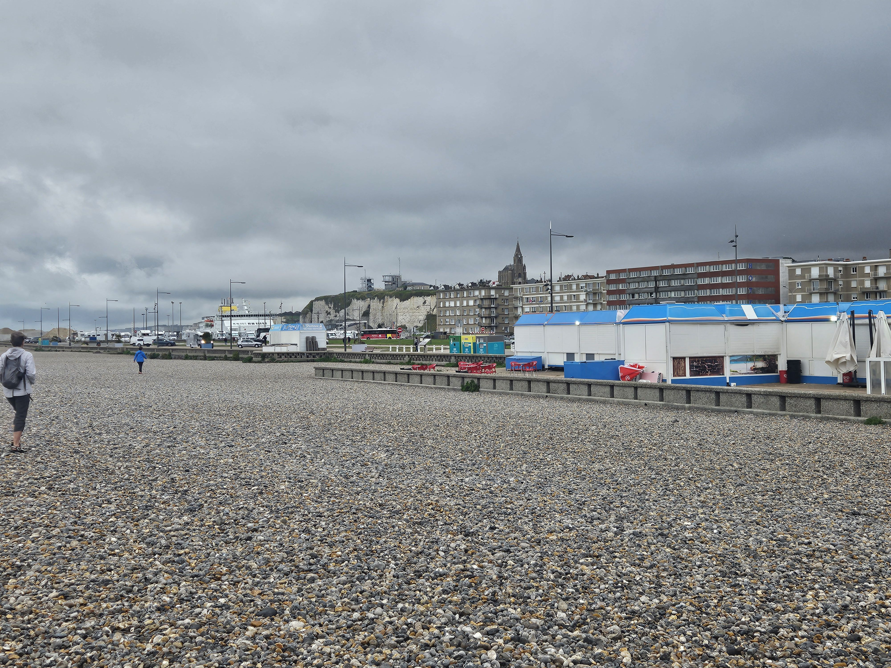

The beaches are made of stones, and have a steep slope that is 30 feet from the waterline to the grass.

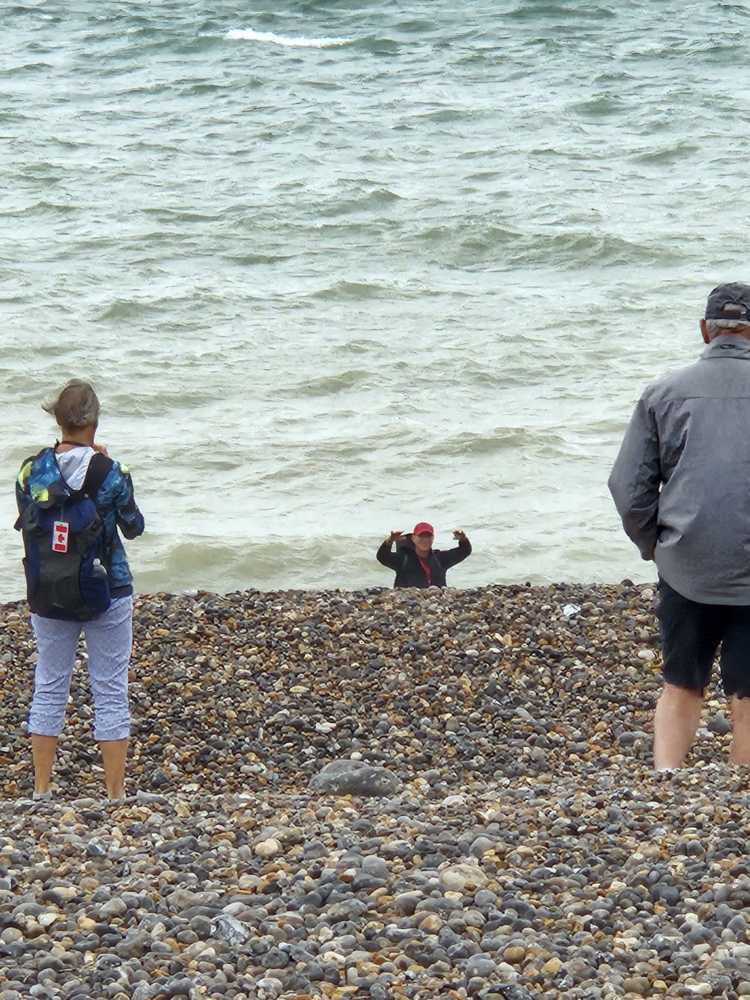

In order to take out the cliff based guns, secondary raids were planned to go in at Puys east of the cliffs and Pourville in the west. Both of these beaches were surrounded by high, well defended cliffs.

At Puys, there was a bunker part way up the cliff that had a field of fire right down the beach line.

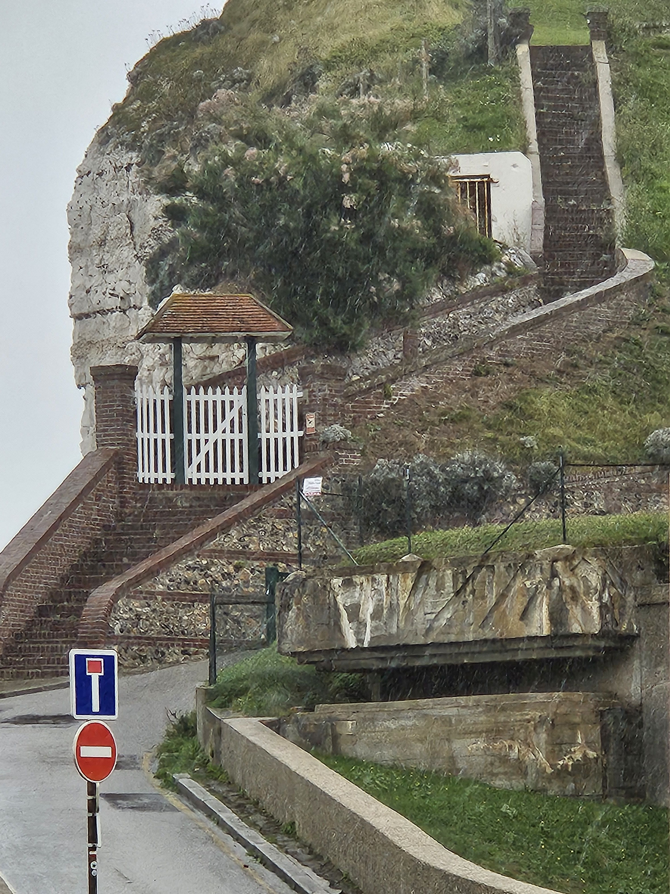

The troops were going to have to come ashore then scale the cliff to reach the gun emplacements.

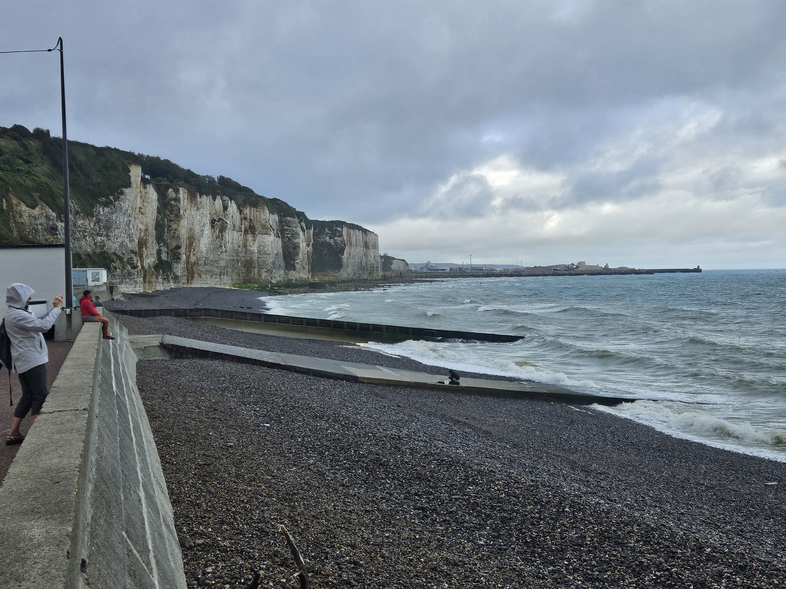

The terrain is similar at Pourville with steep cliffs on either side. The first picture is the cliffs to the west that the troops would have to scale.

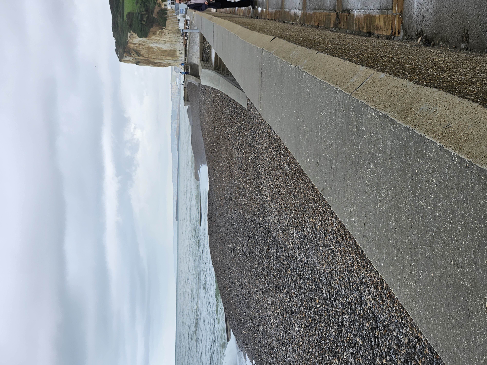

The next view are the cliffs to the east of Pourville.

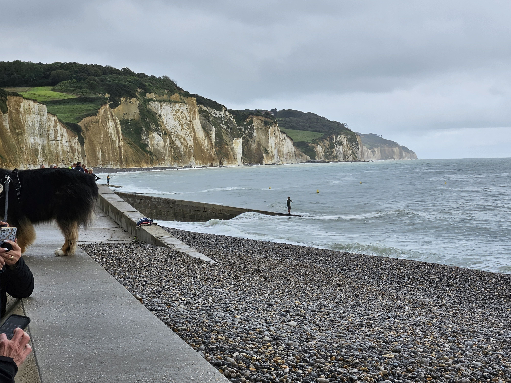

The view from one of the gun emplacements on the western cliff of Dieppe beach shows why the troops assaulting the main beach did not have a chance.

The plan was overly ambitious, and the terrain very hostile to the attacking force so there is little wonder why the assault failed so miserably.

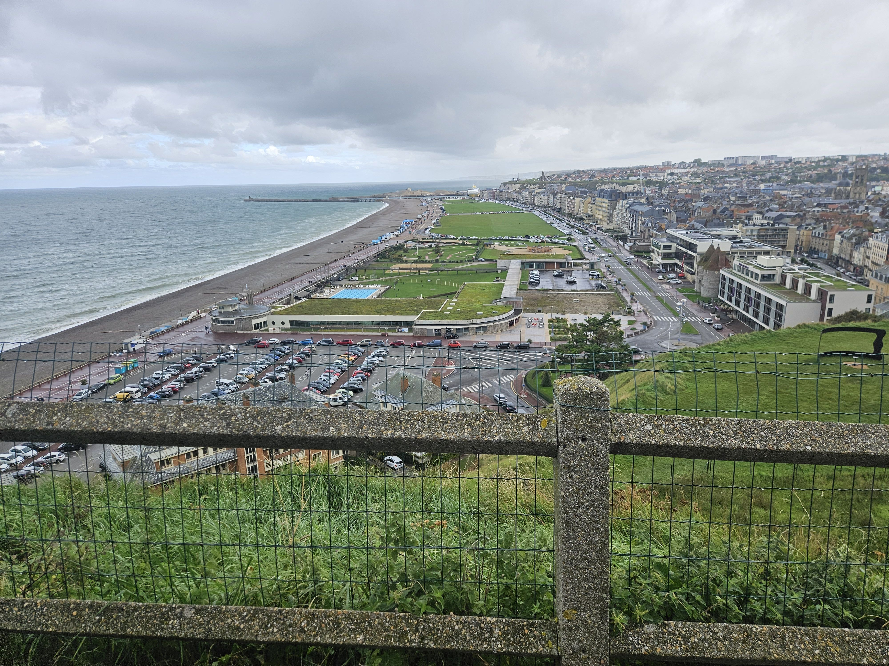

View of the main beach from the gun emplacements.

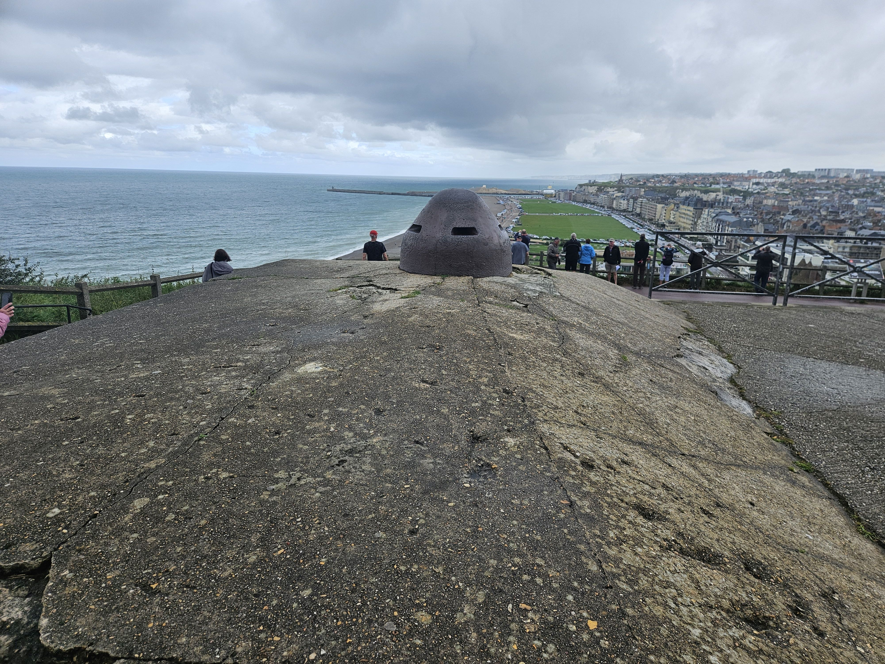

Text from the Canadian encyclopedia. The Canadians assaulted Dieppe at four designated sections. At Blue Beach, below the village of Puys (1.6 km east of Dieppe), troops of The Royal Regiment of Canada and The Black Watch (Royal Highland Regiment) of Canada arrived late in their bid to take out enemy artillery and machine. From the start the enemy pinned down the Canadians and shot them up until the raid was over.

On the other side of the town at Green Beach, by the village of Pourville (4 km west of Dieppe), the South Saskatchewan Regiment arrived on time and in the dark. Unfortunately, the part of the unit tasked with reaching a radar station and anti-aircraft guns to the east of Pourville landed on the west side of the River Scie, which ran through the village. These troops had to cross the river on Pourville's only bridge, which the Germans ferociously defended. Ultimately, both the South Saskatchewans and Cameron Highlanders of Canada were pushed back.

At Red and White Beaches directly in front of the main port, the Essex Scottish and Royal Hamilton Light Infantry (RHLI) regiments landed without their armoured support, the 14th Canadian Army Tank Regiment (the Calgary Tanks), which was late. The enemy, from higher ground and in the town's beachfront casino, hit these units hard. Some infantry managed to get off the beach and enter Dieppe, but the Canadians also failed to achieve their objectives here.

Meanwhile, the Calgary Tanks that did arrive onshore were restricted in their movement, many becoming bogged down by the shingle beach (consisting of large pebbles, known as chert). Some tanks made it into the town, but their guns were unable to destroy the enemy's concrete barriers that lay in their path. Those tanks that survived the assault provided covering fire for the force’s evacuation.

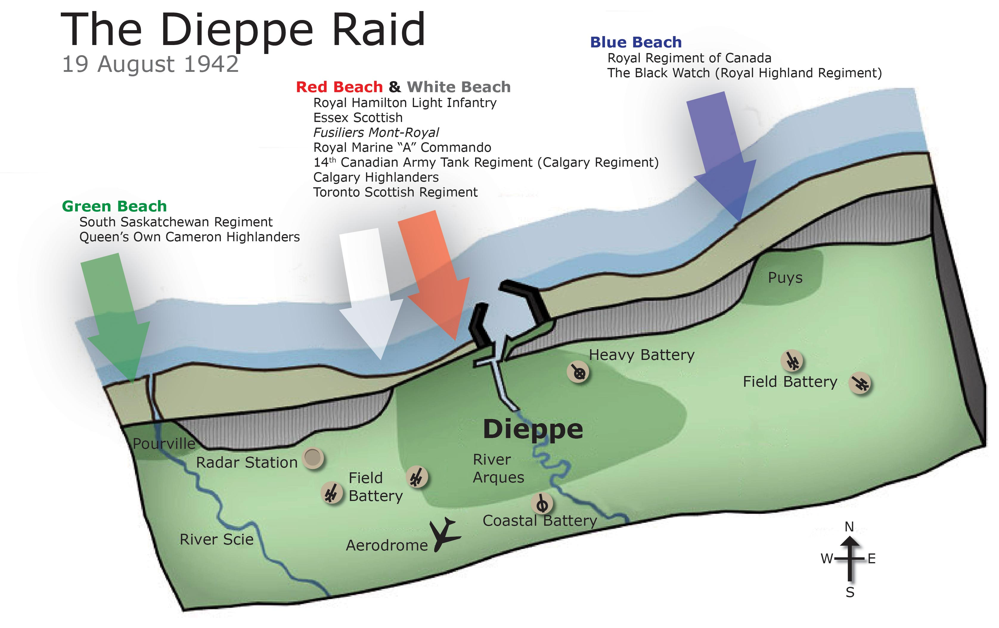

The raid was over by mid-day. In nine hours, of the nearly 5,000 Canadians participating in the raid, 907 Canadian soldiers were killed, 2,460 were wounded, and 1,946 were taken prisoner. This was the Canadian's largest single day loss of the war. Fewer than half the Canadians who departed for Dieppe made it back to England.

Although he had little input in the planning Major General Hamilton Roberts 2nd Division was the scape goat, and never held an operational command again. He is reported to have told the men it was a piece of cake, and after the war, every year until his death, on August 19 a cake was delivered to his home.

After the battle, there was a great deal of spin put on the disaster, claims were made this was a rehearsal for D-Day and that every soldier who died saved 10 lives on D-Day. It is true the Allies did learn to have adequate reconnaissance, intelligence on enemy positions, and never ever invade a heavily defended harbour, which led to the development of the artificial Mulberry Harbour.

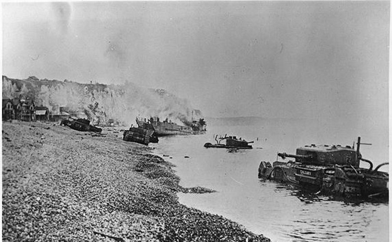

After touring the battle sights, we got to see the effects of the raid at the Dieppe Canadian Military Cemetery. 582 of the 765 identified personnel are Canadian, with a further 187 unidentified.

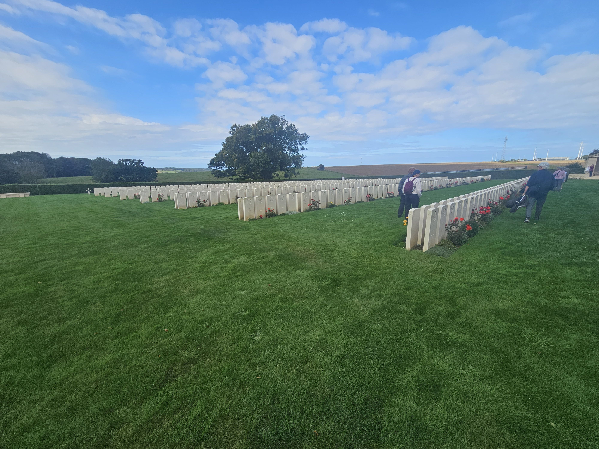

This cemetery was started by the Germans after the raid. They forced French civilians to load the corpses off the beaches, and take them to the cemetery.

The first few rows of the cemetery the bodies are buried in the German style, head to head, so the tombstones are back to back.

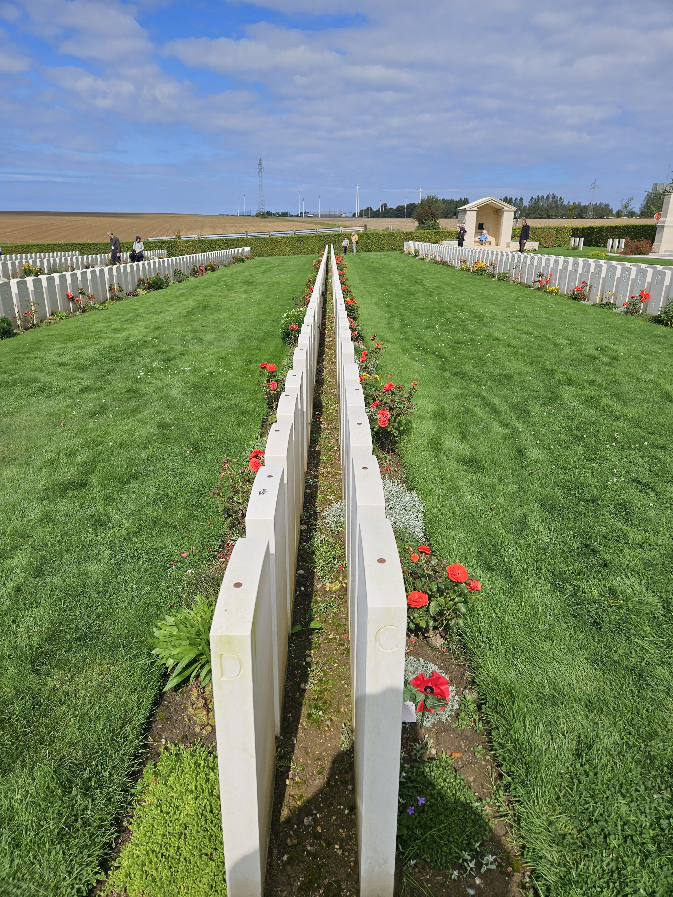

The dedications are always moving. This one got me today:

"Having done your task, you may fold your hands and close your eyes in sleep."

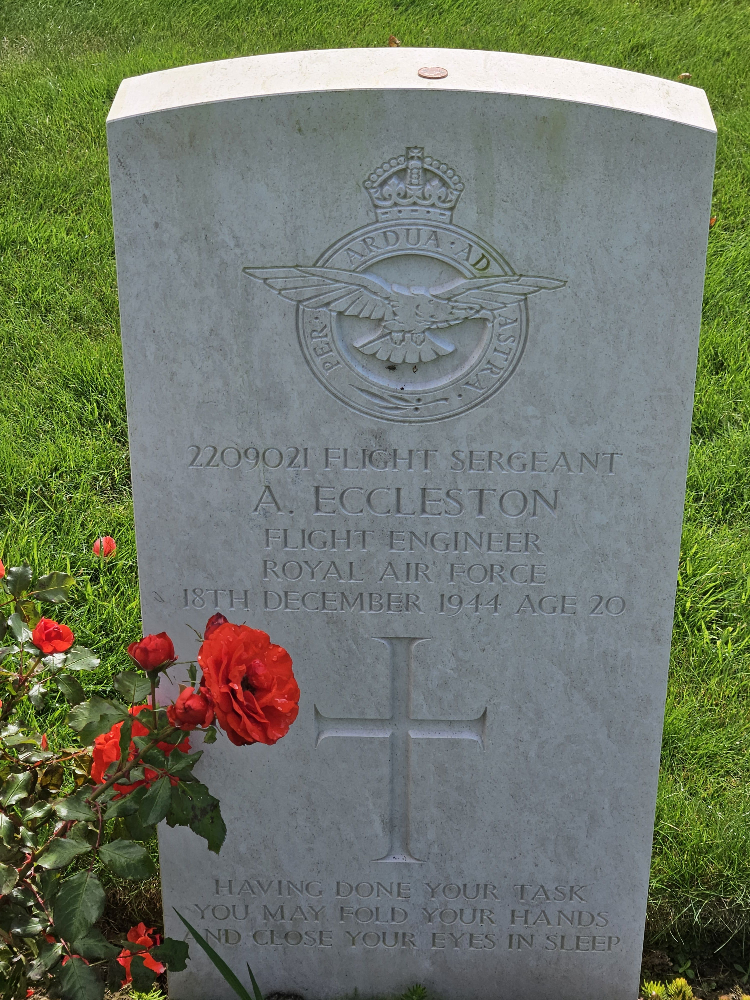

* [Second World War](https://www.paulsbattlefieldtours.com/blog/categories/second-world-war)
* [Battlefield Tours](https://www.paulsbattlefieldtours.com/blog/categories/battlefield-tours)