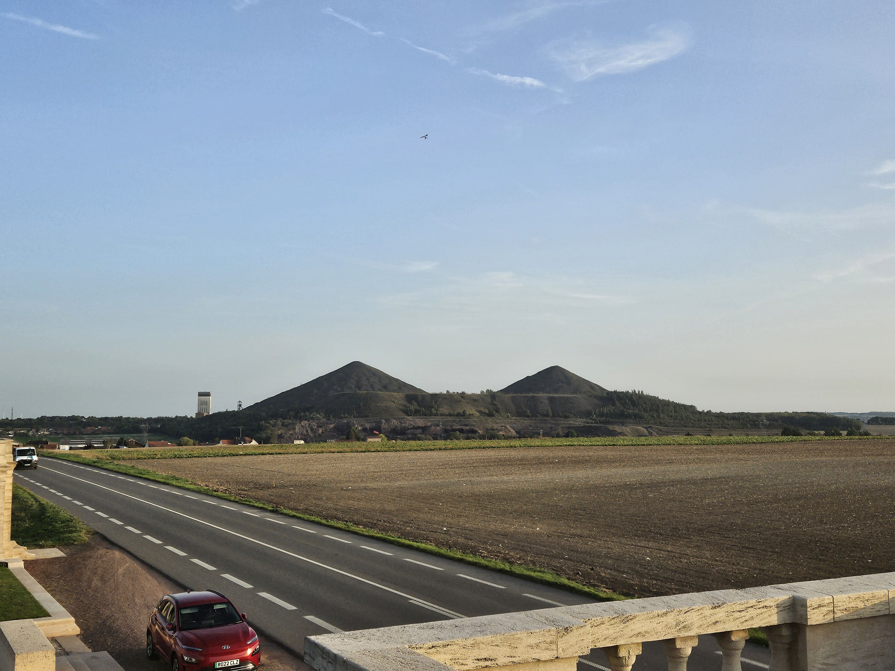
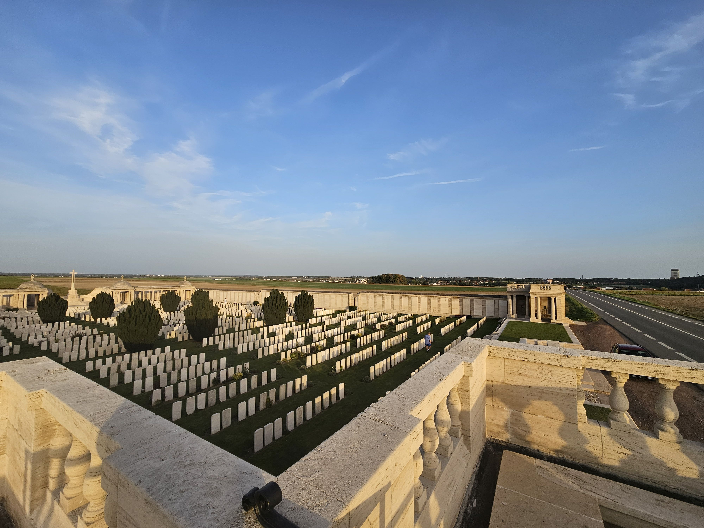
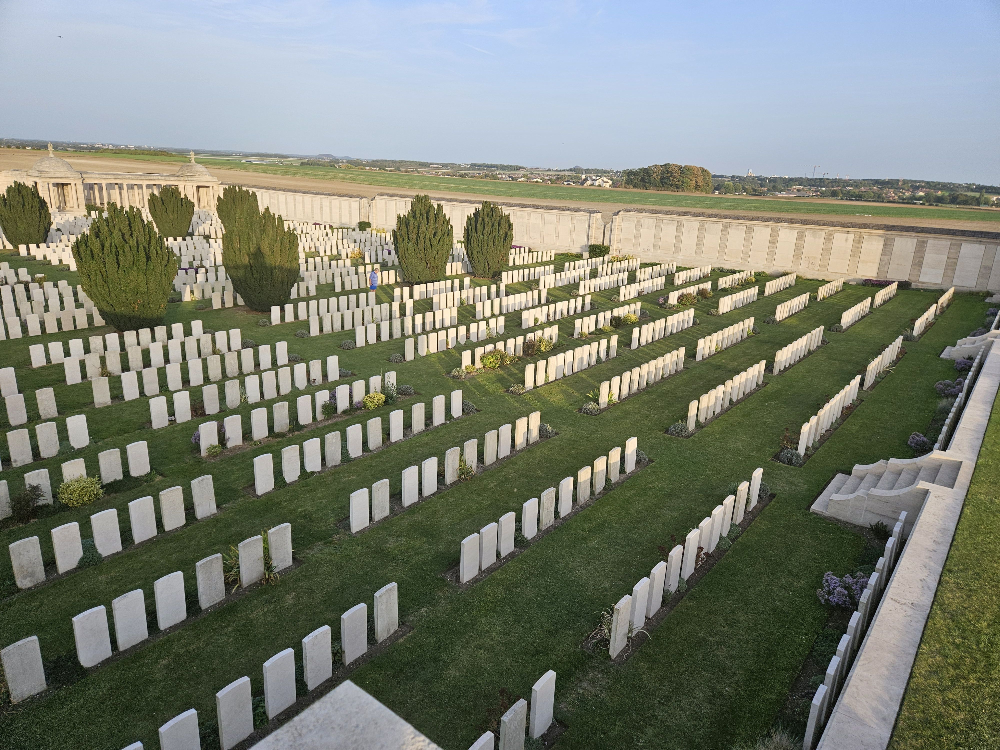
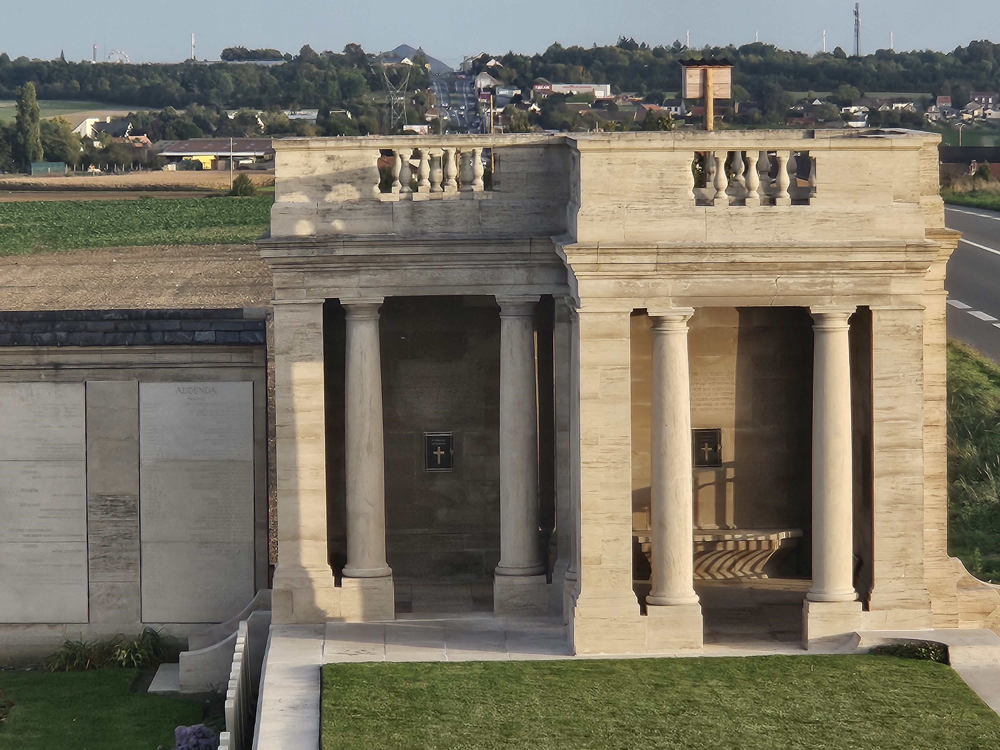
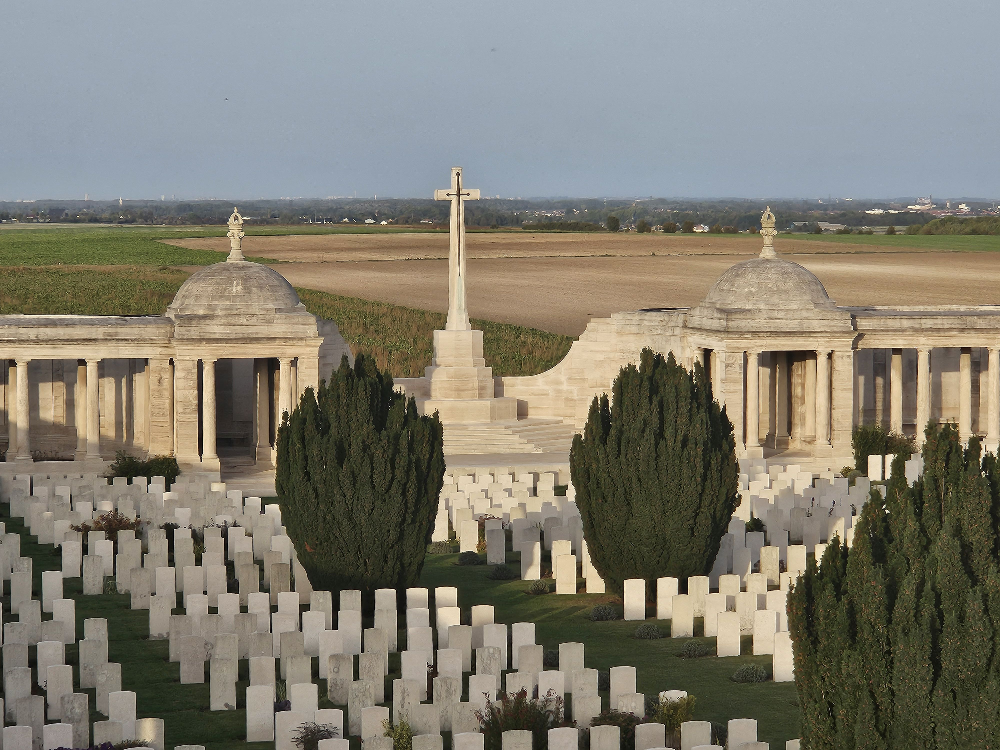
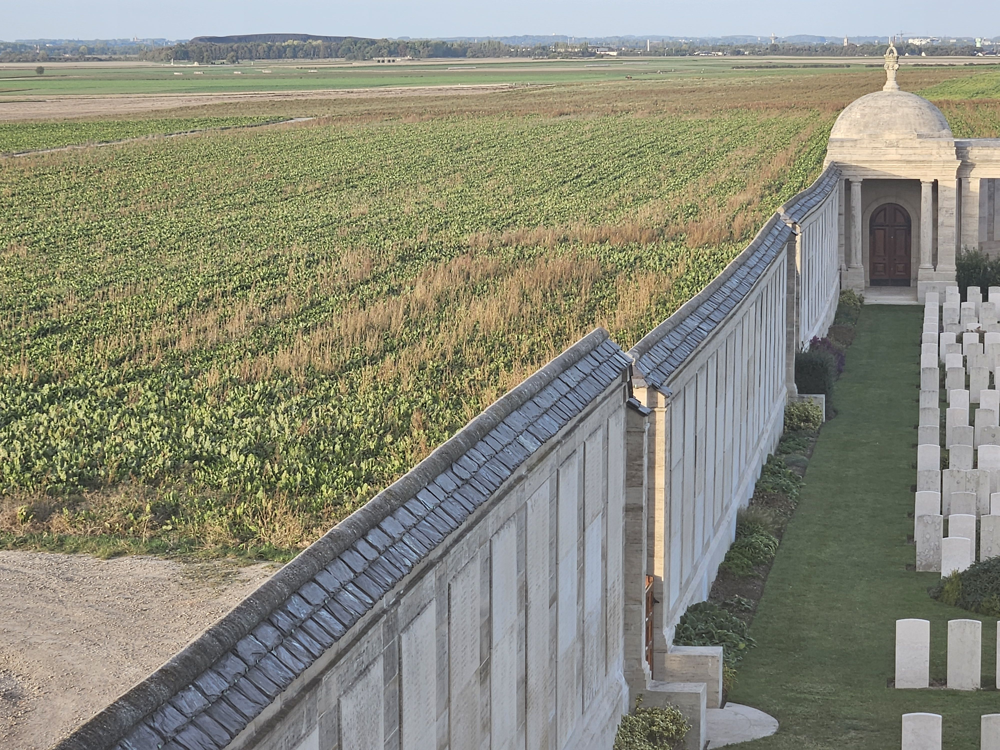
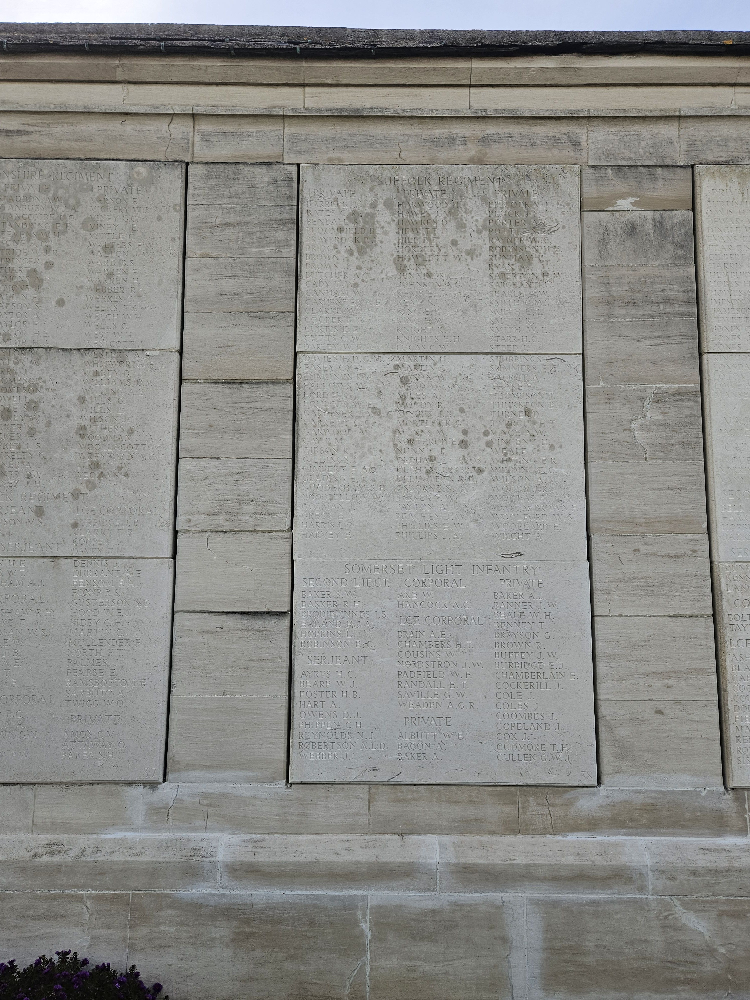
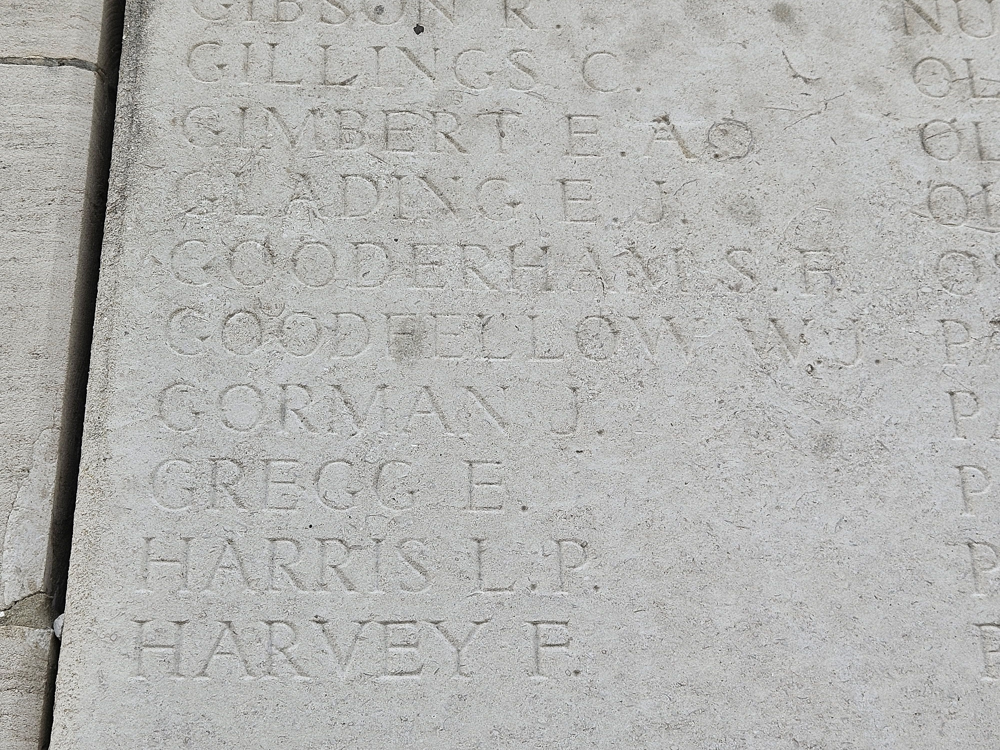
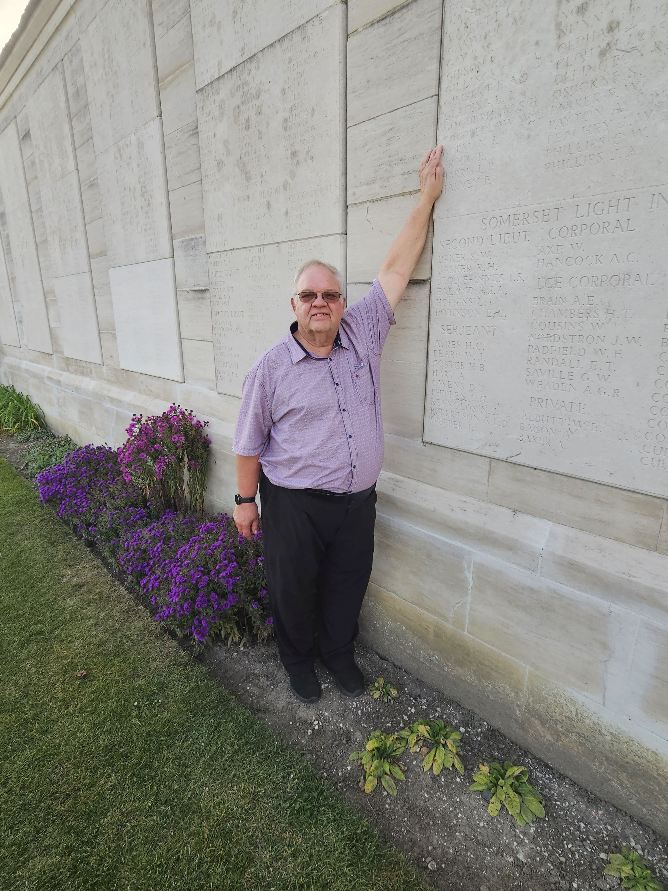
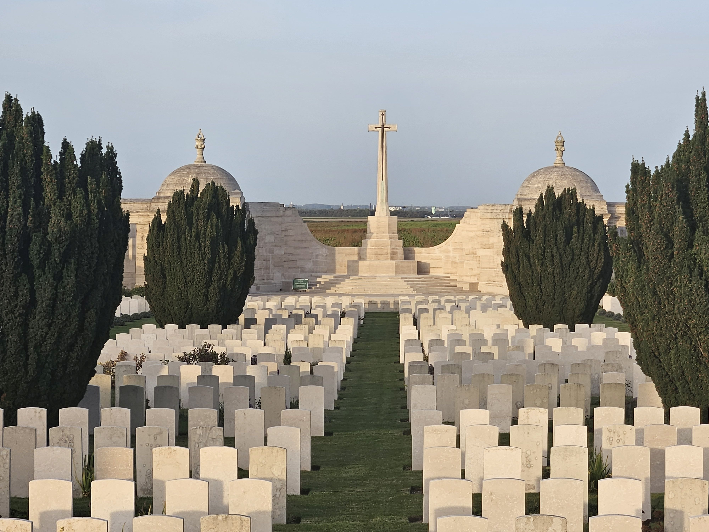

# Dud Corner Cemetery - Walter Goodfellow

* [pd-allen](https://www.paulsbattlefieldtours.com/profile/pd-allen/profile)
* Oct 13, 2023
* 3 min read

On our recent Somme Tour, we traveled from Fromelles to Vimy, and passed near by the Dud Corner Cemetery and Loos Memorial. We stopped in to pay respect to Walter Goodfellow, 7th Suffolk Regiment, the third Goodfellow brother killed in the war. Walter was killed on 03 Nov 1915 at the age of 24, in the aftermath of the Battle of the Hohenzollern Redoubt. There will be a separate post on Walter.

The Dud Corner Cemetery is located in Loos-en-Gohelle, France about 5 miles from Lens. There were only 5 soldiers buried here during the war, but it became a concentration Cemetery after the war and now contains 1,812 gravestones, 1,126 of them who are unidentified. The cemetery was named Dud Corner due to the number of Dud (unexploded) artillery shells that were fired in the early days of the war. It is estimated that 30% of the shells fired in the Great War were duds, but in the early days of the war the percentage was closer to 50% as manufacturers rushed to increase production.

The region used to be a major coal production area, and twin slag heaps remain as a reminder to that era. The cemetery and memorial are located beside a busy 4 lane road for easy access. It does not have the peaceful setting of many of the cemeteries located in farmer’s fields, but number of commemorated souls is a powerful force.

The left-hand tower at the front of the cemetery has a viewing platform that allows a great overview of the cemetery.

This tower gives a bit better view of the size of the cemetery, but only a drone shot really does justice to the expanse.

The ornate structures of the towers add to the grandness of the cemetery.

The cross of sacrifice at the rear of the cemetery. The Grave markers always face the cross, and the size of the cross is determined by the number of graves in the cemetery.

In addition to the cemetery, the two side walls and the back wall form the Loos Memorial contain the names of 20,638 soldiers who fell in the Loos area and have no known grave. This included 165 men of the Suffolk regiment, mostly from the 1st and 7th Battalions, and includes Walter Goodfellow, killed 03 Nov 1915 at the age of 24 in the aftermath of the Battle of the Hohenzollen Redoubt.

The panels are 15 feet high and list the fallen by regiment. The panels can be seen on the left wall.

The Suffolk Regiment names are listed on Panel 38, near the back of the left-hand wall.

The Suffolks are listed on Panel 38 on the top portion.The regiment names are sorted by rank, then alphabetically. Here is Walter’s name.

I am pointing out his name on the list.

As with all of the Commonwealth War Grave Commission Cemeteries, Dud Corner is immaculately kept with beautiful flowers and trees.

View from the front of the cemetery.

Visiting Walter’s memorial was important to me as it competed the Goodfellow Brother pilgrimage. As described in previous posts, Henry died during the first days of the War at Le Cateau on 26 Aug 1914 at the age of 34. He is commemorated at the Monument to the Missing at LA FERTE-SOUS-JOUARRE MEMORIAL on the River Marne, and at the Suffolk Hill Memorial. Ernest died on 03 May 1915 at the Battle of Frezenberg Ridge at the age of 30 and is commemorated at the Menin Gate. Both Henry and Ernest were soldiers before war broke out. Walter, age 24, is commemorated here at the Loos Memorial. The youngest brother Thomas survived the war, despite being in France from Apr 1915. He was gassed and in ill health the rest of his life, passing away at the early age of 49.

* [Family](https://www.paulsbattlefieldtours.com/blog/categories/family)
* [First World War](https://www.paulsbattlefieldtours.com/blog/categories/first-world-war)