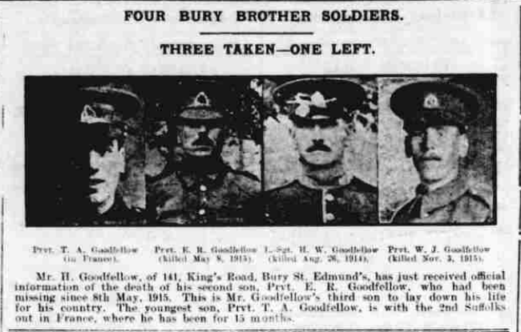
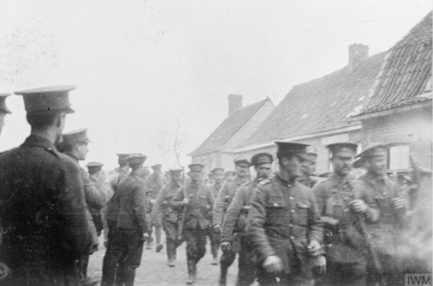
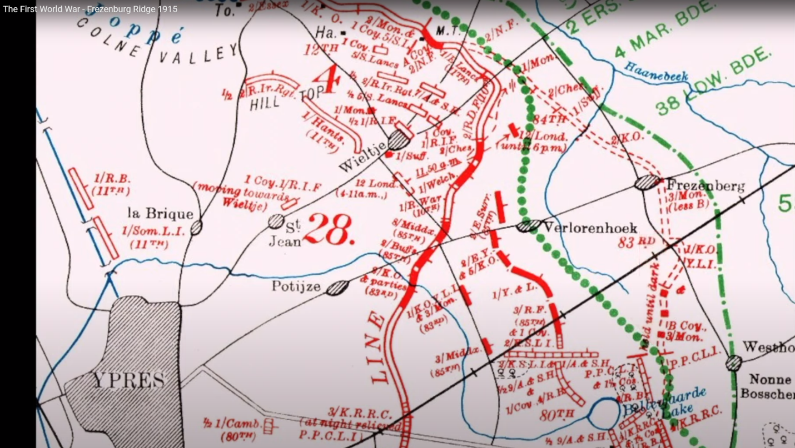
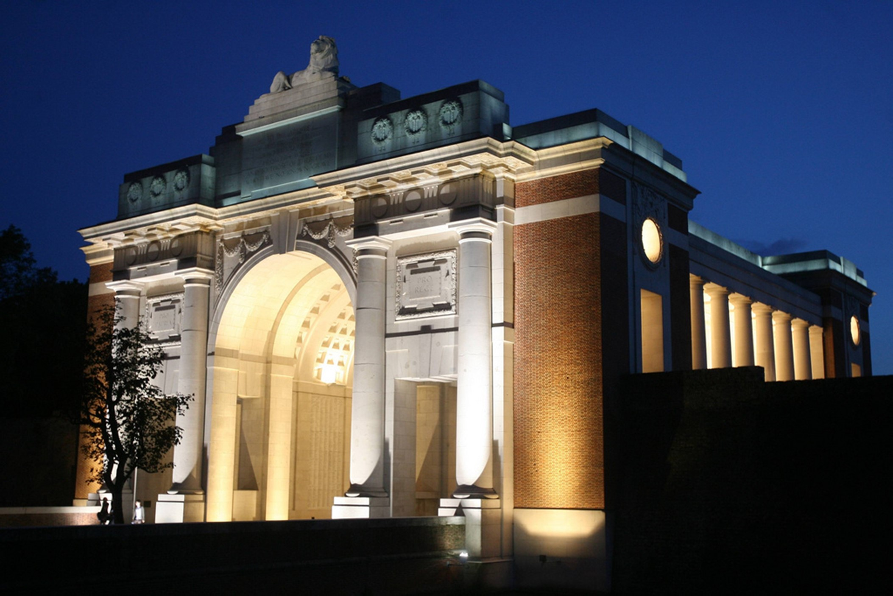
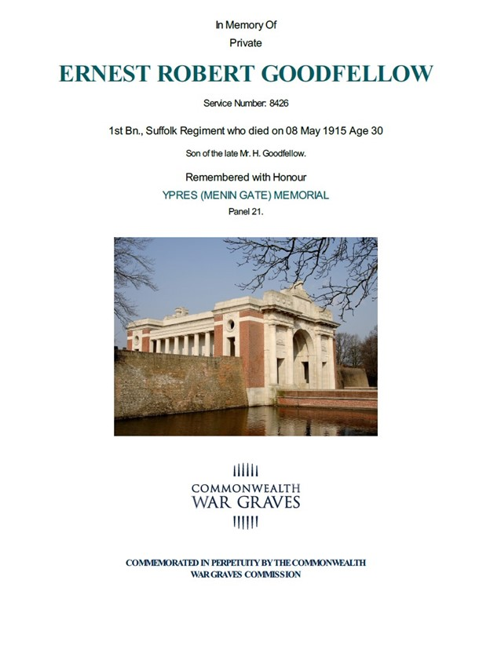
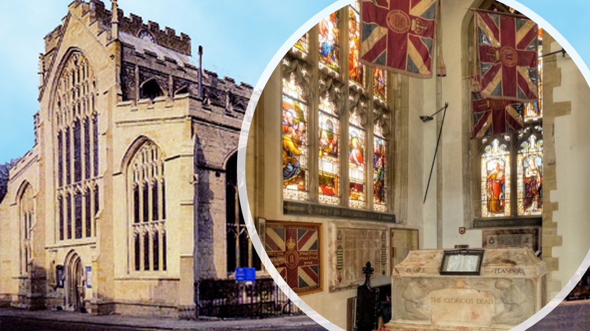

# Ernest Goodfellow - 1st Battalion Suffolk Regiment

* [pd-allen](https://www.paulsbattlefieldtours.com/profile/pd-allen/profile)
* Oct 14, 2023
* 5 min read

Ernest Robert Goodfellow was born 05 Jun 1889 at 10 Old Barracks, Cemetery Road, Bury St Edmonds. His father was Henry Goodfellow, and his Mother Maria Reynolds. Ernest was baptised on 23 Nov 1896 at St James Church, 12 days after his mother’s death.

Ernest was one of 4 Goodfellow brothers to serve in the War. Sadly, Henry, Ernest and Walter were killed and the youngest Thomas survived the war, but had been gassed and was in ill health for the rest of his short life. The Goodfellow brothers were cousins to my maternal grandmother Annie Johnston (Goodfellow).

Ernest enlisted in the 1st Battalion Suffolk Regiment on 03 Feb 1912 at the age of 22. The 1st Battalion served in Alexandria until 23 Jan 1912 then were posted to Cairo, Egypt. On 24 Jan 1914 they moved again to Khartoum, Sudan, where they were stationed at the outbreak of war.

The Battalion returned to England, arriving at Liverpool on 23 Oct 1914 aboard the HMT Grantully Castle. On 17 Nov 1914, the unit was sent to Folkestone and was allotted to the 84th Brigade of the 28th Division under Maj-Gen E.S. Bulfin. Three weeks later they moved to the divisional concentration area at Winchester in the south of England. On 16 Jan 1915, the battalion, nearly 1000 strong, marched to Southampton and sailed on the SS Mount Temple to Le Havre.

On 02 Feb, the Battalion proceeded to Vlamertinghe, Belgium in a convoy of 39 busses, and marched into Ypres where they would spend the next few months. The Battalion entered the trenches between the Ypres-Comines Canal and Hill 60 on 05 Feb. The trenches were in terrible shape, many of them being 2 feet deep in water. Under constant shelling, the Battalion remained in the trenches until 09 Feb, when they went into billets near Ouderdom. 
On 15 Feb, the Germans attacked and breached the divisional front line. The 1st Suffolk Regiment was called up to the area south of Ypres and west of the canal to support a counterattack on “O” Trench. After a few days in the line, the Battalion was relieved, and marched back to Kruisstraat. The results of this battle were 23 Dead, 59 Wounded and 174 missing, later confirmed dead. Due to the poor conditions of the trenches, the Battalion spent 24 hours in the line, then had 24 hours away from the front.

On 12 Apr, the 1st Battalion marched from Dranroute to Popernghe, passing through Westoutre where the 2nd Battalion Suffolk Regiment were billeted. This was the first time in regiment history that the 2 battalions met on active service. Many of the men had trained together, then gone off and had not seen one another for many years. In the prewar army, one battalion was overseas while the other battalion would be in England.

On 22 Apr, at the northern end of the Ypres Salient near St Julien the French and Canadian troops were subjected to a gas attack, the first of the war. The gas was released at 5 PM when the wind was blowing in the right directions. This new terrifying weapon caused the troops to run in panic and caused up to 5,000 deaths and 15,000 casualties. The Germans also advanced 3-4 km, broke the Allied lines and threatened Ypres.

The 1st Battalion Suffolk Regiment as part of the 28th Division BEF pressed forward and battled along side the 1st Canadian Division to counter the German attack. After 2 days fierce fighting, the Canadians were subjected to a second gas attack. Although suffering heavy casualties, the Canadians held firm and allowed time for French and British reinforcements to come on the battlefield. Although severely outnumbered, the Canadians launched a night attack at Kitchener’s Wood convincing the enemy that they had a much larger force than they actually did and slowing their progress.
The 1st Battalion was taken out of the line on 24 Apr and went int Brigade reserve near Frezenberg. They were immediately ordered to take up a position on the Frezenberg Ridge near the village of Fortuin. They took a position of the left flank of the Canadians who were hard pressed. The Battalion was also exposed to the second gas attack, suffering a large number of casualties. The Suffolks dug in all night and by morning had created a fire trench 41/2 feet deep for protection. The battle was so desperate than on 26 Apr, the Battalion destroyed all its maps and documents. This is evident as the war diary has a gap of a month starting 09 Apr 1915.

The Battalion was taken out of the line on 28 Apr. They suffered 400 casualties in the previous 10-day period. The Battalion was heavily shelled and suffered repeated mortar attacks. The ranks had been severely depleted and incessant rain had turned the trenches int a stream of mud. On 06 May the situation quieted down, foreshadowing another attack. Before dawn on 08 May, the troops were warned of an imminent attack, and added that the CO expected he battle to yield no ground, and to stand to the last.

The German assault began at 10 AM with a ferocious artillery attack along the line. Along with the barrage, the yellow-green cloud of poison gas was also unleased on the British troops. All communication lines were cut, and the only routes for reinforcements were through Ypres which was in flames. The CO, adjutant and Regimental Sergeant Major all became casualties, the battalion headquarters destroyed, but the Battalion held their ground. By noon, the battalion had been completely overwhelmed. The total number of casualties on 08 May amounted to over 400, including Ernest Goodfellow. He was reported missing on 08 May and declared dead on 03 Jul 1916.

It would be hours, even days before, they could begin to count the cost but already it was obvious that it had been enormous. Whole battalions had been wiped out, for of the 1st Suffolks only one officer and twenty-nine men returned from the fight. On 09 May, the remnants of the Battle gathered in Balloon Wood to greet a group of replacements totaling 11 Officers and 286 Other Ranks. Nearly 1000 men had been lost in 6 weeks. The Battalion returned to Poperinghe and on 12 May were formed with the survivors of the 84th Brigade to make a composite battalion.

Ernest’s body was never found, and he is commemorated on the Menin Gate.

His CWGC Certificate is shown below.

Along with his brothers Henry and Walter, Ernest is also memorialized on the Bury St Edmunds War Memorial and the St Mary’s Memorial Chapel dedicated to the Suffolk Regiment.

St Mary’s Church

* [First World War](https://www.paulsbattlefieldtours.com/blog/categories/first-world-war)
* [Family](https://www.paulsbattlefieldtours.com/blog/categories/family)