# Focused on Lens

* [pd-allen](https://www.paulsbattlefieldtours.com/profile/pd-allen/profile)
* Jan 26, 2024
* 8 min read

Updated: Jun 29, 2025

Our next stop on the tour was the area around Lens, which included Vimy Ridge, Hill 70 and a number of family battle sites.

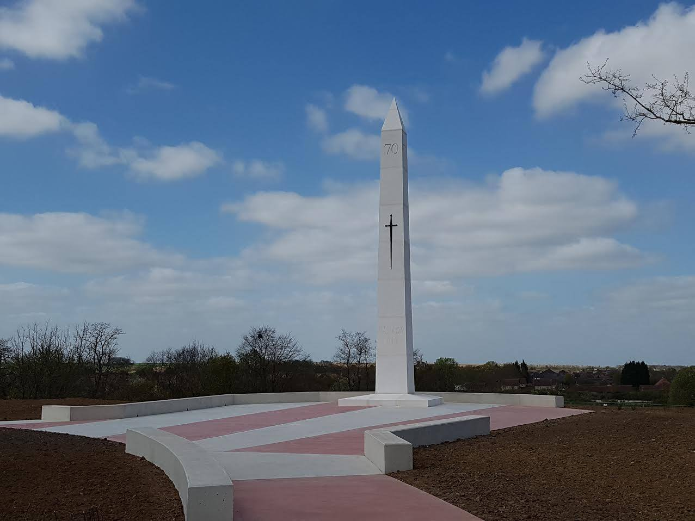

# Hill 70

Arthur Currie became the commander of the Canadian Corps in June 1917, and the operation at Hill 70 was the first action where the Corps was commanded by a Canadian. In Jun 1917 the British Army commenced the 3rd Battle of Ypres or Passchendaele. After initial successes, the attack faltered, so the British command ordered Gen Currie to attack Lens as a diversionary attack to occupy the Germans. Lens was a coal mining town that had been in German hands since 1914. The town itself was in ruins, but the German defences and surrounding high ground would have been a suicide mission. Currie lobbied for, and received approval to attack Hill 70 just outside Lens. He knew the Germans would go all out to retake the critical hill, so he devised a plan to kill as many Germans as possible.

The plan an extension of the assault on Vimy Ridge. The infantry trained extensively to fight in platoon sized groups, the artillery used sound and flash ranging to pinpoint the locations and a creeping barrage to shield the infantry attack, and oil barrels were used to generate smoke screens. The troops were to take the Hill in a lightning attack, then dig in to withstand counter attacks. The artillery had registered all of the counter attack routes so any German assault could be quickly thwarted.

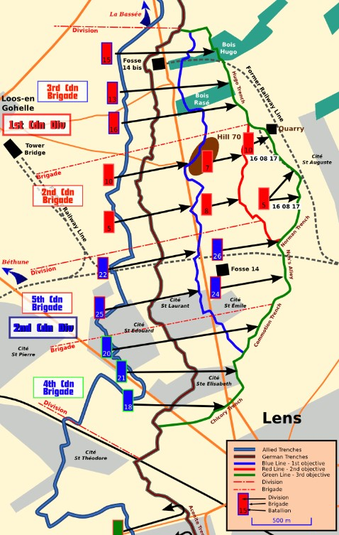

The attack went in at 0425 hours with an initial barrage that targeted the front line trenches and artillery positions, then started a creeping barrage to cover the infantry advance. The creeping barrage was an effective technique to keep the enemy under cover, but required the infantry to press as close as possible to the barrage line, and have faith in the gunners’ accuracy. The barrages were mapped out in timed increments, with the infantry expected to take their ground at specified intervals. The distance covered varied by terrain and expected resistance, making for a very complicated integration of artillery and infantry.

The attack was very effective, and by 0900 the Canadians were dug in and preparing for a counter attack. Observers from the high ground and aircraft saw the Germans massing for a counter attack, and called the artillery to defeat the assault.

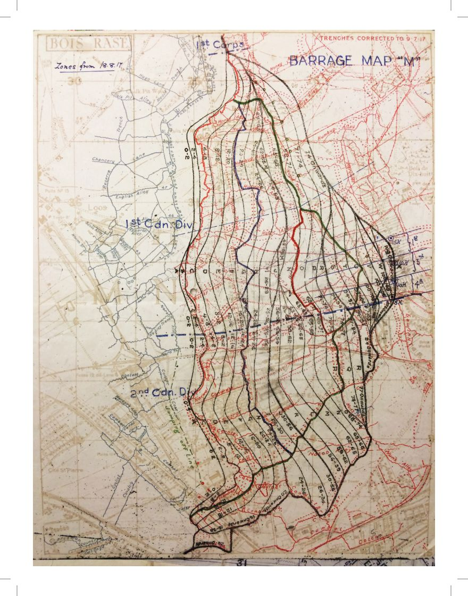

The Germans launched 5 unsuccessful counterattacks on the 15th of August, and a total of 21 over the duration of the battle.

There was a follow-on assault on Lens itself, as Currie believed that the Germans would give up the city. The attacks on Lens and the near by Green Crassier generated initial successes, but strong resistance nullified early gains. Gas was used extensively by both sides during this conflict. The Germans introduced Mustard Gas for the first time and used it against the Canadian Artillery Corps. The Artillery Corps was so dedicated to their task, that many of them removed their gas masks as they were slowing them down, and suffered a large number of casualties due to their heroic efforts.

Despite the setbacks, the battle for Hill 70 was a success. The Canadian Corps suffered 8,677 casualties including over 2,000 killed, but the Germans suffered an estimated 20,000 casualties from 5 divisions. One wounded soldier remarked that Vimy was a cinch compared with the Somme; and the Somme was easy compared to Hill 70. Currie said “It was altogether the hardest battle in which the Corps has participated. It was a great and wonderful victory, General Headquarters regard it as one the finest performances of the war.”

Although Lens remained in German hands, the battle resulted in a German defeat, and achieved its aim of diverting resources from Passchendaele. It also cemented the reputation of the Canadian Corps as an effective assault force, that the Canadians would enhance again through the battles until the end of the war.

Ottawa Historian Norm Christie, a long-time member of the Commonwealth War Graves Commission, produced an excellent series on key Canadian Battles called for King and Empire. The entire series is on You Tube, and well worth watching. Episode 4 covers the “Forgotten Battles” of [Mont Sorrel and Hill 70](https://youtu.be/Gv52wbbhHcY?si=BD1mOV5pYBduFY1N). The coverage of Hill 70 starts at 38.40, but the Battle of Mont Sorrel is also key to the growth of the Canadian Corps, and to us personally as my Grandfather William Johnston, Robert Connelly and Wine Bob’s Great Uncle William Smith all joined their Battalions as replacements for the heavy losses during this battle. This video, as well as several drone videos by Steven Upton covering Hill 70 and other battlefield locations discussed, are listed in the video section of the blog.

Vimy Ridge has taken on iconic significance for Canadians and often touted as the coming of age for Canada. Few Canadians know that of the 170,000 men in the allied attack on Vimy Ridge that day, only about 97,000 were Canadian. In some ways, it was not a Canadian battle, but a British battle with high Canadian content and a Canadian planner.

Several Canadian Historians consider Hill 70 the coming of age for Canada, as opposed to Vimy Ridge as this was the first time the Canadian Corps was an all Canadian entity. Despite the success and importance of this battle, there was no memorial until 100 years after the battle.

# Hill 70 Memorial

Arthur Currie suggested that the present Vimy Memorial be located at Hill 70, but the location at Hill 145 won out. Currie lamented the lack of a memorial until his death, but it was not until 2012 that a group of dedicated volunteers began work to build a private memorial to Hill 70. The citizens of Loos enthusiastically supported the work, and donated land within a municipal park near the Loos Cemetery, within the Canadian Front Lines at the start of the battle, and 1.4 km west of the actual Hill 70. The memorial is indicated by the Red Marker and Hill 70 by the Green Marker.

The park was dedicated in 2017 at the 100th anniversary of the start of the battle and opened to the public in 2019. More than $12 Million was raised to build the monument.

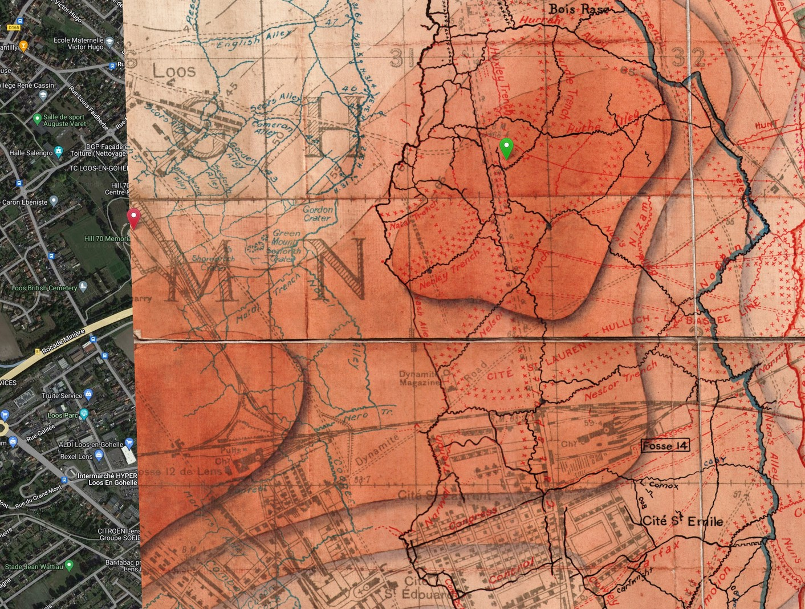

The Hill 70 is a modern monument, with accessibility to all features. There are 6 paths named for the 6 Victoria Cross Winners at Hill 70:

·         Pvt. Michael O’Rourke

·         Pvt. Harry W. Brown

·         Cpl. Filip Konowal

·         Sgt. Frederick Hobson

·         Sgt. Maj. Robert. H. Hanna

·         Maj. Okill M. Learmonth

There are excellent information panels at the visitor’s centre, and information sites throughout the park.

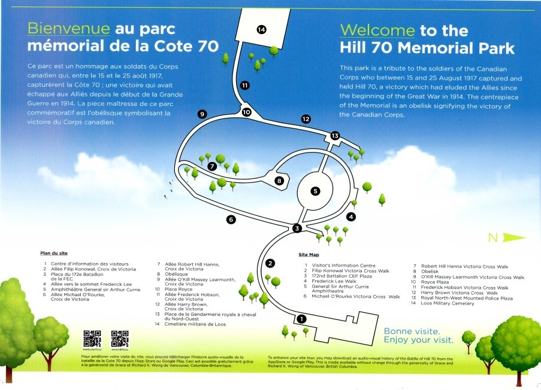

The central focus of the memorial park is the General Sir Arthur Currie Amphitheatre, with a giant maple leaf in the same shape as the soldiers wore on the cap badges, and the Obelisk.

The Obelisk is a traditional symbol of victory; its location is a metaphor for the ultimate objective – the capturing of the high ground of Hill 70. Made of white limestone, it rises to 70 meters above sea level, the elevation of Hill 70 itself. The capstone pyramid of the Obelisk is 5’6”, representing the average height of a Canadian soldier victorious atop Hill 70. Attached to the obelisk are two crosses of sacrifice; these are crusader swords reversed to form the image of a cross, a traditional commemoration for fallen warriors.

The park is planted with two trees that are native to Canada: the Sugar Maple (Maple being our national tree) and the Red Oak (symbolic of the tough stock from which the soldiers were made). • The grassed areas are planted with a mix of wild flowers native to the region of Pas de Calais. Most notable is the Poppy, which was made famous in LCol John McRaes’s poem, “In Flanders Fields”.

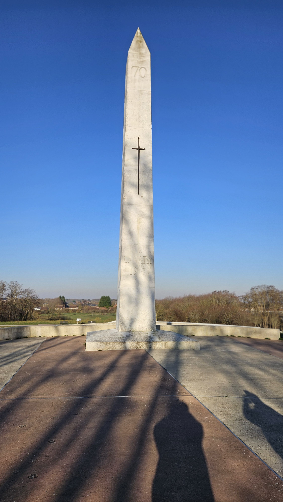

The area around Lens/Loos supported coal mining, so was fiercely contested throughout the war. An alternate view of the Obelisk shows a Slag heap from mining activity, a distinctive feature in flat terrain.

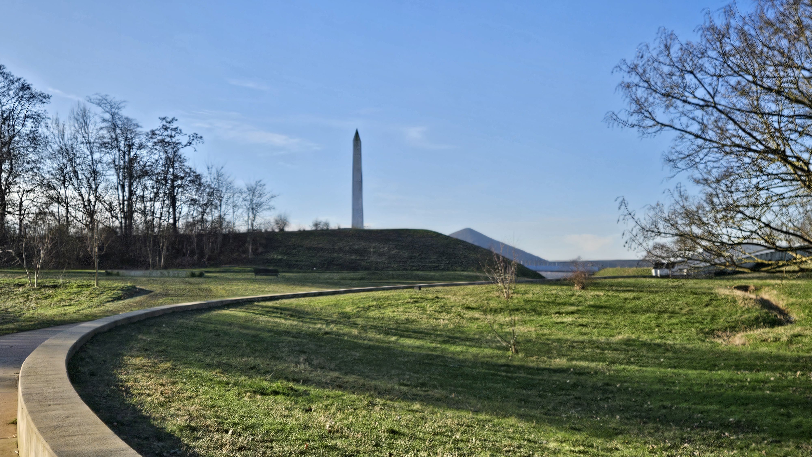

The gradual rising pathway to the summit of the memorial has 1,877 imprinted maple leaves, one for each Canadian killed at Hill 70. We noticed all of the maple leaves on the path but weren’t aware of their significance until some post tour analysis.

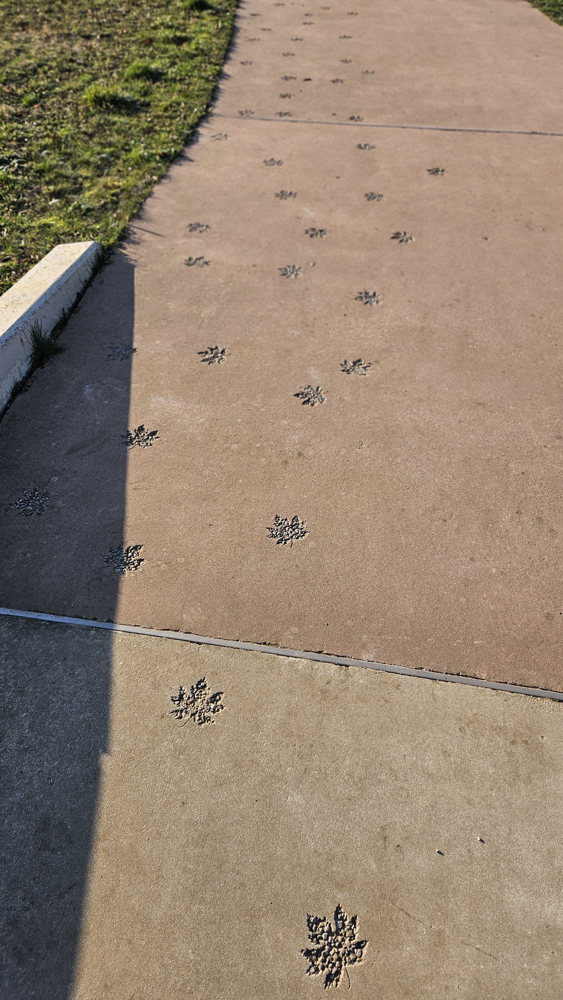

There are a number of unit memorials at the park as well. We happened upon a memorial bench dedicated to the Rocky Mountain Rangers, 172 Battalion CEF. The Rocky Mountain Rangers were the unit that Wine Bob’s Father Stanley initially joined in WW2.

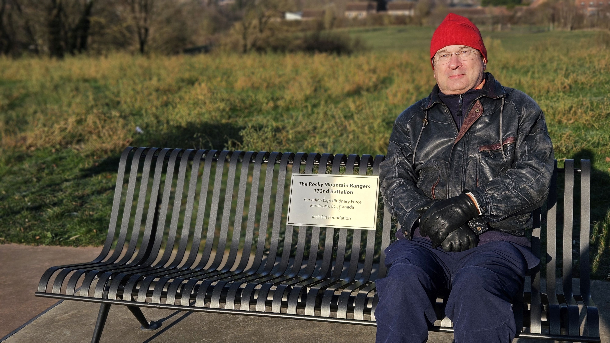

At the rear of the memorial park lies the Loos British Cemetery. The cemetery houses 3000 souls, 902 of whom are known. The cemetery was started in 1917 by the Canadians and was greatly expanded after the war through the amalgamation of several smaller cemeteries. There are 251 named Canadians buried in the cemetery.

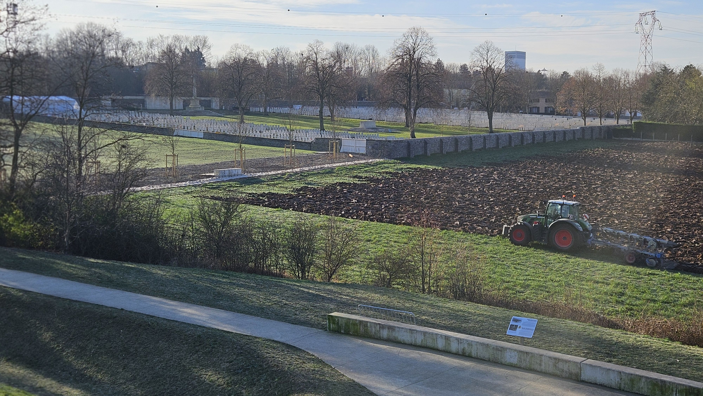

In anticipation of uncovering more missing soldiers due to major canal work, the cemetery is being expanded to have the capacity for an additional 1200 burials. All attempts will be made to identify the individual soldiers. If the soldier’s country can be identified that country is responsible for the identification. The work done by the Canadian Casualty Identification Program is fascinating, a description of the work and the roll of identified personnel is given [here](https://www.canada.ca/en/department-national-defence/services/military-history/history-heritage/casualty-identification-military/casualty-identification-video.html).

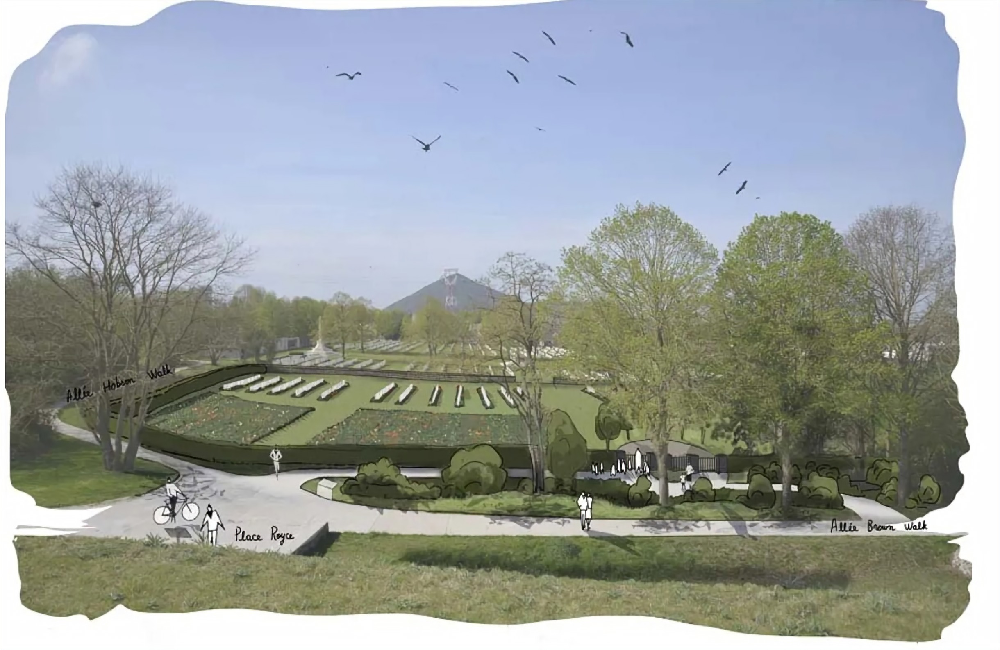

# Lichfield Crater

The Lichfield Crater Cemetery is located a few minutes from the memorial at Vimy Ridge, close to the A26 motorway, but down a surprisingly poorly cared for dirt road. Many memorials and cemeteries are only accessible via dirt roads, but this one was in worse condition than most, and would have made me hesitate if I wasn’t driving a rental car. This is one of the few mass burial sites for Canadian soldiers.

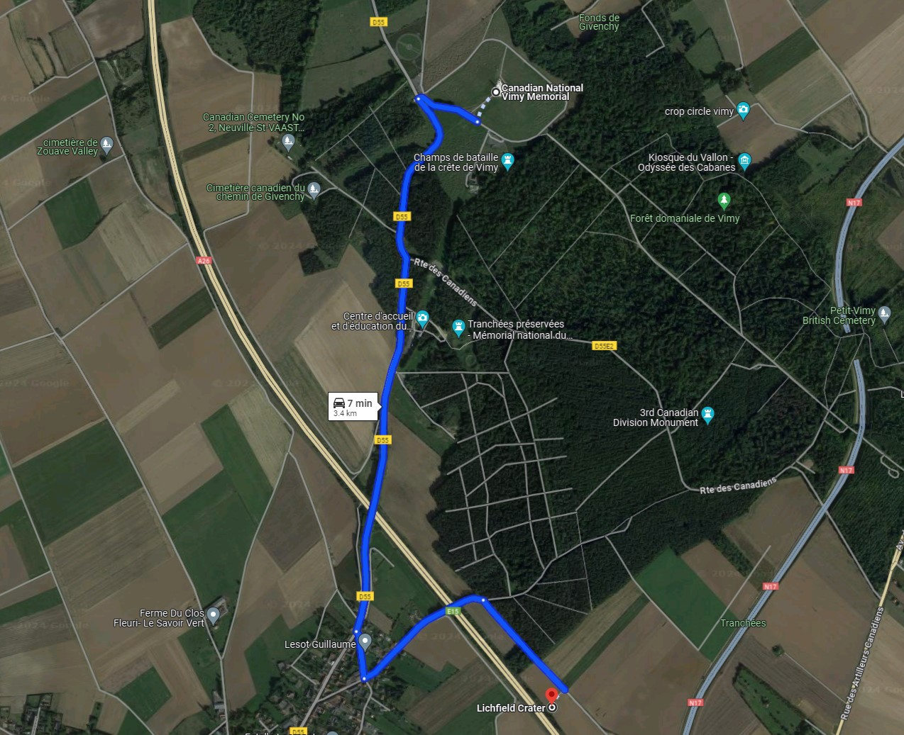

This cemetery contains 57 burials, 42 of them who are known. The identified dead are all Canadian soldiers killed on either the 9th or 10th of April in the Battle of Vimy Ridge, except 1 British Soldier who was killed on 30 Apr 1916, and his grave found on the lip of the crater. His is the only headstone in the cemetery.

There are 11 Canadian Unknown burials, 4 Unidentified soldiers of the Empire, and 1 Unknown Russian. The numbers don’t quite add up, and the presence of the Russian is noted on one of the markers, but I could not find any details as to why he was there.

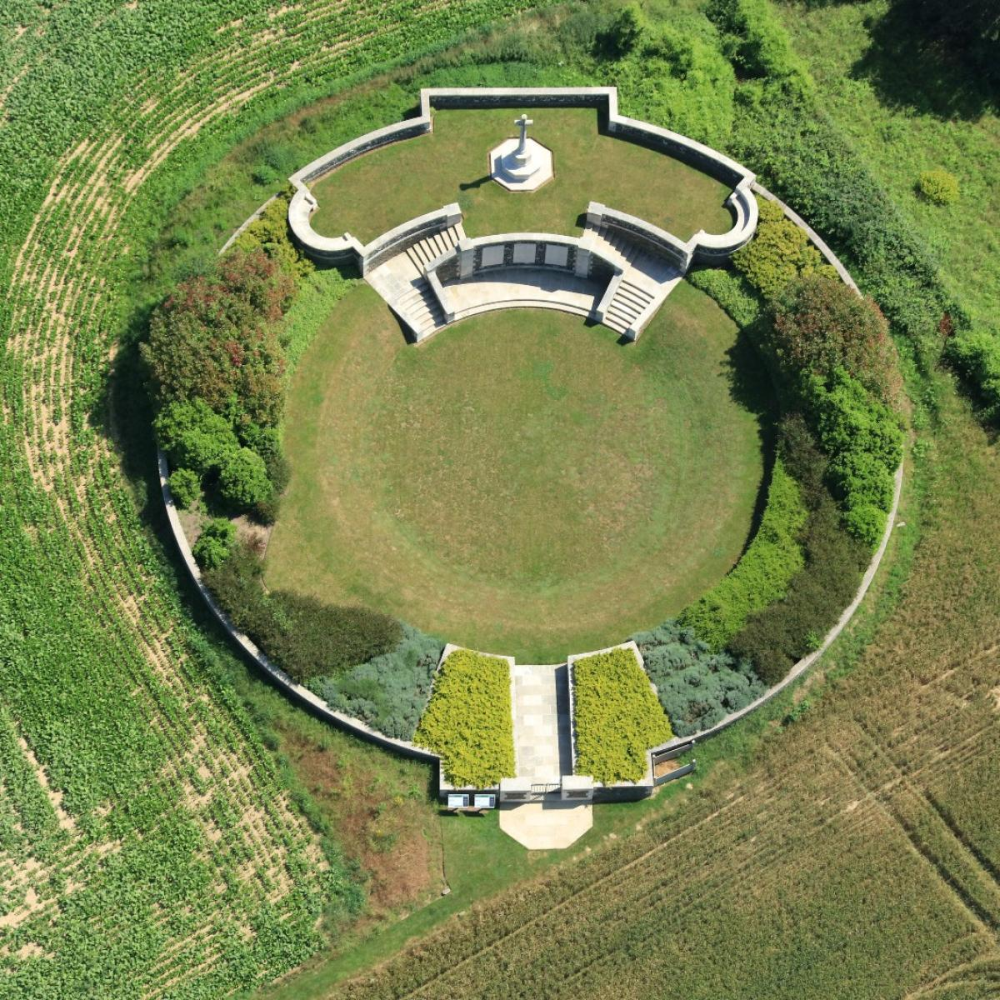

The Lichfield Crater was originally blown as a one of a series of mines blown by the Germans during the Battle of the Somme in 1916. This crater and Zivy Crater about 500 yds south of this location were both used as mass burial sites. The line of craters along the British front line is visible on the map, and the Lichfield and Zivy Craters are marked. The 2nd Division line of advance was between the two markers.

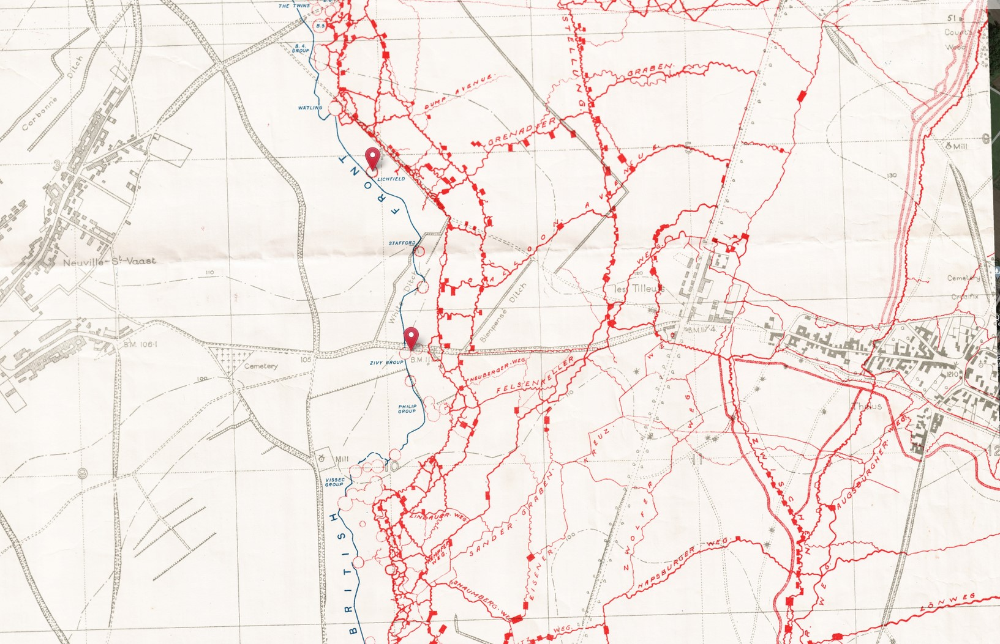

These cemeteries are unique in that there are no gravestones just a list of the fallen on 3 tablets. Almost all of the buried were from the 2nd Division with the exception of the lone Brit and 2 members from the 16th Battalion, 1st Division who were to the immediate right of the Second Division Line.

The members of the 2nd Battalion include Lance Sergeant Ellis Wellwood Sifton, who won the Victoria Cross.  His citation reads:

*For most conspicuous bravery and devotion to duty. During the attack in enemy trenches Sjt. Sifton's company was held up by machine gun fire which inflicted many casualties. Having located the gun he charged it single-handed, killing all the crew. A small enemy party advanced down the trench, but he succeeded keeping these off till our men had gained the position. In carrying out this gallant act he was killed, but his conspicuous valour undoubtedly saved many lives and contributed largely to the success of the operation.*

His name is listed on the right-hand tablet.

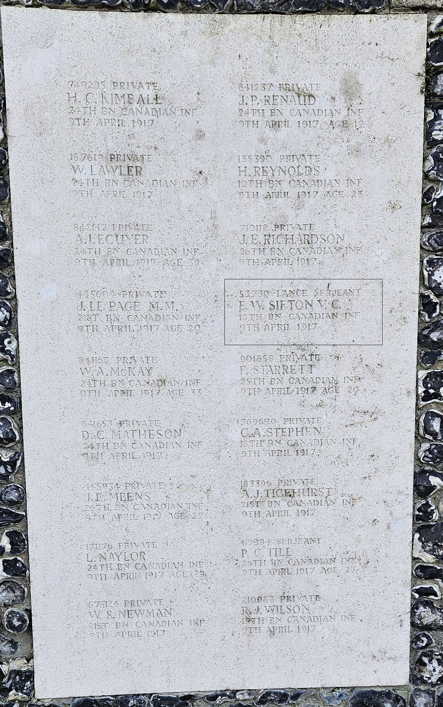

View from the front gate of the cemetery.

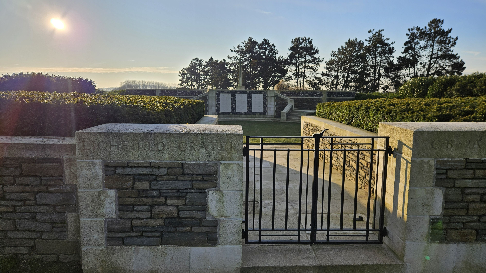

The lone grave marker is tucked on an edge of the cemetery near the entrance.

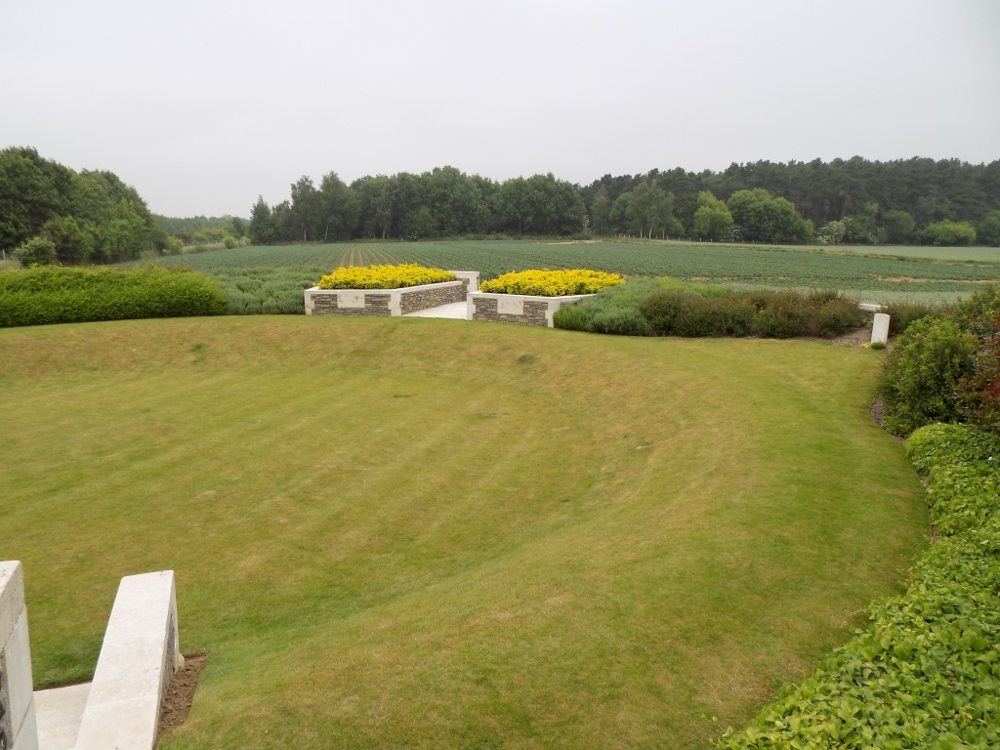

* [First World War](https://www.paulsbattlefieldtours.com/blog/categories/first-world-war)
* [Family](https://www.paulsbattlefieldtours.com/blog/categories/family)