# Following the Caribou

* [pd-allen](https://www.paulsbattlefieldtours.com/profile/pd-allen/profile)
* Oct 8, 2025
* 24 min read

Updated: Oct 16, 2025

Clan Sullivan: Carol, Pat, Terry, Michael and Brian.

# Introduction

We recently conducted a WWI Tour with my good buddy Terry Sullivan and his wife Sandy Cyr. We were joined by four of eight of Terry’s siblings: Michael, Brian, Carol and Pat along with Carol’s Husband Rod. We focused on the Royal Newfoundland Regiment and as part of the Caribou monument visit, we visited the significant locations for the Sullivan grandfather Corporal William Sullivan and Private Wallace Pike, grandfather of Terry’s brother-in-law Rod Pike.

Sites Visited:

·       Beaumont Hamel Caribou - 01 Jul 1916

·       Adanac Cemetery – visited Thomas Platt killed 18 Nov 1916

·       Gueudecourt Caribou - 12 Oct 1916

·       Sailley-Sallisel - William Wounded 03 Mar 1917

·       Monchy Le Preux Caribou -14 Apr 1917

·       Masnieres Caribou - 20 Nov 1917

·       Bailleul - Wallace Wounded 10 Apr 1918

·       Ledeghem - Wallace Severely Wounded 02 Oct 1918

·       Courtrai Caribou -14 Oct 1918

Previous posts on the details of William’s and Wallace’s experiences are detailed here:

<https://www.paulsbattlefieldtours.com/post/corporal-william-sullivan-royal-newfoundland-regiment>

<https://www.paulsbattlefieldtours.com/post/private-wallace-pike-royal-newfoundland-regiment>

A map of the Caribou Locations.

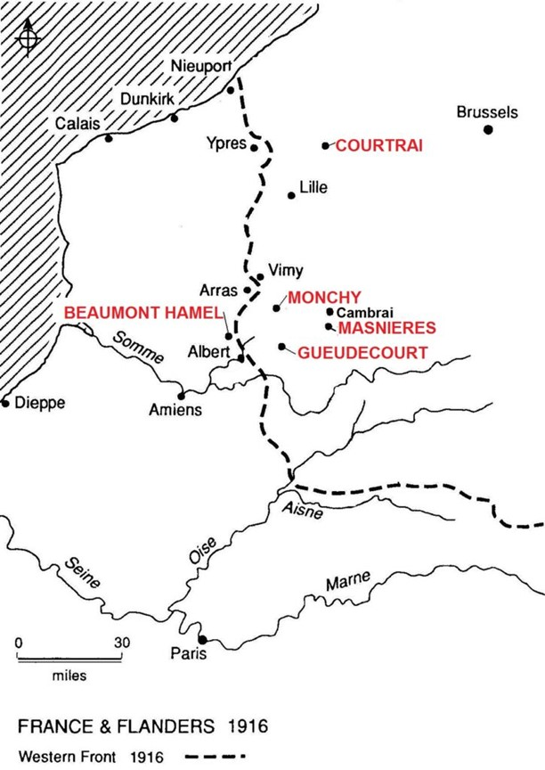

# Beaumont Hamel – 01 Jul 1916

We start at Newfoundland Park at Beaumont Hamel. I always try to visit this site as the description at the Canadian War Museum in Ottawa of the devastation of the Newfoundland Regiment on the First Day of the Battle of the Somme was the catalyst that started my passion for the First World War.

Beaumont Hamel was our first Caribou stop, so we didn’t have our act together to take a group photo at the monument. We got organized at the next stop.

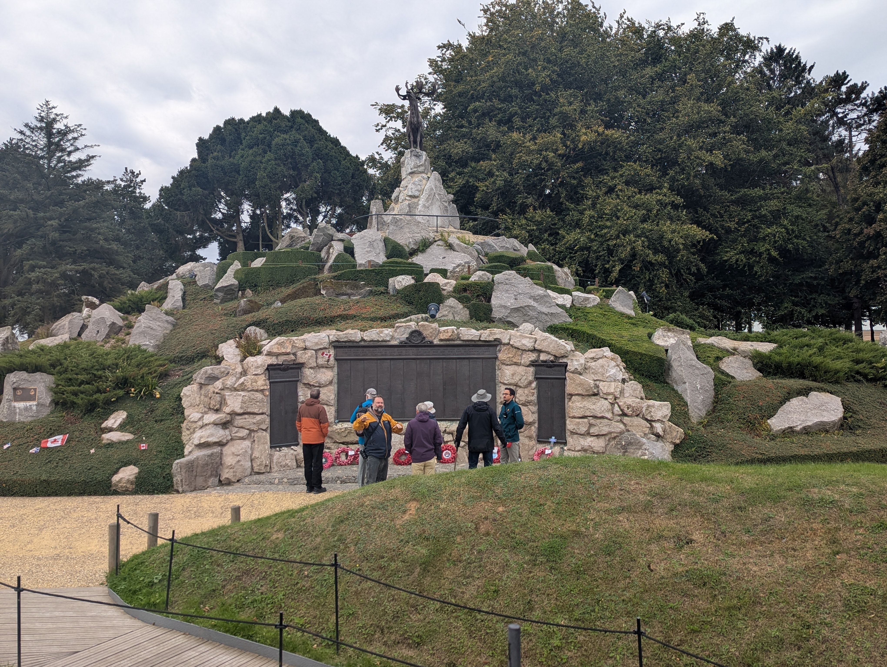

Beaumont Hamel is a great place to visit as you can walk the entire battlefield and see the battle from both perspectives.

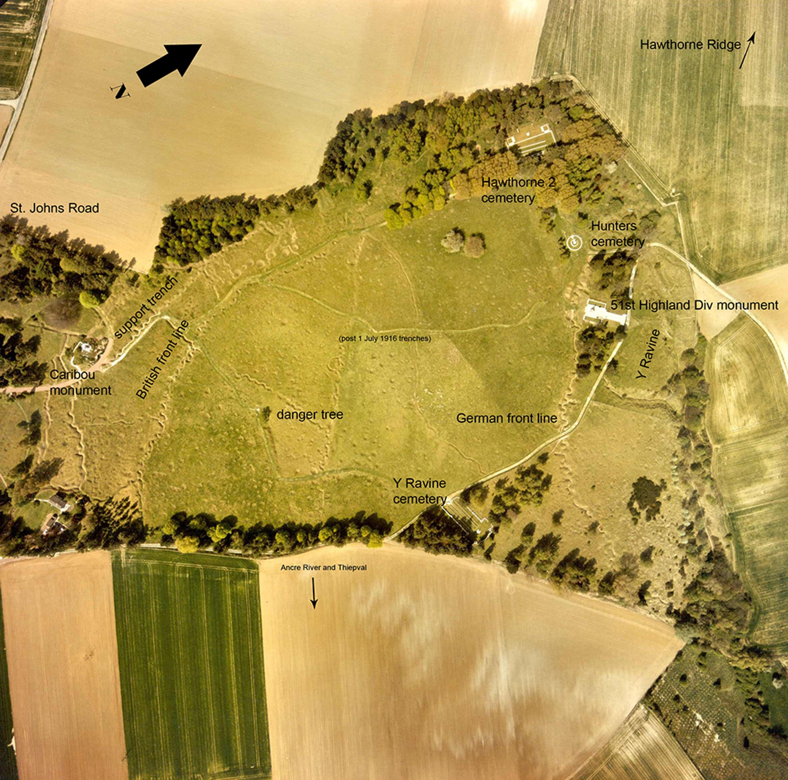

Newfoundland Park is also one of the largest unreclaimed battle sites on the Western Front and the entire battlefield is visible from the viewing area on top of the monument. You can see the British front-line trench near the path, the Danger Tree to the right of the photo in the middle with the Y Ravine cemetery just behind it and the German trenches just in front of the far tree line.

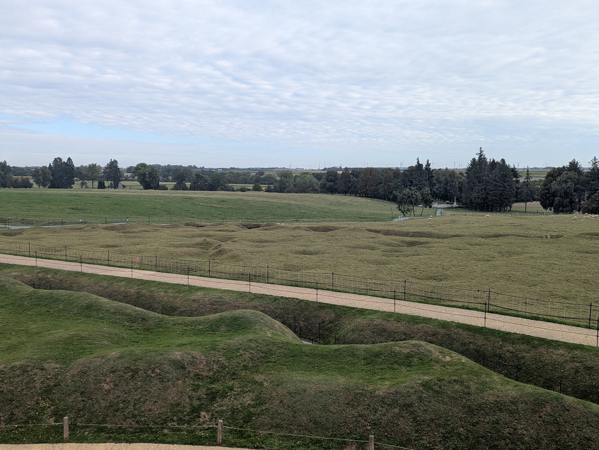

# Battle of Beaumont Hamel

Our tour guide was one of the Canadian student guides who work at Beaumont Hamel and Vimy. He had only been on the ground for 5 weeks, but did a great job presenting the background and story of the Newfoundland Regiment. If you visit Beaumont Hamel or Vimy, I recommend taking the tours.

He took us to St John’s Road, the second line trench where the regiment formed up, named in honour of the Newfoundlanders who dug the trench. We then walked the route the regiment took towards the front-line trench. The Newfoundland Regiment was in the third wave, and their objective was to take the German third line trenches some 3 kilometres behind the front line, but when they attacked no trenches had been taken.

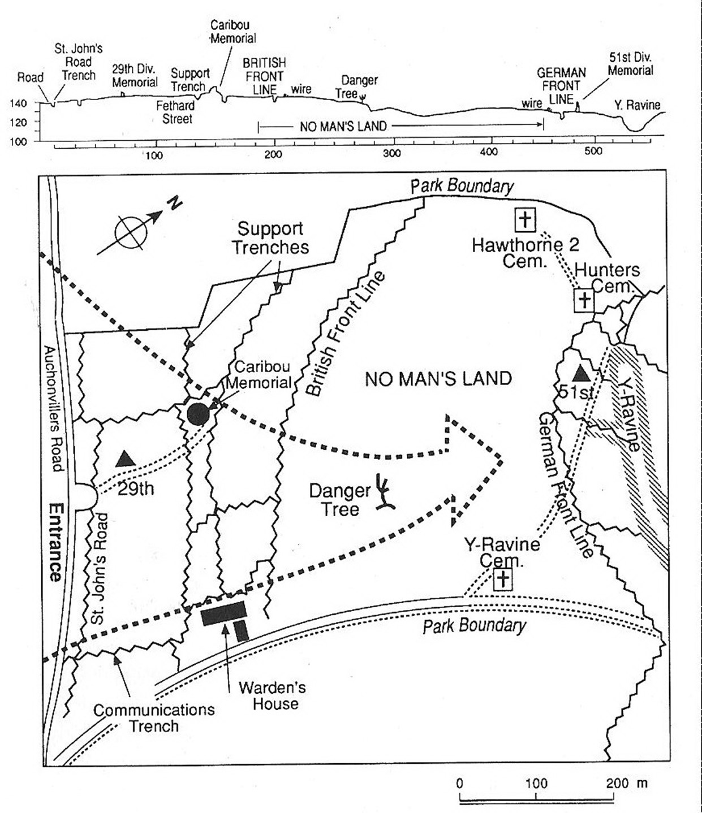

The weeklong barrage before the attack was supposed to kill all the Germans and destroy their barbed wire, but the Germans were sheltered in deep bunkers and the wire uncut. At 0720 the Hawthorn Ridge Mine was blown under the German lines and at 0730 the first wave went in. The first two attacks were spectacularly unsuccessful but confusing reports indicated the British had taken the German front line, so the Newfoundland Regiment was ordered forward. At 0915 they advanced, but the communication trenches were jammed with the dead and wounded from the initial attacks, so the Regiment was ordered to advance over land. They were the only unit advancing at the time so the might of the German Artillery and machine guns were concentrated on them and most of the troops didn’t make it to the British Front line. Gaps had been cut in the British wire, but the Germans had zeroed in on the openings. The Danger tree was as far as most Newfoundlanders advanced with bodies stacked up near the gaps.

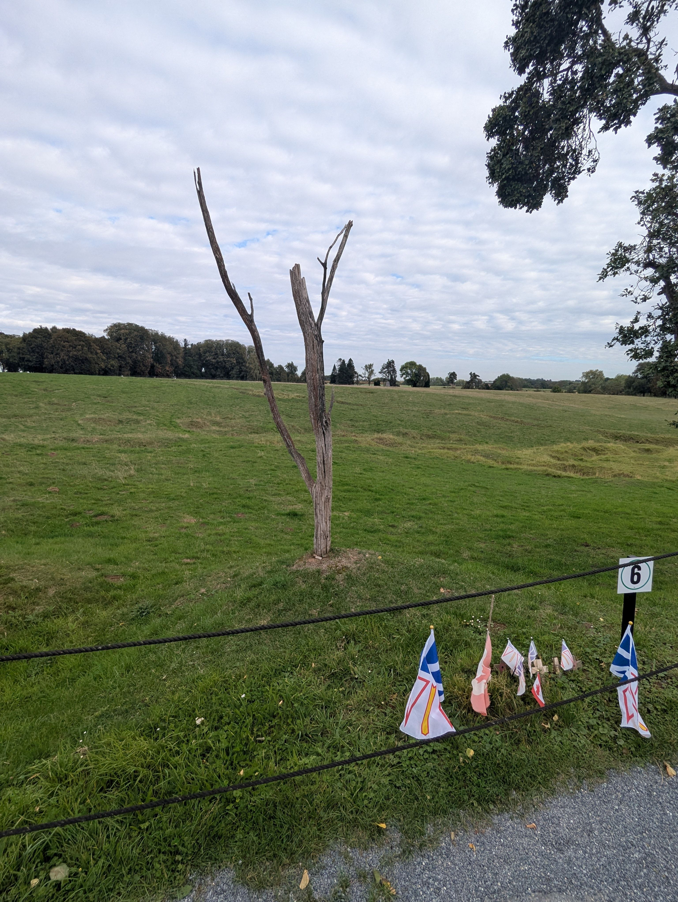

By 0945 the advance was over. While the casualty list varies, the best statistics available indicate that 721 men went over the top and of those 619 became casualties, 234 killed and 385 wounded.  The Battalion’s War Diary  states that only 68 men were available for roll call the next day, (July 2nd).

## Memorial to the Missing

At the base of the Caribou is the plaque listing the 820 Newfoundlanders with no known grave.

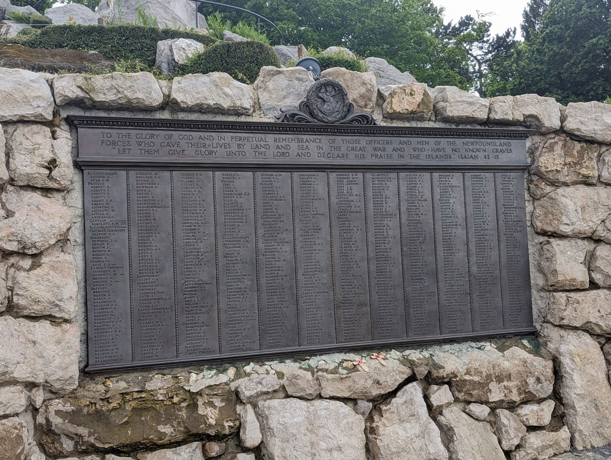

The trench systems are in the actual locations of the original trenches and have been slightly modified to accommodate foot traffic.

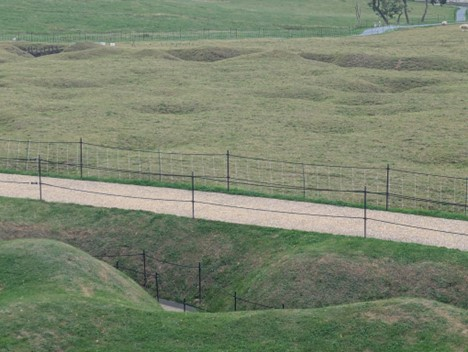

The German front line trenches near the 51st Division memorial commemorating the capture of Beaumont Hamel, the original first day objective, in November 1916 after 5 months of desperate fighting.

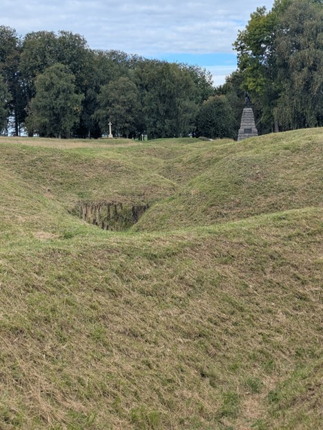

View from the German trenches, the attacking force would have been clearly visible as they advanced from the second line trenches.

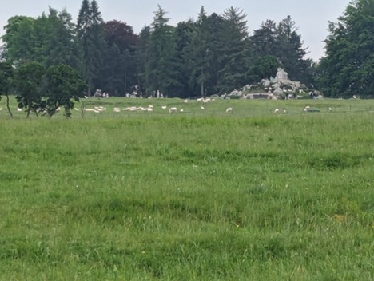

The first time I visited Beaumont Hamel was on the Canadian Liberation Tour with 25 folks including a retired teacher from Newfoundland. She read a letter from a soldier written the night before that battle which was very emotional.

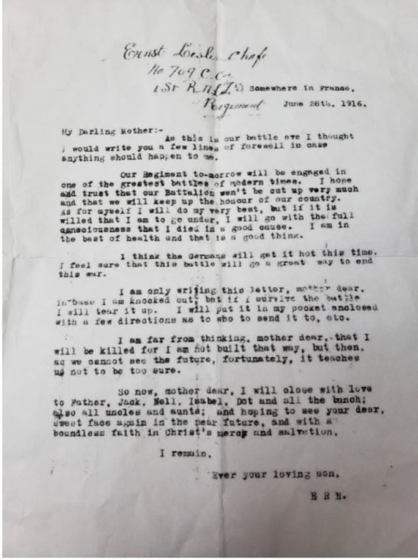

Private Ernest Leslie Chafe, age 25, was killed on 01 July, and is buried in Y Ravine Cemetery on the Newfoundland Park Grounds. I always visit his grave to pay my respect. There are 2 names on several headstones in the cemetery as the bodies were buried close together.

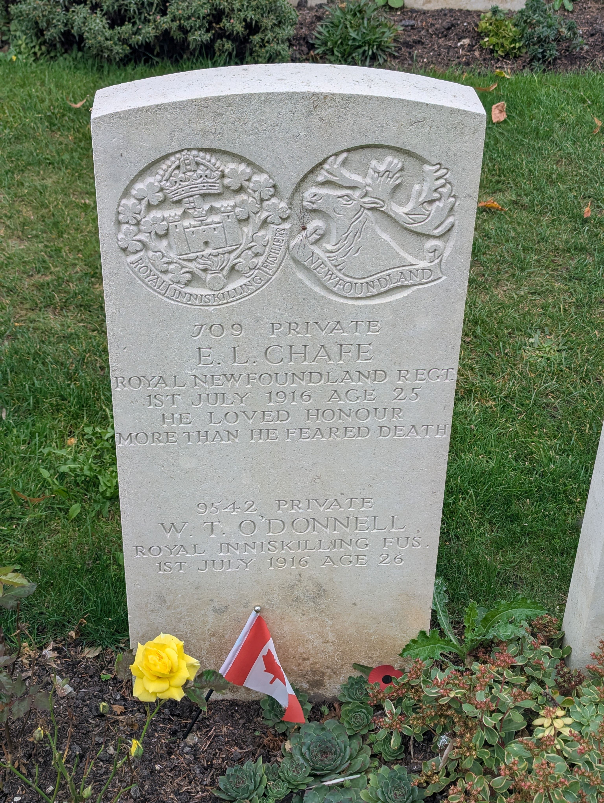

Another grave I always visit is Pvt Harry Butler, age 20. Harry joined on 13 October 1915 and immediately was shipped to the Newfoundland training facility in Ayr, Scotland. He arrived in France on 15 June. Harry was part of a 68-man draft who arrived at the unit on 30 June, one day before the assault, and was killed the next day. He was reported missing for some time, then buried in Y Ravine Cemetery.  He is reported as “Believed to be Buried in this Cemetery” as there was a burial record, but his burial location could not be positively identified.

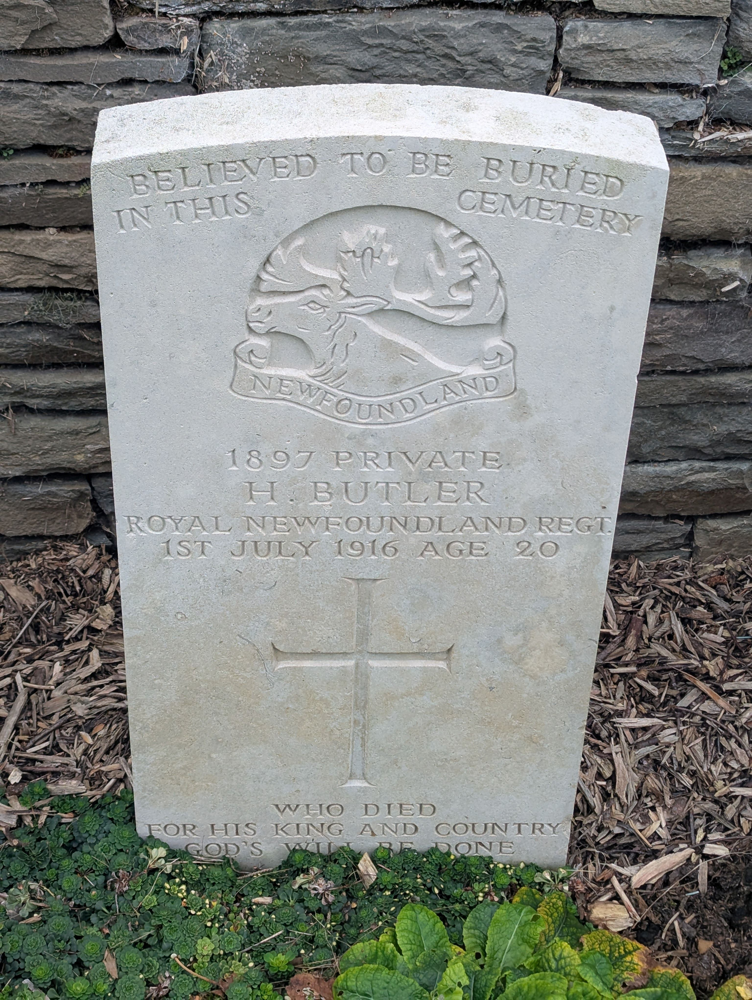

# Adanac Cemetery 18 Nov 1916

## Thomas Platt

During the tour, Michael mentioned that his wife Judi had a great uncle Thomas Platt buried in Adanac Cemetery and wondered if we would pass near by. Everything on the Somme is close together so we stopped in to pay our respects.  Photos of Thomas in his Royal Scot and Canadian Uniforms.

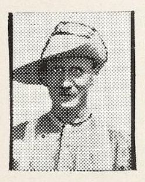

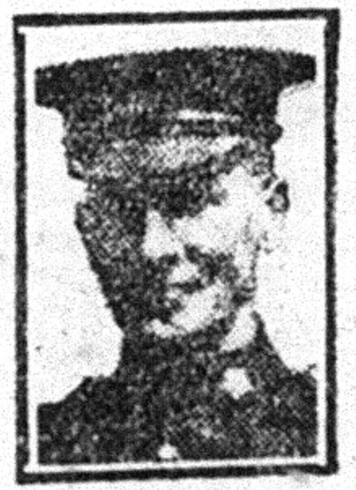

Thomas Platt was born in 09 May1867 in Hayfield, Derbyshire, England. His parents were John Platt and Elizabeth Marsland. Thomas served in the Royal Scots (Lothian) Regiment from 1888 for 14 years. He served in Egypt, India, Malta and South Africa where he fought for three years in the second Boer War. The Regiment returned to England in 1902.

He married Annie E Surridge in Lancaster, England, on Oct 25, 1902. His age is listed as 35.

From England census 1911 Thomas was living in Cheshire, England, with wife Annie and daughter, Harriet E and working as a Railway Porter. Thomas immigrated to Canada, arriving in September 1911. In April 1912 Annie and Harriet joined Thomas in Toronto, where he worked on the Grand Trunk Railway.

On 09 Aug 1915 Thomas enlisted in the 84th Battalion which had been established on 10 Jul 1915. Thomas reported his birth date as 09 May 1872, five years later than his actual birth date, so his reported age was 43. This was done because early in the War the maximum age cut off was 45. There were exceptions for people with former service, but these soldiers would be employed in training or non-combat roles, and I presume Thomas wanted to make sure he was in a front-line battalion. Thomas sailed to England with the battalion on the Empress of Ireland, arriving on 28 Jun 1916. The 84th Battalion was immediately broken up to provide reinforcements for the Battalions in the field and Thomas was reassigned to the 75th Battalion, 11th Brigade, 4th Division Canadian Expeditionary Force (CEF).

## 75th Battalion

On 12 Aug, the 75th Battalion landed in Le Havre, France and moved up to St Eloi, just south of Ypres for training and later front-line duty.

The 4th Canadian Division arrived on the Somme in mid-October to take over from their exhausted fellow Canadians who had been fighting there. They faced a battlefield that had turned to mud and a determined German defence that continued to take a murderous toll on Allied attacks. Despite these great challenges, the Canadians finally captured the shattered remains of Regina Trench on November 11. A week later, in the final attack of the Battle of the Somme, the Canadians took Desire Trench. There were no further advances as the winter weather came, and the offensive staggered to a halt.

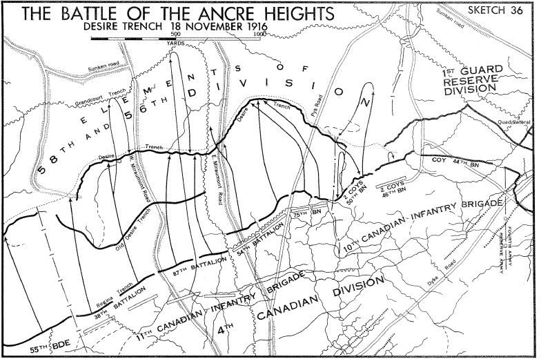

On the morning of 18Nov at 0610, a successful attack was made on Desire Trench by the 75th Battalion, with the 54th on the left and the 50th on the right. The 50th Battalion on the right failed to capture their objective and consequently the 75th was exposed to heavy enfilade fire and continuous sniping from the enemy trench on their right. A block was established a block in the Desire Trench a few yards west of Pys Road and a new trench dug parallel to and about 100 yards north of Desire trench. This position was held by the 75th until relieved at 0500 on 20 Nov by the 102nd Battalion.

The 75th Battalion suffer 248 casualties in the attack with 104 killed (71 with no known grave) and 41 were initially reported missing, including Thomas Platt. He was only declared killed on 23 Apr 1917.

This was the final engagement in the Battle of the Somme. Both sides dug in for the winter and had no further major attacks. The 75th Battalion then moved up to the Vimy area to prepare for the assault on Vimy Ridge in April 1917.

## Adanac Cemetery

Adanac Military Cemetery (the name was formed by reversing the name "Canada") was made after the Armistice when graves were brought in from the Canadian battlefields around Courcelette and small cemeteries in the surrounding area. Adanac has 3187 burials,1483 of whom are identified. There are 562 Canadians Identified in this cemetery.

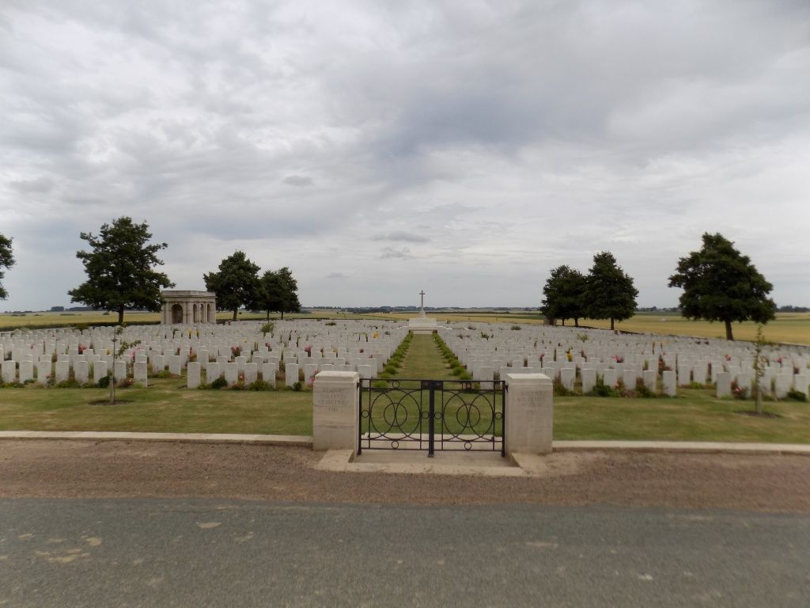

There are 28 75th Battalion members buried here, all but 3 killed on 18 November. Thomas was buried in Plot 2, Row E, grave 31. A photo of Michael at Thomas’ grave.

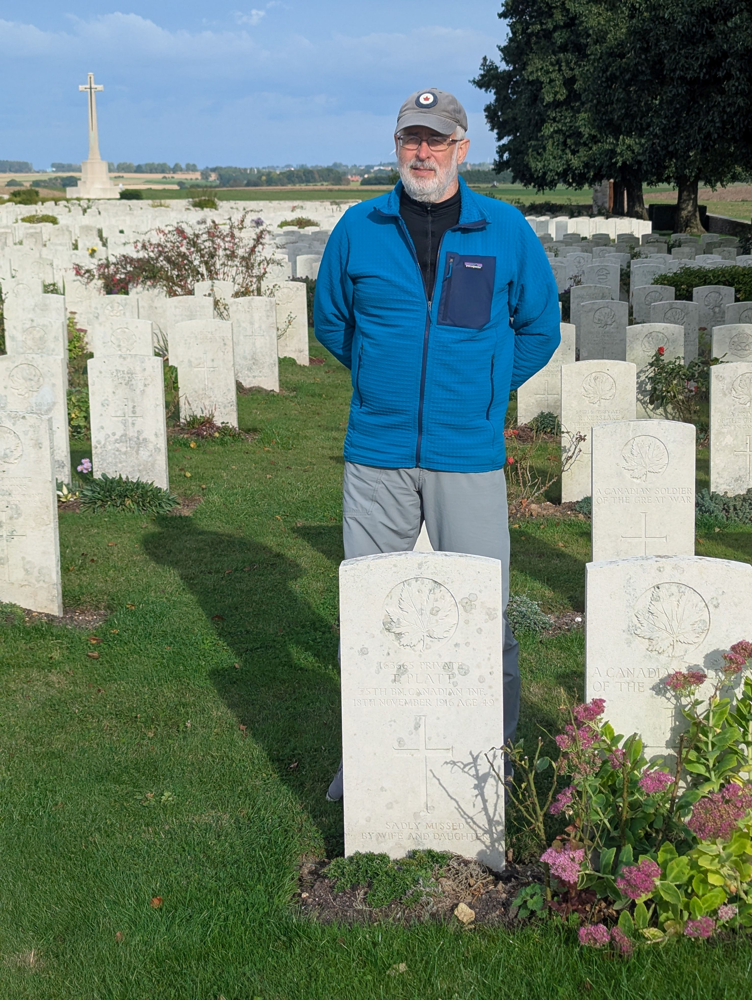

A few unusual stories about Thomas. After Thomas was declared dead, there was an article in the Toronto Star stating that Private Buchanan saw Thomas in a German Trench 3 days after the battle, and when the Germans departed no sign of Thomas and other Canadians was seen so it was suspected that they were all taken Prisoners of War.

On the back of his Casualty Record, it is reported that his body was exhumed from map reference 57d.M.8.c (50.072022, 2.310930), 40 km west of the battle site. This site was near the 47th Casualty Clearing Station that was located near Beauval, so it is possible Thomas was wounded, sent back to the Casualty Clearing Station, died and was buried near by. There were more than 1000 Canadian casualties on 18 November so that may be why there is nothing in his service record.

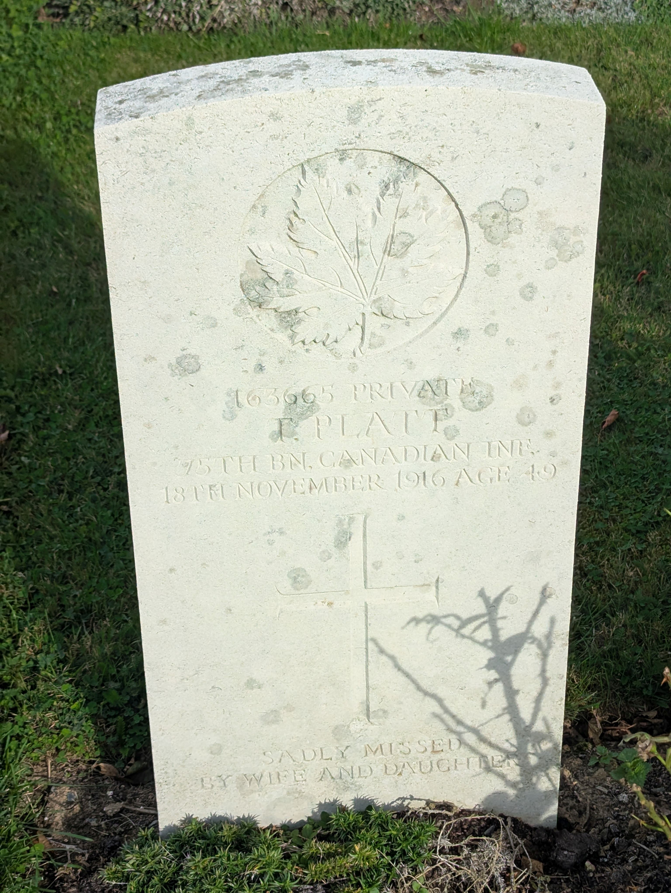

# Gueudecourt 12 Oct 1916

Four months after the devastation at Beaumont Hamel, the Newfoundland Regiment had been reconstituted and sent back into the line.

The village of Gueudecourt lies five kilometres directly south of Bapaume. Here, on October 12, 1916, the Newfoundland Regiment made its heroic assault during the Battle of Le Transloy, one of the major battles of the Somme. Arriving from the north where it had spent 10 weeks in the Ypres Salient, the 88th Brigade, in which the Newfoundland Regiment was serving, was temporarily attached to the British 12th Division, which was holding Gueudecourt.

By nightfall on October 10, the Newfoundlanders were manning a 450-metre section of the firing line on the northern outskirts of the village. The attack went in at 2:05 in the afternoon of the 12th, all four Newfoundland companies advancing in line with the 1st Essex Battalion on their left. So closely did the men keep up to the curtain of their artillery barrage that several became casualties from the shrapnel of their own supporting guns. In the front German trenches the defenders, compelled by the shelling to remain under cover, were quickly engaged in hand-to-hand fighting. By 2:30 p.m. both assaulting battalions of the 88th Brigade had secured their initial objective—Hilt Trench in the German front line.

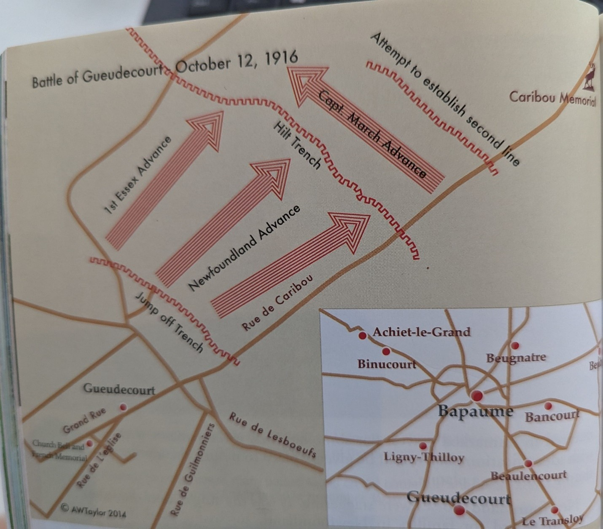

As the Newfoundlanders advanced to their final objective, some 750 metres from their starting line, heavy machine-gun fire coming from the front and the right flank forced them back to Hilt Trench. On their left, a sharp German counterattack drove the Essex Battalion back to the outskirts of Gueudecourt, leaving the Newfoundlanders with an open flank. Newfoundland bombing parties cleared and secured the vacated portion of Hilt Trench and with the Battalion's line suddenly doubled in length, all ranks began digging in the hard chalk to construct a new firing step and parapet and generally reverse the former German position.

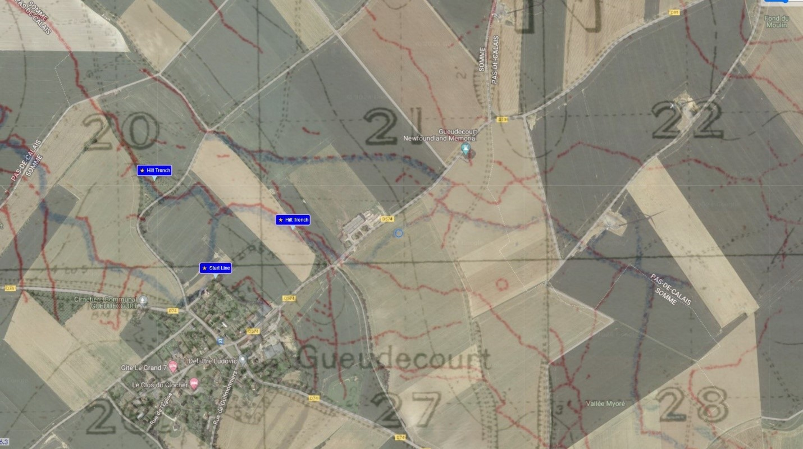

In the late afternoon the expected counterattack developed, but determined fire from the Newfoundlanders' rifles and Lewis guns drove off the enemy with costly losses. The position was held against further assaults and during the night, the arrival of a relieving battalion of the 8th Brigade enabled the weary defenders to hand over their responsibilities and go into reserve.

During the 55 hours that had elapsed since they had entered the trenches on October 10, the Newfoundland Regiment had suffered 239 casualties—of whom 120 had been killed or would die of wounds. But the Regiment had been one of the few units on the whole of the Fourth Army's front to capture and retain an objective. "The success," wrote the Brigade Commander later, "was all the more gratifying as it was the only real success recorded on that day."

The family at the Gueudecourt Memorial.

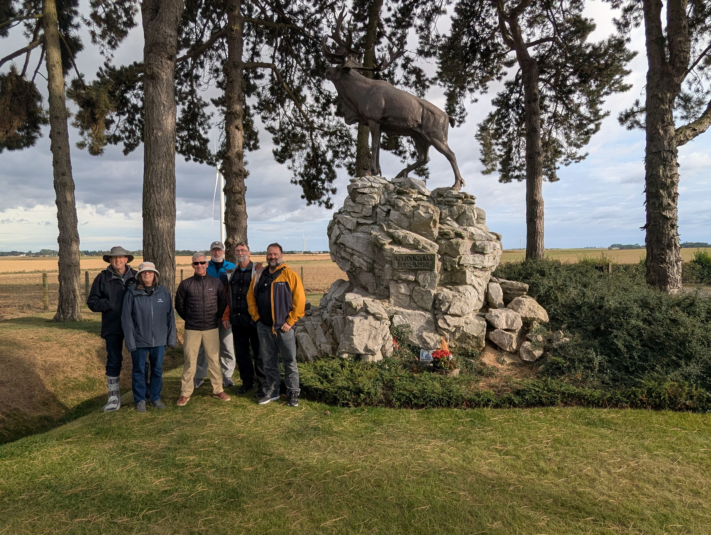

The Newfoundland Regiment had suffered 858 casualties in a four-month period, basically the entire regiment.

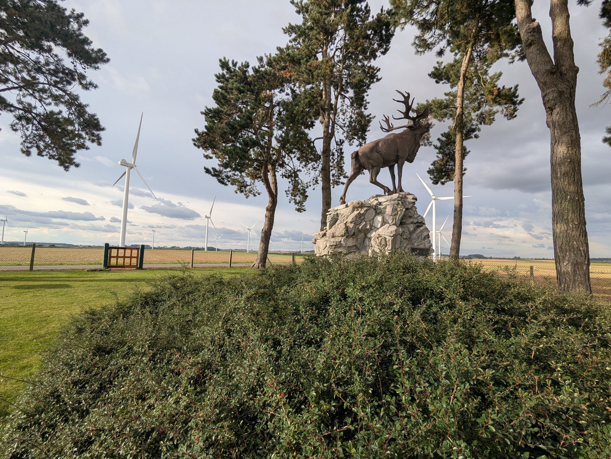

This Caribou is in the middle of large fields, normally with only wind turbines for company. The road from the village to the monument follows the advance of the Regiment. It seems like a gentle rise in the car, but an elevation map shows a 15m rise to the Caribou, showing once again the Germans held the high ground and the British were always attacking uphill. The blue line shows the direction of advance.

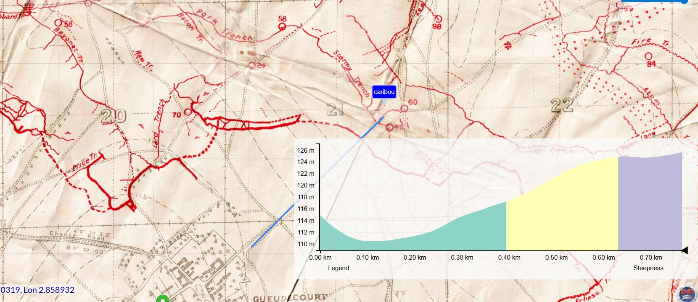

By the end of the war, more than 6,200 Newfoundlanders had served in the Ranks of the Royal Newfoundland Regiment, with more than1,300 of them losing their lives, and a further 2,500 being wounded or taken captive.

# Sailly-Saillisel 3 Mar 1917 (Grandpa Sullivan Wounded)

After midnight, March 1, the Newfoundlanders entered Cane Alley to Cheese Trench relieving the Lancaster Fusiliers. B Company went to a blocked off section of Palz Trench, with A and D Companies in Potsdam Trench. A Company took over the old firing line. March 2 was relatively quiet, and the troops were able to improve the defences of the trench. At daybreak, March 3, the Germans began shelling the trenches. Then came a determined effort to break through the blocks at either end of the section of Palz Trench held by the Newfoundlanders. This was held off by bombing and machine gun fire. Shortly afterwards, on the right flank, the Germans advanced across No Mans Land in large numbers.

Skirmishers came towards the communication trench between Potsdam and Palz trenches. A steady stream of bombs and machine gun fire held them at bay until an artillery barrage was called down on the attackers, isolating them and preventing reinforcements from coming up to join them.

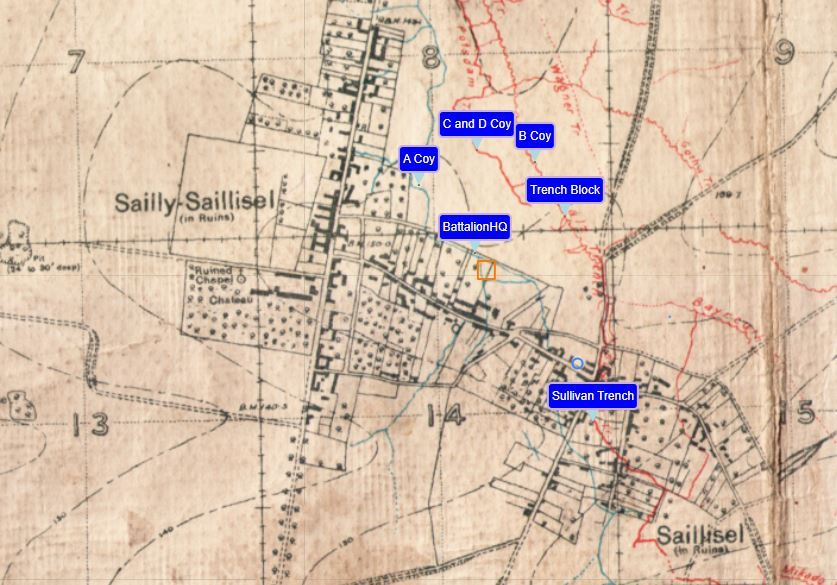

The troops began to consolidate the trenches and pushed the Germans back establishing a block forty yards further down the trench. All the enemy were driven out of the trenches they had occupied during the attack.

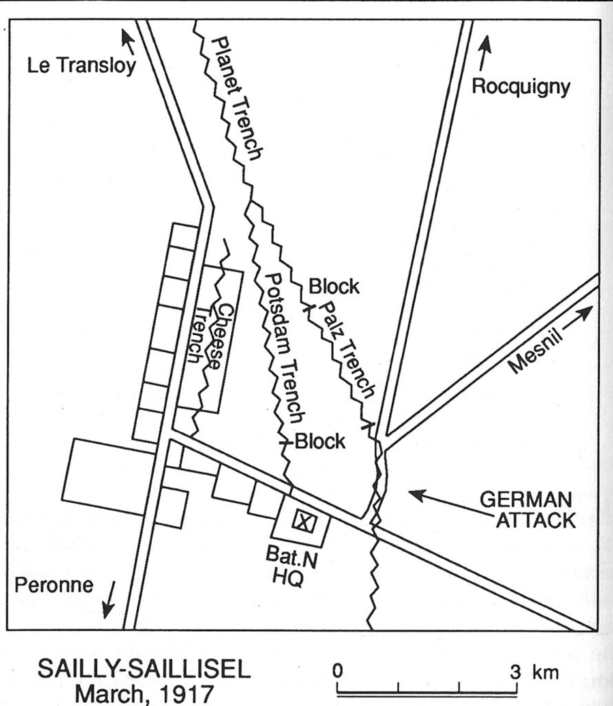

Late on March 3 the Regiment was relieved by the Lancaster Fusiliers. This had been two days of bitter fighting, but the Newfoundlanders had more than held their own against heavy and sustained enemy attacks. On March 5, they withdrew to Divisional Reserve at Meaulte for a two-week period of rest, recuperation, and training. At this time, the Regimental Band came from the Ayr Depot to entertain the 1st Battalion. The presence of the band enlivened the concert on St. Patrick’s Day. On March 19, the Regiment returned to their old billets at Camps-en-Amienois for training for the next offensive.

The losses to the Regiment from Feb. 26 to March 3 were heavy; forty-four wounded, including William Sullivan, and twenty-seven fatal casualties, including three officers.

## William is Wounded

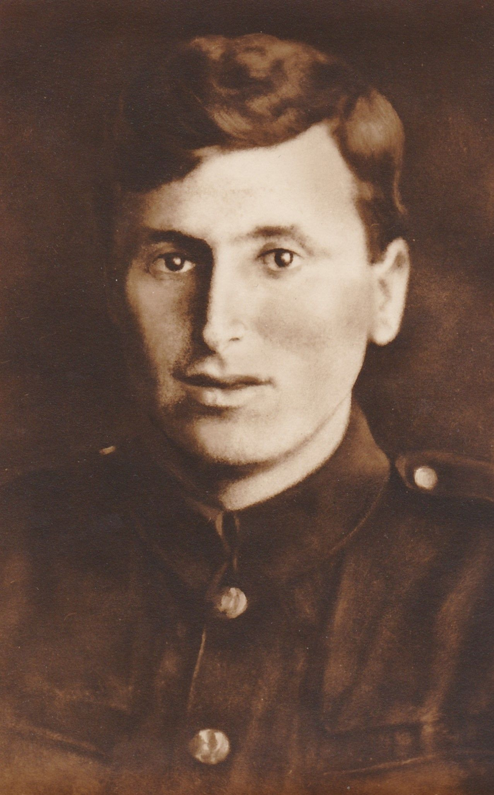

William was wounded in France on 03 Mar 1917 at the Battle of Sailly-Saillisel. He was sent originally to the 60 Field Ambulance, a mobile medical facility then the 2/2nd London Casualty Clearing Station at Meaulte, about 20 km from the battle. On 05 Mar he was sent to the 11th Stationary Hospital in Rouen and was sent to Wandsworth London General Hospital in England the next day.  William suffered severe gunshot wounds in the left thigh (two large wounds in the left thigh and two smaller wounds on the left leg) and slight wounds on the left arm and forehead. By the time he got to the hospital his wounds were septic and was diagnosed with Typhoid Fever. Also had a Buttocks boil lanced.

At the hospital in London, an X-Ray determined he had metal fragments in the left upper arm and forearm, left thigh and outside of the left leg and went through an operation to have them removed. William spent four months in the Wandsworth Hospital, another four months in the Enteric Depot Convalescent Hospital, London before being returned to the Newfoundland Regiment Depot in Ayr, Scotland. He remained in Scotland until rejoining the unit on 20 Feb in Poperinghe, Belgium.

Clan Sullivan standing in the field where the Palz and Potsdam trenches were the scene of heavy hand to hand combat where Grandpa Sullivan was wounded.

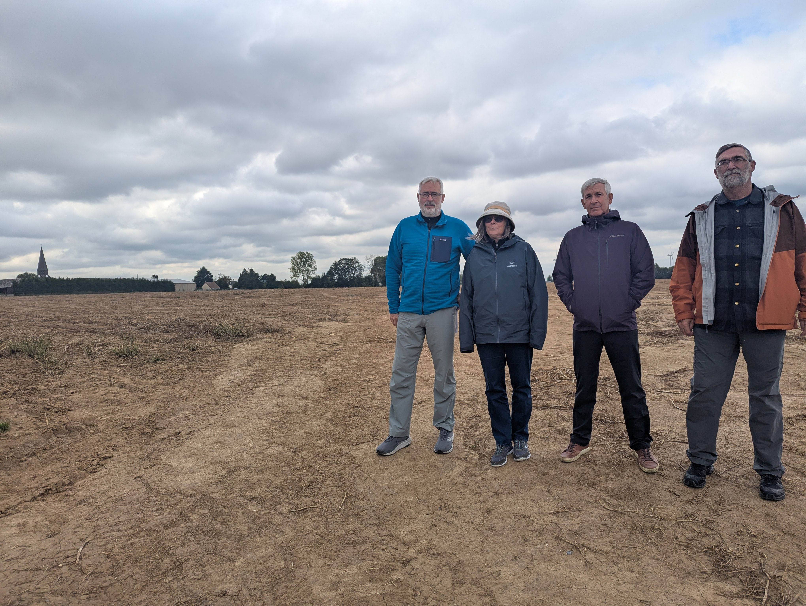

# Monchy- Le Preux 14 April 1917

Our next stop was at the Newfoundland Memorial at Monchy-le-Preux. The Newfoundland Regiment was part of the British 88th Brigade, 29th Division. At the start of the war, the Newfoundlanders made it clear they did not want their battalion to be assigned to the Canadian Corps, so they were part of the 29th Division until 1918.

Most of the Caribou memorials are located in Park settings, but the memorial at Monchy-le-Preux is located on top of a bunker in the front yard of a private house, next door to St Martin Church.

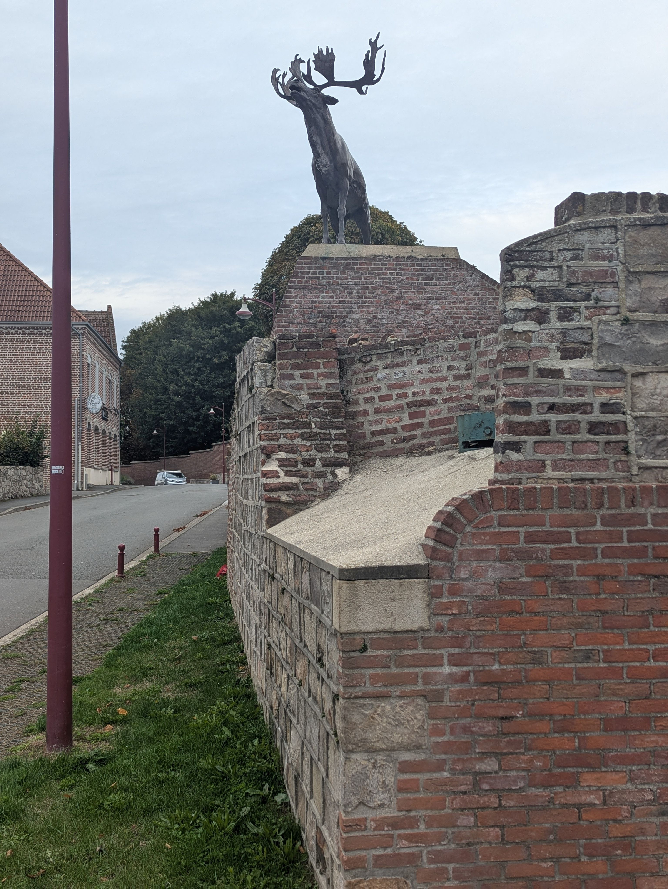

## Battle 14 April 1917

The Battle of Arras started on 09 April 1917, with the British Forces attacking from the quarries under Arras. The British made great gains on the first day of the battle (from the solid blue line to the dashed blue line. On 11 April, Monchy-le-Preux was taken by the 37th Division. However, the Germans controlled the High Ground at Infantry Hill and continually shelled Monchy-le-Preux.

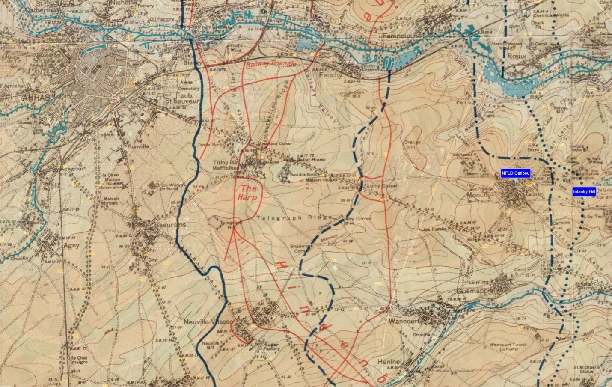

Monchy-le-Preux was being destroyed, so the 88th Brigade of the 29th Division (Newfoundland Regiment and 1st Essex) were called on to take Infantry Hill. Unfortunately, the hurried planning neglected to have replacement battalions in place to hold Monchy.

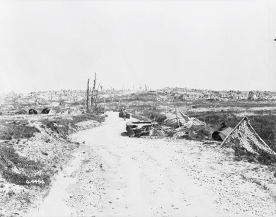

The two battalions moved into position in the early hours of 14 April, and at 0530 launched their attack. Unbeknownst to the attackers, the Germans were also planning an attack to retake Monchy so had troops massed for the assault.

The Germans were employing a new tactic called the Elastic Defence where they would let the attackers through the front lines with little resistance then surround and destroy the attackers as they advanced.

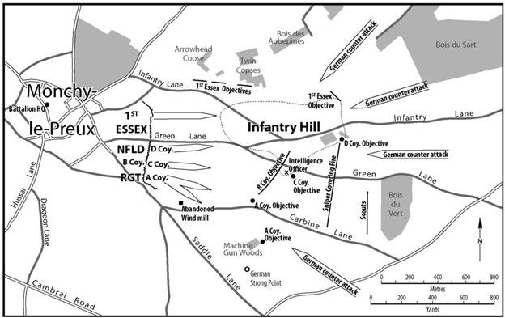

Both Battalions met very limited resistance in the front-line trenches, but as they progressed, they bypassed several German strongpoints that began attacking them from the rear. By 0900, almost half of the Essex force had been captured so the survivors withdrew leaving the Newfoundlanders exposed on their left flank. By 1000 both battalions had been decimated and a wounded Essex soldier reported at their entire unit had been captured or killed. The communication lines back to Brigade had been cut by the shelling and 300 Germans were advancing on the town. LCol Forbes-Robertson of the Newfoundland Regiment mustered his HQ staff of 20 personnel and prepared to make a stand. They made a run across open ground to take up positions in a trench. Nine men made it to the trench which had a commanding view of the approach, and they started rapid fire concentrating on the runners and scouts. A tenth man eventually joined the troops, and they held off the German assault until replacements finally showed up in 2000.

One General commented that if those 10 men had failed, it would have cost the British 40,000 casualties to retake the village. The Newfoundlanders had suffered 460 casualties in the battle, 166 killed, 141 wounded and 153 captured. Similarly, the 1st Essex Regiment suffered 661 of 892 men killed, wounded or captured.

LCol Forbes-Roberston won the Distinguished Service Order, Captain Keegan the Military Cross, and the 8 men the Military Medal. 9 of the ten men are shown below.

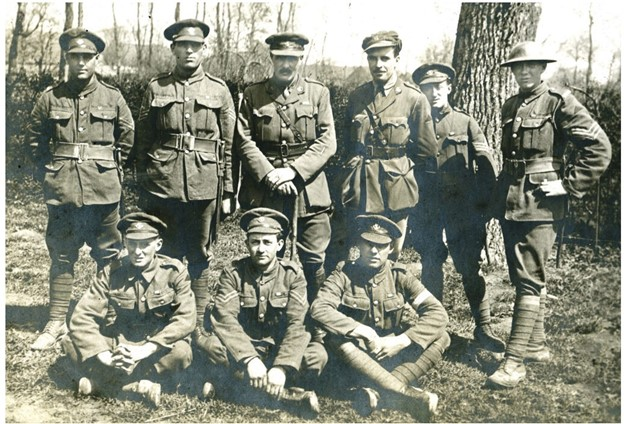

Front Row (L-R): Pte. F. Curran, Cpl J. H. Hillier, Pte. J. HounsellBack Row (L-R): Cpl. A. S. Rose, Sgt. W. Pitcher, Lt.-Col. J. Forbes-Robertson, Lieut. K. J. Keegan, Sgt. C. Parsons, Sgt. J. R. Waterfield.

The survivors of the tour at the Monchy Le-Preux Caribou. The Caribous were all at sites of devastation for the Newfoundland Regiment, so it was only fitting that 2 members of our tour went down with colds, Pat and Sandy.

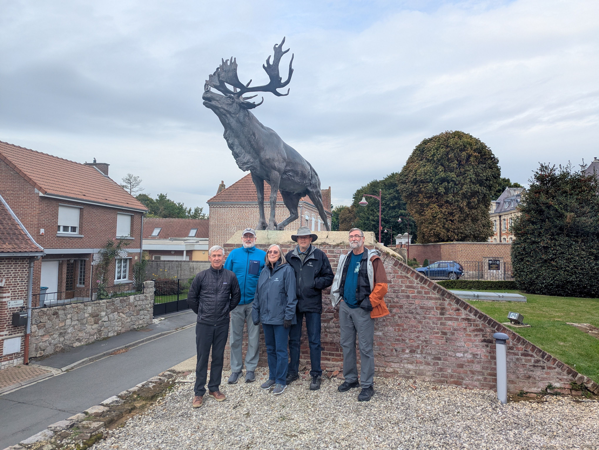

# Masnieres 20 November 1917

The next stop was the Masnières Newfoundland Memorial near Cambrai, located in an idyllic park.

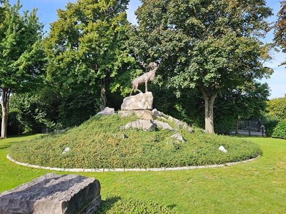

In mid-November 1917, the Newfoundland Regiment, with General Byng's Third Army, was preparing to attack the Hindenburg Line in front of Cambrai. Haig's "great experiment" was to use massed armour for the first time in the war in order to open a breach in the enemy's defences through which infantry and cavalry would advance to capture Cambrai.

The assault, which went in at daybreak on November 20 without the customary preliminary artillery bombardment, took the Germans completely by surprise. With the tanks leading the way and opening wide gaps in the enemy wire, the Third Army broke through both Hindenburg systems, advancing from five to seven kilometres on a ten-kilometre front.

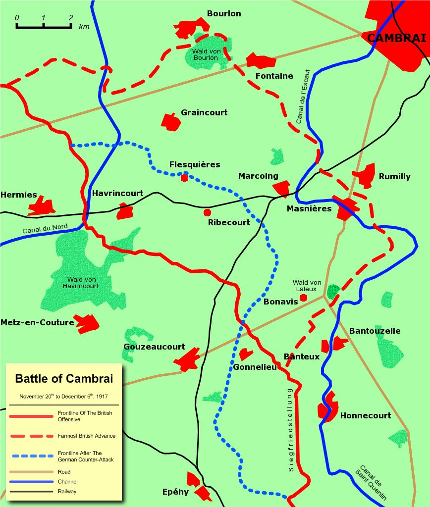

During the morning the 29th Division, in which the Newfoundland Regiment formed part of the 88th Brigade, came forward from reserve to complete clearing out pockets of enemy from the Hindenburg Support Line. Next, it was the Division's task to seize the bridgeheads over the St. Quentin Canal - the 88th Brigade on the right being charged with the capture of Masnières. In hard fighting the Newfoundlanders gained the outskirts of Masnières by nightfall on the 20th and next day completed clearing the town.

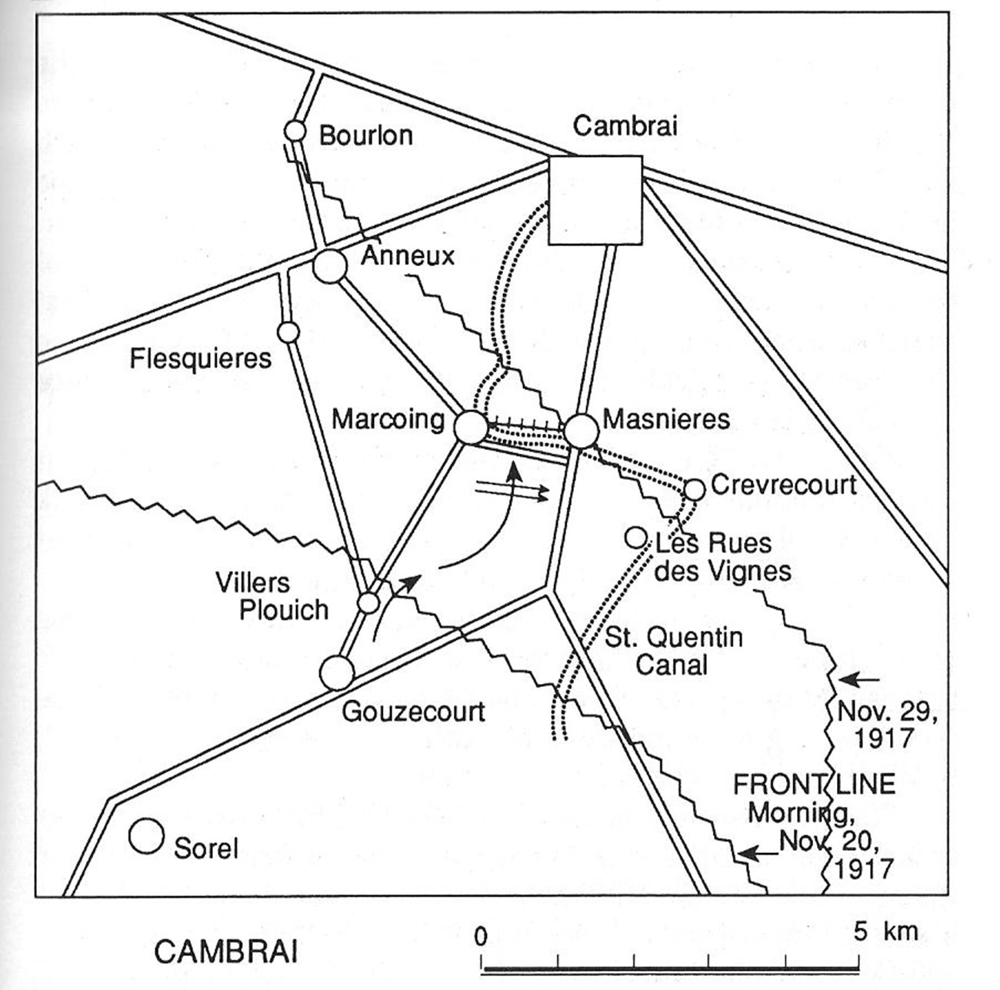

The Third Army's advance had created a salient some 15 kilometres wide and about six and one-half kilometres in depth. On November 30, the German Second Army launched a powerful counterattack against General Byng's exposed right flank. The full force of the blow from the German right wing fell on the Newfoundland Regiment and the other battalions of the 29th Division that were holding the bridgehead. When a German penetration south of Masnières threatened to encircle the slender holding, a spirited counterattack by all four battalions of the 88th Brigade, including a bayonet charge by the Newfoundland Regiment forced the enemy back almost a kilometre and a half.

That night the Newfoundland Commanding Officer wrote in his diary:

"Our strength in the morning, 9 officers, 360 other ranks; at night, 8 officers, 230 other ranks." After clinging to their tenuous position astride the Canal for another 24 hours, the defending battalions were ordered to evacuate Masnières. The battle continued until December 4, when Byng ordered a withdrawal of the Third Army to a line that closely followed the old Hindenburg Support System.

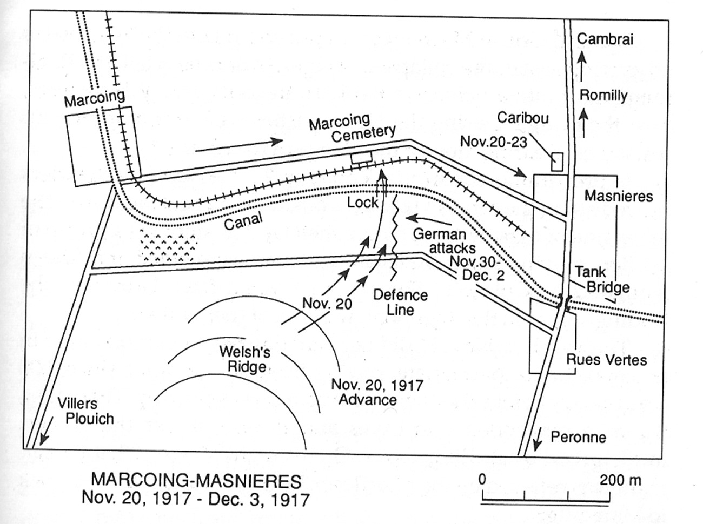

This battle was the first combat Wallace Pike had seen. He wrote extensively about the battle in his memoir that Carol and Michael read in the shadow of the Masnieres Caribou. It was very moving to hear the first person account on the ground where it happened. The details of his account are given in a previous post:

<https://www.paulsbattlefieldtours.com/post/private-wallace-pike-royal-newfoundland-regiment>

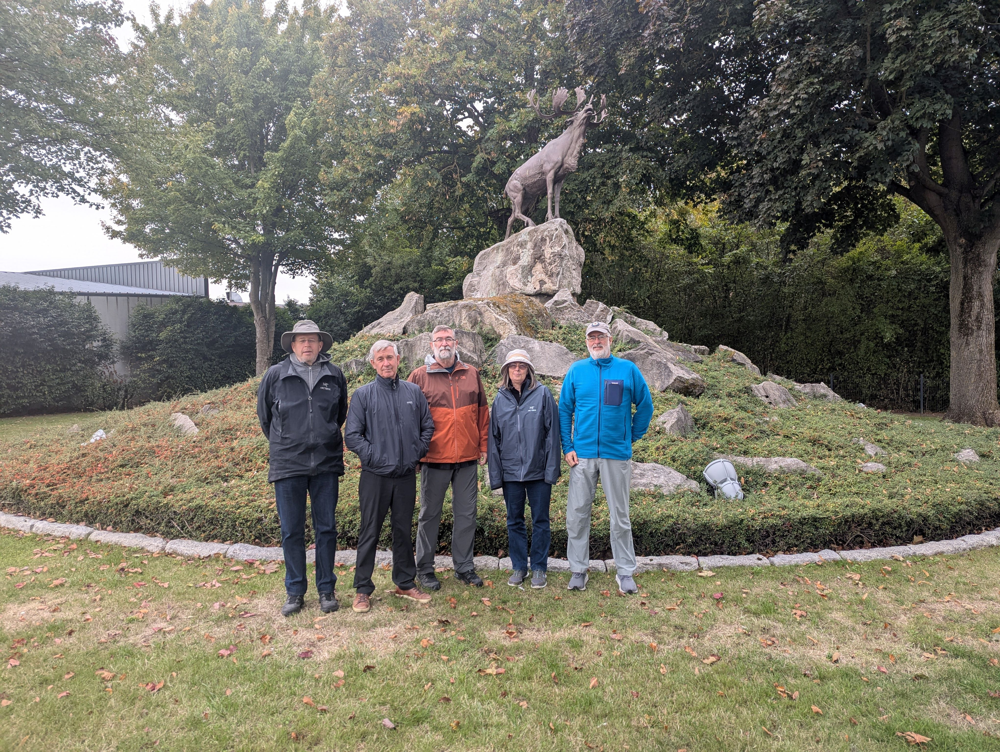

The losses of officers and men had been heavy. From Nov. 30 to Dec. 4, there were 49 killed and 196 wounded. This is in addition to the 54 killed and 194 wounded on 20 November. A total of 630 soldiers fought in this battle including 77 reinforcements bought in on 29 November. The Regiment suffered 493 casualties, an almost 80% casualty rate, second only to the casualty rate suffered at Beaumont Hamel. Wallace’s introduction to battlefield conditions had taken a heavy toll on the Regiment.

# Bailleul 10 Apr 1918 – Wallace Wounded

## Filling the Gap

The initial phase of the German Offensive was on the Somme, followed by attacks around Ypres starting on 09 April 1918. The Royal Newfoundland Regiment had just completed four days in the front line near Passchendaele and were heading back to the rear when they were diverted to Nieppe, France and immediately pressed into action. A critical situation had developed near Bailleul after the enemy launched its massive spring offensive with overwhelming numbers from the Eastern Front.  The 34th Division had evacuated Armentieres on April 10 and were withdrawing west to Bailleul on the Armentieres-Bailleul Road (see map). The Germans were advancing so quickly from the south that it was likely this withdrawal would be cut off. The 25th Division had pulled back from Ploegsteert to the edge of Nieppe. The 88th Brigade was diverted to Bailleul under temporary command of the 25th Division to secure the road under threat from the Germans advancing from the south.

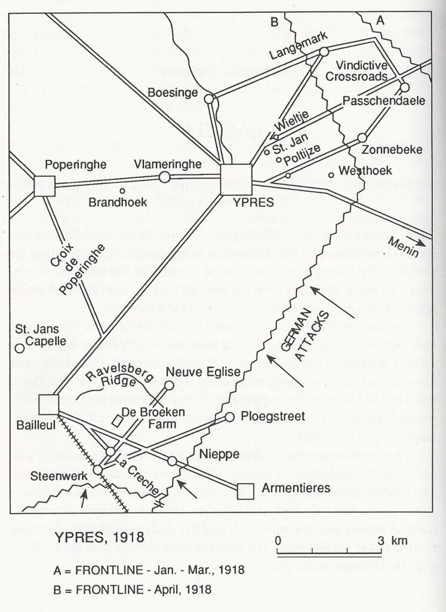

## Near Breakthrough by Germans 10 April

The Newfoundlanders and the rest of the 88th Brigade were bused to Bailleul and on to La Creche. A little after 4:00 P.M., April 10, 1918, they left the buses at La Creche, a village one and one-half miles east of Bailleul. The Germans had occupied Steenwerck and were advancing towards Bailleul. C and D Companies went forward toward Steenwerck Station, coming under machine gun fire and suffering casualties. The low railway embankment made a good defensive position, and the foremost troops of the Division were along one- and one-half miles of this track. They warded off German attacks during the day and dug in for the night, with the 40th Division on the left and the 34th Division on the right.

That night, the Newfoundlanders went into reserve but were held in readiness for a counterattack at any time. On April 11, the 88th Brigade came under the orders of the 34th Division. At midday, April 11, they were moved to De Broecken Farm, north of the Bailleul-Armentieres Road in order to protect the 88th Brigade from encirclement. At dusk, the 34th Division withdrew from Nieppe, and passed through the 88th Brigade. Destruction of Bailleul.

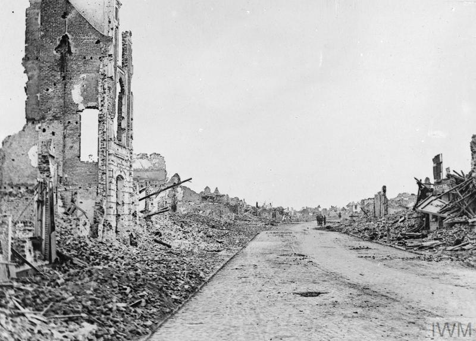

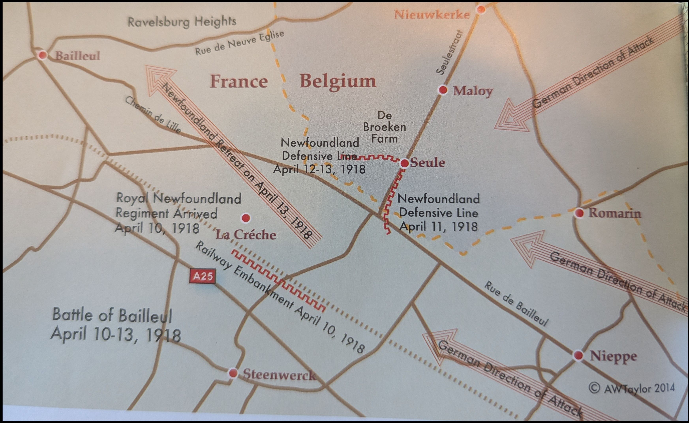

At 4:00 P.M., a strong attack against the Monmouth Regiment started. That Regiment was ordered to hold its position astride the Bailleul Road but was cut off and suffered over four hundred casualties. To cover the open flank, a platoon of C Company of the Royal Newfoundland Regiment, commanded by Lt. L. Moore, turned his front 90 degrees to face north and caught the advancing Germans in enfilade. The platoon held on stubbornly but was overwhelmed. Lt. Moore was wounded and taken prisoner. This heroic action allowed the rest of C Company to fall back in good order to light railway tracks northeast of Steenwerck. Here, they were joined by A Company and the battalion HQ and stragglers from other units, to make a stand, commanded by Capt. G. Paterson. B and D Companies came up from reserve to join them. The Germans were halted by the determined fire of the Newfoundlanders. (It was said by some that it was like Beaumont-Hamel again, only in reverse. The Newfoundlanders fired at close range at the advancing Germans from behind the railway embankment. At this time the remainder of the battalion was deployed in a semi-circle, facing fire from the north, east, and south.

That night, they withdrew to De Suele Crossroads, where the lateral road from Neuve Eglise meets the Bailleul Road. The Battalion was relieved by the Northumberland Regt. of the 34th Division. If the troops did not keep moving, they would fall asleep on their feet. They retired to their reserve position, on call in case of a counterattack by the enemy.

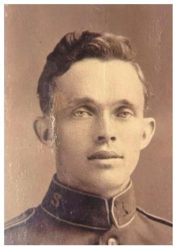

Wallace, a stretcher bearer, was wounded in the foot by a machine gun bullet while rescuing another wounded soldier and spent nearly a month convalescing before rejoining the Regiment. Wallace was sent to No 7 Stationary Hospital in Boulogne on 14 April for a contusion to his left foot. The Stationary Hospital did triage, surgery, and recovery. They decided whether the soldier could be returned to his unit or sent to England for further treatment. He was admitted to 10 Convalescent Depot in Escault, France on 27 April1918. A convalescent depot was a step between hospital and return to duty. The depot was designed for soldiers who were no longer in critical condition but not yet fit for combat. These depots provided rest, light duties, and physical therapy to help troops regain strength. Wallace returned to the Regiment on 11 May 1918.

The Regiment suffered 176 casualties at Bailleul including 71 killed.

## Ledegem 02 Oct 1918 – Wallace Severely Wounded

Continuing the advance from Ypres, the Newfoundland Regiment was called from the reserve on 2 October 1918 to locations along the front just north of Ledeghem, from the train station on the outskirts, and along the rail line. There were no trenches so the troops had to occupy defensive positions as best they could. Wallace Pike was wounded on 02 October, and his war was over. The Royal Newfoundland Regiment kept pressing forward until being taken out of the line on 26 October.

In action best described as grinding and unrelenting, the Regiment repulsed German counterattacks for the next four days. Three Distinguished Conduct Medals were awarded to Regimental soldiers on 3 October, all involving initiative and resourceful use of Lewis guns in fighting off the attacks and inflicting many casualties. In addition, that day, five Military Medals were awarded for outstanding individual actions in throwing back the enemy attacks and also for maintaining communications under fire.

On the night of 6/7 October the Regiment was relieved and retired to an area near Keiberg for much needed rest, hot food, and hot water.

The next phase of the battle for the Regiment began on 14 October, when the Second Army, including the Regiment was to advance and capture the rail line running north of Courtrai, about 7 kilometres to the east.

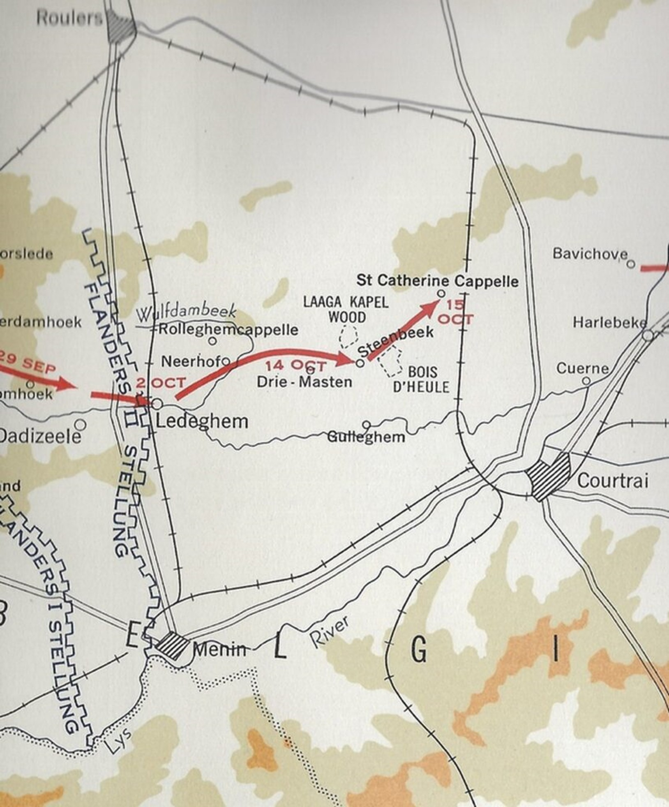

Since 28 September, when leaving Ypres at the River Lys, the Regiment had advanced more than 50 kilometres and were utterly exhausted. On the afternoon of 26 October, the Regiment was ordered to patrol around Ingoyghem; however, the Regiment was recalled almost immediately, and the as soon as the patrols returned, the Regiment was relieved, going into billets at Bavichove near Harlebeke. B Company was down to 46 soldiers.

Many Newfoundlanders reported regrets the Regiment did not make the final objective, the River Scheldt, about 600 yards away from Ingoyghem. At Bavichove, well behind the lines, a stray shell wounded Pte R. Courage, the last casualty of the war for the Regiment.

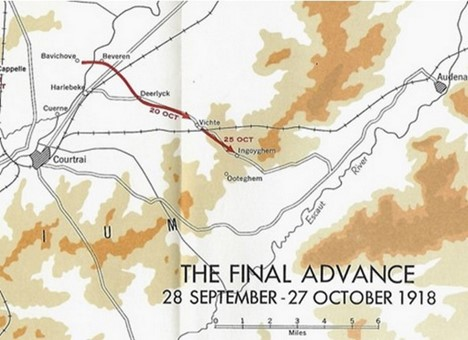

## Wallace is Wounded

On 02 October near Ledegem, there were no existing trenches, so the Regiment holed up in buildings. They were shelled and Wallace was hit on the right hand with a shell fuse cap that subsequently embedded in his thigh. Wallace would have been moved to a Regimental Aid Post (RAP), located 200–300 yards from the front line, often in trenches, dugouts, or ruined buildings.

The RAP was staffed by a Regimental Medical Officer and orderlies who provided basic first aid: dressing wounds, administering pain relief. The RAP had no holding capacity—wounded were either returned to duty or sent further back. He would have then been transferred to an Advanced Dressing Station (ADS), set up by Field Ambulance units, about 400 yards behind RAPs.

The ADS were usually located in bunkers, cellars, or protected buildings and offered limited medical care and triage. No long-term treatment was carried out; patients were stabilized for transfer to a Main Dressing Station (MDS) positioned roughly 1 mile behind ADSs. The MDS was staffed by Royal Army Medical Corps (RAMC) personnel with basic surgical tools and could perform life-saving operations in emergencies. They held patients briefly before evacuation to larger facilities called Casualty Clearing Station (CCS).

The CCS was located several miles behind the front, near railways or canals and was the first major surgical facility in the chain. They treated serious wounds, performed amputations, and managed infections. The CCS could hold hundreds of patients and often operated in tents or converted buildings. Wallace was operated on at No 10 CCS located in Lijssenthoek, Belgium, about 15 km east of Ypres. Wallace was transferred to Number 32 Stationary Hospital in Wimereux, just north of Boulogne, on 04 October. His war was over.

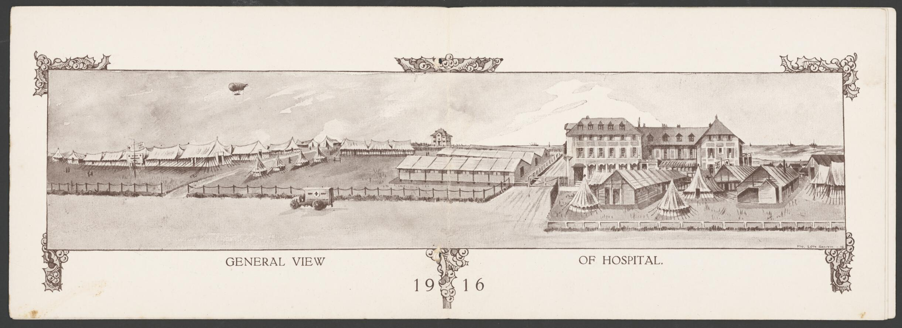

We visited the site where Wallace was wounded based on the Unit War Diaries.

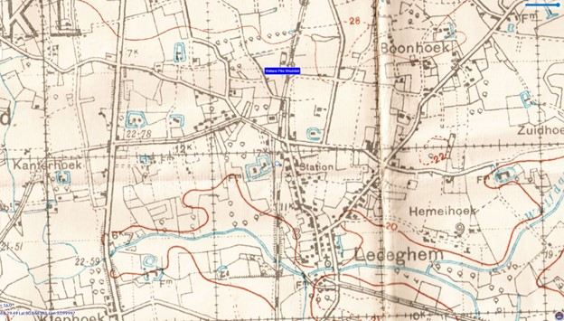

Grandson Rod Pike standing on the ground where Wallace was severely wounded.

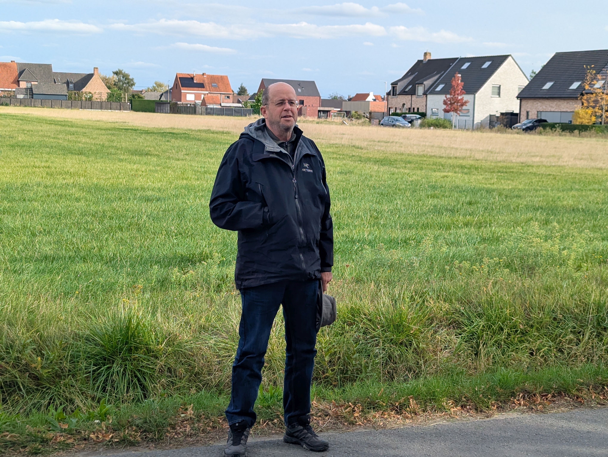

# Courtrai 14 Oct 1918

The last memorial we visited was the Courtrai Memorial in Belgium. It is located at the corner of a busy street, very different than the other settings.

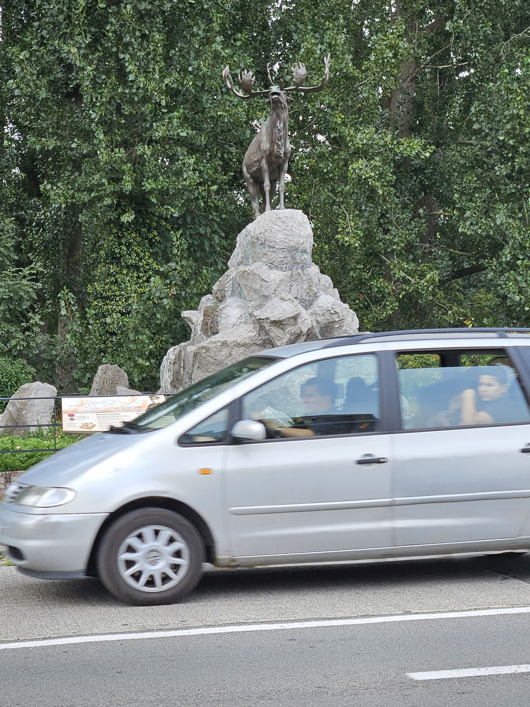

During the campaigns of 1918, the Royal Newfoundland Regiment's operations were confined to the northern sector of the Western Front. When the Germans launched their great April offensive, the Regiment fought defensive actions in the Battles of the Lys, adding the name "Bailleul" to its battle honours. In mid-September, the Battalion became part of the 28th Infantry Brigade, 9th (Scottish) Division. It was to serve with this formation for the remainder of the war.

On the opening day of the final offensive, the 9th (Scottish) Division, in the British Second Army, striking eastward from Ypres, recaptured positions on Passchendaele Ridge which the Germans had overrun in their spring offensive. At the end of two days the Newfoundland Battalion had advanced fourteen and one-half kilometres, having played an important part in breaking through the enemy's front "Flanders Position". Then came a pause in operations to allow heavy artillery and supplies to be brought forward through the mud of the old churned-up battlefield that the attacking British and Belgian forces had at last put behind them.

A resumption of the offensive on October 14 marked the beginning of what came to be called the Battle of Courtrai. As part of a general advance towards Ghent (now Gent), three corps of the Second Army, north of the River Lys (or Leie), were given the task of securing the line of the river to beyond Courtrai (Kortrijk), in readiness for establishing bridgeheads on the south bank. The 9th Division, which was on the Army's northern flank, had the greatest distance to cover. The Royal Newfoundland Regiment's objective, the railway running north from Courtrai, was eight kilometres from the starting line.

The attack went in at 5:35 a.m. on the 14th. As they moved forward, the Newfoundlanders had to deal with a number of German pillboxes that were threatening to stall the advance. A serious situation developed when leading companies were held up by German field gun shelling in some houses a few hundred metres away on the right flank. As a Newfoundland platoon moved out to try to outflank the German battery, Private Thomas Ricketts, a member of the Lewis Gun detachment, displayed great initiative and daring in engaging the enemy with his accurate fire. At one stage he had to double back across 90 metres of bullet-swept ground to replenish his ammunition. The fire from Ricketts' gun put the enemy to flight and the platoon was able to capture the four field guns, four machine-guns and eight prisoners without themselves sustaining any casualties. For his bravery, Private Ricketts, who was only 17 at the time, became the youngest winner of the Victoria Cross in the British Army.

When the Royal Newfoundland Regiment dug in at dusk on the 14th, it had taken 500 prisoners and 94 machine-guns, eight field guns and large quantities of ammunition. But this had not been accomplished without suffering heavy casualties. At dawn next day, the Battalion could muster only 300 rifles.

Separate attempts by three divisions to establish bridgeheads over the canalized Lys on October 16 and 17 for an advance to the River Scheldt failed in the face of determined German resistance. Finally, on the night of October 19-20, a major assault by three divisions abreast succeeded, the Newfoundlanders rafting across in the pre-dawn hours of the 20th.

The Caribou guarding a busy street.

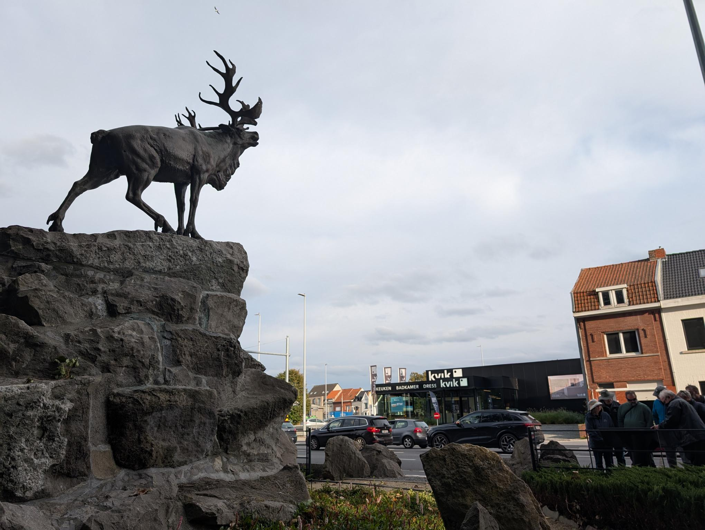

The family gathered at the Courtrai Caribou.

# Aftermath

Despite the spectacular successes in September and October 1918, the Royal Newfoundland Regiment suffered 640 casualties, including 144 killed. Over 6,000 soldiers served in the Regiment throughout the war, suffering nearly 3,000 casualties including 1045. This tremendous loss, coupled with a crippling depression in the 1930s lead to Newfoundland joining Canada.

One of the questions that came up was if William and Wallace would have known each other. Looking at their times in the Royal Newfoundland Regiment, most of their overlapping time was from the time Wallace rejoined the Regiment on 11 May 1918 after being wounded, until the time when he received his second wounds on 02 Oct 1918. Much of that time was spent guarding Gen Haig’s Headquarters in Montreuil. The Regiment spent time on guard duty, rebuilding, training and carrying out an active sports program, so it is quite likely they at least knew of each other.

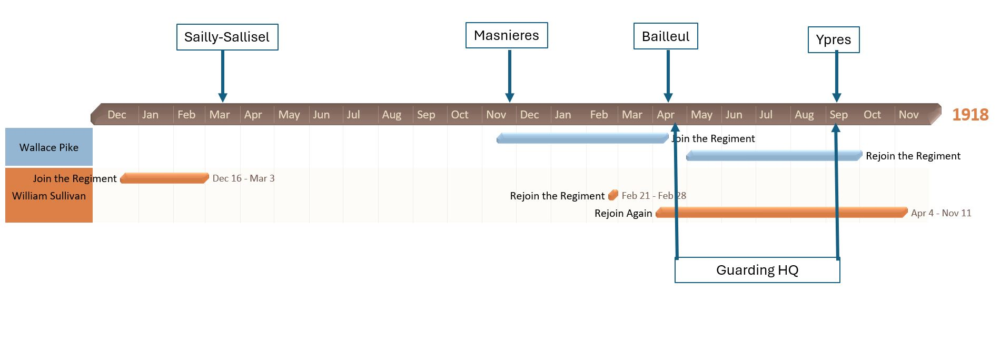

It was grand tour of Newfoundland heritage. In addition to the monuments, we were able to visit the sites were both Grandfathers were wounded. For me, standing on the ground where it happened provides a profound link to the past. Wallace’s accounts really put a personal face on the conflicts.

* [First World War](https://www.paulsbattlefieldtours.com/blog/categories/first-world-war)
* [Family](https://www.paulsbattlefieldtours.com/blog/categories/family)
* [Battlefield Tours](https://www.paulsbattlefieldtours.com/blog/categories/battlefield-tours)