# Goodfellow Brothers - Last Stand

* [pd-allen](https://www.paulsbattlefieldtours.com/profile/pd-allen/profile)
* Jan 28, 2024
* 7 min read

Goodfellow Brothers – Missing in Action

I have made several posts about the Goodfellow Brothers who were cousins of my maternal grandmother Annie Goodfellow. All four brothers served in the Great war, and three of them were killed:

·         Service Number  6537 Henry Goodfellow 2nd Battalion Suffolk Regiment

– Killed 26 Aug 1914

·         Service Number  8426 Ernest Goodfellow 1st Battalion Suffolk Regiment

– Killed 08 May 1915

·         Service Number 12049 Walter Goodfellow 7th Battalion Suffolk Regiment

- Killed 03 Nov 1915

·         Service Number 16771 Thomas Goodfellow 2nd Battalion Suffolk Regiment

- Survived

The three brothers who were killed all have no known grave and are commemorated on the following memorials to the missing:

* Henry on the La Ferté-sous-Jouarre Memorial to the Missing on the Marne River
* Ernest on the Menin Gate Memorial to the Missing, Ypres
* Walter on the Loos Memorial to the Missing, Loos

I have previously posted about visiting the 3 Memorials to the Missing, as well as visiting Suffolk Hill where Henry was killed.

On this trip, we visited a number of locations specifically related to family, and we set out to discover where Ernest and Walter were killed.

# Ernest

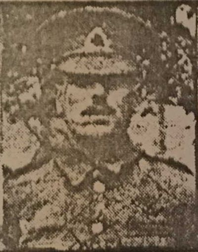

Ernest joined the 1st Battalion Suffolk Regiment in Feb 1912. The Regiment was in the Sudan when war broke out, so they returned to England and sailed to France in Jan 1915. The 1st Battalion Suffolk Regiment was part of the 28thDivision, 84th Brigade. They traveled to the Ypres area and spent their time in various areas around Ypres.

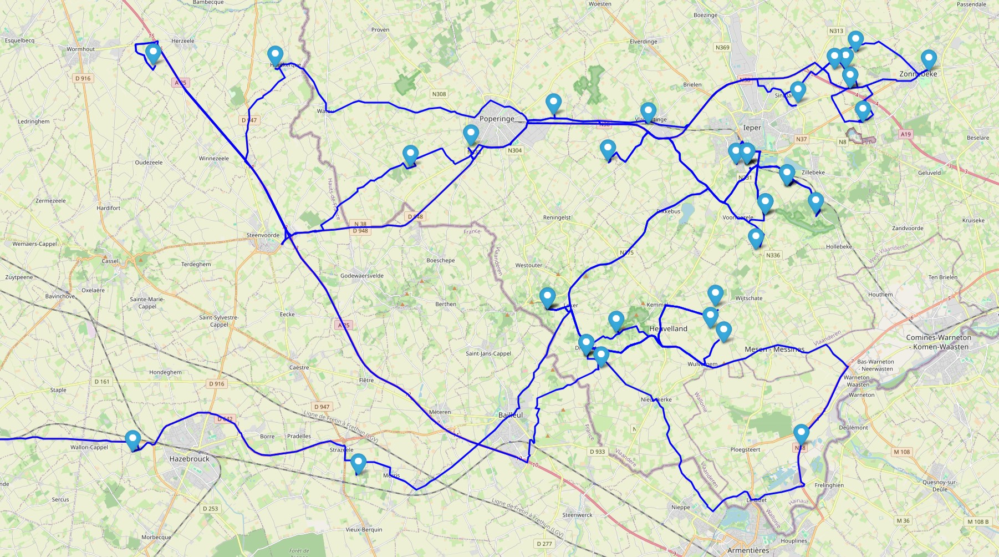

On 17 Apr 1915 they moved to Zonnebeke East of Ypres and spent the next few weeks on Frezenberg Ridge. At some points, the trenches were with 7 or 8 yards of each other, so the Suffolks were under constant fire.

On 22 Apr, at the northern end of the Ypres Salient near St Julien the French and Canadian troops were subjected to a gas attack, the first of the war.  The gas was released at 5 PM when the wind was blowing in the right directions. This new terrifying weapon caused the troops to run in panic and caused up to 5,000 deaths and 15,000 casualties. The Germans also advanced 3-4 km, broke the Allied lines and threatened Ypres.

The 1st Battalion was taken out of the line on 24 Apr and went into Brigade reserve near Frezenberg.  They were immediately ordered to take up a position on the Frezenberg Ridge near the village of Fortuin. They took a position of the left flank of the Canadians who were hard pressed.  The Battalion was also exposed to the second gas attack, suffering a large number of casualties. The Suffolks dug in all night and by morning had created a fire trench 41/2 feet deep for protection. The battle was so desperate than on 26 Apr, the Battalion destroyed all its maps and documents.  This is evident as the war diary has a gap of a month starting 09 Apr 1915.

The Battalion was taken out of the line on 28 Apr. They had suffered 400 casualties in the previous 10-day period. The Battalion was heavily shelled and suffered repeated mortar attacks. The ranks had been severely depleted and incessant rain had turned the trenches int a stream of mud. On 06 May the situation quieted down, foreshadowing another attack. Before dawn on 08 May, the troops were warned of an imminent attack, and added that the CO expected he battle to yield no ground, and to stand to the last.

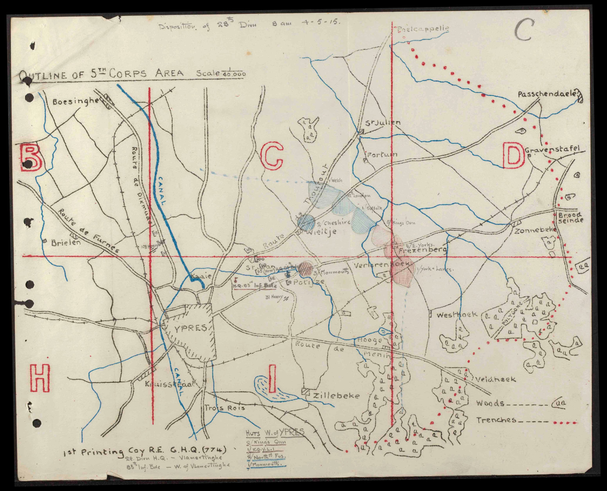

On 08 May, the German assault began at 10 AM with a ferocious artillery attack along the line. Along with the barrage, the yellow-green cloud of poison gas was also unleased on the British troops. All communication lines were cut, and the only routes for reinforcements were through Ypres which was in flames.  The CO, adjutant and Regimental Sergeant Major all became casualties, the battalion headquarters destroyed, but the Battalion held their ground. By noon, the battalion had been completely overwhelmed. The total number of casualties on 08 May amounted to over 400, including Ernest Goodfellow. He was reported missing on 08 May and declared dead on 03 Jul 1916. The next day the Suffolks consisted of 1 officer and 27 men. They had suffered over 1000 casualties in 6 weeks, and the pre-war regiment had ceased to exist.

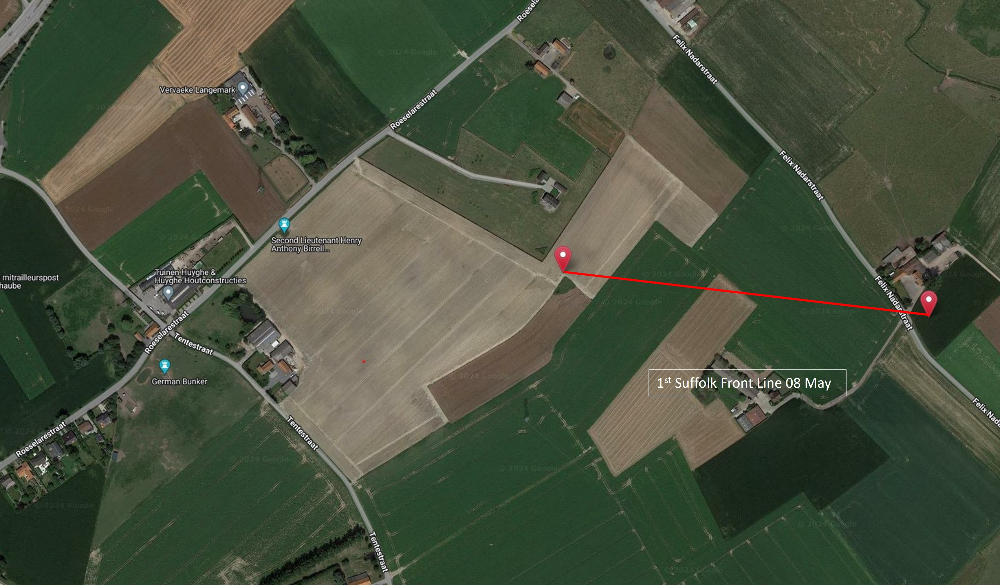

We were hoping to go down the farm lane just above the left hand marker, but there was a gate just off the road.

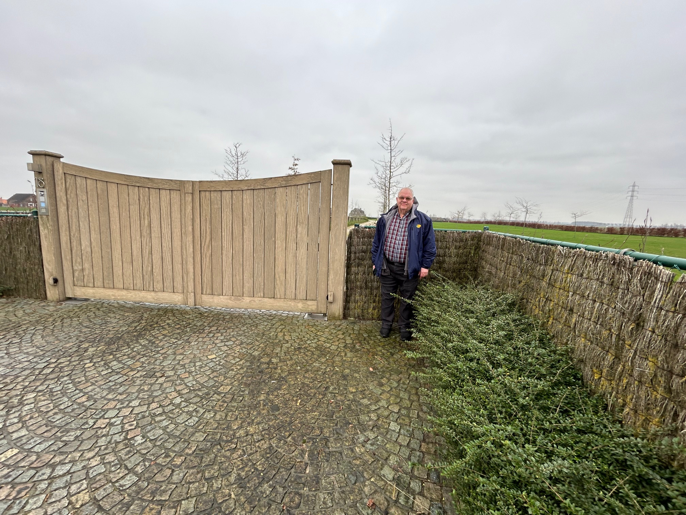

We peeked over the gate. This shot shows the left side of the front line.

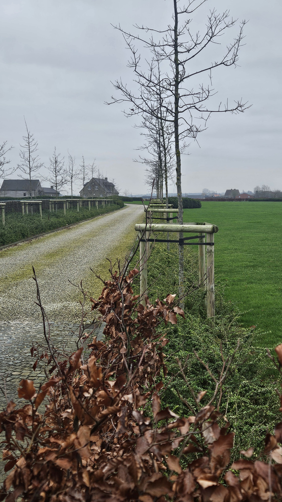

We then went to the right end of the line. This photo was standing near the right edge of the line, looking across the front line.

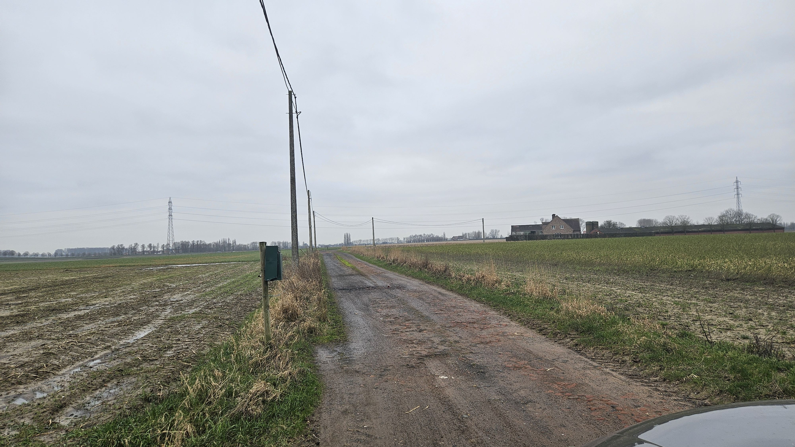

We went back to the private monument for 2nd Lt Henry Birrell-Anthony 1st Monmouthshire Regiment who was killed the same day as Ernest. The monument could use a little TLC, but was a perfect landmark to orient the battlefield. As you can see from the map, the monument is in a direct line with the Suffolk front.

If you look over the right corner of the stone, the front line started at the corner of the hedge, and went to the farm in the background. You can see how flat the battlefield was. The area was farmland then, as it is now, so the troops were always in view.

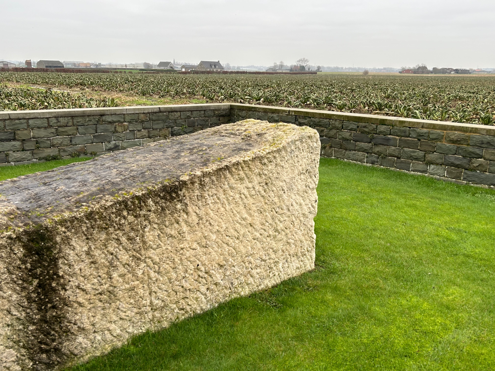

Standing on the trench line where Ernest lost his life was very emotional. In the peaceful farmland setting it’s difficult to imagine the devastation, but this aerial photograph gives an indication of the hellscape.

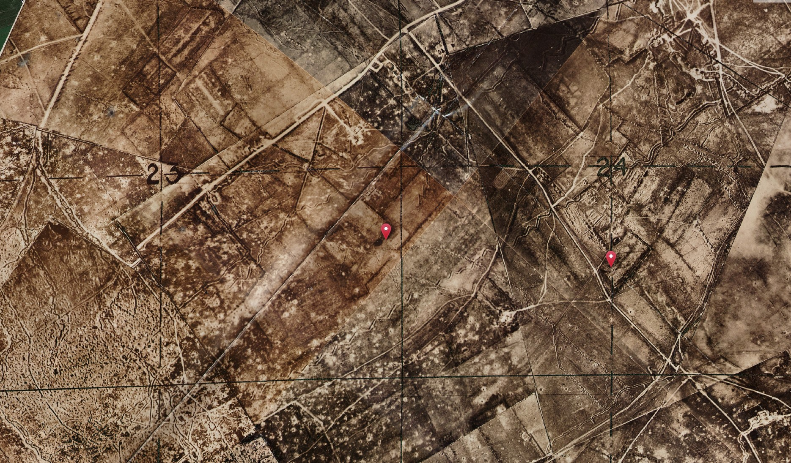

On the way out, we drove past a German Bunker, one of the remaining defensive sites on the battlefield.

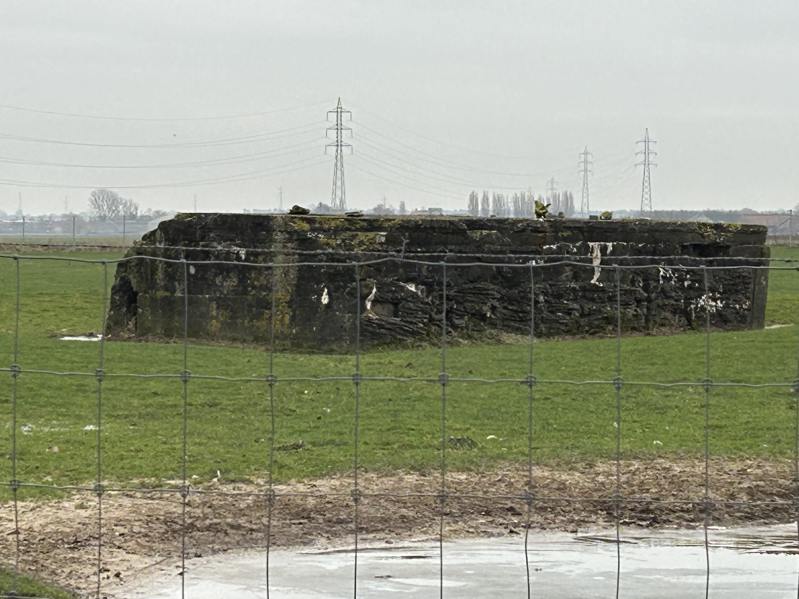

Ernest has no known grave and is commemorated on the Menin Gate.

Ernest is memorialized on Panel 21 of the Menin Gate Memorial.

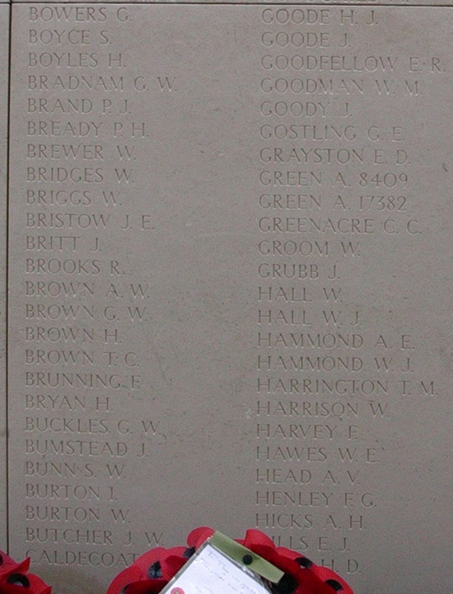

# Walter

The 7th Battalion Suffolk Regiment was part of the 35th Brigade, 12th Division. The Regiment arrived in France on 20 May 1915, and after a few months in Ploegsteert Woods south of Ypres moved into the Loos area. On 13 Oct 1915, they moved to near Hulluch, north of Lens to take part in the fighting at the Hohenzollern Redoubt. They moved in and out of the line a few times.

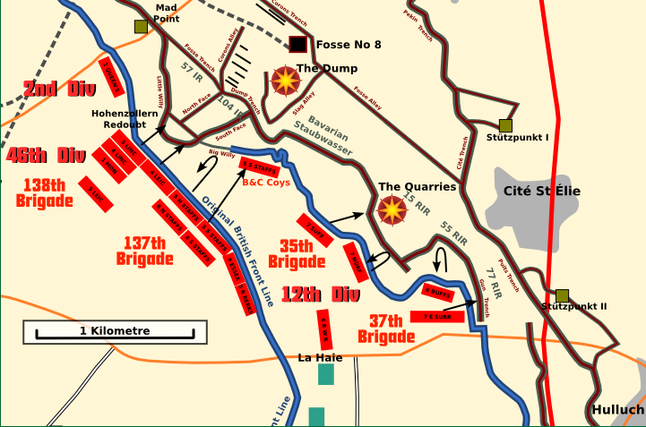

On 03 Nov at 0900 the Suffolks started to relieve 9th Essex in the front line. During relief enemy shelled the leading company as it crossed open ground West of Railway trench and Walter was killed at this point. The map below shows the location where he was killed.

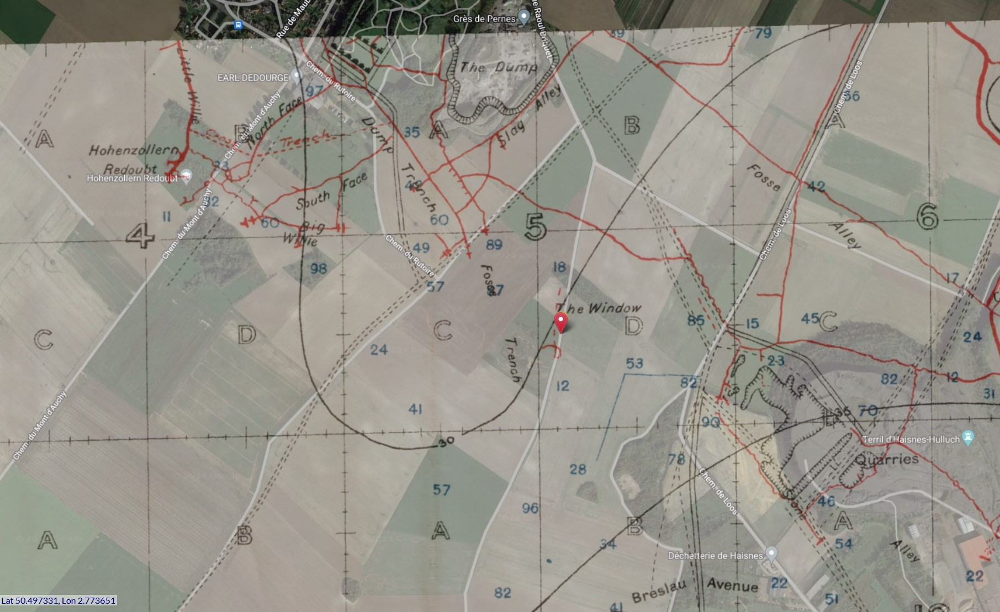

We attempted to get to the point where Walter was killed. On Google maps the location is shown to be on a road, and the road even had a name. However, when we attempted to drive down the road, it was a farm track. It had been raining heavily in the area until New Years, then everything had frozen. Unfortunately, a tractor had driven down the track while it was wet, so there were large frozen ridges in the road. We had driven down several dirt tracks to get to memorials and cemeteries by this time, so we gave it a shot. After trying to scrape off the muffler, I drove with one wheel on the ridge for a long way until the road was blocked with stones. After a smooth 17-point turn in the field, we crawled back to the main road. If the rocks hadn’t been in the road, I probably would have continued, and we would likely be there still. We stood on the ground in the area where Walter fell, a powerful connection to my ancestors. An aerial photograph shows the devastation in the area, and the road was in approximately the same shape as Nov 1915.

The lone tree was a marker for the troops as they crossed this extremely flat land to the front line. Walter’s fell in the distance just left of the tree. The flatness of the terrain indicated how exposed the troops were.

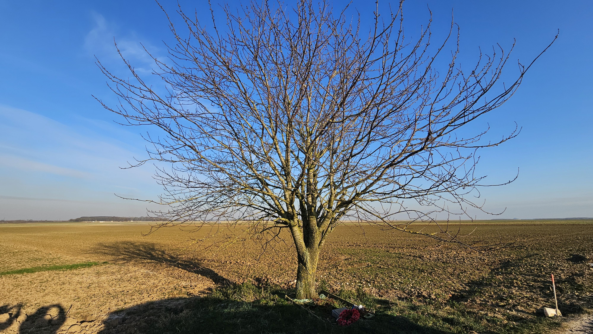

The rental car was covered with mud, and only a dedicated effort by a car wash crew in Kortrijk after I dropped off Wine Bob cleansed the evident of my driving sins.

Walter has no known grave and is commemorated at the Loos Memorial at Dud Corner Cemetery in Loos-en-Gohelle. As the cemetery is nearby, we paid Walter another visit. The panel listing the Suffolk Regiment is near the back of the cemetery on the left-hand side.

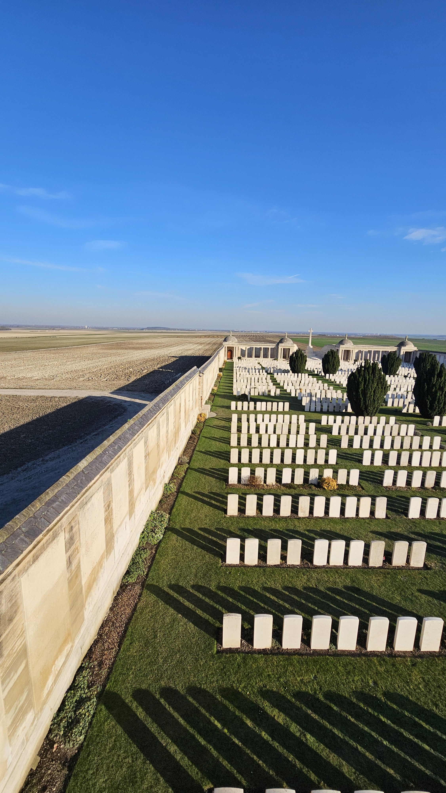

Pointing out Walter’s name.

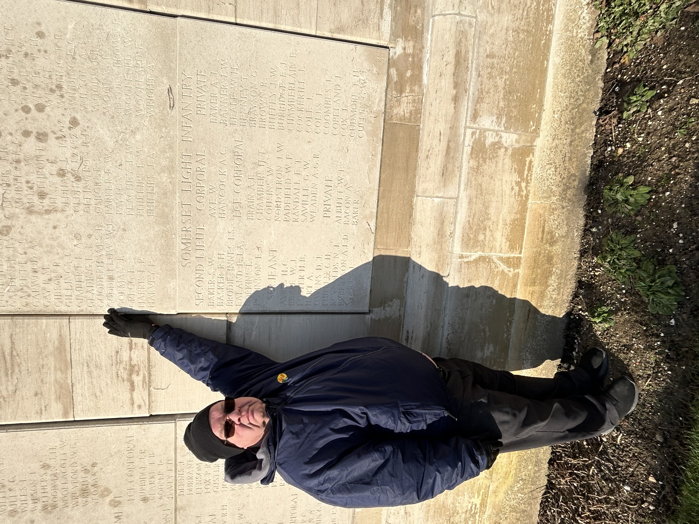

# Why is this Important?

This trip was a pilgrimage to sites where the relatives of Wine Bob and myself fought and too often made the ultimate sacrifice. We have been researching our relatives since 2017 when Bob’s son James visited Vimy for the Centenary, and asked if they had any relatives on the monument, and my sister Dale started exploring ancestry to build up our family tree. Both events allowed us to discover relatives that we had no idea existed and gave us an opportunity to do a deep dive on their military service.

We spent several years researching our relatives, immersing ourselves in books, war diaries and battlefield maps to trace their wartime experience. It is extremely gratifying and emotional to follow their footsteps, stand in the spots where they last stood, and see the ground where they fought and died. Maps, pictures and videos give you an appreciation of the environment but standing on the ground brings everything into sharp focus.

As is repeatedly reported in Battle summaries, the battle quickly breaks down to the actions of an individual or a small group of troops, and their actions determine the battle outcome. The Canadian Corps recognized that fact, and provided maps and training down to the section level so everyone was clear on their specific responsibilities. This resulted in the Canadian successes from Vimy Ridge through to the final 100 days.

We can certainly understand why many people make repeated trips to the battlefields. The energy of the souls in the cemeteries, and those lost in the fields is palpable and gives a better appreciation of the sacrifice they made. Each person who served has their own unique story, and understanding their circumstances provides a deeper insight into the conflict. Moving from the statistic of 20,000 casualties to standing at the specific location where an individual met their end is an intensely powerful experience, transforming mere historical data into a poignant, tangible connection with the past.

* [First World War](https://www.paulsbattlefieldtours.com/blog/categories/first-world-war)
* [Family](https://www.paulsbattlefieldtours.com/blog/categories/family)