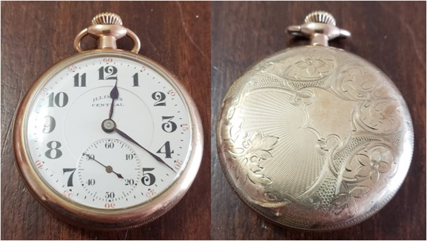
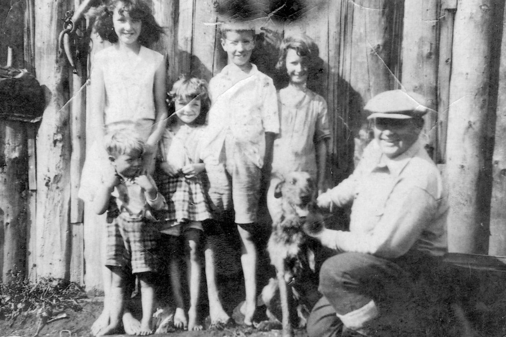

# Grandfather's War

* [pd-allen](https://www.paulsbattlefieldtours.com/profile/pd-allen/profile)
* Sep 4, 2023
* 4 min read

**124302 William Albert Johnston CEF**

William Johnston

William Albert Johnston (Bill) was born on March 18, 1899, in Essex, Ontario. He was the first-born son of Sam Johnston and Ada Perry. Sam was born in Glasgow Scotland in 1875, and came to Canada as a Home Boy, a program where children were shipped to Canada as forced immigration and cheap labour. They had four other children, Samuel Ernest (1900) Muriel Catherine (1904), Edna May (1906) and George (1908).

Like many of the young men, he was caught up in the excitement of the war and decided that he wanted to enlist in the Canadian Overseas Expeditionary Force and lied about his age to get accepted. This would be a chance for a great adventure. He travelled to Windsor to enlist. Prior to leaving for Europe, Bill’s mother Ada gave Bill the gift of a Pocket Watch. Bill took it with him to war and we like to think it brought him home safely. Bill’s grandson, Paul Allen was given that same watch when he entered Royal Military College.

Bill's Pocket Watch

He enrolled in the 70th Battalion. The battalion was authorized on 15 August 1915 and recruited in the Ontario counties of Essex, Kent, Lambton and Middlesex. The 70th Battalion embarked for Britain on 25 April 1916 on the SS Lapland, where it provided reinforcements to the Canadian Corps in the field until 7 July 1916, when its personnel were absorbed the 39th Battalion, CEF.

On 18 Jun 1916, William was assigned to the 58th Battalion, and shipped to France the next day. The 58th Battalion disembarked in France on 22 February 1916, where it fought as part of the 9th Infantry Brigade, 3rd Canadian Division in France and Flanders until the end of the war.

On 02 Jun 1916, the Battalion became engaged in the Battle of Mont Sorrel where the Germans attacked the Allied positions. The battle continued until 14 Jun 1916, when the Canadians regained their original lines. The 58th Battalion suffered a total of 43 killed and 211 wounded or missing. The Battalion had suffered over 400 casualties since landing in France in Feb 1916. A Draft of 152 reinforcements were received on 19 June and including Bill. The Battalion remained in place until 6 September, alternating periods in the front line, engaging in minor skirmishes, and subjected to constant artillery shelling and occasional gas attacks. The Battalion was moved starting 7 Sep, relocating several times before being sent to Courcelette, in the Somme River region.

The Battle of Flers-Courcelette began on 15 September 1916, with the 2nd and 3rd Canadian Divisions participating in the attack. The Battle was part of the Somme offensive during the First World War and the first since 01 July. It resulted in thousands of battlefield casualties, but also signalled the start of new thinking in military tactics that included the first usage of tanks, as well as the creeping artillery barrage.

On 16 Sep, the 58th Battalion was to follow up an assault on the Zollern Redoubt after the 7th Brigade captured the Zollern Graben trench, but the attack was not successful, and the 58th dug in. There was a great deal of action as both sides tried to improve their positions, and Bill was wounded in the left upper arm on 16 September and returned to the Birmingham War Hospital on 23 September with the bullet still in his arm. The battalion suffered 48 killed, 217 wounded or missing for the month of September 1916. Bill spent less than 2 months in France, and was wounded during his first major battle, at the age of 17. This picture is from the Battle of Courcellette. Although it is very unlikely to be Bill, we like to claim it as him, as Bill was wounded in the left upper arm.

Wounded at Courcelette

After some time at the Canadian Convalescent Hospital where the bullet was removed, Bill was assigned to the Canadian Military School in Crowborough Shoreham and spent the remainder of the war at training centres in England. It was during this posting that Bill met our Grandmother Annie Goodfellow who was working as a barmaid in Folkestone. They were married in Elham, Kent in September 1918.

Bill and Annie returned to Canada on the SS Melita in February 1919. Annie was pregnant with their first child. She was fortunate to be able to travel on the same ship as Bill and travelled as a Military Dependent. When they arrived back in Canada, Bill and Annie took the train to Essex, to the home of Bill’s parents.

Shortly after their return, Bill and Annie moved to Bothwell and had 5 children: Marjorie (1919), Samuel (1920), Lillian Mae (1922), Muriel (1924) and Louie (1927).

In 1926 Bill moved to Phelps township following his younger brother George, to take advantage of a government program to provide free land for northern homesteaders.

**The Family Shortly before Bill’s Passing**

As can be seen in the photo, their house was built with logs stacked vertically rather than horizontally. This picture was taken not long before Bill's passing. As well as clearing and farming his land, Bill was a Government Land Agent, showing people the location of parcels of land for settlement.

In Aug 1932, at a family outing, Bill and his eldest son Sam tragically both drowned. The family struggled with loss, but persevered and prospered, with Muriel and Lillian Mae (Mick) living close to the family homestead for their entire lives. Sam and Bill are buried in the Feronia Cemetery at the grave marker provided by the CEF.

A detailed analysis of Bill’s Military career as well as a Story Map are available:

<https://pd-allen.wixsite.com/warstories>

* [First World War](https://www.paulsbattlefieldtours.com/blog/categories/first-world-war)
* [Family](https://www.paulsbattlefieldtours.com/blog/categories/family)