# Hawthorn Ridge Crater

* [pd-allen](https://www.paulsbattlefieldtours.com/profile/pd-allen/profile)
* Oct 11, 2023
* 5 min read

I had the opportunity to return to the Somme this week with 3 British fellows, and tour around several key battle sites. The guy who organized it likes touring the Battlefields, and I signed up on a Facebook posts. The other two folks were history buffs as well, so we had a great time touring the sites, and spent the evenings in an excellent BnB telling war stories. So far I have been on a bus tour, a private tour with a Battlefield guide, solo outings and the most recent outing with a collection of keen amateurs. I have enjoyed all types of touring, and will continue to find ways to put boots on the ground.

The explosion of the Hawthorn Ridge Crater, and the subsequent attack on Hawthorn Ridge is one of the most publicized battles of the War, because the explosion and subsequent attack were filmed, and put into the film, The Battle of the Somme, viewed in 1916 by millions of Commonwealth members.

A short clip of the explosion.

[Hawthorn Ridge Explosion](https://youtu.be/g8YfJmwY5Uo?si=SLBeqCaahA_m657A)

The entire movie of 1 hour 12 minutes is also available:

[Battle of the Somme Movie](https://youtu.be/xQ_OZfaiUlc?si=KHd4w4aASPCJqztK)

In order to create this mine, over a 3-month period, British Tunneling companies dug a tunnel over 1000 ft long, and 80 ft below the surface. The mine at Hawthorn Ridge was one of 19 blown on the first day of the Battle of the Somme, and created a hole 450 ft long, 300 ft wide and 80 ft deep.

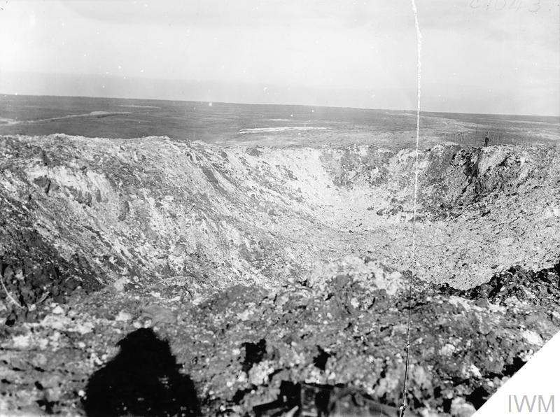

This is what the crater looks like today.

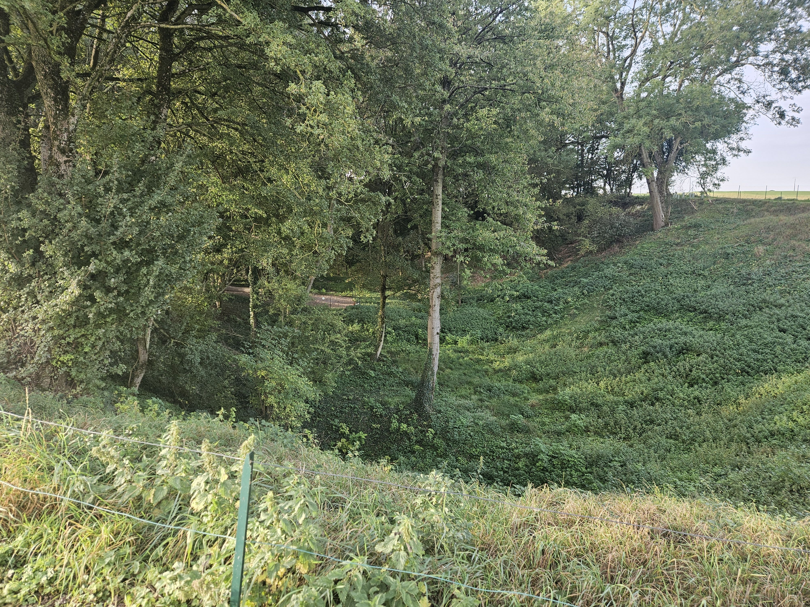

One of our touring party at the bottom of the crater.

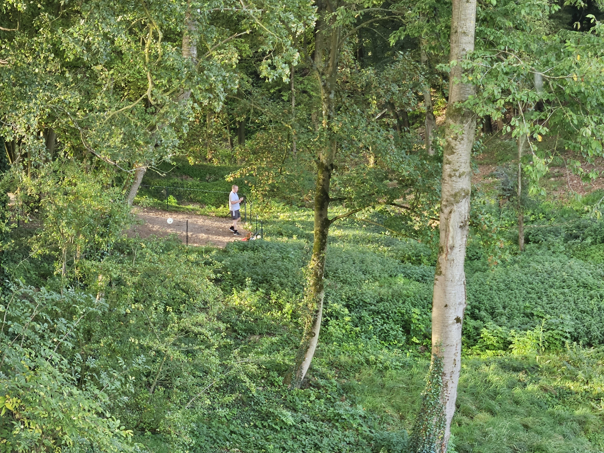

View from the bottom of the crater.

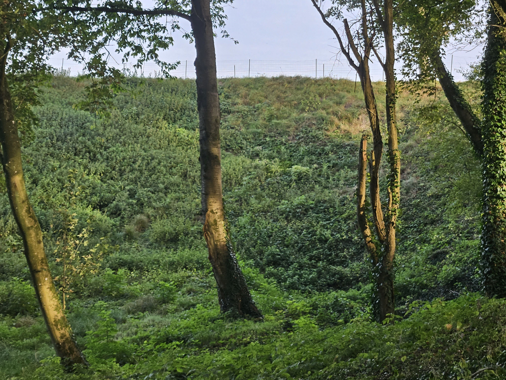

In order to maintain secrecy, the work was done by hand with sandbags passed hand by hand used to remove the material. 40,000 pounds of explosives were used to create the explosion. The mine was blown at 0720 on 01 Jul 10 minutes before the attack. There were concerns that the debris would fall on the British soldiers, but it only served a warning for the Germans that the attack as imminent. The mine blew the nose off the German front line trench, but they quickly recovered, and moved into the crater to fend off the British.

The map shows the battalion locations as they assault the Hawthorn Ridge.

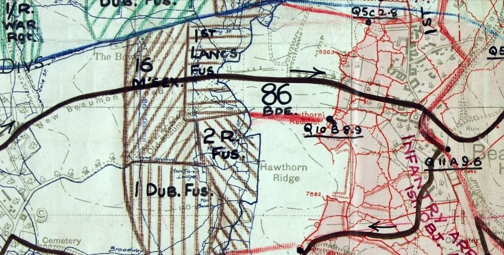

Now, only the cows stand guard over the ridge.

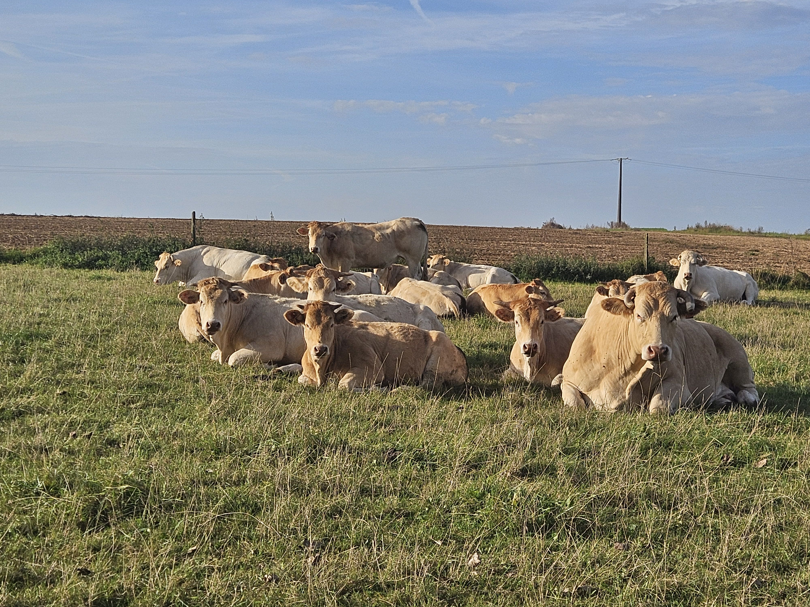

The view up the ridge gives an impression of the challenge facing the British as they as attacked the Ridge. The crater is defined by the stand of trees. Having walked up the hill, I can attest it is much steeper than it appears in the photo.

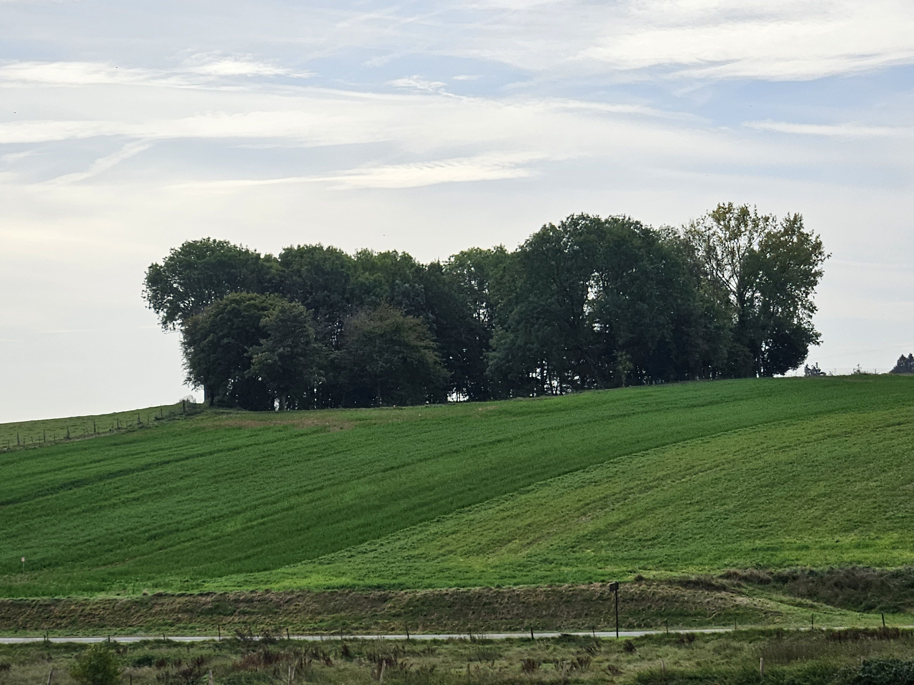

View from the Beaumont Hamel Military Cemetery. The crater is in the stand of trees on the right.

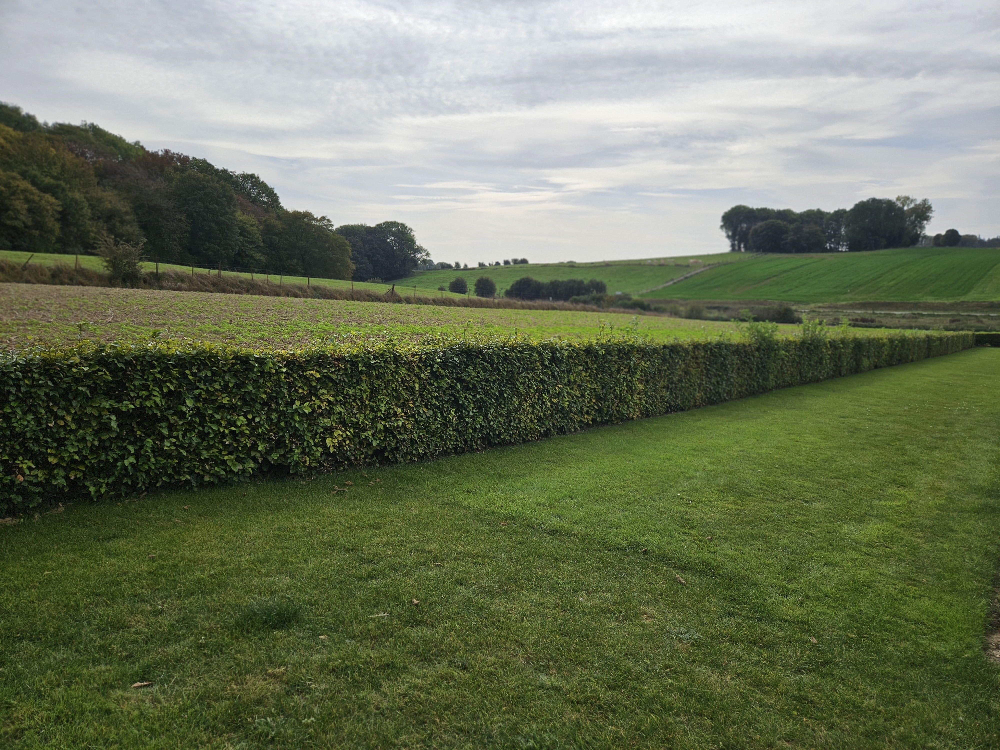

In this picture, taken from the edge of the Hawthorn Ridge crater, the sunken Lane was located in the line of trees just to the right of the cross in the centre. The Beaumont Hamel Military Cemetery is just visible on the right edge of the picture. The Germans held the high ground and had dominating fields of fire.

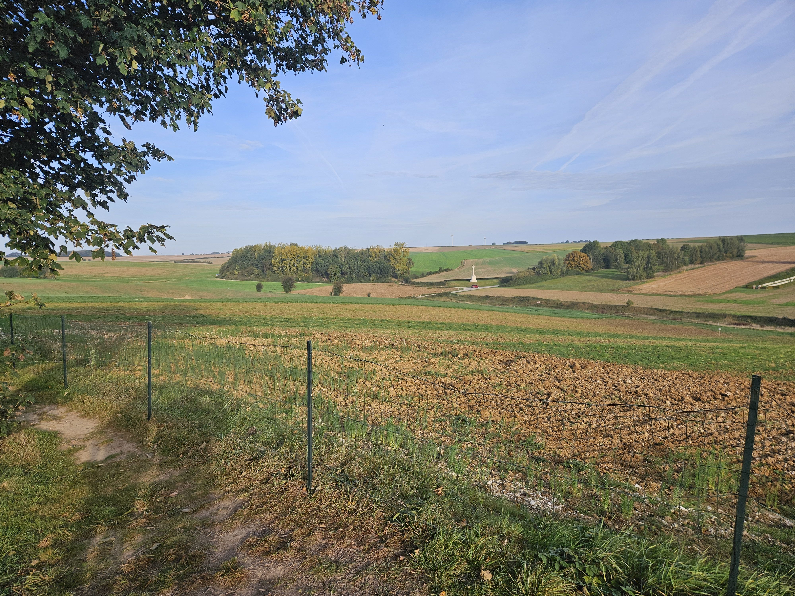

Another famous scene is of the 1st Battalion Lancashire Fusiliers, who had moved up by tunnels to the Sunken Lane, approximately halfway across no mans land. This photo was taken an hour before the assault.

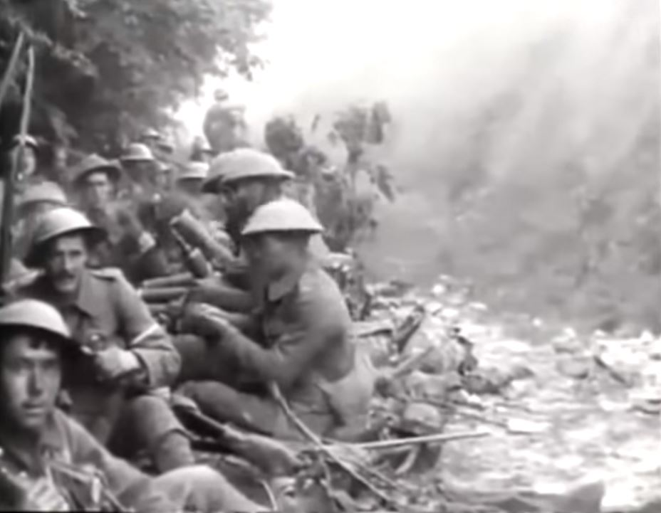

A view of the Sunken Lane.

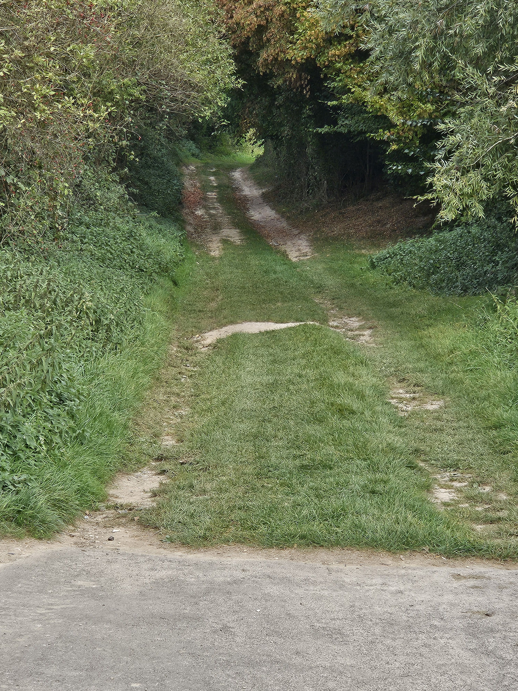

The film also shows the Fusiliers crossing the battlefield but is stopped before the troops are mown down by machine gun fire as they cross no man’s land. The troops crossing no man's land were completely exposed, making easy targets.

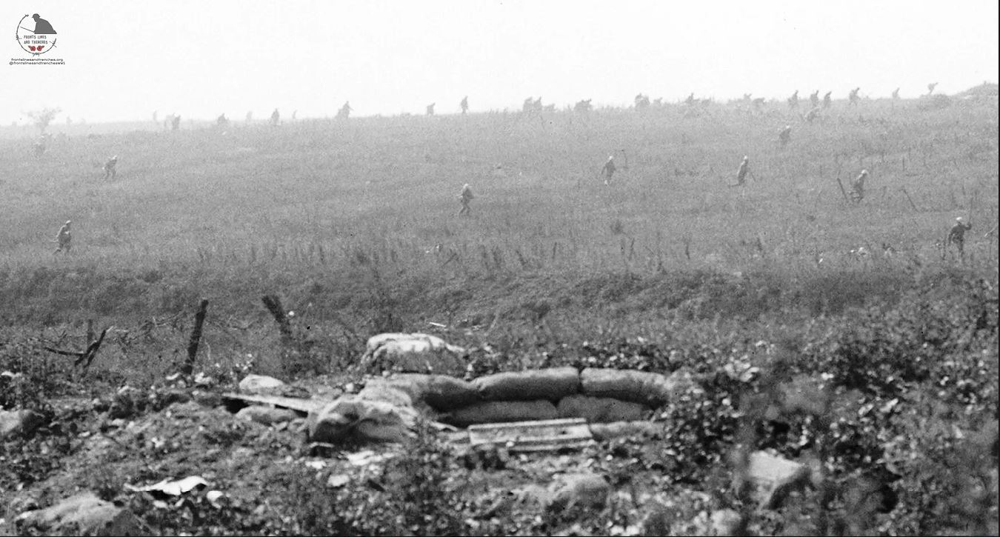

The story of Eric Heaton was taken from Paul Reed, a battlefield historian and long-time tour guide, who produces the seminal WWI podcast The Old Front Line. Paul interviewed many WWI veterans and their families, including Irene Heaton.

Eric Heaton joined up in 1914 and was commissioned the following year, being posted to France in early 1916 where he joined the 16th Battalion Middlesex Regiment. He served with them on the Somme and the men of his platoon named one of their trenches, dug close to the village of Auchonvillers, after him. On the First Day of the Somme, he led his platoon up the slopes of Hawthorn Ridge to their objective – the mine crater, blown earlier that morning. He was last seen falling into the grass with a leg wound. The 16th Middlesex regiment suffered 524 casualties on the first day of the Battle of the Somme.

On the night before the first day of the Battle of the Somme Eric wrote this letter home:

*‘I am writing this on the eve of my first action. Tomorrow we go to the attack in the greatest battle the British Army has ever fought. I cannot quite express my feelings on this night and I cannot tell you if it is God’s will that I shall come through but if I fall in battle then I have no regrets save for my loved ones I leave behind. It is a great cause and I came out willingly to serve my King and Country. My greatest concern is that I may have the courage and determination necessary to lead my platoon well. No-one had such parents as you have been to me giving me such splendid opportunities and always thinking of my welfare at great self sacrifice to yourselves. My life has been full of faults, but I have tried at all times to live as a man and thus follow the example of my father. This life abroad has taught me many things chiefly the fine character of the British race to put up with hardships with wonderful cheerfulness. How I have learnt to love my men; my great aim has been to win their respect which I trust I have accomplished and hope that when the time comes I shall not fail them. If I fall do not let things be black for you, be cheerful and you will be living then always to my memory.’*

This photo shows the family visiting his grave site in 1919 at the Hawthorn Ridge [#1](https://www.paulsbattlefieldtours.com/blog/hashtags/1) Cemetery. Eric had planned to follow his father and brother into the ministry.

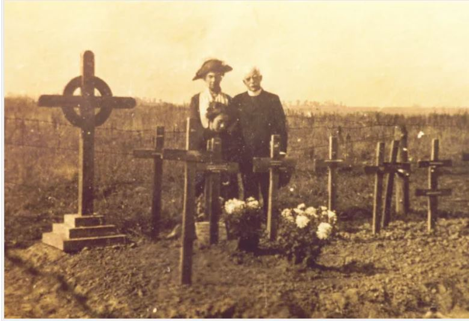

Eric’s sister Irene shown kneeling in front of his cross, ever married, as she felt that no man could live up to her brother. This story serves as a reminder of the impact of the soldier’s death on the entire family.

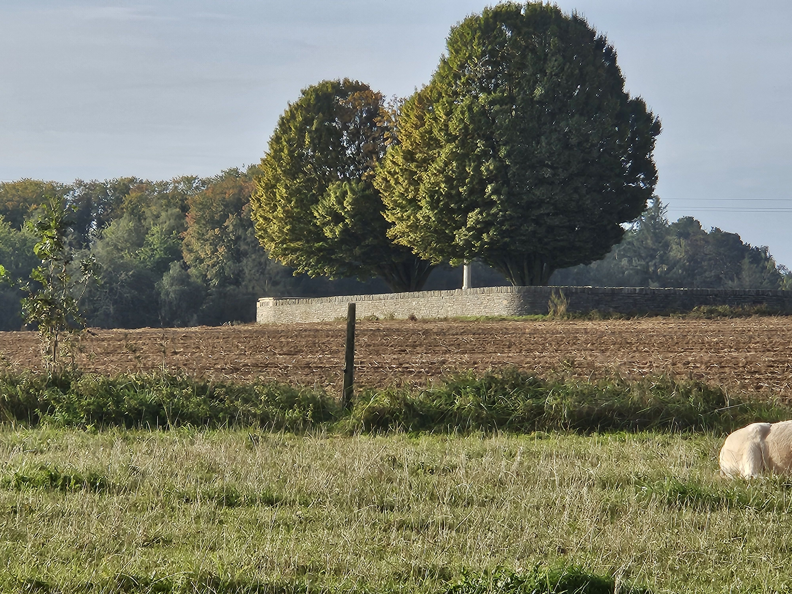

Hawthorn Ridge [#1](https://www.paulsbattlefieldtours.com/blog/hashtags/1) Cemetery is located just behind the Hawthorn Ridge Crater.

The first day of the Battle of the Somme was the deadliest day in British Military History, with 57,470 casualties including 19,240 men killed with very limited gains. The Battle of the Somme raged on for 4 more months with the British Empire suffering 420,000 casualties, the French 200,000 and the Germans more than 450,000 killed or wounded. The Canadians didn't enter the battle until 15 September at Courcelette, but suffered 24,7000 casualties by the time the Battle of the Somme ended on 18 Nov 1916.

* [First World War](https://www.paulsbattlefieldtours.com/blog/categories/first-world-war)