# In and Around Ypres

* [pd-allen](https://www.paulsbattlefieldtours.com/profile/pd-allen/profile)
* Sep 17, 2023
* 8 min read

Updated: Jan 27, 2024

The first stop of the day was at the Canadian Memorial at Sanctuary Woods.

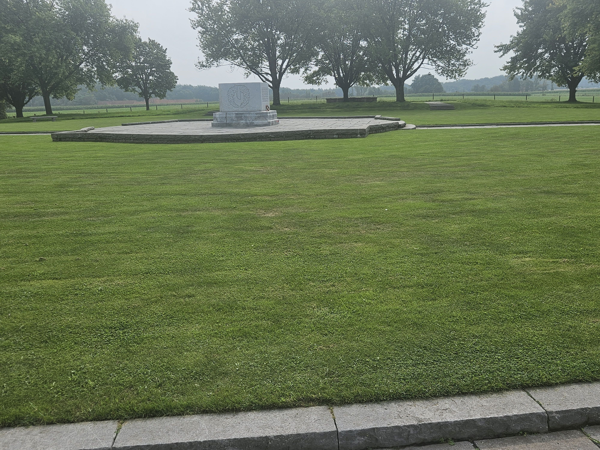

The Memorial stands in tribute to the sacrifices and achievements of Canadian soldiers in bloody actions fought over a period of five months to keep a determined enemy from gaining possession of the last few square kilometres of Belgian territory still in Allied hands.

Before the Canadians joined the ill-fated operation of the Somme, they were engaged in local offensives in the southern part of the Ypres Salient - from St. Eloi to a point just northwest of Hoge (Hooge) on the Ypres-Menin road, offensives intended to keep the Germans occupied.

At the battle of St. Eloi the Canadian Corps' 2nd Division received its "baptism of fire" in a battlefield of water-filled craters and shell holes. The Canadians, wearing the new steel helmets that had just been introduced, suffered 1,375 casualties in 13 days of confused attacks and counter-attacks over six water-logged mine craters.

For the 3rd Division, the initiation to battle was even more devastating. On the morning of June 2, the Germans mounted an attack to dislodge the Allies from their positions at Mount Sorrel just north of the Ypres-Menin road. In the fiercest bombardment yet experienced by Canadian troops, whole sections of trench were obliterated and the defending garrisons annihilated. Human bodies and even the trees of Sanctuary Wood were hurled into the air by the explosions. As men were literally blown from their positions, the 3rd Division fought desperately until overwhelmed by enemy infantry. By evening, the enemy advance was checked, but the important vantage points of Mount Sorrel and Hills 61 and 62 were lost. A counter-attack by the Canadians the next morning failed; and on June 6, after exploding four mines on the Canadian front, the Germans assaulted again and captured Hooge on the Menin Road.

The newly appointed Commander of the Canadian Corps, Lt-Gen. Sir Julian Byng, determined to win back Mount Sorrel and Hill 62. He gave orders for a carefully planned attack, well supported by artillery, to be carried out by the 1st Canadian Division under the Command of Major-General Currie. Preceded by a vicious bombardment, the Canadian infantry attacked on June 13 at 1:30 a.m. in the darkness, wind and rain. Careful planning paid off and the heights lost on June 2 were retaken. "The first Canadian deliberately planned attack in any force," the British Official History was to record, "had resulted in an unqualified success." The positions regained by the Canadians would remain part of the Allied line in front of Ypres until the massive German offensives in the spring of 1918.

The cost was high. At Mount Sorrel Canadian troops suffered 8,430 casualties.

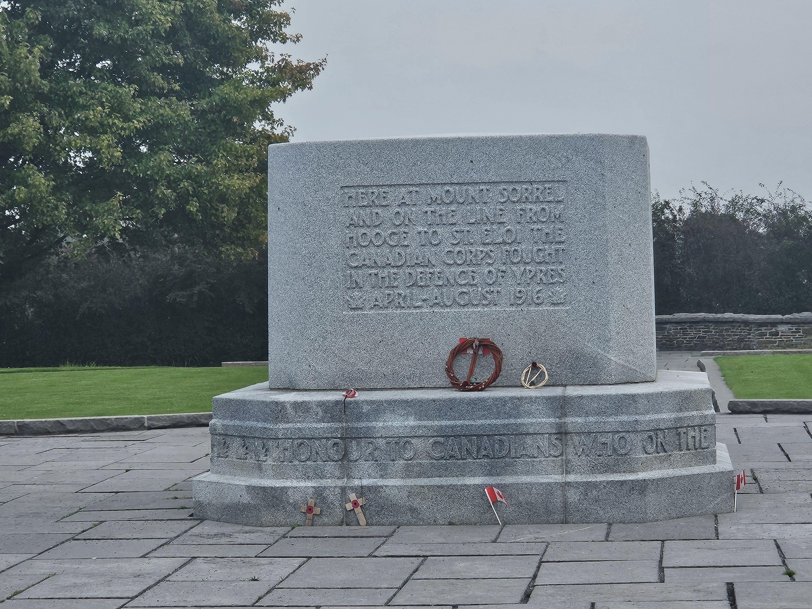

Our next stop was Tyne Cot cemetery, the largest Commonwealth War Graves Commission cemetery in the world. Tyne Cot has 11,954 burials 8,369 of which are unknown. It is impossible to take a ground level picture that captures the size of these cemeteries.

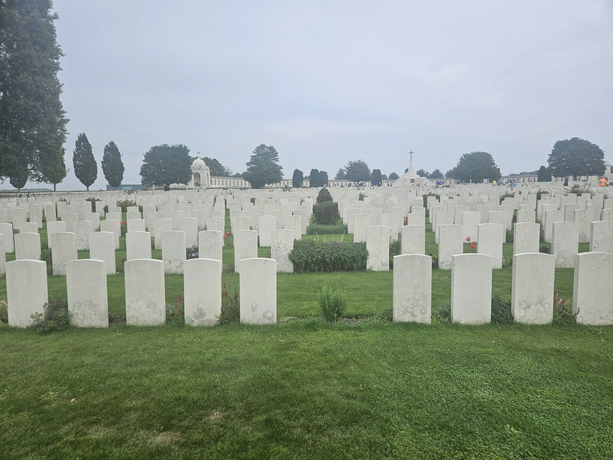

The cross of sacrifice is built on top of a German Bunker. The size of the cross of sacrifice depends on the size of the cemetery, so this is the biggest one there is. An ex RCMP guy on tour with us politely asked a gaggle of British school kids to get off the monument for a picture. His tone was effective, as they all scattered quickly, nice to have the law on your side.

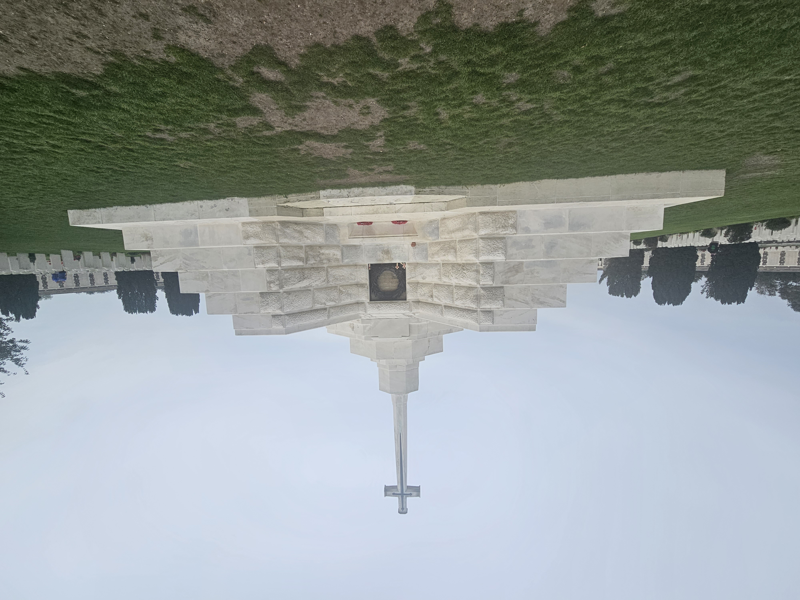

In addition to the burials, there 33,783 names of the missing. The names of the missing were to be on Mennin Gate that we will visit later, but they ran out of room, so all missing British Soldiers and New Zealanders missing after 15 Aug 1917 are listed on the Tyne Cot Walls.

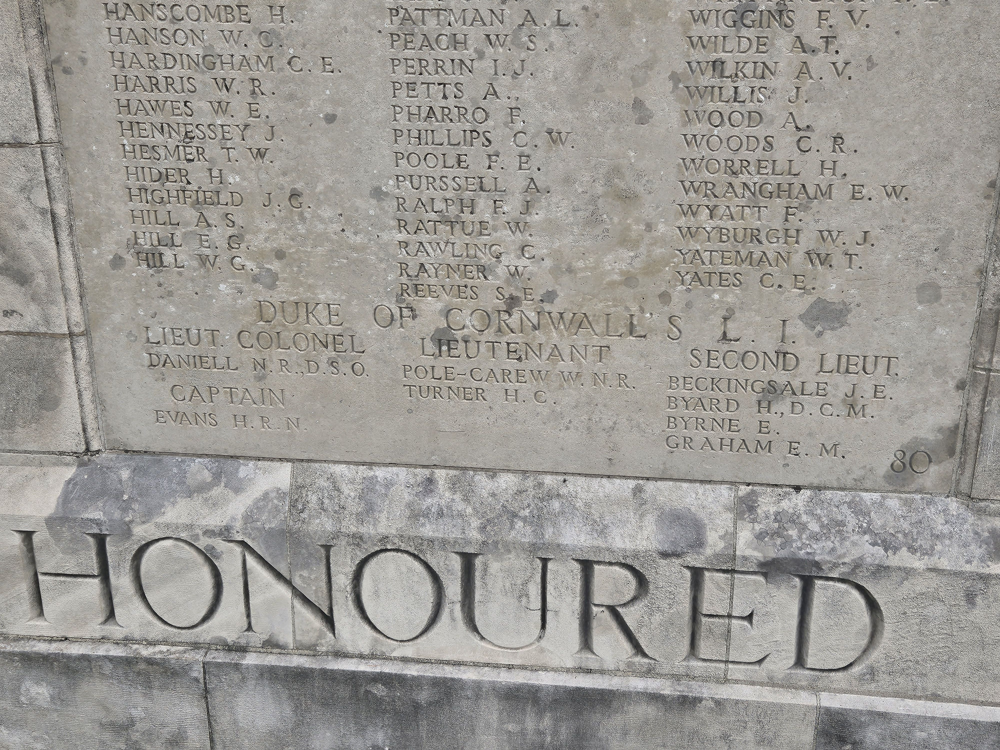

Quite unusually, there are 2 other bunkers within the cemetery. From the condition of the bunkers, they went through some heavy fighting.

Next stop was the Canadian Memorial for Passchendaele at Crest Farm.

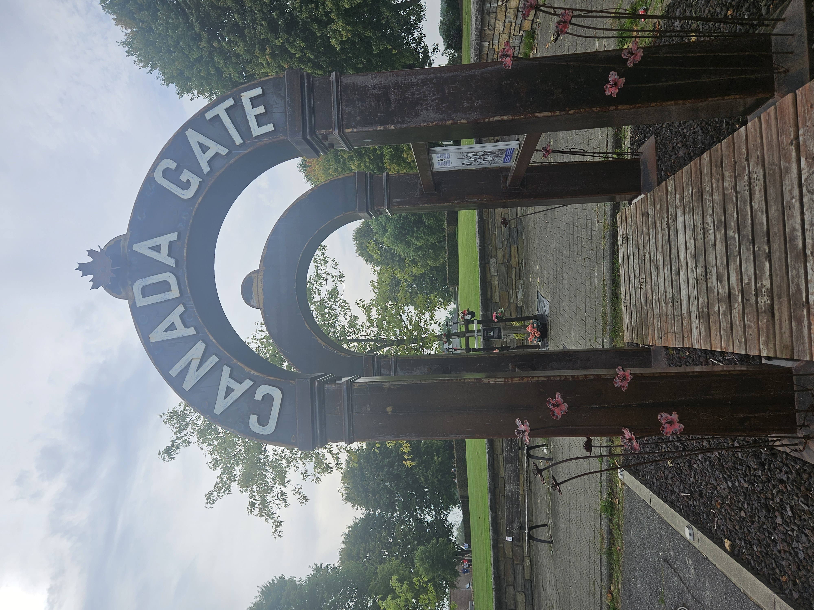

The campaign began at the end of July 1917. British, as well as Australian and New Zealand (ANZAC) forces, opened the attack with a pounding artillery barrage. Heavy rains came down the very night the ground assault was launched, however, and shell holes quickly filled with filthy water. The battlefield soon became peppered with countless flooded craters, all too often containing wounded and fallen soldiers. A heavy toll was taken on the attackers as they had to struggle through thick mud with little cover while German machine gunners in pill boxes (reinforced concrete machine gun positions) tore them to pieces. Despite these conditions, the Allied forces slowly gained much of the higher ground as the summer turned into fall. The main objectives of the offensive, however, remained out of reach.

Early in October 1917, the Canadians were sent to Belgium to relieve the battered ANZAC forces and take part in the final push to capture Passchendaele. Canadian Corps commander Lieutenant-General Arthur Currie inspected the terrain and was shocked at the conditions he saw. He tried to avoid having his men fight there but was overruled by his superiors. As at Vimy, the four divisions of the Canadian Corps would see action. However, the ubiquitous mud, flat terrain, and relative lack of preparation time and artillery support would make Passchendaele a far different battlefield than the one the Canadians had encountered at Vimy Ridge.

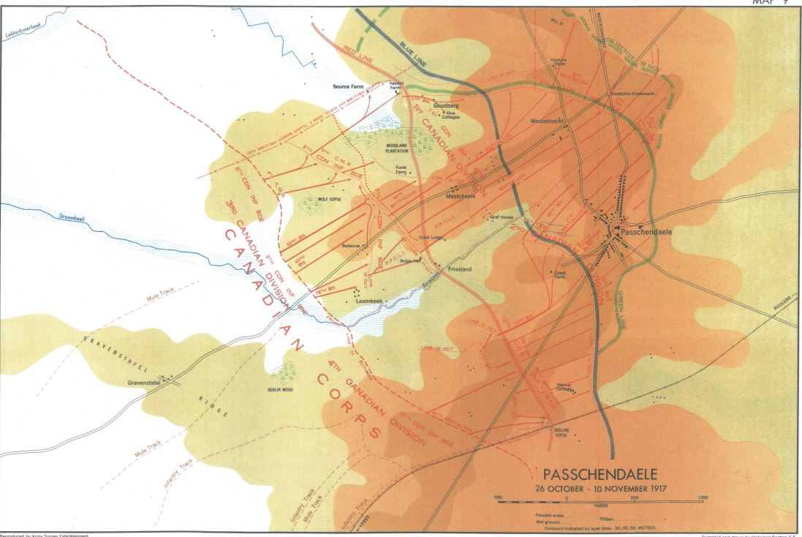

Before and after aerial photos of Passchendaele.

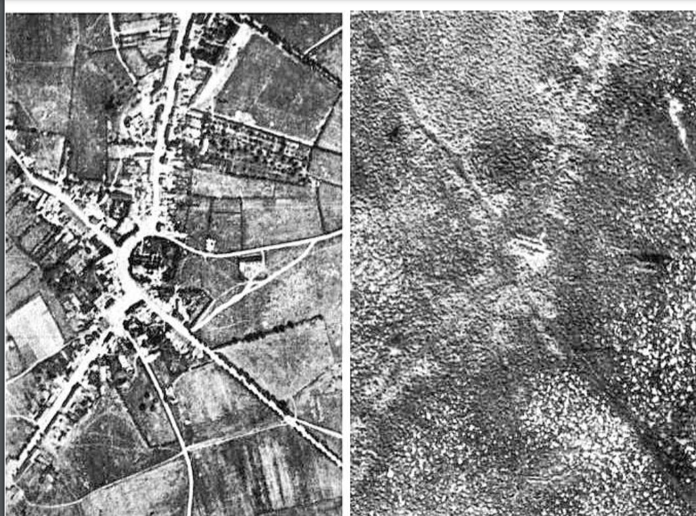

Currie took as much time as he could to carefully prepare and on October 26, the Canadian offensive began. Advancing through the mud and enemy fire was slow and there were heavy losses but our soldiers clawed their way forward. On an exposed battlefield like that one, success was often only made possible due to acts of great individual heroism to get past spots of particularly stiff enemy resistance. Despite the adversity, the Canadians reached the outskirts of Passchendaele by the end of a second attack on October 30 during a driving rainstorm.

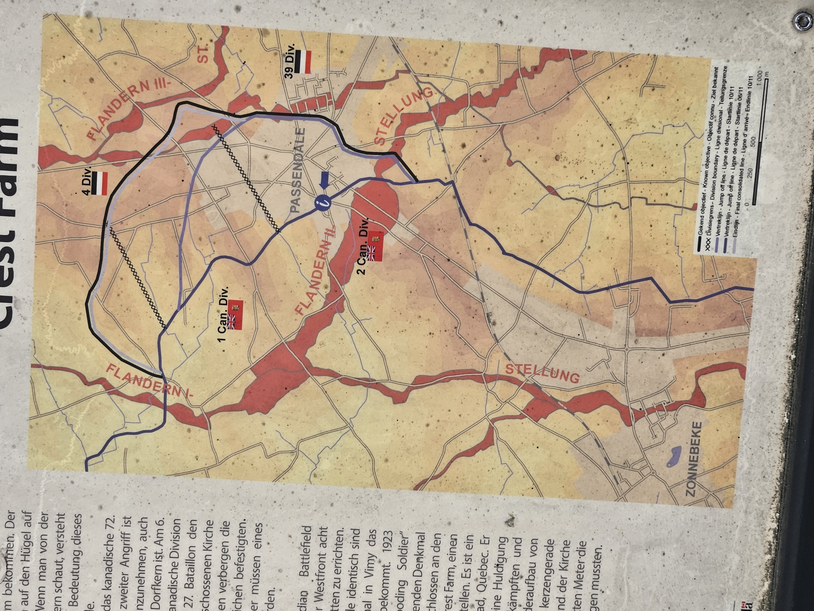

On November 6, the Canadians and British launched the assault to capture the ruined village of Passchendaele itself. In heavy fighting, the attack went according to plan. The task of actually capturing the “infamous” village fell to the 27th (City of Winnipeg) Battalion and they took it that day. After weathering fierce enemy counterattacks, the last phase of the battle saw the Canadians attack on November 10 and clear the Germans from the eastern edge of Passchendaele Ridge before the campaign finally ground to a halt. Canadian soldiers had succeeded in the face of almost unbelievable challenges.

Canada's great victory at Passchendaele came at a high price. More than 4,000 of our soldiers died in the fighting there and almost 12,000 were wounded. The some 100,000 members of the Canadian Corps who took part in the battle were among the over 650,000 men and women from our country who served in uniform during the First World War. Sadly, a total of more than 66,000 Canadians lost their lives in the conflict. The sacrifices and achievements of those who gave so much will never be forgotten.

The fighting at Passchendaele took great bravery. Nine Canadians earned the [Victoria Cross](https://www.veterans.gc.ca/eng/remembrance/medals-decorations/details/36) (the highest award for military valour that a Canadian could earn) there: Private Tommy Holmes, Captain Christopher O'Kelly, Sergeant George Mullin, Major George Pearkes, Private James Peter Robertson, Corporal Colin Barron, Private Cecil Kinross, Lieutenant Hugh McKenzie and Lieutenant Robert Shankland. Two of these men, McKenzie and Robertson, sadly lost their lives in the battle.

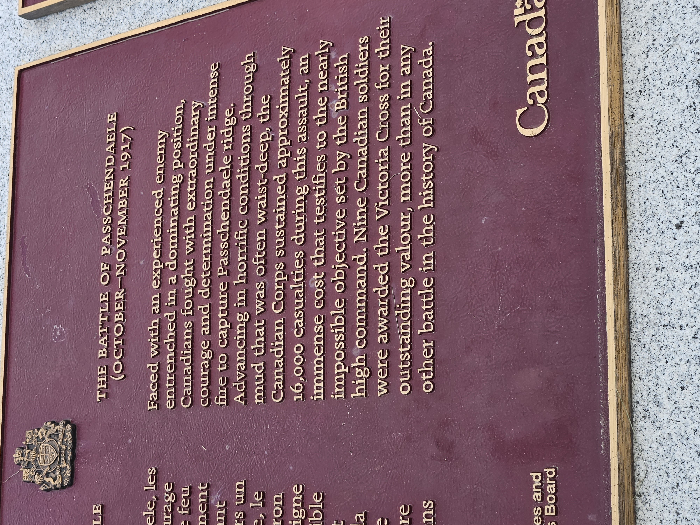

Our next stop was at Vancouver Corner, St Julien, home of the Brooding Soldier Memorial.

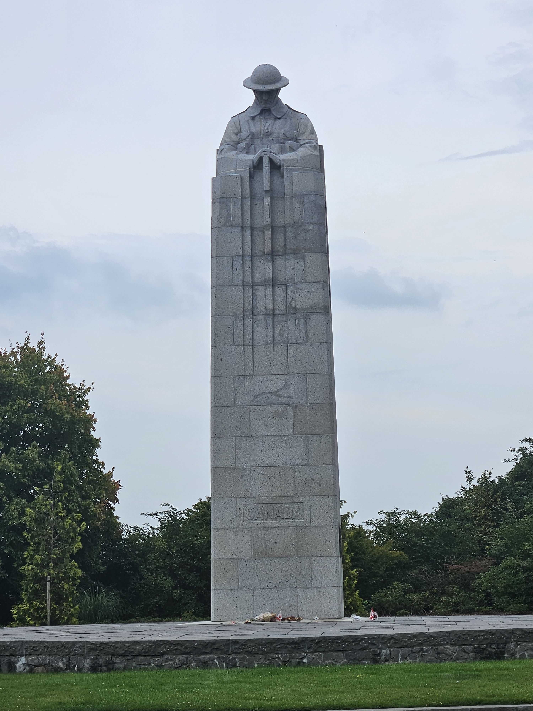

In the first week of April 1915, the Canadian troops were moved from their quiet sector to a bulge in the Allied line in front of the City of Ypres. This was the famed—or notorious—Ypres Salient, where the British and Allied line pushed into the German line in a concave bend. The Germans held the higher ground and were able to fire into the Allied trenches from the north, the south and the east. On the Canadian right were two British divisions, and on their left a French division, the 45th (Algerian).

Here on April 22, the Germans sought to remove the Salient by introducing a new weapon, poison gas. Following an intensive artillery bombardment, they released 160 tons of chlorine gas from cylinders dug into the forward edge of their trenches into a light northeast wind. As thick clouds of yellow-green chlorine drifted over their trenches the French defences crumbled, and the troops, completely bemused by this terrible weapon, died or broke and fled, leaving a gaping 6.5 kilometre hole in the Allied line.

German troops pressed forward, threatening to sweep behind the Canadian trenches and put 50,000 Canadian and British troops in deadly jeopardy. Fortunately the Germans had planned only a limited offensive and, without adequate reserves, were unable to exploit the gap the gas created. In any case their own troops, themselves without any adequate protection against gas, were highly suspicious of the new weapon. After advancing only 3.25 kilometres they stopped and dug in.

German troops pressed forward, threatening to sweep behind the Canadian trenches and put 50,000 Canadian and British troops in deadly jeopardy. Fortunately the Germans had planned only a limited offensive and, without adequate reserves, were unable to exploit the gap the gas created. In any case their own troops, themselves without any adequate protection against gas, were highly suspicious of the new weapon. After advancing only 3.25 kilometres they stopped and dug in.

The fierce battle of St. Julien lay ahead. On April 24, the Germans attacked in an attempt to obliterate the Salient once and for all. Another violent bombardment was followed by another gas attack in the same pattern as before. This time the target was the Canadian line. Here, through terrible fighting, withered with shrapnel and machine-gun fire, hampered by their issued Ross rifles which jammed, violently sick and gasping for air through soaked and muddy handkerchiefs, they held on until reinforcements arrived.

Thus, in their first major appearance on a European battlefield, the Canadians established a reputation as a formidable fighting force. Congratulatory messages were cabled to the Canadian Prime Minister. But the cost was high. In these 48 hours, 6,035 Canadians, one man in every three, became casualties of whom more than 2,000 died. They were heavy losses for Canada's little force whose men had been civilians only several months before—a grim forerunner of what was still to come.

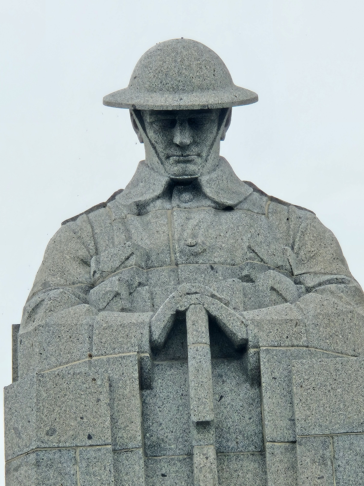

My Grandmother's cousin Ernest Goodfellow was in the 1st Battalion Suffolk Regiment, part of the British 28th Division that fought along side the Canadians. He was killed on 8 May 1915 when his unit was over-run. There will be a separate post on his war story.

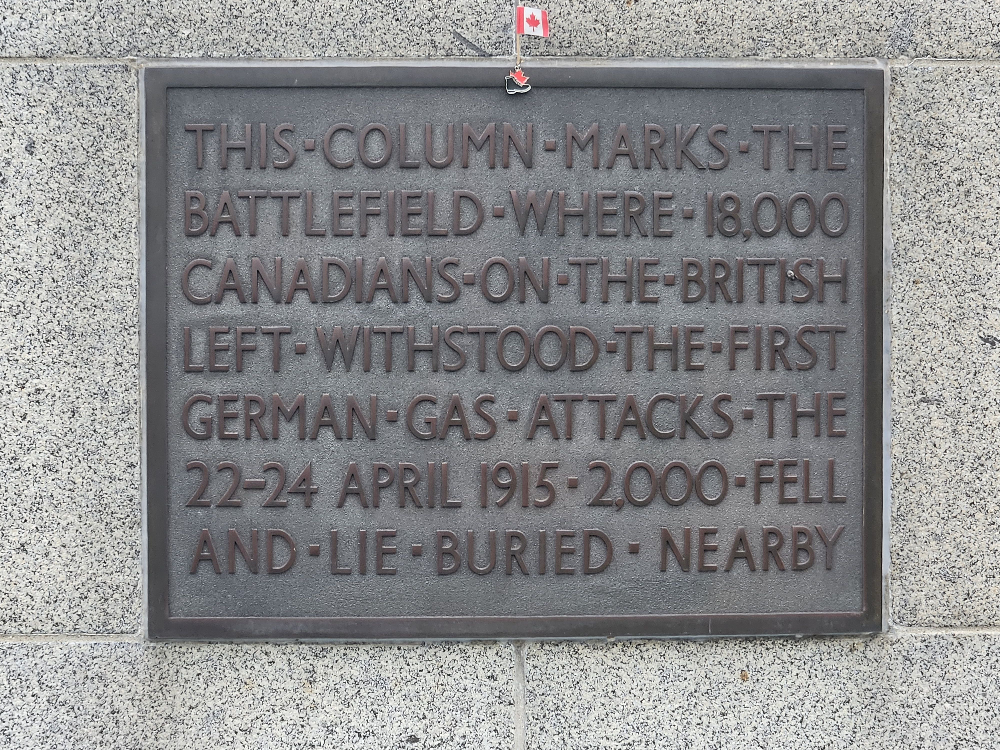

Our next stop Essex Farm Cemetery where Lt Col John McCrae, author of In Flanders Field ran a Casualty Clearing station out of an old Bunker.

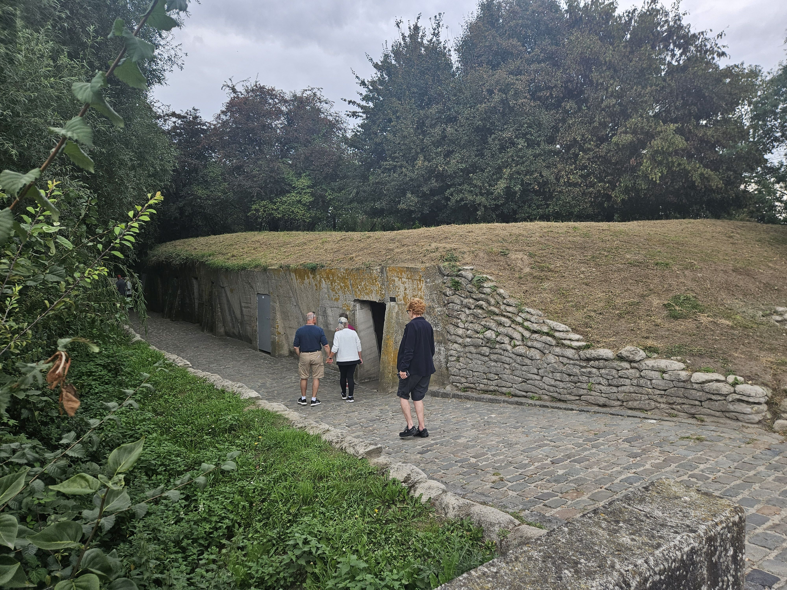

John McCrae had served in the Boer War, and later became a Doctor working in Montreal. When the First World War broke out, he enlisted and worked with the First Battalion.

The day before he wrote his famous poem, one of McCrae's closest friends was killed in the fighting and buried in a makeshift grave with a simple wooden cross. Wild poppies were already beginning to bloom between the crosses marking the many graves. Unable to help his friend or any of the others who had died, John McCrae gave them a voice through his poem. It was the second last poem he was to write.

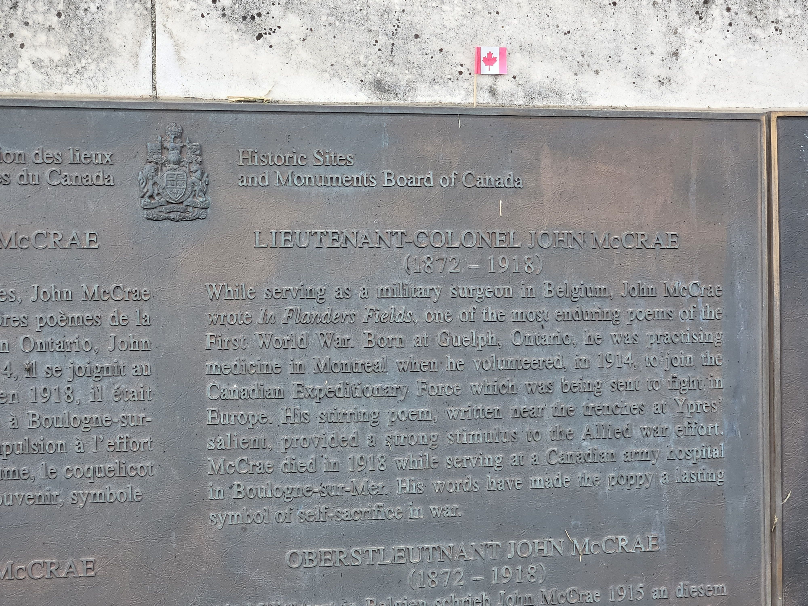

Our last stop was in Ypres proper, to attend the nightly Last Post Ceremony. The Menin Gate memorial is undergoing a 2 year renovation to be in top form for its centenary in 2027. The Last Post Ceremony has been running nightly since 1928, with the exception of the Second World War.

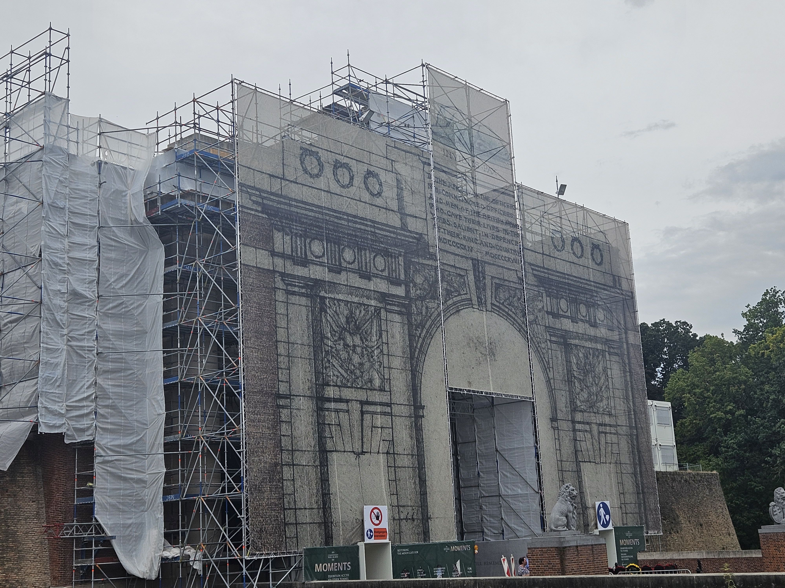

Menin Gate has almost 55,000 names of soldiers with no known grave. Normally the panels are visible inside the memorial, but with the construction the Commonwealth War Graves Commission has photographed all of the panels. Ernest Goodfellow is named on Panel 25 of the memorial, and I was able to get a photo of his name.

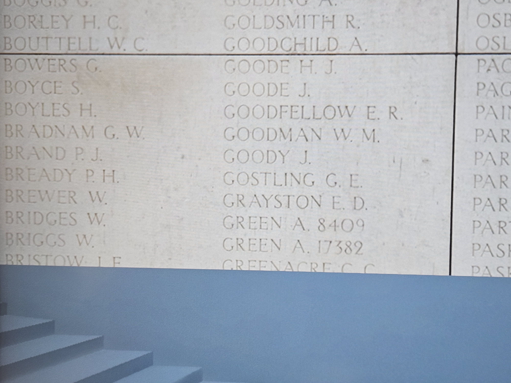

Although the memorial is under construction, the lego version of the Memorial is looking as grand as ever.

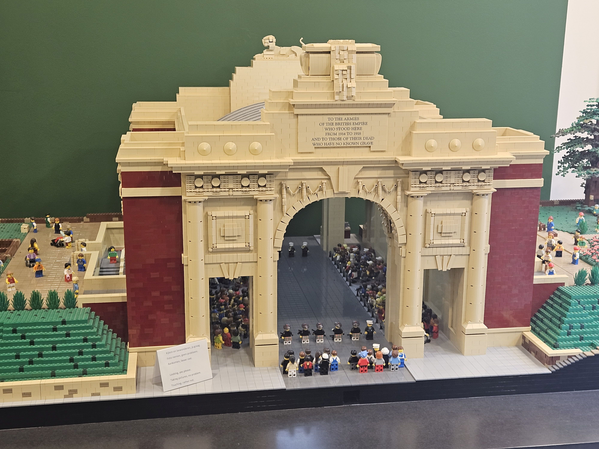

Volunteers run the ceremony, and nightly, organizations lay memorial wreaths. Our tour group always presents a wreath, and tonight we were represented by Mya, by 40 years or so, the youngest member of our tour group. Although she does not spell her name correctly, she harnessed the Maya Power, and represented our Canadian Group in fine fashion. I was standing beside Mya's Grandma, and can attest it is a very moving and emotional experience for all.

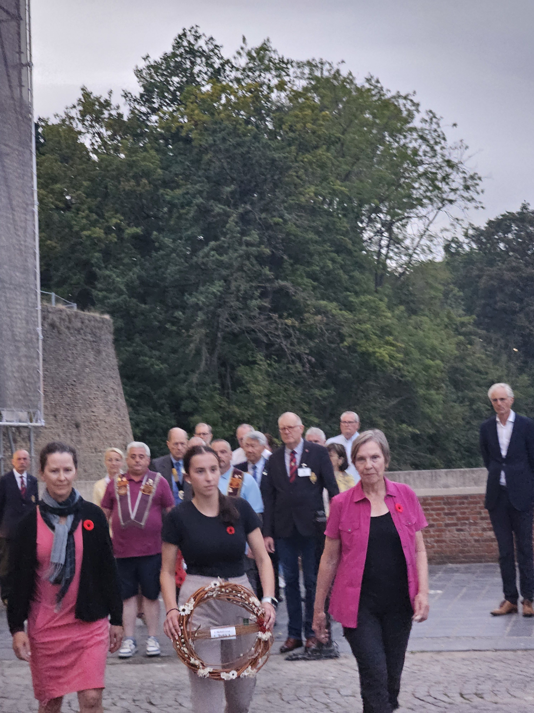

After the ceremony, a Belgian man asked me where I was from, and why I was there, and he too was very emotional about the ceremony, thanked me for attending, and worried that the current situation in Ukraine shows we haven't really learned anything.

* [First World War](https://www.paulsbattlefieldtours.com/blog/categories/first-world-war)
* [Family](https://www.paulsbattlefieldtours.com/blog/categories/family)
* [Battlefield Tours](https://www.paulsbattlefieldtours.com/blog/categories/battlefield-tours)