# JN954 Crash at Maastricht

* [pd-allen](https://www.paulsbattlefieldtours.com/profile/pd-allen/profile)
* Nov 30, 2024
* 17 min read

Updated: Feb 11, 2025

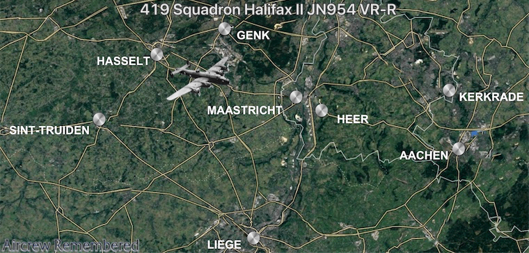

# Background

I was looking for something else and came across a number of RCAF aircrew who are buried in the Maastricht General Cemetery, very close to Rachel’s place in the Netherlands, my operating base for all of the battlefield tours I have been doing. Seven members of 419 Squadron, all killed on 28 April 1944 are all buried there. Coincidentally, 419 was the squadron I served in during my time in Cold Lake, Alberta back in the late 70s. A quick investigation showed they were all crew on JN954, a Halifax II bomber shot down during a raid of the railyards at Montzen, Belgium 15 km southeast of Maastricht. The squadron marking for this aircraft was VR-R, where VR indicates 419 Squadron, and R is the specific aircraft. There were typically 18 aircraft on squadron and when one was shot down, it was replaced with the same letter.

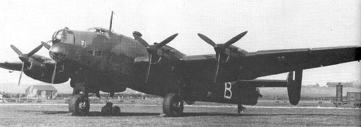

In preparation for the D-Day landings in early June, Bomber Command was tasked with disrupting the German supply routes. Part of this initiative was to destroy all rail facilities which could be used to transport troops, war material and fuel to the Normandy area of France and Belgium.

P/O McIvor and crew took off from Middleton St. George at 23:26 hours as part of a force consisting of 144 aircraft – 120 Halifaxes, 16 Lancasters and 8 Mosquitoes of 4, 6 and 8 Groups bound for the rail yards at Montzen. Diversionary operations over the North Sea were also mounted in an effort to confuse the Night Fighter controllers which had the effect of delaying the interception of the bomber stream by the night fighters until the bombing force had reached their target.

The bombing force, particularly the second of the 2 waves, was intercepted by German fighters and 14 Halifaxes and 1 Lancaster were shot down. Only one part of the railway yards was hit by the bombing. The controllers released the night fighters in a tactic known as “Zahme Sau” where twin engine fighters would infiltrate the bomber stream flying amongst the bombers and shooting down as many as possible. As a consequence of the diversionary tactic the Night fighters were late in arriving in the Montzen area such that the majority of bombers lost were part of the second wave. By coincidence, to the bomber streams peril, several aces had arrived at St.Trond the previous day and were in turn scrambled to intercept the bombers as they flew past on the return leg chasing them out over the North Sea.

In all 15 allied aircraft were lost from the 144 aircraft that comprised the Montzen raid. P/O McIvor and the crew of JN954 would be one of the early casualties. At 01:33 hours at a height of 3700 metres they were attacked and brought down by the Messerschmitt Bf110 G-4 of ace Oblt. Hans-Heinz Augenstein from 12./NJG1. The Halifax crashed at Heer, 4 kms E.S.E. of Maastricht in the Netherlands.

## Squadron Log Entries

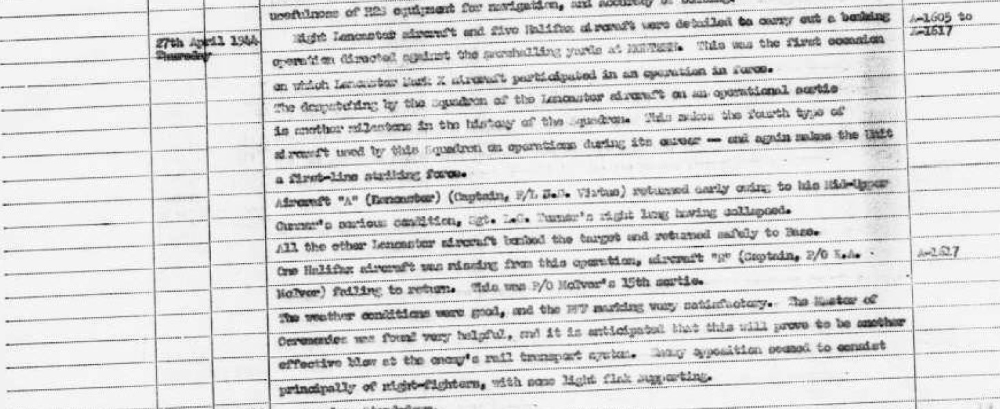

Transcript of Operational Comments.

*Eight Lancaster aircraft and five Halifax aircraft were detailed to carry out a bombing operation directed against the marshalling yards at Montzen. This was the first occasion on which Lancaster Mark X aircraft participated in an operation in force. The deployment by the squadron of the Lancaster aircraft on an operational sortie is another milestone in the history of the squadron. This makes the fourth type of aircraft used by this squadron on operation during its career – and again makes the Unit a first-line striking force.*

*Aircraft “A” Lancaster (Captain F/L Virtue) returned early owing to his Mid-Upper Gunner’s serious condition, Sgt Turner’s right lung having collapsed. All other Lancaster aircraft bombed the target and returned safely to Base.*

*One Halifax aircraft was missing from this operation, aircraft “R” (Capt P/O McIvor) failing to return.*

*The weather conditions were good, and the Pathfinder Force (PFF) marking very satisfactory. The Master of Ceremonies was found very helpful, and it is anticipated that this will prove to be another effective blow at the enemy’s rail transport system. Enemy disposition seemed to be principally of night-fighters, with some flak supporting.*

The excerpt from the Operational log from the day of the crash.

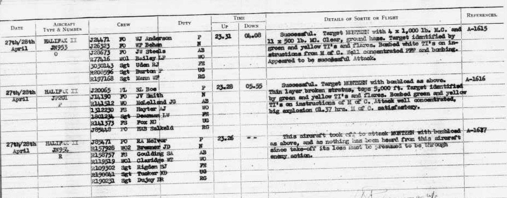

## The Crew

The crew consisted of the following Royal Canadian Air Force (RCAF) personnel:

·         Pilot                             Pilot Officer Roderick McIvor Age 24

·         Navigator                     Warrant Officer 2 John Bremner Age 20

·         Air Bomber                  Pilot Officer Stanley Goulding Age 21

·         Wireless Operator       Warrant Officer 1William Claridge Age 21

·         Flight Engineer            Sergeant Stanley Rigden Age 23

·         Mid/Upper Gunner     Pilot Officer Kenneth Tucker Age 20

·         Tail Gunner                  Pilot Officer Ronald Dujay Age 20

William Claridge was born in England and Stanley Rigden in Scotland. Both emigrated with their families in the 1920s.

The details of the are taken from this website: [Crew Listing](https://aircrewremembered.com/mcivor-roderick-austin.html).

### P/O Roderick Austin McIvor: Pilot Age 24:

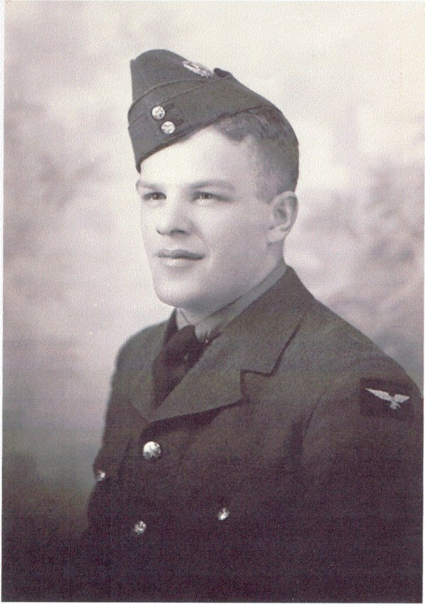

Educated at Sioux Lookout Continuation School, McIvor worked as a miner in the gold mines of northern Ontario before enlisting in Winnipeg on 30 December 1941. From No.2 Manning Depot, Winnipeg, he was posted to No.2 Initial Training School, Regina, Saskatchewan on 26 April 1942 and from there to No.2 Elementary Flying Training School, Fort William, (now Thunder Bay) Ontario on the 2 August 1942 training on DH Tiger Moths.

From there he was posted to No.10 Service Flying Training School, Dauphin, Manitoba on 29 September 1942. It was here that pilots had their first experience at flying multi engine aircraft training on Cessna Crane’s. Upon graduating with his pilot’s badge on 22 January 1943, he arrived at No.1 “Y” Depot, Halifax, Nova Scotia on 6 February 1943 to await embarkation to the UK. Arriving from New York on 18 March, he was stationed at No.3 PRC Bournemouth until 25 May when he was posted to No.11 Pilot Advanced Flying Unit at Shawbury, Shropshire for further training on Airspeed Oxford aircraft. Next, McIvor was posted to No.24 Operational Training Unit at Honeybourne, Worcestershire on 7 October to begin training on a heavy bomber, the Armstrong Whitworth Whitley.

Here, during a training flight, he was commended by his instructor for showing great presence of mind when he experienced engine failure on takeoff. From there he was posted to No.1659 Heavy Conversion Unit for training on the Handley Page Halifax heavy bomber in preparation for joining No.419 Squadron on 13 December 1943. Receiving his commission on 23 March 1944, P/O McIvor had completed 21 operational trips when he was lost.

### WO2 John Donald Bremner: Navigator Age 20

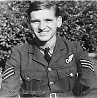

John Bremner enlisted in Vancouver on 30 March 1942. An eager recruit who had tried to enlist in the RCAF before the age of 18 enrolled in a course of Chemical Engineering at the University of British Columbia and joined the Canadian Officers Training Corps as an army cadet in 1941. He was finally accepted by the RCAF in March 1942 and sent to No.3 Manning Depot at Edmonton, Alberta for basic training. Although he had specified aircrew as either pilot or observer on his application, the medical staff recommended that in their view he was most suitable for further training as an Observer. From the Manning Depot, John spent the next 6 weeks at No.4 Service Flying Training School, Saskatoon, Saskatchewan joining No.7 Initial Training School also at Saskatoon, on 5 July 1942 spending 10 weeks there until 12 September. From there he was posted to No.2 Air Observers School at Edmonton where he gained his Air Navigators badge on 30 December 1942. After the customary 2 weeks pre-embarkation leave, Bremner arrived at “Y” Depot, Halifax on 15 January 1943 and embarked for the UK on 26 January arriving at No.3 PRC, Bournemouth on 5 February 1943. After attending courses attached to No.3 PRC, he was posted to No.3 Observers Advanced Flying Unit at Halfpenny Green, Staffordshire on 8 June 1943, prior to being sent to No.24 Operational Training Unit at Honeybourne from 25 July to 7 October 1943. From there he was posted to 61 Base headquartered at Topcliffe when he was then posted to 1659 Heavy Conversion Unit for training on Halifax heavy bombers on 20 October until he joined 419 Squadron on 14 December 1943.

### P/O Stanley Herbert Goulding: Air Bomber Age 21

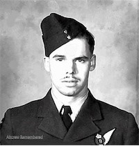

After leaving Blind River Continuation School in northern Ontario, Stanley came south looking for work which he found working odd jobs as a carrier and farm hand. After a period of unemployment, he enrolled in the RCAF Pre-entry Aircrew Education Course at the Ontario Teachers College in Hamilton. Upon completing the course with a pass mark, he enlisted in Hamilton on 14 March 1942. Stationed at No.1 Manning Depot, Toronto until 8 May when he was posted, as being a potential pilot, to No.1 Service Flying Training School at Camp Borden, Ontario until 16 August 1942. Unfortunately, he failed the course on navigation and was redirected to No. 4 Bombing and Gunnery School at Fingal, Ontario to train as an air bomber on 22 November 1942. Goulding was then posted to No.4 Air Observers School, London to complete his training gaining his Air Bombers badge on 2 April 1943. Posted to “Y” Depot, Halifax, he embarked for the UK on 26 May arriving at No.3 PRC, Bournemouth on 5 June. He then completed a four-week course at No.3 Observers Advanced Flying Unit at Halfpenny Green for bomb aimers from 16 June to 12 July before being posted to No.24 Operational Training Unit for training on Whitley bombers. From 24 OTU he was posted to 61 Base on 7 October and then to 1659 Heavy Conversion Unit on 20 October where he trained on Halifax aircraft until joining 419 Squadron on 13 December 1943. During the time that he was with 419 Squadron he completed 21 sorties against the enemy.

### WO1 William Thomas Claridge: Wireless Operator/Air Gunner Age 21

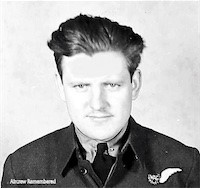

Born in Ashington, England, William immigrated to Canada with his parents in 1929. After completing high school at Sinclair, Manitoba he held various odd jobs before enlisting in Winnipeg on 18 July 1941 for training as a Wireless Operator. Following short stays at No.2 Manning Depot at Brandon and No. 10 Repair Depot, Calgary, He was posted to No.2 Wireless School at Calgary from 15 September 1941 to 23 May 1942 when he was awarded his Wireless Operators badge. Claridge was next posted to No.5 Bombing and Gunnery School, Defoe, Saskatchewan completing his gunnery course there on 26 June 1942 qualifying him as a Wireless Operator Air Gunner. He was then posted to No.3 Air Observers School initially at Regina and also at Pearce, Alberta when it moved there that September until 6 April 1943 when he was posted to “Y” Depot awaiting transport to the UK. Embarking on the 16 May he arrived at No.3 PRC, Bournemouth on 24 May 1943. Posted to No.4 Observers Advanced Flying Unit at RAF West Freugh, Scotland for a month’s refresher course on 15 June until 13 July 1943 prior to being posted to No.24 Operational Training Unit until 7 October that year. William next trained at 1659 Heavy Conversion Unit to familiarize himself with the Halifax bomber from 20 October to 14 December 1943 when he joined 419 Squadron.

### Sgt. Stanley James Rigden: Flight Engineer Age 23:

Stanley came to Canada from Scotland with his parents as an infant in 1921. After completing his Education at the Goldeye one room school, he took up farm work until he enrolled in an Air Frame Mechanics course at Calgary, Alberta in December 1940. Enlisting for RCAF ground crew duties in July 1941, he was posted to No.1 Manning Depot, Toronto and from there to No.1 Technical Training School at St. Thomas, Ontario on 1 August 1941. Posted to “Y” Depot, Halifax in January 1942, he arrived at No.3 PRC Bournemouth in the UK on the 21st  of that month where he was assigned to RCAF 410 Squadron at RAF Drem, East Lothian, Scotland on 1 February 1942. Attached to 3072 Service Echelon at Drem and Catterick training on Beaufighters until 16 June 1943 attaining the classification of Fitter 2 A. Remustering for aircrew he transferred to No.4 Technical Training School at St. Athan, Wales to train as a Flight Engineer on Halifax bombers. On completion of the course, he was awarded his Flight Engineers badge on 4 October 1943 with the rank of Sergeant. Stanley was then posted to 1659 Heavy Conversion Unit at Topcliffe, Yorkshire to gain actual flying experience completing 43 hours flown in daylight over 9 cross country trips and 25 hours flown at night on 4 cross countries. He was then posted to 419 Squadron on 13 December 1943. During his time in the UK he met and married Miss Elisabeth Wordley on 25 February 1944, spending 7 days leave together. Sadly, almost 8 weeks later to the day, Stanley would lose his life over the Netherlands.

### P/O Kenneth David Tucker: Mid/Upper Gunner Age 20

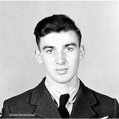

After graduating from East Amherst School in 1940, Kenneth took a job as a clerk at Robbs Engineering Works Ltd., until he enlisted at Moncton on 31 August 1942. Upon completion of basic training at No.5 Manning Depot, Lachine, Quebec he was posted to No.16 Service Flying Training School at Hagersvile, Ontario on 7 November 1942 until 21 February 1943. In order to bring his educational standing up to the requirement for RCAF aircrew as an air gunner, Kenneth was sent to No.23 Pre-Aircrew Education Detachment at the University of Toronto which he completed on 2 April 1943. From there he was posted to No.2 Air Gunners Ground Training School at Trenton, Ontario until 15 May 1943 completing his Canadian training on 9 July 1943 at No.3 Bombing and Gunnery School at MacDonald, Manitoba. Taken on strength of “Y” Depot he embarked for the UK on 16 July arriving at No.3 PRC on 23 July following which he was posted to No.24 Operational Training Unit on 10 August. After two months there he was posted to 61 Base awaiting his posting to No.1659 Heavy Conversion Unit on 20 October until he joined 419 Squadron on 13 December 1943. Kenneth David Tucker was participating in his 19th  sortie when lost.

### P/O Edmund Ronald Dujay: Tail Gunner Age 20

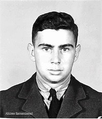

Edmund was born in the coal mining community of Joggins Mines, Nova Scotia. Schooled in Joggins and completing his Grade 10 he found work as a clerk for Messrs Landry & Comeau prior to enlisting in the RCAF in Moncton on 14 October 1942. After completing his basic training at No.5 Manning Depot at Lachine, Quebec he was posted to No.8 Service Flying Training School at Moncton on 27 November 1942. On 4 April 1943 he was posted to No.1 Air Gunners Ground Training School at Quebec City until the 16 of May when he was posted to No.9 Bombing and Gunnery School, Mount Joli, Quebec graduating with his Air Gunners badge on 26 June 1943. On 10 July, he was posted to “Y” Depot Halifax and embarked for the UK on 16 July arriving at No.3 PRC on the 23 July 1943. Soon after, on the 3 August, he was posted to No.24 Operational Training Unit until 7 October when he was posted to 61 Base and then to 1659 Heavy Conversion Unit on 20 October 1943. He joined 419 Squadron on 13 December 1943 and flew 20 operations before he was lost.

## Oblt. Hans Heinz Augenstein:

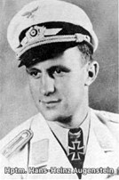

Oblt. Augenstein was a German night fighter ace who is credited with shooting down 46 allied aircraft before he and his Radio Operator Gunther Steins were killed when they were shot down over Münster-Handorf by a Mosquito night fighter flown by Sq/Ldr. Edward Hedgecoe, DFC+Bar and his Navigator F/O. Norman Bamford, DFC+Bar. His Air Gunner Uzz. Kurt Schmidt baled out unhurt. All of his kills were 4 engine bombers, shot down at night.

## Posthumous promotions

In looking at RCAF aircrew, I noticed that frequently the rank in their personnel records and on their headstone was higher than the rank listed in the Operational Logs the day the aircrew member was killed. In this crash, P/O Stanley Goulding, P/O Kenneth Tucker and P/O Edmund Dujay were listed as Flight Sergeant, Sergeant and Sergeant respectively in the 27/28 Apr Flight Logs. In WW2, when an airman was promoted to Officer status, he was formally released from the Air Force then taken back on as an Officer with a new Service Number. This usually occurred during training as all Air Force Members are taken in as other ranks, then potentially promoted as they receive their aircrew qualifications.

In the case of our three aircrew, they are all listed as being promoted on 26 Apr 1944, the day before the crash, and their service number changed on all of their documents in the service file. I hadn’t read anything about this previously, so I did a bit of digging.

The Royal Canadian Air Force (RCAF) has a history of posthumously promoting aircrew who were killed in action. This practice honors their service and sacrifice. For example, during World War II, many aircrew members who lost their lives were promoted posthumously, recognizing their bravery and contributions to the war effort. The criteria for posthumous promotions in military forces, including the Royal Canadian Air Force (RCAF), generally include several key factors:

1. **Service Record**: The individual must have a commendable service record, often including recommendations for promotion prior to their death.
2. **Circumstances of Death**: Promotions are typically granted to those who died in combat or under heroic circumstances, reflecting their bravery and contributions.
3. **Eligibility for Promotion**: The deceased must have met the qualifications for the rank they are being promoted to at the time of their death. This includes having the necessary time in service and any required training or qualifications.
4. **Recommendations**: Often, a formal recommendation for promotion is required from commanding officers or peers, highlighting the individual's merit and contributions.
5. **Regulatory Framework**: Each military branch has specific regulations governing posthumous promotions.

These criteria ensure that posthumous promotions are reserved for those who have demonstrated exceptional service and sacrifice. This of course begs the question, what about the other four crew members?

P/O McIvor had recently been promoted, 23 March 1944, so was not eligible for promotion. WO1 Claridge had been promoted on 08 December 1943. WO2 Bremner had also been recently promoted, 30 December 1943. Sgt Rigden had been promoted to Tech Sergeant when he completed his flight Engineer certification on 04 Oct 1943.

# Training

## British Commonwealth Air Training Plan (BCATP)

The British Commonwealth Air Training Plan (BCATP), was a large-scale multinational military aircrew training program created by the United Kingdom, Canada, Australia and New Zealand during the Second World War. The BCATP remains one of the single largest aviation training programs in history and was responsible for training nearly half the pilots, navigators, bomb aimers, air gunners, wireless operators and flight engineers who served with the Royal Air Force (RAF), Royal Navy Fleet Air Arm (FAA), Royal Australian Air Force (RAAF), Royal Canadian Air Force (RCAF) and Royal New Zealand Air Force (RNZAF) during the war. Canada was chosen as the primary location for the BCATP’s training operation and is considered by many to be the most important Canadian Contribution to the war effort.

At the plan's peak of activity in late 1943, the BCATP comprised over 100,000 administrative personnel operating 107 schools and 184 other supporting units at 231 locations all across Canada. At the conclusion of the war, over 167,000 students, including over 50,000 pilots, had trained in Canada under the program from May 1940 to March 1945. While the majority of those who successfully completed the program went on to serve in the RAF, over half (72,835) of the 131,553 graduates were Canadians.

## Crew Training

I had traced a few RCAF aircrew through the BCATP process and wanted to look at the training cycle for an entire crew. All of the crew went through their individual training in Canada and then were posted to the UK. At Number 24 Operational Training Unit (OTU) at RAF Honeybourne, south of Birmingham, the crew trained on twin engine Whitley Bombers.

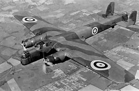

The aircrew typically spent about 2 months at 24 OTU, and flew between 80 and 100 hours, roughly split between day and night. Early on in the training, they were assigned to specific crews. This assignment was done among the crews themselves, typically the pilots would sit down with a cup of tea and a cigarette, and chat with the other crew members, and mutually decide on the crew composition.

A description of the Crewing Up process taken from “Above Us, The Stars – 10 Squadron Bomber Command”:

*“Crewing up,” the process by which the Bomber Command trainees were divided up into individual crews, ready to complete the final part of their training before being sent on to operational units, was not an exact science. More often than not, the men would be told to report to the mess hall or even a hangar and divide themselves up into crews, without any official interference. This meant that men who had flown well together during training naturally gravitated towards each other, while those who hadn’t got on could look for crews to whom they were better suited. Of course, there was always the fear that, like the school football team, you would be the last to be picked, but there was frequently a crew who would be one man short, so gaps were easily filled.*

*Tom Davidson, a Halifax flight engineer with 466 Squadron, told me how, on arrival at RAF Acaster Malbis, the pilots were all standing in the doorway of the mess watching all the other crewmen come in, eyeing up their potential crew members. Tom spotted one chap, a young Australian pilot. He recalls thinking, I hope this fella picks me!*

*He immediately made eye contact; the pilot came straight over and introduced himself as Pat McGillis, and asked Tom to be his engineer. Pat was just nineteen. In that moment a friendship was made that would last for seventy years.*

*Jack, always so shy and quiet, was concerned that he wouldn’t be good enough, that no pilot would want him on his aircraft. As he walked into the hangar back at Honeybourne, he wondered if he was bold enough to wander up to a pilot and ask to join his crew. All the airmen were given cups of tea on arrival, and wandering through the throng, teacup and saucer in hand, he rehearsed in his head a little speech he had made up. In the corner of the hangar, he spotted Pennicott deep in conversation with Roy Tann, and one of the bomb aimers he’d flown with a couple of times, Londoner Ken Cox, a quiet, anxious sort of lad who had originally trained as a navigator. Pennicott looked up and began beckoning furiously to Jack.*

*“Where’ve you been, Jack? Thought I was going to have to find myself another WOP!” he exclaimed as Jack breathed a sigh of relief and joined the little huddle. Roy grinned at him. “Come on, Jack, you’re officially one of Penny’s Prangers now!”*

*Just then rear gunner Bill Bradshaw, a nineteen-year-old Ulster farm boy with film-star good looks and a ready smile, from Newcastle in County Down, appeared and nervously tapped Pennicott on the shoulder. He was welcomed into the group immediately. The Pennicott crew was almost complete.*

I found it fascinating that a seemingly random process determined who you would live and die with until you completed your 30 operational missions. The crew was created at the OTU, except for the Flight Engineer who joined at the Heavy Conversion Unit (HCU) where the crew trained on the aircraft they would be flying operationally.

## Training Timelines

I mapped out the timelines for the seven crew members. I was surprised to see that the longest timeline was that of the Wireless Operator/Air Gunner as they took communications training, Air Gunnery training and then the Air Observer course before going overseas. The Flight Engineer originally trained as an Aircraft Maintenance technician, then remustered to Flight Engineer. The position of Flight Engineer was introduced in 1941 to assist the single pilot in the flying of the large multi-engine aircraft that had become too complex for a single pilot to operate. Due to the technical role of the position, most Flight Engineers had a maintenance background.

Except for the Air Gunners, it took almost 2 years before the remainder of the crew made it to their operation squadrons. Since almost half of the Bomber Command crews became casualties, 55,673 killed out of a total of 125,000 aircrew the necessity of the massive BCATP becomes evident.

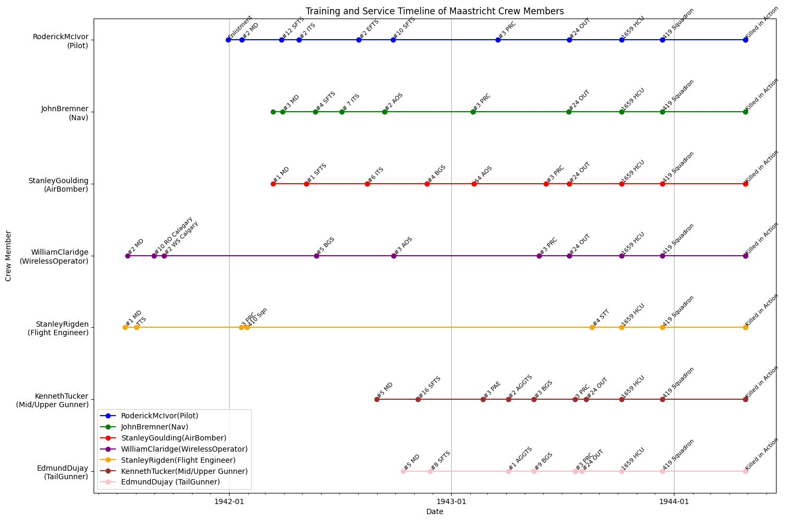

# Crew Flights

The crew arrived on 419 squadron 13 December 1943 and started flights in January 1944. The Halifax II would soon be replaced by the Lancaster X, so many of the crew flights were minelaying called “Gardening” as those were considered secondary missions. The Cross indicates where the plane JN954 crashed just after 0130 28 April 1944 in Heer, a suburb of Maastricht. The target for that night was the rail yards in Montzen, Belgium south-east of the crash site.

An [Interactive Map](https://pd-allen.github.io/docs/JN954.html) is available with details of each mission. Click on the markers to get details.

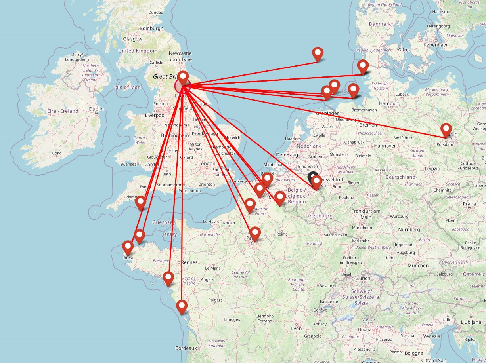

# 419 Squadron

For this period of the war, 419 Squadron Operated out of RAF Mindenhall St George located about 80 miles north-east of London.

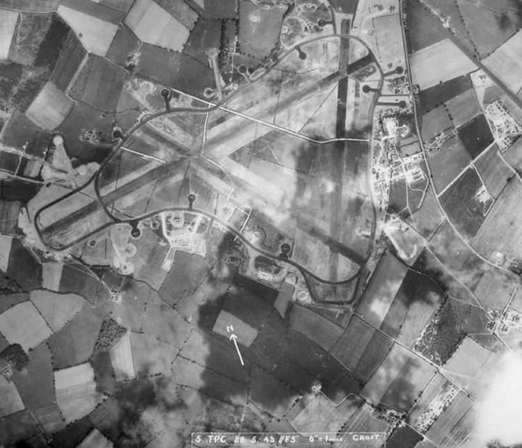

The squadron converted to Lancaster’s in April 1944. The crash of JN954 occurred during the final squadron flight of the Halifax II. Halifaxes on the flight line.

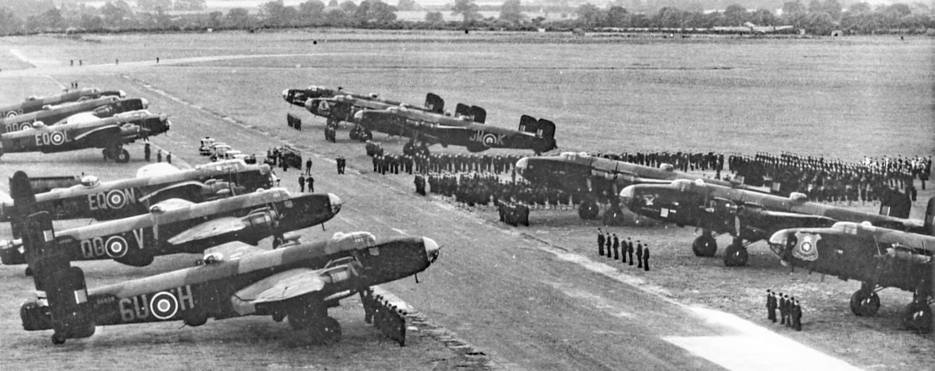

419 Squadron flew the most sorties and suffered the highest number of casualties in the RCAF No 6 Group.

|  |  |  |  |
| --- | --- | --- | --- |
|  |  |  | Operational Sorties and Losses |
|  | Total Sorties Flown | Aircraft Lost | Percent |
| Wellington | 648 | 24 | 3.70 |
| Halifax | 1616 | 66 | 4.10 |
| Lancaster | 2029 | 39 | 1.90 |
| Totals | 4293 | 129 | 3.00 |

Lancaster Mk X. This aircraft has the same designation VR-R as the crashed Halifax.

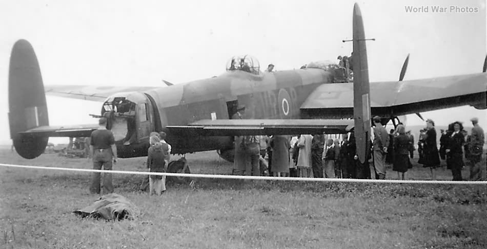

# Other Crashes

15 Halifaxes and 1 Lancaster were lost during this flight 27/28 April. In addition to the entire crew of JN954, there are partial crews from two other aircraft lost that night that are buried in the Maastricht Cemetery.

## 51 Sqn Halifax III LW479

4 Burials

|  |  |  |  |  |
| --- | --- | --- | --- | --- |
| Last Name | First Name | Age | Date of Death | Rank |
| CLARK | WILLIAM GEORGE | 23 | 28/04/1944 | Flight Sergeant |
| McGLYNN | JOHN |  | 28/04/1944 | Sergeant |
| McQUATER | JOHN |  | 28/04/1944 | Sergeant |
| ROTHWELL | LEWIS | 23 | 28/04/1944 | Flight Lieutenant DFC |

## 434 Sqn     Halifax V LL243

<https://www.tracesofwar.com/sights/13789/Achtergrondartikelen-van-Monument-Royal-Canadian-Airforce-Halifax-LL243.htm>

4 Killed

|  |  |  |  |  |
| --- | --- | --- | --- | --- |
| Last Name | First Name | Age | Date of Death | Rank |
| COWNDEN | VINCENT JOSEPH |  | 28/04/1944 | Pilot Officer |
| MAFFRE | GERALD FREDERICK | 23 | 28/04/1944 | Flight Lieutenant |
| MEEK | ROBERT ALEXANDER |  | 28/04/1944 | Flight Sergeant |
| SNOW | GRENFELL WILLIAM | 23 | 28/04/1944 | Pilot Officer |

Of the three surviving crew members, two successfully evaded capture and one became PoW. One of the evaders was helped by the Belgian Resistance and other by the Dutch. There is a marker at the crash site.

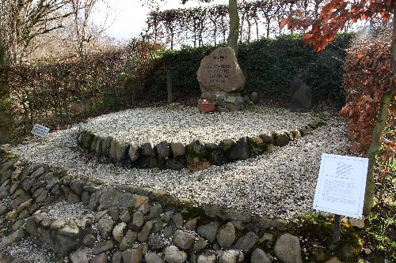

Maastricht Cemetery

The crew headstones are not all side by side but are in close proximity to each other.

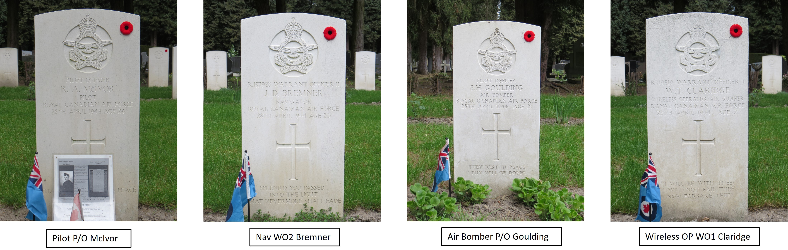

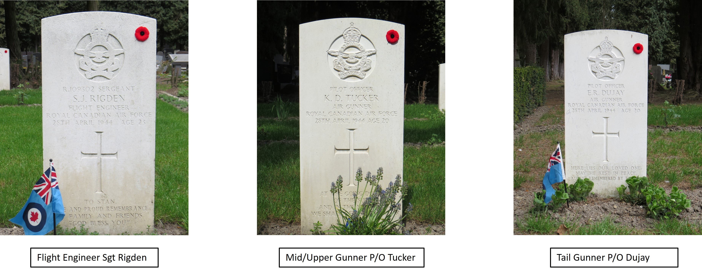

The ages of this crew really struck me. The oldest was 24, and three of the crew were just 20. Stanley Rigden was married for only 8 weeks before he was killed and the rest were all single. These are only seven of the more than 10,400 Canadian Bomber Command Aircrew and more than 55,000 Bomber Command Aircrew in total who were lost in the war, but you can’t help but to stop and wonder what could have happened if these brave young men had survived the war.

* [Second World War](https://www.paulsbattlefieldtours.com/blog/categories/second-world-war)