# John Scholte and The Dutch Princess Irene Brigade

* [pd-allen](https://www.paulsbattlefieldtours.com/profile/pd-allen/profile)
* Jun 8
* 12 min read

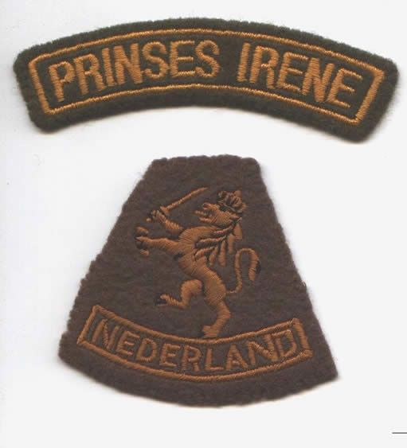

My good friend Sandy Cyr’s grandfather Jan (John) Scholte served in the Dutch Princess Irene Brigade in WW2. The Irenes briefly served under the Second Canadian Corps so I took a look at their actions. Sandy was able to get John’s service records from the Dutch Army and Google Translate helped trace his story.

During a recent long weekend, Rachel and I visited a number of museums in the Netherlands and took the opportunity to visit a few memorials to the Princess Irene Brigade.

# John Scholte

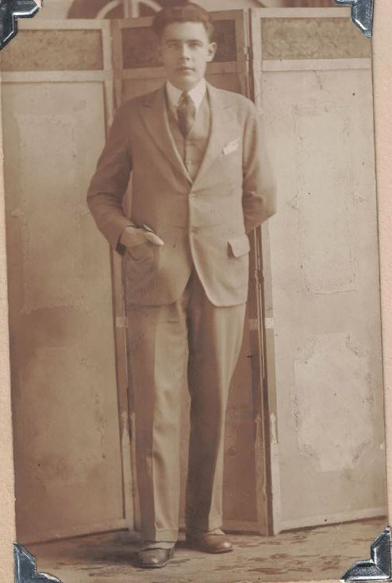

John Scholte, born March 29, 1907, Hillegom, the Netherlands to Leendert Scholte and Pieternella Bogerman.

John left home at 18 to break out on his own and create his own adventure in a new country. He sailed from Liverpool on the SS Montclare on 24 April 1925, arrived in Quebec City on 02 May 1925.

He married a Dutch girl who had also emigrated to Canada, Anna Van Marsbergen, born on 08 January 1912 in Haarlem, Netherlands to Machiel and Anna Van Marsbergen on 24 Jun 1933 in Toronto. A photo of Anna at age 20, not long before she was married.

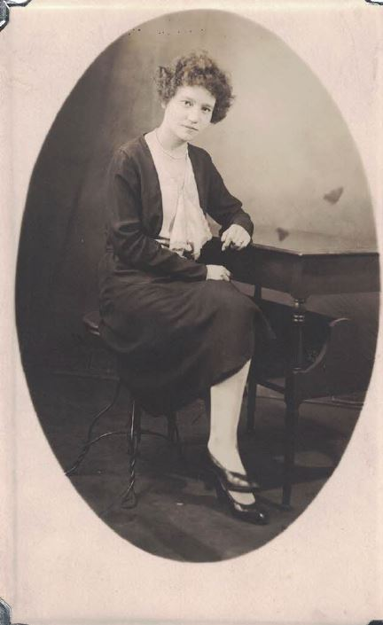

Their Wedding Photo.

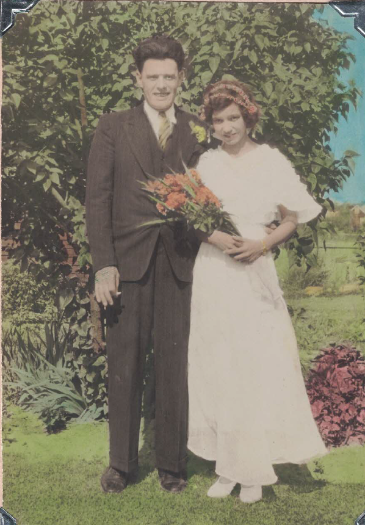

John and Anna had a daughter, Nellie (Sandy’s mother), born 20 May 1936, and a son Michael born in November 1939.

The family picture John took with him to Curacao.

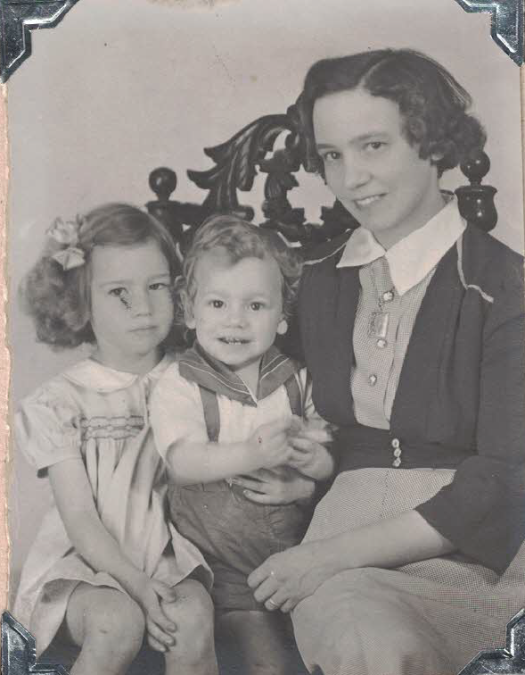

Following the occupation of the Netherlands in May 1940, about 1,500 soldiers escaped to England and formed the Royal Netherlands Motorized Infantry Brigade. In the fall of 1940 the Dutch Government enacted conscription for all overseas males born from 1904 to 1920. On 11 Feb 1941, Queen Wilhelmina authorized the brigade to be renamed Princess Irene Brigade after her youngest daughter Irene, born 05 August 1939, just before the start of the war as a living symbol of the Netherland’s future.

## Enlistment

A photo of John and Anna after John had enlisted.

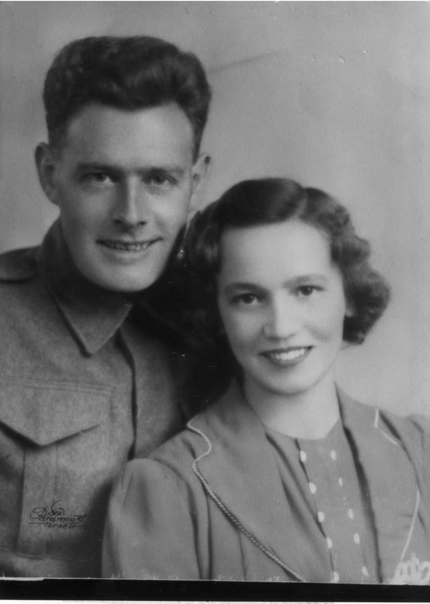

## Stratford

John enlisted on 19 March 1941, just before his 34th birthday, and was part of the second Dutch Contingent. The Dutch Canadians conducted basic training in Stratford, Ontario at a former Furniture Factory.  He was likely in 2nd Platoon. A total of 508 Dutch Canadians were conscripted throughout the war.

The Statue of the Wounded Bird commemorated the Dutch military in Stratford.

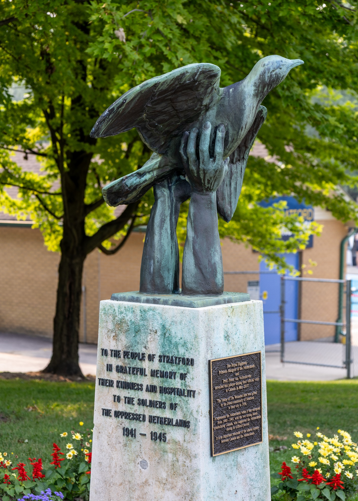

## England

The Second Contingent shipped out of Halifax on 17 June 1941 as part of Convoy HX-133 and landed in Liverpool, England on 02 July 1941. The convoy was spotted by a U-Boat off the coast of Greenland, and a Wolfpack summoned to attack the convoy. A total of six ships were sunk by U-boats. The Dutch ship the Maasdam was among the casualties. The Maasdam carried 17 American Red Cross Nurses enroute to work in a Hospital in Wiltshire. Two nurses drowned but the remainder were rescued and went on to England.

The Dutch Brigade was located at Wolverhampton on the estate of Lord Wrottesley. The camp remained in use until a few years after the war, mainly for the training of Dutch troops destined for the Dutch East Indies.

## Netherland Antilles and Suriname

In September 1941, John was a member156 Dutch soldiers were sent to the Netherland Antilles (principally Curacao and Aruba) and Suriname. At the time the largest oil refinery in the world was on Curacao and provided 90% of the fuel for the RAF Aircraft, so some members guarded the Oil Refineries. Other personnel were sent to Suriname to train Surinamese soldiers, guard Axis prisoners of war and provide security details on the shipments of Bauxite, essential for the manufacturing of aluminium for aircraft.

John was sent over as a Machine Operator but transferred to the Anti-Tank Platoon in May 1942. There was a need for officers and non-commissioned officers in the heavy weapons platoon (mortars, anti-aircraft, anti-tank weapons) so about 30 men were trained. John was promoted to Corporal in July 1942 and Sergeant of the Anti-tank platoon on 31 August 1942. The Irenes returned to England in December 1943.

On his way back to England, John was granted two weeks leave to visit his family in Toronto.

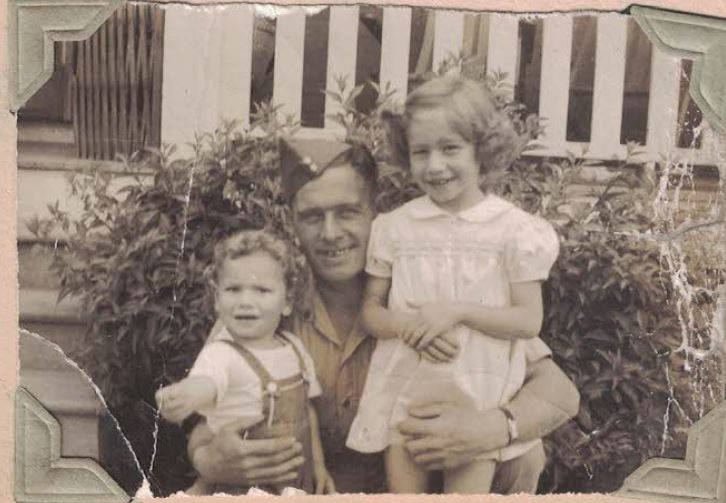

# Normandy

On 03 August 1944 the Princess Irene Brigade headed to the London docks for the transfer to Normandy. The brigade consisted of approximately 1,200 soldiers. The brigade was motorized, so they were delivered with all of their vehicles. The bulk of the brigade landed at the Mulberry Harbour in Arromanches and drove off the docks.

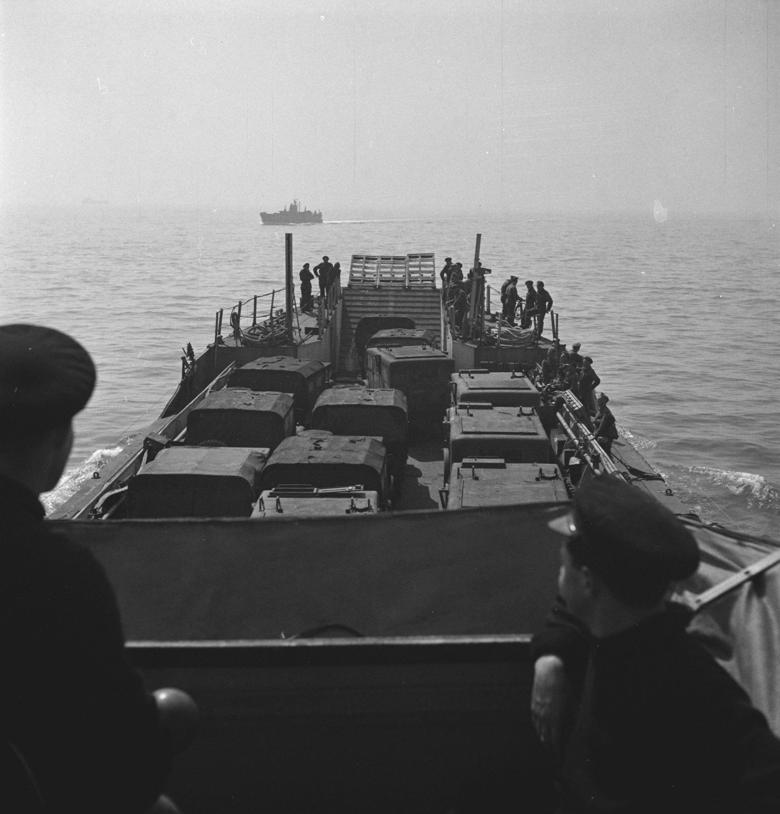

The remainder of the brigade landed at Graye-sur-Mer (Juno Beach) and drove directly onto the beach. The brigade was in place on 08 Aug. The Irenes were attached to the 6th British Airborne Division for the month of August. They reported to the 1st Canadian Army

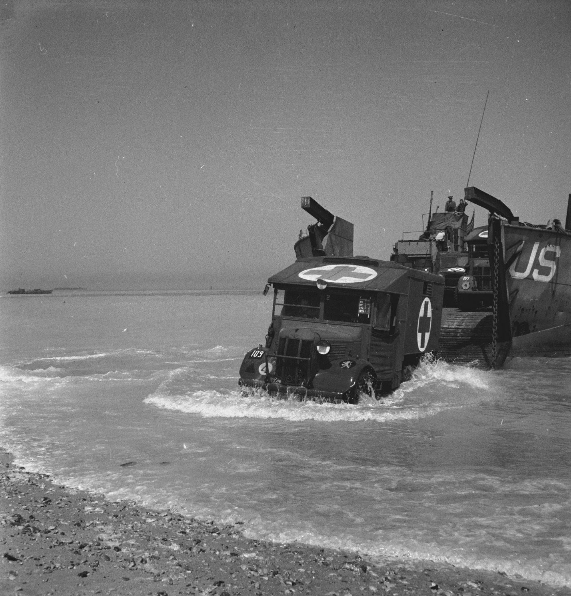

## Princess Irene Brigade Route

The Irenes fought their way from Normandy, through Belgium and finally into their homeland.

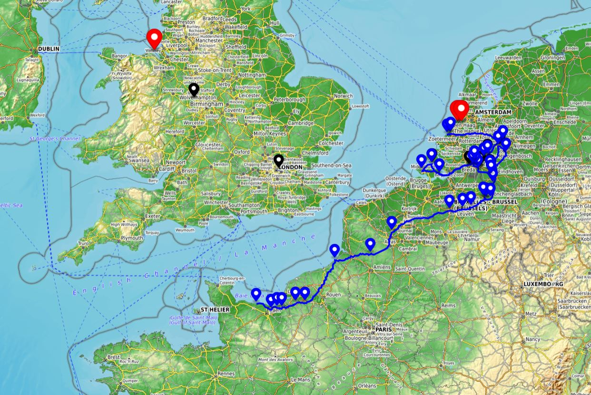

An interactive version of their route is shown [here](https://pd-allen.github.io/docs/html/PrincessIreneBrigade.html).

## St Come

On 13 August the Irenes moved up to the Breville Ridge to replace units that had been fighting since D-Day. This was a hazardous position known as Hellfire Corner and the Germans were less than 250m away so the Allies were under constant surveillance and shelling.  The Irenes Headquarters was in an outbuilding of the devastated Chateau St Come.

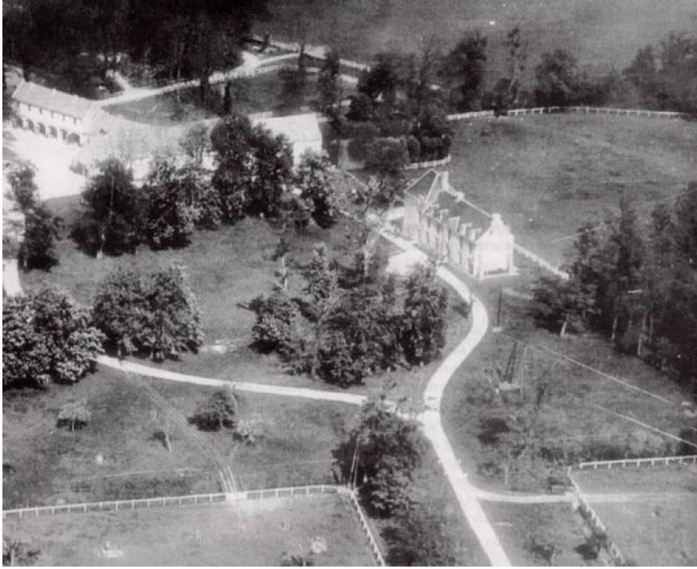

The brigade suffered a number of casualties from the constant harassing fire. A plaque to the unit at the entrance to Chateau St Come marks their first foray into combat.

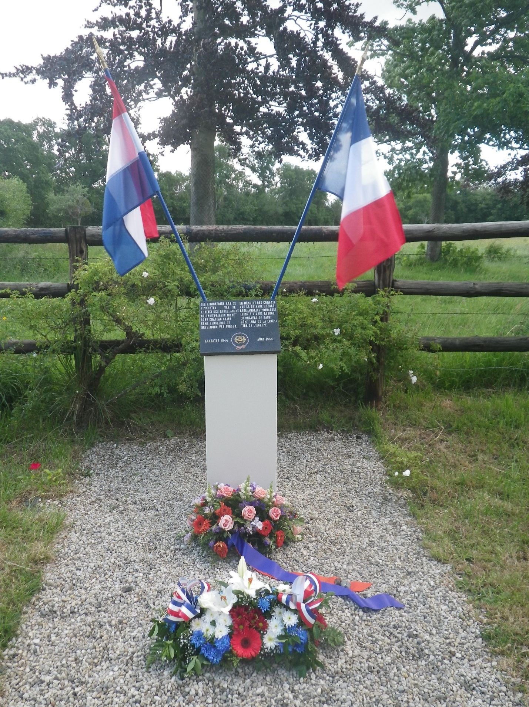

## Pont Audemer

On 26 August, the Irenes came under the command of the 5th Parachute Brigade and were ordered to capture the lone remaining bridge at Pont Audemer that the Germans were using to flee north. Since the remaining bridges had been blown, the Irenes hitched a ride with the Belgian Piron Brigade. By the time they got to the bridge it had been blown as well, so the Irenes crossed on a temporary footbridge.

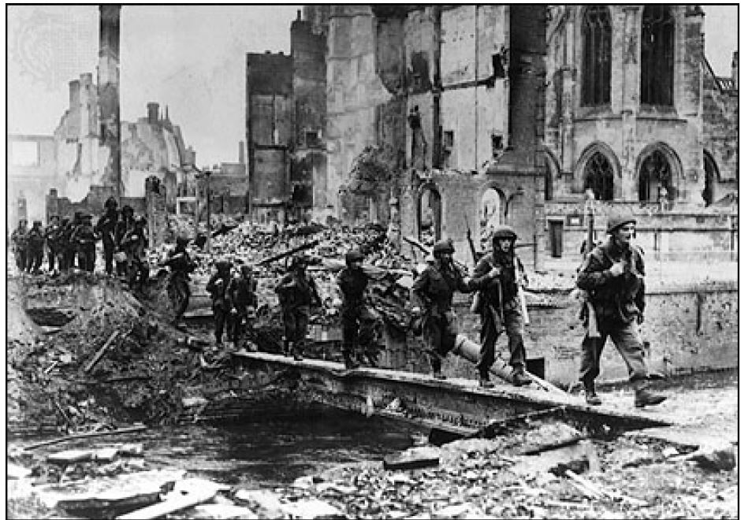

The Germans retreated to the high ground and after a brief skirmish, the Irenes occupied the town of Pont Audemer, the first city liberated by the Dutch brigade.

The Irenes spent several days patrolling the Seine before moving through Belgium, getting closer to their homeland.

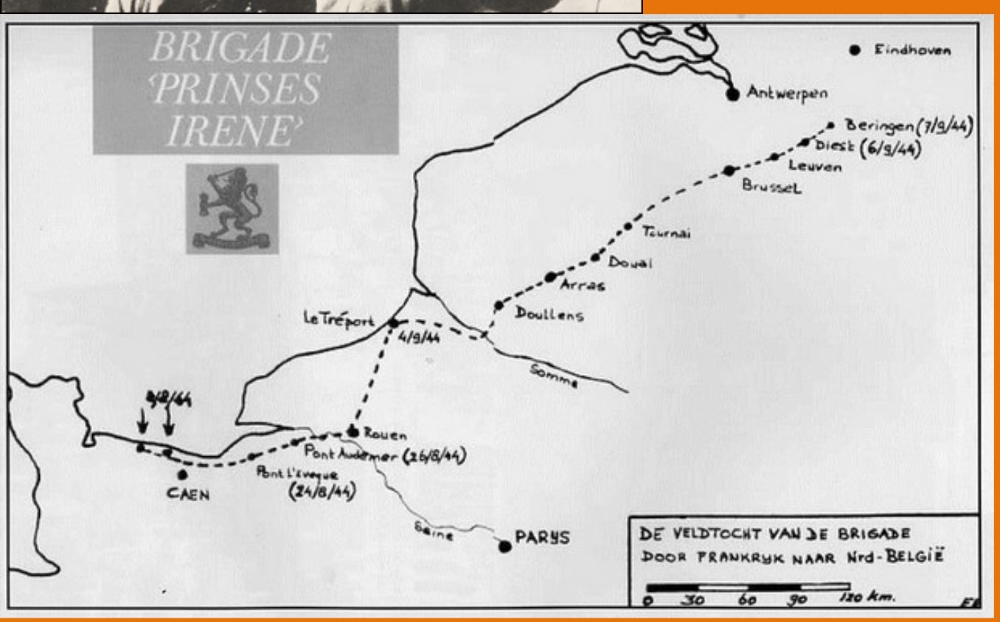

There was a great deal of German equipment abandoned at the Seine and the Brigade dentists picked up a truck and mounted a Boar’s Head on it, with the slogan His twin is in Berlin.

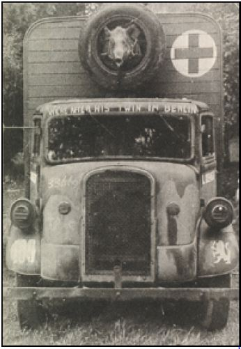

## Beringen

The Irenes had requested to be part of the liberation of the Netherlands, so were assigned to the British Guards Division of XXX Corps. On 06 September, the unit moved up to Beringen. Most of the bridges across the Albert Canal had been blown but one was not completely destroyed so the Irenes and the Guards set up a bridgehead to protect the engineers as they rebuilt the bridge.

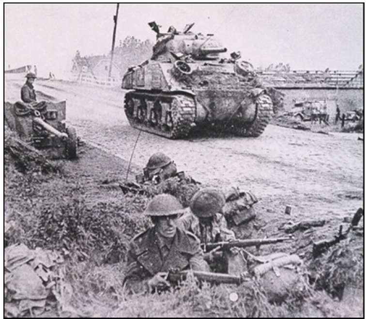

One of the first tanks crossing the bridge.

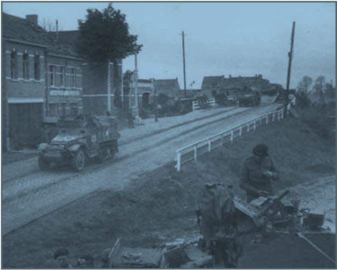

The houses are still in the same location.

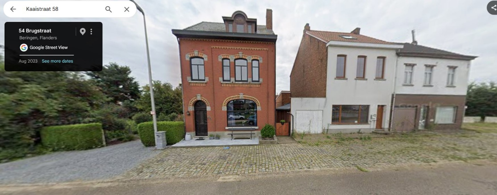

The Beringen Memorial is at the end of the road where the Bailey Bridge crossed.

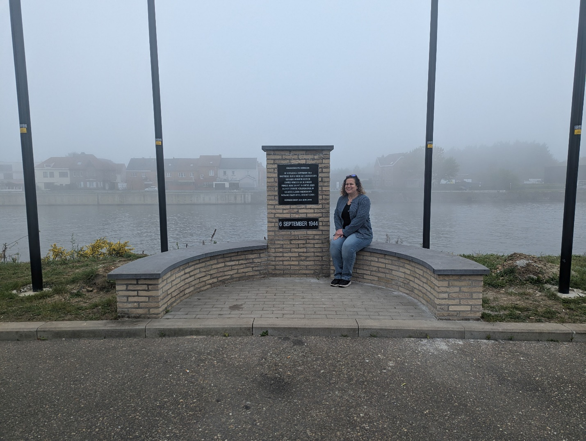

The plaque reads:

BERINGEN BRIDGEHEAD

ON WEDNESDAY, SEPTEMBER 6, 1944, AROUND 4:30 PM, THE BERINGEN BRIDGEHEAD WAS CAPTURED BY THE GUARDS ARMED DIV. AND THE PRINCESS IRENE BRIGADE OF THE 2ND BRITISH ARMY. DURING THIS OPERATION, ENGLISH SOLDIERS, AS WELL AS RESISTANCE FIGHTER NICOLAAS CILLEN FROM ELLIKOM, LOST THEIR LIVES!

BERINGEN THANKS ITS LIBERATORS.

As usual, the Germans immediately counterattacked but despite heavy fighting were held off. The Irenes then proceeded along the canal to continue to push the Germans back.

## Market Garden

On 16 September, the Irenes were assigned to the British 43rd Division which would advance towards Arnhem directly behind the Guards Armoured Division. The Irenes would take part in the liberation of the Netherlands, providing local guiding and translation as part of their advance.

The Irenes had to wait until 20 September before they entered the Netherlands. The Brigade was assigned to the first troops to enter the Netherlands, following immediately behind the tank brigades. At midnight on the night of September 20 to 21, the Irene Brigade crossed the Dutch Belgian border at Borkel en Schaft. Several Irene men stepped out of their vehicles and briefly touched the ground. Despite the bad weather that morning and the early hour, Dutch citizens stood everywhere along the road cheering the liberators.

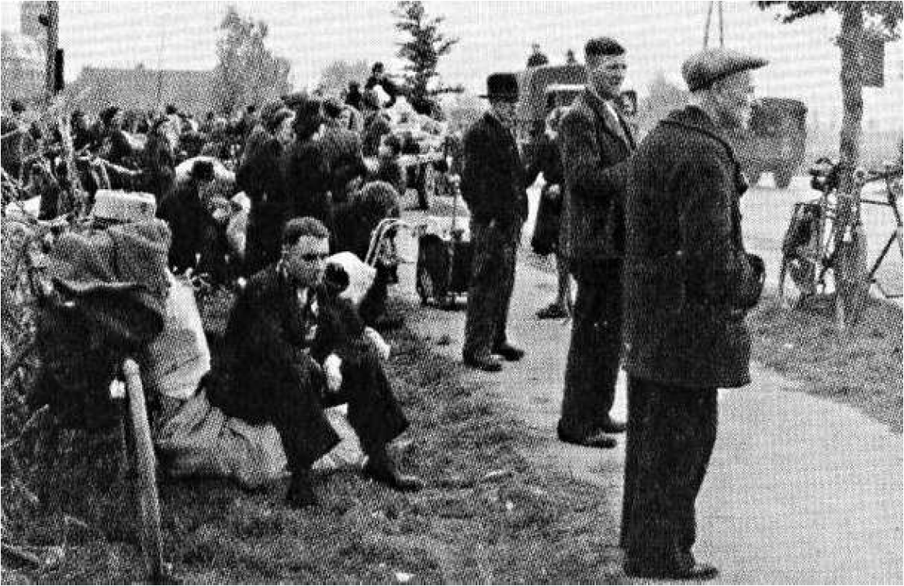

The memorial for the Brigade entering their homeland has been moved a few hundred metres from the border to a more accessible location at a rest area.

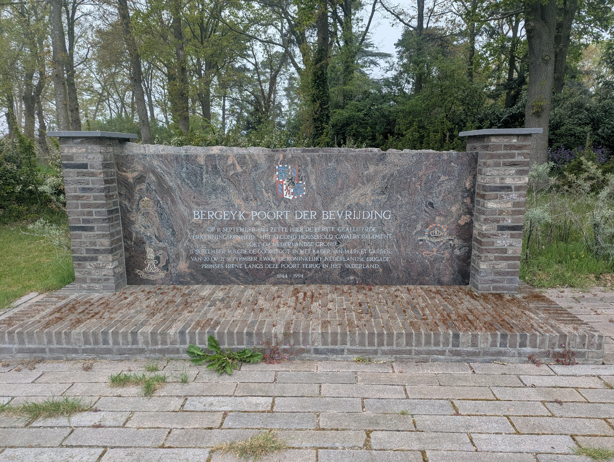

The plaque reads:

BERGEY GATE OF LIBERATION

ON SEPTEMBER 11, 1944, THE FIRST ALLIED RECONNAISSANCE UNIT, THE SECOND HOUSEHOLD CAVALRY REGIMENT, SET FOOT ON DUTCH SOIL HERE.

On September 17, the breakthrough followed as part of Market Garden. From September 20 to 21, the Royal Netherlands Brigade Princess Irene returned to the homeland through this gate.

1944-1994

TRUSTING IN GOD, OUR UNBURDENED SOCIAL WILL, AND THE VICTORY OF OUR ALLIANCE ARMS, IT SHALL BE GIVEN TO YOU ONE DAY TO ENTER DUTCH SOIL AS VICTORIOUS LIBERATORS OF THE NETHERLANDS WITH THIS BANNER

THE ROYAL NETHERLANDS BRIGADE PRINCESS IRENE HAS FULFILLED IN A BRILLIANT MANNER TO THE MISSION CONTAINED IN THE WORDS SPOKEN BY QUEEN WILHELMINA ON 27 AUGUST 1941 ON BEHALF OF THE NETHERLANDS PEOPLE: THE ROYAL NETHERLANDS ASSOCIATION »OUR ARMY

The Irenes were assigned the task of guarding the giant bridge across the Maas River at Grave. As well as protecting against over land attacks, nets were strung in the river to prevent attack by German divers. Counterattacks were successfully held off and when a second pontoon bridge was added, the Irenes provided security for that bridge as well. Dutch soldiers guarding the Grave Bridge.

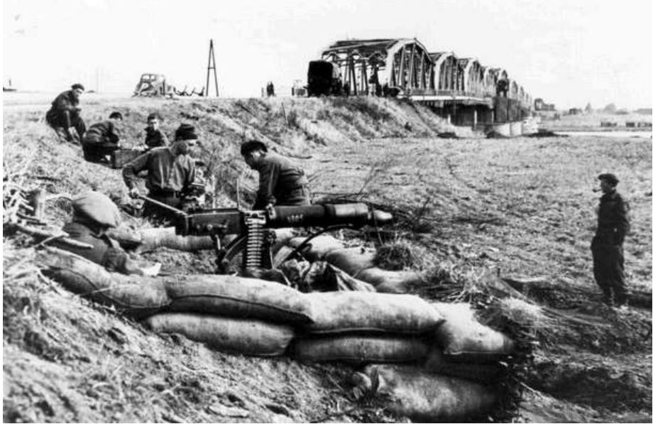

At the bridge, there is a memorial to the 82nd Airborne who initially captured the bridge, the Guards Armour Division of XXX Corps and the Princess Irene Brigade.

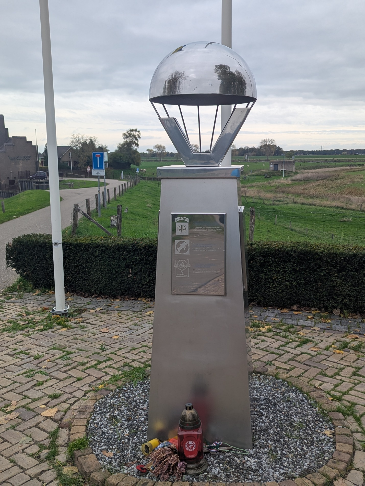

The memorial is adjacent to the bridge, close to several air defence bunkers.

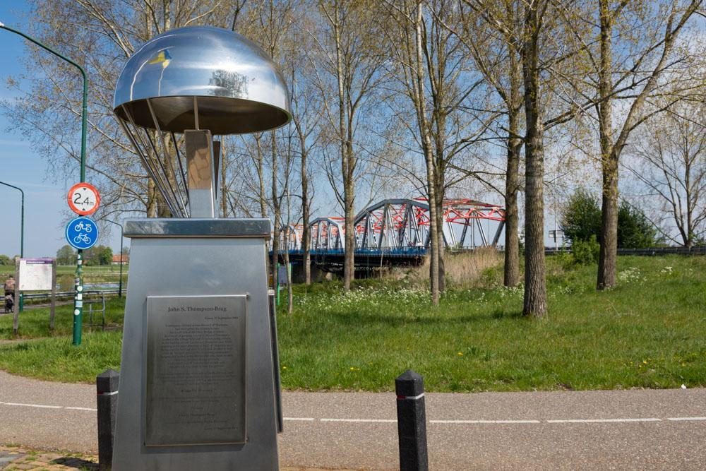

## Oirschot

Operation Market Garden had failed, and by late October much of the Northern Netherlands remained in German hands. The Irenes came under the command of 51st Highland Division. After relentlessly shelling the town of Oirschot for several days, on 24 October, the Germans withdrew and the Irenes captured the town unopposed.

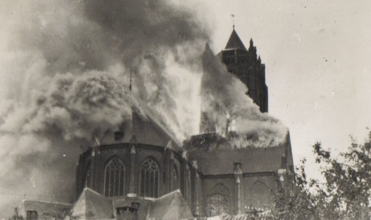

On the base of the Limburg Jagers in Oirschot, a monument is located, listing the Princess Irene members killed in WW2.

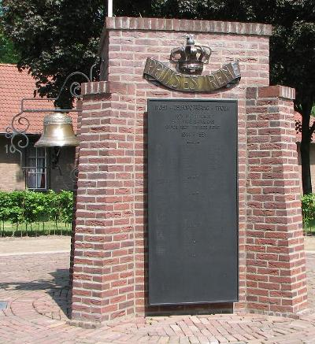

# Tilburg

On 20 October, as part of the 12th British Army accompanied by the 1st Polish Armour Division, the Irenes were directed to attack Tilburg to help push the Germans out of the Netherlands. On 25 October, the 15th Scottish Division advanced from Oirschot and the Irenes from the south to take Tilburg.

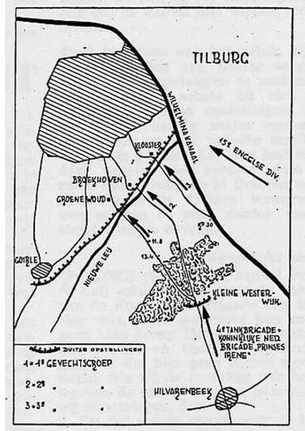

The Germans had picked their defensive positions very well; the Irenes had to advance through very swampy ground that limited the effectiveness of their tank support. The well-positioned Germans stopped the advance with highly accurate machine gun and mortar fire and the British Tanks withdrew to limit their heavy losses. Captured soldiers indicated the Germans were prepared to withdraw to avoid being surrounded, but on 27 October the Scottish Division pressed the attack and captured Tilburg.

The Irenes were prevented from entering Tilburg initially but were permitted to march in the victory parade on 04 November.

There are a number of monuments in Freedom Park (Vrijheidspark) in Tilburg.

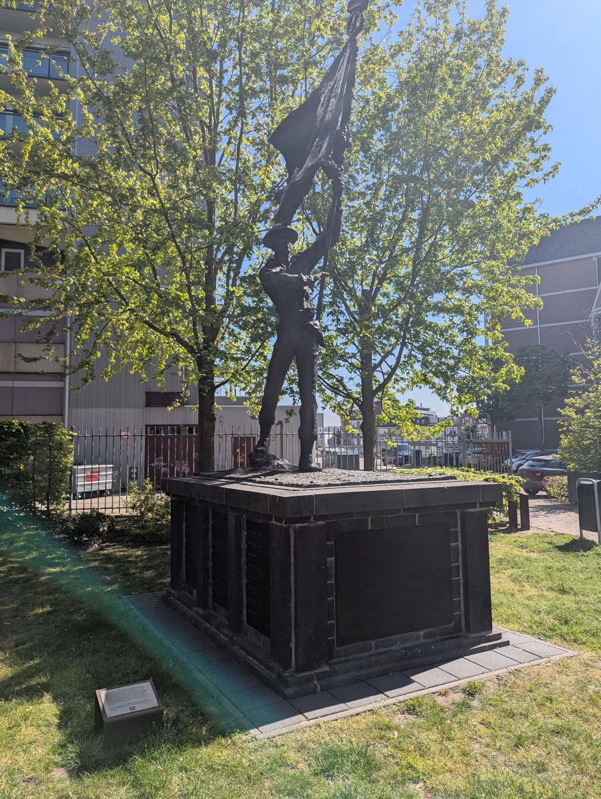

The standard bearer is a monument to the fallen of the Princess Irene Brigade, it lists the names of all soldiers killed, the main battles fought and contains the inscription:

'De Vaandeldrager' is a monument commemorating the liberation of Tilburg. In October 1944, the Royal Netherlands Brigade Princess Irene, together with units from the United Kingdom, fought a fierce battle to liberate Tilburg. They ultimately succeeded in doing so on October 27, 1944.

There is a memorial to resistance fighter Coba Pulskens, who provided cover to Jews, allied aircrews and members of the resistance during the war.

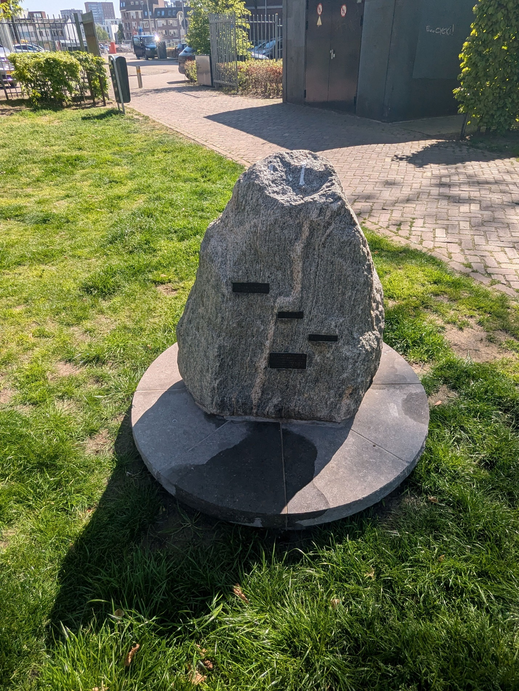

This memorial for the 15th Scottish Division memorizes for the residents of Tilburg the participation of this Division in the liberation of the city in the Dutch province of Brabant on the 27th of October 1944. Various Units from different countries participated in the liberation of Tilburg. The 15th Division under the command of Major General Barber, played a significant part during this military operation.

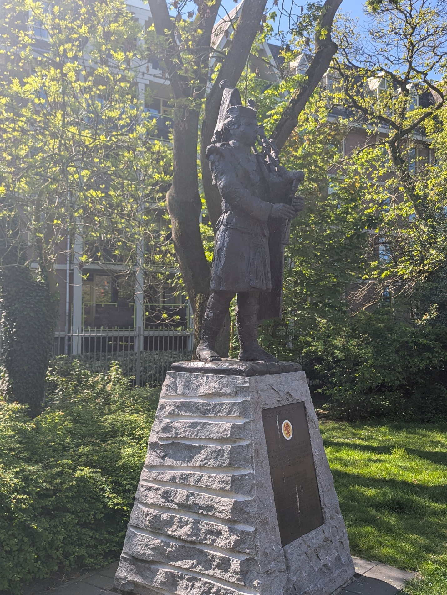

The memorial depicts a bronze statue of a Scottish Bagpiper. The statue has been placed on a pedestal with the image of a heraldic lion.The text on the pedestal reads:

SCOTLAND THE BRAVE

THANKFUL REMINDER ON THE 15TH SCOTTISH DIVISION

FROM MAJOR GENERAL C. BARBER

FOR THE LIBERATION OF TILBURG ON OCTOBER 27, 1944.

(the names of 13 army units)

There is also a memorial to the bombing of Tilburg on the first day of the German offensive into the lowlands.

On 10 May 1940, a bomb hit the Noordstraat. Fourteen people were killed. Amongst them were six children between six and thirteen years old.

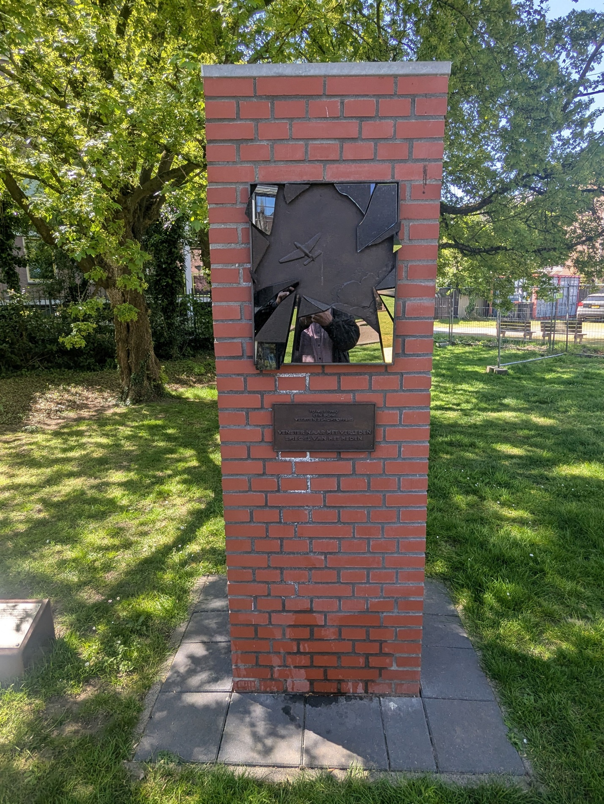

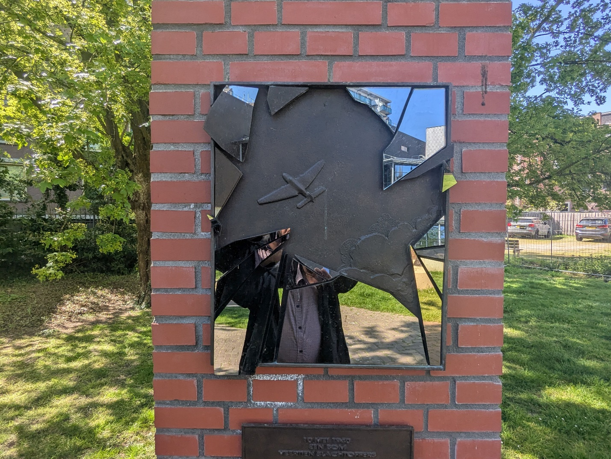

There is also a Holocaust memorial erected in memory of 172 Tilburg victims of the Holocaust.

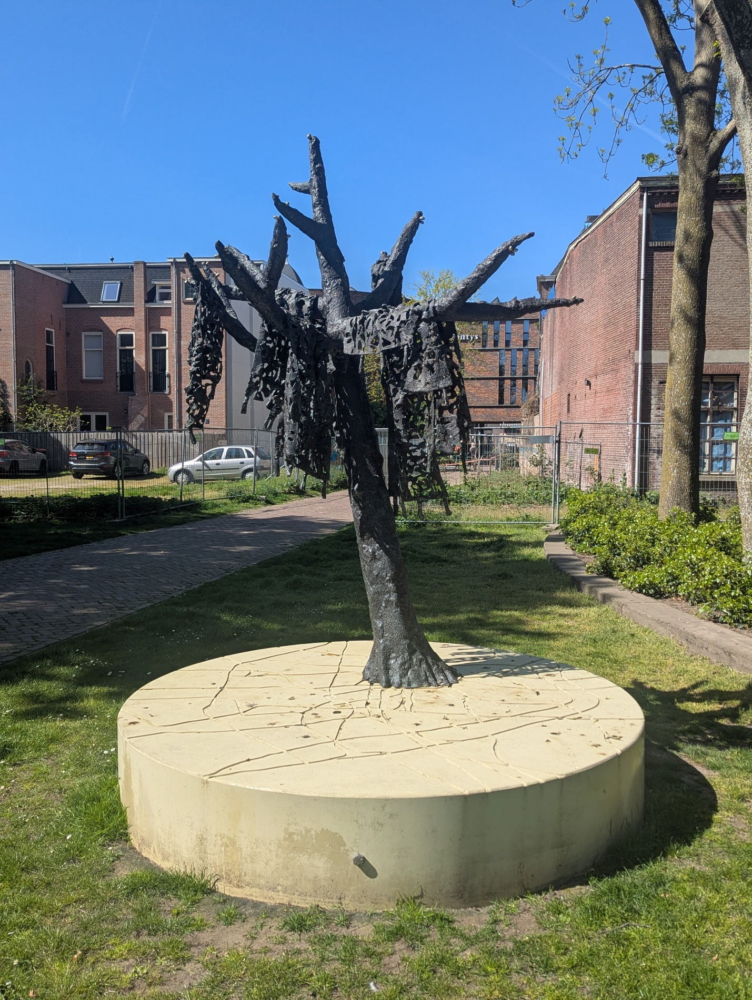

The monument is based on the tree that symbolizes all that grows and blooms, the connection of heaven and earth, the tree as a representation of vital life. The fabric on the branches refers to improvised hanging laundry of the countless people fleeing genocide and dictatorship, on their way in search of a safer world. In the pedestal under the tree, a subtle fabric of the street pattern of the city of Tilburg around 1940 has been applied. A reference to Tilburg has been made both with this street structure and with the cloths and rugs referring to textiles.

Finally, there is a memorial to the 60 Tilburg residents killed in the fighting in the East Indies after WW2. The Dutch had assumed it would be business as usual in their colonies in what is today Indonesia. The colonies had other ideas; after having been occupied by the Japanese during the war, they declared independence in 1945 then fought a four year “police action” that resulted in independence in 1949.

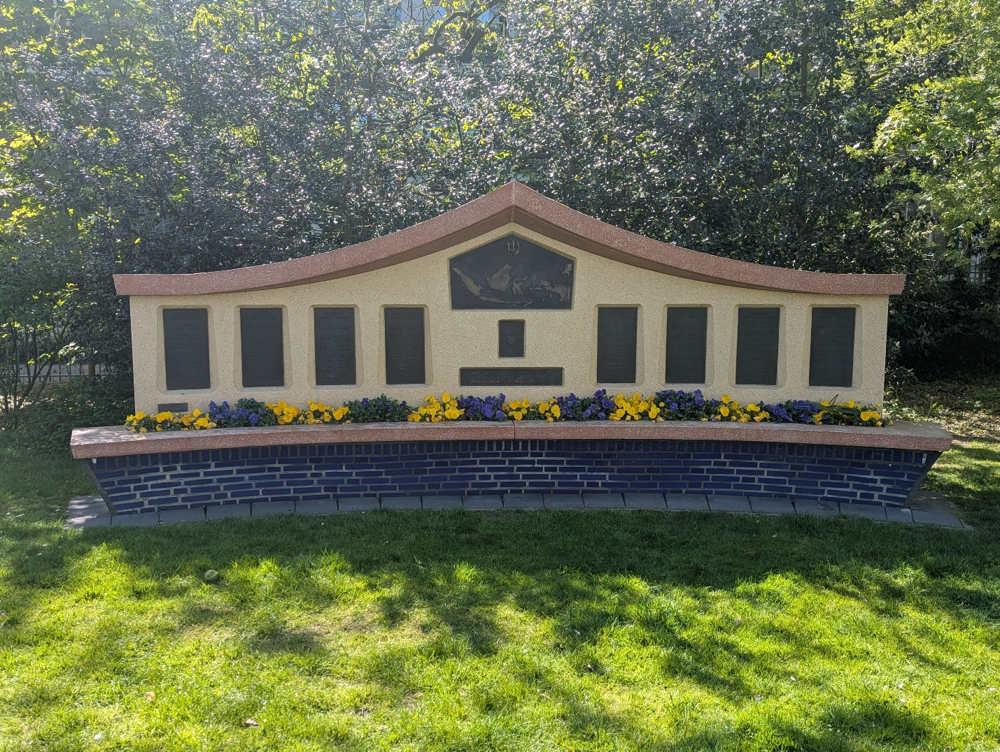

The park is in the middle of a residential area, with people walking or cycling through, children playing and people walking their dogs. Having a central memorial spot is an excellent blend of remembrance and modern-day functionality.

## Zeeland

After Tilburg, the Irenes continued moving west until they were assigned to guard Zeeland on 15 November. The Canadians had completed the clearing of the Scheldt Estuary the week before, but the area to the north had not been cleared of Germans, so the Irenes were sent to prevent the retaking of the estuary. The Germans occupied the ground until their surrender on 05 May 1945.

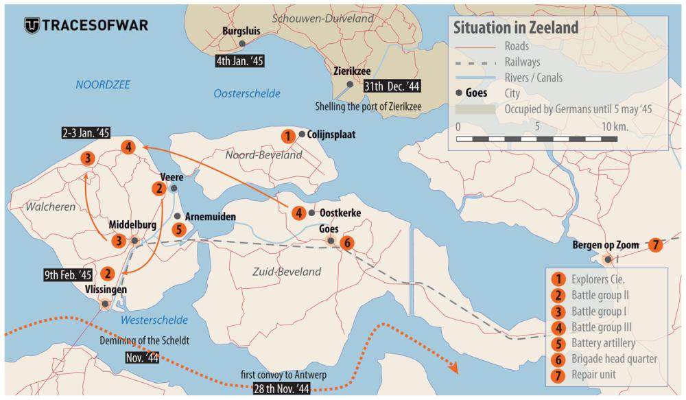

Walcheren Island was still flooded so the region was patrolled by DUKW amphibious vehicles. This is not an acronym. It comes from GMC’s internal model‑code system:

**D** — 1942 production series

**U** — Utility body (in this case, amphibious utility)

**K** — All‑wheel drive

**W** — Dual/tandem rear axles

##

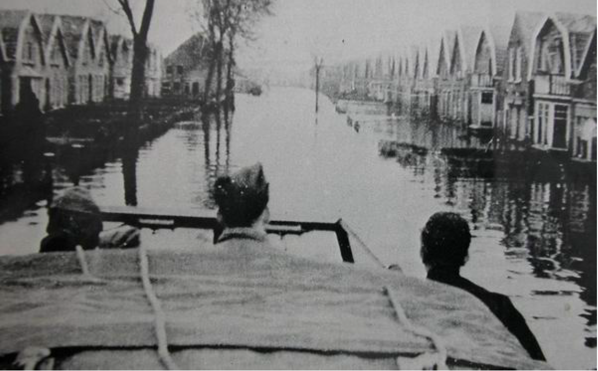

## Coljinsplaat

On November 25, the 'Recce' of the Irene Brigade managed to repel a German infiltration attempt on Noord-Beveland, thereby saving Colijnsplaat from a disaster. Lieutenant Havelaar was killed during this action. A series of plaques on the Dorpkerk commemorating the action.

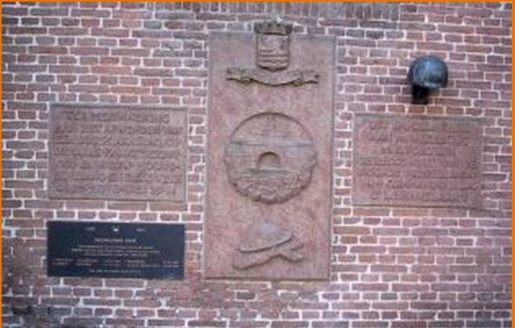

## Hedel

By the end of March 1945, the Irenes were seeking a more active role in the liberation of their homeland, so were assigned to the British 116th Brigade and were assigned the attack on Hedel.

At midnight on 22 April, the Irenes crossed the Maas River in Buffalo Landing Craft with silent engines, just upstream from the British, catching the Germans by surprise. Heavy fighting started the next morning and the British were driven from their bridgehead. The Irenes held out until order to retreat south of the Maas on 25 April. They suffered 12 killed and 39 wounded in what would become the final battle of the war for the Irenes. The Germans suffered 243 casualties, killed, wounded and captured.

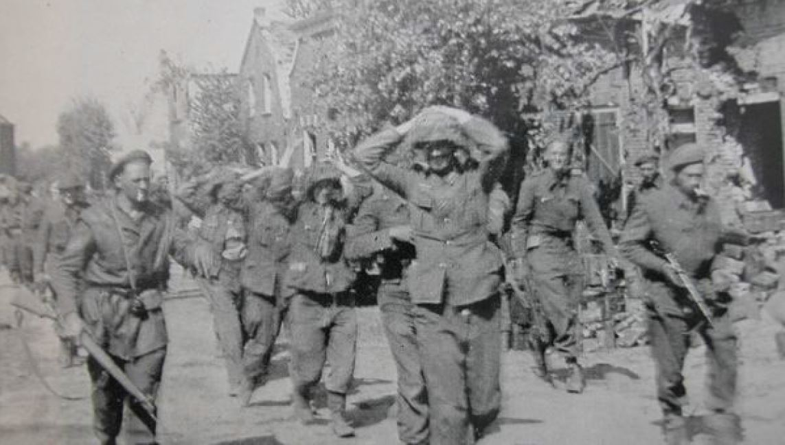

The memorial to the fallen is in a lovely little park in Hedel.

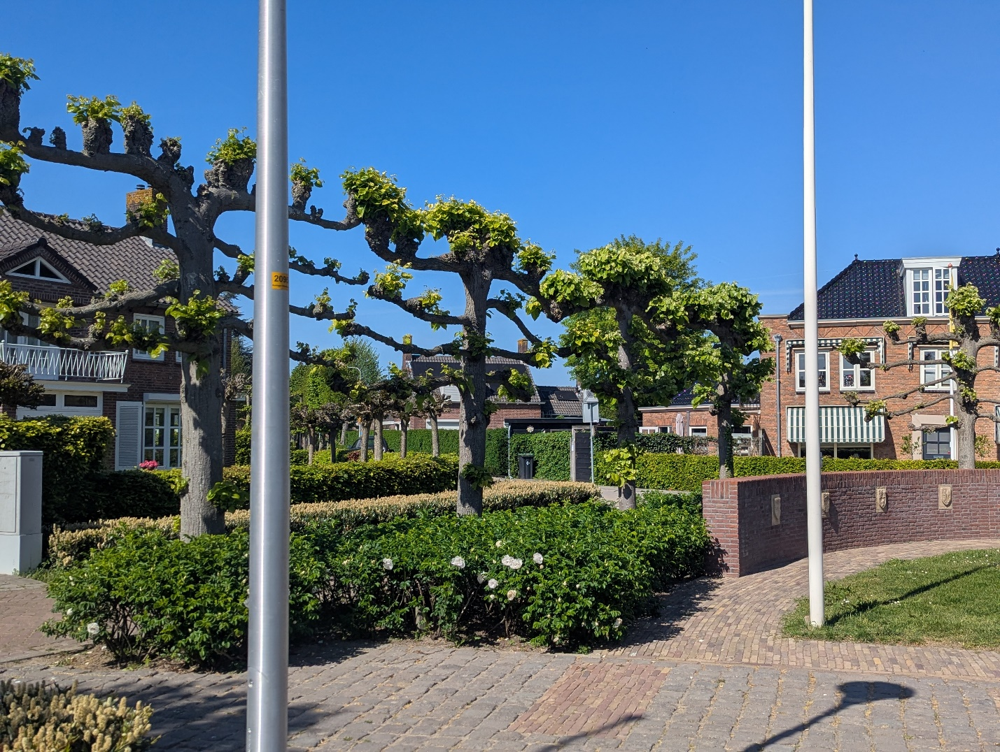

Rachel checking out the names of the fallen.

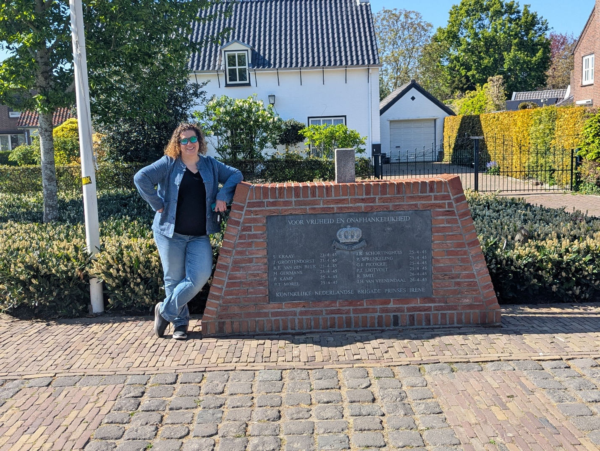

## Wageningen

The official surrender was signed in Wageningen on 05 May 1945. The Irenes paraded through Wageningen on 06 May on their way to the Hague.

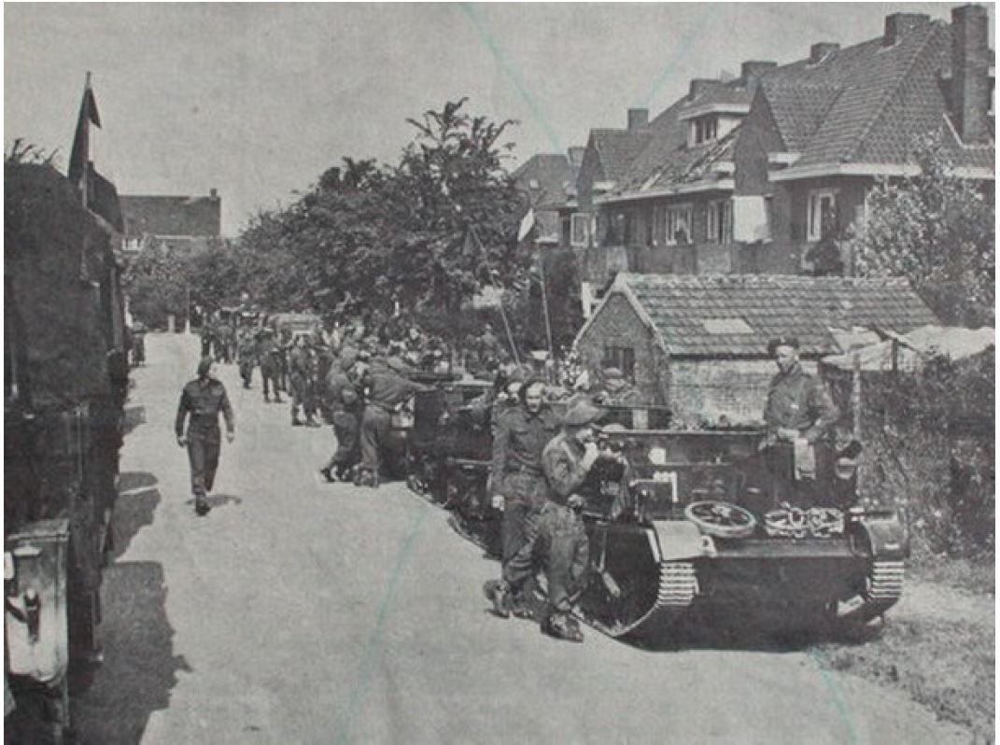

## The Hague

On May 8 at 12:30 PM, the march began via the Grebbenberg, Utrecht, Woerden, Alphen aud Rijn, and Leiden to The Hague. The Irenes were mobbed in every town they visited.

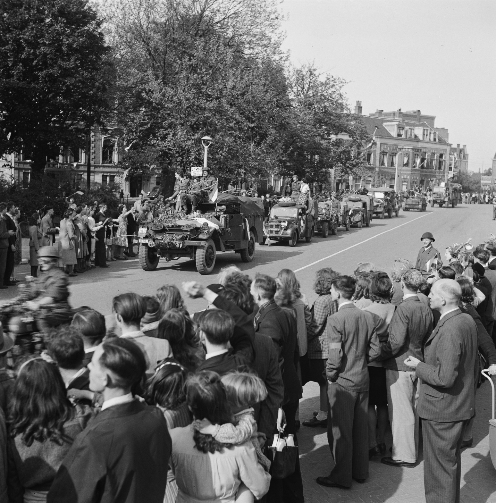

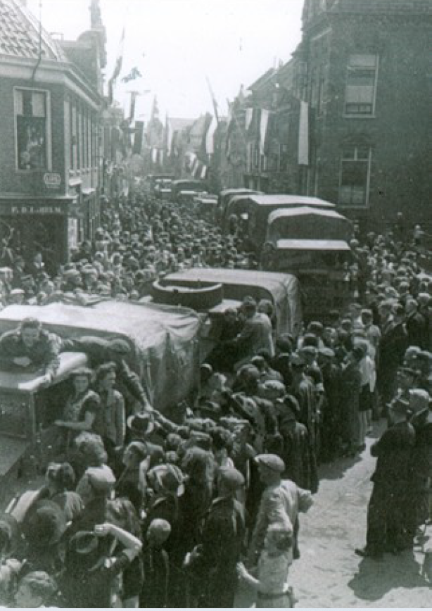

On 08 May at 7 PM the Brigade entered The Hague (Den Haag) and spent the month in celebrations, parades and sports events. They paraded with the Canadians on 31 May in Amsterdam.

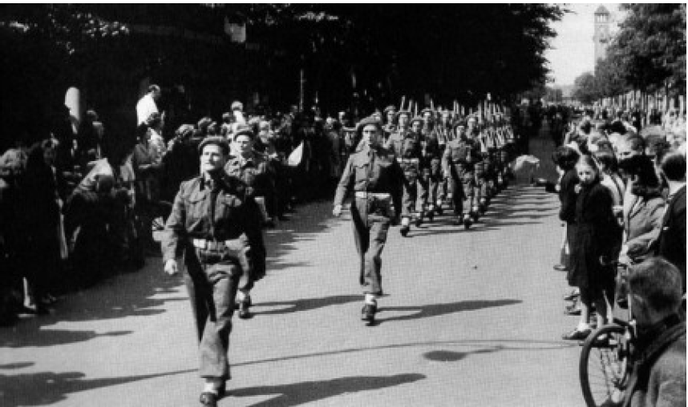

The final parade for the Princess Irene Brigade was held on 13 July 1945 at the Clingendael in the Hague.

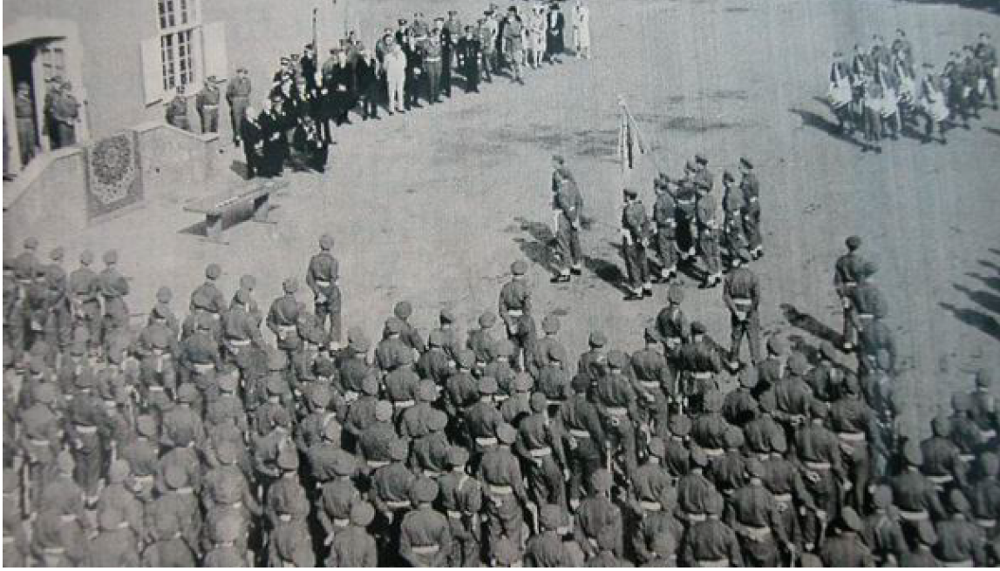

Prince Bernhard also delivered a speech at this ceremony in which he elaborated on the role of the Irene Brigade. He also announced that the traditions and name would, however, be preserved in a newly established Regiment. The Prince said: “Fortunately, the traditions which you have acquired during the months of fighting on the Continent will not be lost. From the Brigade, among other things, the core for the Princess Irene Regiment will be formed, a Regiment that will be formed around Your standard and will build upon Your tradition.”

# John Scholte

After the hostilities completed, John got to visit his parents for the first time since leaving the Netherlands as a teenager in 1925. John and his parents.

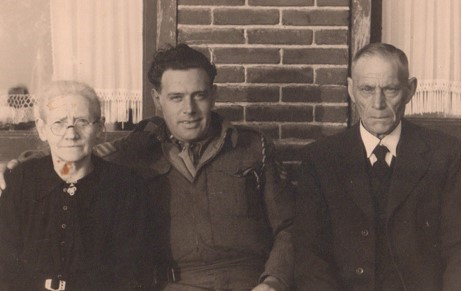

John was discharged from the Dutch army on 23 August 1945 in Montreal. His photograph from his Discharge Papers.

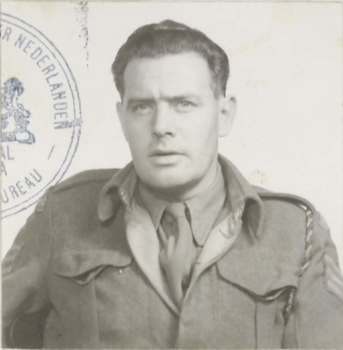

# Poetry

John wrote poetry and a family member collected the poems he had written during his time in the army. The poems provide insight into his feelings for his family, his duty and the struggles of battle.

**AGAIN SUNDAY MORNING**

Once again it’s Sunday morning

And I’m idling on my cot

The sun is rising in the east

Driving night shades from the spot.

A cooling breeze is gently stirring

The birds sing in their happiness

The breeze and song give one a feeling

As would a loved ones sweet caress.

The green of leaves, the red of flowers

The pink, the yellow and the blue

They harmonize in perfect blending

With thoughts my love that are of you.

**The Task**

So all of you who cherish peace

And freedom is your land

Come one, come all, stay not behind

And come with sword in hand.

Let us put down this evil force

Which threatens to destroy our life

Come to the task, that us, is set

And we must do through strife.

For we can not be at peace

Nor in the sun of freedom bask

Until we have with blood and fright

Brought the fulfillment of our task.

# After the War

John worked as a builder in Scarborough, ON.

He died on 12 June 1980 in Bracebridge, ON at the age of 73.

# Final Thoughts

We had a great weekend touring the Netherlands, hitting several Princess Irene Brigade memorials, as well as the sobering Camp Vught Concentration Camp and the massive Keukenhof Botanical garden.

More than 32,000 prisoners passed through Camp Vught, including Jews, political prisoners, resistance fighters and anyone who did not conform to the German standards. It was a transit and labour camp, but none of 15,000 Jews who transited the camps survived the war.

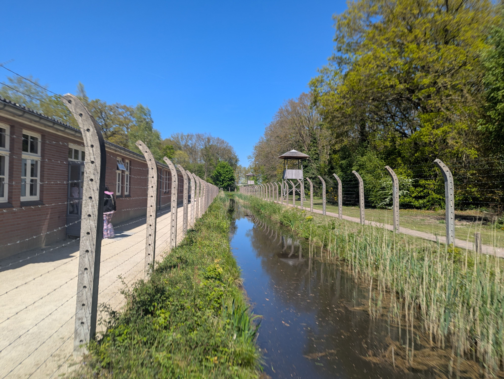

A slightly more uplifting visit was to the Keukenhof Botanical Gardens. The Keukenhof is a world-famous garden of almost 80 acres that plants more than 7 million bulbs per year.

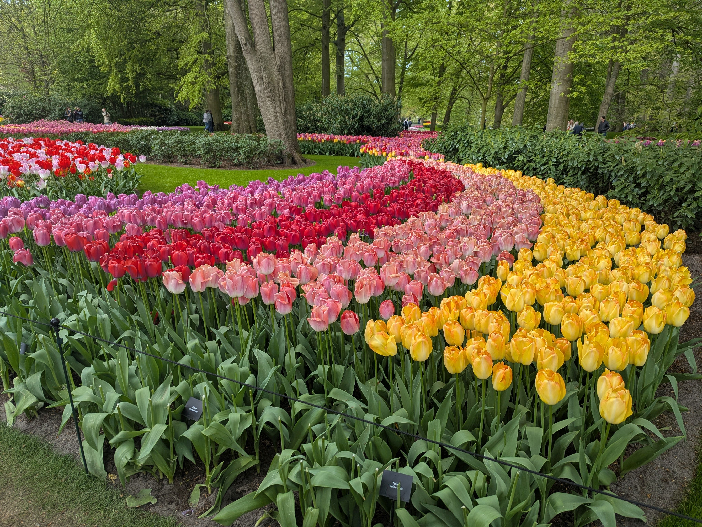

The scale of the garden and the variety of tulips is unbelievable.

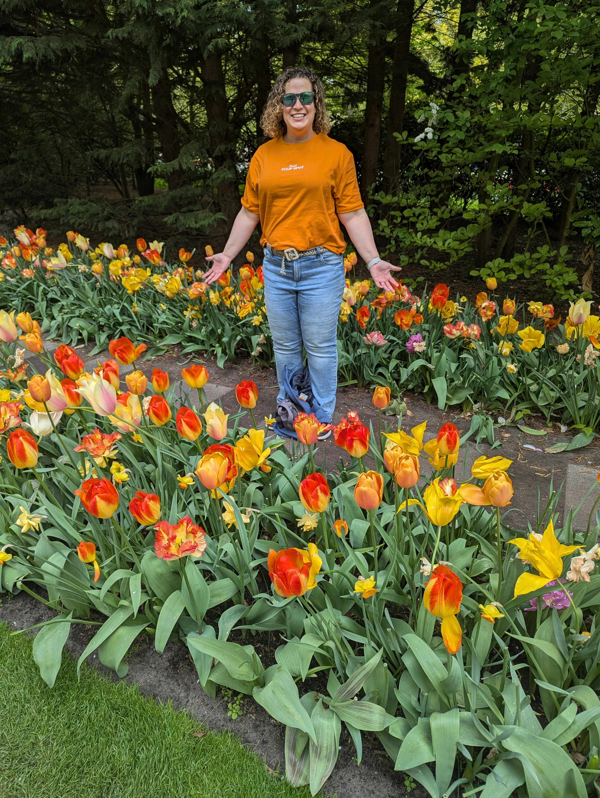

Exploring the Netherlands was a great way to spend a long weekend, and finding a few more war stories along the way is always exciting.

# Bibliography

<https://www.prinsesirenebrigade.nl/>

* [Second World War](https://www.paulsbattlefieldtours.com/blog/categories/second-world-war)
* [Family](https://www.paulsbattlefieldtours.com/blog/categories/family)