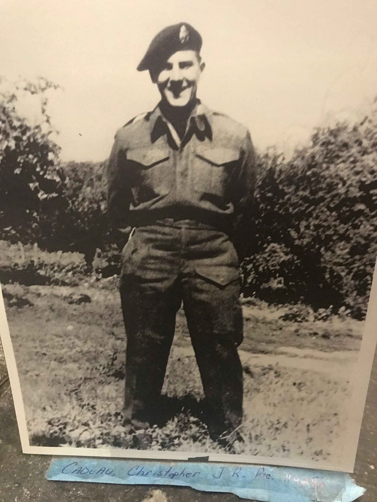
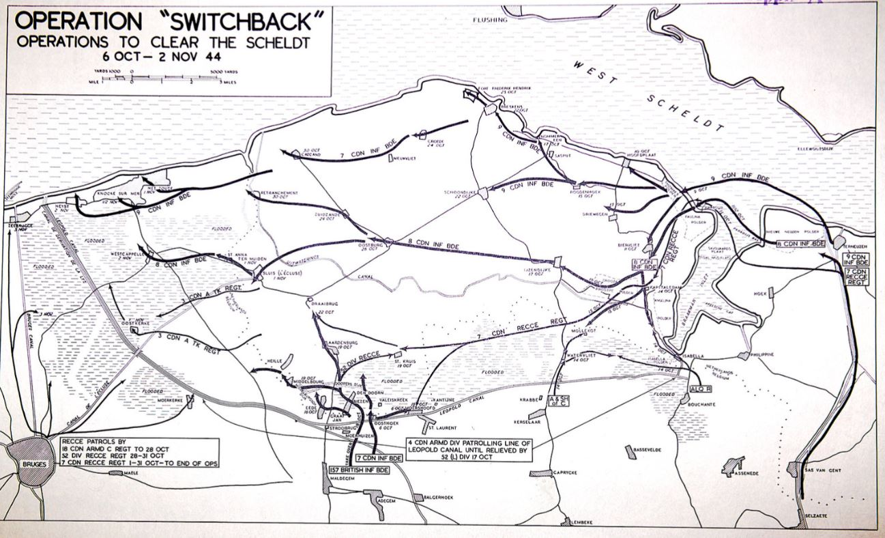
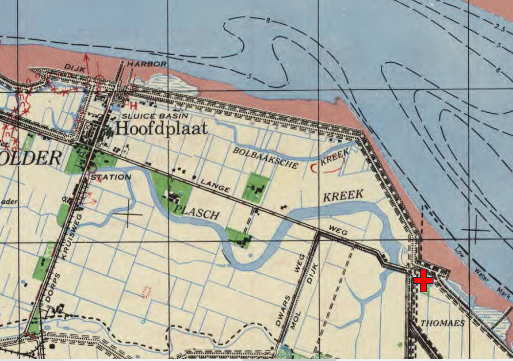
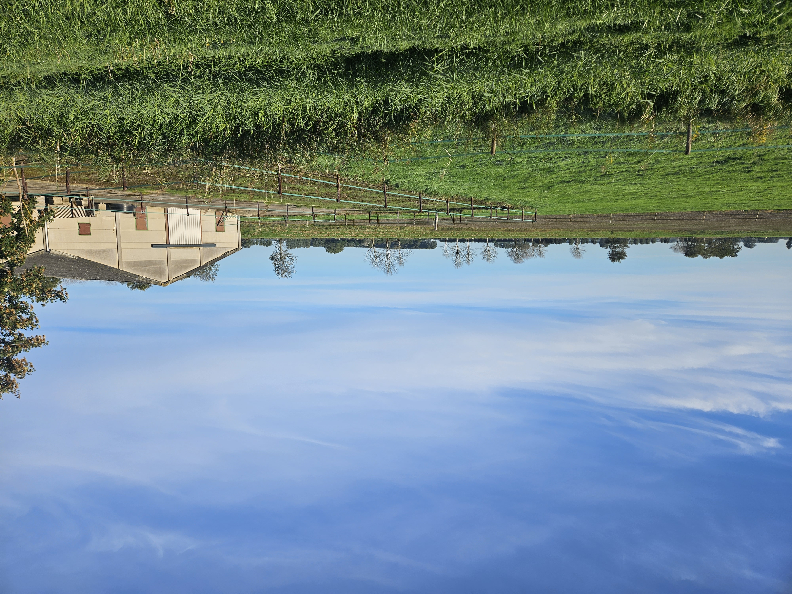
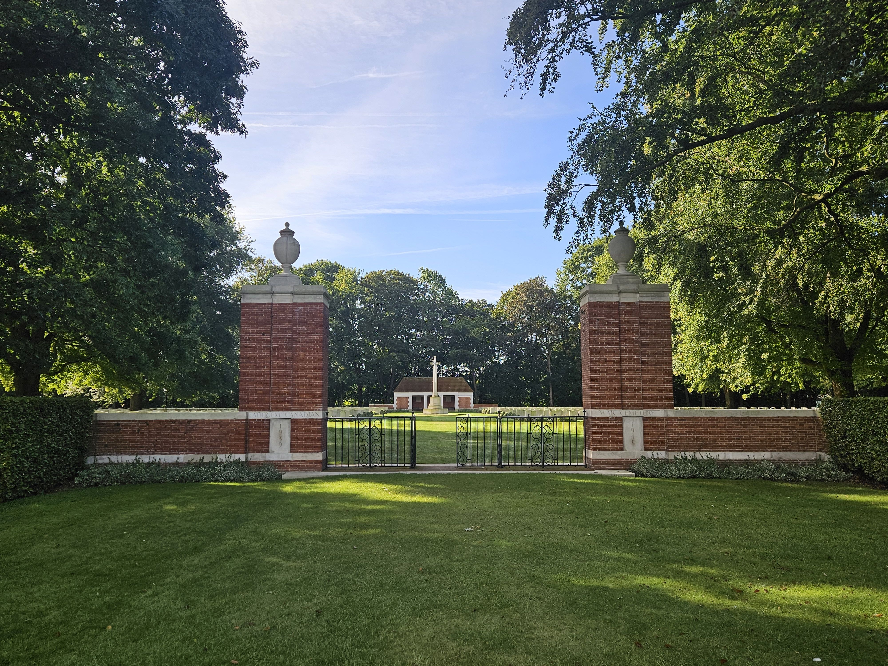
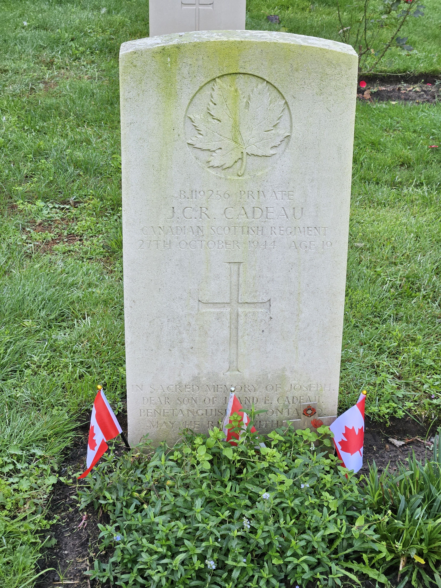

# Joseph Christopher Raymond Cadeau

* [pd-allen](https://www.paulsbattlefieldtours.com/profile/pd-allen/profile)
* Sep 27, 2023
* 4 min read

Updated: Sep 29, 2023

Private Joseph Christopher Raymond Cadeau B/119256

I recently visited Christopher Cadeau at the Adegem Canadian War Cemetery, and this is the story of his war service.

The Cadeau family have been living in Canada since at least the early 1700’s, when they emigrated from France to Quebec. Pierre Cadeau was born in Quebec on June 9, 1858, By April 14, 1884, he had moved to Port Severn in Simcoe where he married Marie Jeanne Houle. Together, they had 11 children, including Joseph born on September 25, 1891. He lived in Penetanguishene until his death in 1955.

The first member of the Columbus family to arrive in North America was Louis Colombe, born in Normandie, France in 1641. The first mention of Louis was in 1664. He was a domestic servant, working for Charles Roger, a notable in Quebec. He worked on Ile St Laurent in Quebec. The name Colombe means dove keeper. Louis married Jeanne-Marguerite Boucault on September 30, 1670, and together, they had 12 children, including a son Louis Coulombe, born in 1683.

200 years later, their name having been anglicized, Arthur Columbus was born in Penetanguishene on February 15, 1874. On September 9, 1900, he married Catherine Anne O’Connor and together they had 10 children, including daughter Marie Ethel. Columbus.

Joseph Cadeau married Marie Ethel Columbus on April 25, 1922. He was classed as a salaried worker doing odd jobs in the 1931 census. Joseph and Marie had 11 children, including Raymond Christopher Joseph Cadeau who was born in Penetanguishene on July 20, 1925. On November 13, 1943, Raymond Christopher Cadeau enlisted into the Canadian Army. Prior to his enlistment, he had worked on ships on the Great Lakes, out of New York and doing odd jobs around home.

Christopher enlisted in the Army in Toronto on 13 Nov 1943, at the age of 18. In December 1943, he attended basic training at Number 24 Basic Training Centre in Brampton, Ont. He was selected to serve in the Armoured Corps, and in Feb 1944 was assigned to [#2](https://www.paulsbattlefieldtours.com/blog/hashtags/2) Canadian Armoured Corps Training Centre at Camp Borden, near Barrie, Ontario. He qualified as a Class III (Wheeled Vehicle) Driver in Jun 1944, and in Aug 1944 was sent overseas and assigned to the [#2](https://www.paulsbattlefieldtours.com/blog/hashtags/2) Canadian Armoured Corps Reinforcement Centre.

On 01 Sep 1944 Christopher remustered to Infantry. After D-Day and the follow-on battles there was a critical shortage of infantry, so we are not sure whether he volunteered, or was volunteered to remuster. He was assigned to the Winnipeg Grenadiers, who had been wiped out in Hong Kong, then reconstituted as an infantry training battalion in England.

On 17 October Christopher was sent to Belgium, and on 24 Oct he joined the Canadian Scottish Regiment. The Canadian Scottish had been involved in the D-Day landings then the battles inland. Later they were involved in clearing the Channel ports, and completed the clearing of Calais on 01 Oct. They immediately moved north to participate in Operation Switchback, the operation aimed at the clearing of all enemy from the south bank of the river SCHELDT. This action was essential for the eventual use by Allied shipping of the Port of ANTWERP some miles up the Scheldt Estuary.

The Can Scots were in the 7th Infantry Brigade so were responsible for clearing the area adjacent to the Scheldt. Christopher joined the unit the 24 Oct in Breskins after 3 weeks of fighting. The Can Scots war diary for 27 Oct, the day Christopher was killed reads:

*The Coys began what was to prove to be a very difficult day. "A" Coy had kept on but were now enduring painfully heavy shelling. All went well until suddenly 9 Pl found itself fired on by machine guns at point-blank range. They were travelling along a road at the foot of a dyke and were met by a hail of fire from all sides. The enemy had allowed them to pass through and had then closed in. It was a well-planned and well-executed manoeuvre by the defending Paratroopers of the German Army. 9 Pl's runner, Pte Bowling, was sent back to warn Coy HQ of the situation. A bloody battle ensued with every ounce of fighting energy that the gallant "A" Coy men possessed. 4 Can Scots were killed including Christopher Cadeau, 5 wounded and 40 missing.*

Op Switchback was successfully completed on 02 Nov, with the taking of Knocke and Heyst, the last area of Belgium to be liberated. I visited 2 museums dedicated to the Canadian Liberation, and they were quick to point out they were last!

Christopher's time in the Can Scots was tragically short, only 4 days. The Battalion War Diary has a daily listing of the unit strength. The numbers fluctuated up and down due to losses and reinforcements. The movement was interesting to me, so I plotted out the month of Oct 1944.

The 3rd Division had a total of 2077 casualties for this operation, with 314 killed and a further 231 missing. More bitter fighting north of the Scheldt by the Canadian 4th Armoured Division finally cleared the Estuary, and the first convoy sailed into Antwerp on 28 Nov 1944. There was a large high-level delegation to greet the ships, but despite the heroic efforts of the Canadians, there were no senior Canadian officials in attendance, a slight that annoys Canadians and the Belgians as well.

Christopher and his comrades were buried in a temporary cemetery just east of Hoofdplaat, buried in an orchard. According to his service records the location is shown with a cross.

Temporary Cemetery Near Hoofdplaat

I was nearby so I visited the location near Hoofdplaat. The location is on a farm, and I could not find any indications of the temporary cemetery location but it was likely in the trees near the farm.

The view from the other side.

After the war, the soldiers were reinterred at the Adegem Canadian War Cemetery that I recently visited.

Adegem Canadian War Cemetery

Christopher's Grave Marker

* [Second World War](https://www.paulsbattlefieldtours.com/blog/categories/second-world-war)
* [Family](https://www.paulsbattlefieldtours.com/blog/categories/family)