# Juno Beach

* [pd-allen](https://www.paulsbattlefieldtours.com/profile/pd-allen/profile)
* Sep 10, 2023
* 3 min read

Updated: Sep 16, 2023

On our first real day of touring we hit Juno beach, and it hit back hard. I had written a Juno Beach story before seeing it in person, and that blog will be attached, but the live view was much more poignant.

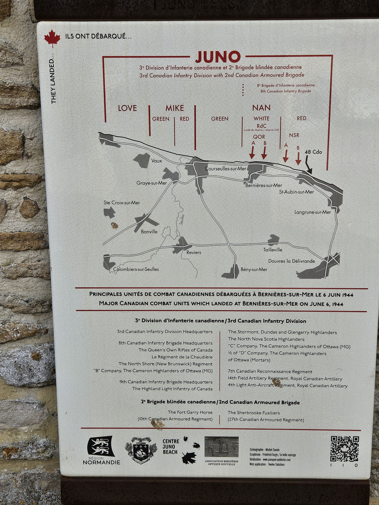

The scale of the beaches are most impressive. The length and width of the beaches don't really show well in the pictures. The D-Day assault went in with the rising tide, so most of the soldiers had to travel 300 yards or more in the face of murderous fire.

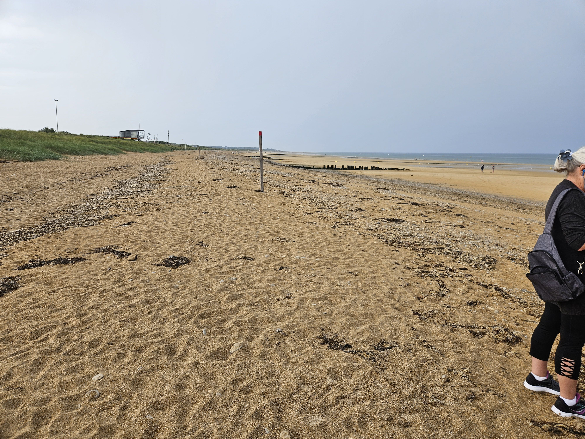

The German defences were abundant, and built to protect against off shore barrages. This 50 mm gun emplacement was typical, built to fire along the beaches or into the town rather than out to sea.

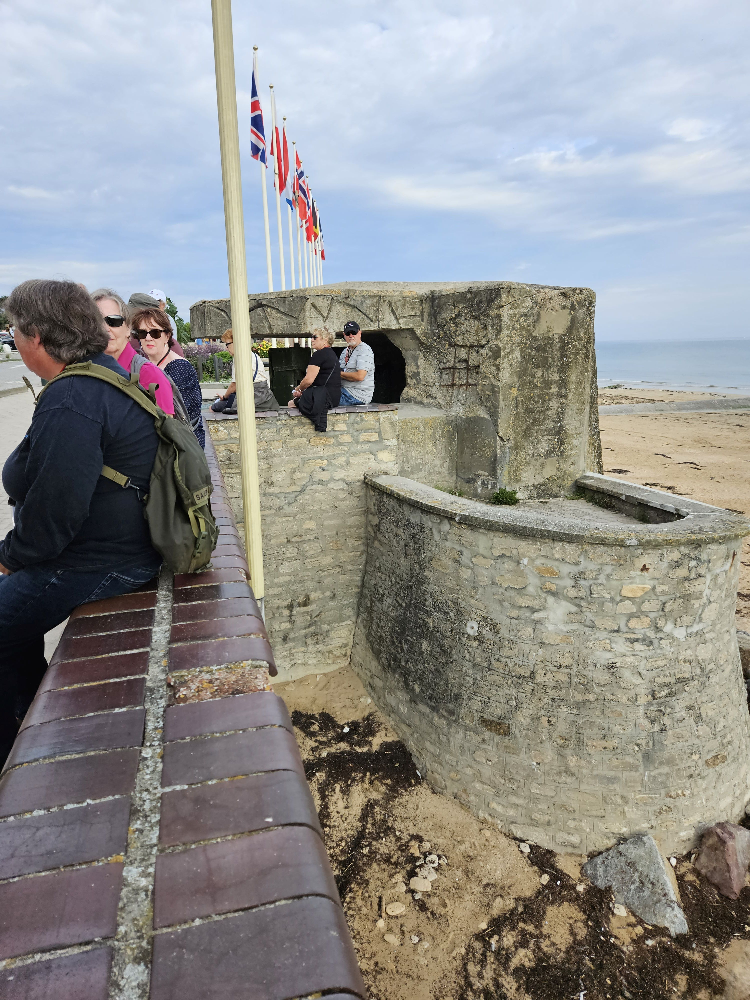

The locals were very friendly, many saying Bonjour Canadians as they walked or jogged along the water front. A chance meeting with a man on the street produced a remarkable story. Bernard showed us a picture taken on D-Day with a group of soldiers and a 5 year old boy.

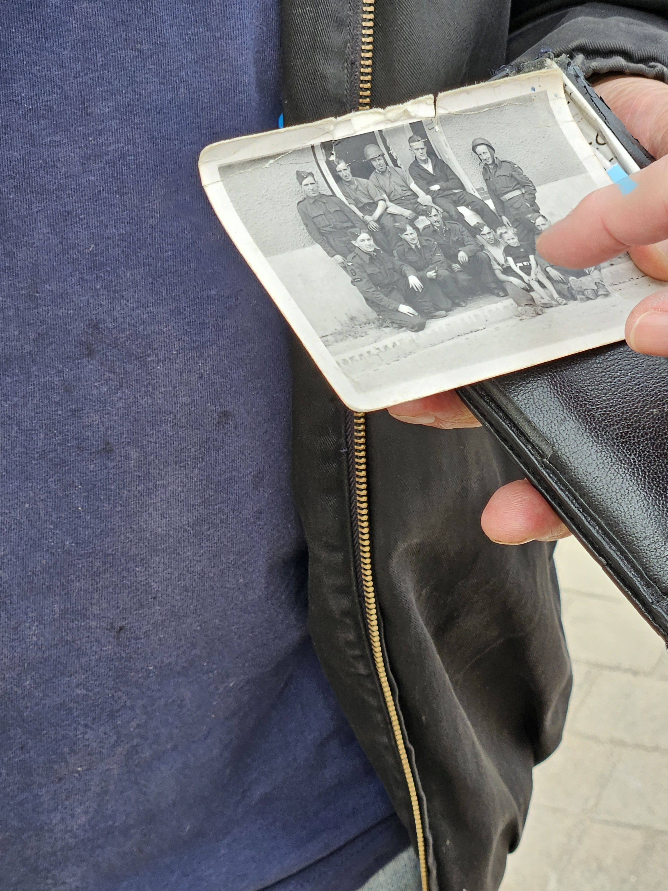

85 year Bernard was the boy in the photo, and was happy to share his story. His family was awaken by shelling, so they hid in their basement until the initial attack was over. Later in the day the Canadians had cleared the town, and met some of the grateful townfolks.

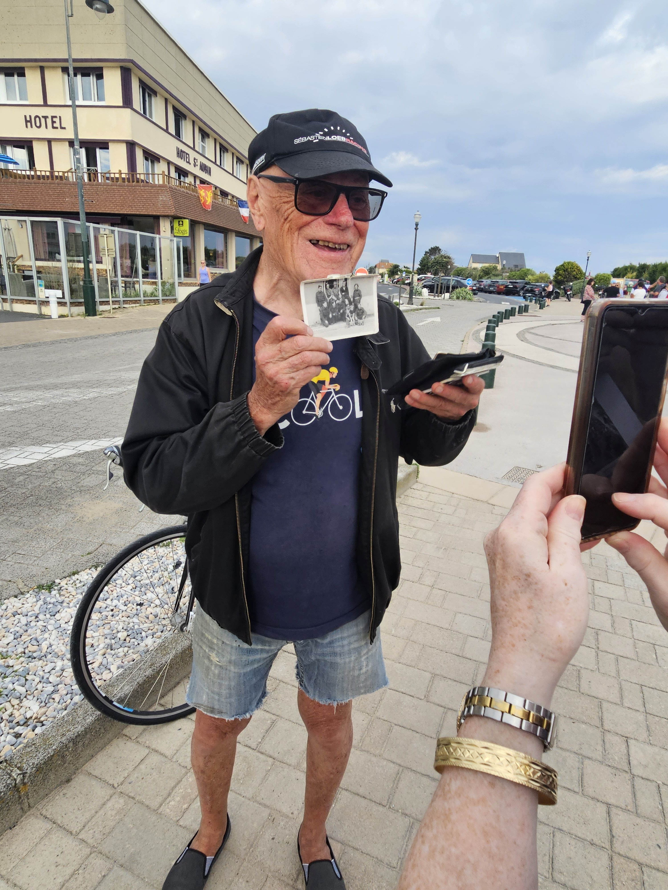

We were also fortunate to visit the most distinctive house on Juno Beach, formerly known as Queen's Own Rifles House, now called Canada House. The house was one of the few houses remaining on the beach, apparently because a German commander lived there. It was the first house liberated on Juno Beach.

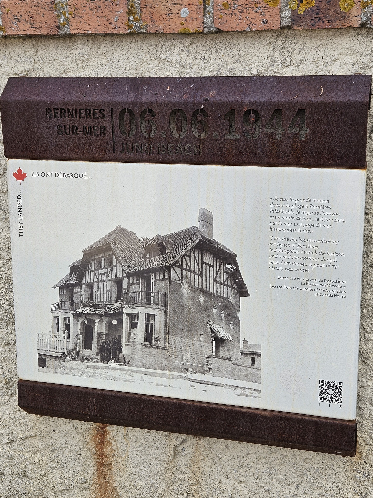

The house has remained in the same family since D-Day and is still a weekend home that has been converted to a shrine for the Canadian Liberators.

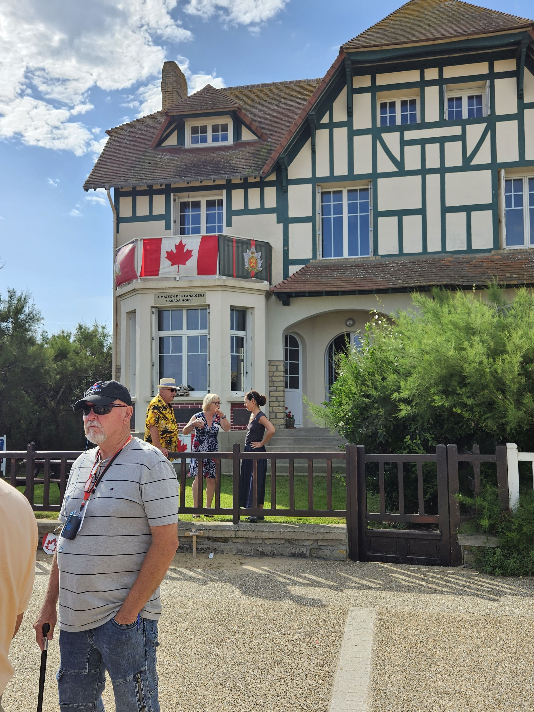

The owner is now the granddaughter of the original owner, and we were invited in to hear the stories and see the collections.

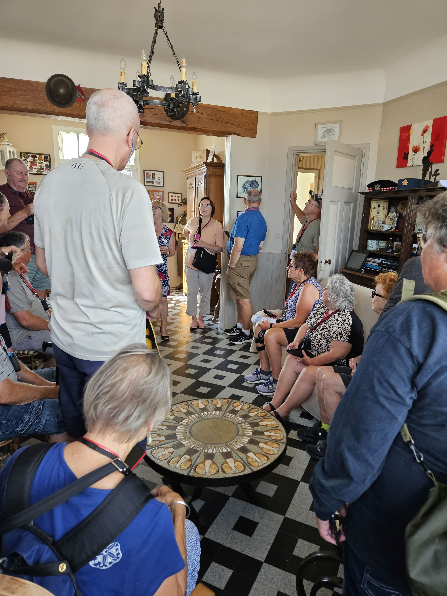

A plaque outside Canada house reflects the losses suffered on D-Day. The first wave of infantry suffered an approximately 50% casualty rate. The Canadians has the second highest casualty rate on D-Day (after the Americans at Omaha Beach), and the highest per capita casualty rate. Total Allied casualties on D-Day reached more than 10,000, including 1,074 Canadians, of whom 359 were killed.

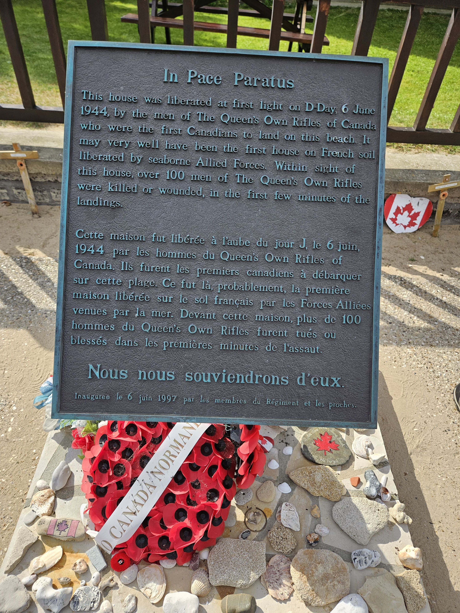

We also toured the Juno Beach Centre and got a tour of some of the bunkers. The bunkers we toured had been completely buried in sand, and in 2010 a couple was walking their dog when he disappeared. The centre folks helped in the search, and the dog was eventually found after falling into the bunker. The dog dug down instead of up, so when they dug him out it was decided to empty the bunker.

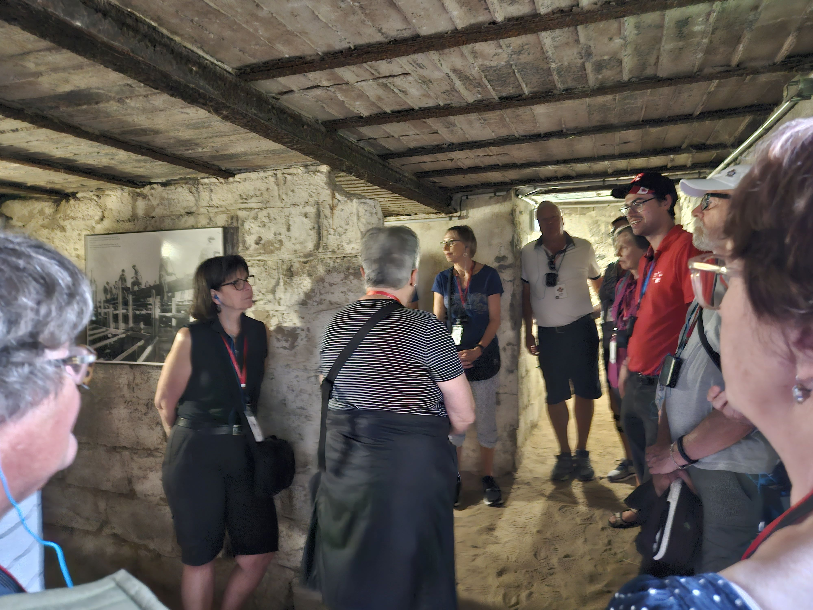

The sand has shifted dramatically over the years. The round portion of the bunker used to be on the beach, and the bunker on top of the sand. The bunkers have sunk over the years, and the bunker is now behind a large sand dune more than 100 ft from the high tide mark.

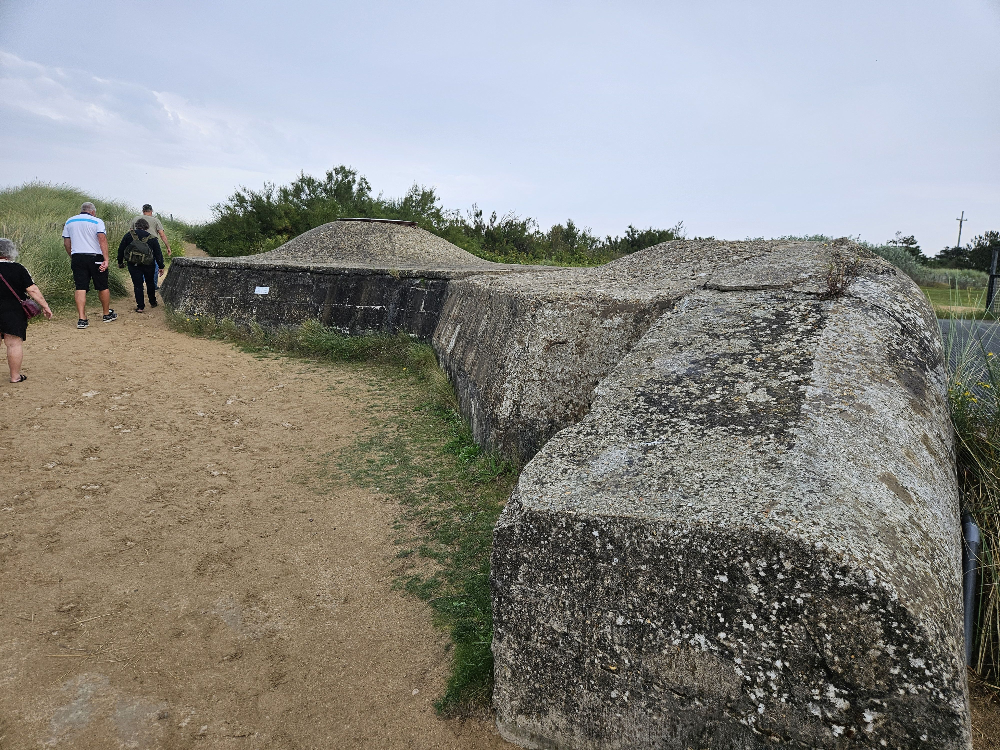

Further down the beach, the sand has eroded away, and the bunkers are under water. This bunker has sunken significantly, probably due to the 20 foot reinforced concrete wall that protected it from naval shelling.

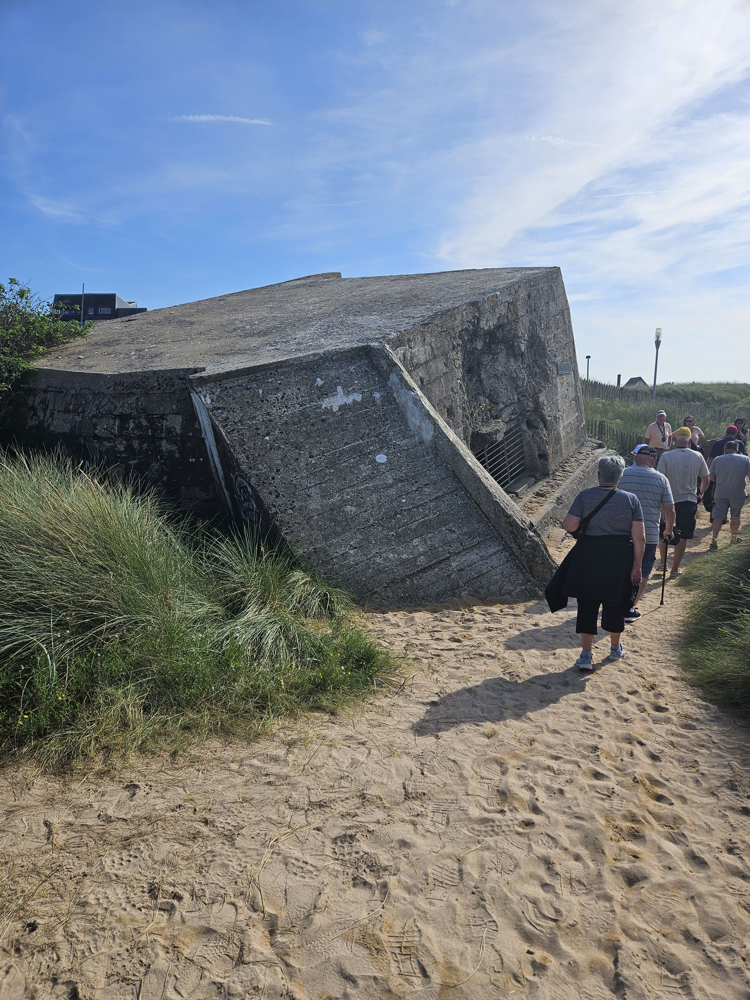

The stories of loss, heroism and personal sacrifice were very emotional. There are a great number of memorials to the units and individual actions but the individual stories put a human face on a horrific conflict. So to honour the fallen, I raise a glass (bottle).

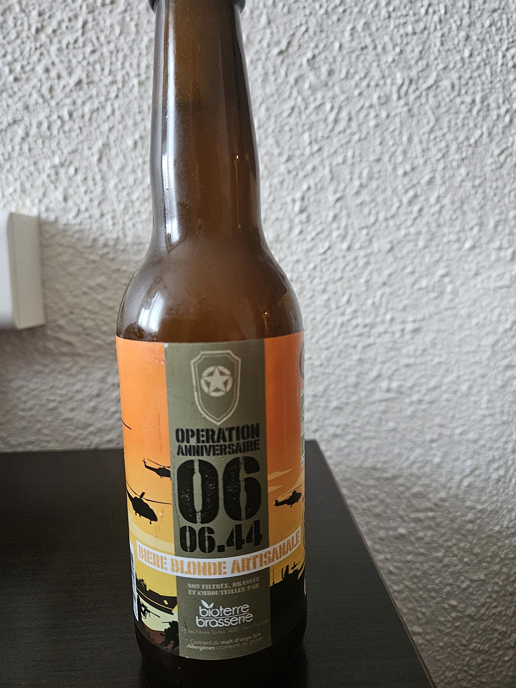

* [Second World War](https://www.paulsbattlefieldtours.com/blog/categories/second-world-war)
* [Battlefield Tours](https://www.paulsbattlefieldtours.com/blog/categories/battlefield-tours)
* [Family](https://www.paulsbattlefieldtours.com/blog/categories/family)