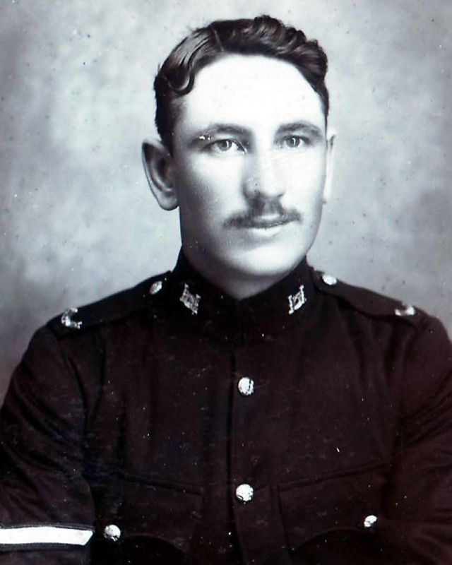
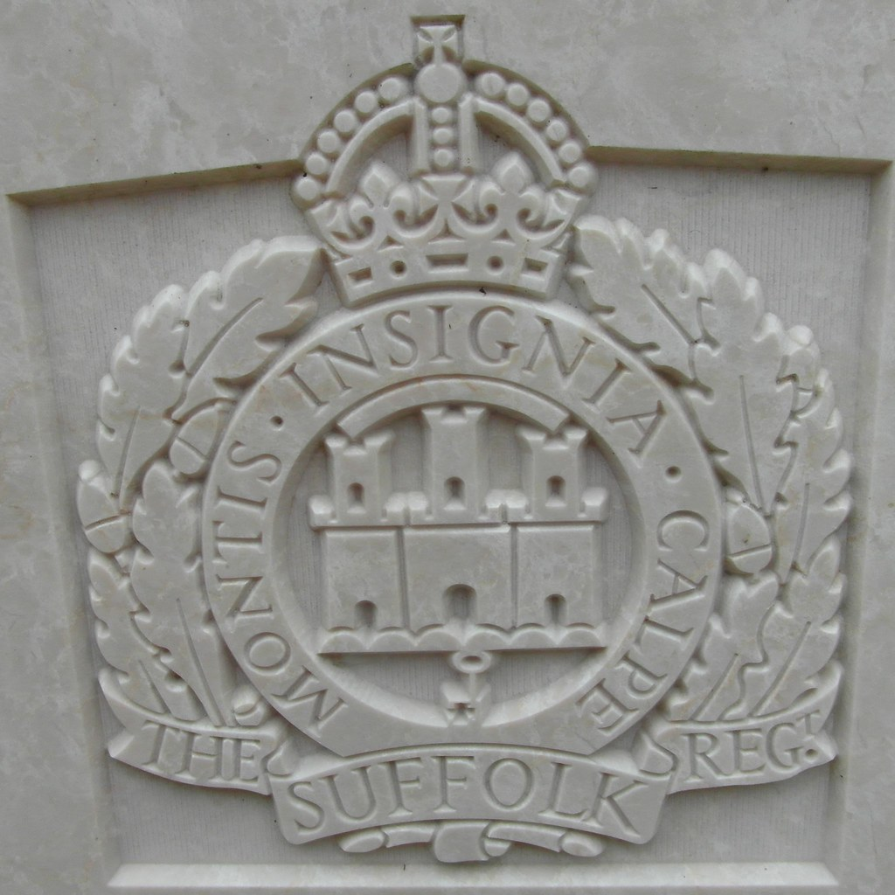
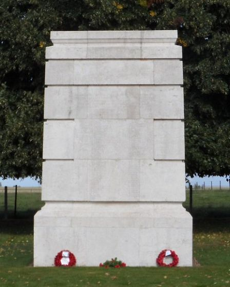
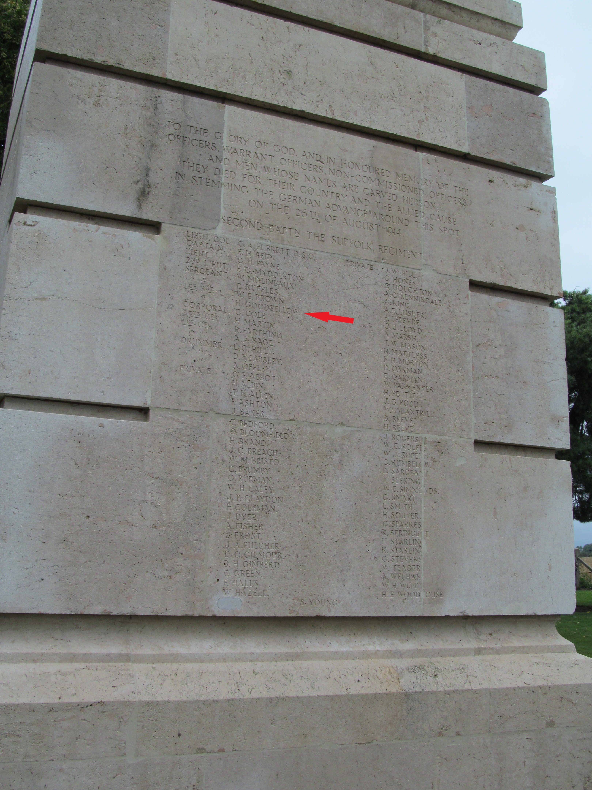

# Lance Sgt 6537Henry Goodfellow

* [pd-allen](https://www.paulsbattlefieldtours.com/profile/pd-allen/profile)
* Sep 9, 2023
* 5 min read

Updated: Sep 25, 2023

**Lance Sgt Henry Goodfellow**

Henry Goodfellow Sr and Maria Reynolds married on 29 August 1880 and had 8 children. Maria was 23 when they married and Henry Sr was 39, marrying after spending 21 years in the army in the 73rd Regiment of Foot, mostly overseas. He received 5 good conduct service badges, as well as the Silver Medal for long service and good conduct.

They lived at 44 Prospect Row, Bury St Edmunds. He worked as a Commissioner’s Labourer after retiring from the Army.

They had a total of 8 children including 4 Boys who all served in World War One:

· Service Number 6537 Henry Goodfellow 2nd Battalion Suffolk Regiment – Killed 26 Aug 1914

· Service Number 8426 Ernest Goodfellow 1st Battalion Suffolk Regiment – Killed 08 May 1915

· Service Number 12049 Walter Goodfellow 7th Battalion Suffolk Regiment - Killed 03 Nov 1915

· Service Number 16771 Thomas Goodfellow 2nd Battalion Suffolk Regiment - Survived

**3 Goodfellow Brothers Killed**

Henry Goodfellow was born on 27 March 1885, oldest son of Henry Goodfellow and Marie Reynolds. Henry joined the militia on 02 February 1903 and attested as a Private to the 3rd Battalion Suffolk Regiment on 09 July 1903, signing up for a 6-year term. After training he enlisted in the 2nd Battalion Suffolk Regiment. In April 1905 the regiment deployed to Bellary, India. As part of A company, Henry received the Good Conduct Badge in September 1905, and increased his service to 8 years. The photograph shows Henry as a Lance Corporal in India, where the Battalion remained until December 1906.

The Suffolk Regiment Crest

The Battalion spent a year in Aden, at the tip of Yemen in the Gulf of Aden, returning to Aldershot, the main British training base in England located 40 miles south-east of London. The 1911 census shows Henry, at the age of 26, located in Aldershot. Henry married Alice Brewster on 24 December 1911. The 2nd Battalion was deployed to Curragh, Ireland on 28 September 1913, and in February 1914, LCol C.A.H. Brett, DSO assumed command of the Battalion. The Battalion remained in Curragh until it deployed to France on 14 August. At the time of mobilization, Henry was a Lance Serjeant.

At the time, the standard practice would have been to have one regiment stationed overseas, and the other regiment serving in the UK. At the start of the war, the 2nd Battalion was in Ireland and the 1st Battalion was in Cairo, Egypt. The 2nd Battalion was deployed immediately, landing in Le Havre on 15 August 1914 aboard the SS Le Franc and the SS Poland.

Upon deployment the 2nd Battalion consisted of 998 members, 563 of whom were regular soldiers, and the remainder reserves, all of whom had military service, but had been in the reserves for up to 9 years. The Battalion landed at Le Havre, France on 15 August, and camped 5 miles from the port. In the evening of 16 August, the Battalion marched back to Le Havre, and took the train to Le Cateau. The train was a freight train with 40 cattle cars used to transport a Battalion of 1000 men and eighty horses with carriages for the officers and flat cars for the wagons. The citizens of Le Havre cheered the trains when they left, and the soldiers responded with a chorus of moos and baas. After a trip of 180 miles taking more than 24 hours, the Battalion disembarked in Le Cateau and marched to Landrecies where the Division was concentrated, arriving in the early morning of 18 August.

On the morning of 21 August, they marched with the 14th Infantry Brigade to St Waast, a distance of 20 miles. The next day they marched to Hamin, a further distance of 18 miles. During the march to Mons, the French villagers cheered on the troops and showered them with fruit, flowers, cigarettes and bottles of wine. On 23 August 2 companies moved into the line on the Mons-Conde Canal due west of Mons as part of the 14th Brigade.

The 14th Brigade as part of the 2nd Corps, was on the left of the line, with the 1st Corps on their right, next to the 5th French Army. At the start of the battle, the 2nd Suffolk Regiment was in reserve. They moved up to support the East Surrey Regiment as the battle progressed. As the main conflict was centred at the Mons Salient (curve in the canal) the Suffolks suffered only minor losses with 3 killed.

After holding the line for 24 hours, the BEF retreated in the face of a much larger German Army. After 2 days of hard marching under harassing enemy fire, the Suffolks reached Le Cateau at 10 PM on 25 Aug. Gen Smith-Dorrien, 2nd Corps commander decided to stand and fight to allow the remainder of the BEF to escape.

The British formations engaged in the Battle of Le Cateau were: II Corps: 37,000 men, 4th Division: 18,000, 19th Brigade: 4,000 and the Cavalry Division (less 5th Brigade): 9,000 for a total of 68,000 men, and 228 artillery pieces. General von Kluck’s First Army comprised 4 corps and 3 cavalry divisions; 160,000 men and 550 guns. Gen von Kluck had been pursuing 2nd Corps and believing that this was the entire BEF, pressed the attack in hopes of completely eliminating the British.

The Suffolks were told by their 14th Brigade Commander BGen Rolt and confirmed by the Battalion commander LCol Brett that they were to hold their positions and there was to be no retirement. The enemy shelling caused major casualties, and LCol Brett was killed early on in the shelling. When the German infantry advanced at 10 AM, fire from the machine guns and rifles was very effective. The Suffolks machine guns in particular was devastating. The Suffolks were overrun by 2:30PM, suffering 720 casualties, killed, wounded or missing. Many of the wounded were captured. Gen Smith-Dorrien later said the brave stand and sacrifice of the Suffolks, and the 5th Division saved the remainder of the BEF.

Henry Goodfellow was killed on 26 Aug, and his body never recovered. He is commemorated on the Suffolk Memorial at the site of the Suffolk’s stand. Only 6 of the men have a marked grave, the remainder of the men, including Henry Goodfellow, have no known grave and are listed on the La Ferté-sous-Jouarre Memorial to the missing, located 66 km east of Paris. The memorial commemorates 3,740 officers and men of the BEF who were killed at Mons, Le Cateau, the Marne and the Ainse between August and October 1914 and have no known grave.

Suffolks Memorial - Le Cateau

Henry's Name on the Memorial

The detailed story of Henry Goodfellow is given [here](https://pd-allen.wixsite.com/warstories/the-goodfellow-brothers).

* [First World War](https://www.paulsbattlefieldtours.com/blog/categories/first-world-war)
* [Family](https://www.paulsbattlefieldtours.com/blog/categories/family)