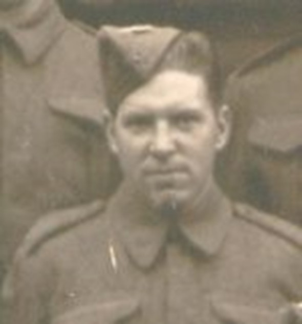
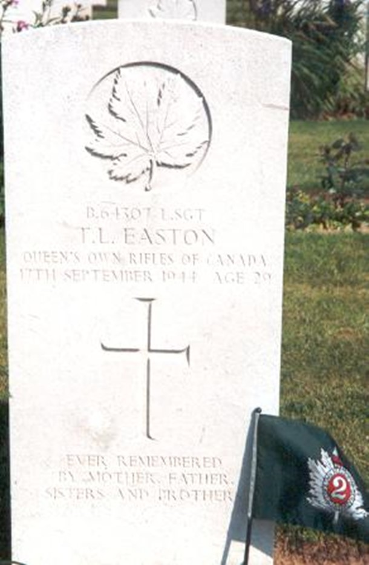

# Lance Sgt Thomas Easton

* [pd-allen](https://www.paulsbattlefieldtours.com/profile/pd-allen/profile)
* Sep 11, 2023
* 5 min read

Updated: Sep 16, 2023

##

## Early Years

Thomas Leonard Easton was born on February 17, 1915, in Sudbury to Harry James Easton and Florence Elizabeth Adcock. Harry and Elizabeth were both born in England and married in October 1906. Their first son, William Henry was born in England in 1907 and shortly after his birth, the family immigrated to Canada aboard the Empress of Ireland. By 1911, the family was living in Sudbury and Harry was a Locomotive Fireman for Canadian Pacific and they had four children.

On July 13, 1916, Harry enlisted in the Canadian Army and on September 13, 1916, he departed Canada from Halifax Nova Scotia aboard the SS Northland bound for England. By October 26, 1916, he was sent to France, classified as a Locomotive Engineer assigned to the 1st Battalion Canadian Railway Troops. He survived the war and returned home in March 1919. Harry and Florence had 7 children at this time, including Thomas. An eighth child, Bertram, was born on December 1916, shortly after his father departed for England. By 1920, Harry and family moved to Hornepayne Ontario where Harry was the Night Foreman for Canadian Northern Railway. In all Harry and Elizabeth had 13 children with the last 5 born in Hornepayne, Ontario. Later, Harry became the proprietor of a hotel in Hornepayne.

Thomas went to school in Hornepayne. From 1934 to 1939, he worked at various jobs for the Canadian Northern Railway. Thomas then travelled to Sudbury and worked for Frood Nickel Mine as a Mucker. The Frood Nickel mine produced 40% of the nickel used in the war effort. Because of its importance, King George VI and his wife Elizabeth visited the mine. When Thomas left the Frood Nickel Mine to enlist, his employer guaranteed him a job upon his return.

## Military Service

Thomas went to Toronto to enlist. The 1st Battalion Queen’s Own Rifles (QOR) was mobilized on 24 May 1940, and Thomas was taken on strength on 22 Jun 1940 in B Company. By 24 Jun, the Battalion was at full strength and moved to Camp Borden for Training. On 10 Aug 1940, the Regiment went to Newfoundland (Botwood and Gander) to protect critical infrastructure. The facilities were very minimal, and the Regiment made many improvements. Their success in a harsh environment made for a very resilient, tight-knit team. After several months, the QOR sailed to Debert, NS on the SS New Northland, a small ship that had to make 3 trips to transport the entire regiment. The 3rd Canadian Division was being established at Debert. The QOR, along with Regiment de la Chaudière and the North Shore NB Regiment were part of 8th Brigade. Intensive training took place over this 6-month period.

They sailed from Halifax on 19 Jul 1941 on HMT Strathmore, landed in Gourock, Scotland at the mouth of the River Clyde near Glasgow. The Regiment was then sent by train to Aldershot, the main British Army training area southwest of London. From Jul 1941 to Jun 1944, the Regiment was in Southern England, moving several times as their training became increasingly focussed on the D-Day Invasion.

On D-Day the QOR were in the first wave of the assault, landing at 'Nan White' beach near Bernières-sur-Mer at 8:05. The enemy fortifications on the 'Nan White' sector had been barely dented by the preliminary bombardment. The tanks scheduled to land in advance of the regiment were delayed. When the Regiment stormed the beaches, they received the worst battering of any Canadian unit on D-Day, suffering 61 deaths, and 82 wounded or captured.

Thomas’ B Company landed 250 yards east of its objective, directly in front of an enemy pillbox which inflicted 65 casualties within the first minutes. The assault depended on the resolve and courage of the remaining men to race across the beach to the seawall with no cover in between. One of B Company’s Landing craft had a jammed rudder so got ashore off course, but away from the pillbox. The tanks of the Fort Garry Horse finally made it ashore and despite heavy losses, the Regiment achieved their D-Day objective of Anguerny.

The QOR were part of Operation Atlantic and suffered heavy casualties near Colombelles. They were next involved in Operations Totalize and Tractable and involved in the closing of the Falaise Gap. The battle cost the German forces an estimated 450,000 men, of whom 240,000 were killed or wounded. The number of casualties in the Queen’s Own Rifles were very substantial, leading Thomas to be promoted to Lance Corporal on 15 Jul, Acting Corporal on 02 Aug and Lance Sergeant on 13 Sep 1944.

With the Battle of Falaise finished, the QOR moved up the coast to free the Channel port of Boulogne. They moved to La Capell located 5 miles east of Boulogne on 05 Sep. Boulogne was a heavily defended fortress with a garrison of 10,000 troops, with an interlocking network of defensive weapons and extensive mine fields. Careful preparations were required to attack the site.

Early on 17 Sep 1944, a heavy bombardment carried out by 200 bombers preceded the attack, as did a Typhoon Rocket Attack and an intense artillery barrage. B company quickly took their initial objective of Wicardenne, a suburb of Boulogne. About this juncture, Captain R. W. Sawyer, the company commander, who had been slightly wounded, was talking to a tank commander when a group of prisoners came by. One of them, a German sergeant, stepped on a mine. The resultant explosion killed both Captain Sawyer and his sergeant.

Lance Sergeant Thomas Easton was killed on 17 Sep 1944 during the first day of fighting at the Battle of Boulogne and buried on Rue de Beaurepaire by the wall Southeast of the School on 27 Sep. Street fighting carried on throughout the day, and cleanup for several days after. The final assault on the Fort de la Creche was carried out on 22 Sep with the remaining garrison of 500 surrendering as the bombardment continued. The casualties for the Battle of Boulogne were 20 killed in action, including Thomas Easton, and 58 wounded. A total of 185 officers and 8,500 Germans were taken prisoner by two under strength battalions of the Queen’s Own Rifles and the Regiment de la Chaudière, a triumph for these two units.

The QOR went on to win Battle Honours at the Scheldt, The Hochwald, Breskens Pocket and the Rhine. The Battalion returned to Toronto on 17 December 1945, some 645 strong. Only 12 Officers and men who departed with the Regiment in 1940 returned home. A total of 389 officers and men were killed, and another 873 were wounded, many more than once.

## Burial

Lance Sgt Thomas Easton was originally buried in Boulogne. In December 1945, his body was exhumed, and reverently reburied in grave 8, row A, plot 6 of the Calais Canadian Military Cemetery, St Inglevert, France. His grave marker has the inscription “Ever Remembered by Mother, Father, Sisters and Brothers".

* [Second World War](https://www.paulsbattlefieldtours.com/blog/categories/second-world-war)
* [Family](https://www.paulsbattlefieldtours.com/blog/categories/family)