# Langemark German Cemetery

* [pd-allen](https://www.paulsbattlefieldtours.com/profile/pd-allen/profile)
* Jan 30, 2024
* 4 min read

Updated: Jun 29, 2025

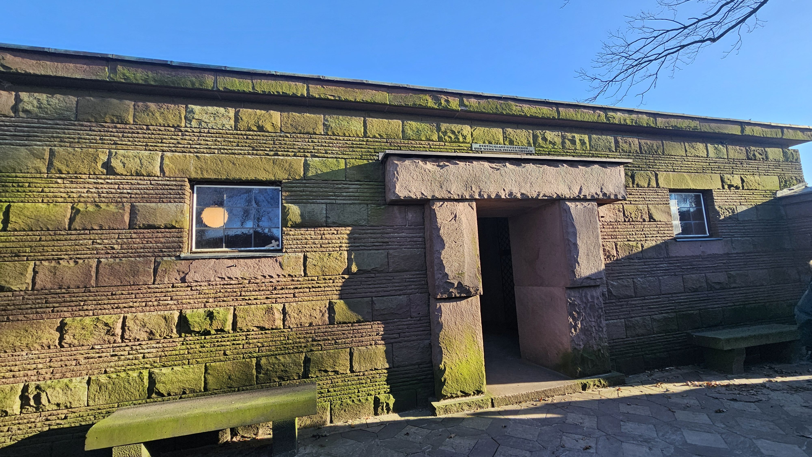

During our tour of Ypres, we visited Langemark German Cemetery just north of Ypres, one of the 4 German War Cemeteries in Belgium which contains the remains of 44,292 soldiers. These concentration cemeteries combine burials from over 678 cemeteries. A cemetery was started at this location 1915, and the permanent cemetery inaugurated in 1932. German cemeteries are seen to be dark and foreboding places, and Langemark is no exception. The entrance to the cemetery is shaped like a bunker, and the dark stone walls have a menacing appearance.

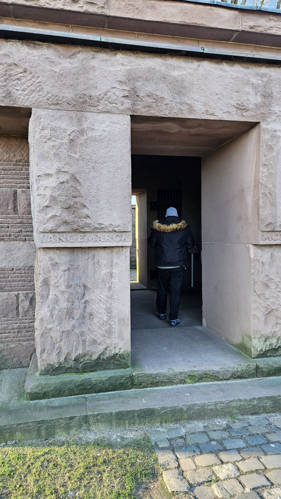

A high proportion of the casualties buried here were student volunteers. Exempted from military service while they pursued their studies at university or high school, they – together with their teachers – volunteered in huge numbers in 1914, inspired by that wave of enthusiastic patriotism which affected all the fighting powers at the beginning of the Great War. Inadequately trained, they were mown down by rapid rifle fire by the professionals of the British Expeditionary Force in the First Battle of Ypres – the abortive assault on Ypres in October-November 1914 which resulted in 50,000 German casualties to 24,000 British. This Kindermord bei Ypern – “Massacre of the Innocents” – would have tragic consequences, for among the young volunteers who survived the slaughter at Langemark in 1914 were the future novelist Ernst Jünger and a would-be Austrian artist serving with a Bavarian division called Adolf Hitler. More than 3,000 of the burials in this cemetery are from the young volunteers.

The story of the Massacre of the Innocents is reported extensively, and the presence of Hitler and Jünger were reported by one website I have quoted. During WW2 Hitler used Langemark as a propaganda tool, exaggerating the number of students killed, and the presence of Hitler and Jünger fabricated. Paul Reed, the Great War podcaster who has fueled our interest in the war says it is a myth, so that is good enough for me.

Langemark was not in German hands after the First Battle of Ypres, but came into their possession during the first Gas Attacks on 22 Apr 1915 and stayed into their possession for most of the war.

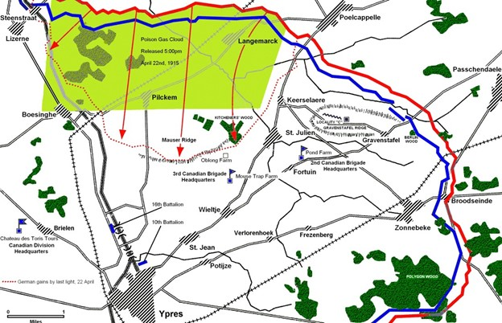

Inside the front entrance are two oak lined chambers. The chamber bears the names of soldiers originally buried in the cemetery on oak panels. The sign translates to “The German student body, their comrades and fellow Students.”

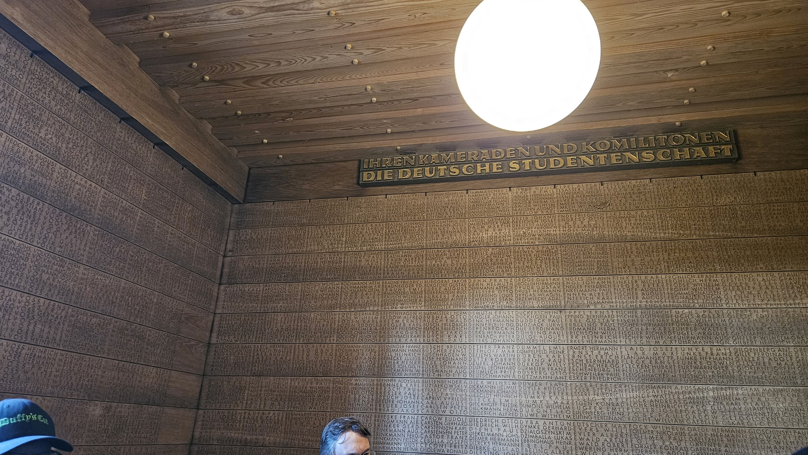

The other has a map carved on a wall showing of all the original German cemeteries in Belgium.

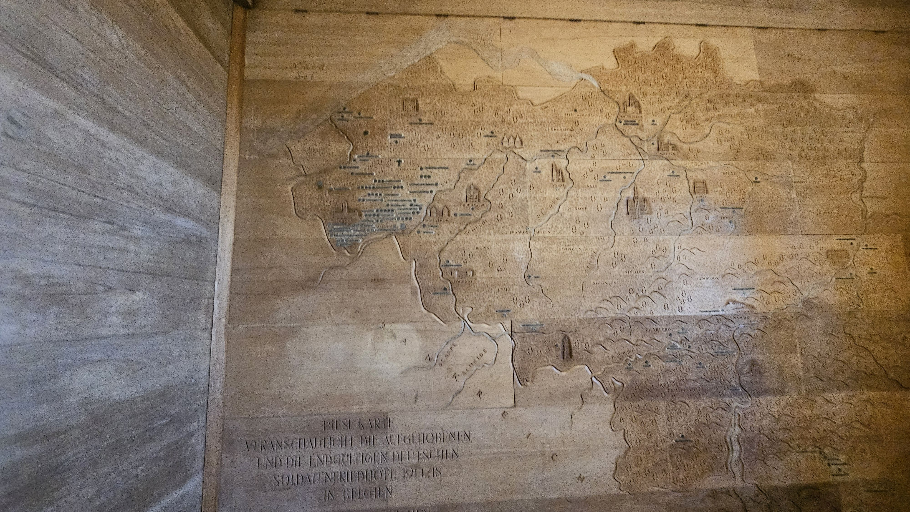

A close up of the location name. The cemeteries were concentrated after the war, then again in the 1950s down to the 4 present cemeteries.

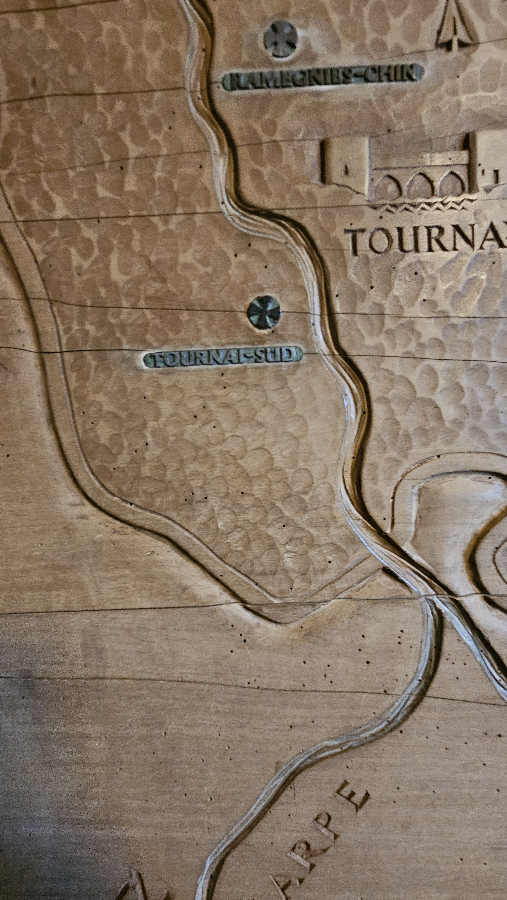

Today, the entrance leads immediately to the Kameradengrab, a burial chamber, containing 24,917 bodies. These burials are all bodies that were moved from the smaller cemeteries.

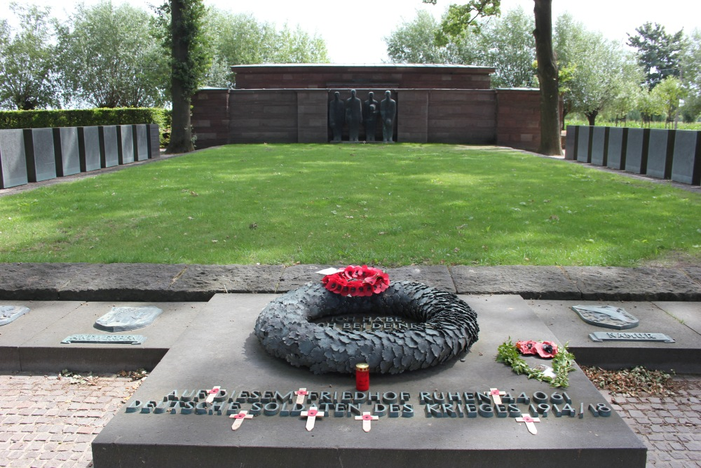

The names of 17,342 dead known to be among them are cast on free-standing bronze stele placed along the perimeter.

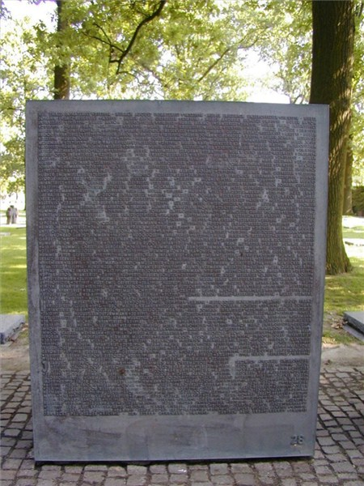

At the far end of the burial chamber are four bronze sculptures of mourning soldiers by Emil Krieger dating from 1956 (moved to their present position in 1984).

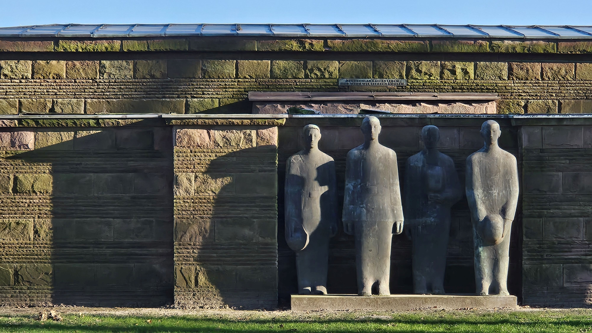

Elsewhere, 10,143 bodies lie under lettered squares of granite placed on the ground, which replaced the original wooden crosses in 1971.

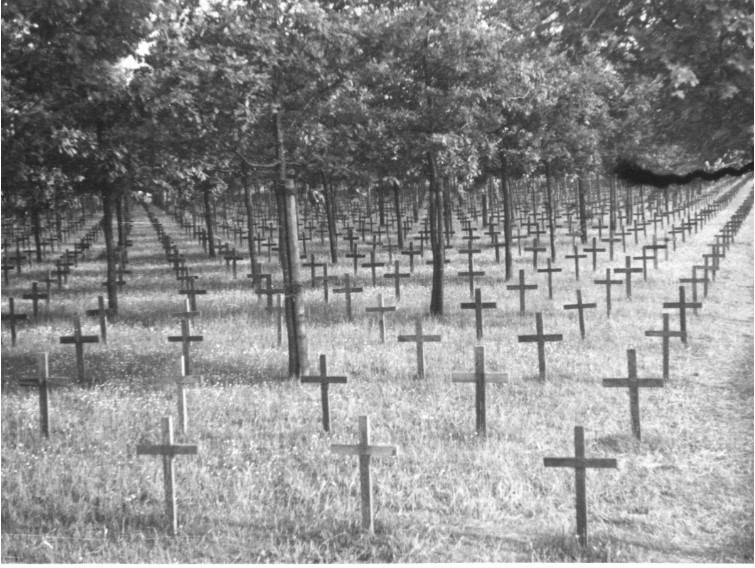

It became too expensive to maintain the crosses, so in 1971 the crosses were replaced with flat marker stones. The groups of 3 crosses are architectural to break up the sight lines. Oak trees are planted throughout the cemetery, a traditional German sign of strength to honour the graves. The trees heavily shade the cemetery adding to the darkness of the view. This picture was taken recently, with all of the leaves off the trees, hence the sunlight.

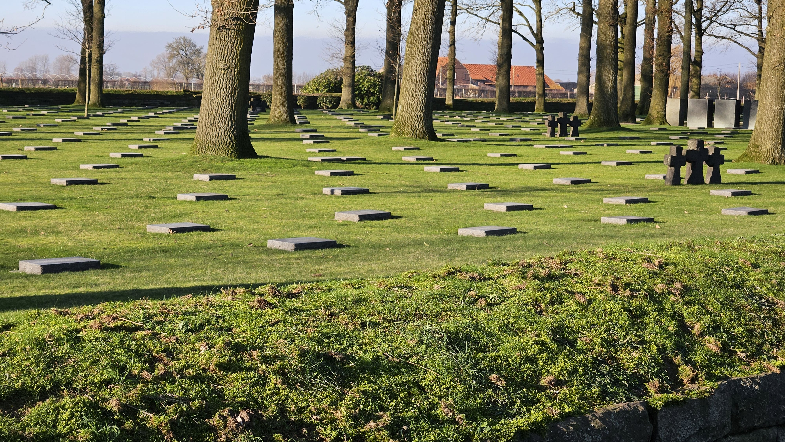

The buried all have individual graves, but the plaques list multiple names of people buried in the area, and do not represent mini massed graves.

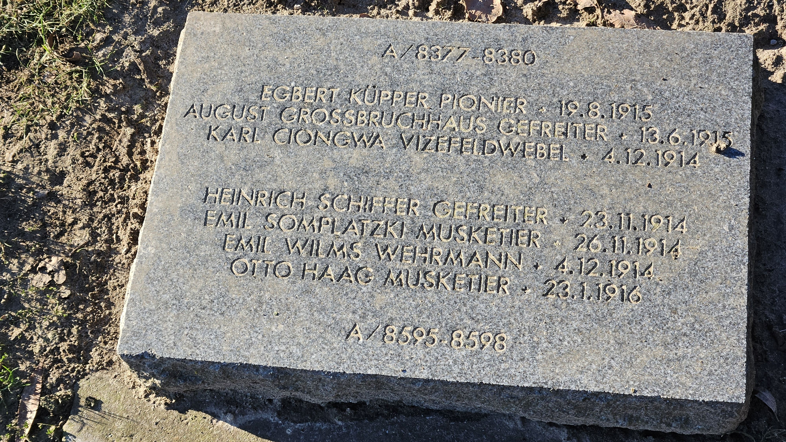

There 3 German bunkers in the cemetery. They were used to house soldiers during the war. The bunkers were refurbished when the cemetery was inaugurated leading to some comments that they were new.

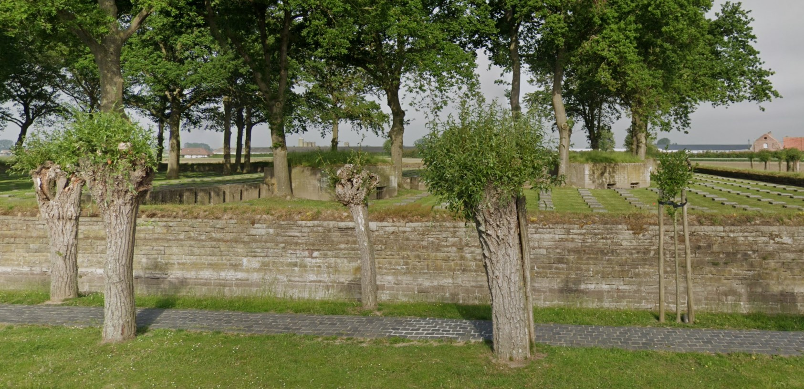

The Germans do not have memorials to the missing, so those with no known grave do not have a memorial like the Menin Gate, Thiepval, Loos, Tyne Cot, Pozieres to celebrate the missing.

# Commonwealth Cemeteries

As has been featured prominently in my posts, the Commonwealth War Grave Cemeteries are light and peaceful places, intended to resemble and English Garden. The cemeteries are all slightly, or dramatically, different and the collection of small battlefield cemeteries is part of their charm.

The cemeteries are immaculately groomed with flowers and plants at every site, and a ring of trees outlining the cemetery borders.

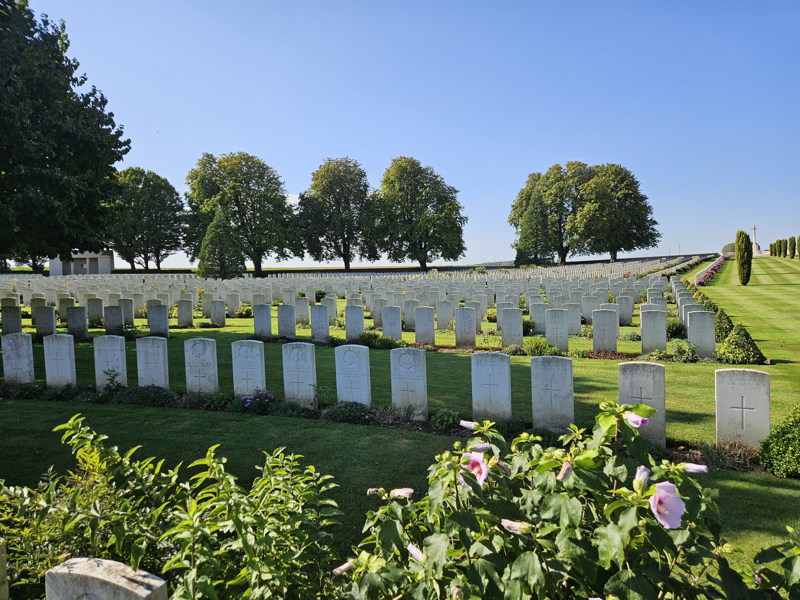

Many cemeteries have elaborate structures defining the entrances, indicating this is a place of reverence.

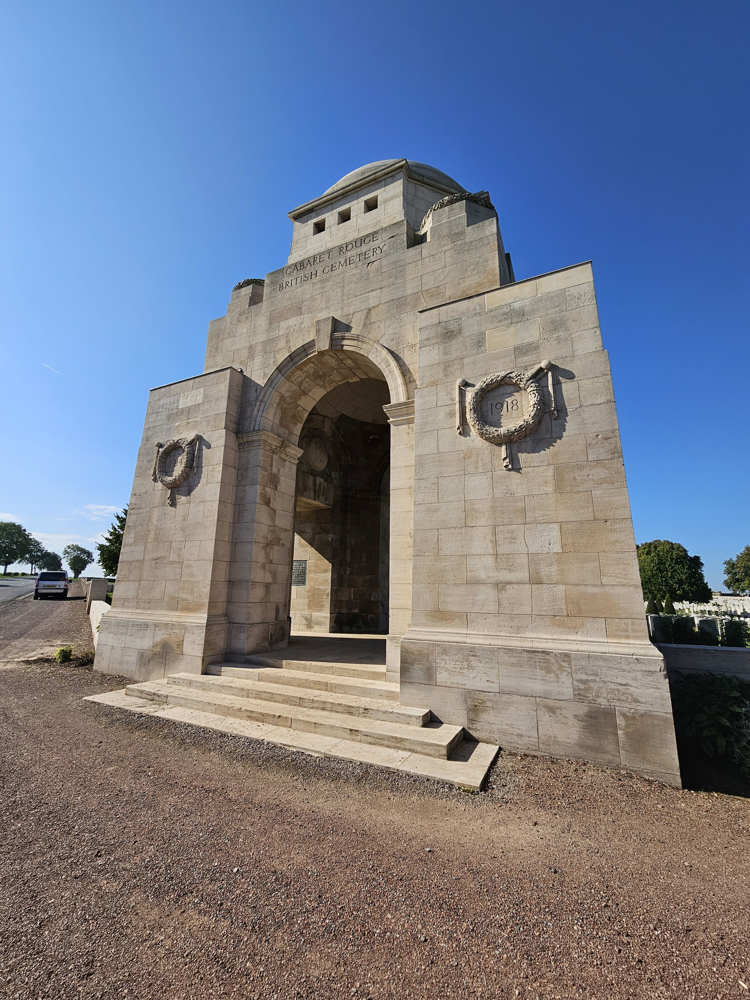

The headstones are almost always made of white granite, and they shine in the sunlight. The headstones also identify the country and regiment of the fallen and often include date of death, age and a personal inscription. The lovely flowers are also in evidence.

# French Cemeteries

Many of the French fallen were repatriated to their hometowns. The French cemeteries are generally large collection cemeteries, like the Necropolis Notre-Dame de Lorette that I visited on my tour last fall. The Necropolis is the largest French Military cemetery in the world, with more than 40,000 remains held in the cemetery and 8 ossuaries. The ossuaries hold 23,000 bodies, with the remainder in individual graves. The Basilica and a few of the crosses are shown here.

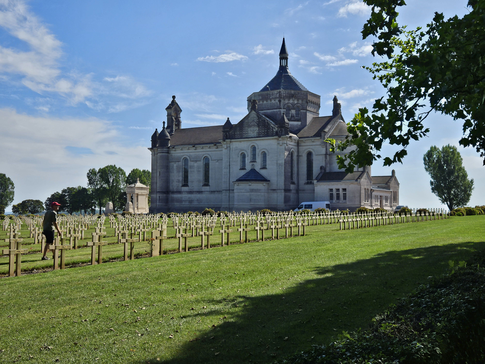

The size of the cemetery is difficult to capture from the ground, but this gives an idea of the extent of the grounds.

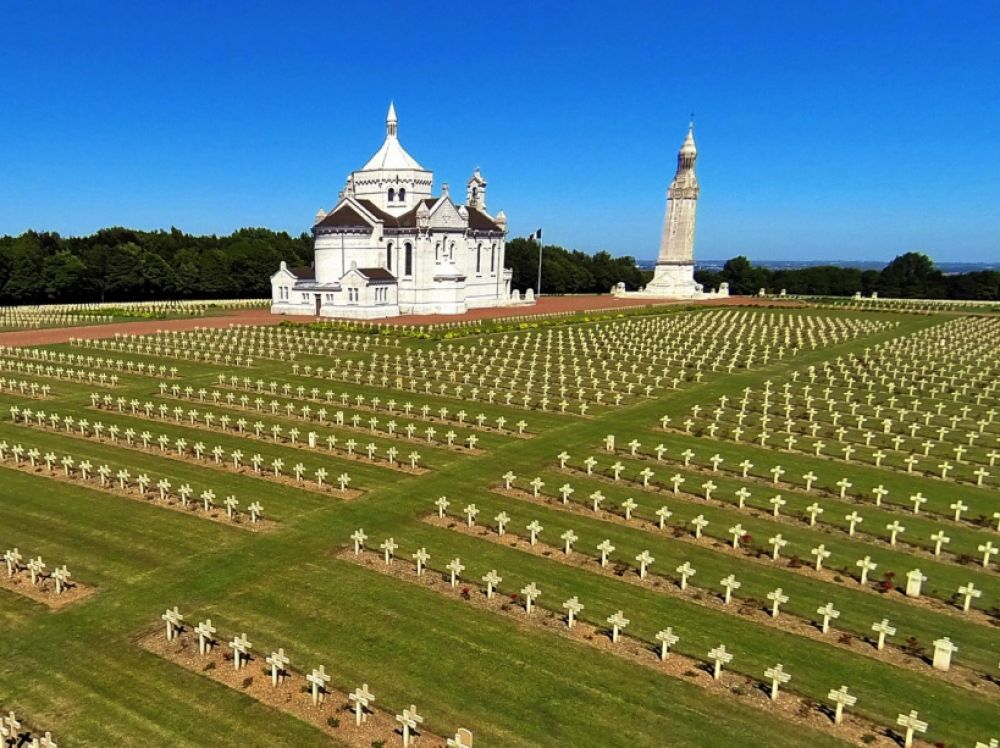

The graves are placed head-to-head, with cement crosses marking the graves.

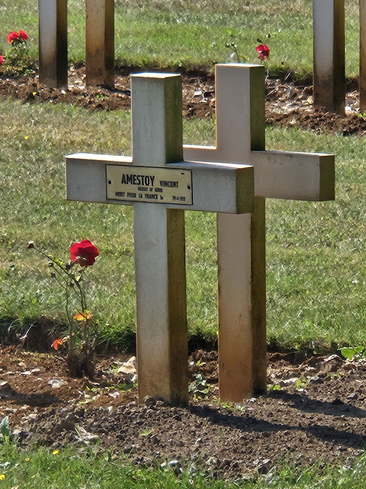

Each country has its own way of memorializing their fallen. It may because I have spent the most time in Commonwealth Cemeteries, but they are definitely the most beautiful and well cared for and seem to be the most intimate. I really like the unit badges on the headstones, every cemetery we go into we look for the Canadian markers, and I always scan for any Suffolk Regiment soldiers, the Goodfellows’ unit. This marker is in the Queen’s Cemetery at the Sheffield Memorial Park on the Somme.

* [First World War](https://www.paulsbattlefieldtours.com/blog/categories/first-world-war)