# Last 100 Days - Amiens 08 Aug 1918

* [pd-allen](https://www.paulsbattlefieldtours.com/profile/pd-allen/profile)
* Apr 25, 2024
* 9 min read

# Introduction

I recently visited Arras with the intention of tracing the three main battles of the Canadian’s Last 100 days of the War in 1918. For this tour, I am using the excellent books by Ottawa Historian Norm Christie, who gives a detailed description of the Battle and outlines an

extensive tour of the battlefields. The three Battles of Amiens, Arras and Cambrai all follow his descriptions and tours.

The book series is called For King and Empire, a collection of 10 small books each dealing with a Battle of the First World War. Norm also did a TV series with the same name that is available on You Tube. It is an excellent series and does a great job explaining the Canadian Role in the War. [For King and Empire](https://youtu.be/JCeDt4SXPZI?si=MnVuHrWdOLeXCb7P) is definitely worth watching to get a new perspective on the War. Episode 5, [Masters of War](https://youtu.be/Fgmrz-IaqAg?si=1hFaw3gAJ93SeSmr), covers the Last 100 Days campaign. Norm spent several years working in the Commonwealth War Graves Commission and is very knowledgeable and passionate about the Canadians in the War.

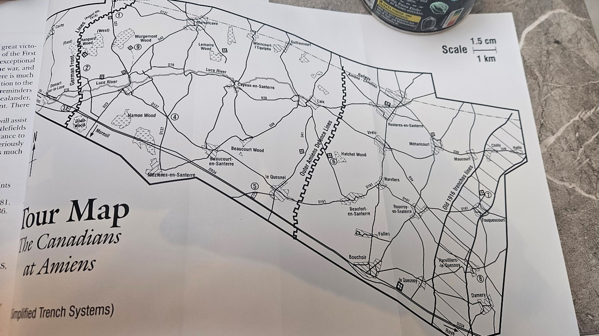

# German Offensive Mar 1918

On 21 Mar 1918, the Germans launched a massive offensive from Cambrai to St Quentin. In 3 weeks, they regained more than 60 kms of land that had been fought over for 3 years, threatened Amiens, potentially splitting the French and British Armies, and potentially winning the war. The German assault faltered due to battle fatigue and increasingly long supply lines, so by June the Allies were planning their counterstrike.

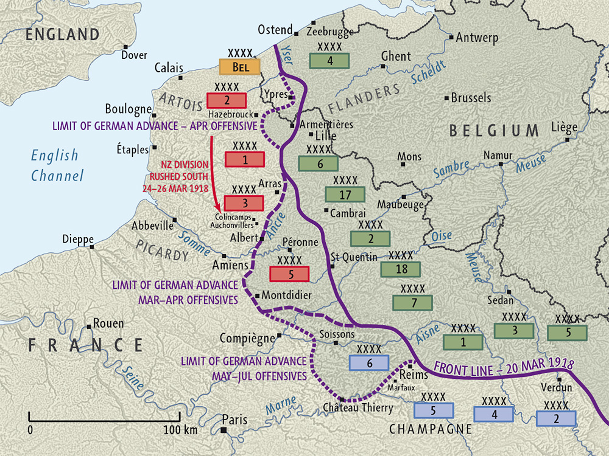

The Canadians were in Arras, and largely left out of the fighting. The British counter-offensive was to be centred out of Amiens, with the Canadians and Australians leading the attack. The Canadians were known by the German to be the Shock Troops, so their positions were carefully monitored. In order to maintain surprise, the Canadians sent two battalions, a Signals Company and an aid station north to Ypres and generated a great deal of false communications traffic to sell the ruse. The Canadians moved the remainder of their troops south to Amiens, travelling only at night. They arrived at Amiens just before the battle.

Due to lack of personnel, the British Brigades had reduced their number of Battalions from 4 to 3, and usually only fielded 650 rifles per Battalion. The Canadians were at full strength, adding 100 extra men per battalion for a total of nearly 1100 rifles per Battalion, so the Canadian Divisions were 50% larger than the British. Similarly, the Canadians put great importance on their Engineering Corps, and fielded a corps that was three times the size of British Engineering units. The larger Engineering corps allowed the Canadians to prepare positions more quickly and had sufficient manpower to do their own labour and not have to rely on the infantry for working parties.

# Battle of Amiens – 08 Aug 1918

The Battle of Amiens was the first truly combined arms assault, with 2000 Artillery pieces, 400 tanks, 800 aircraft all working in concert with the Infantry assault. The Canadians were able to move their troops in secret, and in the days leading up to the attack, Royal Flying Corps aircraft constantly circled the sky to mask the sound of the tanks moving into position.

At this point of the war, the Canadians were very proficient at using flash spotting, sound ranging and aerial photographs to locate German Artillery, so their gun positions were mapped prior to the start of the battle.

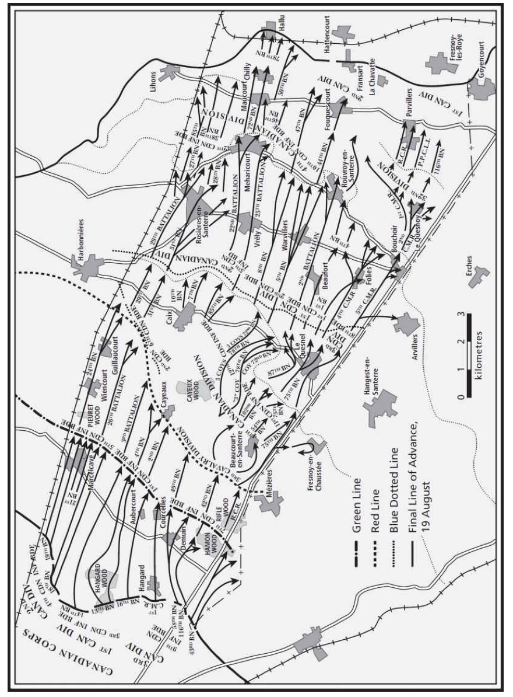

At 0420 on 08 August, the artillery barrage began. The infantry advanced behind a creeping barrage that was much faster than the barrage used at Vimy due to the open terrain and lack of German strong points. There was a heavy mist that morning that aided the attackers and, in many cases, they were on the German front lines before the Germans realized an assault had begun.  The German defences largely consisted of Barbed wire, machine gun nests and artillery. The Canadians progressed an amazing 13 km in a single day, the largest Allied one-day advance of the war.  Progress was often made by individual acts of heroism. When stopped by machine gun fire, one person or a small group would attack and take out the machine guns, allowing their unit to progress. The tanks were effective taking out pockets of resistance, but many tanks broke down or were bogged down. The Canadian suffered 3,868 casualties that day including 1,036 killed.

On 09 Aug the attack continued, but with no surprise and fewer tanks and artillery, progress was much slower. The Canadian Corps advanced more than 6 km but suffered 2,574 casualties. By the third day, the Germans had brought up 6 Divisions as reinforcements, and the battle ground covered old Somme defences, so the defenders were much better dug in, and only small advances were made.  The battle carried on for a few more days,  was called off due to mounting losses.

The Canadians suffered 11,822 casualties capturing 9,131 Germans and 23 km of territory. The German General Ludendorff called 08 Aug the “Black Day of the German Army” and the Kaiser knew the war was lost. They continued fighting so they would not have an unconditional surrender.

# Amiens Tour

The tour mapped out by Norm Christie relies heavily on the cemetery locations, as they are often the only indication of battle, and the cemeteries were usually built where a concentration of troops fell, so right in the middle of the battle.

The maps show the points visited in order, normally the tour runs down one side of the battlefield and back across the other side to make best use of travel time. Due to the large areas captured each day, this was definitely a driving tour.

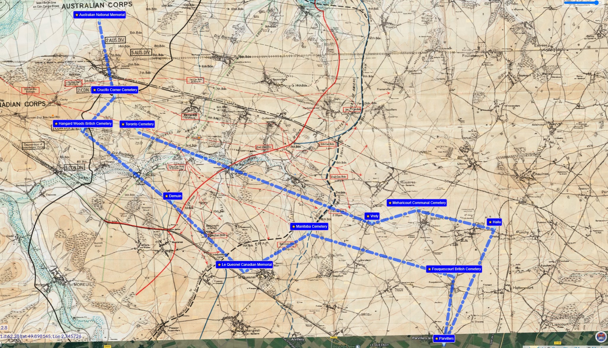

The first stop is at Crucifix Corner Cemetery, at the start line for the 2nd Division on the left of the line.

The view across the battlefield shows how flat the land is. It is largely farmland with occasional small crops of trees. The view shows the start line for the 2nd Division troops.

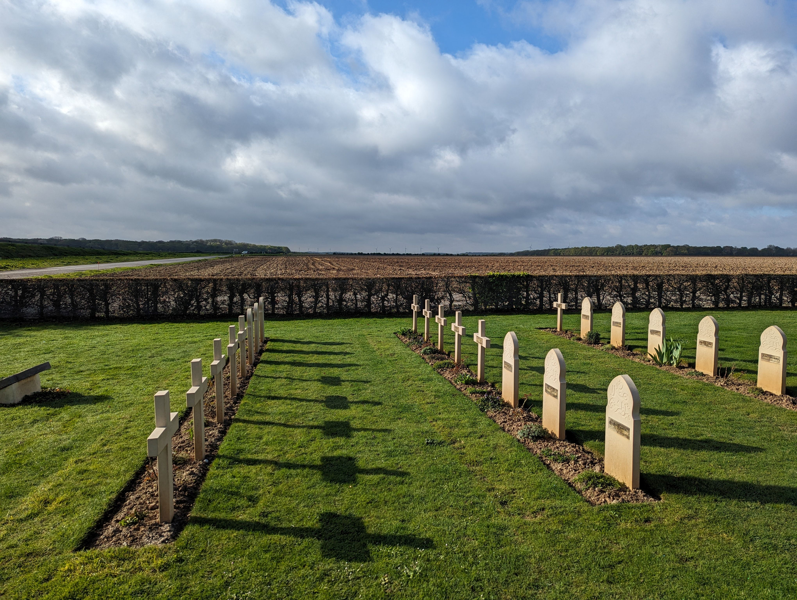

The cemetery was started in 1918 and expanded after the war. It has 656 burials, 76 Canadians (6 unidentified), 293 Australians who were on the left of 2nd Division and 142 French and Moroccan Graves. The French graves are marked by Crosses, and the Moroccans by the unique stone shown below.

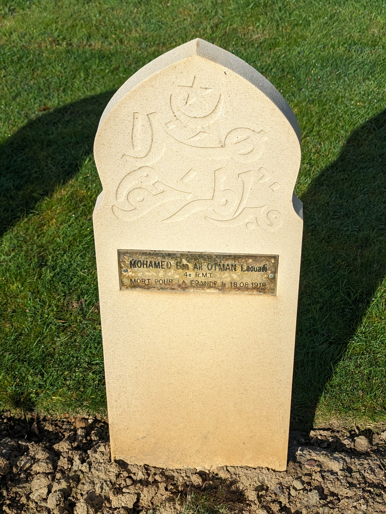

The next stop was the Hangard Wood British Cemetery. The drive took me across the Canadian front lines to the position where the 1st Division jumped off. The view from the cemetery west shows the location of the German Front lines. Again, the Canadians are attacking across open, rolling fields.

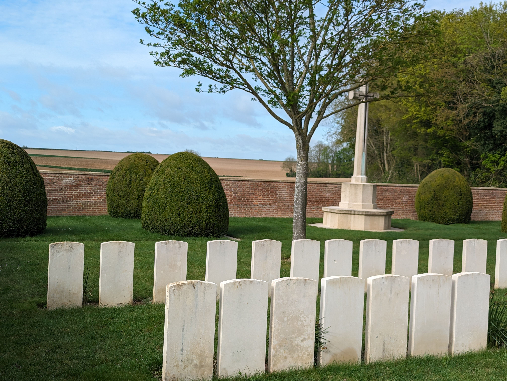

The 1st Division was attacking from the left of the map. The elevation profile is shown across the blue line which was the advance of the Canadians. As can be seen, the Canadians start out on high ground, but have to go into a valley and attack up hill. As usual the Germans occupy the high ground, and the Canadians have to advance over open ground. In Hangard Woods British Cemetery, 58 Canadians were killed on 08 August, including Pvt John Croak who single handedly attacked and silenced a machine gun post, then despite being heavily wounded, attacked another strong point and bayoneted the crew. He was mortally wounded during the second assault and was awarded the Victoria Cross for his actions. This action of a single man or small group is typical how the Canadians fought and died during the advances of the Last 100 days. It is very moving to see the numbers of men killed on the same day, likely within minutes of each other.

The next stop was the Hourges Orchard Cemetery, which was in the front lines of the Canadian 3rd Division. The Division had to negotiate the swampy valley of the Luce River as part of their attack. Once again, the Canadians are attacking from the red trench lines on the left.  The blue line shows the route to the German 2nd line trench, again up hill over open ground.

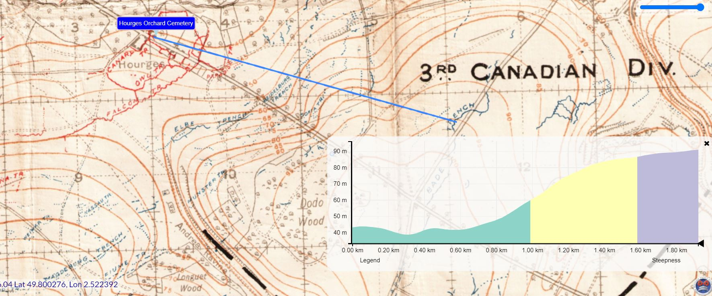

116 of 120 Canadians buried in this cemetery were killed on 08 Aug.

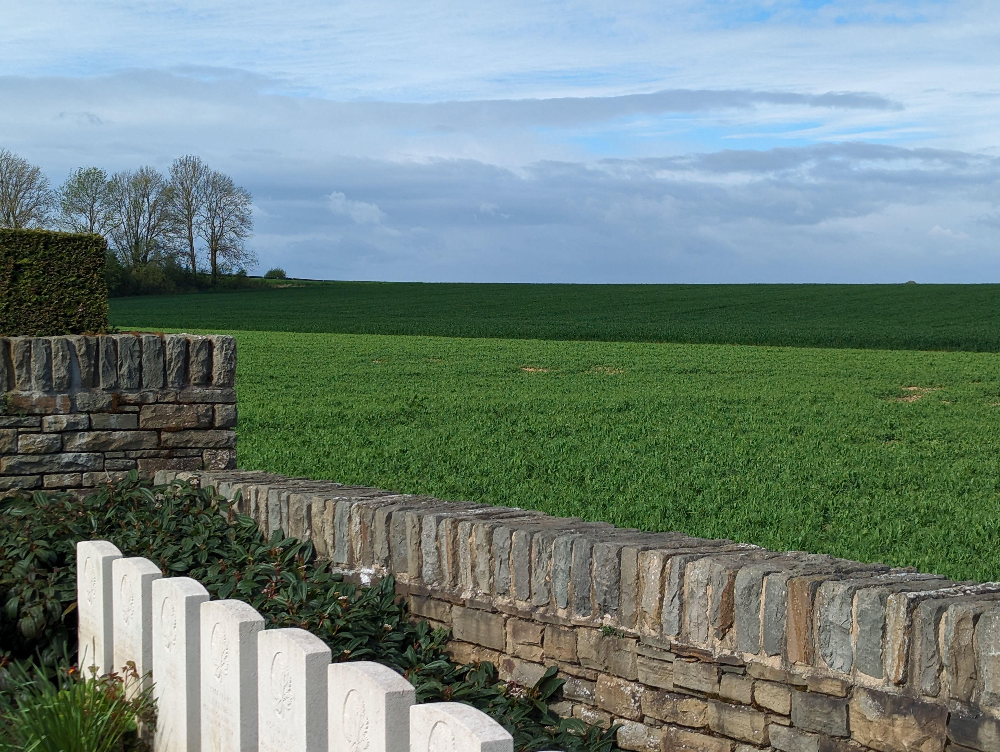

Most of the headstones have two names on them, as the original graves were placed close together.

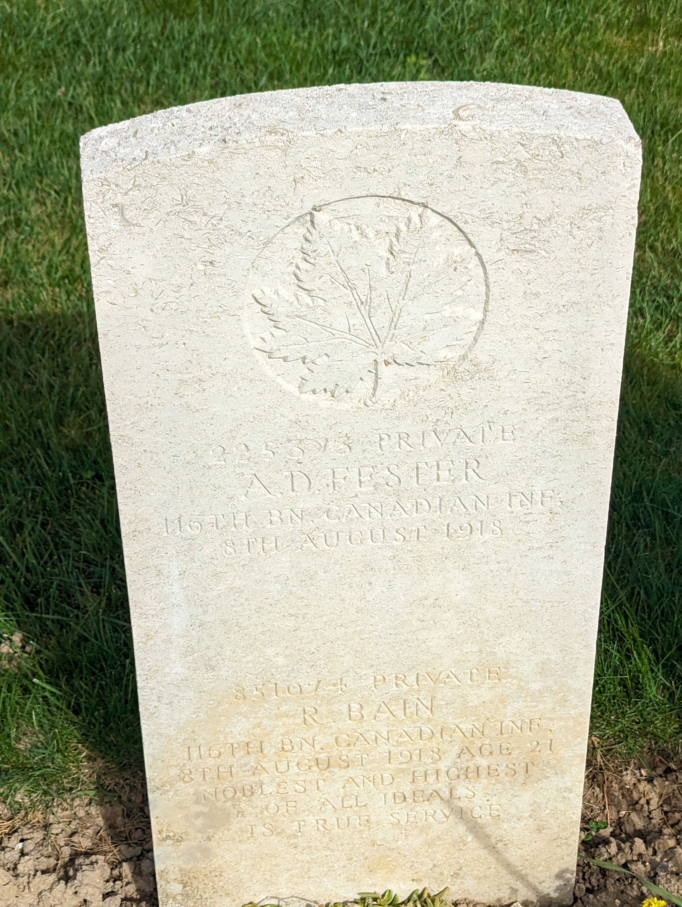

Next stop was the Le Quesnel Canadian Memorial.  This memorial was significant to me as it completed my set of Canadian Memorials. Ironically, the monument is located at Le Quesnel, the only Canadian Objective not reached on the opening day of the battle. Le Quesnel was taken at 0430 the next morning as the assault continued.

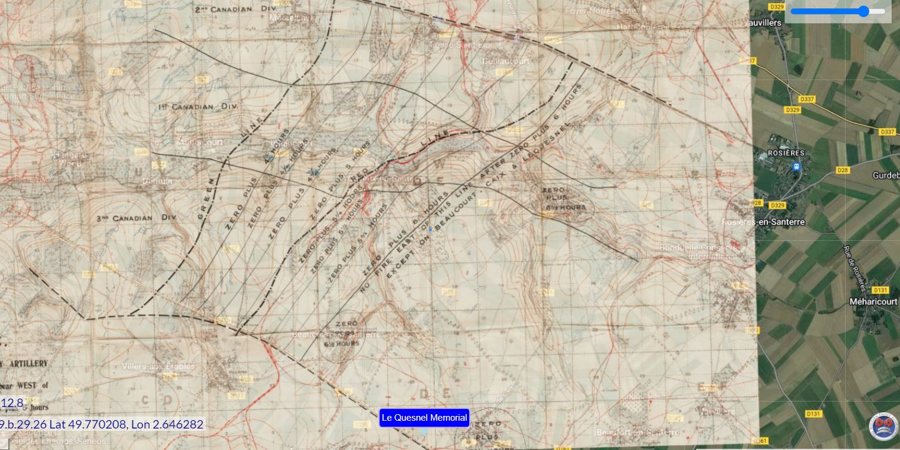

There are 8 Canadian Memorials in France and Belgium: Vimy Ridge, Brooding Soldier outside Ypres, and the 6 granite blocks at St Julien, Hill 62, Courcelette, Passchendaele, Le Quesnel, Dury and Bourlon Wood. The last two memorials are also associated with the Last 100 Days, so we will revisit them soon.

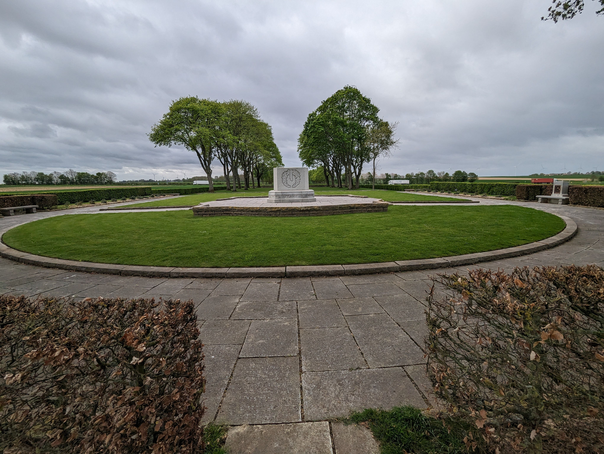

Each of the granite blocks commemorates a specific battle.

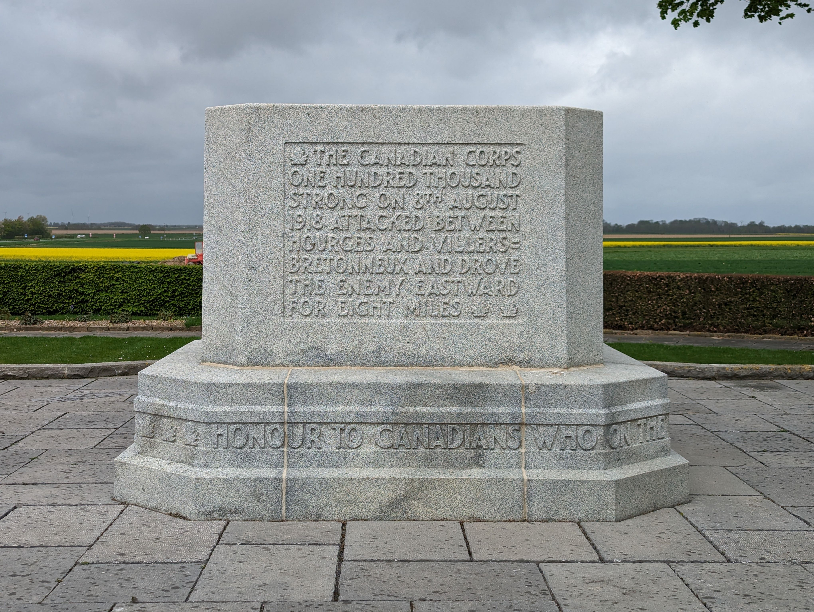

Next up in Manitoba Cemetery, the site of the 1st Division Attack on 09 August. There was no element of surprise, limited artillery and few tanks on the second day of the battle. Due to difficulties in getting organized, the attack did not commence before 1000, and the flat land left the Canadians vulnerable to machine gun fire.

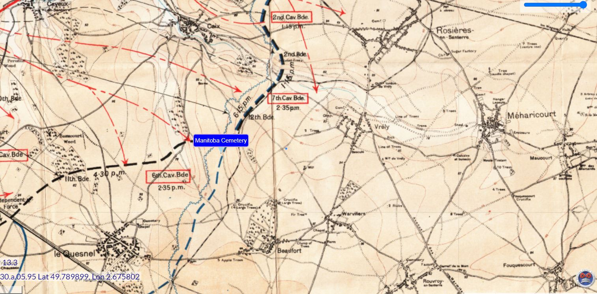

By the end of the day, the Canadians had pushed forward another 5km, taking a number a villages up to Meharicourt. The 8th Battalion suffered particularly with 66 members killed on 09 August and buried in the Manitoba Cemetery, including their CO, LCol Thomas Raddall.

The next stop is Fouquescourt British Cemetery site of the 4th Division attack on 10 August.

This area was the front line back in 1916, so was riddled with old trenches, bunkers and barbed wire. The trench map shows the state of the trench systems from 1917. The Germans effectively used the old trenches to mount a ferocious defence.

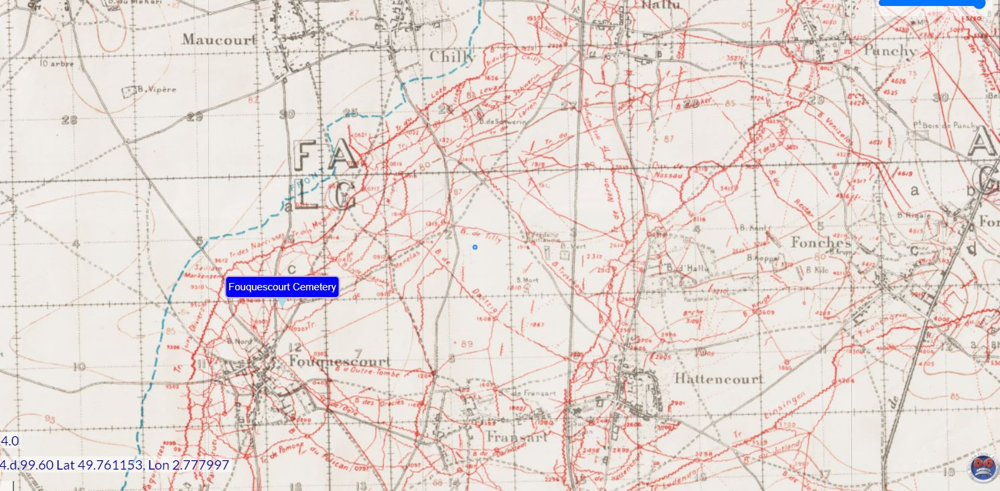

The farmland is very flat in this area, compounding the Canadian problems, as there is nowhere to hide.

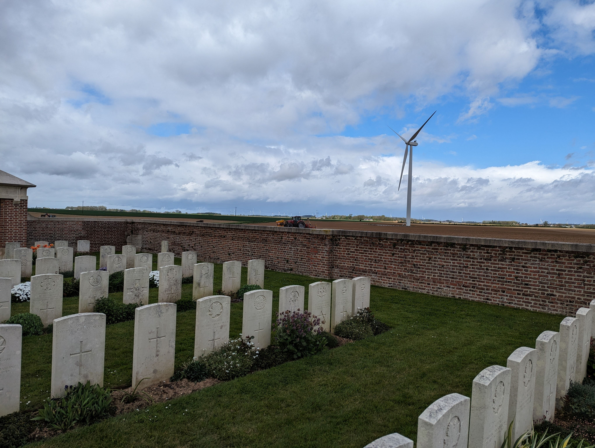

The view in the opposite direction shows the flatness of the terrain.

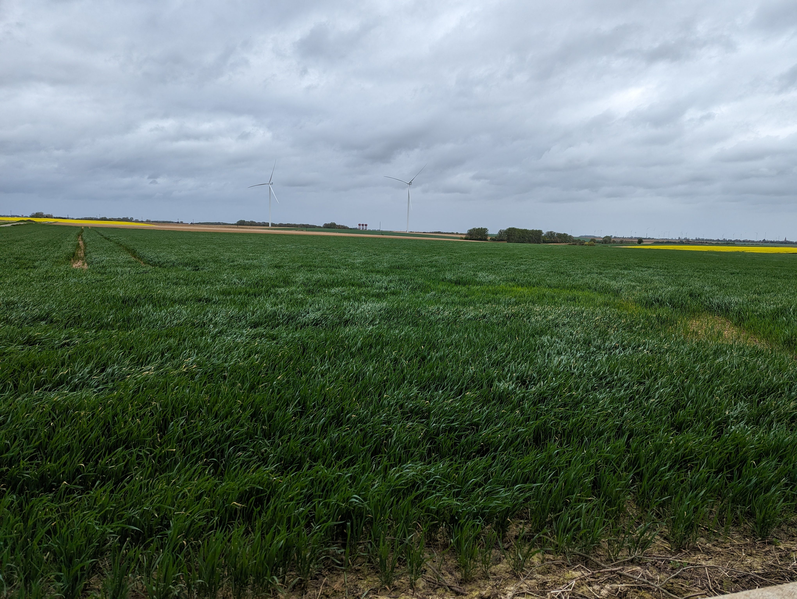

Several cemeteries have grave markers commemorating soldiers whose burial place was registered, then later lost, usually when the fighting came back to a location and destroyed existing graves. The block in front has the inscription:

*“To the memory of these five soldiers of the British Empire who fell in 1917 and were buried in Assevillers Military Cemetery Fonchette Churchyard and Chaulnes German Cemetery but whose graves are now lost. Their glory shall not be blotted out.”*

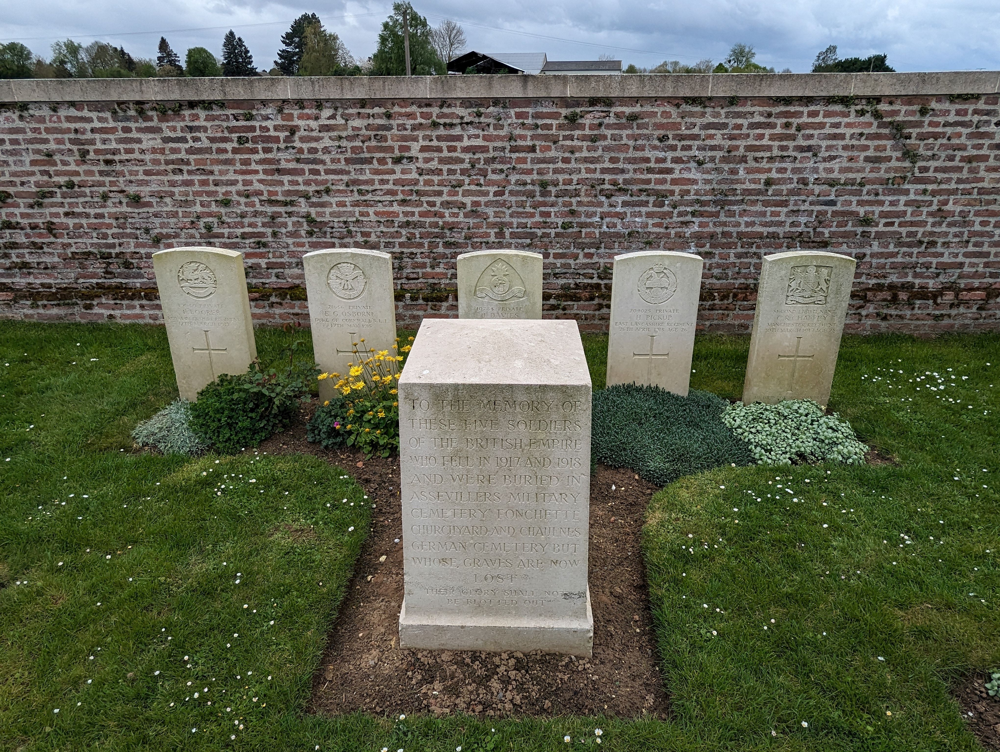

This cemetery was made after the war and concentrated a number of small cemeteries in the area. There are 373 burials, 137 Canadians, 54 of whom are unknown, at 39% Fouquescourt Cemetery has the highest proportion of unknowns of any 1918 cemetery. Unlike the cemeteries from earlier in the war which had a high concentration of Unknown soldiers, the 1918 cemeteries usually have a low percentage of unknowns as the battles were battles of movement, and the ground was not fought over multiple times.

Believed to buried among the unknowns is Lt James Tait, who won the Victoria Cross for attacking a hidden machine gun emplacement. Since he was a VC winner, a special headstone was erected to honour his efforts.

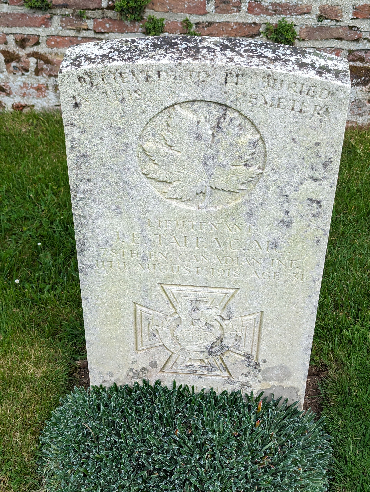

Next stop are the open fields near Parvillers, where the 3rd Division battled from 12-15 August. The village was taken several times, then recaptured by the Germans with furious counterattacks. On 15 August the village was finally held. Nothing but flat farmland can be seen today.

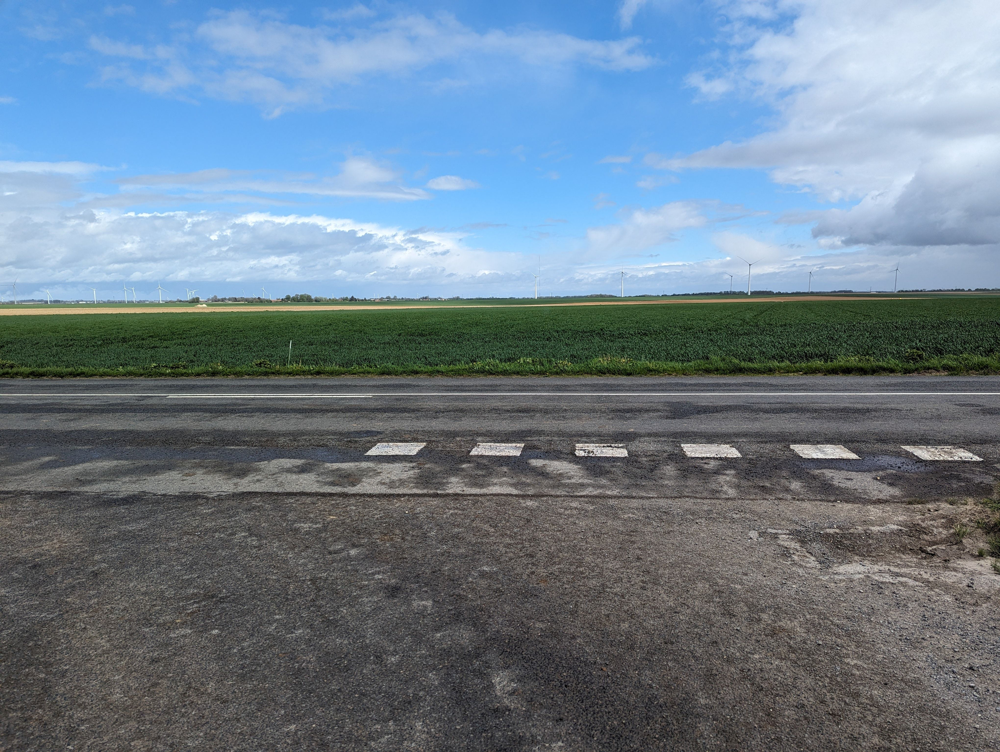

The next stop is just outside Hallu. This is the location where Lt Tait won his VC for putting a machine gun out of action and leading to the capture of an additional 12 machine guns and 20 prisoners.

A bonus stop along the way was at the Meharicourt Communial Cemtery, the final resting place of 41 Second World War Airmen.

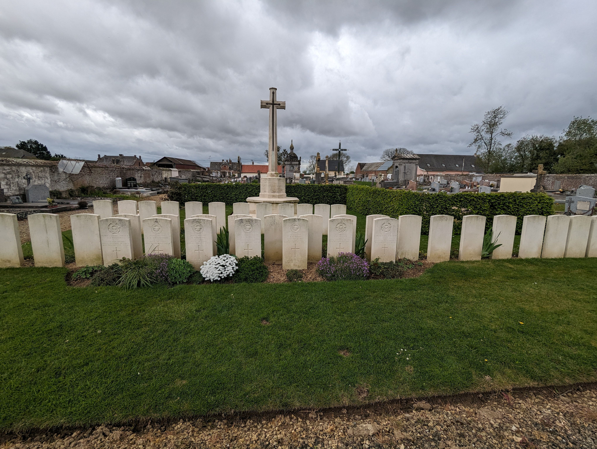

Of special interest is the grave stone of Pilot Officer Andrew Mynarski, Victoria Cross Winner.

*The following details are given in the London Gazette of October 11th, 1946: - P/O Mynarski was the mid-upper gunner of the crew of a Lancaster attacking Cambrai, France on June 12th, 1944. The aircraft was hit by an enemy fighter; both port engines failed, extensive fire broke out, and the captain ordered the crew to abandon the plane. As P/O Mynarski moved towards the escape hatch he saw that the rear gunner could not leave his turret, which was rendered immovable when the hydraulic gear was put out of action by the failure of the port engine. The Pilot Officer unhesitatingly moved back through the flames and tried to release the gunner, although his own clothing and parachute were on fire. All his efforts to move the turret and free his comrade were in vain, and eventually the gunner told him to try to save his own life. Reluctantly P/O Mynarski moved to the escape hatch and there, as a last gesture, turned towards the trapped gunner, stood to attention in his flaming clothing, and saluted before jumping. French people watched his descent and he was eventually found, but was so badly burned that he died. The rear gunner escaped miraculously when the plane crashed and testified that, but for his gallant rescue attempt, P/O Mynarski could have left the aircraft in safety and would doubtless have escaped death. Although he must have been aware that he faced almost certain death, P/O Mynarski courageously and willingly accepted the danger. He lost his life by a most conspicuous act of heroism which called for valour of the highest order.*

The tail gunner survived the crash some 40 kms away, and was taken prisoner. He reported Mynarski’s actions after the war, and Mynarski was posthumously awarded the Victoria Cross.

The personal inscription on his headstone reads:

*IN MEMORY HE WILL ALWAYS LIVE. EVER REMEMBERED BY MOTHER AND FAMILY*

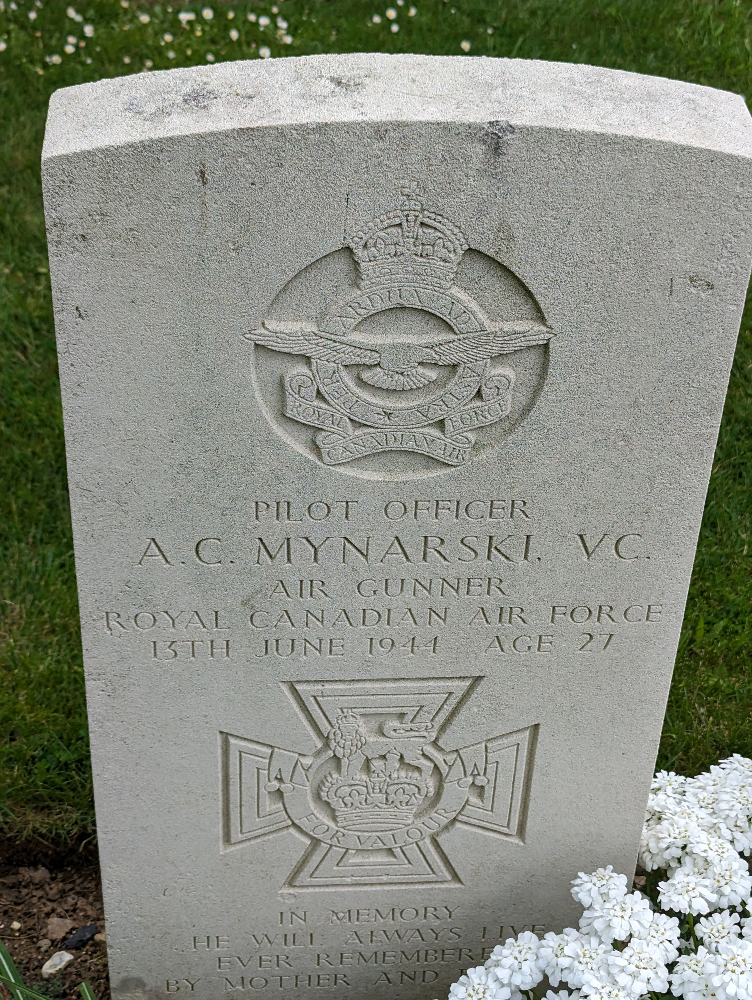

*The final stop on the tour was at the Toronto Cemetery. By now we have looped back and are back in the action of 08 August. The Toronto Cemetery is located in the early stages of the 1st Division Attack. The 3rd Battalion (Toronto Regiment) pressed the attack, capturing 450 prisoners, while suffering 250 casualties.*

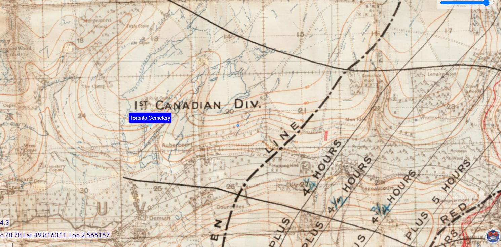

*Again, the flatness of the terrain is evident from the view from the Toronto Cemetery. 70 of the 77 known burials were killed on 08 August.*

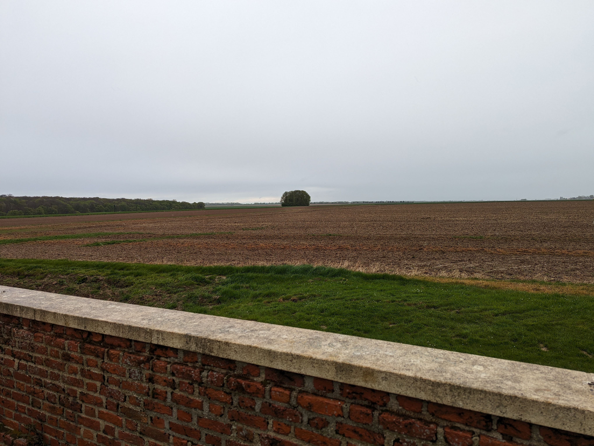

*By the end of the Battle, the Canadians had captured 9,000 prisoners, 1000 machine guns and captured more than 22km of ground, at a cost of 11,822 casualties. Traveling the ground emphasizes the high cost of taking the ground, and the collection of dead, all from a single battalion on the same day highlights the terrible cost of victory.*

* [First World War](https://www.paulsbattlefieldtours.com/blog/categories/first-world-war)
* [Family](https://www.paulsbattlefieldtours.com/blog/categories/family)