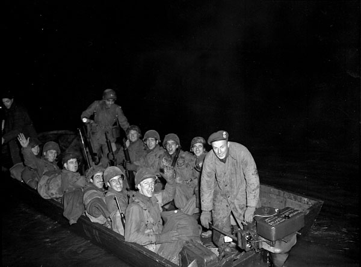
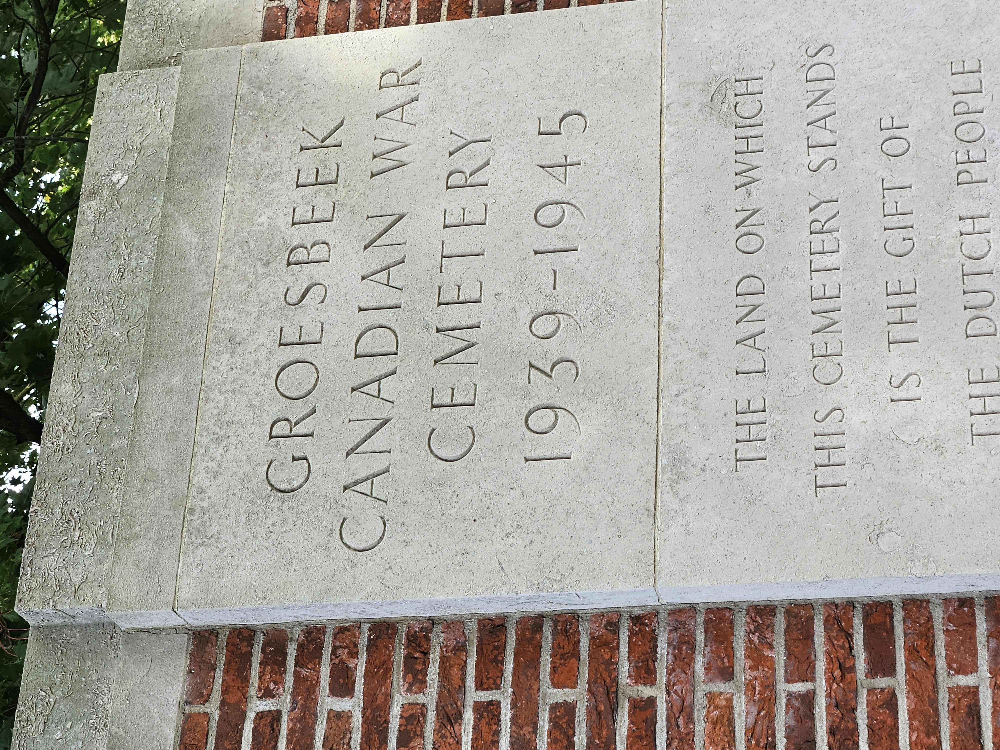

# Liberation - The Final Chapter

* [pd-allen](https://www.paulsbattlefieldtours.com/profile/pd-allen/profile)
* Sep 19, 2023
* 3 min read

Operation Market Garden was Gen Montgomery's bold plan to take the bridge across the Rhine at Arnhem, by dropping the British 1st Para Division at Arnhem, the 101st US Paratroops at the Son RIver, and the 82nd Airborne at Nijmegen to secure the bridges so the British 30 Corps could get tanks to hold the the bridges and bring an early end to the war. Since this was a US/British with the Polish Airborne thrown in, you can read about it, or watch A Bridge Too Far (Sean Connery as the Brit Commander).

The Canadian Engineers only got involved after the plan had failed miserably, and they helped the British Engineers get 2,400 British Paratroopers out of Arnhem. The 1st Airborne jumped in on 17 Sep and were only supposed to hold their position for 48 hours, but at 9 days of heavy fighting 8,000 of the 12,000 troops became casualties. This is a little known action that highlights Canada's success in a clean up operation.

The Canadian engineers were equipped with storm boats while the British units used assault boats.36 Storm boats were 20-foot long craft made with oak frames and plywood sides, powered by 50-horsepower Evinrude outboard motors capable of carrying 18 fully-equipped troops and travelling 6-knots when fully loaded. The Canadian Army's official history described the evacuation succinctly:

> *I**n dismal weather (which nevertheless helped to conceal their movements) the sappers brought their craft forward over difficult routes to the river's edge opposite the British bridgehead. All through the night the boats shuttled back and forth across the wide stream in driving rain, bringing exhausted survivors to safety under constant machine-gun and mortar fire. When daylight came the machine-guns up on the hill above the bridgehead rained a murderous hail of bullets on those craft which were still operating, but the downward angle of the fire was much less effective than it would have been had the guns been in position to make more horizontal sweeps. Mortar and 88 mm fire fell everywhere.*
> *The 23rd Field Company worked at a site north-east of the village of Driel. Very few soldiers came down to embark at the point farther west to which the 20th had been allotted. When the evacuation ended, about 2400 men had been ferried back, most of them apparently in the stormboats of the 23rd. This company had five killed and three wounded. Among the men it brought out was Major-General R. E. Urquhart, the G.O.C. 1st Airborne Division. The company commander, Major M. L. Tucker, subsequently received the D.S.O., mainly for this night's work on the Neder Rijn.*

*Our first stop was at Groesbeek Canadian War Cemetery, the largest in the Netherlands that has 2,619 burials with 2,338 of them being Canadians. There also 1,016 names of soldiers with no known grave, dating from Aug 1944 to the end of the war.*

Groesbeek cemetery is near the Start line for OP Veritable, which was the push to cross the Rhine River into Germany. My Great Uncle George Johnston was in this action as a member of the Argyll and Sutherland Highlanders of Canada. He was taken prisoner on 7 Mar 1945, near Sonsbeck. His story will be in a separate post. The same day he was captured 9 of his regiment were killed in the same action. I photographed all of the head stones (plus one with no known grave). The headstone of Private Lusk is representative of their losses.

The final fortuitous moment of the trip happened today at Wijchin, Netherlands. A member of our group John, a retired RCMP officer, had a picture of his father taken in front of a Windmill in Feb 1945, while serving as a member of the signal corps. John had located the windmill, and we took a small detour on our trip to the cemetery, to allow John to recreate the photo. A fitting end to a great trip. This is the end of the tour, but I plan to continue to visit battlefields and post more stories.

* [Second World War](https://www.paulsbattlefieldtours.com/blog/categories/second-world-war)
* [Family](https://www.paulsbattlefieldtours.com/blog/categories/family)
* [Battlefield Tours](https://www.paulsbattlefieldtours.com/blog/categories/battlefield-tours)