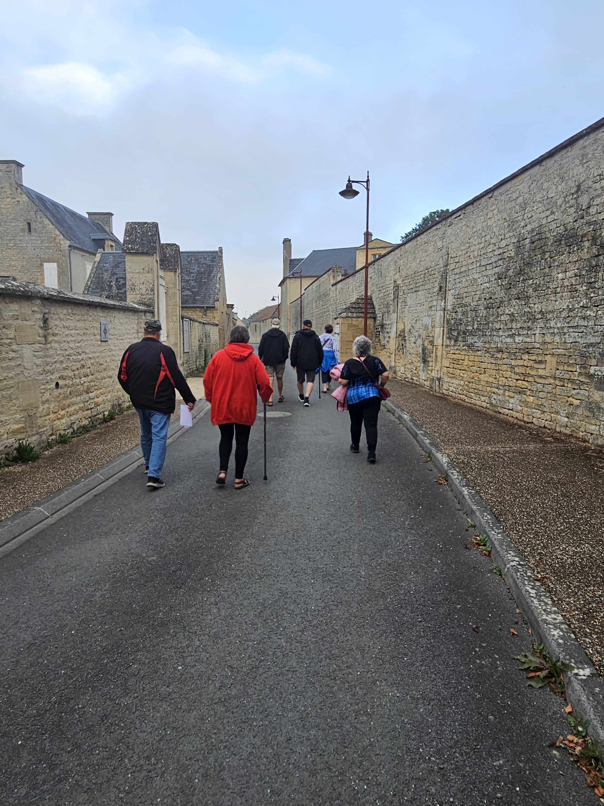
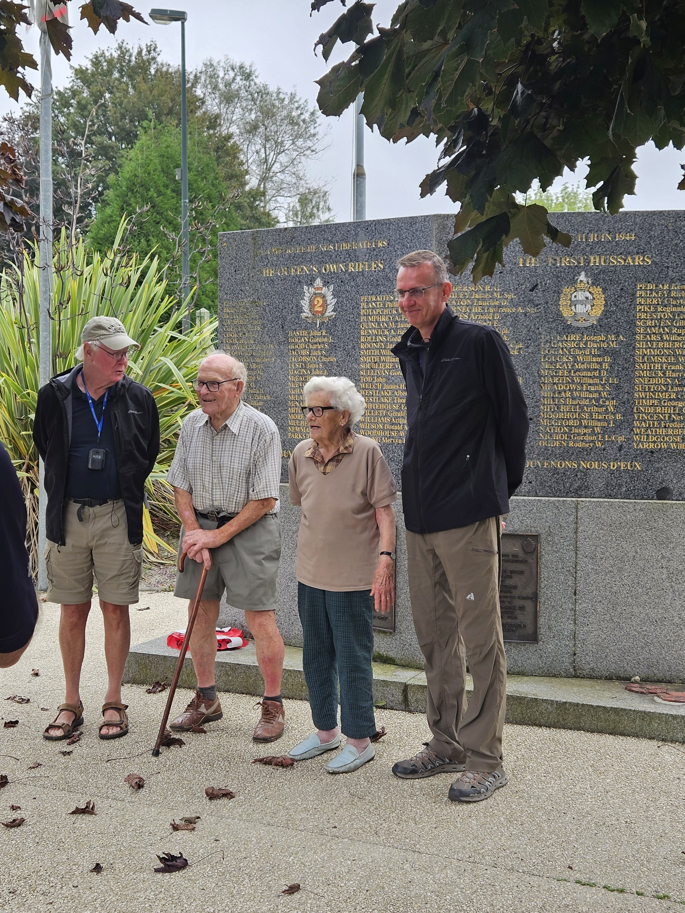
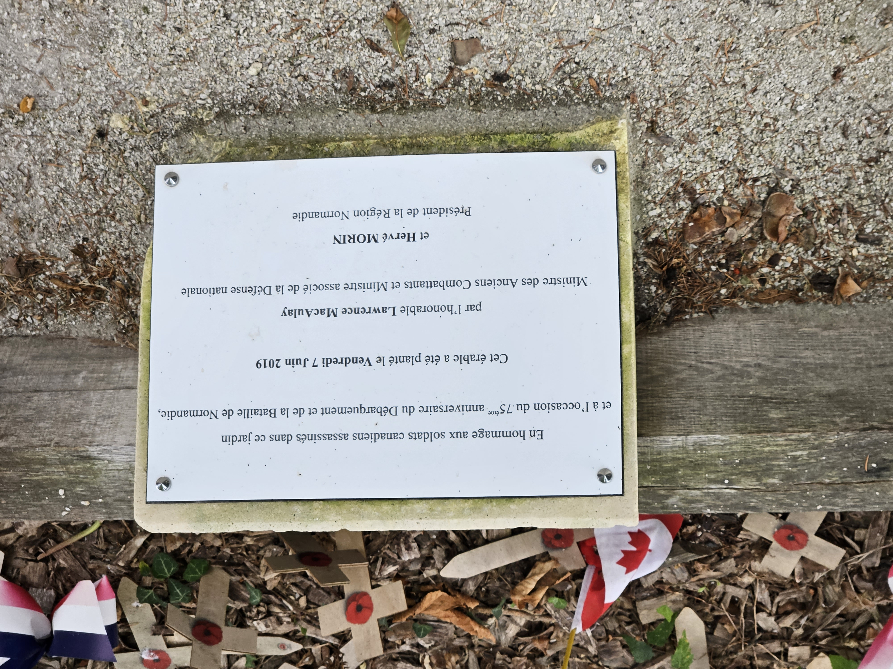
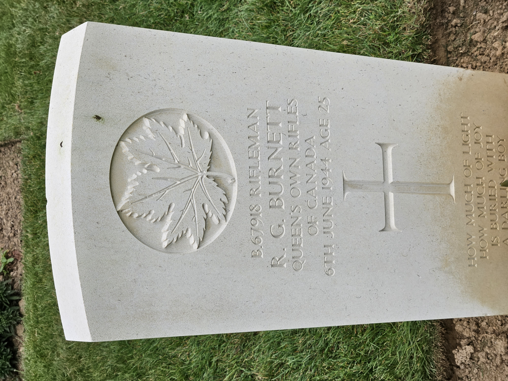

# Moving in land from the Beaches

* [pd-allen](https://www.paulsbattlefieldtours.com/profile/pd-allen/profile)
* Sep 11, 2023
* 3 min read

Updated: Sep 16, 2023

Today's tour focused on the battles following the D-Day invasion. Despite the initial successes of D-Day, the Canadians had not met all their objectives so pushed forward. On 7 Jun, the Royal Winnipeg Rifles took the lovely walled town of Putot-en-Bessin unopposed, but the next day the 12 SS Panzer division launched a devastating counter-attack that forces the troops to withdraw. Later that day the Canadian Scottish Regiment launched a determined counterattack, and the Canadians the town of the remainder of the Normandy Campaign.

By the time the battle was over, the Canadian Scottish had suffered 125 casualties, and the Winnipeg Rifles 256 casualties including the uncle of one of our tour group.

The next stop was Le Mesnil Patry, where the desire to push ahead trumped common sense and planning, resulting in a disaster. There was no reconnaissance, no understanding where the enemy troops were, and little planning as the assault was moved up a day. At 1 PM, the Queen's Own Rifles rode into battle on the 1st Hussars tanks, across an extremely flat grain fields. They had gone less than 300 yards when all hell broke loose. D company of the QOR had 96 casualties out of 135 men, and the Hussars had 54 casualties and lost 19 tanks.

Another spontaneous event highlighted the importance of the Canadians to the Locals. Two long time residents (they were 14 and 15 during the battle) came out to greet us. They regularly organize lunches for the visiting regiments and had a great chat with us. They said that 85% of the town was destroyed, and all the occupants had been evacuated before the battle so there was limited loss of civilian life. Athough well into their 90's both were still going strong.

From there we travelled to the Abbey Ardennes, the location of tragic incident in which 20 Canadian soldiers were massacred by SS soldiers during the battle of the Authie Buron. The soldiers were taken prisoners of war, then executed one by one. SS General Kurt Meyer has set up his HQ at the abbey, an important strategic location. From the top of the abbey he can see the entire plain all the way to the sea. Kurt Meyer was captured in Sep 1944, and in Dec 1945, was tried and sentenced to death. Shortly afterwards, his sentence was commuted, and he ended up spending only 8 years in confinement in New Brunswick before being returned to Germany where he lived until 1955.

Our last tour stop of the day was at the Canadian Cemetery at Beny-sur-Mer. The Cemetery contains 2048 souls, most of them Canadian all killed during the Normandy campaign. As I had mentioned before, we had a family friend who served in the Queen's Own Rifles, so I concentrated on their regiment. 167 QOR members are buried here killed between 6 Jun and 27 Jul, including 59 who were killed on D-Day. In the first row of the cemetery, there are 15 QOR members in a row, all killed on 06 Jun. I took pictures of a number of headstones, but this dedication really got to me. On the bottom of the stone it says

"How much light, how much joy, is buried with our darling boy:

Seeing the individual stones is very moving, but there is a tower at the back of the cemetery and that sight was truly overwhelming.

* [Second World War](https://www.paulsbattlefieldtours.com/blog/categories/second-world-war)
* [Battlefield Tours](https://www.paulsbattlefieldtours.com/blog/categories/battlefield-tours)