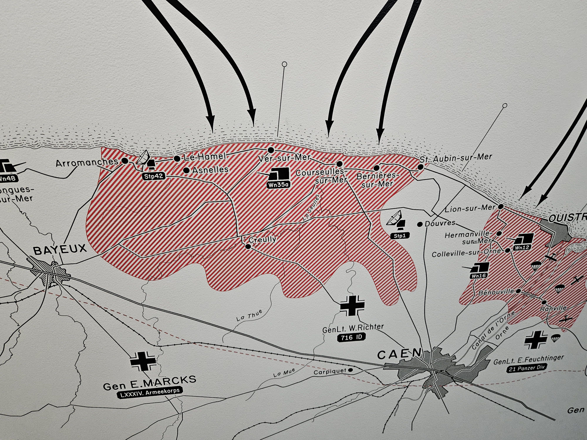
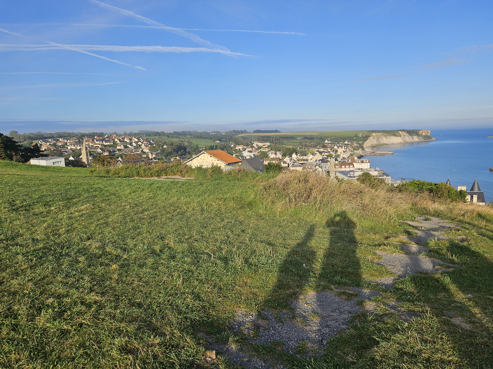
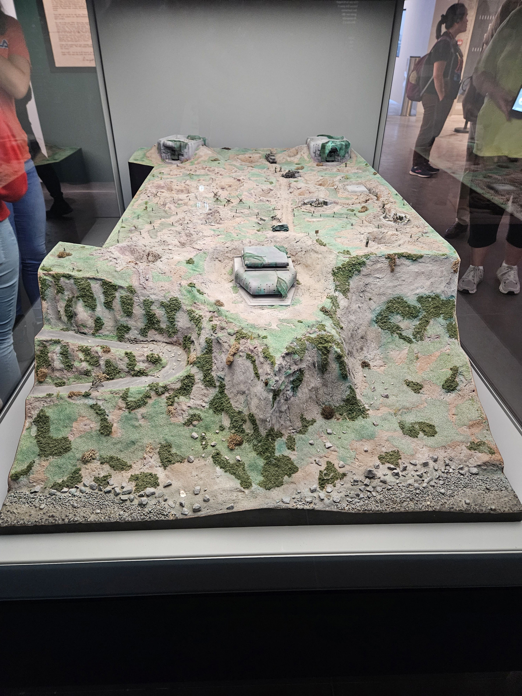
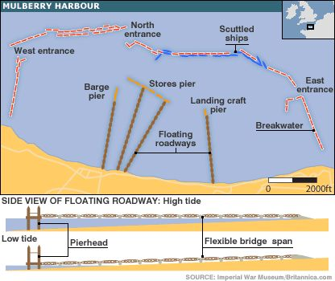
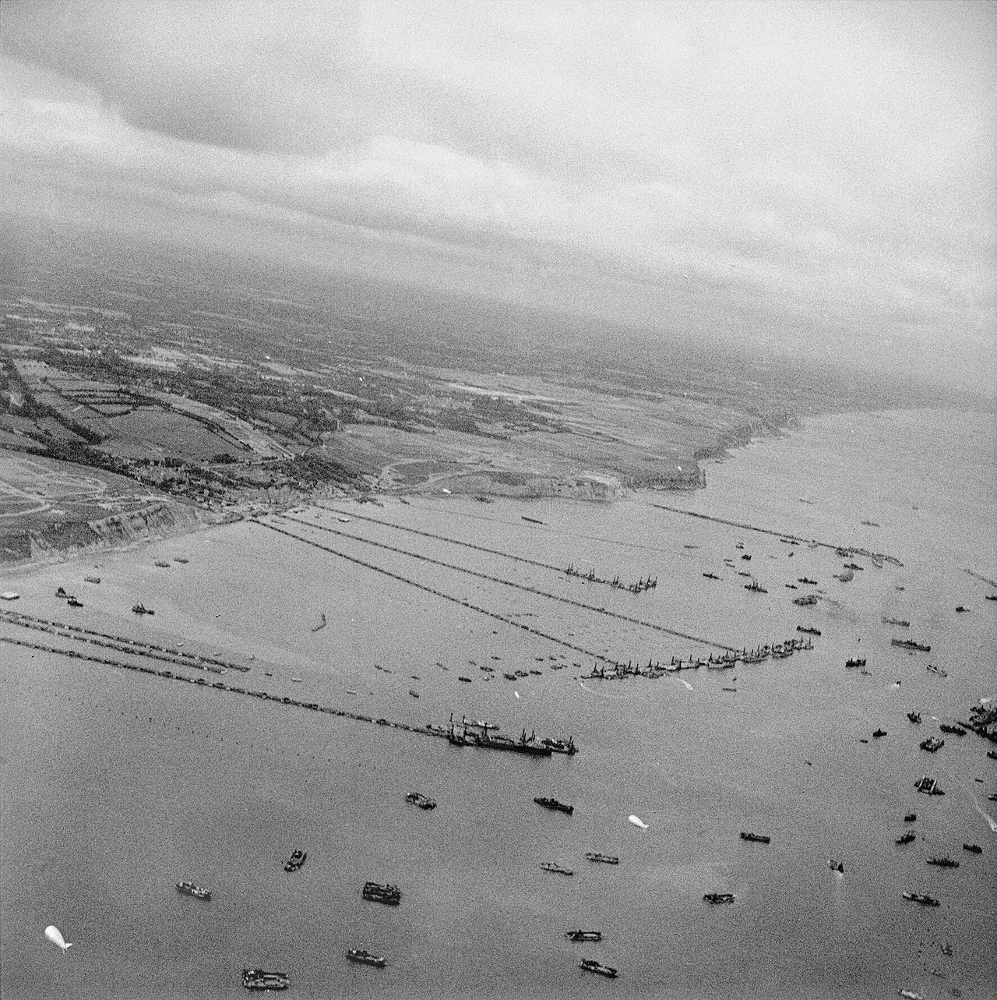
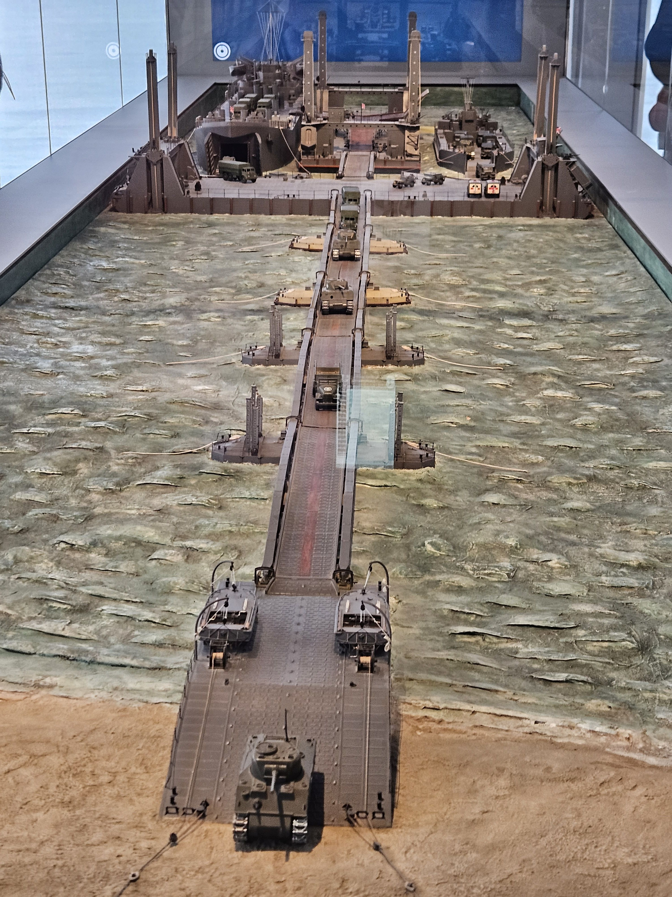
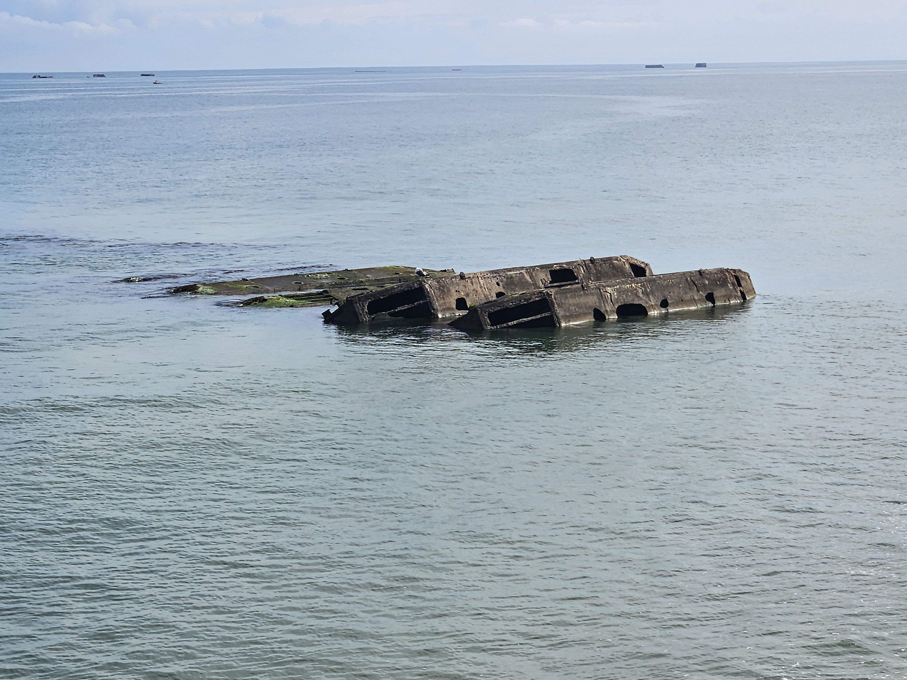

# Mulberry Harbour

* [pd-allen](https://www.paulsbattlefieldtours.com/profile/pd-allen/profile)
* Sep 12, 2023
* 2 min read

Updated: Sep 16, 2023

There were 2 man-made harbours code named Mulberry Harbours, one on the US sector at Omaha Beach, and on in the British Sector at Gold Beach. Work on the harbours started immediately after D-Day, but on 17 June there was a major storm that damaged the Gold Beach harbour and destroyed the one at Omaha Beach. The Omaha Beach Mulberry was never rebuilt. The picture above shows the invasion at Gold Beach.

The Harbour was built at Arromaches, which was not directly invaded on D-Day because of the high surrounding cliffs. The view from the cliffs near one gun emplacement is shown.

There was a second major gun emplacement at Longues-sur-Mer on the opposite cliff that dissuaded the British from attacking. The British came ashore at Anselles, and took the gun emplacements from the rear.

The Mulberry artificial harbour designed and constructed by the British to the unloading of supply ships off the coast of Normandy following D-Day, as the Allies did not control any ports required to supply troops and equipment, and the disastrous raid at Dieppe highlighted the difficulties of directly taking a harbour. The harbour, when fully operational, had the capacity to move 7,000 tons of vehicles and supplies per day from ship to shore.

Each Mulberry harbour consisted of roughly 6 miles (10 km) of flexible steel roadways that floated on steel or concrete pontoons. The roadways terminated at great pierheads, that were jacked up and down on legs which rested on the seafloor. These structures were to be sheltered from the sea by lines of massive sunken caissons, lines of scuttled ships, and a line of floating breakwaters (called Bombardons). It was estimated that construction of the caissons alone required 330,000 cubic yards (252,000 cubic metres) of concrete, 31,000 tons of steel, and 1.5 million yards (1.4 million metres) of steel shuttering.

This is a diorama of the Mulberry Harbour at the excellent Musee du Debarquement that recently reopened in Arromanches after a major expansion.

The Mulberry B harbour at Gold Beach was used for 10 months after D-Day, and over 2.5 million men, 500,000 vehicles, and 4 million tons of supplies were landed before it was fully decommissioned once the ports of Dieppe and Calais were taken.

There are still remnants of the harbour at Arromaches, including some pieces accessible at low tide. This amazing engineering feat was key to the Allies' early success after D-Day.

* [Battlefield Tours](https://www.paulsbattlefieldtours.com/blog/categories/battlefield-tours)
* [Second World War](https://www.paulsbattlefieldtours.com/blog/categories/second-world-war)