# Operation Husky - The Invasion of Sicily

* [pd-allen](https://www.paulsbattlefieldtours.com/profile/pd-allen/profile)
* Feb 10, 2025
* 24 min read

Updated: Feb 11, 2025

During our tour of Malta, we went to the Lascaris War Rooms, where the British controlled the air defence of Malta. The same location was used for the control of Operation Husky, the Allied Invasion of Sicily. In addition, they have the excellent Operation Husky museum opened in 2019, that focusses on the planning and execution of the invasion. After Malta, we spent a week in Sicily and got to visit the Sicily 1943 Museum in Catania to see the other side of the story.

Operation Husky was conceived in early 1943, during the Casablanca Conference (January 14–24, 1943).

At Casablanca, Winston Churchill, Franklin D. Roosevelt, and Allied military leaders debated their next move after the successful North African campaign. The British favored an attack on Italy as the "soft underbelly" of Europe, while the Americans initially preferred a more direct assault on France. Eventually, they agreed to invade Sicily as the next step to:

1. Knock Italy out of the war by undermining Mussolini’s regime.
2. Secure the Mediterranean for Allied shipping.
3. Divert German forces from the Eastern Front and Normandy.

The Allies also determined the opening of a second front long demanded by Russian Leader Stalin would lessen the pressure on the invasion of Europe.

# Operation Husky Control Room

The planning for Operation Husky was taking place at the same time as the Allied battle against Rommel in North Africa so the planners were widely separated. The command structure included the American General Dwight D Eisenhower as Commander. However, the three service chiefs were all British:

General Harold Alexander Deputy Commander responsible for detailed planning and execution

Air Chief Marshall Arthur Tedder as Air Commander

Admiral Andrew Cunningham as Naval Commander.

The invasion force was commanded by American Lieutenant General George Patton, 7th Army and British General Bernard Montgomery, 8th Army.

All of these commanders were in place for the Battle of North Africa. Interestingly, in the war room, the command structure is shown, minus Patton! Apparently, Patton isn't in the Lascaris War Rooms diorama because he wasn’t directly involved in the strategic planning conducted there. (Left to Right, Montgomery, Eisenhower, Alexander, Cunningham and seated Tedder)

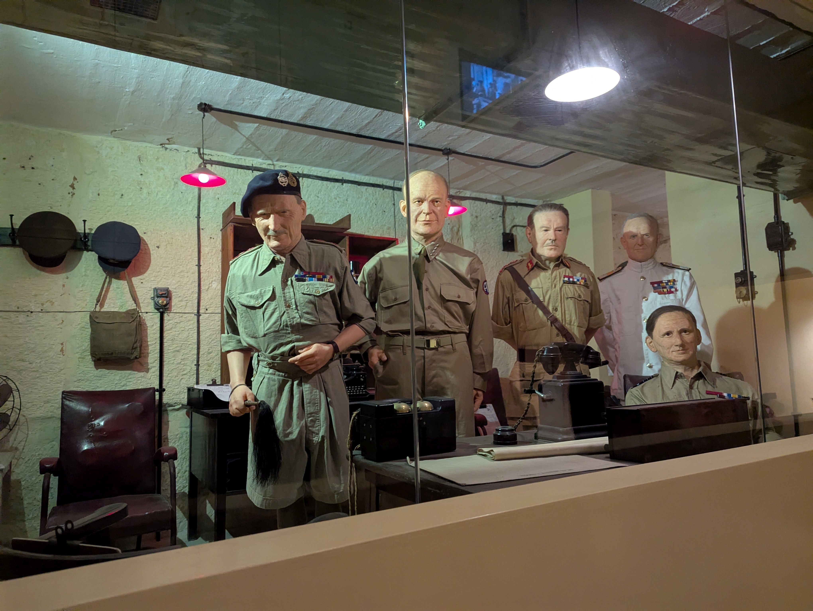

The diorama implies all of the planning was done in the war rooms; however, Eisenhower was in Algeria and Patton and Montgomery were fighting in Tunisia. The plan was heavily British focused since Alexander who commanded the ground forces in Africa, did not have confidence in the Americans. All of the senior commanders were busy fighting the current battle and the plans kept changing until April when Montgomery blasted the plan and drove it to its final structure. The wall map of Sicily in the Op Husky control room.

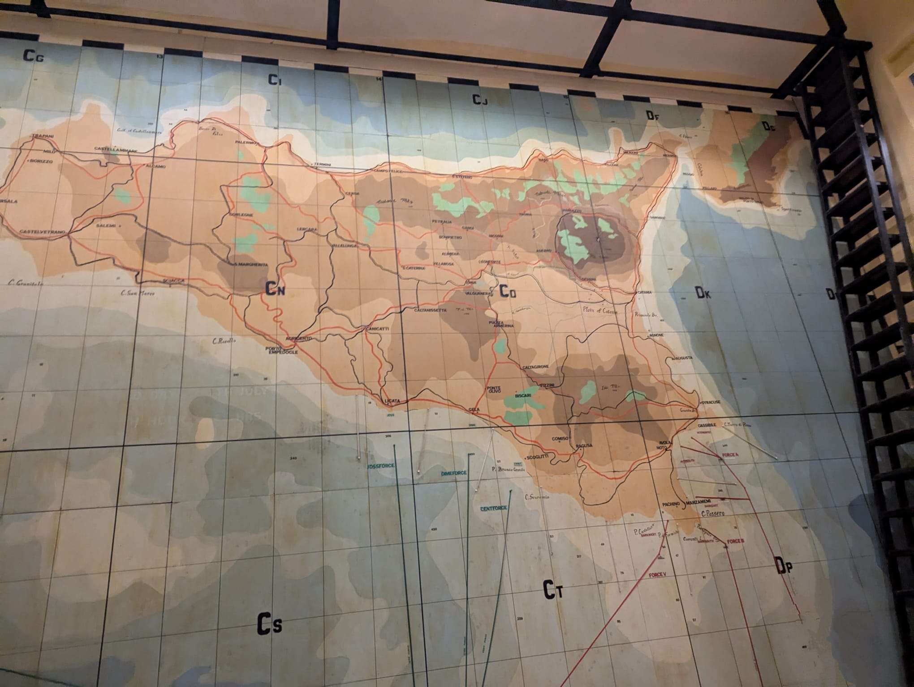

## Operation Underworld

The US lacked information on Sicily, so they secretly contacted New York Mafia boss Lucky Luciano, who was serving a sentence of 30 to 50 years for prostitution and racketeering, to provide information about Sicily’s terrain. The US government had previously used the Mafia to provide information of suspicious shipping activities.

Luciano provided photographs, maps and contacts for the invasion. Mussolini’s Fascist government had cracked down on the Sicilian Mafia, so they were eager to help overthrow him. The Sicily 1943 Museum in Catania also highlighted the Mafia contributions.

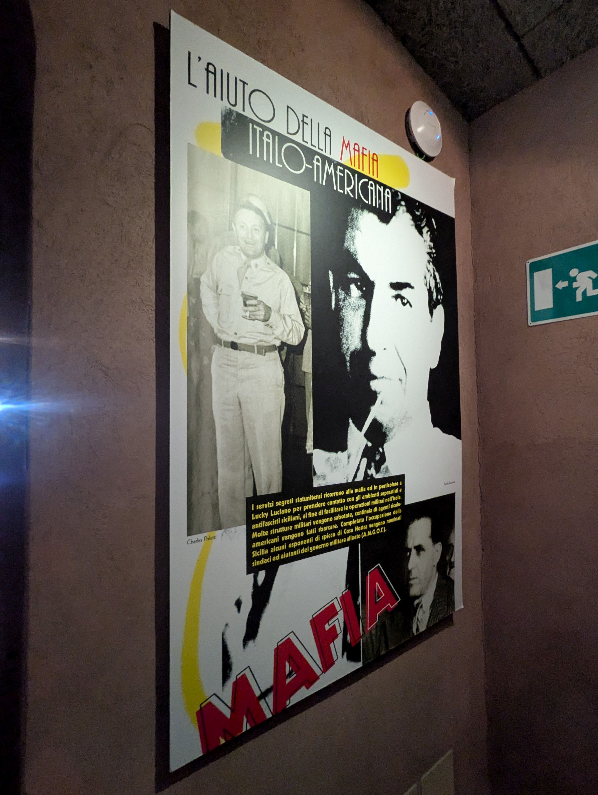

The Allies installed several Mafia bosses as mayors after the capture of Sicily, restoring the Mafia to its former power condemning Sicily to decades of untold barbarity and economic enslavement. Luciano was moved to a more comfortable prison in1942 and had his sentence commuted in 1946. He was deported to Italy where he lived until his death in 1962.

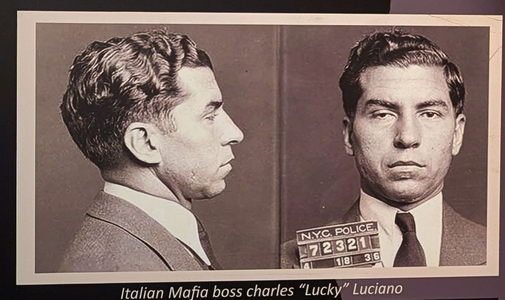

## Canadians

For the Canadians, despite having been in the UK since 1939, their only action had been the disaster at Dieppe where 3,367 of the 5,000 Canadians had been killed, wounded or taken prisoner in a single day. The government was pushing to get their soldiers involved, so on 23 April 1943, it was finally decided the Canadians would provide the 1st Canadian Division under Montgomery, replacing the 3rd British Division. On 29 April, Major General Salmon, 1st Division commander, was killed in a plane crash on his way to Egypt for a planning session, so the newly promoted Major General Guy Simmons who had assumed command of the 2nd Division one week prior, took over.

Due to the lack of landing craft in theatre, the Canadians would sail from the UK and several American components from the US adding to an already complicated landing scheme. To transport a total strength of 1,851 officers and 24,835 other ranks, complete with all their equipment and 30,000 tons of supplies, a distance of more than 2,000 miles would require 125 transport and escort vessels.

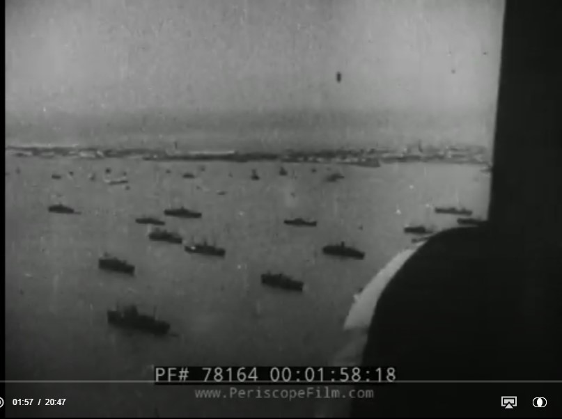

The slow convoy sailed from Scotland on 17 Jun, followed by the fast convoy on 28 June. The orders and tropical gear were sealed until the ships were underway, so virtually the entire invasion force had no idea where they were going until they were well underway.

While passing Algeria on 04 July, 3 ships of the slow convoy were torpedoed and sunk. Only about 50 men were lost, and the remainder picked out of the water and delivered to Algiers. Since they were all briefed on the operation, they were held in a prisoner of war camp until the invasion. The loss of life was small, but the equipment lost was a much bigger issue.

A total of 562 vehicles were lost, leaving 1st Canadian Infantry Division facing a major transportation shortage. Also lost were fourteen 25-pounders, eight 17-pounders, and ten 6-pounder anti-tank guns that would significantly reduce the division’s artillery support. “In addition to the above,” the divisional historical officer, Captain Gus Sesia, noted in his diary, “we lost great quantities of engineers’ stores and much valuable signals equipment.” The biggest immediate blow was the loss of all divisional headquarters vehicles and equipment, including many precious wireless sets. 15 of the 18 Medical Corps ambulances were also lost.

# Operation Husky

## Final Plan

After multiple revisions, the final plan involved the British 8th Army landing on the South-East point of Sicily and the American 7th Army to their west centred on Gela. The Brits landed 4 Divisions and the Americans 3 Divisions in the largest amphibious operation executed up to this time. The force incorporated 160,000 troops, 600 tanks, 14,000 vehicles and 1,800 guns. Supporting the invasion were 3,500 aircraft and 2,590 ships.

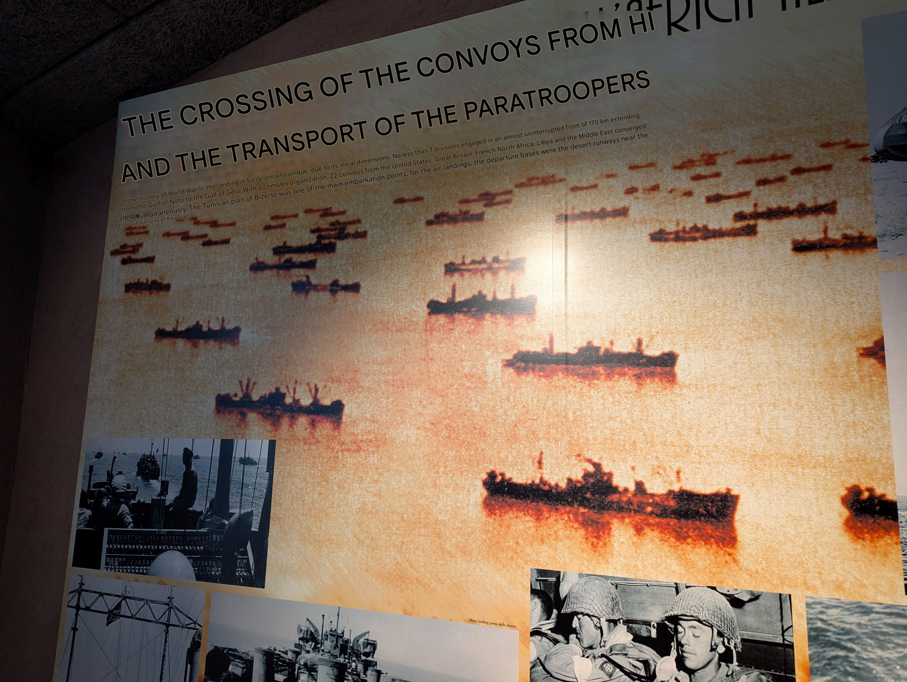

## Deception Operations

In Operation Mincemeat, the Brits dressed a homeless man as a Royal Marine and dumped his body off of Spain with a number of fake documents relating to Allied plans to make landings in southern Greece at Cape Araxos and Kalamata.

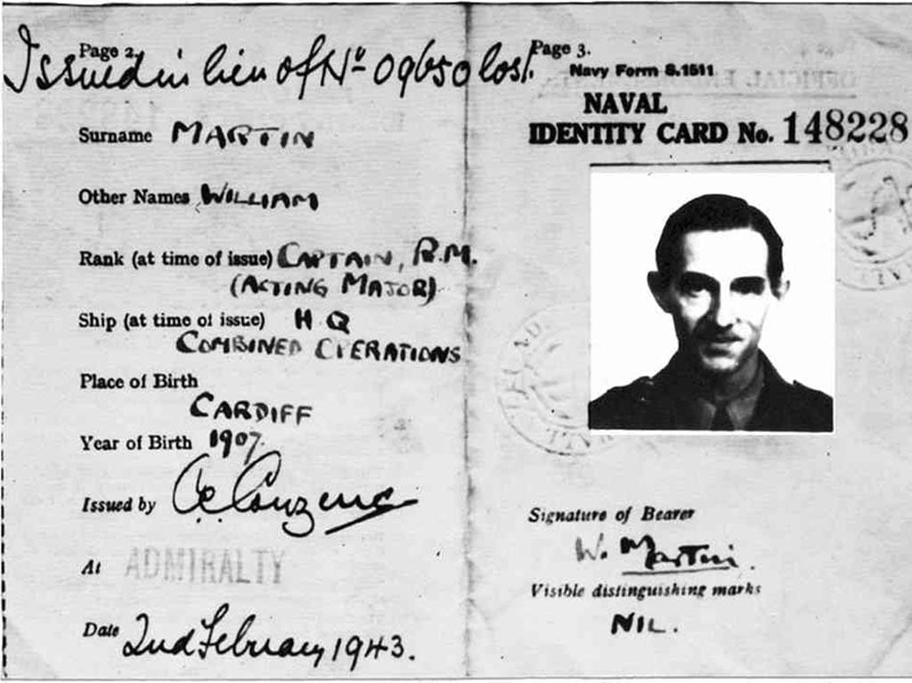

There was also a reference to ‘sardines’, which was supposed to be perceived as a possible coded clue to an operation against Sardinia. Netflix currently has the movie Operation Mincemeat to give you some more details and is also now a new hit musical.

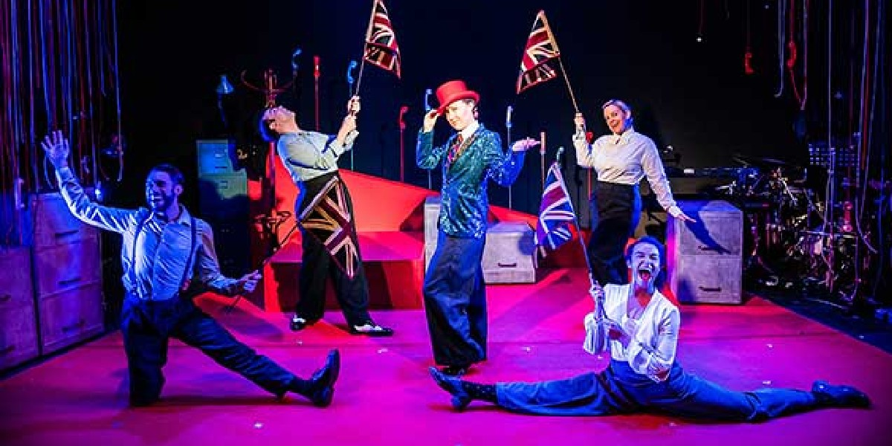

Operation Animals, carried out by the British Special Operations Executive committed 44 acts of sabotage in Greece, enhancing the story. The Allies also carried out an extensive bombing campaign against Sardinia to help sell the ruse. These actions confirmed Hitler’s beliefs so the defences in Greece and Sardinia were beefed up to counter the threats.

## Airborne Operations

The war in North Africa had identified most of the competent leaders, but Airborne Operations were new, and nobody understood how to best employ the capability. The Brits were going to send in airborne troops to capture and hold the Ponte Grande Bridge, the lone bridge across the Anapo river just south of Syracuse. The Americans were going to land on several key crossroads to prevent the Axis forces from launching counterattacks against the amphibious landing forces.

The Brit Major General George Hopkinson, who was very charming, ambitious and talked a great game convinced Montgomery that Gliders were the key to capturing the Ponte Grande Bridge. Hopkinson failed to mention that the British Glider pilots had generally less than 12 hours flying experience, hadn’t flown at all in the last 3 months due to glider shortages, had no night flying experience, would be flying mostly American Gliders and would be towed by pilots who had limited towing experience and no night towing experience. By invasion day, the glider pilots each had an average of 1.2 hours of night flying and just four and a half hours of flying time in Wacos. It was nowhere near enough. But the die had been cast.

In all, over two thousand men were to be flown in 147 gliders – eight Horsas, each with a 28-man platoon and two pilots, towed by seven Halifax bombers and one ageing twin-engine Albemarle, and 139 Wacos, each carrying thirteen men and two pilots, towed by the C-47s of the US 51st Troop Carrier Wing. The British Horsa Glider, 67 feet long, maximum takeoff weight 15,500 pounds.

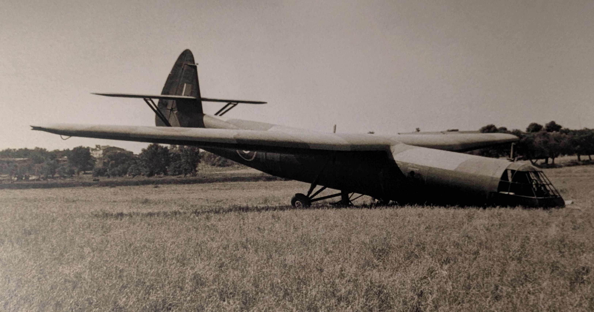

The smaller US Waco Glider, 48 feet long, maximum takeoff weight 7,500 pounds.

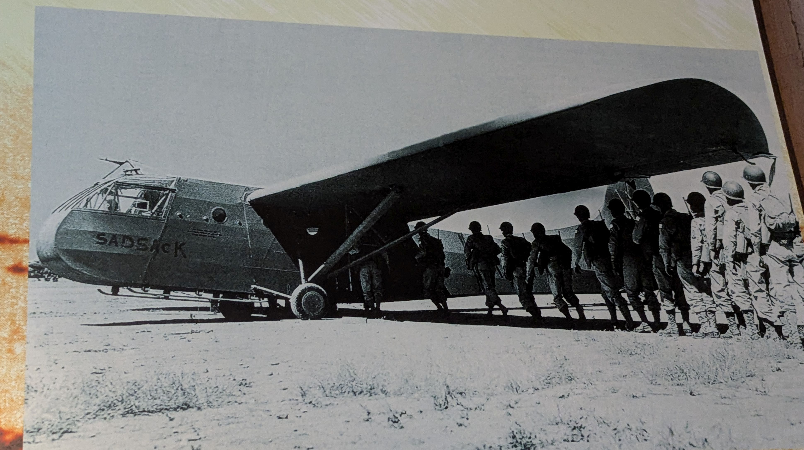

## Aircraft Operations

The US and British bomber crews operated out of North Africa, but due to the shorter range of the fighters, they operated out of Malta giving the island a chance to strike back after its long siege. There is precious little flat land on Malta so when the Yanks needed a base, they built a runway on the smaller island of Gozo. I had to look into this a bit as from our Gozo tour, we hardly saw enough level ground to build a bowling alley, let alone an airfield. But the Yanks did it in an impressive 14 days. The airfield was only used during the invasion, as the fighters could only cover Southern Sicily, so were moved to Axis Airbases as soon as they were captured.

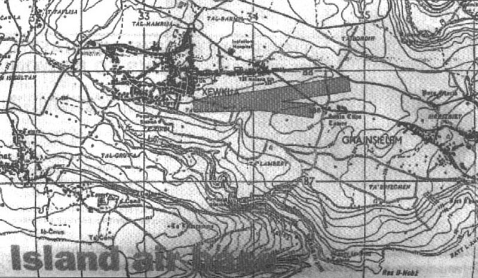

In order to build the runway, a fortified house known as Gourgion Tower, built in 1690 was removed. Apparently, it was dismantled and all the blocks labeled so it could be reconstructed after the conflict. When the airfield was cleared in 1944, the authorities reportedly asked the owners if they wanted the tower rebuilt or financial compensation, the farmers took the cash.

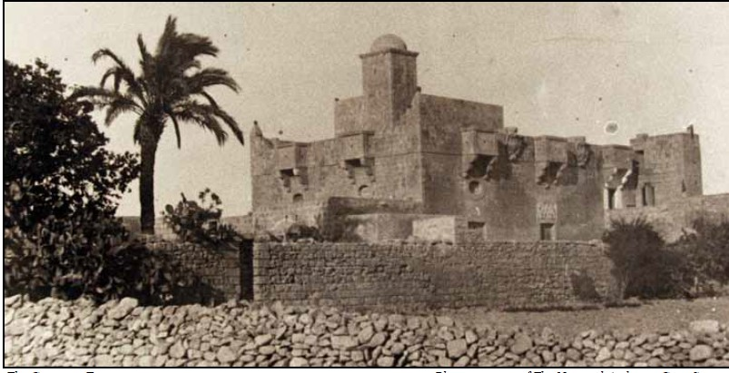

The view from St John the Baptist Church towards the airfield location (little green patch on the middle left).

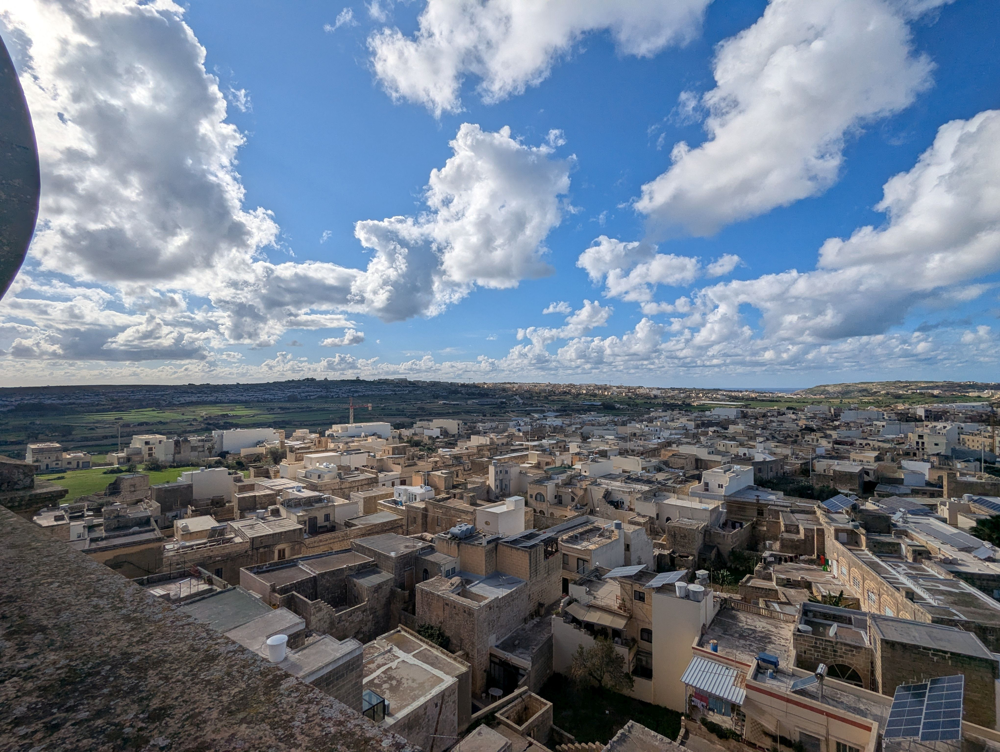

View towards the Basilica in Victoria, just because I really liked Gozo.

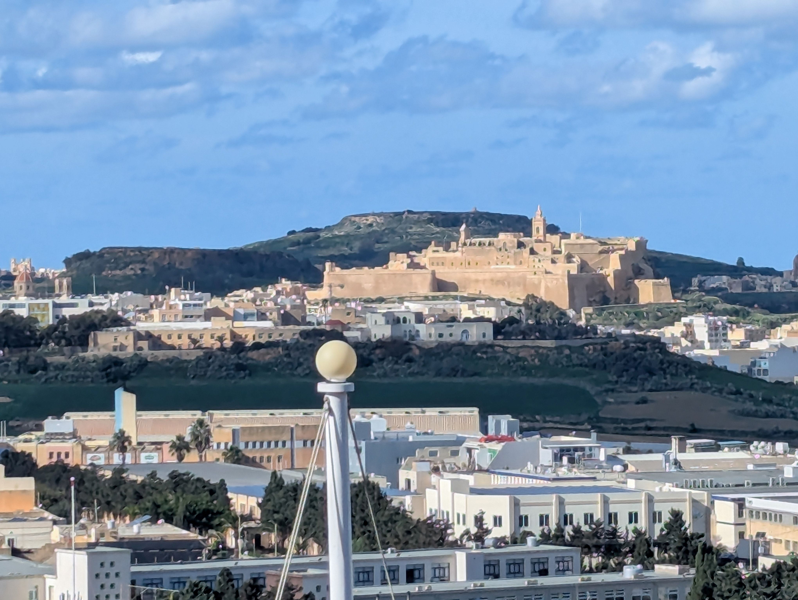

Pre-Invasion raids had destroyed more than 160 Axis aircraft, and a further 100 aircraft were shot down by Allied aircraft and anti-aircraft fire during the Axis counter attacks. By mid July the Axis air threat had largely been neutralized, and the Luftwaffe withdrew to mainland Italy to avoid further losses. The airfield at Pachino was one of the first captured by the Canadians. Runways were repaired and the Allies were operating from them a few days later to provide fighter cover during the advance.

In all, some 322 Axis bombers and 268 fighters were destroyed on the ground between 6 July and 19 October 1943 – figures that also include the start of the Italian campaign that followed – while a further 207 bombers and 700 fighters were destroyed in the air and some 1,000 aircraft captured: so, some 2,500 in all. It was enough, at any rate, to gain the Allies air superiority in the theatre, which in turn allowed amphibious operations to take place and those on the ground to have the comfort of air support over their heads.

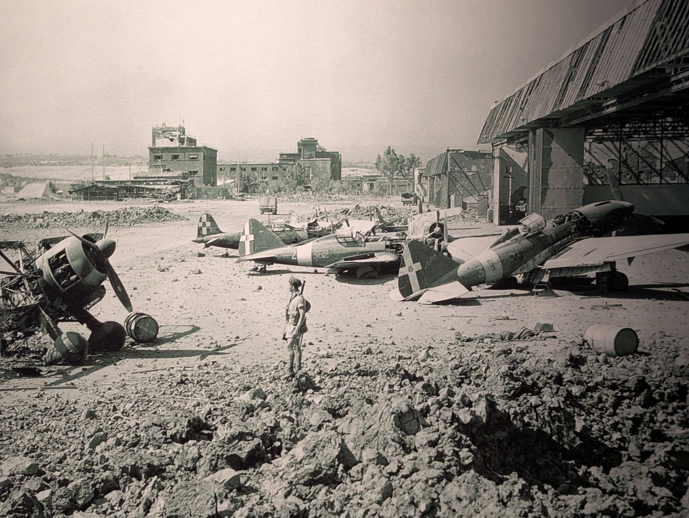

# Invasion

## Weather

On the night of July 9–10, 1943, as the invasion fleet was approaching Sicily, unexpectedly strong winds, rough seas, and poor visibility raised concerns among Allied commanders. Some senior officers considered delaying the invasion, fearing that the weather would disrupt the landing operations and airborne drops. However, General Dwight D. Eisenhower, the Supreme Allied Commander, decided to proceed as planned, believing that further delays would only benefit the Axis defenders.

The invasion fleet encountered unexpectedly strong winds and heavy seas in the Mediterranean. Many landing craft were swamped or capsized, and paratrooper drops were badly disrupted. The wind and turbulence scattered airborne troops from the U.S. 82nd Airborne and British 1st Airborne Division, leading to confusion and delays. The poor weather initially helped the invasion because Axis defenders were caught off guard, assuming no invasion would happen in such conditions.

## Airborne Assaults

On 9 July, a contingent of 2,075 British troops, along with seven jeeps, six anti-tank guns and ten mortars, boarded their gliders in Tunisia and took off at 18:00, bound for Sicily.

Only one glider with a platoon of infantry from the Staffords landed near the bridge. Its commander, Lieutenant Withers, divided his men into two groups, one of which swam across the river and took up position on the opposite bank. Thereafter, the bridge was captured following a simultaneous assault from both sides. The Italian defenders from the 120th Coastal Infantry Regiment abandoned their pillboxes on the north bank. The demolition explosives were cleared from the bridge, and the small group awaited counterattacks.

En route, the gliders encountered strong winds, poor visibility and at times were subjected to anti-aircraft fire.[]](https://en.wikipedia.org/wiki/Operation_Ladbroke#cite_note-mitch73-22) To avoid gunfire and searchlights, pilots of the towing aircraft climbed higher or took evasive action. In the confusion surrounding these manoeuvres, some gliders were released too early and sixty-five of them crashed into the sea, drowning around 252 men.  Of the remainder, only twelve landed in the right place. Another fifty-nine landed up to 25 miles away while the remainder were either shot down or failed to release and returned to Tunisia.

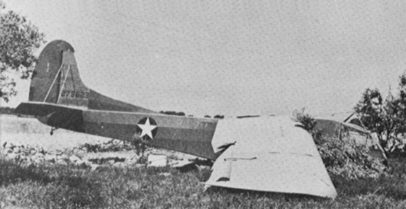

MGen Hopkinson, the Glider evangelist, was in one of the gliders that was released early and crashed into the sea and had to be rescued the next morning by the Navy. In September while observing another drop in the invasion of Italy, Hopkinson was killed.

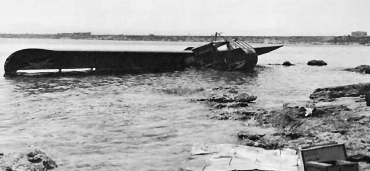

The Brits progressed up the coast, and on 13 July the British Airborne was dropped on bridges south of Catania to prevent the Italians from blowing the bridges. The Brit paratroopers were delivered in 147 transports that were attacked by Allied Naval Anti-Aircraft fire causing 26 planes to turn around because of friendly fire, 11 were shot down and 3 others crashed. The remaining 107 planes had scattered to avoid fire and dropped paratroops up to 20 miles from the Primosole Bridge. Only 295 of 1,856 were dropped close enough to win the bridge. They were pushed back but had prevented the bridge from being blown. Almost half of the troops at the bridge became casualties and the Germans held the other side forcing an extended battle to take Catania.

The Primosole Bridge is a 400-foot structure, 8 feet off the river. At the Sicily 1943 Museum there is a model of the bridge showing the battle.

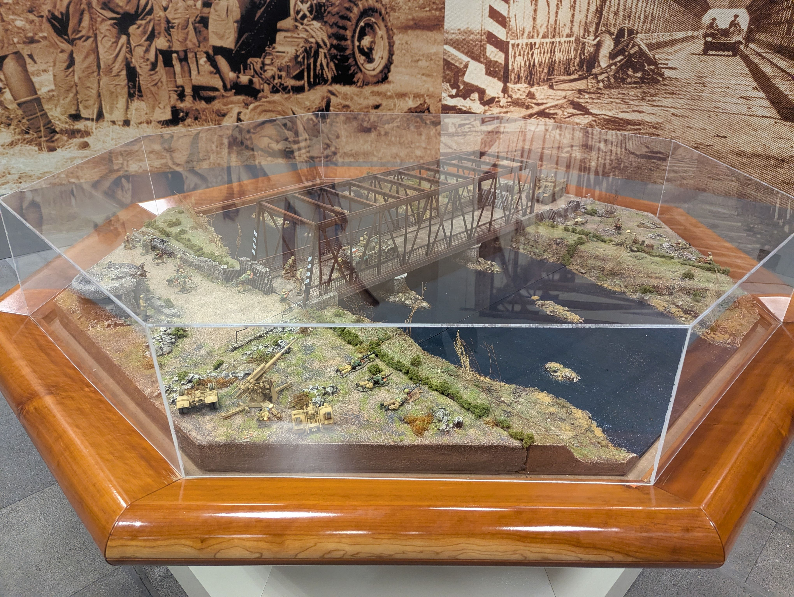

There is also a great photo of the bridge finally being liberated.

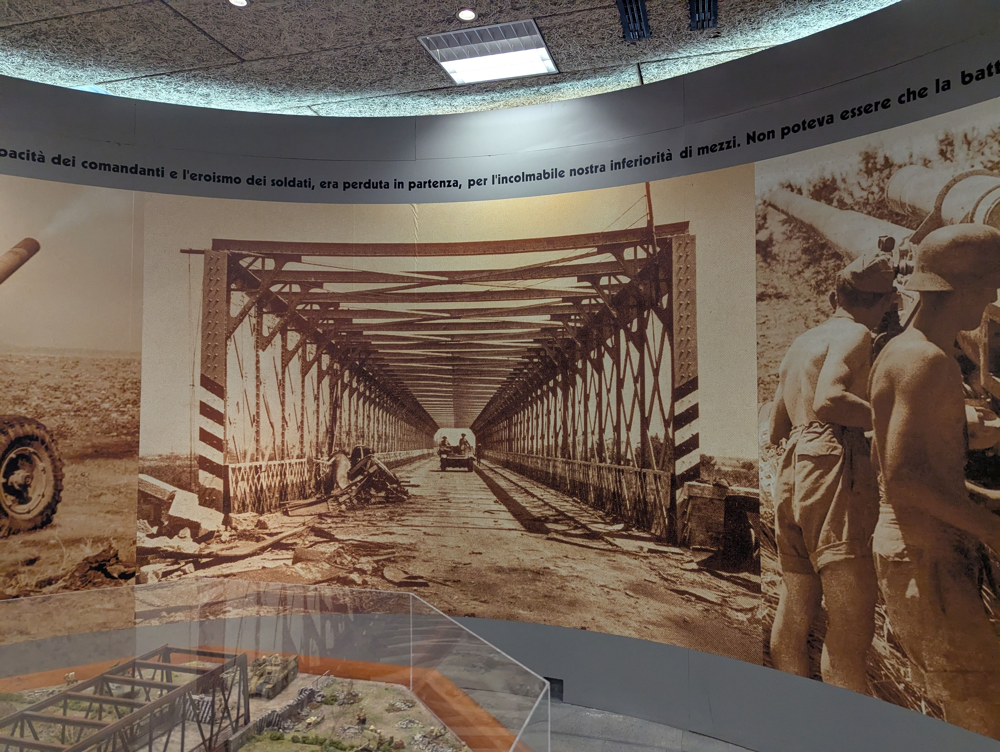

On 09 July 1943, the 82nd Airborne was to drop into the American landing zones to cover key crossroads that would protect the landings from counterattacks from the German and Italian forces staging inland. About 3,400 paratroopers of the 82nd Airborne transported on 226 C-47 (DC-3) aircraft jumped into Sicily on 09 July.

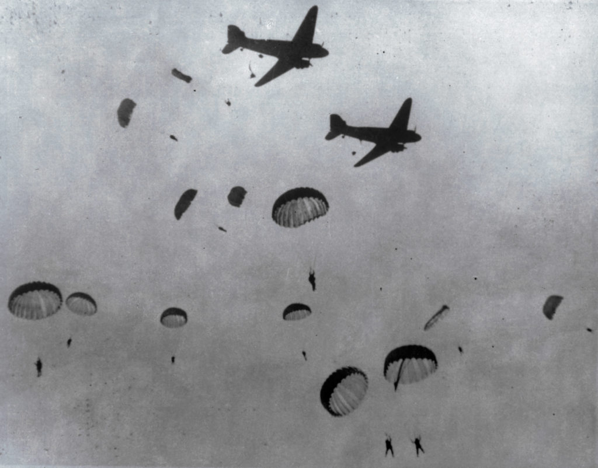

The pilots were very inexperienced with little night flying and poor navigation systems. Heavy anti-aircraft fire also scattered the planes and the storm had very strong winds (35 miles per hour) that further pushed the paratroopers up to 25 miles away from their Landing Zone. The ellipses represent the landing zones, and the  dots represent individual aircraft drops.

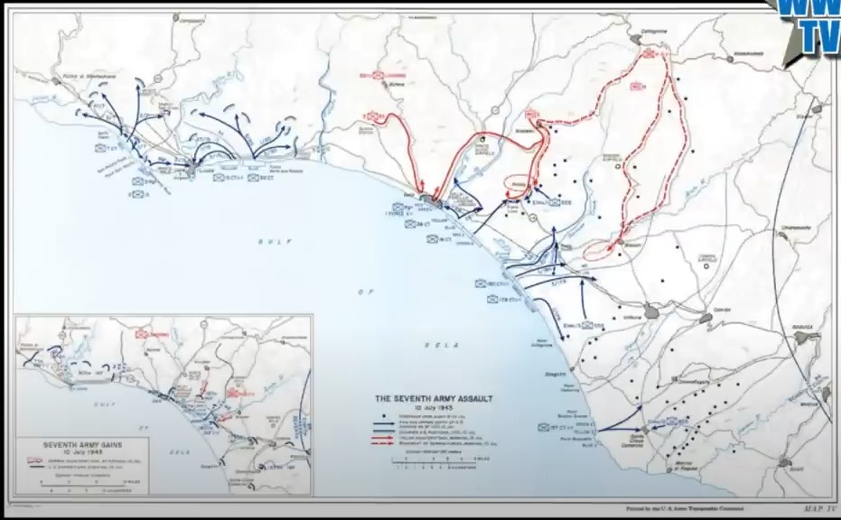

Despite being scattered, the paratroops engaged the Axis force to slow down the movement to the beach. The German armoured assault nearly broke through the 82nd Airborne and the recently landed 1st Division infantry but were chased back by sustained Naval gunfire.

Two nights later, a second drop of paratroopers unfortunately coincided with an Axis air attack and the US Naval and ground forces fired on the transport planes, shooting down 23 C-47s, killing or wounding over 200 paratroops.

Despite these less than stellar performance in Sicily, the aircrews and paratroopers continued to be an important component of future invasions.

## Amphibious Assault

Despite the high seas, the invasion force landed  in Southeastern Sicily on 10 July. The American 7th Army landed centred on Gela and the British 8th Army, including the 1st Canadian Division, landed on the eastern tip of the island. The beach landings were lightly opposed, most of the Italians on the coast surrendered or ran away. The US faced the largest opposition on the beaches, with both the Italian and German forces concentrated inland pressing the attack. Naval offshore shelling eventually drove the Axis forces back.

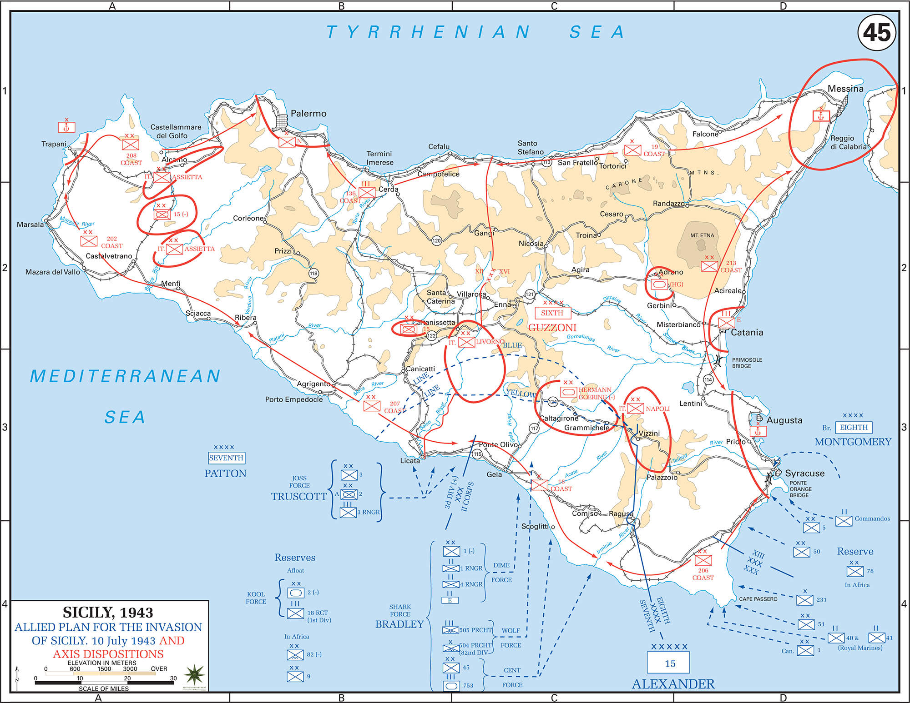

The British landed in the Acid North, Bark East and South sectors and the Canadians on the Roger and Sugar Beaches in Bark West.

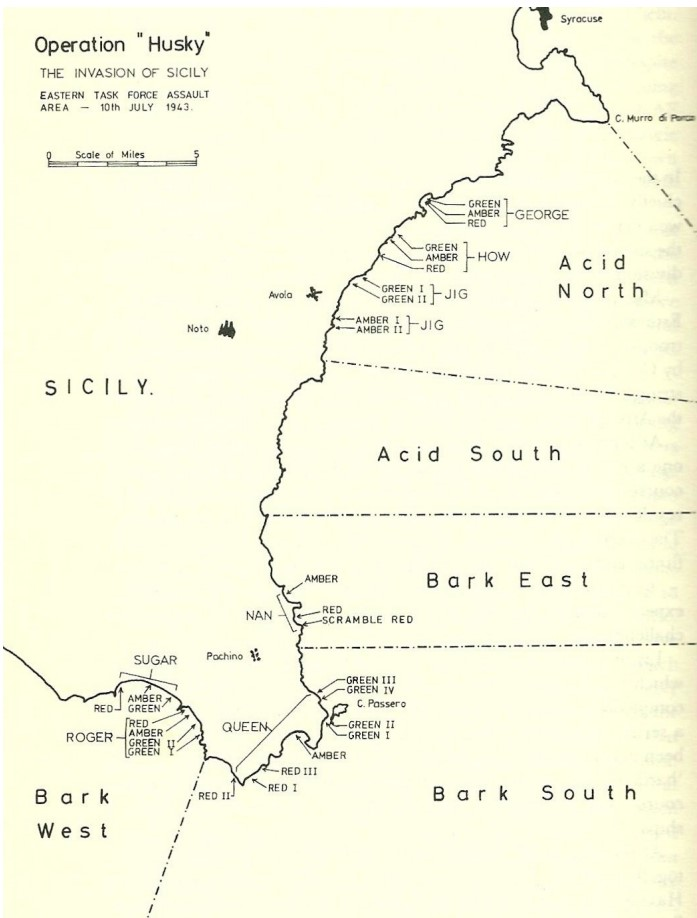

Due to rough seas and few navigation aides most of the units did not land in their designated areas. A company of the Hasting and Prince Edward Regiment (the HastyPs) landed 5000 yards west of their designated landing area. You will be hearing a lot about the HastyPs as Farley Mowat, the renowned Canadian Author was a Lieutenant in the regiment and wrote 3 excellent books on the war. The first wave of Canadians hit the beach just after 0300 and with light or no resistance, most units were at their objectives by 0900. The airfield at Pachino was key for the fighter aircraft to provide coverage of the entire island. The airfield capture was successful and a few days later fighter operations were taking place.

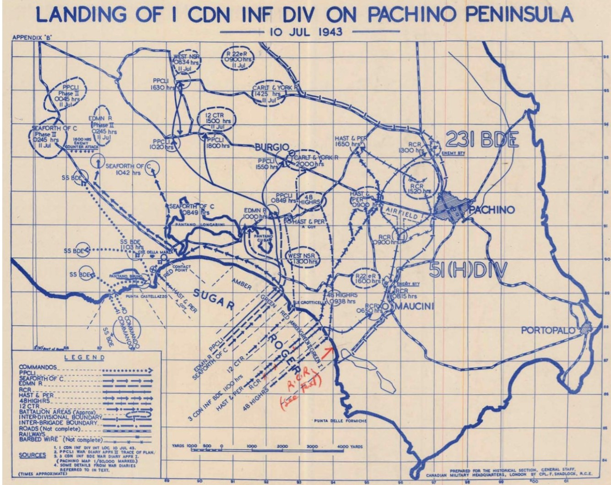

With the beaches secure, the landing craft could push into the shore and off load the heavy equipment right on the beach. As mentioned earlier, the Canadians had lost 560 vehicles during the convoy transit, so before they could scrounge replacement vehicles the Canadians were faced with long marches in an extremely hot climate.

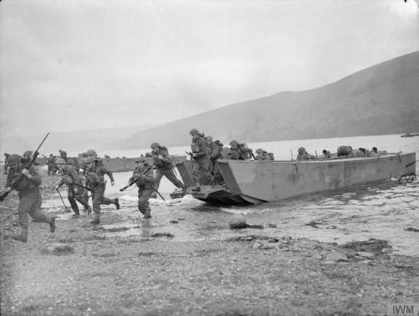

Later in the day the next wave had uncontested landings.

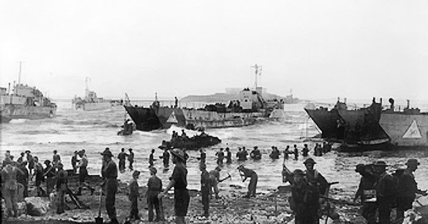

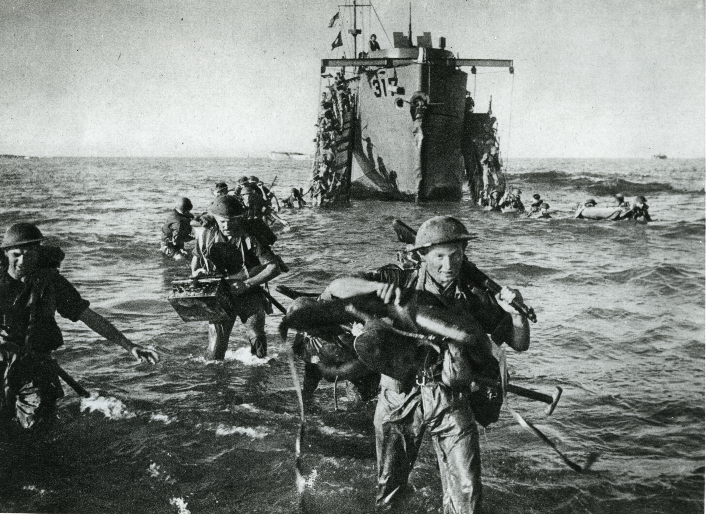

The map shows the routes taken by the various armies. Initially, the Americans were to be in a supporting role, much to the distain of Gen Patton, 7th Army commander. He weaseled permission to take Palermo, the largest port and city on Sicily, and once the Brits got held up in the attacking of Catania, took on a major role in pushing the Germans off the island. The Canadians went up the centre of the island and the Brits up the eastern coast.

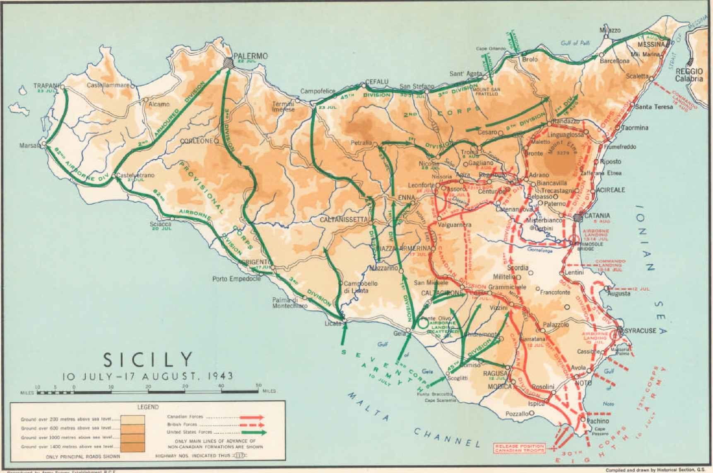

## Canadian Actions

I like to pick a unit and map their daily progress. The obvious choice was the HastyPs due to Farley Mowat’s books. Their experience was typical of the Canadian units, lots of marching on dusty roads in scorching weather and amazing assaults against a well entrenched enemy in mountaintop towns.

I have reread Farley Mowat’s books about the Italian campaign, The Regiment  and No Birds Sang. The Regiment was written in 1955 and is mostly focused on the Regiment’s engagements. No Birds was written in the 1970s and focusses more on life at war. Both are very good, written in Mowat’s irreverent style. His later book published in 1992, My Father’s Son, is largely written using extensive correspondence between Mowat and his father and Mother. His father was in the first war, and a Major in the reserves in the Hastings and Prince Edwards County Regiment, the HastyPs. His father worked in Libraries for most of his life and was a prolific and eloquent writer and the genesis of Farley’s writing career is very evident. An extremely interesting account of life during wartime. All books are highly recommended to fill the gaps between these gripping War Story posts!

The map shows the HastyPs locations for each day in the battle of Sicily.

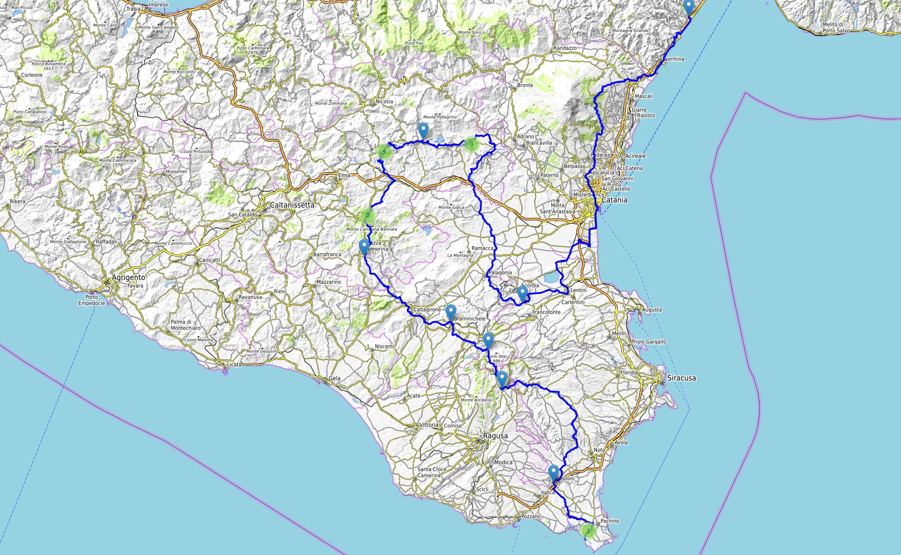

In the attached [link](https://pd-allen.github.io/docs/HastyPs2d.html), you can click on the individual icons to get a summary of the day. If you zoom in you can see all of the points.

I also have been experimenting with a 3-dimensional map to show the terrain of the island.

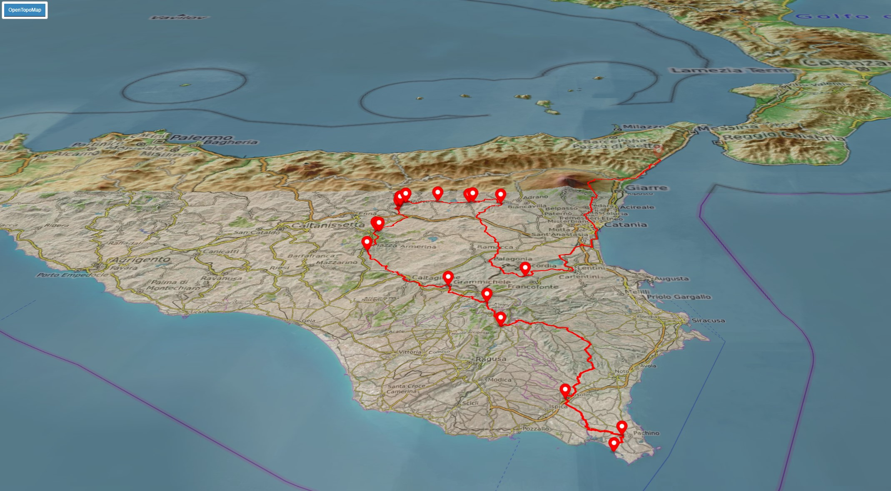

This [link](https://pd-allen.github.io/docs/HastyPs.html) allows you to explore the terrain in more detail. The button on the upper left will toggle the map on or off so you can see the underlying terrain. Right Clicking and dragging will change the viewing angle. Zooming in will allow you to get an idea of the rugged terrain.

### Climbing Monte Assoro

The Canadians’ advance was a series of assaults against mountain top towns. The Italians were very ineffective in defending the island, so the Germans rushed reinforcement troops to Sicily.

Hitler berated Mussolini for the poor performance of the Italian troops when they met on 19 July and immediately sent two divisions to shore up the Sicily defences.

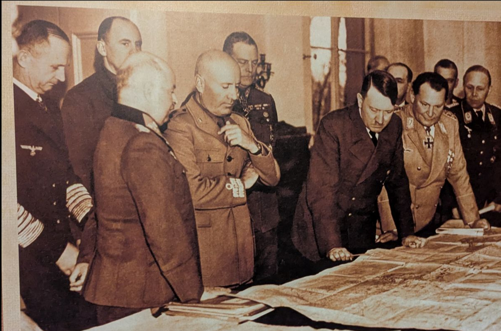

Fairly early on the Germans decided that they could not hold Sicily, so they set up a series of defensive lines in well fortified mountain villages, inflicted maximum damage on the attacking force then withdrew to their next strong point.

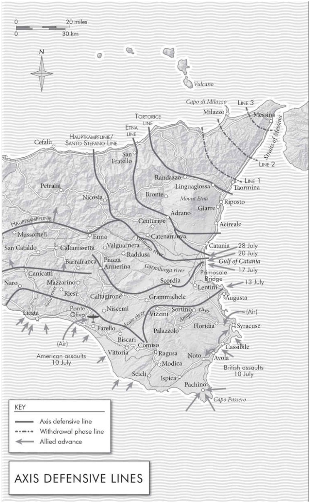

A typical example of the fighting was at Leonforte. The Royal Canadian Regiment was selected to attack the city, but the winding road was completely exposed to the German positions on Monte Assoro. Atop Monte Assoro was the 11th Century Norman Castle which had never been successfully assaulted. The back of Assoro was a nearly vertical rock face which soared 1000 ft in the air.

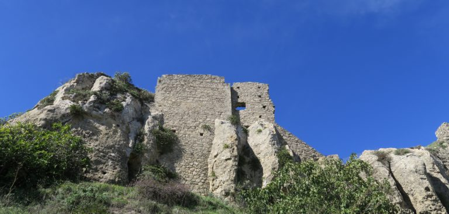

The HastyPs Commanding Officer, Lieutenant Colonel Sutcliffe, went on a reconnaissance mission to determine if the rock face was capable of being scaled and was killed by an artillery shell after the glint from his binoculars was detected. His replacement decided that the only way to accomplish the impossible was to attempt the impossible. He thereupon decided that the battalion would make a right flank march by night across the intervening trackless gullies to the foot of the great cliff, scale that precipitous wall and, just at dawn, take the summit by surprise. A topographic map shows the heights and the winding roads up the front of the mountain.

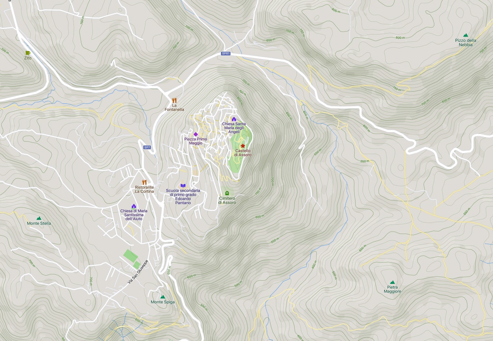

The description of the climb is given by Farley in “No Birds Sang”:

*It was nearly 2100 hours, and we were running late. Hurriedly we clambered off our iron steeds and formed up in single file. There was not a breath of wind and the air was filled with a pungent odour that nagged at my memory until I realized it was the tang of sage— a scent I had last smelled in the summer of 1938 on the arid plains of southwestern Saskatchewan where I had gone to study prairie dogs, sage hens, rattlesnakes and burrowing owls. That seemed an interminable distance in the past. Now I was part of a sinuous human centipede crawling on hundreds of awkward feet into the gathering darkness of another desert, in another world. We did our best to be silent, for we were tensely fearful of discovery. It seemed inconceivable that the Germans would not at least have listening posts on this exposed flank, no matter how secure they felt. There were some terrifying moments. The first came when our scouts stumbled on a man-made stone parapet that turned out to be a masked machine-gun post. It was unoccupied, but so recently had it been abandoned that crusts of dark bread left lying on the ground were still moist. Hours later I was in the lead when I heard the rattle of stones on the far slope of a black gully into which we were blindly descending. I sank back into the shadows, tensed for the exploding moment. I heard rifles and Bren guns being softly cocked and held my own carbine before me at hip level, finger sweating on the trigger. There was indistinct movement and then a herd of goats slowly emerged into the dim starlight and, behind them, a ragged Sicilian youth. He did not see us at first, but the goats did and snorted as he drove them forward. Then he was face to face with me, gaping incredulously as he took in the motionless shapes of armed men on every side. He said not a word but passed slowly on as in a dream. As the night began to wane, we were driven onward by increasing urgency, knowing we had to reach that massive cliff and scale it before the dawn revealed us to watchers who had the view of eagles. Fatigue was taking its toll but there could be no slowing down. The whispered order came forward, man to man, telling us to let the second assault platoon move into the lead so the pace could be maintained. My twenty shadows and I slumped amongst the rocks while twenty others stumbled past. Many of them were limping. My own right foot was an agony because of a cracked sole through which gravel and twigs had worked their way. But I saw one man with no boots at all, stubbornly struggling through the mountains of Sicily on his bare, white feet. As we fell in at the rear of the assault company, I yearned for one of those magical Benzedrine tablets which had sustained me on the long march from the beaches. I did not think I could hold out much longer. Yet on we went— and on— until, at about 0400, under the pallid light of the late-rising crescent moon, we scaled the final ridge... and were appalled to find that the base of the mountain wall looming sheer above was still separated from us by a gully a hundred or so feet deep and as steep-sided as any ancient moat. There was no way around it. Neither was there time to beat a retreat before dawn would catch us in the open. Somehow, we lowered our aching bodies into that great ditch, struggled through the rubble of boulders that filled the bottom and finally stood, gasping, at the foot of the precipice of Assoro whose crest was still hidden in the fading night.*

*During the climb that followed, each of us performed his own private miracle. From ledge to ledge, we oozed upward like some vast mould. Those who faltered clung with straining muscles until someone heaved from behind or hauled them from above. Weapons were passed up hand to hand; and no man dropped so much as a clip of ammunition... which was as well, for any sound by one would have been fatal to us all. Alex had ordered my platoon and one other to lead the climb. My crowd was on the left and we were luckier than our companion platoon for we eventually reached some narrow terraces which may have been constructed in some distant age to grow food for beleaguered dwellers in the castle, but which had been abandoned to thorns and weeds for centuries past. These made progress a little easier, but by the time we had scrambled up over several of them I had reached the end of my tether. Someone heaved himself past me, turned and gave the thumbs-up signal. It was A.K. Long. He leapt up to the next ledge, then caught my hand and pulled me after him. To the eastward a ripple of light was spreading across the sky. Dawn was bursting on us with subtropic swiftness. Long jumped to catch the lip of what seemed to be the next terrace and disappeared above me. Then with horrifying abruptness the silence was destroyed by the barking of a Tommy gun. The voice of God Himself announcing the world’s end could not have terrified me more. I was certain that the harsh staccato, reverberating back and forth from cliff to cliff, would assail the ears of every German within a hundred miles. With a convulsive effort I clawed at the rim of what proved to be the last ledge and hauled myself over the top. The crumbling wall of the ancient castle loomed close at hand. Directly in front of me and only a few feet distant, A.K. Long was down on one knee with his Tommy levelled at three German privates standing as rigid as store dummies beside a tripod-mounted telescope.*

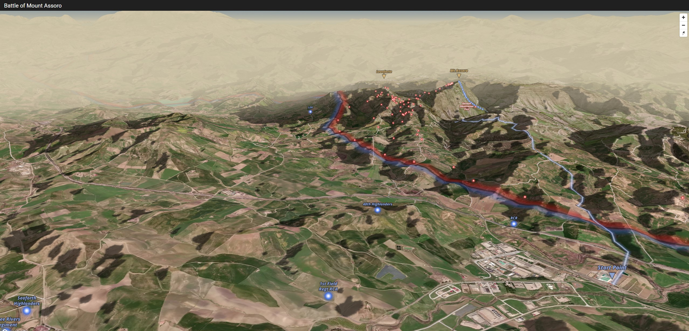

The blue line shows the HastyP route across the gullies and up the rock face. The cliff is shown in this close up.

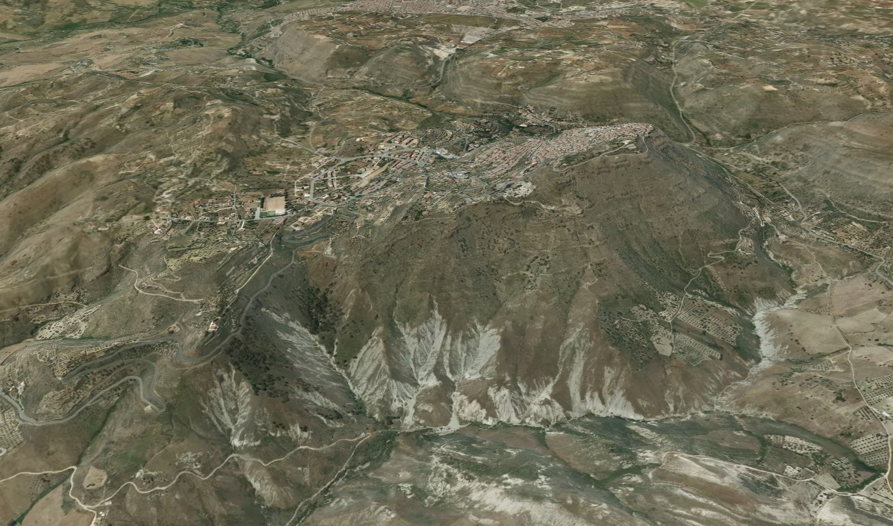

The HastyPs discovered only the Artillery spotting crew was at the top of the mountain and the Germans were down the hill. The HastyPs opened fire, inflicting damage initially but the Germans quickly began shelling their positions. The HastyPs grabbed the spotting telescope; the second in command Maj Alexander, a former Artillery Officer, called in rounds to suppress enemy fire. The regiment was resupplied up the same cliff face and ended up spending 2 days exposed on top of the mountain. There is a monument to their actions overlooking the climb.

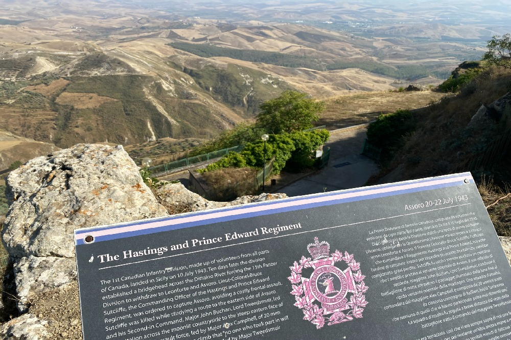

The plaque reads:

*The 1st Canadian Infantry Division made up of volunteers from all parts of Canada, landed in Sicily on 10 July 1943. Ten days later the division established a bridgehead across the Dittaln Rive forcing the 15th Panzer Division to withdraw to Leonforte and Assoro. Lieutenant Colonel Bruce Sutcliffe, the Commanding Officer of the Hastings and Prince Edward Regiment, was ordered to capture Assoro, avoiding a costly frontal assault. Sutcliffe was killed while studying a route to the eastern side of Assoro and his Second-in Command, Major John Buchan, Lord Tweedsmuir, led the battalion across the moonlit countryside to the steep eastern face of the mountain. An assault force, led my Maj Alex Campbell, of 20 men from each rifle company began a climb that “no one who took part in will ever forger.” The remainder of the battalion led my Maj Tweedsmuir followed closely behind the assaulting company.*

*The mountain was terraced and always above as a tantalizing false crest, which unfolded to another crest when one approached it. It was forty sweating, tearing minutes before we stood on the top inside the great Norman castle and realized we had achieved complete surprise.*

*They waged a day-long battle for Assoro. The next morning the battalion was resupplied by 100 volunteers from the Royal Canadian Regiment who bought food, water and ammunition to the foot of the mountain. With the support of the 48th Highlanders of Canada and the Royal Canadian Artillery the men of the HastyPs completed the liberation of Assoro on 22 July 194. No medals were conferred for the actions of Assoro. Field Marshall Montgomery is said to have remarked that this single action alone, shortened the Sicilian campaign by five days.*

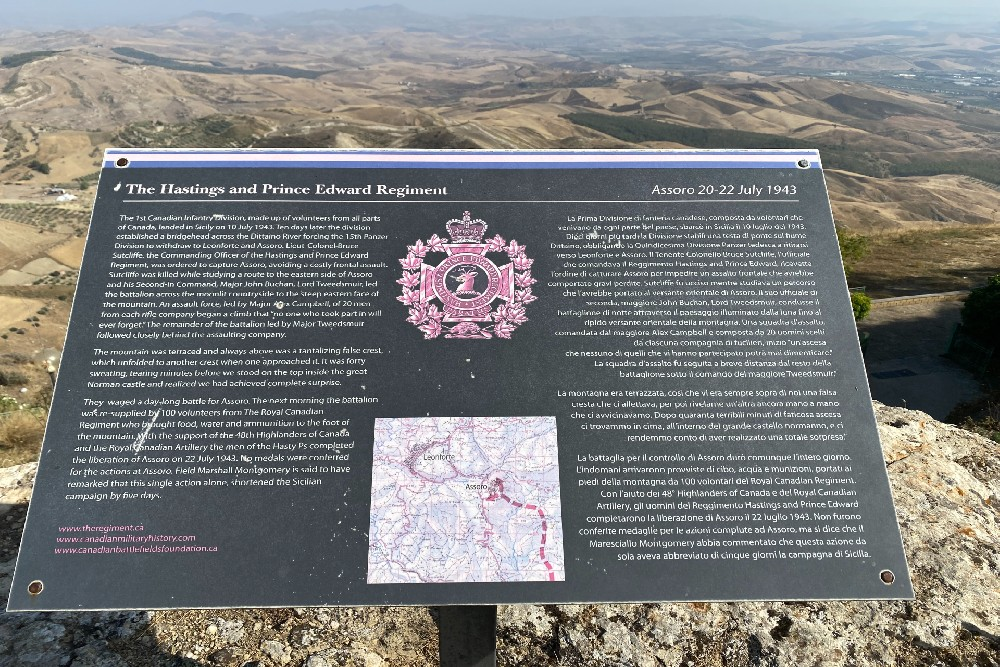

### Taormina

We will take a small detour to Taormina to show the layout of a representative mountain town. We stayed in Taormina for New Years. It was a typical mountain top village, built in 403 BC after the beach town of Naxos was razed in 396 BC by the folks from Syracuse because Naxos had sided with Messina in a conflict. The town was rebuilt on Mount Taurus to make it easier to defend. Taormina is terraced on the side of the mountain with the obligatory castle at the peak.

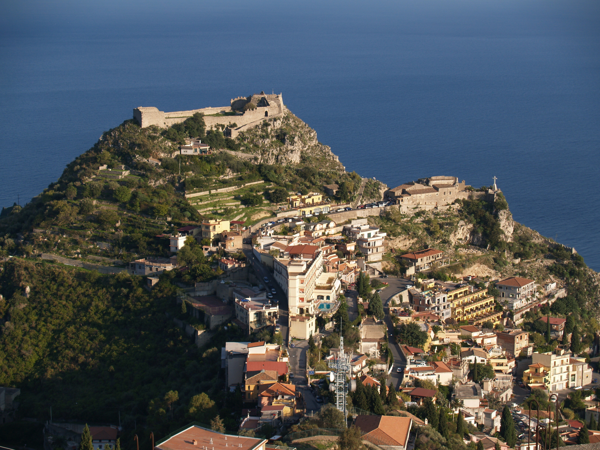

The Train station is along the waterfront. The view from the station shows the town built on the mountain side.

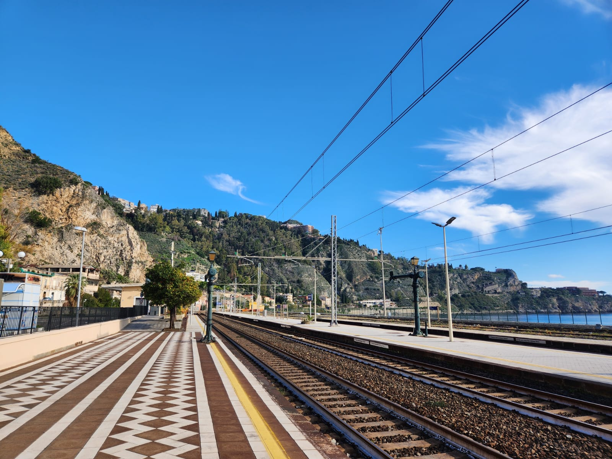

The view back down to the station from the town.

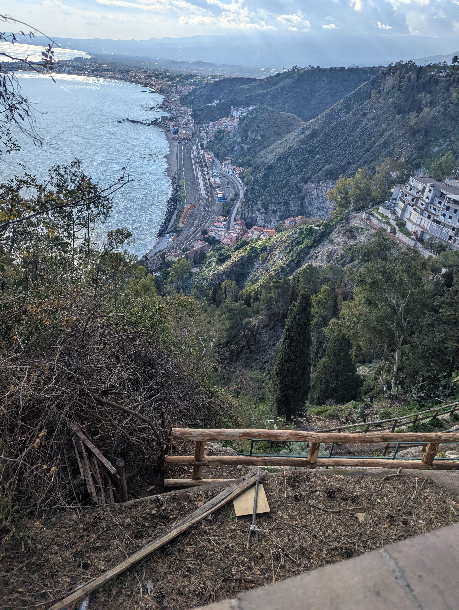

The Greek theatre was built in the third century BC, located for its spectacular views of Mount Etna and the coastline. The theatre was rebuilt by the Romans in the first century. You can see the height of the town above the water.

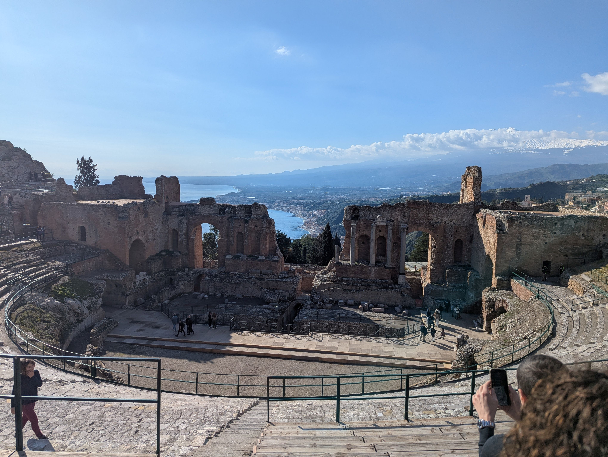

Mount Etna was in the clouds, but the next day the view from our hotel room window featured Etna in all its glory, all we were missing was a small lava flow. Yes, there is a water bottle in the top of the tall stack. Not sure why.

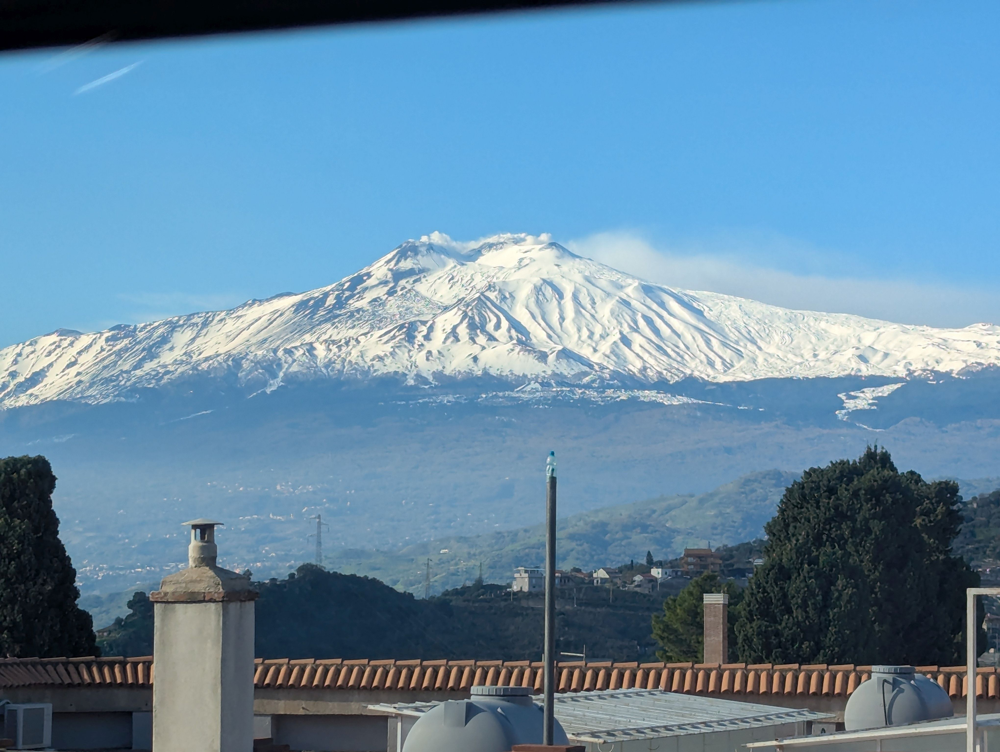

The Brits went through Taormina on their way to Messina. The town was bombed but suffered relatively little damage. The railyards were severely damaged and the Former Church of Sant'Antonio Abate, dating from 1330, was completely destroyed and rebuilt from the rubble.

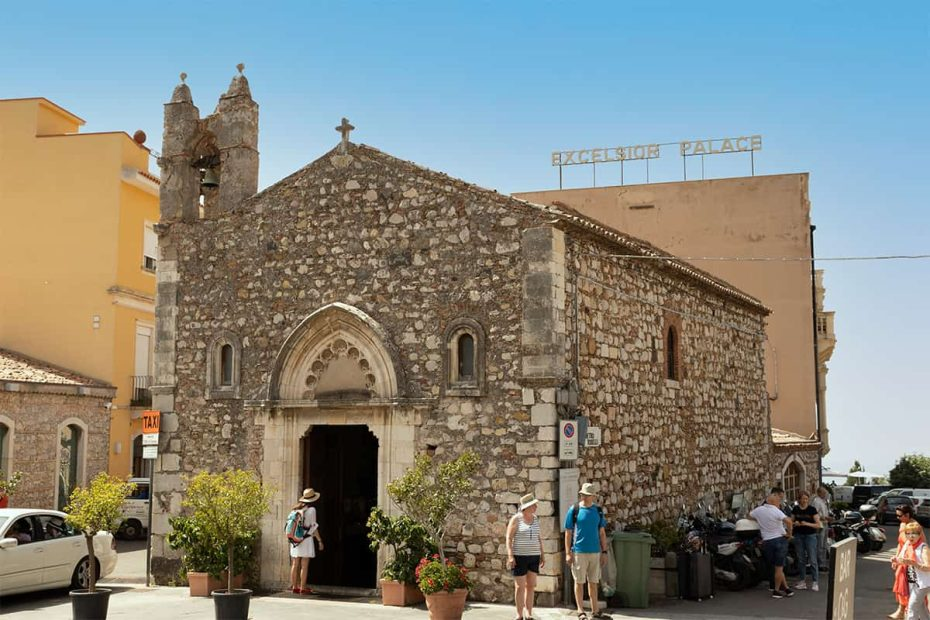

## Catania

The other city we visited in Sicily was Catania, a strategic city and port that suffered extensive damage due to Allied bombing campaigns and an extended battle to capture the city. The Allies had executed 87 separate bombing raids on Catania resulting in 70% of the buildings being destroyed or heavily damaged.

The Brits had progressed well until they got to the Primosole Bridge south of Catania, as discussed in the Airborne section. Germans had rushed reinforcements to Sicily and made effective use of the rivers, terrain and well-placed defences to slow the assault. The battle lasted three weeks, delaying the British advance on Messina.

Somebody else had produced Catania before and after photos that shows the amount of damage suffered.

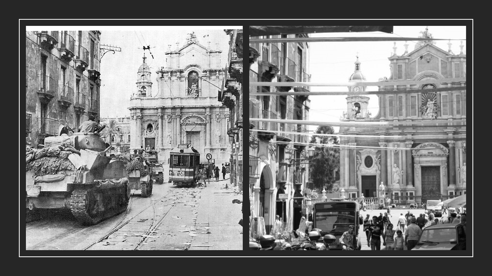

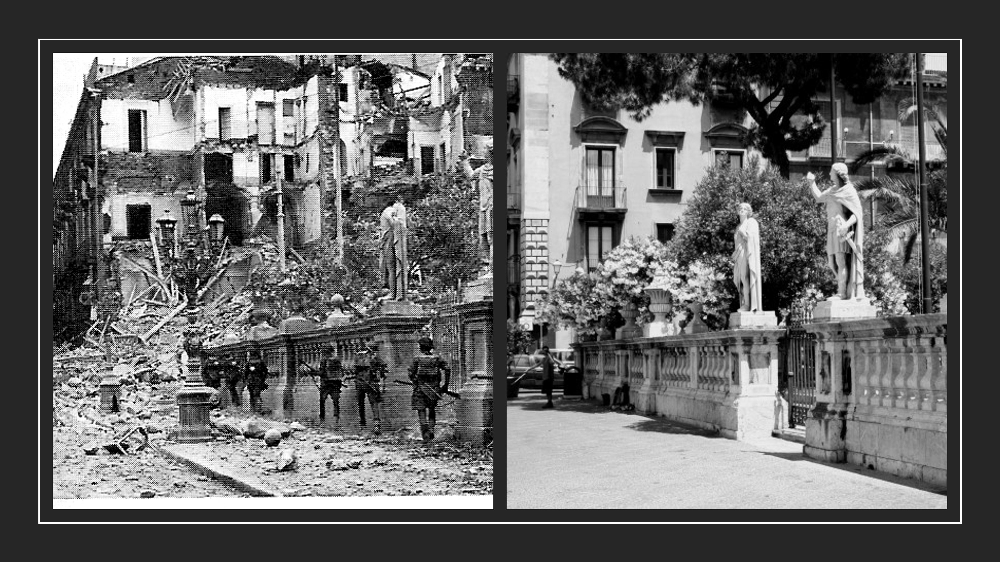

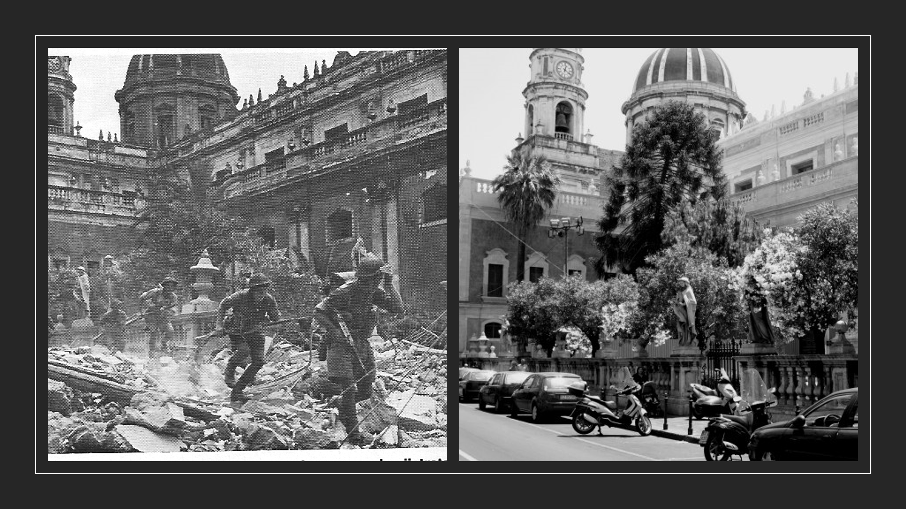

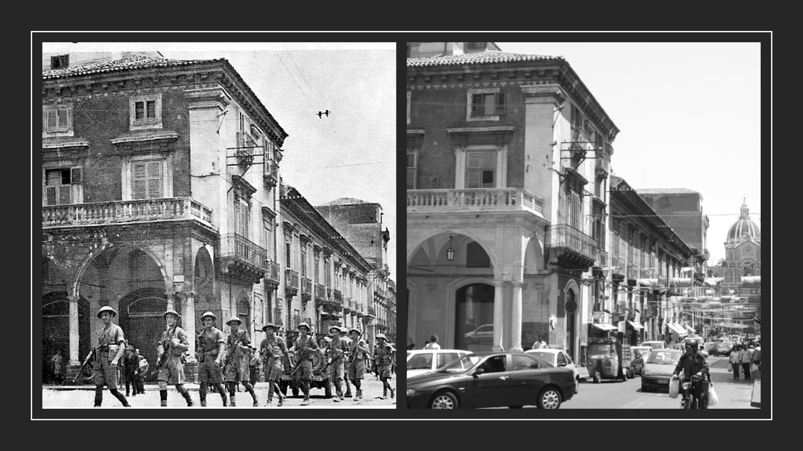

The extensive damage was throughout the city, leading to a massive reconstruction effort after the war.

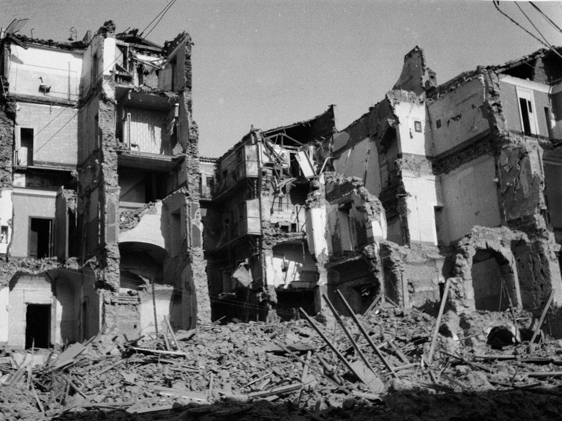

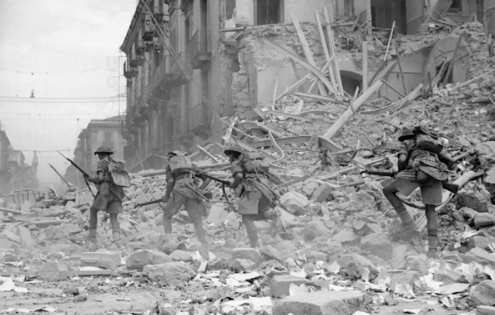


The Catania Harbour was also heavily bombed.


The bombing of critical infrastructures was key to controlling Axis movement and resupply.


Despite the catastrophic damage, the Allies were welcomed as liberators from the Fascist rule of Mussolini and the occupation of the Germans.


## Messina

The Germans fought an effective delaying campaign, inflicting many casualties on the Allies as Sicily was liberated. As the Germans were squeezed by the Allies on all sides, they decided to retreat through Messina to the mainland. Hitler was very concerned about saving the soldiers, especially after having 250,000 Axis soldiers captured in North Africa. To ensure they would be able to cross the channel, Messina had a massive collection of antiaircraft guns to protect the fleeing fleet. Approximately 500 guns guarded the strait, of which more than 300 were antiaircraft guns, and Allied bomber pilots described the flak over the Messina corridor as the thickest they had ever seen.

Sicilian children watch the Axis troops retreat to the mainland.


There was a great deal of criticism on the finale of Operation Husky. The feeling was there should have been a concentrated Air and Naval presence to stop the flow of Axis soldiers and equipment. The heavily defended Messina and the treacherous currents in the Strait of Messina caused a cautious approach that facilitated the Axis evacuation.

By 17 August 1943 the battle for Sicily was over. The Italians evacuated more than 62,000 soldiers. The Germans evacuated 39,569 men, along with 9,605 vehicles, 94 guns and 47 tanks, most of which the Allies would face during the Invasion of the Italian mainland.

# Museums

We visited the Operation Husky Museum in the Lascaris War Rooms on Malta, followed a few days later by the Sicily 1943 Museum in Catania. It was a very interesting comparison, the Op Husky Museum focused a good deal on the planning and execution, while the Sicily Museum focused on the impact to the population. Many of the pictures in this post are taken from story boards from both museums, the ones from the Sicily museum have the slightly odd Google translate generated titles. There are also many shared pictures between the two museums. This one appears more than once in each museum.


The Sicily museum obviously gave much more emphasis on the Italian efforts with a series of maps that chronicled the day-by-day activities. Op Husky Museum largely dismissed the Italian contributions.


The summary from General Guzzoni.


The Sicily museum also had an interesting map display that showed the progress of the Allies on a daily basis. I find these maps give you a great overview of the battle and puts individual conflicts into perspective.


Of course, with any Italian display, fashion is paramount.


There is also a good display of the Canadian units that served in Sicily. I was impressed that the Italians gave that much space for the Canucks, but the display was sponsored by a number of former Canadian Officers.


The Hasty Ps Commanding Officer, Lieutenant Bruce Sutcliffe, gets a special shout out.


The museum has the obligatory Allied Projector Infantry Anti Tank (PIAT), the weapon that forced the operator to be suicidally close to the tank in order to be effective.


Rachel surprised that a cement bomb could wreak the havoc shown in the photos above.


Also part of the museum exhibit was a photo gallery by Phil Stern a US photographer who covered the landings. He returned 70 years later to revisit the landings.


He took candid photos of civilian and military personnel.


After the war, Phil became a famous celebrity photographer.


A photo montage from his work.


# Aftermath

Mussolini was stripped of power on 25 July 1943 and the Fascist government fell, with power reverting to the King Victor Emmanuel of Italy who had ruled since 1900. He ruled until 09 May 1946, when King Umberto II took over. One month later, on 12 June 1946 a referendum ended the Monarchy.

Although the monarchy assured Hitler they would remain in the war, the Italians sought a secret armistice with the Allies, signed in Sicily on 03 September 1943.


Eisenhower was also present at the signing as indicated in this diorama. On 13 October 1943, the Kingdom of Italy declared war on Germany and fought on the Allied side until the end of the war.


German forces lost 4,325 men killed, 4,583 missing, 5,532 captured and 13,500 wounded, a total of 27,940 casualties. The Italian military losses were 4,678 killed, 36,072 missing, 32,500 wounded and 116,681 captured.

The U.S. Seventh Army lost 8,781men (2,237 killed or missing, 5,946 wounded, and 598 captured), while the British Eighth Army suffered 11,843 casualties (2,062 killed or missing, 7,137 wounded and 2,644 captured). The U.S. Navy lost 546 killed or missing and 484 wounded and the Royal Navy lost 314 killed or missing, 411 wounded and four captured. The USAAF reported 28 killed, 88 missing and 41 wounded.

Canadian forces had suffered 2,310 casualties, including 562 killed, 1,664 wounded, and 84 captured.

The Sicily 1943 Museum has a tomb of an unknown soldier with a photographic background of the Catania Military Cemetery with Mount Etna featured. The cemetery has 2,135 burials including 112 unknown soldiers. This cemetery has 1,958 British burials and 12 RCAF members. The display lists all of the soldiers killed in the Sicily campaign on both sides, one name at a time, a very effective display of the impact of the invasion.


Of the 562 Canadians killed, 484 are buried in Agira Canadian Cemetery.


Those with no known grave are commemorated on pillars in the Cassino War Cemetery Memorial in the shadow of Monte Cassino.


Our tour of Malta and Sicily was very enjoyable, and highly recommended to all potential travellers. Like most tours, we are keen to return and dig deeper into the history. On the 75th and  80th Anniversary there was a walking tour that retraced the Canadians route through Sicily. The march which took 19 days and covered over 300 km was completed by serving members of units that participated in Operation Husky and some die hard historians. I would like to follow the route but would be riding instead of marching. If you are keen, here is an old poster.


* [Second World War](https://www.paulsbattlefieldtours.com/blog/categories/second-world-war)