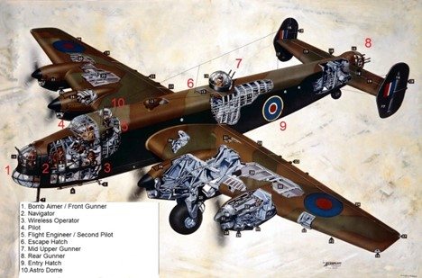
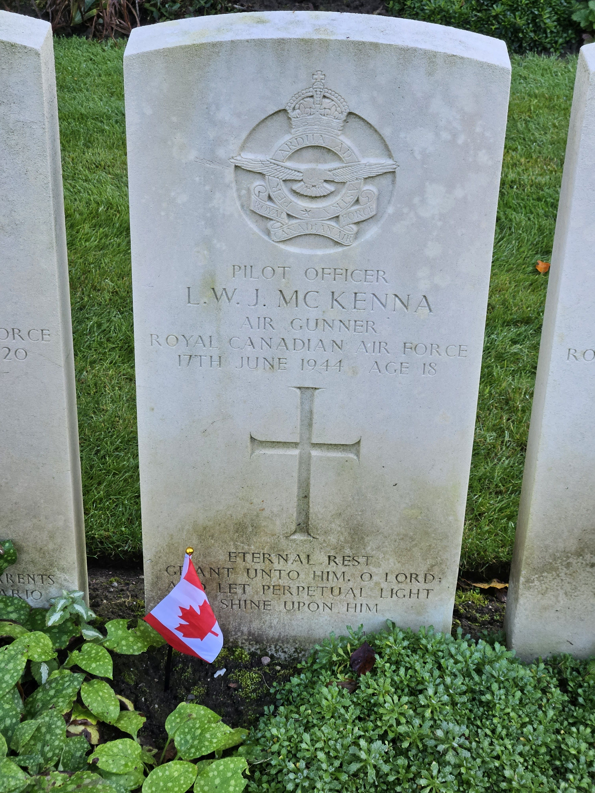

# Pilot Officer Leslie McKenna

* [pd-allen](https://www.paulsbattlefieldtours.com/profile/pd-allen/profile)
* Oct 19, 2023
* 4 min read

Leslie William Joseph McKenna was born on 28 Dec 1924 in Stonecliffe, ON son of William McKenna and Margret Ellen Conway. They lived in North Bay when Leslie enlisted, a few days after his 18th birthday. Leslie was sent to Number 3 Manning Depot in Edmonton, Alberta for Basic Training and then to Number 10 Service Flight Training School in Dauphin, Manitoba.

During the early days of the war, air crew were expected to have Junior Matriculation, but the shortage of qualified personnel led to the creation of Pre Aircrew Training Centres to improve the student’s academic standing. Leslie attended No 9 Pre-Aircrew Detachment at McGill University, Montreal.

He was designated as an Air Gunner, so attended Number 1 Air Gunners Ground Training School Quebec City, where he learned to fire and care for machine guns, and naturally did a good deal of parade square bashing. He continued his Air Gunner Training at No 9 Bombing and Gunnery School, Mont Joli QC, near Rimouski to train as an Air Gunner, Course 59. Upon successful completion of the course, he was promoted to Technical Sergeant in Sep 1943. He logged 26 hours of flying time on the course.

Leslie was sent directly overseas, and in Nov 1943 he was assigned to No 20 Operational Training Unit (OUT) at RAF Lossiemouth, Scotland to train on the Vickers Wellington Bomber. The aircrew typically spent about 2 months at the OTU, and flew between 80 and 100 hours, roughly split between day and night. Early on in the training, they were assigned to specific crews. This assignment was done among the crews themselves, typically the pilots would sit down with a cup of tea and a cigarette, and chat with the other crew members, and mutually decide on the crew composition.

Upon completion of the OTU, Leslie was assigned to 1658 Heavy Conversion Unit RAF Riccall, North Yorkshire to train on Halifax Bombers. The four-to-six-*week* Heavy Conversion course consisted of ground instruction, along with approximately 40 hours of flying, in a Handley Page Halifax.

Crew Positions on the Halifax.

Leslie finally made it to an operational squadron, 102 Squadron located at RAF Pocklington on 25 May 1944, almost 18 months since he enlisted. Unfortunately, his crew only flew two missions before being shot down. On 14 Jun 44, 337 aircraft – 223 Lancasters, 100 Halifaxes, 14 Mosquitoes – of 4, 5 and 8 Groups attacked German troop and vehicle positions at Aunay-sur-Odon and Évrecy, near Caen. These raids were prepared and executed in great haste, in response to an army report giving details of the presence of major German units. The weather was clear and both targets were successfully bombed. The target at Aunay, where the marking was shared by 5 and 8 Groups, was particularly accurate. No aircraft were lost.

On 16 Jun 44, 321 aircraft – 162 Halifaxes, 147 Lancasters, 12 Mosquitoes – of 1, 4, 6 and 8 Groups to attack the synthetic-oil plant despite a poor weather forecast.

The target was found to be covered by thick cloud and the Pathfinder markers quickly disappeared. The Main Force crews could do little but bomb on to the diminishing glow of the markers in the cloud. R.A.F. photographic reconnaissance and German reports agree that most of the bombing was scattered, although some bombs did fall in the plant area, but with little effect upon production.

Unfortunately, the route of the bomber stream passed near a German night-fighter beacon at Bocholt, only 30 miles from Sterkrade. The German controller had chosen this beacon as the holding point for his night fighters. Approximately 21 bombers were shot down by fighters and a further 10 by Flak. 22 of the lost aircraft were Halifaxes, these losses being 13.6 percent of the 162 Halifaxes on the raid. 77 Squadron, from Full Sutton near York, lost 7 of its 23 Halifaxes taking part in the raid, including MZ-562 with P/O McKenna on board.

German A.S.C. states that an aircraft crashed near Oeding at 01.40 hrs, on 17.6.44 and was completely destroyed. German reports also German nightfighters had chased this bomber over HOLLAND where it had dropped it's bomb load. The a/c crashed in flames and disintegrated and destroyed ail possible means of identification of crew and aircraft. Those crew members who were recovered, were quite unidentifiable. They were found in the remains of the aircraft and were buried at Oeding on 18.6.44 at 17.00 hrs. The report also states, that the entire crew was completely smashed up, and that it was impossible to state how many remains were actually recovered.

A memorial was raised near the crash site in Südlohn-Oeding, near the Dutch-German Border. Details of the plaque and the final interment in Reichswald Forest War Cemetery are included in a separate post.

Close up of the plaque.

After the war, the crew was reinterred in Reichswald Forest War Cemetery. Only F/O Rushforth and F/Sgt Peel could be positively identified, the remainder of the crew was buried in a communal plot.

Leslie's headstone.

* [Second World War](https://www.paulsbattlefieldtours.com/blog/categories/second-world-war)