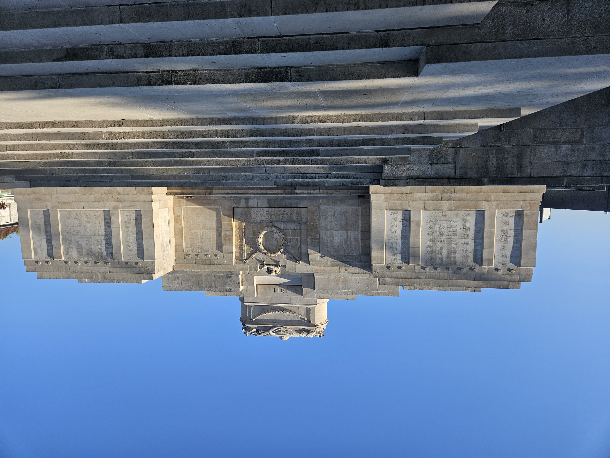
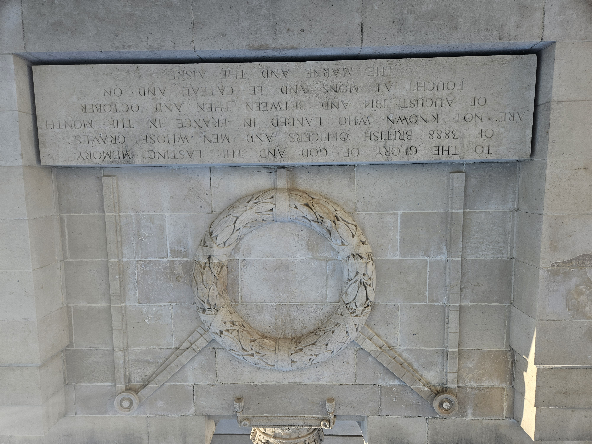
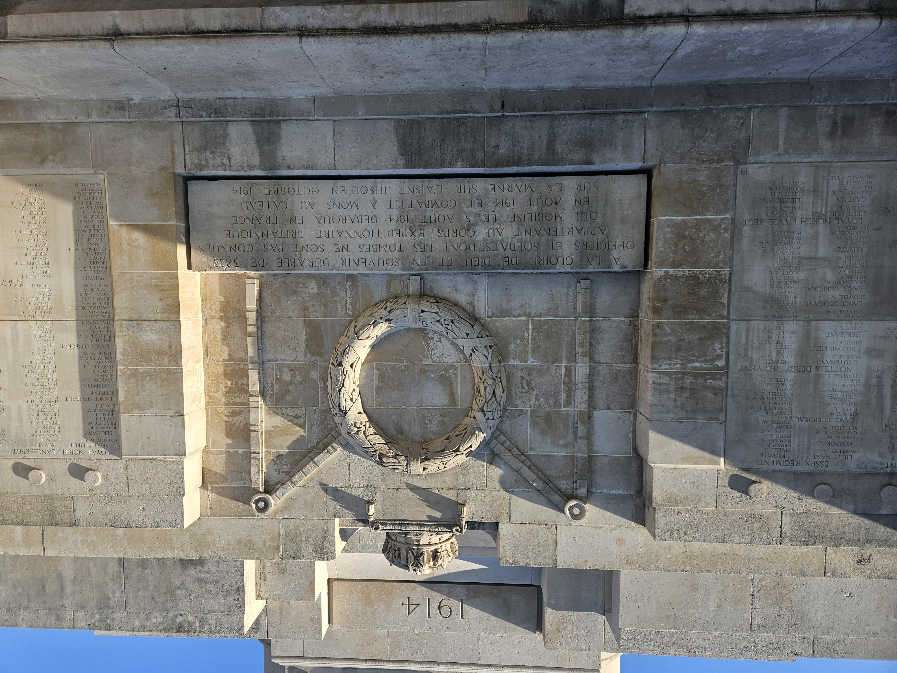
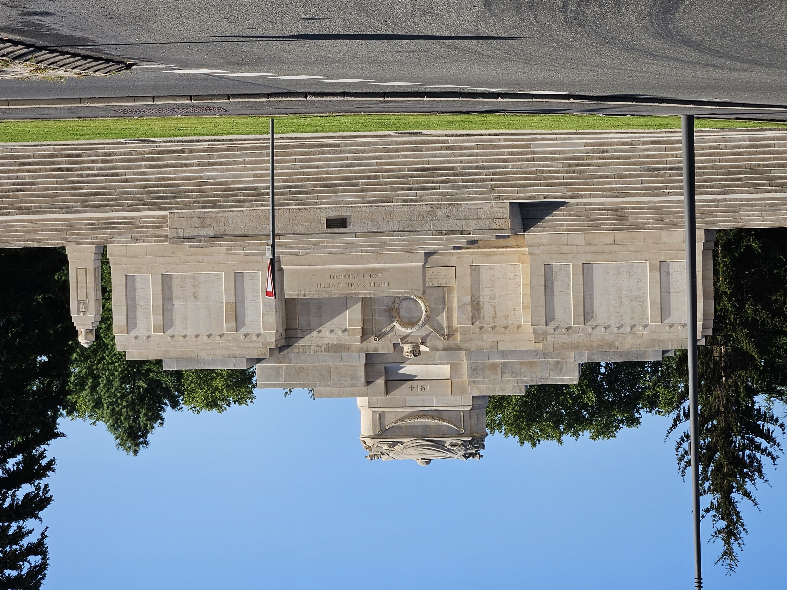

# Pre-Season Tour La Ferté-sous-Jouarre Memorial to the Missing

* [pd-allen](https://www.paulsbattlefieldtours.com/profile/pd-allen/profile)
* Sep 9, 2023
* 2 min read

Updated: Jul 2, 2025

Pre-Season Tour La Ferté-sous-Jouarre Memorial to the Missing

**La Ferté-sous-Jouarre British Memorial to the Missing**

I arrived in Paris a day early for the tour, taking the convenient but early arriving Air France direct flight from Ottawa. We landed just before 6AM so I took the day to visit La Ferté-sous-Jouarre Memorial to the Missing, about 45 minutes southeast of the airport.

The Memorial to the Missing commemorates the British Soldiers with no known grave from their arrival in Belgium in August to the end of October 1914. The monument is located on the Marne River where the French and British took a stand after continuous retreating from the first Battle in Mons Belgium to the first successful counterattack on the Marne River. The memorial when unveiled in 1928 listed 3888 missing soldiers, the Commonwealth War Graves Commission, who manages memorials worldwide, currently lists 3,740 missing, hopefully because a few were identified over the almost 100 years.

**Dedication**

**Francais au Verso**

**View from Across the Street – Memorial is adjacent to a Busy Traffic Circle**

This memorial is meaningful to me since Lance Sgt Henry Goodfellow 2nd Battalion Suffolks Regiment is listed and he is a cousin of my Maternal Grandmother Annie Goodfellow, a British War Bride. 75 Suffolks are listed on this memorial as compared with only 6 who have known graves in the same time period. I didn’t count all the names on the memorial, but I did count all the Suffolks boys. Henry’s military history will be posted in a separate blog.

**Henry Goodfellow’s Listing**

A bonus while visiting the Memorial, a bus load of old boys from the Grenadier Guards and Royal Fusiliers of London Associations showed up to commemorate 08 Sep 1914, the day that the British Expeditionary force launched a successful counterattack that stopped the Germans from taking Paris.

**French and British Soldiers Marking the Day**

**Memorial Wreaths and Flowers**

As you can tell from the pictures, it was a beautiful, very warm day, so I did my best to remain hydrated and had un petit plat to celebrate the missing.

**Memorial Lunch**

* [First World War](https://www.paulsbattlefieldtours.com/blog/categories/first-world-war)
* [Family](https://www.paulsbattlefieldtours.com/blog/categories/family)