# Private Percy Mervyn At the Leopold Canal

* [pd-allen](https://www.paulsbattlefieldtours.com/profile/pd-allen/profile)
* Nov 26, 2024
* 15 min read

Updated: Oct 31, 2025

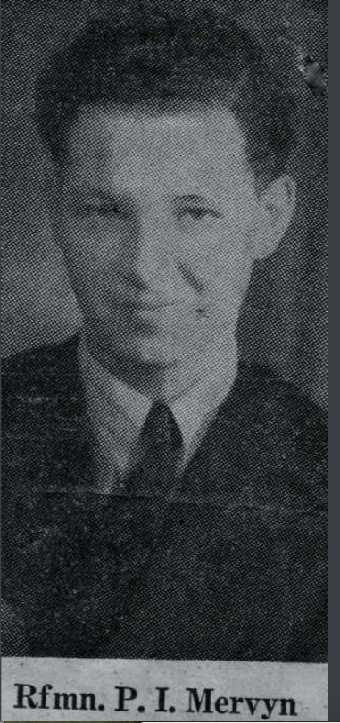

# Early Years

Percy Ivan Mervyn was born on February 20, 1925, to Albert Mervyn and Dorothy Mittie Dickson in Sault Ste Marie. He was their second son. His older brother Albert Mervyn was born on March 20, 1921, also in Sault Ste Marie. At the time of both boys’ births, Albert Senior was a Locomotive Fireman working for CP Rail. Albert Senior worked as a Fireman and then as an Engineer for CP Rail until he died. In fact, Albert Sr was 60 on December 7, 1958, when he died in the cab of a diesel engine of an eastbound CPR passenger train as it rolled into the Sudbury yards. Albert Sr. was born on May 11, 1899, on Barrie Island to William Mervyn and Jane Barr Merrylees. The young boys often visited their grandparents on Barrie Island, enjoying the farm and the country life. Percy and his mother when he was a young lad.

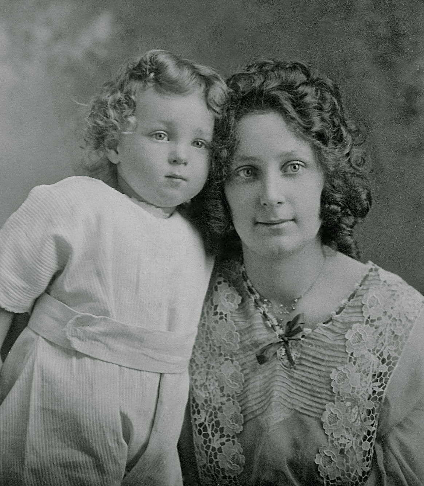

We came across Percy when Barb Drury, my sister Diane’s best friend, posted his picture for Remembrance Day. Percy was Barb’s uncle and when we found out he was buried in Adegem Cemetery, in Belgium we wanted to learn his story.

By January 1944. The Mervyn family, Percy, his parents and his brother, Albert were living in Sudbury. He was not yet 19 years old. He had completed Grade 9 and one year in Technical School. He left school at age 15 to go to work. He worked for 8 months as a truck driver and then for 1 year at the International Nickel Company as a Smelter man for 59 cents an hour. At the time of enlistment, he was working for Canadian Pacific Railway as a Locomotive Fireman for $75 a week. This was seen as a very high salary for an 18-year-old. Railroad work had strong appeal to Percy. Both his father and his older brother Albert were Engineers or Firemen. He also had a bit of experience at the controls of a locomotive and planned to make that his vocation.

At that time, Percy decided to enlist in the armed forces. He expressed a keen desire to become a paratrooper. It was recommended that he be assigned to the Infantry and was suitable for Normal Basic Training.

# Military Service

Percy enrolled on 19 January 1944 at the [#2](https://www.paulsbattlefieldtours.com/blog/hashtags/2) Air Force District Depot in Toronto. At the time members could not be recruited until they turned 19. A few days before his 19th birthday, Percy was transferred to the Army [#20](https://www.paulsbattlefieldtours.com/blog/hashtags/20) Basic Training Centre in Brantford, Ontario. Once he completed basic training, he was transferred to [#A10](https://www.paulsbattlefieldtours.com/blog/hashtags/A10) Canadian Infantry Training Centre (CITC) in Borden Ontario.

While at Borden, Percy was often in hot water, serving various punishments for being Absent Without Leave. They were always short absences, no doubt he was attracted by the bright lights of the big town of Barrie. Having done my Aerospace Engineering training in Borden for 3 stints in 3 consecutive years, I can commiserate with Percy on the need to escape the base.

His escapades didn’t hurt him, as evidenced in his graduation report:

*Enlisted. 19 Jan 44, Completed. Basic Training at No 20 B.T.C. Brantford, Completed Corps Training Infantry at A-10,* [*C.I.TC*](http://C.I.TC)*.*

*4 entries on M.F.M. 6. (Only reference to his sins, recorded on Militia Form M.6)*

*Well-built good-looking boy with a quiet likeable personality who is fully adjusted. Has completed training without difficulty has shown willingness to learn and an ability to absorb his training, Handling of weapons came easily to him as did most subjects. Reaction to overseas is good and he seems anxious to become an. efficient and. reliable soldier.*

*Examination of the foregoing and interview suitability for overseas service in Infantry (others) operational.*

Percy was sent overseas on 04 August 1944 as part of Overseas Serial 294(B). He arrived in England a week later and was assigned to the 3rd Infantry Division Reinforcement Unit (CIRU). After a month in England, Percy was sent to the X-4 list (Replacements not yet assigned to Combat Units) in France and joined the Royal Winnipeg Rifles on 19 September.

# Royal Winnipeg Rifles.

## D-Day

The Royal Winnipeg Rifles had been part of the original D-Day invasion force, landing on Juno Beach on the morning of 06 June and fighting their way through Normandy. They had fought at Carpiquet, Caen and Falaise before heading north to clear the Channel ports. The Canadian Army had cleared the ports of Le Havre, Dieppe and Boulonge and were in the process of clearing Calais and the Gun Batteries at Cap Gris Nez when Percy joined the regiment.

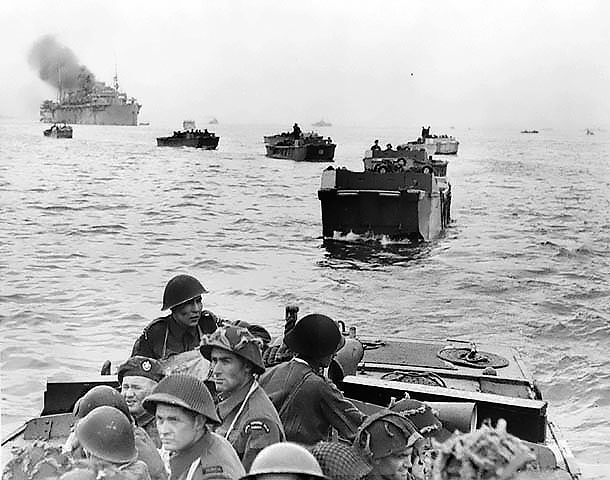

As the Allies progressed away from Normandy, the supply line became exceedingly long, taking 3 gallons of gasoline to deliver 1 gallon to the front, highlighting the need for ports that were closer to the front line. Hitler knew the importance of the ports, so declared them all fortresses to be defended to the last man. Fortunately, Dieppe was abandoned on 01 September before the order was issued and the port opened by 09 September. Le Havre was taken on 12 September but severe damage to the port delayed the opening until 09 October. Boulonge was taken on 22 September but extensive damage to the port meant it was only open in mid October.

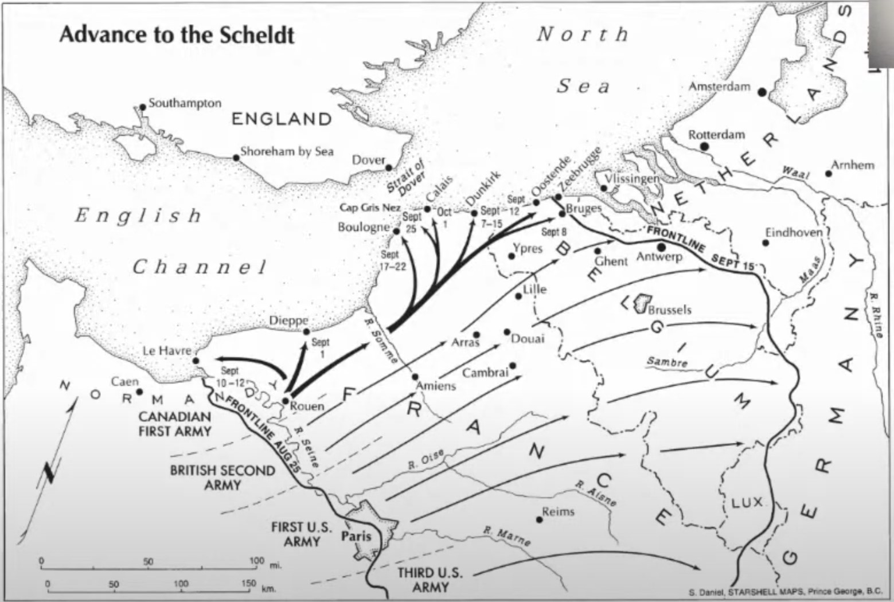

## Clearance of Calais

Next up was the Port of Calais. The gun emplacements at Cap Gris Nez also needed to be taken as the massive guns could fire on the newly liberated port of Boulonge as well as Dover, England. The battery included 4 casemates, each housing a 380 mm (15-inch Naval Gun.) with a range of 55 km.

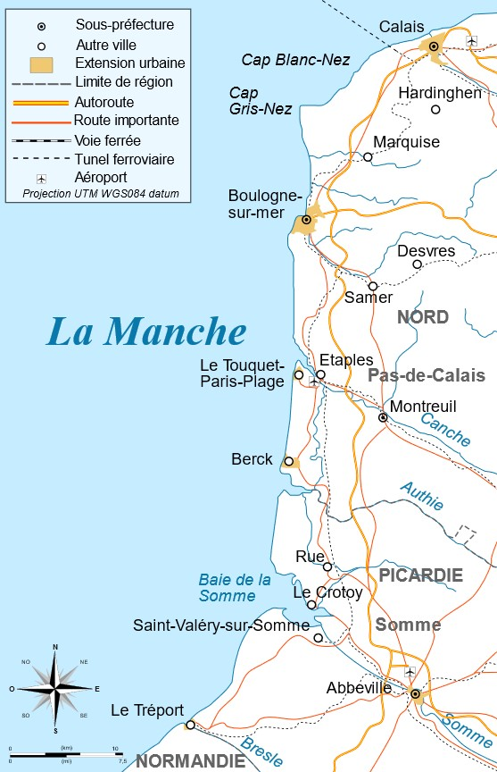

The massive size of the guns underscores their destructive potential, with each capable of firing 380 mm shells over a 55 km range.

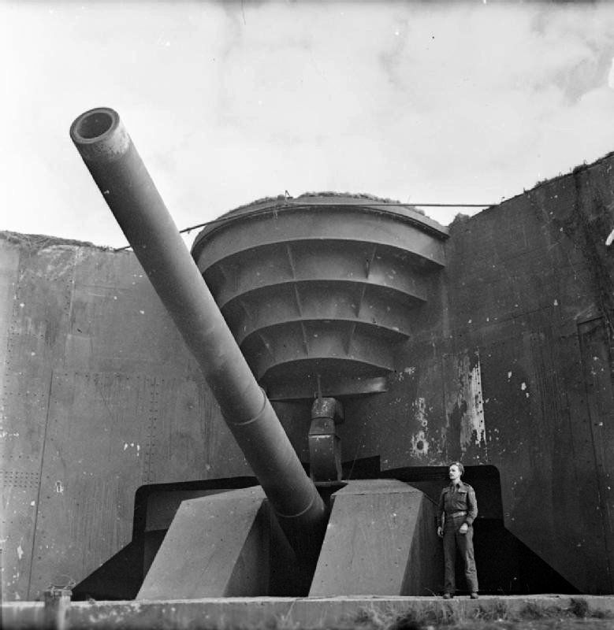

The casemates are also huge, 47m long, 29m wide and 20m high.

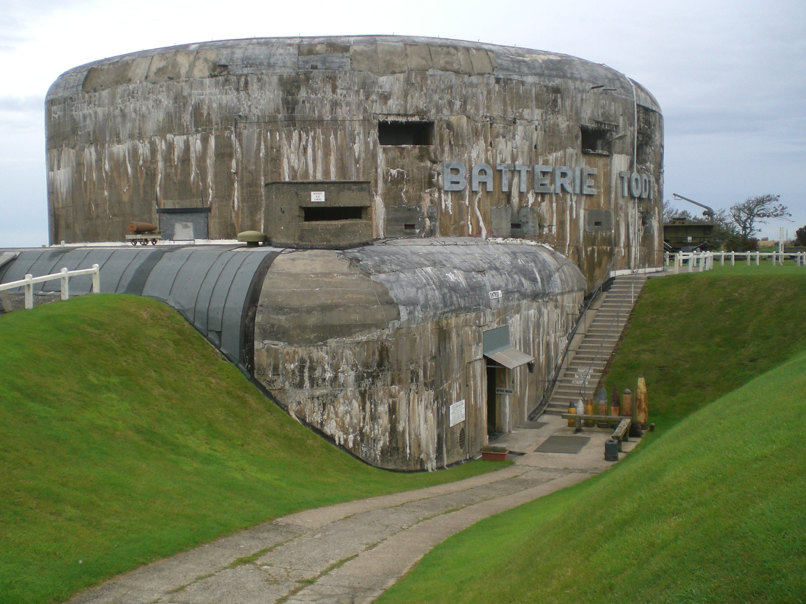

The guns were controlled by an observation site at Cap Gris Nez 1,200m north, shown at the top left of the picture. The casemates are at the bottom, centre.

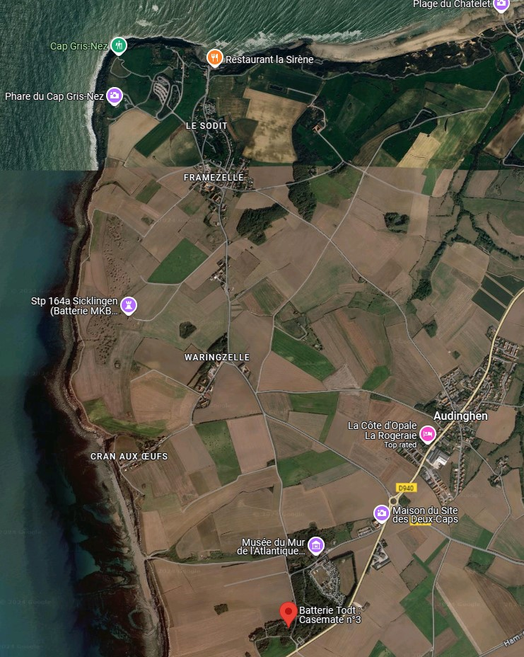

The initial assaults on Cap Gris Nez on 16 and 17 September were unsuccessful, so the capture was put off until Calais could be taken. The German garrison numbered around 7,500. Calais had long been a heavily defended port, so extensive Naval and Aerial bombing took place before the ground attack began on 25 September. The area was heavily mined and large portions of the ground flooded so several days of heavy fighting were required to gain ground. A truce was arranged on 29 September to permit the evacuation of the 20,000 civilians who remained in Calais. Shortly after the fighting resumed on 30 September, the Germans were encouraged to surrender.

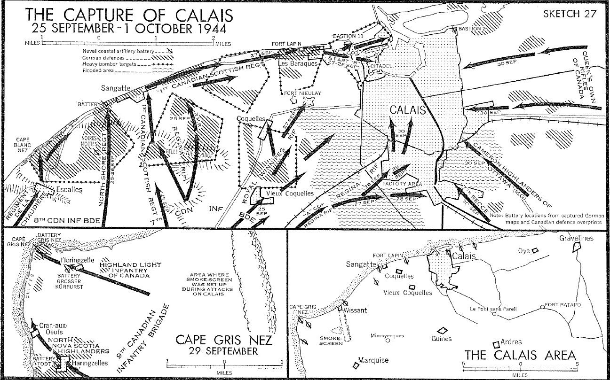

On 29 September, the assault of Cap Gris Nez was resumed, and the battery was taken the same afternoon. Once again, the port had been severely damaged and only opened in November. The failure of Operation Market Garden, the pet project of Montgomery to seize a bridge across the Rhine at Arnhem had failed, making the clearing the Scheldt Estuary the next key Canadian Objective to open the port of Antwerp.

As noted below, the Royal Winnipeg Rifles had suffered 700 casualties from D-Day to the end of September out of a 1000-man battalion, so were desperate for more troops. Manpower shortages plagued all units.

To alleviate the shortage, rear areas were scoured for excess personnel that could be sent to the infantry units. Cooks, typists, mechanics, electricians, anybody could suddenly be presented with an infantrymen’s kit and assigned to a rifle battalion. Most of these soldiers had long forgotten even rudimentary infantry skills, so feeding them into the front lines little bolstered a battalion’s fighting ability. The Black Watch diarist lamented “the critical situation now existing in the [battalion,] resulting from the great percentage of our reinforcements being personnel” from rear-area units “who with very little training are sent forward as infantry. This is our greatest problem, and the solution is not yet in sight as the necessary training time is evidently not available.”

Even reinforcements drawn from the designated infantry pool were proving poorly trained. The Black Watch war diarist reported that most of the reinforcements it was receiving were “a good lot, with all sorts of confidence and a truly aggressive spirit,” but were also “inexperienced and like to dash out to see what is happening if an air burst or shell goes off anywhere in the neighbourhood.” Many were soon “throwing grenades and firing the PIAT for the first time.”

Percy Mervyn was part of the latter group. The original RWR troops had trained for more than 2 years in England while Percy was thrown into the battle for Calais with only minimal training. He joined the RWR on 19 September and would have participated in the capture of Calais.

## Leopold Canal

The Canadians were ordered to clear the Scheldt Estuary to permit the opening of the port or Antwerp. Despite being under-manned and under-supplied, the 3 Canadian Divisions moved forward to clear the Scheldt. The Second Division had responsibility for the north shore, including the heavily defended Walcheren Island, the Third Division was to clear the Bresken’s Pocket south of the Scheldt, and the Fourth Armoured Division was to clear the area north of Antwerp.

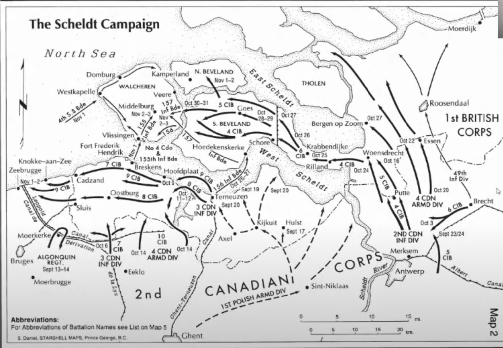

The 7th Brigade, 3rd Division was charged with crossing the Leopold Canal and pushing north towards Breskens. THE BRESKENS POCKET consisted of flooded farmland bounded by the Leopold Canal to the west and south, the West Scheldt to the northeast, and the North Sea to the northwest. Within this 35-by-15-kilometre rectangle, the flat polder landscape was cut by innumerable canals, ditches, and dykes, and was swamped with anywhere from a few centimetres to 1.5 metres of water. To close with the enemy, every artillery piece and vehicle, not to mention the tens of thousands of shells, would have to be dragged through the muck.

The assault was supported by a large number of artillery pieces, but the only local bridge across the canal had been blown, so it was impossible to get armoured support across the canal.

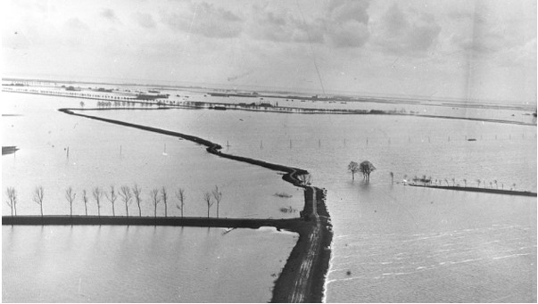

Much of the area beyond the canal had been flooded, so the 7th Brigade had a limited area to operate in. The attack was started off at 0525 on 06 October when 27 Wasp flame throwers launched huge streams of fire across the canal.

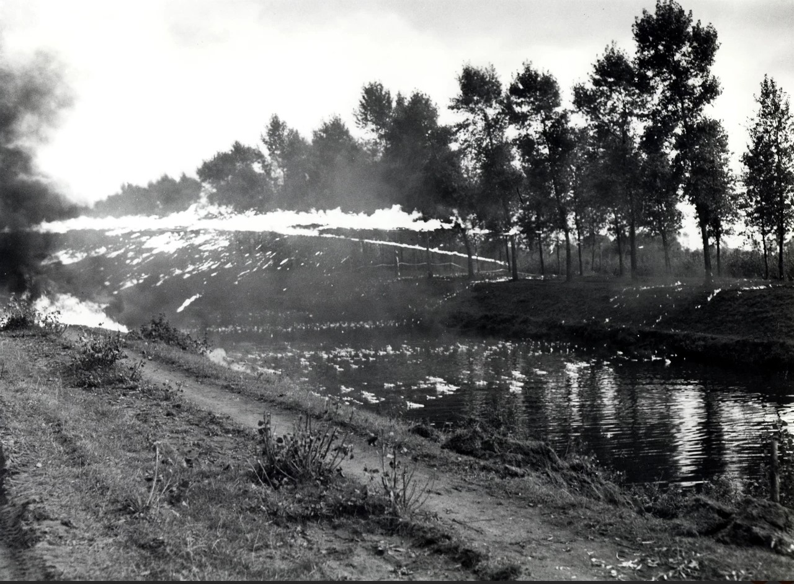

One company of the Regina Rifles, along with a company of the Royal Montreal Regiment (RMR) as well as two companies of the Canadian Scottish Regiment started the assault five minutes later as the Wasps ran out of flames. They crossed the canal in assault boats handled by the North Shore (New Brunswick) Regiment. The RMR was normally assigned guard duty for the Canadian Headquarters but had been inserted into the Regina Rifles to give the RMR some combat experience.

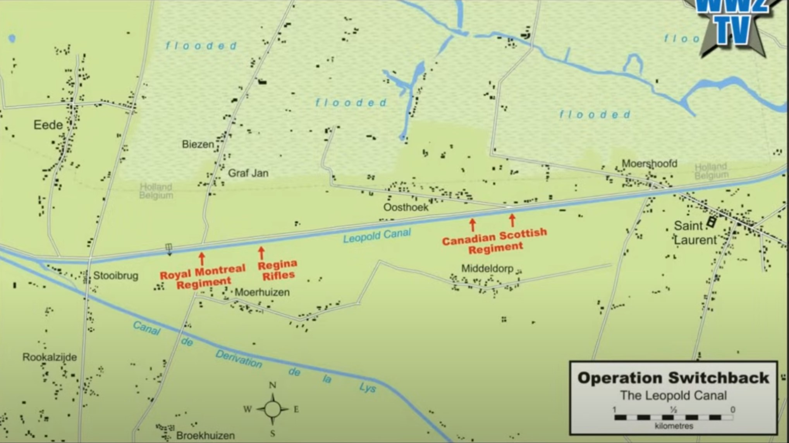

The Canadian Scottish made their crossing relatively easily and quickly progressed toward their first objective of Oosthoek. The Reginas had a much harder time as several of the Wasps fired short and pools of fire illuminated the assault and disabled several of the canvas assault craft. They also immediately came under heavy machinegun fire from a bunker on the north side of the canal. The fire inflicted heavy casualties on the RMR, who dug in on the top of the canal bank. By 0900 the company had been shredded. D Company of the Reginas, followed an hour later by C Company also crossed the canal to support the attack. It took several costly assaults to finally silence the bunker. The bunker remains in place today, a silent sentinel to the carnage that took place.

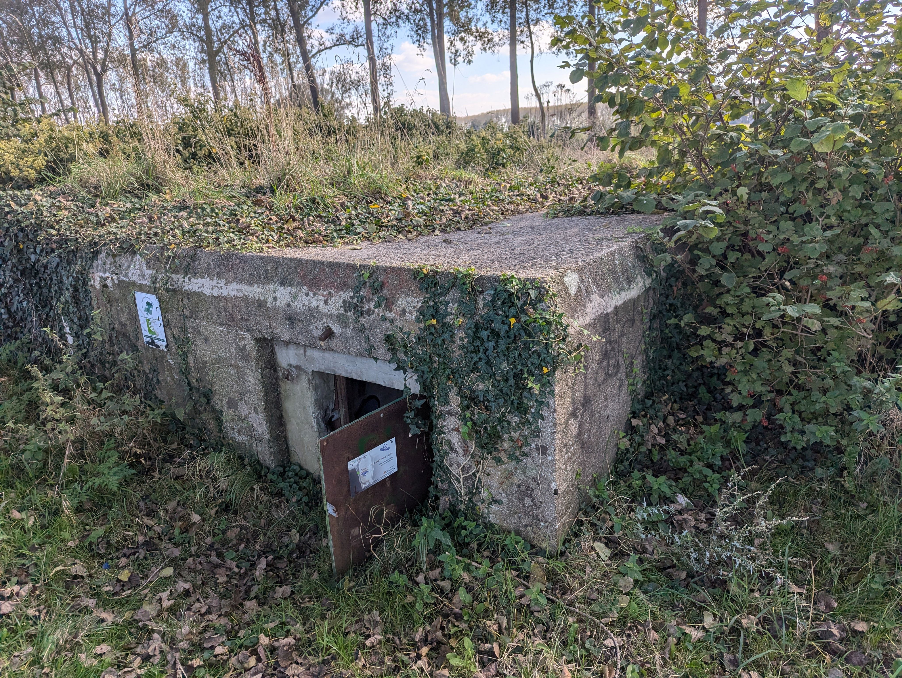

A view of the bunker from the south side.

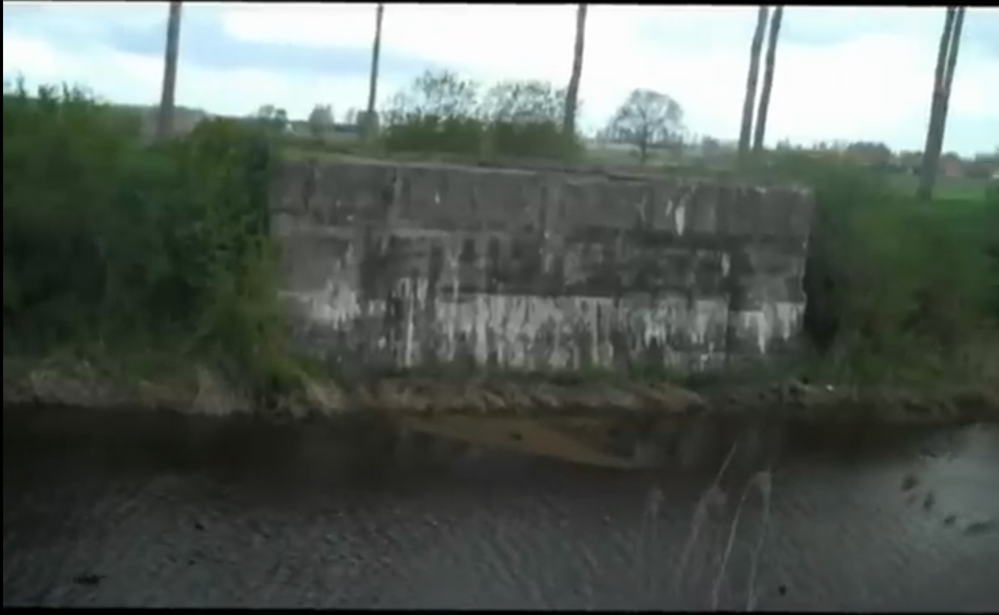

View from the bunker to the south side of the canal.

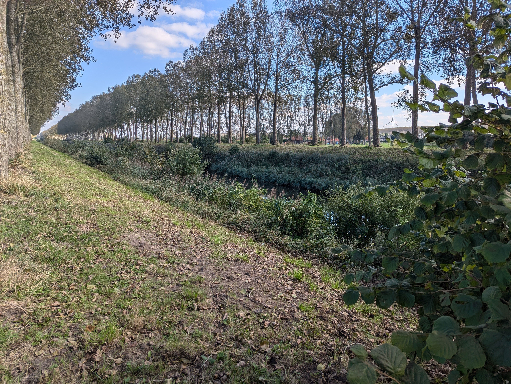

The canal is a very peaceful place today, it is difficult to imagine the devastation that occurred.

By nightfall the Reginas were dug into shallow water filled trenches in a single line along the canals edge, waiting for the counterattack that would finish them off.

The Canadian Scottish came under heavy attack at the outskirts of Oosthoek.

*“As soon as we went over the top of the dyke, we were met with enfilade fire from the left and right flanks which forced us to go to ground and orient ourselves.” The lieutenant had never seen anything like the ground the platoon was in. Absolutely flat, cut by canals and rivers, and mostly flooded. The areas not flooded were “covered with trees, hedgerows and villages. The water obstacles… made movement by foot or organized military formations extremely difficult. Here the enemy had a major advantage in that he had… flooded certain areas… and knew every inch of ground.”*

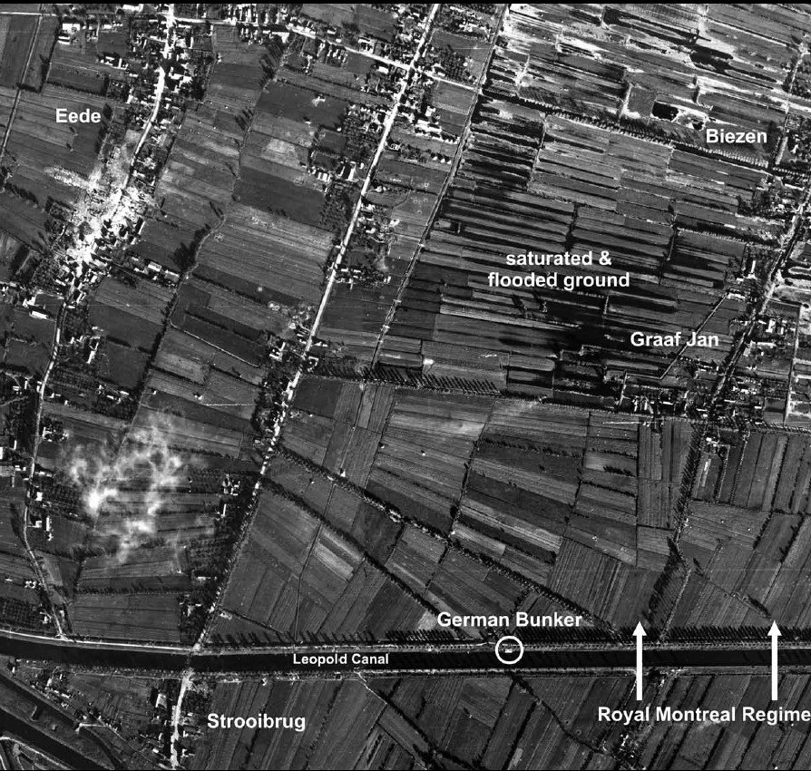

The two attacking battalions were separated and had suffered too many casualties to consolidate so the Royal Winnipeg Rifles (RWR) crossed on foot bridges at 2300 to fill the gap. The Winnipegs moved west but were stopped by heavy fire. The artillery worked ceaselessly to break up German formations that were gathering for counterattacks, but it was difficult to shell the front lines as both sides were too close together. The Germans relentlessly counterattacked all night, isolating pockets of Canadians and taking them prisoner once their ammunition was expended.

The units were resupplied by heavily laden North Shore men dashing across precarious footbridges. The Canadians fought off repeated counterattacks the night of 07-08 October as well. The Germans were forced to commit their reserve battalions which was exploited by the waterborne landing by the 9th Brigade near Hoofdplaat.

On 08 October, the Winnipegs finally linked up with the Reginas. Entries from the RWR war diary:

*A Coy was more successful and reached a point at 026017 (link up point) before concentrated enemy artillery and observed machine gun fire forced them to dig in along the canal. Heavy casualties were suffered by both sides and the ground was littered with both German and Royal Winnipeg Rifles dead. Prolonged exposure to wet and cold still had to be endured in flooded slit trenches or smashed buildings as unusually bold enemy snipers and machine-gunners were on the lookout continuously and often succeeded in infiltrating between companies and platoons. Few of these lived to tell their story as the Royal Winnipeg Rifles were no less aggressive. Ammunition, cold rations and casualties still had to be carried for more than a mile.*

On 09 October, reinforcements were received and the Winnipegs moved towards the village of Graaf Jan.

On 10 October, during the morning A Coy assisted the Regina Rifles in destroying an enemy held pill box. Another C Coy patrol to GRAFF JAN failed to contact the enemy but rescued a wounded B Coy man who had been left when his Coy withdrew on the previous day. Enemy shelling was slightly less intense than during the first three days. Small Arms fire continued to make it extremely difficult and dangerous to move about. Supplies and casualties were still ferried across the Canal. Capt H.C. Chadderton of C Coy and Lt L. Mendels of B Coy were among the numerous casualties for the day.

Private Percy Mervyn was one of the numerous casualties who was killed this day. The details of his death are not known, but there were many ways to die in this bitter conflict. Like so many of his comrades, Percy was thrown into combat and was killed three weeks after joining the Royal Winnipeg Rifles.

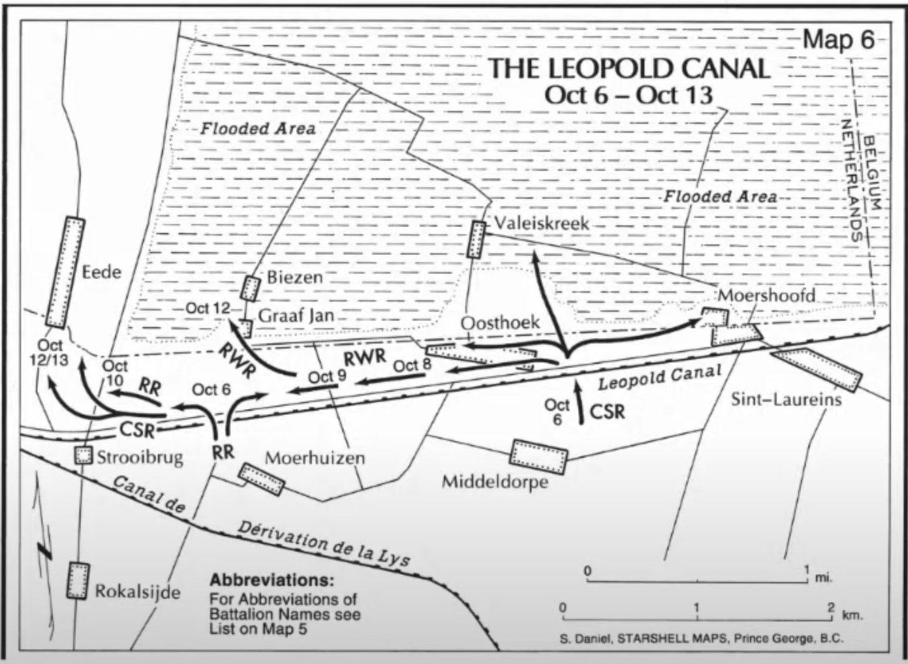

On 11 October, several attempts to take Graaf Jan were pushed back by heavy fire, severe casualties and a lack of ammunition. Some of the ground they must cross was flooded, the streets of the hamlet itself transformed into canals, and the yards awash. At first, the men sank up to their knees, then waists. In places, they lurched into water neck deep, desperately holding weapons above their heads to keep them dry.

Shelling and Small Arms fire continued to make it impossible to move about in forward areas except by crawling on the semi flooded ground or in water filled ditches, both of which were littered with German and Canadian dead.

Graaf Jan was finally taken on 12 October  in a house to house and room to room battle and the enemy pushed back to Biezen. The Canadian Scottish moved forward to take the area around the blown bridge.  Can Scots “crept cautiously through the sloppy, sucking mud” along the water side of the dyke. They reached the Maldegem– Aardenburg road and set up on both sides. The Can Scots began “burrowing into the canal side of the dyke”. The Germans were dug in on the other side of the dyke and all night and the next day we exchanged grenades to such a degree that the RSM [Regimental Sergeant Major] was complaining that the battalion reserve was nearly exhausted.” The Germans continued to shell the construction of the bridge but had otherwise ceased resistance. The bridge was 120 feet long with 10-foot ramps on either side. With the Germans offering no resistance other than light shelling, the engineers had started the bridge at 1210 hours and opened it to traffic at 1605.

Engineers installing a Bailey Bridge.

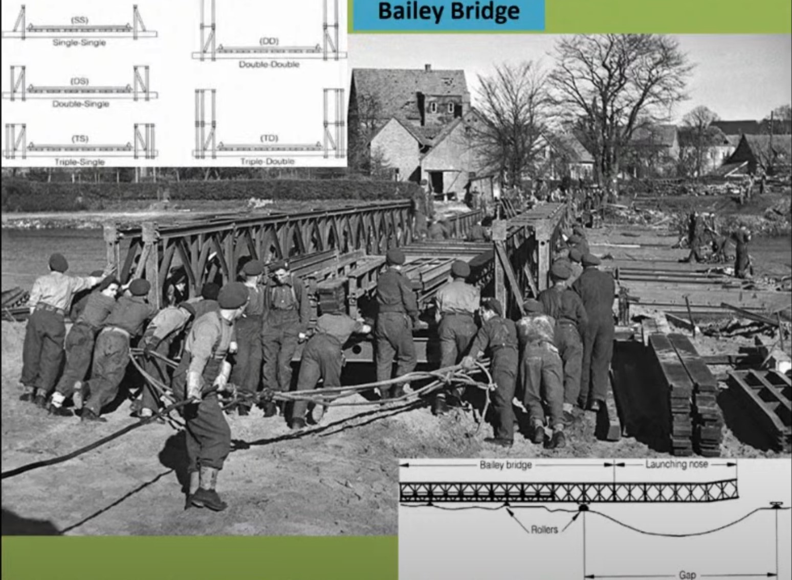

A sketch of the Bailey Bridge across the Leopold Canal.

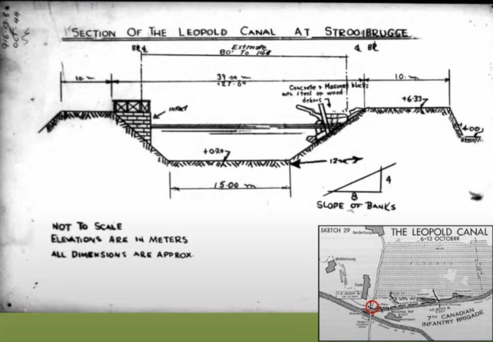

Another Bailey Bridge across the Leopold Canal remains today as part of an extensive bike and walking trail.

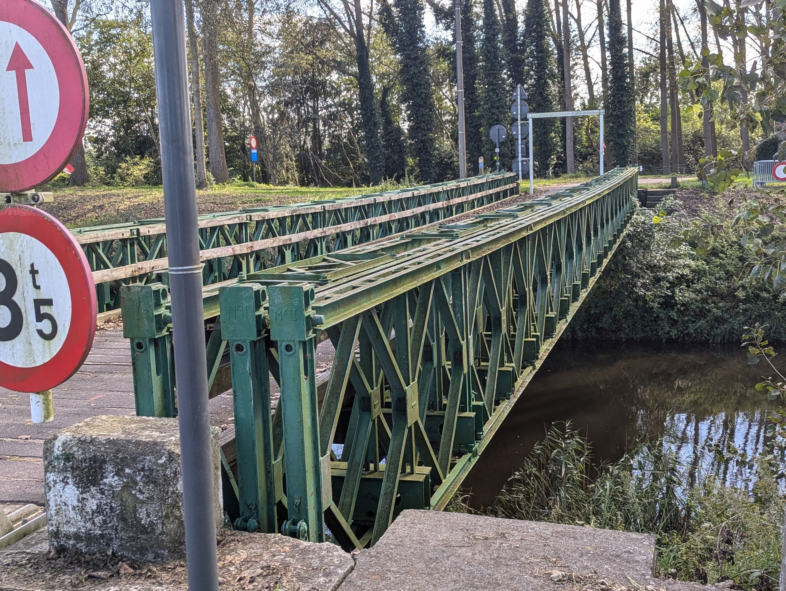

On 16 October, the Canadian Scottish supported by tanks and Wasps from the British Columbia Regiment took the town of Eede. A memorial acknowledges the effort.

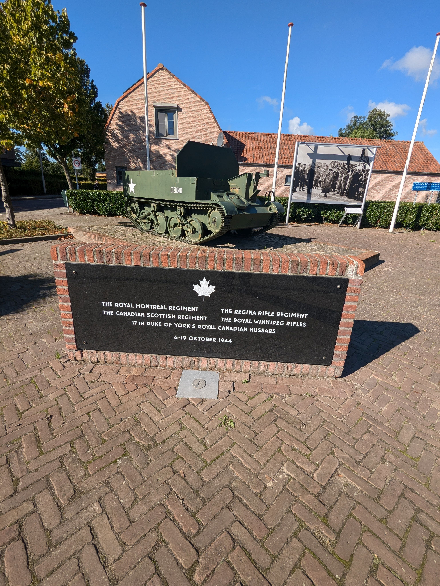

The Canadians were relieved on 18 October by the 52nd British (Lowland) Division. During the period 06 -12 October 7th Brigade suffered 553 casualties, 111 fatal. They also suffered an addition 200 men were withdrawn for battle exhaustion. A typical example of the toll taken on the soldiers was that of Major Shawcross A Company Commander, Regina Rifles as described in Mark Zuelhke’s Book Terrible Victory:

*As Shawcross had feared, ‘A’ Company had been destroyed. Only twenty of his men still stood. It was also the end of the line for this D-Day veteran. Lieutenant Colonel Foster Matheson ordered him to see the medical officer, who discovered he had “extensive bruising, internal injuries of some kind, shock and my right foot was dragging.” Shawcross was evacuated to hospital in Bruges. “It hurt a little being pulled out of battle in this fashion after this long period of comradeship and fighting, but in the end, I realized I needed to go. I was tired, worn out and like most, confused with the horror of death, the bloated bodies of all the animals, humans and the general horror of the whole thing… all [those] days and nights of fear and dread.” On D-Day, Shawcross had weighed 220 pounds. Now he was 165. Eventually, it was discovered that among his other injuries, Shawcross had a broken back– a compression fracture of the third and fourth lumbar vertebrae probably inflicted during the building collapse. He would be hospitalized for the rest of the war.*

The water-logged ground and proximity of the opposing forces made the battle for the Leopold canal reminiscent of the brutal close quarters fighting of First World War trench Warfare. No tanks were involved in the fighting, just artillery, mortars, machine guns and small arms fire. The ferocity of the battle was highlighted by the expenditures. A six-month supply of grenades was used in two days, in one day more than 2,000 Artillery rounds were fired, a single mortar platoon fired 1,200 rounds in a 90-minute period and three times the normal small arms ammunition was expended.

## Casualties

Casualty records for the Royal Winnipeg Rifles are not always detailed by exact monthly counts, but here’s a general overview based on their major engagements from June 1944 onward:

1. **June 1944 (D-Day and Normandy landings)**: The Royal Winnipeg Rifles landed on Juno Beach on June 6 and suffered around 200 casualties on D-Day alone, with losses continuing throughout June as they fought in Normandy. Total casualties in June are estimated at approximately 250-300.

2. **July 1944 (Battle of Caen and Carpiquet)**: Fighting around Caen, particularly at Carpiquet, was fierce, with the Rifles involved in heavy combat. Casualties were high, with estimates of about 150-200 for July.

3. **August 1944 (Falaise Pocket and the end of Normandy Campaign)**: The Rifles took part in closing the Falaise Pocket, resulting in additional casualties, estimated around 100-150.

4. **September 1944 (Push into Belgium)**: As the Rifles moved into Belgium, their casualty rate was somewhat lower but still significant due to ongoing skirmishes and operations. Estimates are around 50-100 for September.

5. **October 1944 (Battle of the Scheldt, including Leopold Canal)**: The regiment saw some of its heaviest fighting at the Battle of the Scheldt, particularly at the Leopold Canal, resulting in severe losses. Casualties in October are estimated at 200 or more.

6. **November 1944 onwards**: As they moved further into the Netherlands and Germany, fighting continued to be intense but was more spread out, with estimated monthly casualties generally lower, around 50-100 per month for the remainder of the year.

Throughout the campaign, the Royal Winnipeg Rifles endured some of the heaviest losses among Canadian forces, with high casualty rates reflecting their role in key battles. Overall, they suffered over 1,100 casualties by the end of World War II, though numbers fluctuated as reinforcements joined and the intensity of fighting varied.

## Burial

Percy’s story is another tragic tale of a life taken too soon. He was 19 when he enlisted and spent only 3 weeks in the front line with the Royal Winnipeg Rifles before he was killed in action.

Percy was buried in the Canadian Military Cemetery Maldegem, (Plot Canadian, Row D, Grave 24) a temporary cemetery in a field just north of Maldegem (map reference VJ006998, 51.22053 ,3.44792) and less than 2 km from the Leopold Canal Crossing.

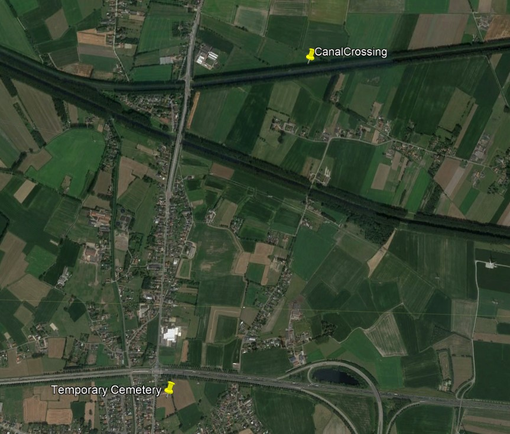

After the War, Percy was reinterred in Adegem Canadian Military Cemetery (Plot X ,row B, grave 3) about 5 km East of the original site.

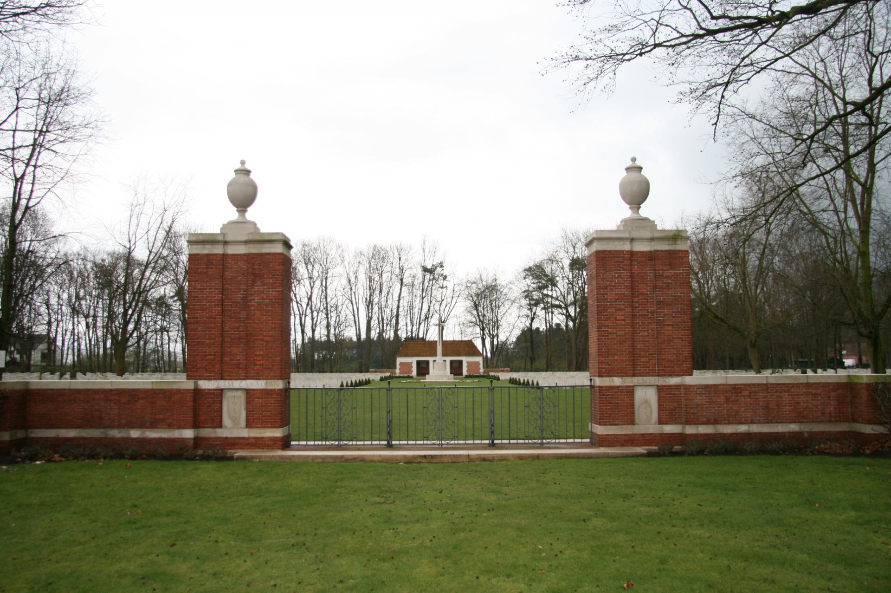

The majority of the men buried at Adegem died during the operations for the clearance of the south bank of the Scheldt, but many Canadians who lost their lives elsewhere in Belgium were also brought here for burial. A number of isolated graves from various communal cemeteries and churchyards in Belgium have also been brought into this cemetery since the end of the war.

The cemetery now contains 1,119 Commonwealth burials of the Second World War including 878 Canadians and one unidentified burial of the First World War. There are also 33 Polish and two French burials.

Percy is one of 66 Royal Winnipeg Rifles buried in Adegem Cemetery. All were killed in October 1944 and 44 were killed in the taking of the Leopold Canal. Percy was reinterred with his comrades from the Maldegem Temporary Cemetery. The 11 men were put to rest in the same order they had been buried originally.

We had the opportunity to visit the Cemetery during the Canadian Liberation March. One of the teachers had printed placards with the soldier’s picture, name, unit, age and grave location so all of the teachers and students attending the march could seek out and identify an individual soldier.

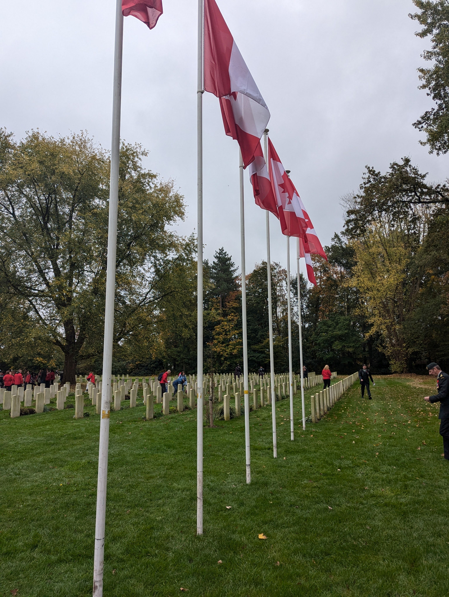

My soldier was Charles Atkinson of the Regina Rifles.

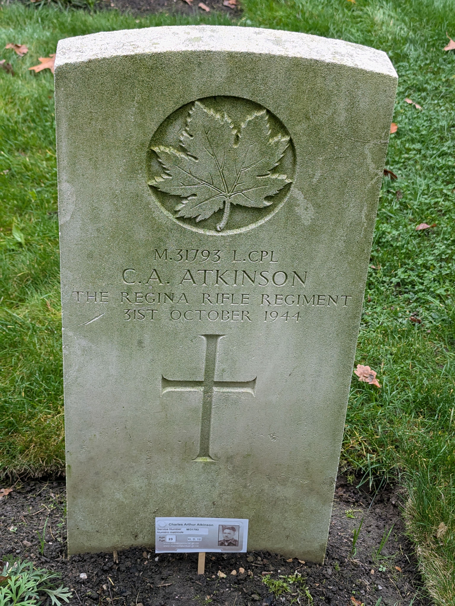

A relative of my sister-in-law Marg Columbus, Christopher Cadeau, is buried in this cemetery, and we paid our respects.

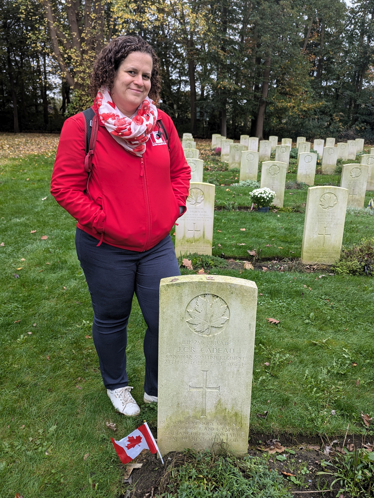

We weren’t aware at the time that Percy was buried in the same cemetery, but we must have walked within a row or two of his headstone as we visited first Christopher then Charles.

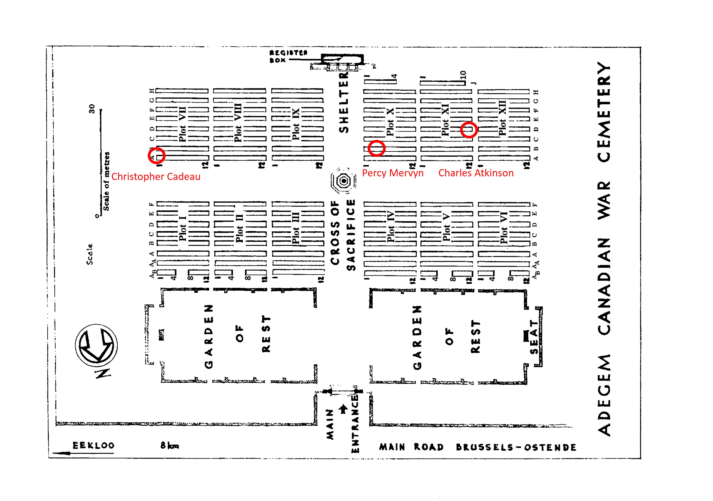

Percy’s Headstone. The dedication reads:

REST NOW IN PEACE

WITH JESUS

LOVING HEARTS STILL LONG FOR YOU

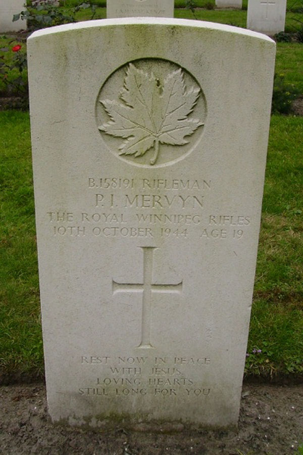

Percy’s Commonwealth War Grave Certificate.

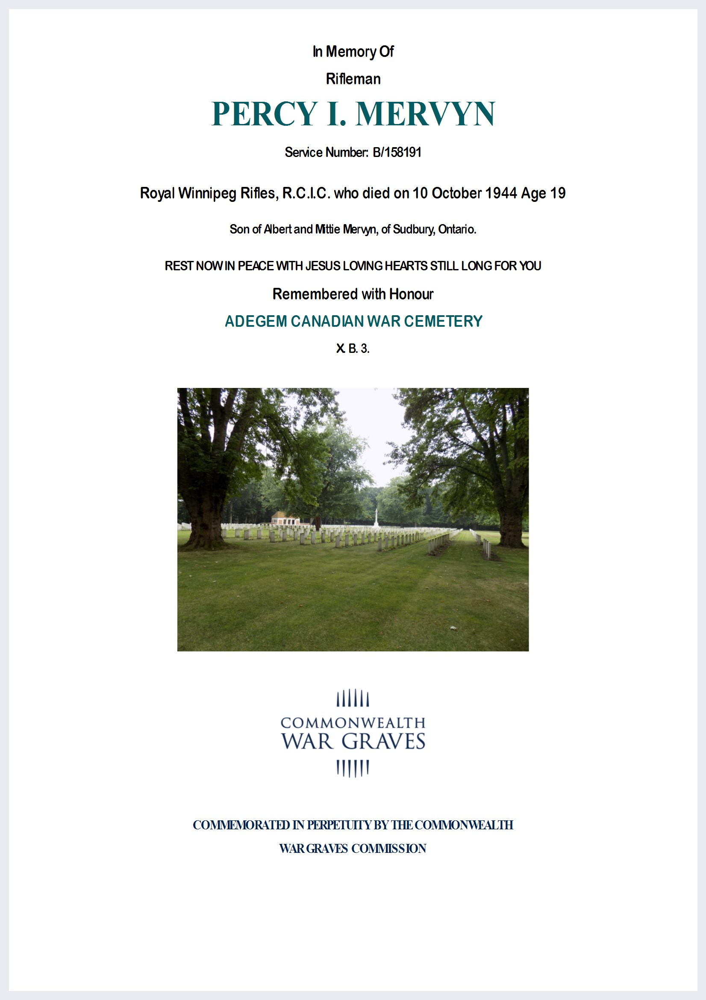

Percy is also commemorated in the Book of Remembrance on Parliament Hill, page 393 of the Second World War Book. The pages are turned every day. Percy’s page is visible on 24 August.

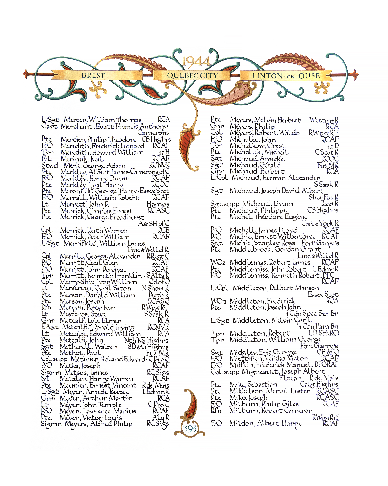

Another tragic story of a soldier's life taken far too soon. I always wonder what these young men could have accomplished given different circumstances. Cheers to Barb and her family, thinking about Percy.

# Bibliography

Cook, Tim, Fight to the Finish, Penguin Canada, Toronto, ON 2016.

Project 44 – Map Display of Units in WW2, an excellent data source.  <https://www.project44.ca/>

Zuehlke, Mark, Terrible Victory, Douglas and McIntyre, Toronto, 2014.

War Diary, Royal Winnipeg Rifles, September-October 1944.

* [Second World War](https://www.paulsbattlefieldtours.com/blog/categories/second-world-war)