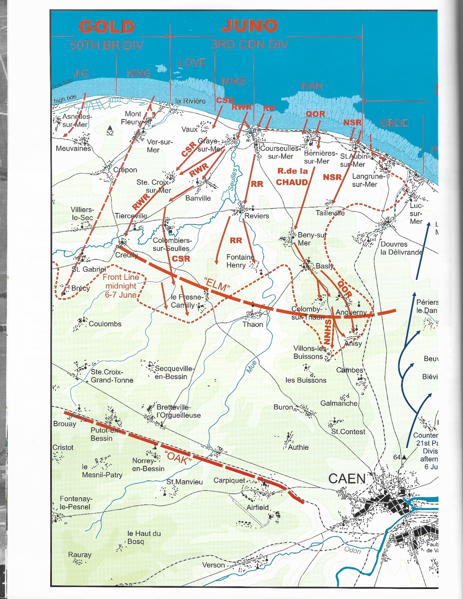
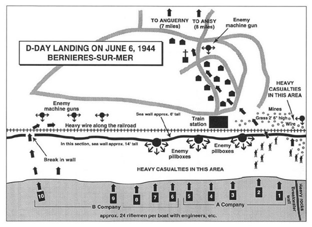
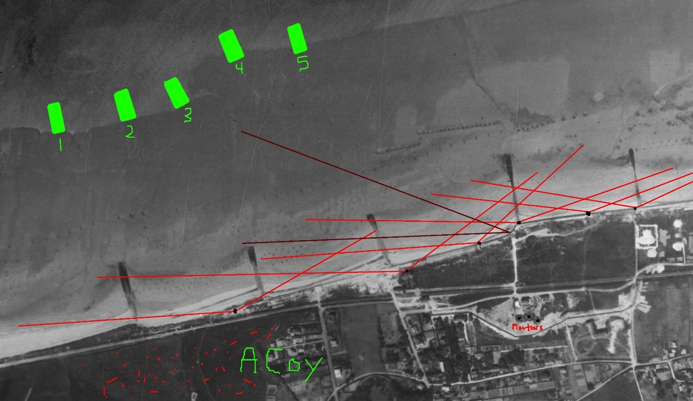
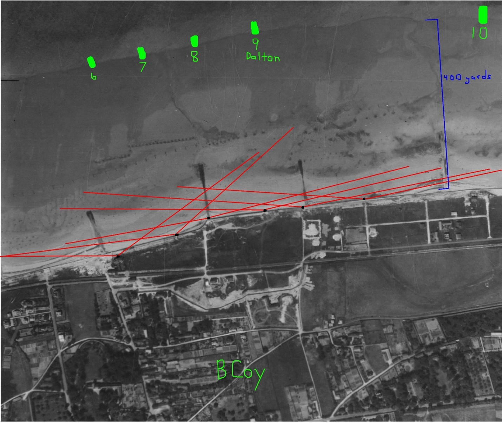

# Queen's Own Rifles on D-day

* [pd-allen](https://www.paulsbattlefieldtours.com/profile/pd-allen/profile)
* Sep 10, 2023
* 4 min read

Updated: Sep 16, 2023

## Canadians At Juno

The 3rd Canadian Infantry Division and tanks of the 2nd Armoured Division were selected to attack a 10 km stretch of coastline known as Juno Beach.

Members of the 7th Infantry Brigade, Royal Winnipeg Rifles and a company from the Canadian Scottish Regiment landed at Mik Red and Green Beaches, supported by the Duplex Drive Tanks of A Squadron of the 1st Hussars at the Mike Sector, and B Squadron at Nan Green. The port at Courseulles-sur-Mer was the primary Target.

Members of the 8th Infantry Brigade, attacked at Nan White and Nan Red. The Queen’s Own Rifles landed at Bernières-sur-Mer on Nan White, and the North Shore Regiment landed at Nan Red to take St Aubin. B Squadron of the Fort Gary Horse Tank Regiment supported the QOR, and C Squadron Supported NSR.

In reserve were Le Regiment de la Chaudière and the remaining tanks of the Fort Garry Horse. After the first wave went in, the 9th Infantry Brigade consisting of the North Nova Scotia Highlanders, Highland Light Infantry and Stormont, Dundas and Glengarry Highlanders and the Sherbrooke Fusiliers Tank Regiment landed to press the Attack.

Nearly 150,000 Allied troops landed or parachuted into the invasion area on D-Day, including 14,000 Canadians at Juno Beach, with a few of the units achieving their D-Day objectives. The Royal Canadian Navy contributed 110 ships and 10,000 sailors and the RCAF contributed 15 fighter and fighter-bomber squadrons to the assault. The first wave of infantry suffered an approximately 50% casualty rate. The Canadians has the second highest casualty rate on D-Day (after the Americans at Omaha Beach), and the highest per capita casualty rate.  Total Allied casualties on D-Day reached more than 10,000, including 1,074 Canadians, of whom 359 were killed. By the end of the Battle of Normandy, the Allies had suffered 209,000 casualties, including more than 18,700 Canadians. Over 5,000 Canadian soldiers died.

The Canadians advanced further inland than any other assault force on D-Day.

**Canadian D-Day Advance – Mike Bechthold**

## Queen’s Own Rifles

I am focusing on the Queen’s Own Rifles, as Thomas Easton, a Hornepayne Native was part of the initial assault. A summary of his Battle History is provided in a separate post. A and B companies led by brothers Major Hume Elliott Dalton A Company Commander, and B Company under Major Charles Osborne Dalton.

The original H hour had been 0745 hrs. Now word was received that H hour would be delayed for at least ten minutes. At that moment the assault craft were only a few hundred yards from shore. The sea was now so rough that the D.D. tanks, designed to swim in with the infantry, were ordered to land in the normal way from their craft. This delay meant that The Queen's Own would have to capture Bernières without tank assistance.

**QOR D-Day Landings**

Company on the right and B Company on the left touched down at 0812 hrs. The line between the companies was the railway station. Several L.C.A hit mines on the run in, but casualties were light. Nevertheless, of the ten L.C.A's that carried A and B Company in, only two managed to get off the shore. The rising tide had now left about two hundred yards or so of beach between the water's edge and the seawall. The strip was swept by enemy enfilade fire but, with a rush, A Company, under Major H. E. Dalton, was over; clambered up the seawall, and reached the railway line. B Company, under Major C. O. Dalton, was even less fortunate. The company had landed directly in front of a concrete strongpoint that was still in action. Almost one half of the company was lost in the initial dash across the beach. An initial mischance now turned out to be a determining factor in B Company's success. One L.C.A. had its rudder jammed and ran ashore off course. Here there was no enemy defence. Quickly, Lt. H. C. F. Blliot the platoon commander, seized the opportunity and worked his way inland along the shore. The unexpected flank attack convinced the enemy that they had had enough. It was as well, for by now, the rest of B Company had been practically wiped out.

**A Company Landing**

**B Company Landing**

At 0830 hrs C and D Company, landed. C and D Companies immediately pressed forward along the brigade Centre Line: Bernières-sur-Mer, Beny-sur-Mer, Basly, Colomby-surThaon, Anguerny Heights. Great stress was placed on the capture of the last mentioned which was of great tactical importance to the division. By .0900 hrs Bernières had been cleared, so A Company followed in support of C and D. The few remaining in B Company re-organized and were held back in Bernières until the afternoon.

The battalion had proven itself; it had fought its way almost seven miles in from the beach; it had captured the objective as laid down; and was part of the 3rd Canadian Infantry Division, which, of all the allied divisions engaged, had made the deepest penetration. The casualties had been heavy; in fact, the heaviest suffered by any Canadian unit that day. Fifty-six other ranks had been killed in action; seven died of wounds. Six officers and sixty-nine other ranks had been wounded; five other ranks suffered battle injuries.

* [Second World War](https://www.paulsbattlefieldtours.com/blog/categories/second-world-war)
* [Battlefield Tours](https://www.paulsbattlefieldtours.com/blog/categories/battlefield-tours)
* [Family](https://www.paulsbattlefieldtours.com/blog/categories/family)