# Rachel Tours Cambrai

* [pd-allen](https://www.paulsbattlefieldtours.com/profile/pd-allen/profile)
* Jun 14, 2024
* 10 min read

On our last day of touring, we worked our way back south of Arras before heading back home to Maastricht.

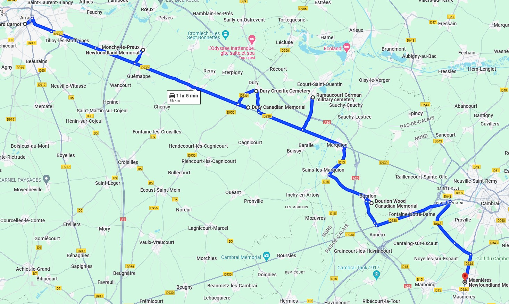

# Monchy-le-Preux

Our first stop was at the Newfoundland Memorial at Monchy-le-Preux. The Newfoundland Regiment was part of the British 88th Brigade, 29th Division. At the start of the war, the Newfoundlanders made it clear they did not want their battalion to be assigned to the Canadian Corps, so they were part of the 29th Division until 1918.

Most of the Caribou memorials are located in Park setting, but the  memorial at Monchy-le-Preux is located on top of a bunker in the front yard of a private house, next door to St Martin Church.

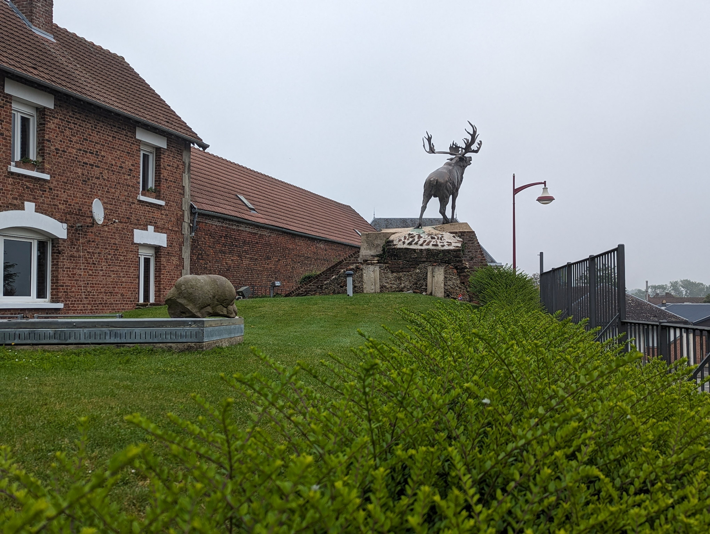

## Battle 14 April 1917

The Battle of Arras started on 09 April 1917, with the British Forces attacking from the quarries under Arras. The British made great gains on the first day of the battle (from the solid Blue line to the dashed Blue line. On 11 April, Monchy-le-Preux was taken by the 37th Division. However, the Germans controlled the High Ground at Infantry Hill, and continually shelled Monchy-le-Preux.

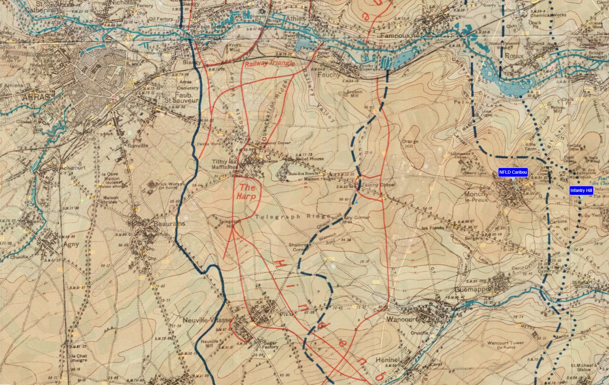

Monchy-le-Preux was being destroyed, so the 88th Brigade of the 29th Division (Newfoundland Regiment and 1st Essex) were called on to take Infantry Hill. Unfortunately, the hurried planning neglected to have replacement battalions in place to hold Monchy.

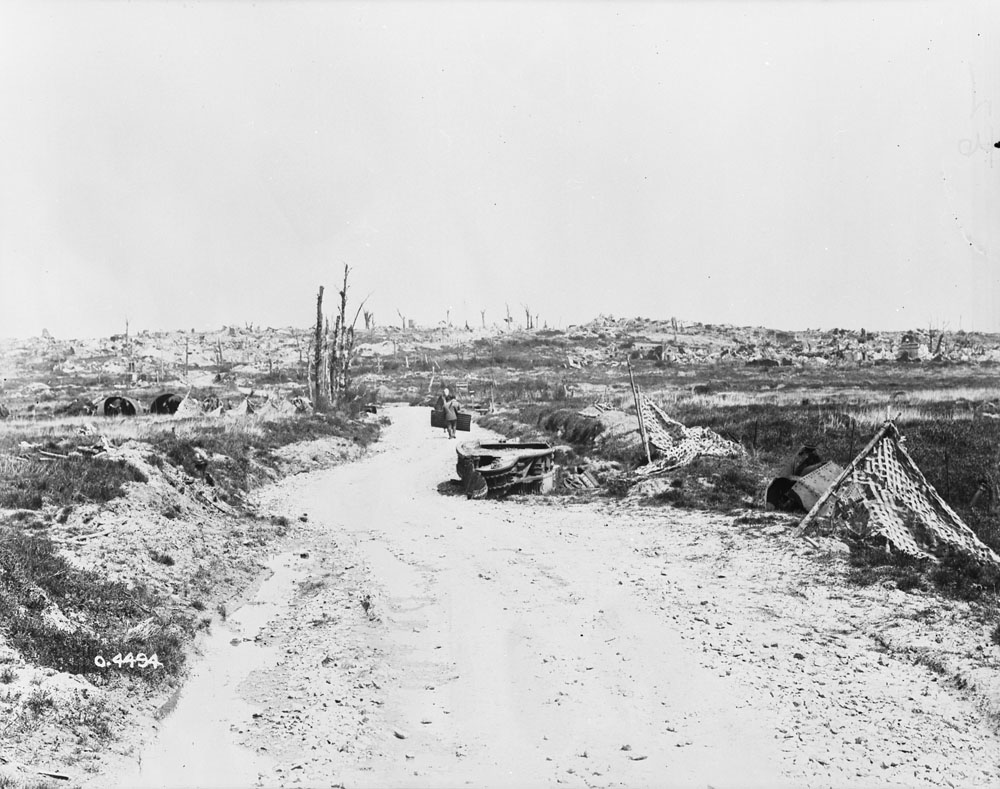

The two battalions moved into position in the early hours of 14 April, and at 0530 launched their attack. Unbeknownst to the attackers, the Germans were also planning an attack to retake Monchy so had troops massed for the assault.

The Germans were employing a new tactic called the Elastic Defence where they would let the attackers through the front lines with little resistance then surround and destroy the attackers as they advanced.

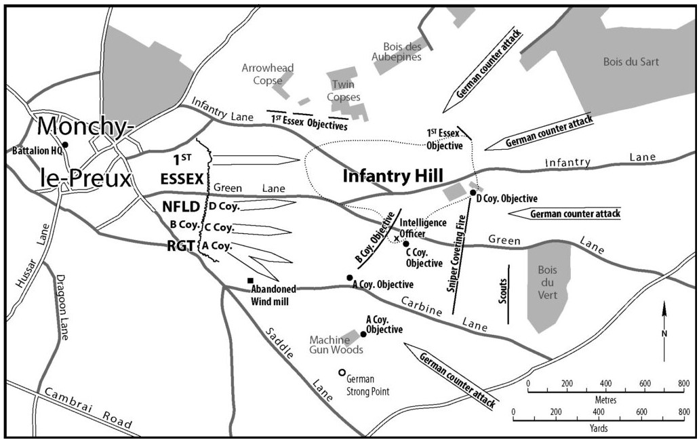

Both Battalions met very limited resistance in the front-line trenches, but as they progressed, they bypassed several German strongpoints that began attacking them from the rear. By 0900, almost half of the Essex force had been captured so the survivors withdrew leaving the Newfoundlanders exposed on their left flank. By 1000 both battalions had been decimated and a wounded Essex soldier reported at their entire unit had been captured or killed. The communication lines back to Brigade had been cut by the shelling and 300 Germans were advancing on the town. LCol Forbes-Robertson of the Newfoundland Regiment mustered his HQ staff of 20 personnel and prepared to make a stand. They made a run across open ground to take up positions in a trench. Nine men made it to the trench which had a commanding view of the approach, and they started rapid fire concentrating on the runners and scouts. A tenth man eventually joined the troops, and they held off the German assault until replacements finally showed up at 2000.

One General commented that if those 10 men had failed, it would have cost the British 40,000 casualties to retake the village. The Newfoundlanders had suffered 460 casualties in the battle, 166 killed, 141 wounded and 153 captured. Similarly, the 1st Essex Regiment suffered 661 of 892 men killed, wounded or captured.

LCol Forbes-Roberston won the Distinguished Service Order, Captain Keegan the Military Cross, and the 8 men the Military Medal. 9 of the ten men are shown below.

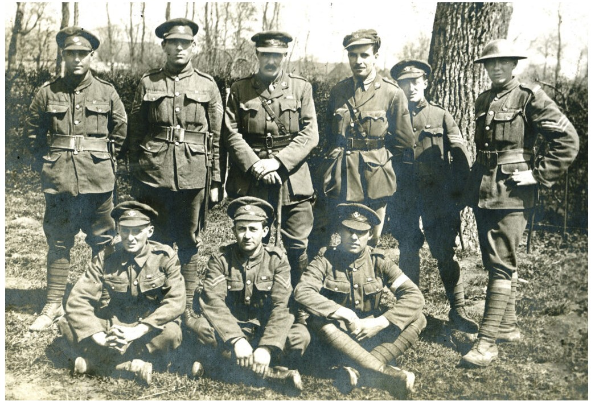

Front Row (L-R): Pte. F. Curran, Cpl J. H. Hillier, Pte. J. HounsellBack Row (L-R): Cpl. A. S.Rose, Sgt. W. Pitcher, Lt.-Col. J. Forbes-Robertson, Lieut. K. J. Keegan, Sgt. C. Parsons, Sgt. J. R. Waterfield.

In the parking lot just down from the Caribou, there is a painted wall honouring the Newfoundlanders.

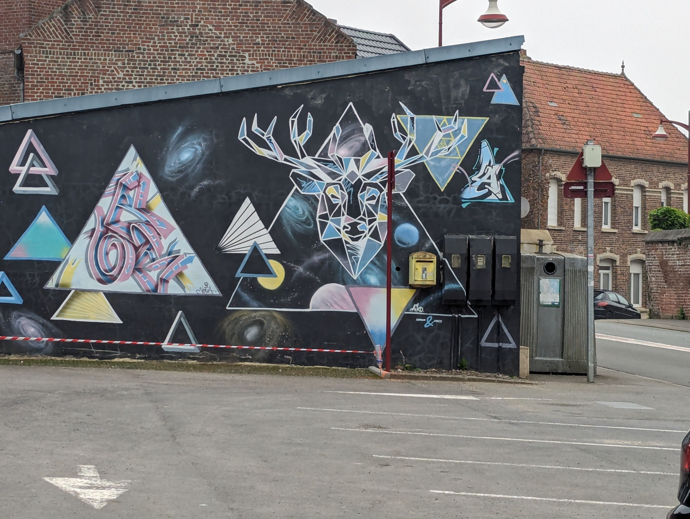

We were there first thing in the morning, so were alone at the Memorial, almost. For some reason the song “...I’ve been sitting in vacant lot with a bird sitting on my head…” was the theme song of the morning.

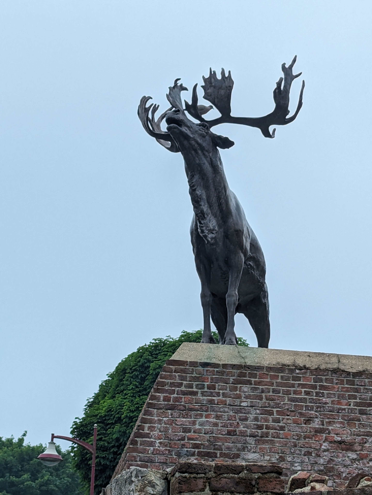

# Dury Memorial

Next stop was the Canadian Memorial at Dury, celebrating the successful attack at the Drocourt-Queant Line 26 Aug – 02 Sep 1918.

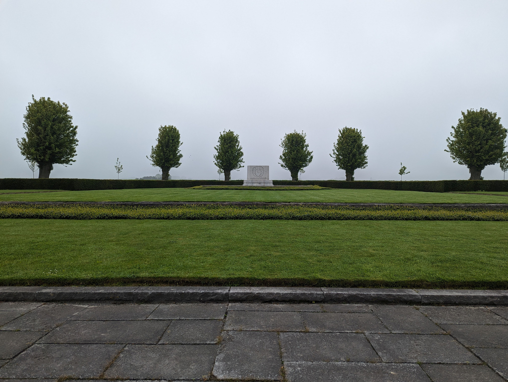

I talked about the taking of the D-Q Line in a previous post,

<https://www.paulsbattlefieldtours.com/post/last-100-days-arras-26-aug-1918>

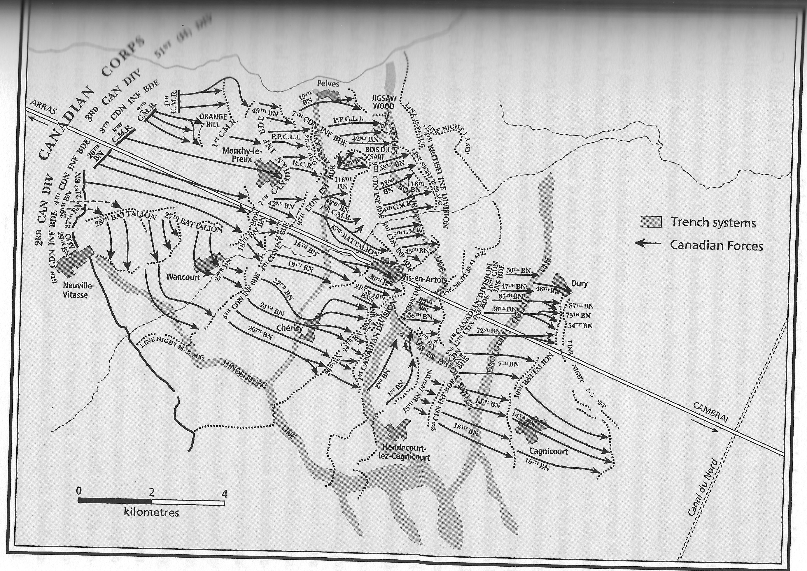

The Canadian Corps smashed through 5 defensive lines and prepared for the last major battle, the Crossing of the Canal du Nord. Another great victory for the Canadians, but at the cost of more than 11,000 casualties.

The Canadian monuments have a simple Granite stone, but the park like settings make for an impressive sight. The inscription on the stone celebrates the attack on the D-Q line.

*The Canadian Corps, 100,000 strong attacked at Arras on 26th August 1918, stormed successive German lines and here on Sep 2nd broke and turned the main German positions on the Western Front and reached the Canal du Nord.*

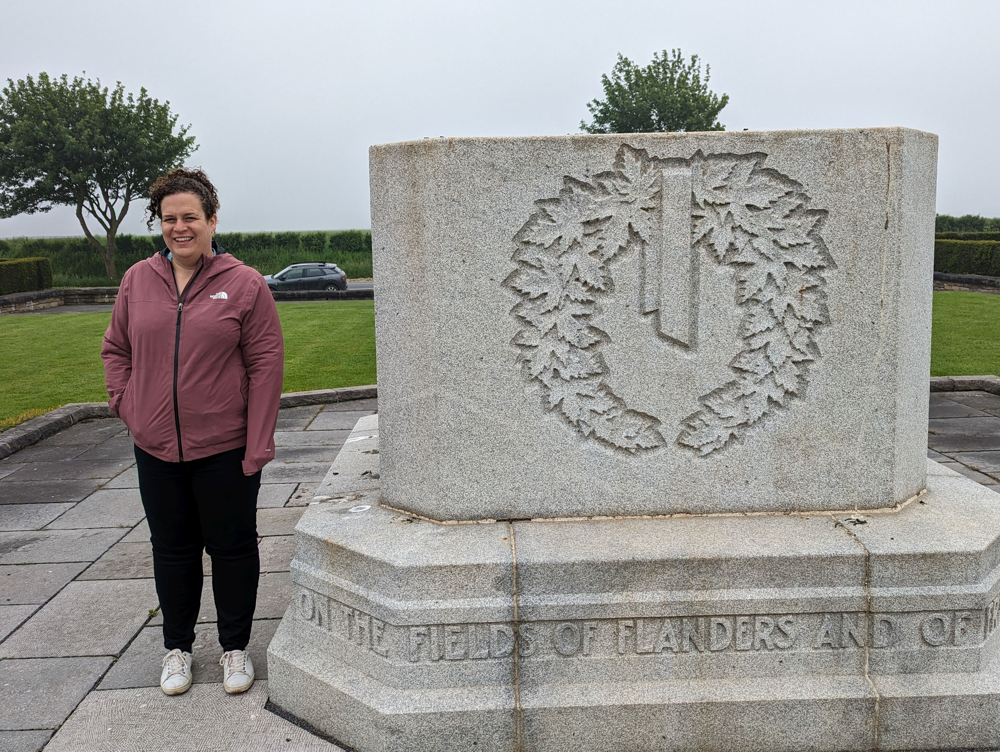

As well as the major national monuments, there are a number of smaller monuments scattered throughout the countryside. They are often not well marked, but often show up on Google maps. While we were at the Dury Memorial Google reminded me about the monument to Frederick Banting, the Canadian discoverer of Insulin. It was close by down a typically tiny French lane in the middle of a field.

The only problem was I had told Rachel we were going the other direction and forced her to do a U turn on a 4-lane road, hence the lack of a smiley face.

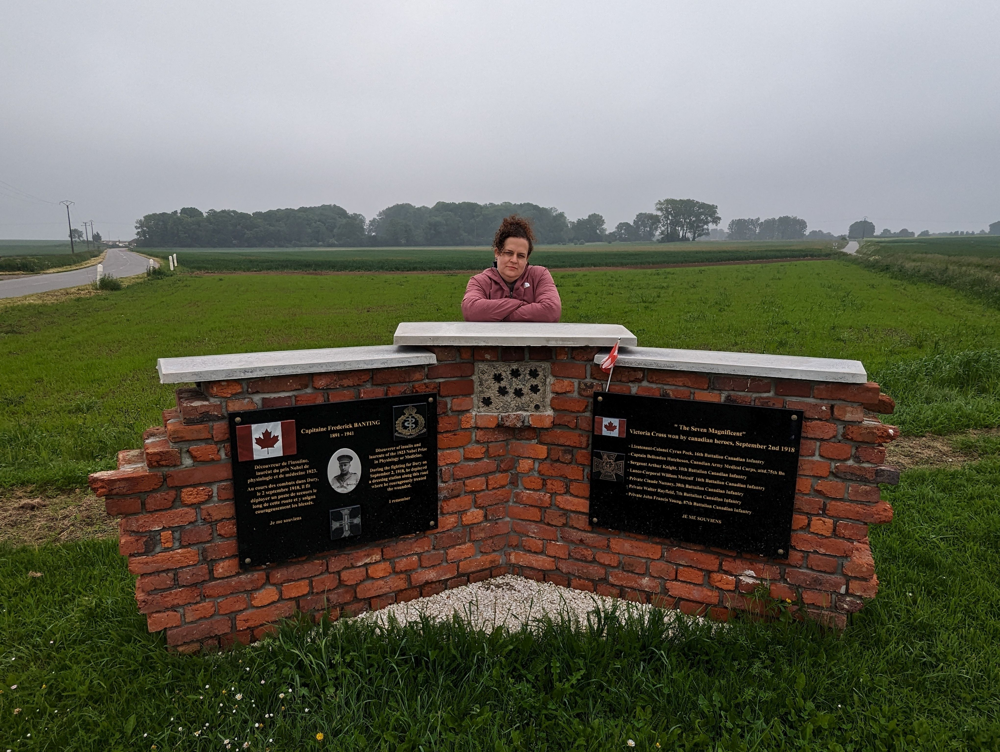

Captain Frederick Banting enrolled in Medical School in 1912, and attempted to join the Army as soon as war broke out. He was rejected for poor vision, so completed a compressed Medical degree and enrolled in the Royal Canadian Army Medical Corps. He sailed to England in May 1917, and worked as a surgeon in Granville Canadian Special Hospital in Kent, England. He joined the 44th Battalion as Medical Officer in time for the Battle of Amiens in August 1918.

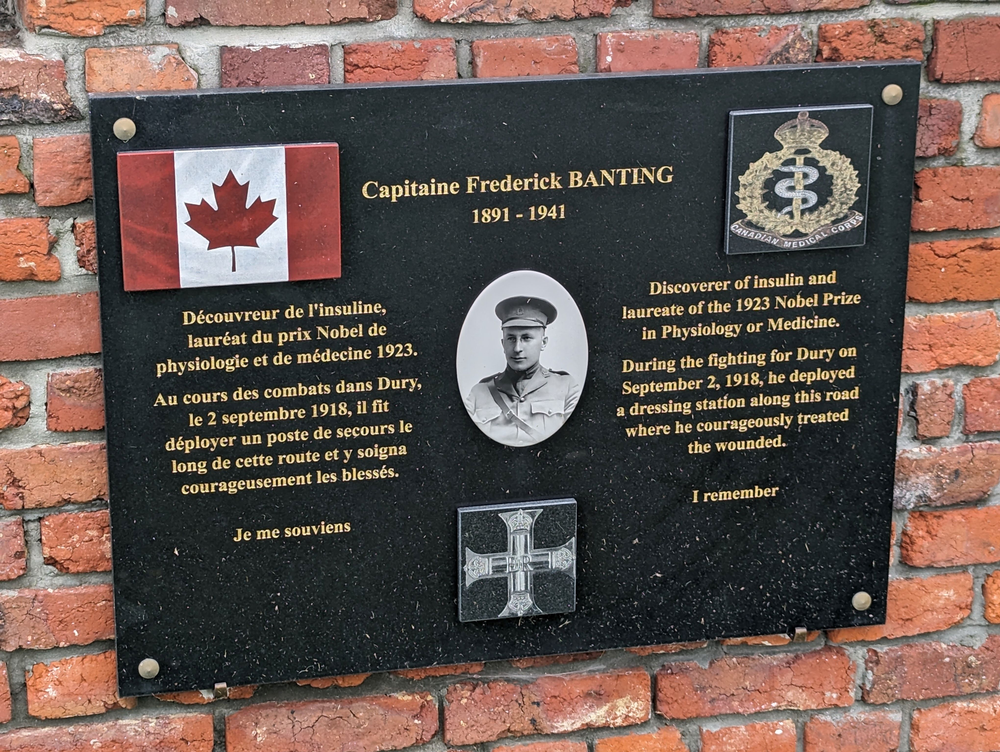

During the Battle, a German soldier entered the aid post and Banting was saved by an amputee patient who shot the German at the door. A short time later, on 02 September, he was struck by shrapnel from an exploding shell. He won the Military Cross for exceptional bravery while attending to the wounded under fire.

Banting returned to Canada and soon afterwards developed the process of extracting insulin from a dog’s pancreas. He won the Nobel prize in Medicine in 1923, becoming the youngest recipient of the prize.

He rejoined the military in WW2, heading research into aviation medicine. In 1941 he was killed in the crash of a Hudson Bomber transiting from Newfoundland to England. His plane is memorialized at Banting Memorial Park, Musgrave Harbour, Newfoundland.

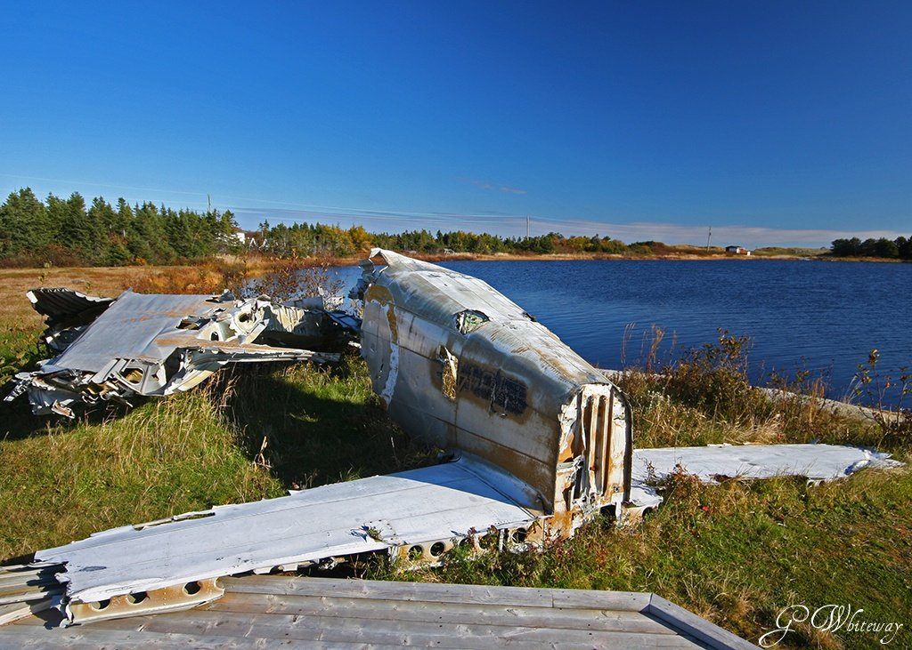

A total of 73 Victoria Crosses were awarded to Canadians in the First World War. The other plaque on the memorial honours the 7 members who remarkably all won the Victoria Cross on 02 September, the final day of the Battle of the D-Q Line for actions across the 30 km front.

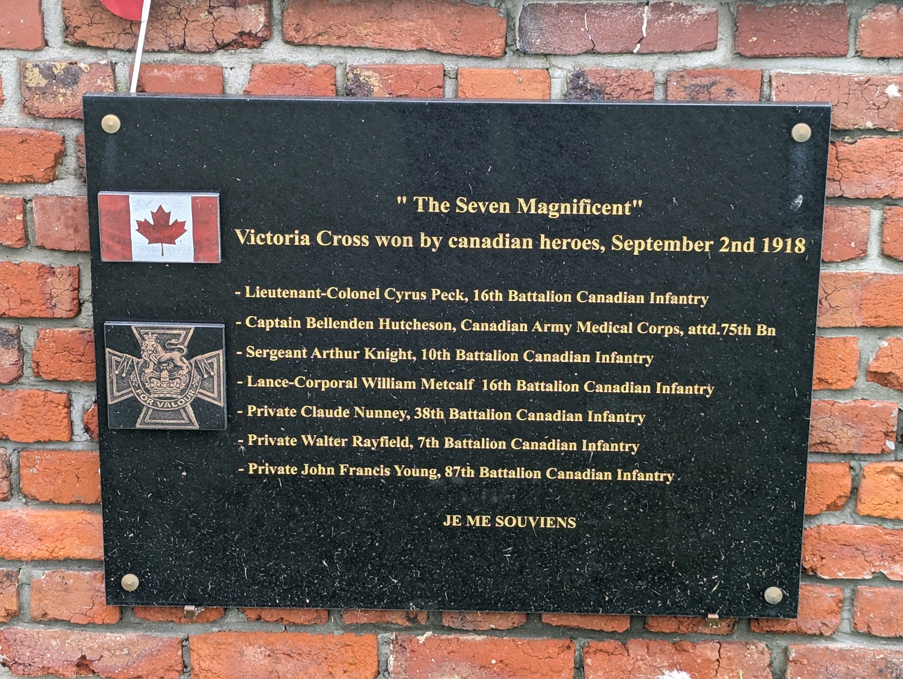

In the centre of the memorial is a plaque with 7 maple leaves and 7 stars representing the VC winners.

The memorial was unveiled on 02 September 2023 by Dury town council, witnessed by representatives of Veterans Affairs, the embassy, military, veterans of the Cameron Highlanders (perpetuating unit of the 38th Battalion VC Winner Claude Nunney), historians and Capt Banting’s great niece.

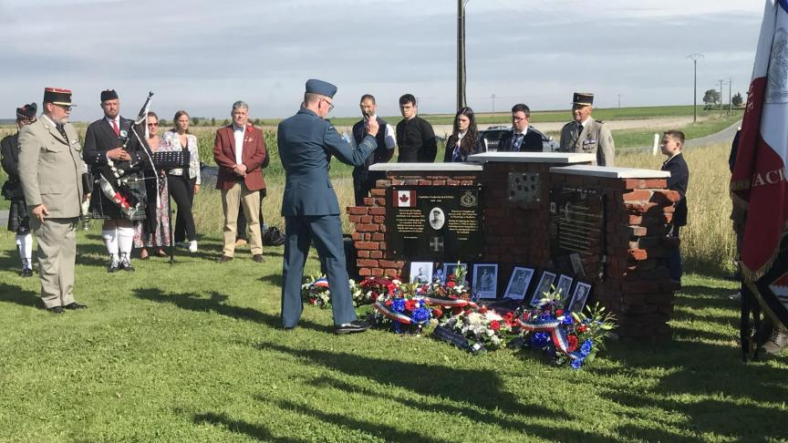

The next stop is the nearby Dury Crucifix Cemetery. The cemetery was started after the capture of the D-Q Line and contained 72 graves at the end of the war. The cemetery was greatly enlarged with concentrations from the battlefields of 1917 and 1918, and today has 2058 casualties, 1766 of whom are unidentified. There are 122 identified Canadians, all but 2 from the Battle of the D-Q Line.

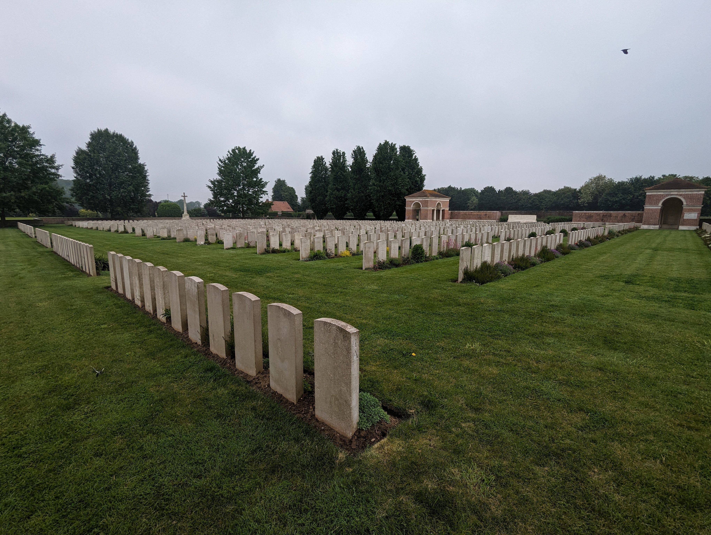

One of the interesting variances in this cemetery is that a few rows have flowers planted on both sides of the grave markers, making for a colourful break in the rows.

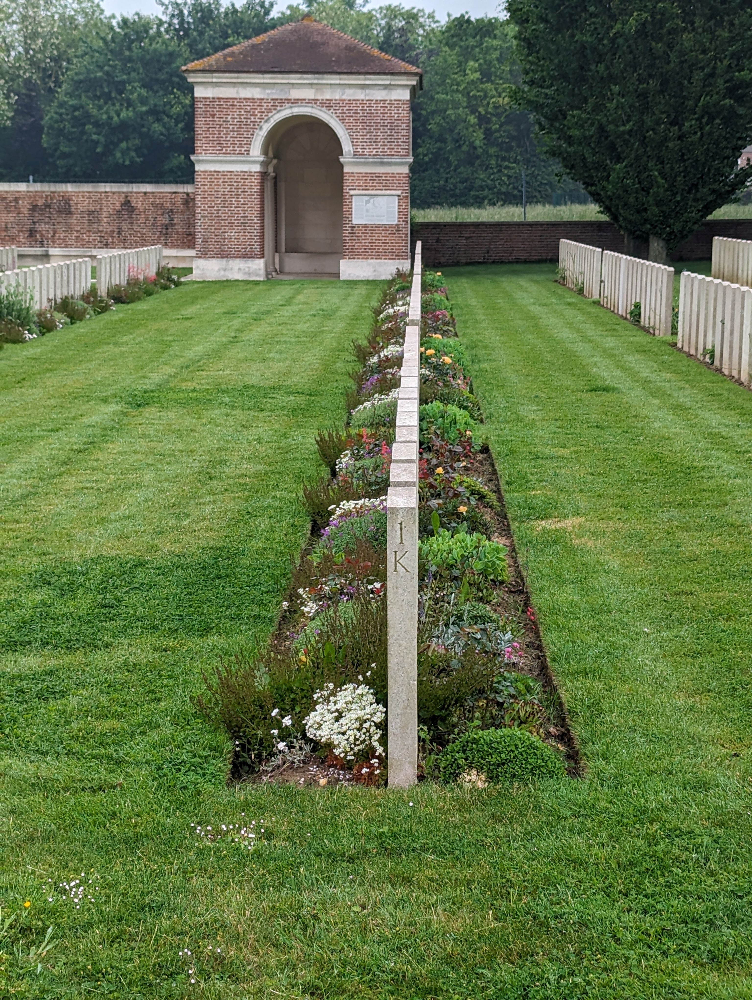

I always take photos of random grave markers, usually based on a targeted regiment, 1st Canadian Battalion or UK Suffolk Regiment, or something unusual. In this case I found Thomas Briggs who caught my eye because he was 42 years old.

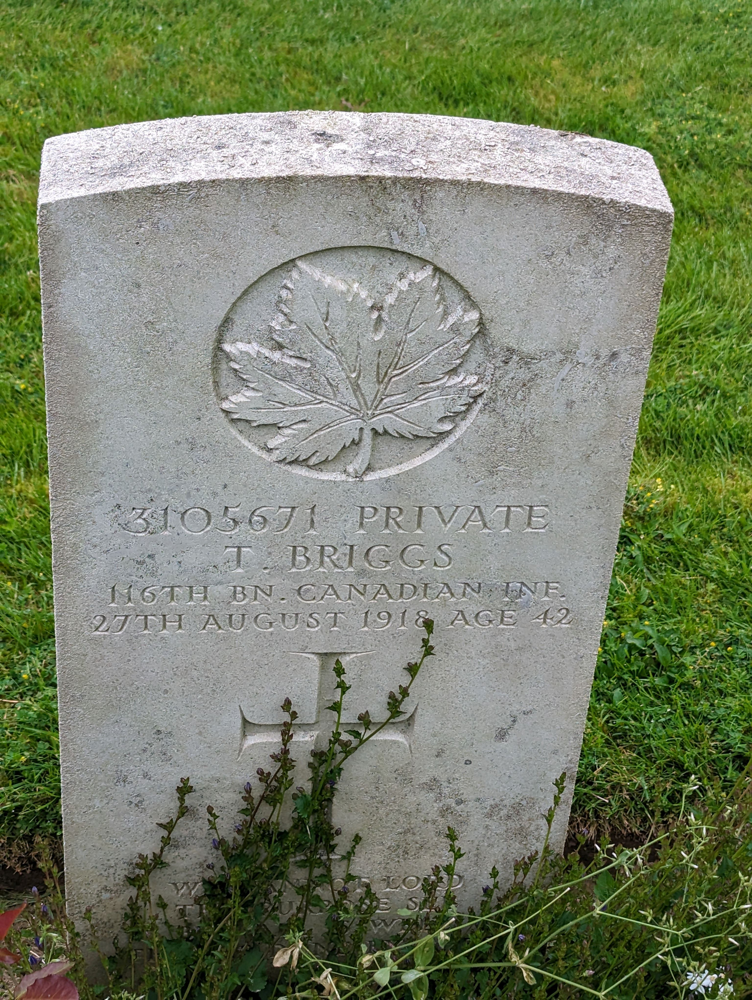

I pulled his service record and found he was born on 16 February 1875 in Blackburn, England, actually making him 43. He signed up in Toronto on 19 November 1917, so my initial guess he was conscripted since the August 1917 Canadian Conscription Act made all male citizens 20 to 45 eligible for call up to military service.

However, Thomas and his family had emigrated from the UK to Massachusetts in 1910 and never lived in Canada. Also, you had to be living in the UK at the outbreak of war to be eligible for UK conscription. It turns out, in order to address personnel shortages in Canada and the UK, once the US joined the war in April 1917, there was a concentrated recruiting push called the British Canadian Recruiting Mission to get members living in the US, but not US citizens to sign up for service.

Recruiting centres were set up throughout the US, and the successful campaign resulted in more than 47,000 recruits, 33,000 of whom joined the Canadians. This was likely due to higher pay and ease of getting to the recruitment office. These men were not obligated to serve but answered the call of a strong advertising program.

Thomas arrived in England on 16 February 1918, sent to the Combined Canadian Reinforcement Group (CCRG) in France on 17 Jun 1918, assigned to the 116th Battalion on 15 August 1918 and killed on 27 August 1918. He was shot by a sniper while attacking a machine gun nest.

The epitaph on his headstone reads:

*We cannot Lord thy purpose see, but all is well that is done by Thee.*

I’m not sure I could be as gracious if it had been my family member.

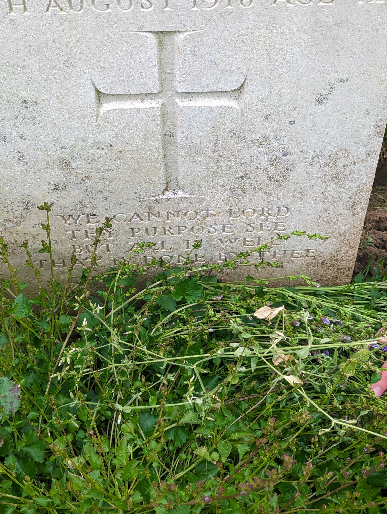

Our next stop was Rumaucourt German cemetery, home to 2,617 German soldiers. This German cemetery uses metal crosses to mark the graves. There are usually 4 names on each marker, 2 on each side.

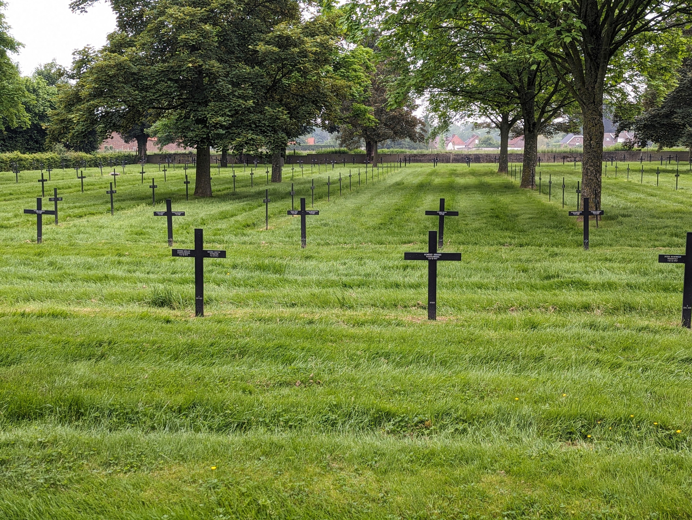

The Jewish soldiers have a separate marker, a sign of things to come.

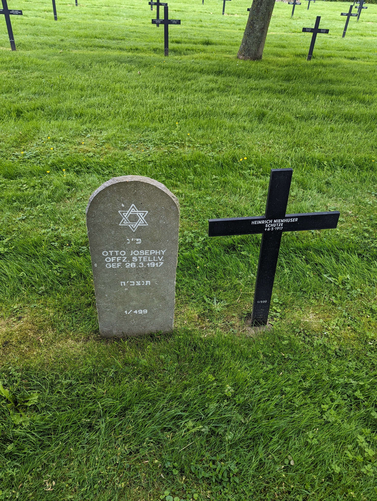

As with other German cemeteries, the Oak trees feature prominently, but in Langemark German cemetery near Ypres, the graves are marked with stones bearing 4 names.

Our next stop was the Bourlon Wood Canadian Memorial that commemorates the Battle of Canal du Nord, the last major battle of the Canadian Corps in the War.

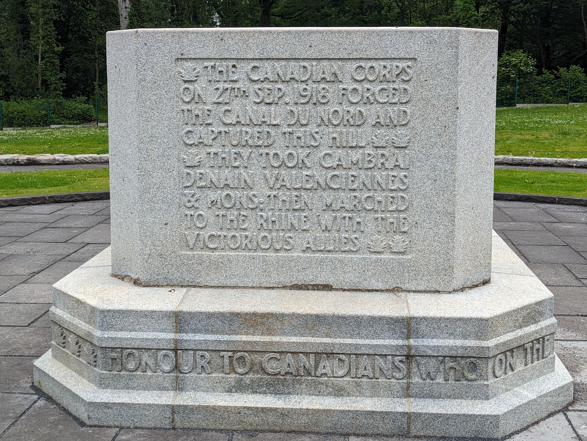

The memorial is located on a height of ground in Bourlon wood and features a series of steps to the monument.

Views from the top explain why this was such an important piece of ground to possess.

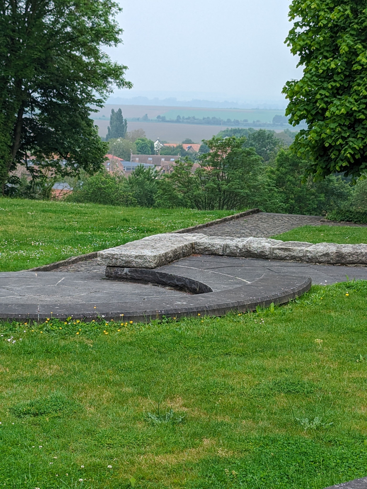

I covered the Battle of the Canal du Nord in a previous post, but will summarize the action below:

<https://www.paulsbattlefieldtours.com/post/last-100-days-cambrai-27-sep-1918>

# Battle of Canal du Nord

At 0520 on 27 September, the Canadian Corps pushed their way across a dry stretch of he Canal du Nord, catching the Germans by surprise. The 1st Division swung north and quickly captured the Marquion line and pushed all the way to Haynecourt. The 4th Division faced much stronger opposition in the taking of Bourlon Woods, and it wasn’t until 30 September that the Woods were finally taken.

An assault on Cambrai was attempted on 01 October, but heavy opposition quickly stalled the attack. The exhausted battalions stopped the assault on 02 October. On 08 October, the Canadians captured Cambrai without a fight as the Germans had retreated and set the town on fire.

The Canadian Corps had suffered more than 10,000 casualties in the Battle of Cambrai. The totals for the Final 100 Days were 8,227 Canadians killed and over 34,000 Canadians wounded. Over 20 percent of the total Canadian casualties occurred in the Last 100 Days.

The Bourlon Woods Memorial is always special to me, as Sgt Robert Connelly was killed on 30 September in the Battle of the Canal du Nord. We will remember.

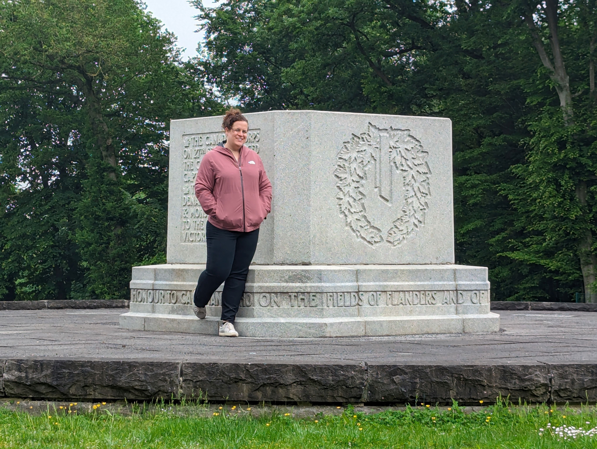

## Battle of Cambrai

Our last stop was at the Newfoundland Memorial at Masnieres. On 20 November 1917, the British Third Amry, under General Sir Julian Byng (former Canadian Corps Commander) launched an assault on the Hindenburg Line over a 10-mile front. This battle featured the first large scale use of tanks with 378 fighting tanks and 100 supply tanks assembled. The first day of the attack was a complete surprise, with the tanks ripping through German defences in depth. More than 7,500 prisoners were captured the first day.

The traditional preliminary artillery barrage was not used, so the Germans were not alerted to the attack, and the ground was relatively unscarred for tank use. The tanks were very effective at crushing the massive rows of barbed wire and the infantry followed the tanks to great success.

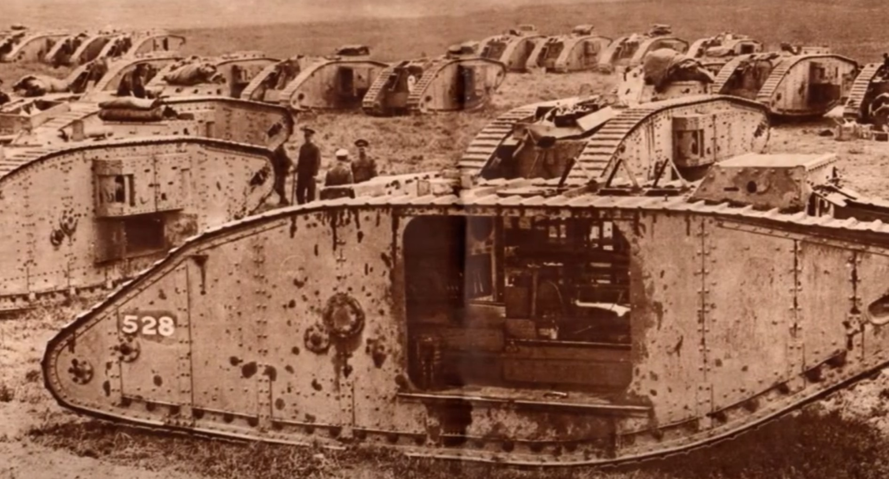

However, by the second day about half of the tanks had been knocked out by artillery fire, mechanical problems or stuck in the wide trenches.

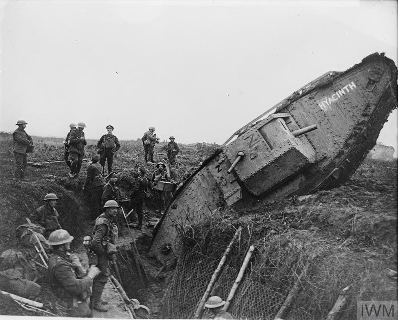

There were not sufficient supporting troops to consolidate the first day gains and communications broke down. Over the next few weeks, the Germans counterattacked pushing the British almost back to their original starting line.

Although this battle was not a success, the effectiveness of a combined arms assault had been demonstrated, and would be used very effectively in the Last Hundred Days.

## Masnieres

The Newfoundlanders moved into position at Gouzecourt, and advanced behind the tanks towards Masnieres.

When the Newfoundland Regiment reached the St Quentin Canal, Masnieres was still in German hands, so the Regiment dashed across a lock and set up a strong point on the far side of the canal. They were unable to advance due to heavy machine gun fire, and a tank crossing the bridge crashed into the canal collapsing the bridge so armoured support was not available.

They were unable to press the attack the next day and were relieved on 22 November. The cost was heavy. Of the 553 soldiers who started the battle, 54 were killed and 194 wounded.

The German counterattack went in on 30 November. The Regiment was in Marcoing when heavy shell fire prevented them from advancing to their assigned positions. The Newfoundlanders led a bayonet charge to push back the Germans, allowing them to hold the line while the other divisions folded. The Newfoundlanders and their 29th Division was the only division that did not collapse on 30 November. After 3 days of ferocious fighting, the Third Army was ordered to withdraw.

The Newfoundlanders continued to pay a heavy price, suffering an additional 49 killed and 196 wounded for a staggering 493 casualties from 20 November to 04 December. The regiment received a replacement draft of 77 soldiers on 29 November, so their casualty rate exceeded 75%.

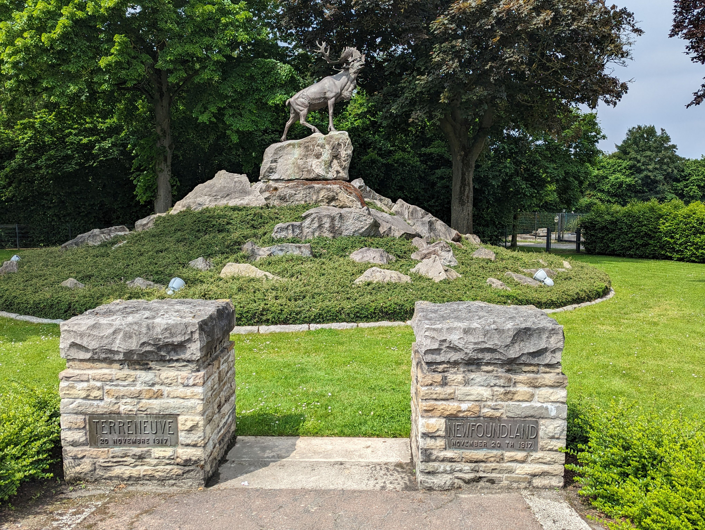

In December of 1917, the Regiment was granted the title of Royal. The Royal Newfoundland Regiment was the only regiment who received this honour during the First World War and it was only the third time in history that this honour had been bestowed to a regiment in time of war.

The granting of the Royal designation seemed an appropriate ending point, so we made our way back to Maastricht. Rachel got a good appreciation of the enormity of the loss suffered, and the emotion generated by the battlefields, monuments and cemeteries. Being able to see and walk the ground is very powerful and emphasizes the scale of the conflict.

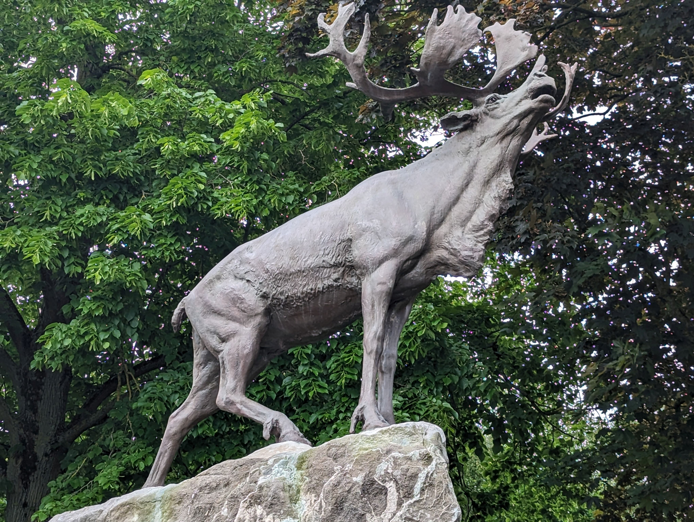

* [First World War](https://www.paulsbattlefieldtours.com/blog/categories/first-world-war)
* [Family](https://www.paulsbattlefieldtours.com/blog/categories/family)