# Reichswald Forest War Cemetery

* [pd-allen](https://www.paulsbattlefieldtours.com/profile/pd-allen/profile)
* Oct 19, 2023
* 5 min read

Steve McKenna has been a buddy of mine since grade nine. We went through high school together, signed up for RMC together, and spent most of our careers in the RCAF. When he told me his uncle Leslie McKenna was buried in Reichswald Forest War Cemetery, close to where I am staying in the Netherlands, I decided to pay my respects. There will be a separate post on Leslie McKenna.

Leslie McKenna joined the RCAF in Jan 1943, just days after his 18th birthday. He spent 9 months training in Canada at Edmonton, Dauphin MB, Montreal and Quebec City before completing his Air Gunner Training at No 9 Bombing and Gunnery School, in Mont Joli, QC near Rimouski. Leslie was immediately sent overseas to train on the Wellington Bomber and the Halifax Mk III bomber. Bomber crews were assembled early in Wellington Training, so the crew got used to working together. He was assigned to the Royal Air Force 102 Squadron on 25 May 1944 at RAF Station Pocklington in York, almost 18 months after joining up.

On 14 Jun 1944, they participated in a 337 aircraft attack on German Army concentrations near Caen. Sadly, on their second mission on 16 Jun, their Halifax Mk III Serial Number MZ-652 Squadron number DY-Z was shot down, and all crew members killed.

From Martin Middlebrook’s book Bomber Command War Diaries: An Operational Reference Book 1939-1945:

16/17 June 1944

STERKRADE/HOLTEN

321 aircraft – 162 Halifaxes, 147 Lancasters, 12 Mosquitoes – of 1, 4, 6 and 8 Groups to attack the synthetic-oil plant despite a poor weather forecast.

The target was found to be covered by thick cloud and the Pathfinder markers quickly disappeared. The Main Force crews could do little but bomb on to the diminishing glow of the markers in the cloud. R.A.F. photographic reconnaissance and German reports agree that most of the bombing was scattered, although some bombs did fall in the plant area, but with little effect upon production. 21 Germans and 6 foreigners were killed and 18 houses in the vicinity were destroyed.

Unfortunately, the route of the bomber stream passed near a German night-fighter beacon at Bocholt, only 30 miles from Sterkrade. The German controller had chosen this beacon as the holding point for his night fighters. Approximately 21 bombers were shot down by fighters and a further 10 by Flak. 22 of the lost aircraft were Halifaxes, these losses being 13.6 percent of the 162 Halifaxes on the raid. 77 Squadron, from Full Sutton near York, lost 7 of its 23 Halifaxes taking part in the raid. These losses included Halifax MZ-652.

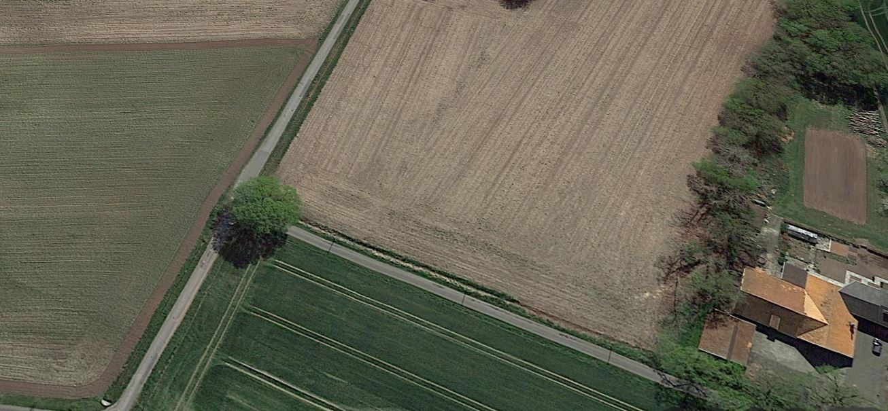

The monument stands at a T-junction between house numbers 28 and 29 in the farming community of Hessinghook in Südlohn-Oeding, postcode 46354 and is intended to commemorate the bomber crew of the Handley Page Halifax B. Mk. III, MZ-652/DY-Z of the 102 Squadron of the Royal Air Force. The monument is just beneath the tree at the junction.

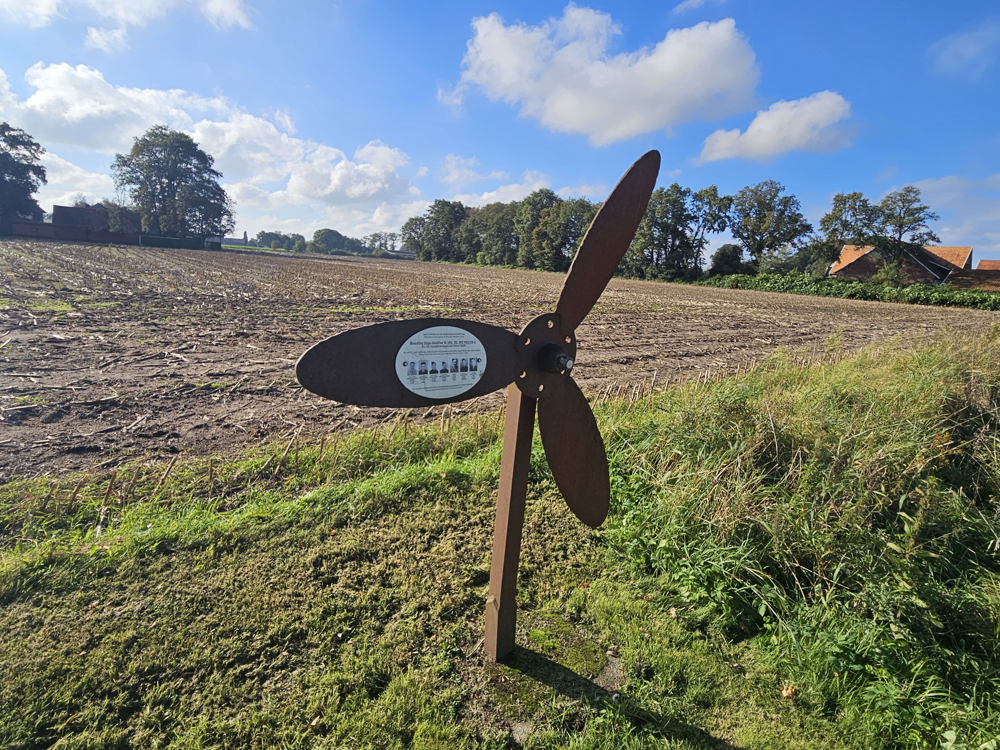

The plane was shot down by a German fighter plane at night on 17 June 1944 near this spot. In the process, all seven crew members lost their lives, and the debris was scattered within a radius of 2 kilometers.
 The seven crew members were first buried in the Catholic cemetery of Oeding and reburied on 05 February 1947 at the British military cemetery in Reichswald near Kleve.

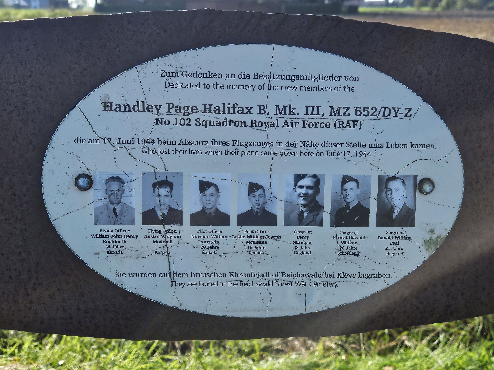

The plaque reads as follows:

 In memory of the crew members of Dedicated to the memory of the crew members of the Handley Page Halifax B. Mk. III, MZ 652/DY-Z No 102 Squadron Royal Air Force (RAF) who died in the crash of their aircraft near this site on 17 June 1944.
 Who lost their lives when their plane came down here on June 17, 1944.

Flying Officer William John Henry Rushforth, Navigator, 34 years old Canada

Flying Officer Austin Vaughan Maxwell, Pilot, 26 years old Canada

Pilot Officer Norman William Amstein, Air Gunner, 20 years old Canada
 Pilot Officer Leslie William Joseph McKenna, Air Gunner, 18 years old Canada (actually he was 19)

Sergeant Percy Stamper, Wireless Operator/Air Gunner, 23 years old England

Sergeant Ernest Oswald Walker, Flight Engineer, 20 years old Scotland

 Sergeant Ronald William Peel 21, Air Bomber England

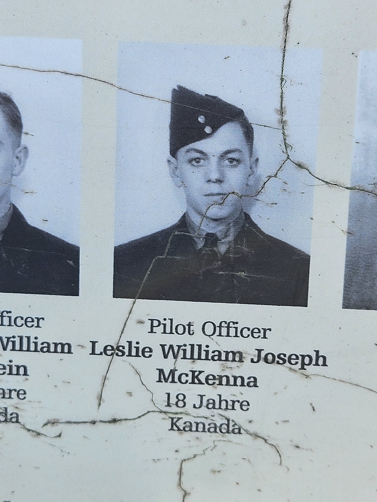

Close up of Leslie McKenna.

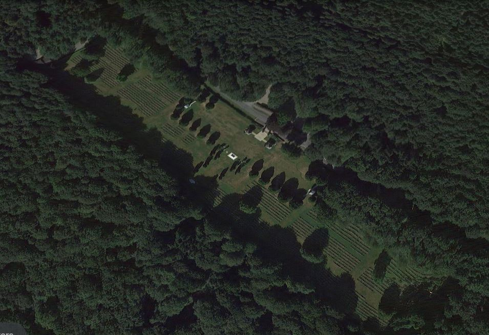

The Reichswald Forest Cemetery was created after the war when burials were brought in from all over Western Germany. It is the largest Commonwealth War Graves Cemetery in Germany with over 7500 burials including over 700 RCAF members.

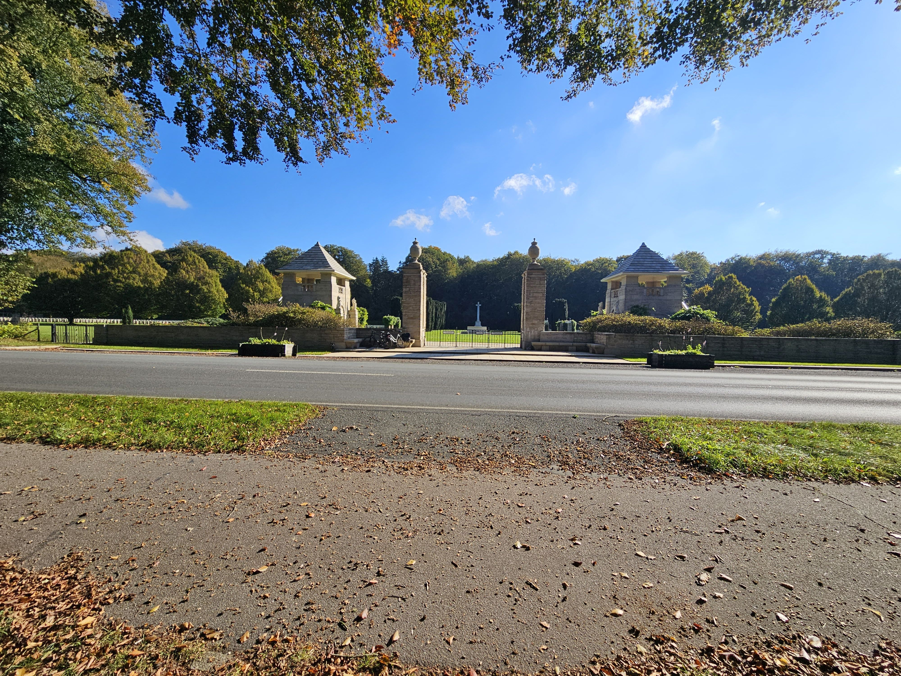

The cemetery is in a very peaceful setting and is massive.

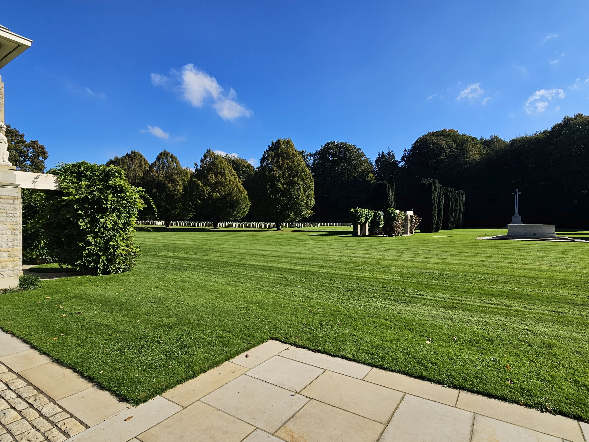

The cemetery has Air Force Members on the left, and army members on the right.

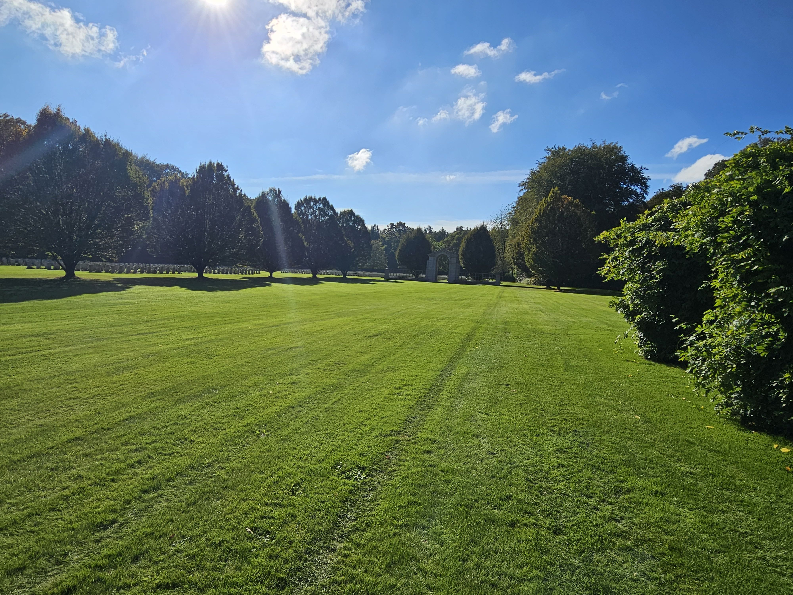

As with all the CWGC cemeteries I have visited, the grounds are immaculate, and the setting very tranquil. The power of 7,500 souls is very overwhelming and gives you a feeling of the enormity of the loss.

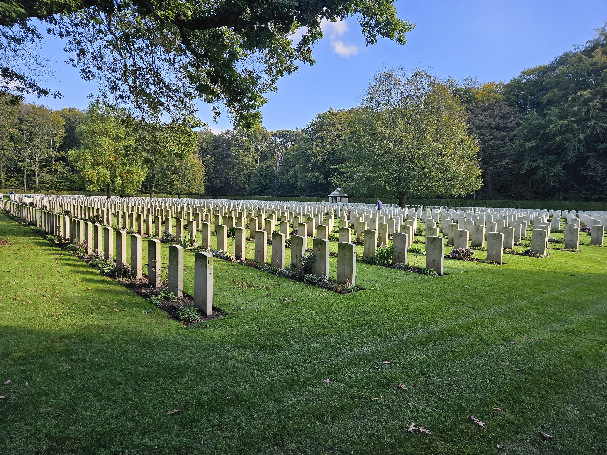

It is always difficult to try to capture a photograph that shows the size of a cemetery. This is a view from one side looking towards the centre of the cemetery.

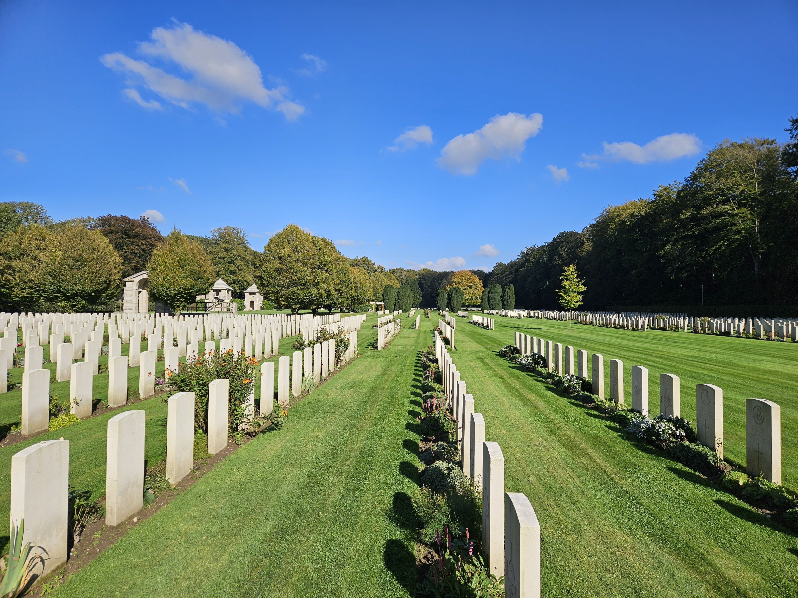

The Gates at the entrance to the cemetery have viewing platforms that help to get a view of the size of the cemetery. This view is of the Air Force side of the cemetery.

The crew was originally buried in a communal grave in the Oeding Cemetery. When they were reinterred in the Reichswald Forest War Cemetery F/O Rushforth, and F/Sgt Peel were separately identified and given individual graves.

The remaining 5 crew men were buried in a communal grave.

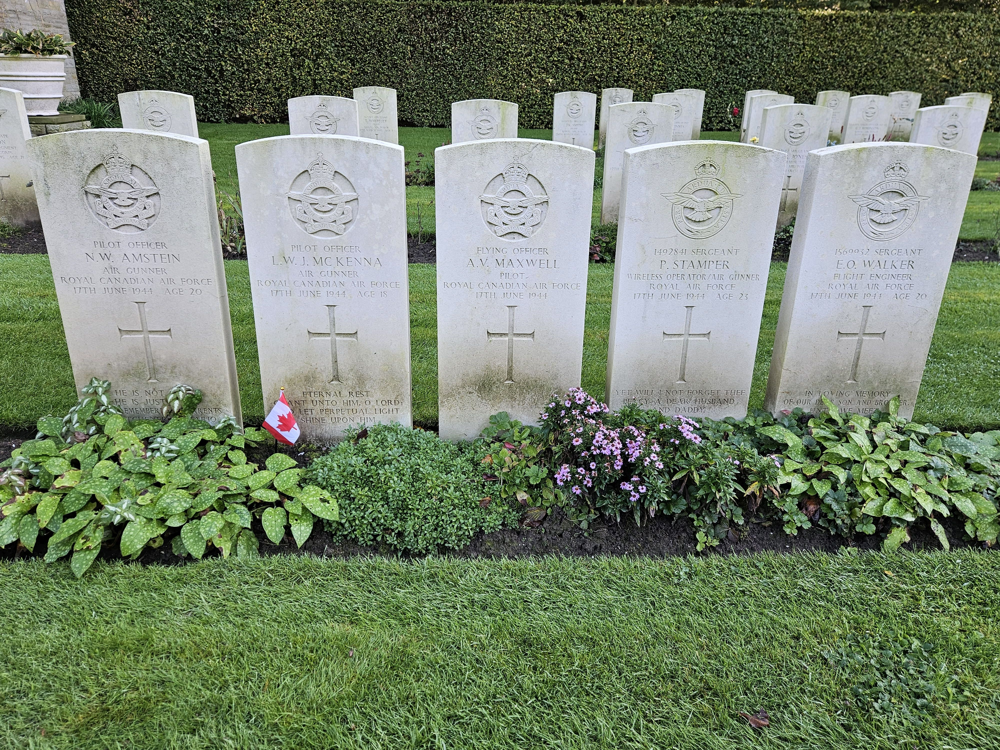

Leslie McKenna’s Grave Marker. The inscription reads:

Eternal rest grant unto him, O Lord and let perpetual light shine on him.

Photograph of Leslie McKenna.

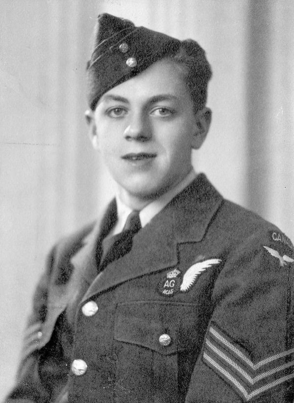

I looked at the records of Norman Amstein to see if the two Air Gunners would have crossed paths before joining the crew on the Wellington Bombers. Norman was recruited from London, ON but his path exactly parallels Leslie’s from their basic training in Edmonton, through all the training in Canada, and overseas. They would have known each other very well, and likely lobbied to get on the same bomber crew.

I also noticed they were both promoted to Pilot Officer on 15 Jun 1944. Apparently, it was not uncommon for Air Force personnel to be promoted retroactively upon their deaths. I could only find unofficial references to the practice, but my Uncle Robert McKenzie a Typhoon pilot, had a similar promotion dated 2 days before his death.

I thought a great deal about Steve throughout this visit. We went all through high school and RMC together, and Steve was the major influence on my attending RMC and joining the Air Force. We were very fortunate to serve in a time of relative peace. If we had been born 30 years earlier, or there had been another global conflict this could easily have been our story.

* [Second World War](https://www.paulsbattlefieldtours.com/blog/categories/second-world-war)