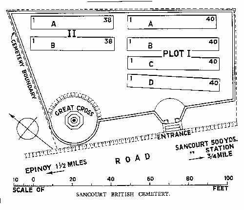
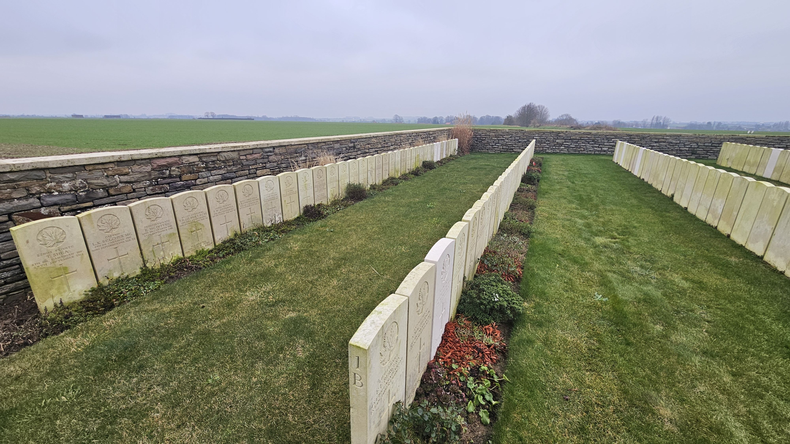
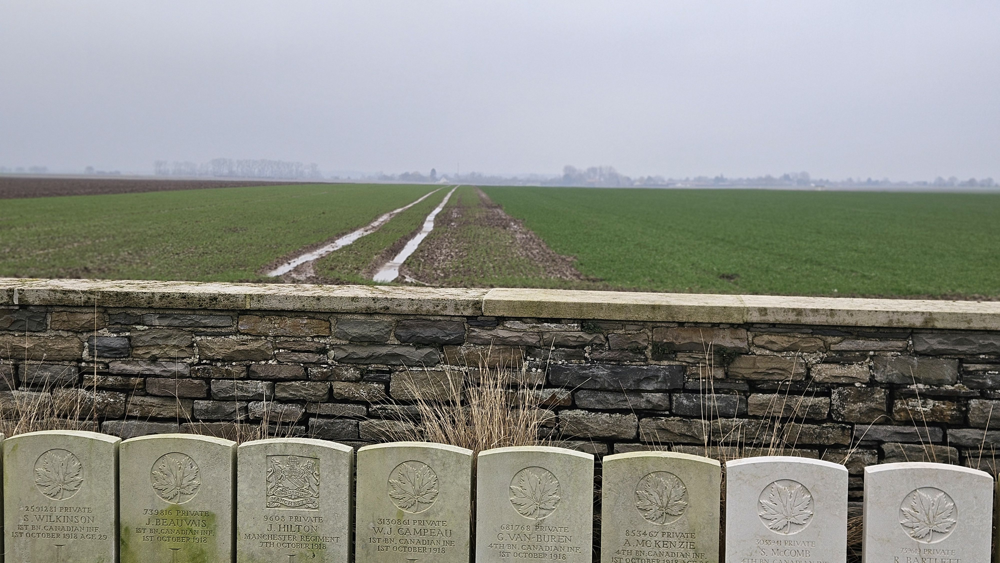
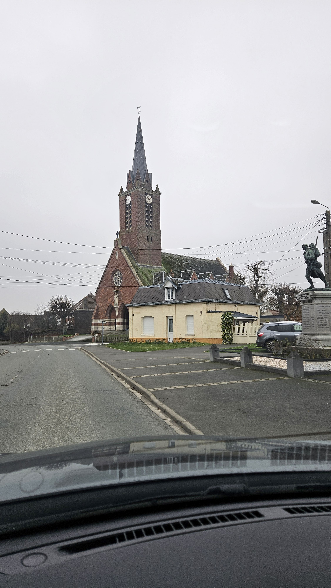
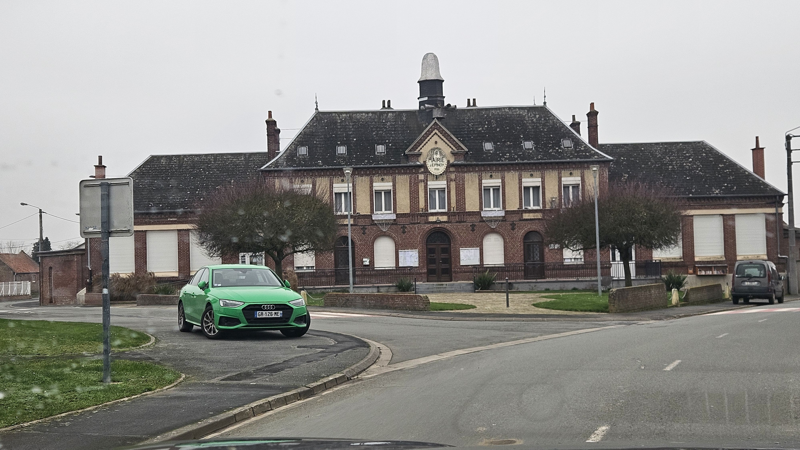

# Sancourt British Cemetery

* [pd-allen](https://www.paulsbattlefieldtours.com/profile/pd-allen/profile)
* Jan 8, 2024
* 2 min read

Updated: Jun 29, 2025

The Sancourt British Cemetery is located Northeast of the village of Sancourt, about 1 km down a single lane track amongst the fields.

Sancourt has 237 graves, only 20 of which are unknown soldiers. Despite the name, only 6 British Soldiers are buried here, with the remainder being Canadians.

All but 5 of the soldiers were killed during the Battle of Canal du Nord from 27 September to 01 October 1918. The remainder were killed in the following two weeks. Although Canada’s Last Hundred Days were very successful, the success came at a high cost.

I visited Sancourt British Cemetery because Robert Connelly is buried there. Robert is the uncle of my brother-in-law Lorne Ryan. Robert’s biography will be posted separately, but he fought with the first battalion from June 1916 until his death on 30 September 1918, just 6 weeks before the end of the War. Robert won the Military Medal for his actions at Passchendaele in November 1917.

Sancourt British Cemetery

Cemetery Layout

Robert’s grave is located in Plot 1, Row B, Number 11.

Robert’s Grave Marker

Row 1B

The fields are muddy and desolate this time of year (January) and a low mist added to the dreariness of the scene.

January Fields

Robert was killed by machine gun fire in the vicinity of Epinoy. I didn’t have an exact location, so I drove the road from Abancourt to Epinoy as the first Battalion was operating in this area on 30 September. The towns are all typical small French villages with a tiny grouping of red brick buildings.

The churches in the area are all made of red brick. The Church of St Nicholas, like almost all of the buildings in Epinoy were rebuilt after World War One as the village had been flattened during the fighting.

Epinoy Church

The town hall is the most elaborate building in the village.

Epinoy Town Hall

Travelling in the winter does not encourage long contemplative sessions on the landscape, but energy radiating from the cemeteries is still as strong. I walked the cemetery for 10 minutes before heading to the comfort of my car. I can only imagine how much slogging through the muddy fields and water-logged trenches in freezing weather with almost constant rain added to the misery of conflict.

* [First World War](https://www.paulsbattlefieldtours.com/blog/categories/first-world-war)
* [Family](https://www.paulsbattlefieldtours.com/blog/categories/family)