# Saving the British Expeditionary Force

* [pd-allen](https://www.paulsbattlefieldtours.com/profile/pd-allen/profile)
* Oct 4, 2023
* 7 min read

Updated: Jul 2, 2025

**Suffolk Regiment Crest**

Lance Sgt Henry Goodfellow of the 2nd Battalion Suffolk Regiment was the oldest of 4 brothers who served in the war. Henry, Ernest, and Walter were killed, only the youngest Thomas survived the War. The brothers were cousins to my maternal grandmother Annie Goodfellow, a British War Bride. I previously posted the story of Henry Goodfellow, and about the La Ferté-sous-Jouarre Memorial outside Paris.

I visited Le Cateau to honour the actions of the 2nd Suffolks, visit the Suffolk Memorial, and to highlight the importance of their stand at Le Cateau.

At the start of the First World War, the British Expeditionary Force (BEF) consisted of 6 infantry divisions, approximately 120,000 men in the Regular force. Four divisions were sent to France at the start of the War, and the remaining two divisions stayed in the UK for home defence.

The 2nd Suffolks were in Dublin at the outbreak of War to manage tensions raised by the Irish Home Rule bill which granted self-determination to the Irish. The Suffolks had 563 regular soldiers, and recalled reserves to make up their full contingent of 998. The reserves all had previous military service, but some had been out for up to 9 years.

They landed in France on 15 Aug 1914, and took a cattle train to Le Cateau. From there they marched 20 then 18 miles on consecutive days to take up the line at Mons. On the march, they were cheered by the locals, getting food, flowers and wine. They were in place by the evening of 22 Aug, and neither the British nor the Germans had any idea the size of the forces they faced. Due to severe losses at Charleroi the much larger French Army withdrew, and the British agreed to hold the line for 24 hours to cover the French retreat. The Germans outnumbered the British 3 to 1, and after a confusing start the Germans took Mons, as the British withdrew. The Brits had 1,600 casualties, and the Germans upwards of 2,000.

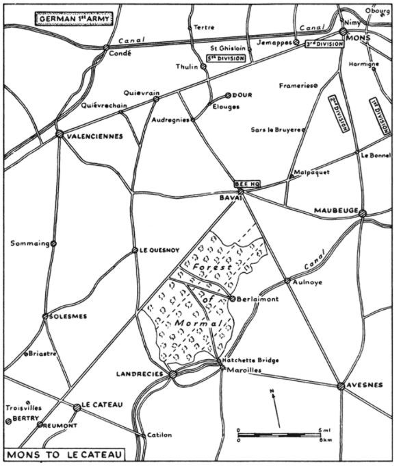

The British retraced their steps, retreating under hostile fire. The cheerful march up to Mons was replaced by a desperate retreat under harassing fire from the Germans. The retreat was slowed by huge number of Belgian and French refugees clogging the roads. After 2 days of forced marching, the BEF reached Le Cateau the evening of 25 Aug. The original plan was to continue the retreat, but at a meeting with Gen Horace Smith-Dorrien at 2AM on 26 Aug, it was made clear that the troops could not continue the retreat, so the decision was to stand and fight.

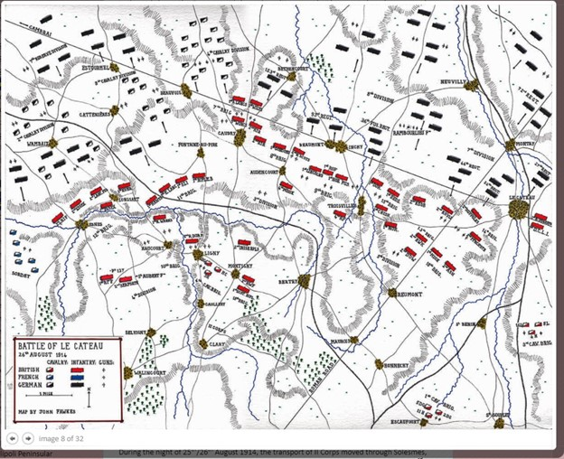

The British Line stretched 10 miles over gently rolling farmland and open fields. The French Cavalry was on the left flank, but the right flank was severely exposed. The 2nd Suffolks were on the right flank directly opposite the town of Le Cateau.

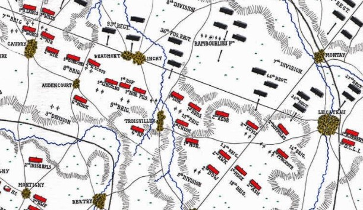

The Suffolks were in trenches dug by French Civilians. The trenches were extremely shallow and straight and in the wrong locations as they were dug so the troops could make an escape under cover. The trenches offered limited fields of fire, with good protection for the advancing troops.

*The Regimental Sergeant Major (RSM), Bobby Burton, looked over the position with the brand of furious disapproval he normally reserved for hapless new recruits. The RSM had served more that 25 years with the Suffolks and was well over age for active service and should have been left behind when the Battalion sailed for France. But the sight of Bobby’s Burton’s tight-lipped choleric face which had put the fear of God into recruits on the barrack square was strangely reassuring the younger Suffolks waiting with mixed feelings for their taste of Battle. In the last remaining minutes before the morning exploded into battle, the RSM set the men digging. There was not much they could do to improve the trenches and they had nothing but entrenching tools to work with, but with many hands to help and some fruity encouragement from the RSM they scraped away at the despised ditches and made them deeper by the inch or so that would give at least a small degree of cover. Fortunately, the soil was light, loamy and easy to dig in, so they managed to achieve a little. In the time available it was little enough, but as the morning wore on the Suffolks were glad even of that. (Lyn MacDonald, 1914)*

The Suffolks were told by their 14th Brigade Commander BGen Rolt and confirmed by the Battalion commander LCol Brett that they were to hold their positions and there was to be no retirement. The Artillery assault began around 6 AM. The Germans had massed artillery on a ridge about 3800 yards from 5th Division, with a clear view of the British guns and trenches. The British were severely outgunned and suffered heavy loses. Moving the 5th Division artillery was not effective as the enemy could see the guns and quickly zeroed in on their positions, causing major losses. The enemy shelling caused major casualties, and LCol Brett was killed early on in the shelling. When the German infantry advanced at 10 AM, fire from the machine guns and rifles was very effective.

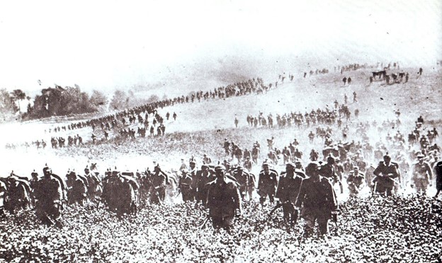

**German Advance at Le Cateau**

The attack was driven back several times, but the Germans continued to press forward. Eventually they managed to get troops into the dead zones and rallied for renewed assaults. The artillery barrages continued, aided by German aircraft who dropped silver streamers over prime targets to increase effectiveness. By early afternoon the Germans began to flank 5th Division. The British gunners had to turn some of their remaining guns 90 degrees to return fire. There was a real chance that 5th Division would be encircled, and their escape route cut off, so after 8 hours of bitter fighting, the order to retire was issued at 2 PM. It took more than an hour to reach some units, and several units never received the order, so they fought on.

To quote the official history:

*“Between 2.30 and 2.45 the end came. The Germans had by this time accumulated an overwhelming force in the shelter of the Cambrai Road, and they now fell upon the Suffolks from the front, right flank, and right rear. The turning movement, however, did not at once make itself felt, and the Suffolks and Argylls opened rapid fire to their front with terrific effect, two officers of the Highlanders in particular bringing down man after man and counting their scores aloud as if at a competition. The Germans kept sounding the British “Cease Fire” and gesticulating to persuade the men to surrender, but in vain. At length a rush of enemy from the rear bore down all resistance and the Suffolks and their Highland comrades were overwhelmed. They had for nine hours been under an incessant bombardment which had pitted the whole of the ground with craters, and they had fought to the very last, covering themselves with undying glory.”*

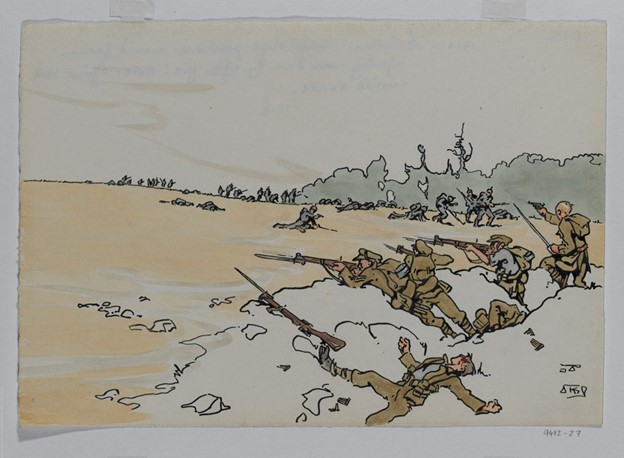

The 2nd Battalion Suffolk regiment suffered 720 casualties, killed, wounded or missing during the battle of Le Cateau. Many of the wounded were captured when their position was finally overrun. On 27 August when they finally arrived at St Quentin the battalion was under the command of Lt Oakes with 111 of the original 996 answering roll call. The Sacrifice by the Suffolks and other units allowed the BEF to continue its retreat and was credited as saving the BEF from complete annihilation. The BEF continue it’s retreat to the Marne River just outside Paris, where the French and British finally defeated the Germans in the Battle of the Marne 05-12 Sep, and stemmed the German advances.

A memorial was dedicated by Gen Smith-Dorrien on 26 May 1926 at the site at the centre of the Suffolk Regiment stand. The memorial is dedicated to all units who supported the Suffolks during the battle but is generally known as the Suffolk Memorial. The memorial denotes the members of the 2nd Battalion Suffolk Regiment, 2nd Battalion Manchester Regiment, 2nd Battalion Argyll and Sutherland Highlander Regiment and Royal Regiment of Artillery who were killed at Le Cateau.

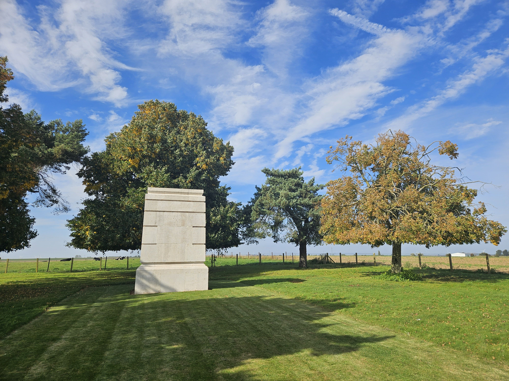

The memorial is located just outside Le Cateau in the middle of farm fields, as shown on the map.

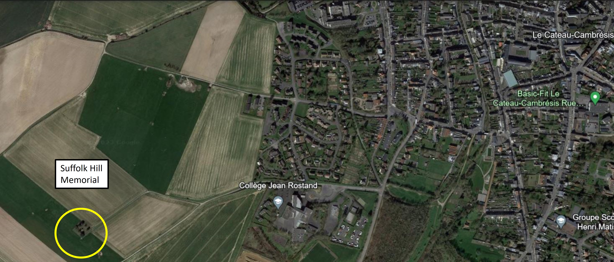

**Suffolk Hill Memorial Location outside Le Cateau**

The monument is located on a hill with a commanding view of Le Cateau and the surrounding area.

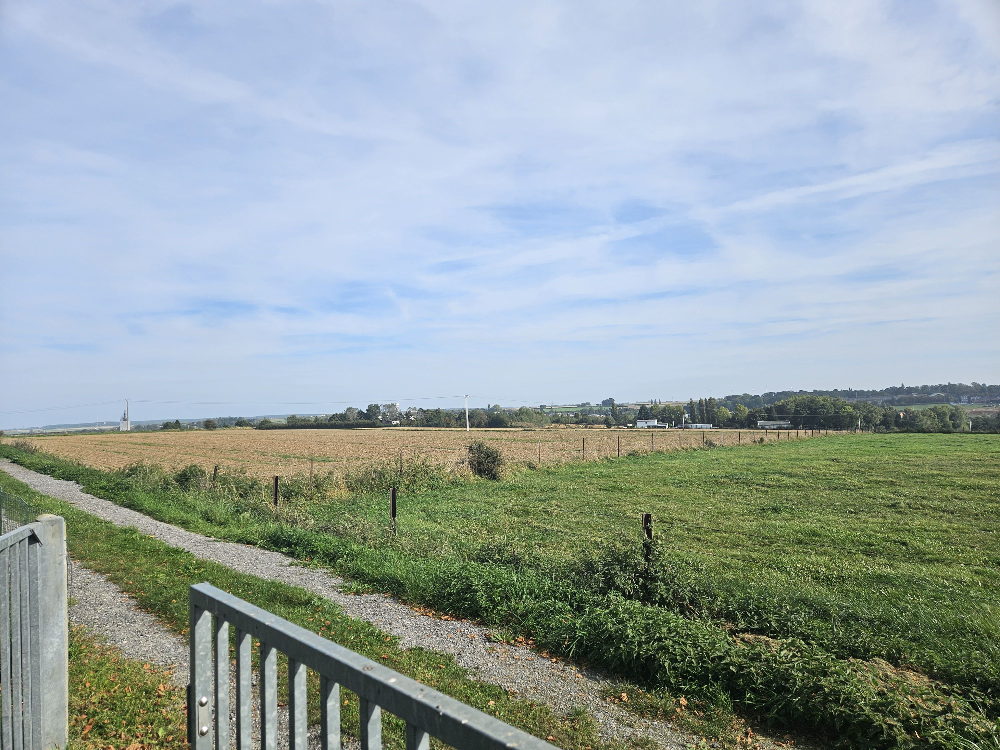

A view looking in the opposite direction.

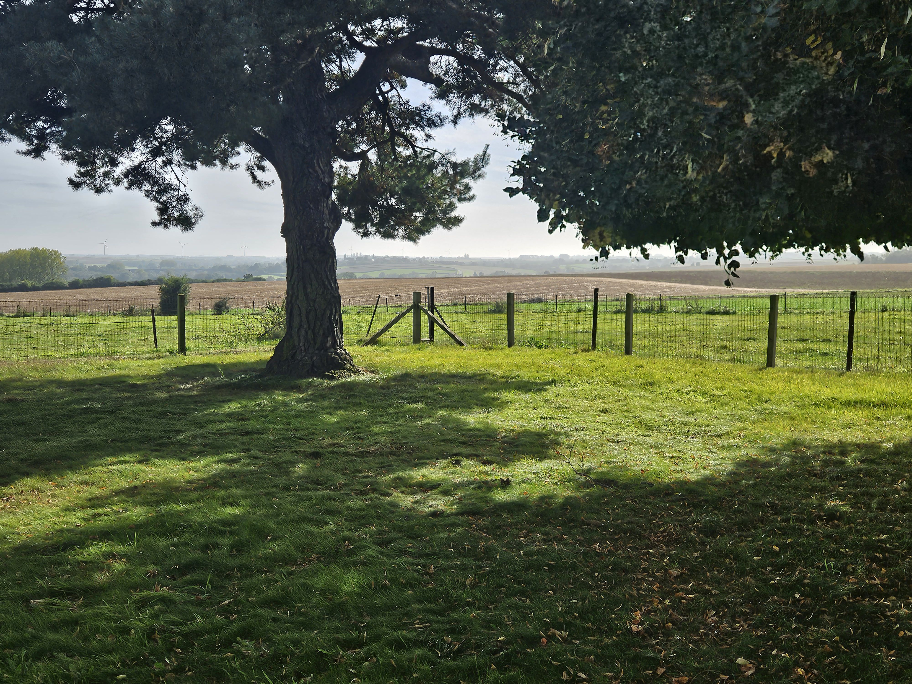

A photo of the memorial is shown, along with a close up of the memorial listing of the 79 men of the 2nd Battalion Suffolk Regiment who were killed at the Battle of Le Cateau. I was alone at the memorial, with only a few cows as witness.

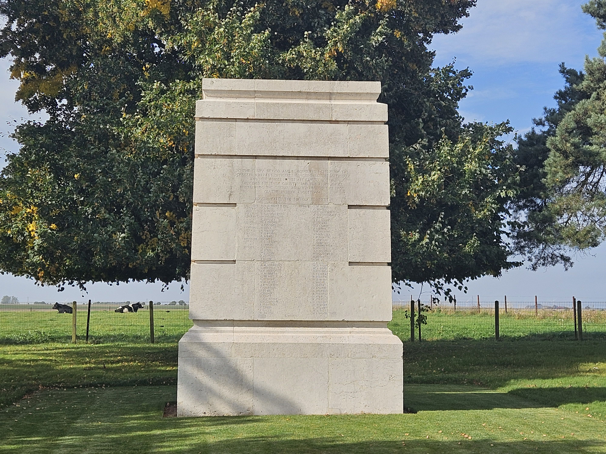

Of the 79 killed, only 6 have a known grave, the remainder are commemorated on the La Ferté-sous-Jouarre Memorial outside Paris.

**La Ferté-sous-Jouarre Memorial to the Missing of 1914 outside Paris.**

The remainder of the battalion was taken prisoner.

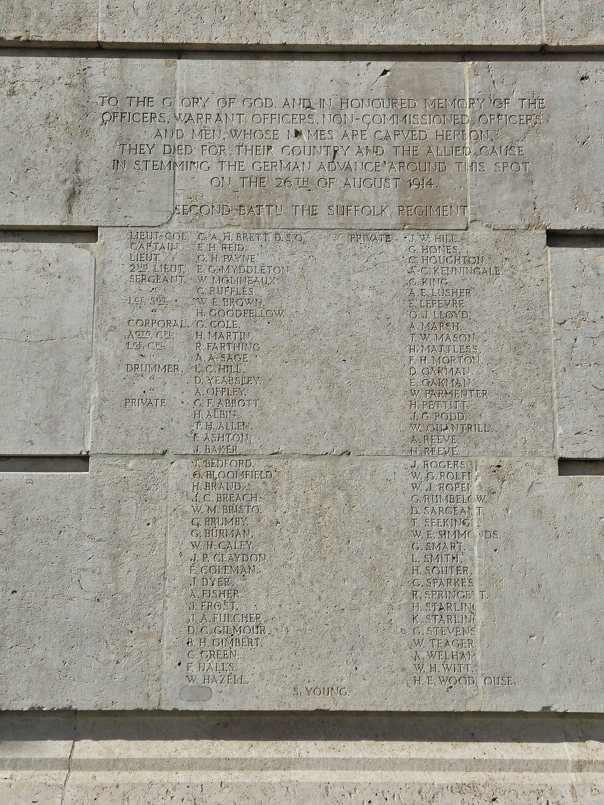

The Inscription for the Suffolks reads:

***To the glory of God and in the honoured memory of the***

***Officers, Warrant Officers, Non-Commissioned Officers***

***and men whose names are carved here on.***

***They died for their country and the Allied cause***

***in stemming the German Advance around this spot***

***on the 26th of August 1914.***

***Second Battalion the Suffolk Regiment.***

The close up shows the name of our relative, Lance Sargent Henry Goodfellow who died on 26 August 1914 at the age of 34.

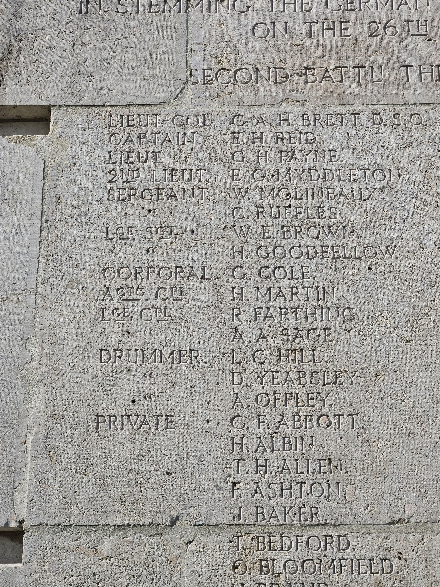

The 2nd Battalion Suffolk Regiment was basically wiped on 26 Aug 1914, and were temporarily attached to the 1st East Surrey Regiment. Their war lasted 11 days from their landing in Le Havre to their decimation at Le Cateau.

Another powerful moment, standing on the ground where the Suffolks made a heroic stand that saved the BEF. The site was so peaceful and quiet, but it was easy to imagine the last minutes of their battle when they were out of men and ammunition, and they were overrun. When I was in the military, we were fortunate to have a period of relative peace with the two Gulf Wars a minor blip on the record. I was very unconcerned about history at the time, it was only after researching family members that I began to appreciate the hardship and sacrifice of the individual soldier. Every soldier has a unique and usually tragic story and visiting the cemeteries, battlefields and memorials makes me appreciate their lives and actions.

* [First World War](https://www.paulsbattlefieldtours.com/blog/categories/first-world-war)
* [Family](https://www.paulsbattlefieldtours.com/blog/categories/family)