# Sergeant Norm Kightley - 8th Hussars

* [pd-allen](https://www.paulsbattlefieldtours.com/profile/pd-allen/profile)
* Apr 12, 2025
* 56 min read

Updated: Jun 29, 2025

Norm Kightley was my uncle on my mother’s side of the family. He and his wife Marj were frequent visitors to our family, and I knew him better than any other family member who served in the Second World War. Like most veterans, he seldom talked about the war except in humorous situations, see the War Stories below. In retrospect, I wish I had known more about his service and asked him about his experiences, but I didn’t become interested until much later. I think my battlefield studies are motivated by trying to get a glimpse into the lives of the soldiers and understand a bit of what they had gone through. It’s hard to imagine a 19-year kid going from driving a truck to 5 years in uniform, then back to their old life like nothing had happened.

I visited the 8th Hussars Museum in Sussex, NB some time ago and they were gracious enough to let me dig through their collection of photographs, many of which are shown below.

## Personal History

Norman H. Kightley was born in Sarnia Ontario on February 10, 1921, to Rodney George Kightley and Miriam Sopha Brown. He was their fifth child. The other children had all been born in England, prior to the start of World War I. In the 1911 England Census, Rodney was a worker on a farm, a Cowman.

When the war was over, the Kightley family decided to emigrate to Canada and on May 19, 1920, Rodney, Mariam and their four children boarded the Scandinavian, a ship on the Canadian Pacific Ocean Services with a destination of Quebec. The family arrived in Quebec on May 29, 1920.

By the June1921 Census, the family was living in Sarnia and Rodney was working as a farmer. While in Sarnia, Norman was born.

In 1925, the family moved to Songis Ontario, outside North Bay, taking advantage of Crown Land being made available to homesteaders. Norm often joked that the only thing their land in Songis was good for was growing rocks and turnips and sometimes it was hard to tell the difference between the two. Norm attended the one room school in Phelps Township. The school had 57 students teaching 9 grades but only one teacher. He completed Grade 8 and successfully wrote the High School Entrance Exam but did not go on to High School. At the school, he met the Johnston girls, Marjorie, Lillian Mae (Mick) and Muriel.

After Norm left school, he worked at a number of places, including Allen’s Lumber Mill and Basket Factory. At the time of his enlistment, he was a truck driver and worked in North Bay for William Milne and Sons. His experience as a truck driver led him to be posted to the Armoured division.

On 02 April 1941, while posted to Camp Borden, Norm married Marjorie Ada Mary Johnston, my mother's sister. She lived in Barrie and when Norm went over seas, Marge worked in a munitions factory.

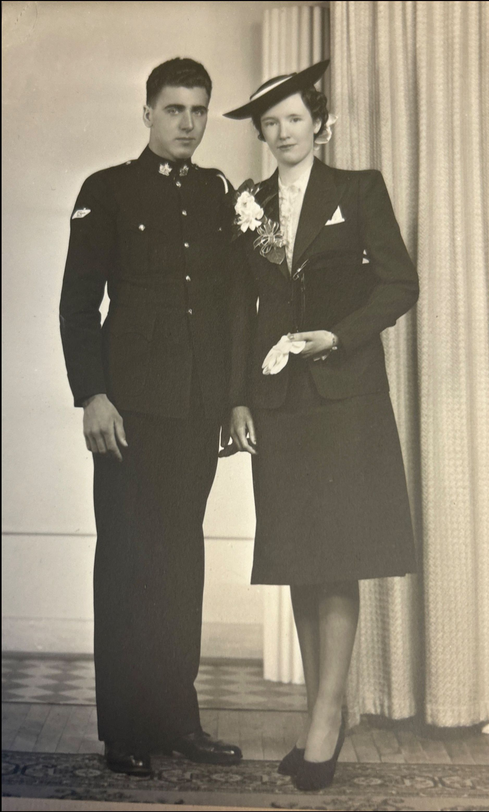

# Enlistment

Norm enlisted in the Armoured Corps at Camp Borden on 08 Jul 1940, at the age of 19.

His attestation papers were signed by LCol Frank Worthington, the father of the Canadian Armoured Corps. LCol Worthington served in WWI winning the Military Medal plus Bar. He remained in the Army, and established the Armoured Training Centre, first in London then in Camp Borden. In order to provide vehicles, Worthington purchased 265 Renault tanks built in 1917 by the US but never used. To circumvent the neutrality laws, he purchased the tanks as scrap metal and had them shipped to the non-existent Camp Borden foundry.

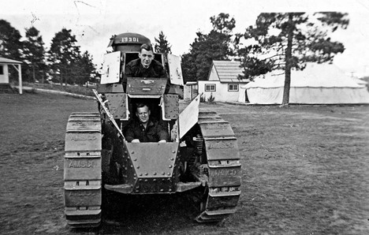

In October 1940, Norm Qualified as a Driver Class II (Wheeled vehicles) and was posted to the Ontario Tank Regiment in Camp Borden. In December 1940 he was posted to the Headquarters Squadron, 1st Canadian Armoured Regiment, and in Aug 1941 was qualified as a Driver In Charge, Class III. He was promoted to Acting Lance Cpl without Pay, on 07 Nov 1941, then departed for the UK on 10 Nov 1941, disembarking on 24 Nov 1941. In March 1942 Norm was promoted to Lance Corporal, then Corporal in January 1943.

# 8th Hussars

## Sussex, NB

The 8th Canadian Hussars (Princess Louise’s) is Canada’s oldest armoured regiment with its official history dating back to April 4, 1848. The Regiment has continuously served Canada since that date. Although originally established in communities along the Kennebecasis River, during the many years of its existence, the Regiment has expanded to many other communities such as Sackville, Moncton, Shediac, St. Martins and Petitcodiac.

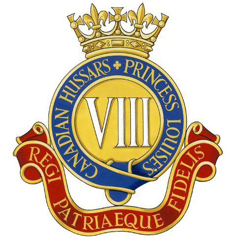

Hussars in New Brunswick were mostly farm and factory workers from the river valleys and fields and small towns in the southern half of the province.  For most of the Regiment’s history, beginning in 1848, they were part-time, or militia soldiers.  In the early days, they brought their own horses from the farm to train at Camp Sussex.  The men were paid more for the upkeep of their horses than they earned themselves.  In the 1930's, horses were exchanged for motorized vehicles and tanks. Although horses were no longer part of a modern army, the “Hussar” spirit remained.

In March 1941, the unit was sent to Camp Borden, Ontario where they were converted to an armoured regiment. The 8th Hussars’ entry into the elite company of “black hat” veterans of the North African desert campaigns coincided with orders to head overseas. In late August 1941, the regiment boarded trains for Debert, Nova Scotia. After a short embarkation leave, the men assembled at the end of September and made their way to Halifax, where they boarded the converted passenger liner Monarch of Bermuda. On October 9, the regiment set sail with the rest of their division.

## England

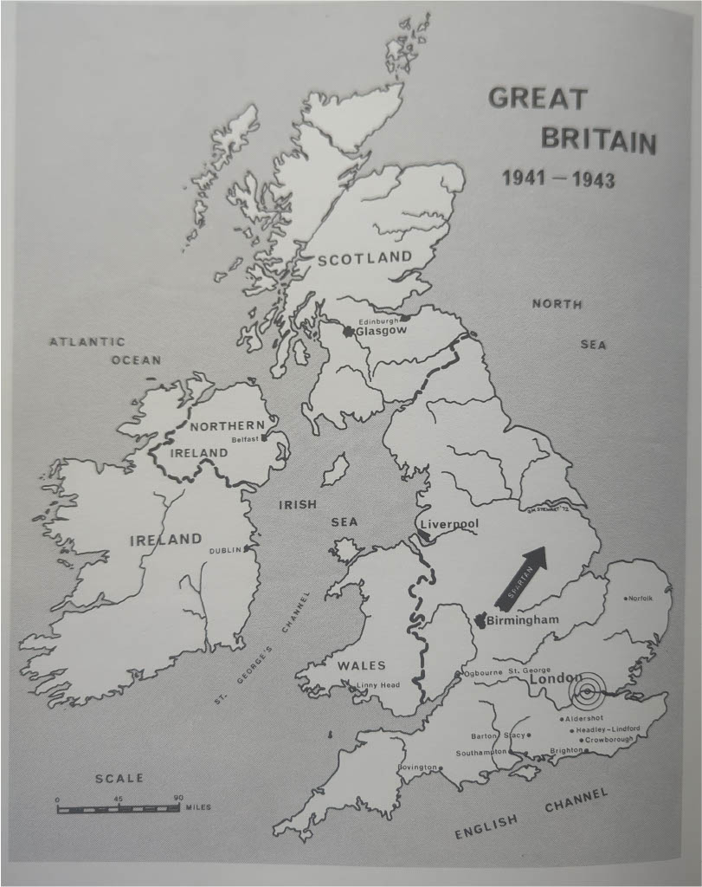

The 8th Hussars on board was a collection of partially trained soldiers bonded by regimental spirit and an armoured regiment in name only. They unloaded at Liverpool on October 20, ready for the next step in their transformation into a trained and battle-ready unit. The next two years in England were spent at a number of locations, all south of London. Their first home-away-from home was Ogbourne St. George, near Marlborough, in Wiltshire. Here they combined individual skills as drivers, gunners, wireless operators, and commanders to make tank crews that moved and fought as one.

In January 1942, the Regiment moved to Headley-Lindford in Hampshire, near the large British Army training centre at Aldershot. They continued to receive Ram Tanks and moved to Aldershot in April 1942. The regiment moved again in August to Crowborough, Sussex., then off to Brighton in the fall. The seaside resort town was a great favourite of the troops. After Christmas, they moved back to Crowborough. Throughout this period, the officers and men were off on a myriad of courses and spent time training and developing tactics to operate from the section level to full Division manoeuvres.

In early 1943, the Hussars were assigned to the 5th Canadian Armoured Brigade in the 5th Canadian Armoured Division.

The organization was as follows:

**5th Canadian Armoured Division**

**5th Canadian Armoured Brigade**

·         2nd Armoured Regiment (Lord Strathcona's Horse (Royal Canadians))

·         5th Armoured Regiment (8th Princess Louise's (New Brunswick) Hussars)

·         9th Armoured Regiment (The British Columbia Dragoons)

**11th Canadian Infantry Brigade**

·         11th Independent Machine Gun Company (The Princess Louise Fusiliers)

·         1st Battalion, The Perth Regiment

·         1st Battalion, The Cape Breton Highlanders

·         1st Battalion, The Irish Regiment of Canada

·         11th Infantry Brigade Ground Defence Platoon (Lorne Scots)

**12th Canadian Infantry Brigade (raised in August 1944)**

·         12th Independent Machine Gun Company (The Princess Louise Fusiliers)

·         1st Battalion, The Westminster Regiment (Motor)

·         4th Princess Louise Dragoon Guards (from 1st Canadian Infantry Division)

·         The Lanark and Renfrew Scottish Regiment (from Corps anti-aircraft assets)

·         3rd Armoured Reconnaissance Regiment (The Governor General's Horse Guards)

·         12th Infantry Brigade Ground Defence Platoon (Lorne Scots)

The Hussars began receiving Sherman tanks in 1943 and after a number of exercises and training, returned to Liverpool for overseas deployment. An 8th Hussars tank heading to the Gothic Line, Italy.

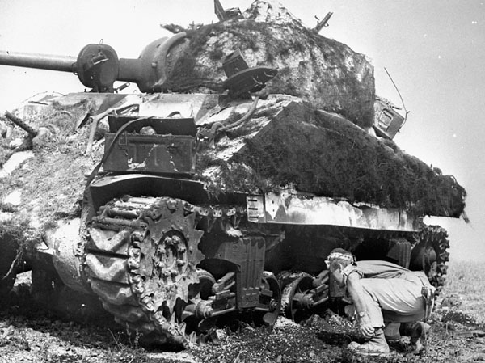

The Sherman tank had a crew of 5: Driver, Co-Driver (Machine Gunner), Gunner, Loader and Crew Commander.

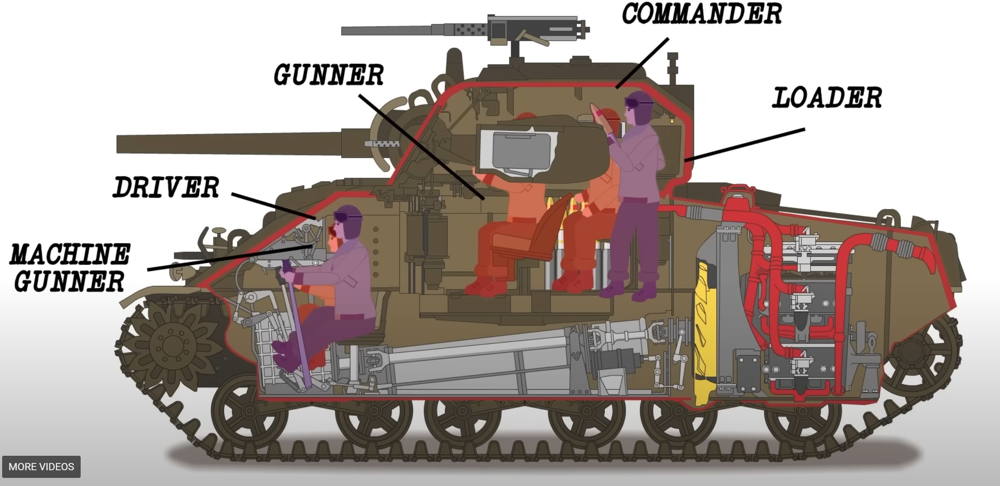

Top View of the Sherman tank.

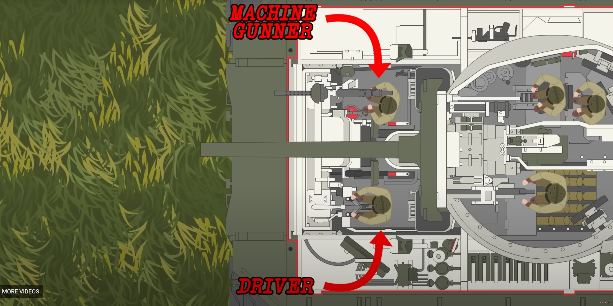

Most of the time, the Commander stood with his head out the hatch for situational awareness. This gave him improved visibility but made him much more vulnerable to enemy fire.

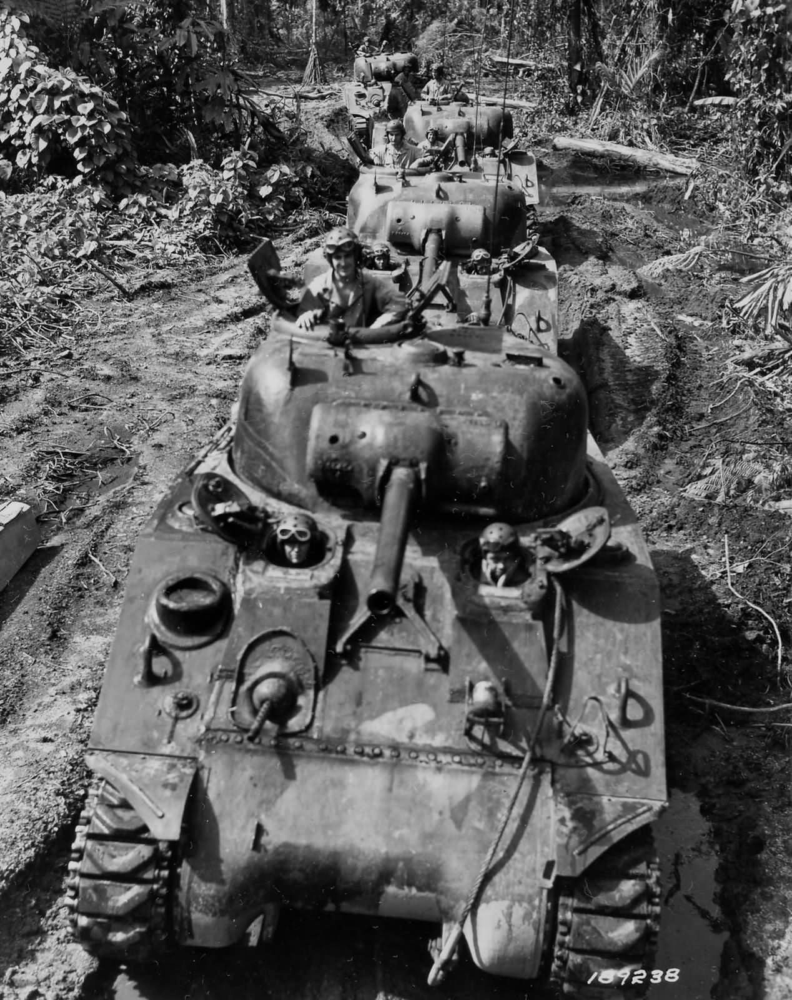

## Norm Joins the 8th Hussars

Norm had been promoted to Lance Corporal in March 1942 and Acting Corporal in September 1942 after qualifying as a Driver Mechanic Group C. The qualification meant he was able to drive tanks and provide routine maintenance with the limited tools available in the field.

Norm completed the Gunnery Instructors course in December 1942 and was confirmed as a Corporal in January 1943. On 18 February 1943, Norm was assigned to the 8th Hussars. He reverted in rank to Trooper at his own request after joining the Hussars, likely because the Hussars had been together as a New Brunswick unit since being called up to active service in July 1940. His leadership skills were quickly recognized and by August 1943 was reconfirmed as a Corporal.

On 14 November, they boarded HMS Samaria for an undisclosed location. They initially sailed north, but the issue of tropical clothing indicated they were headed south. They sailed through the Mediterranean, temporarily stopping in Algiers, North Africa, in late November while the advance party sailed to Naples to establish a camp at Matera in southern Italy.

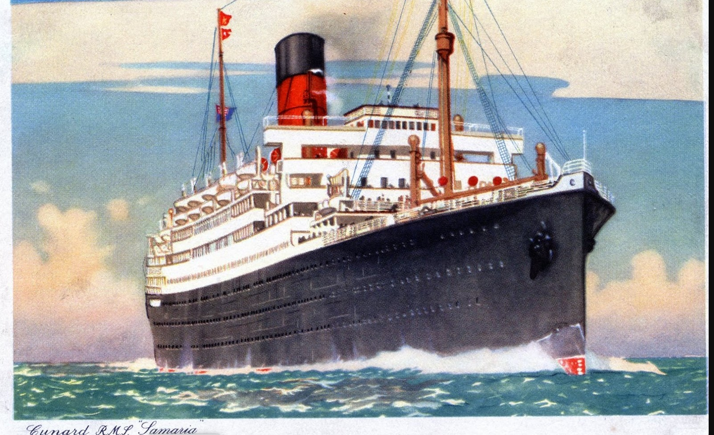

The remainder of the regiment spent a few weeks in Algiers, then sailed to Naples in mid December. After a few days in Naples, they sailed  to Bari, the main port for the British 8th Army to which the Canadian Division belonged. They had left their tanks in England, and the vehicles used by their predecessors were in sad shape, so the regiment waited 3 weeks for their new Sherman M4A4 tanks to be delivered. Bari had been bombed by the Germans in early December, so was operating at a fraction of its capacity while the Hussars waited for their tanks.

## Italy

The map shows the 8th Hussars progress through Italy for the entire campaign.

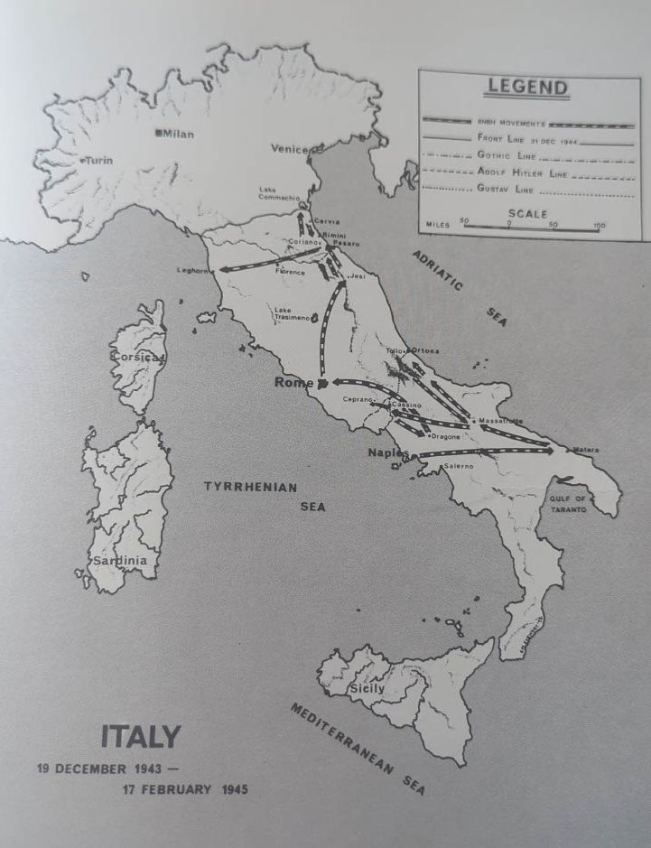

## Interactive Map 8th Hussars in Italy December 1943 - February 1945

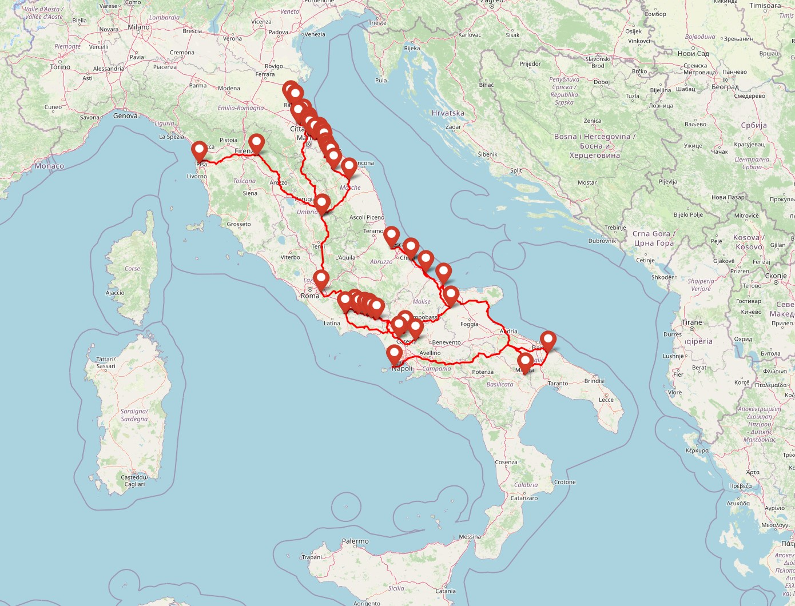

The map shows the 8th Hussars in action in Italy. Clicking on the [Interactive Map](https://pd-allen.github.io/docs/8th%20Hussars.html) opens the route in a new browser window. Hovering the mouse over the marker shows the date and place and clicking on the marker provides details of the daily action.

By mid January, they received their new tanks and by end January 1944 the 8th Hussars were on their way north to join the battle just south of Ortona.

The battle of Ortona was over, so after a few weeks in place, the Hussars withdrew for more training. They concentrated on all arms training with the Infantry and Artillery. The Hussars were teamed with the Cape Breton Highlanders and an artillery battery from the 8th Field Regiment. They also practiced amphibious landings as a deception to indicate another water bound assault further up the country.

## First Shots

The 8th Hussars first shots fired in anger were 720 rounds of 75mm high explosive, spit fast from the muzzles of forty-eight tank guns lined hull to hull, crashing down furiously around German positions at the Tollo Crossroads in less than two minutes.

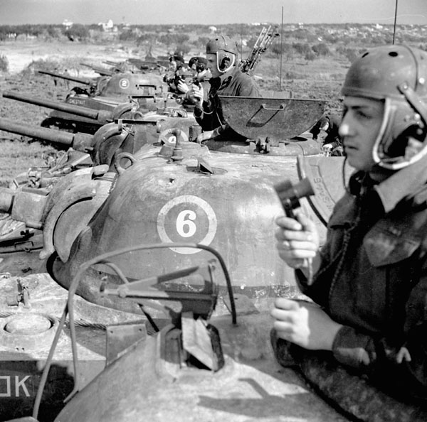

## Gustav Line

The purpose of the Gustav Line was to keep the Allies busy and prevent them from refocusing their efforts on the eastern and northern fronts by using the narrowest part of the Italian peninsula and the natural impediments provided by the Apennine Mountains.

Germans had built up defences in depth. They had long blown all bridges across the Rapido/Gari Rivers, heavily mined the crossings and all roads and built extensive bunkers and gun positions in the hills to rain down artillery fire on the enemy. 100 steel shelters were buried in the ground — effectively providing a steel inner lining for large dugouts. These positions were virtually impervious to artillery fire and could each protect about a dozen men. Seventy-six armoured pillboxes, weighing three tons apiece, were also dug into the ground.  Steel cylindrical cells, the pillboxes were seven feet deep and six feet in diameter. Only the top thirty inches, constructed of five-inch-thick armour, protruded out of the ground with a gun slit cut into the side facing the line of the enemy advance. This pillbox is worse for wear and tear but provides an indication of the difficulty of taking out the structure.

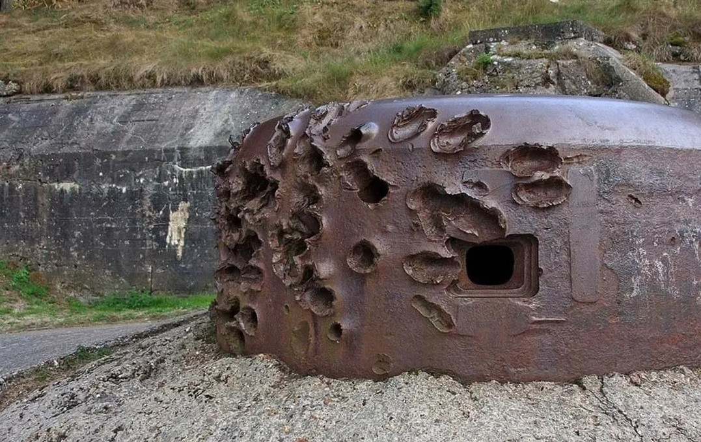

Nothing short of a direct artillery hit could harm this fortification. All along the line, a vast system of concrete pillboxes was constructed. Many contained sleeping quarters for twenty to thirty men, while others were only big enough to protect a single soldier manning a light machine gun. The large pillboxes were interconnected by underground tunnels and linked directly to an open system of firing trenches, which the infantry would be able to man once the Allied artillery ceased firing. Existing buildings were tied into the defensive line. Many farmhouses and buildings in villages had inner shelters built at ground level to provide protection from artillery fire.

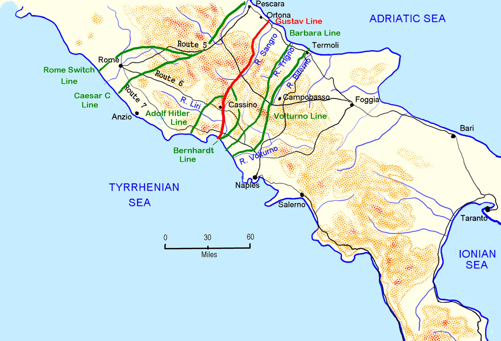

The rivers were treated as anti-Tank ditches. The Allies were forced to send infantry across the rivers first to establish a bridgehead, then the engineers would build bridges under fire to allow the tanks to cross. A description of the Kingsmill Bridge is given below. The Germans liked to take turrets off their Panzer Tanks and build bunkers underneath for the crew and their armaments. These emplacements were very difficult to take out with artillery and wreaked havoc on the troops and tanks. During the battle for the Hitler Line these emplacements were particularly effective. The German gunners held their fire until the tanks were less than 100 yards away and one Panzer turret is said to have accounted for 13 tanks before an armour-piercing shell struck its magazine.

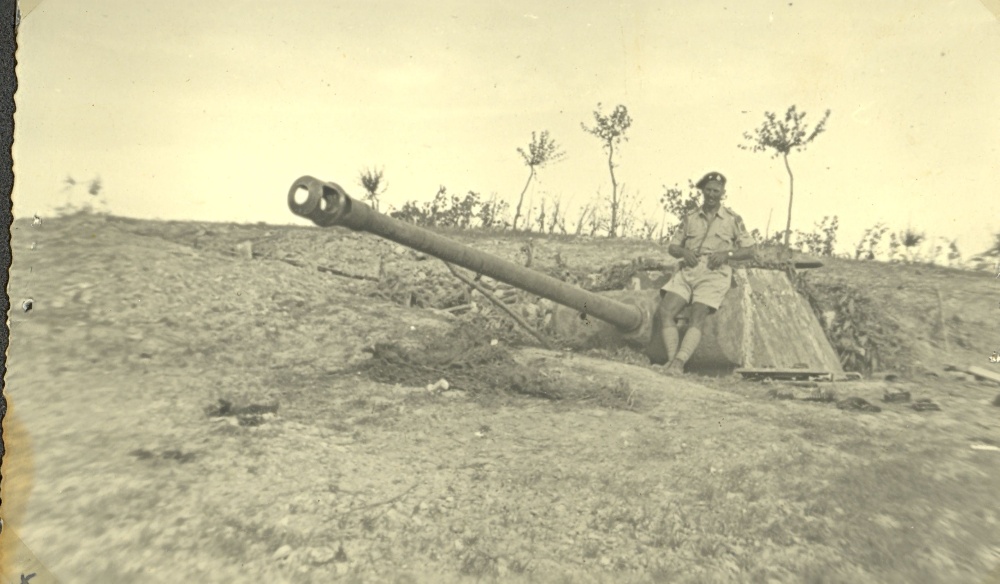

## Battles of Monte Cassino

The first attempt was in late January 1944 when General Mark Clark ordered a ‘diversionary’ attack across the Gari River which resulted in a slaughter of American G.I.s on a scale never witnessed before. 4,000 Texans tried to cross the heavily mined and fortified river – less than half returned. To make matters worse, the corpses of many of the dead lay entangled in barbed wire on the edge of the river and were unretrieved months later when renewed efforts to cross began.

The Allies suspected the Germans were using the Benedictine Abbey at Monte Cassino as a fortified position and observation post. On 15 February 1944, the Allies bombed the Abbey, completely destroying the structure. No Germans were injured but 115 refugees were killed. There had been an Abbey at this location since 529AD and its destruction remains one of the most debated decisions of the war. The destruction actually hurt the Allies as the Germans fortified the site and hid in the rubble. Indian and New Zealand troops attempted to take Monte Cassino but suffered very heavy casualties and were turned back by rugged terrain and a stiff defence by German paratroopers.

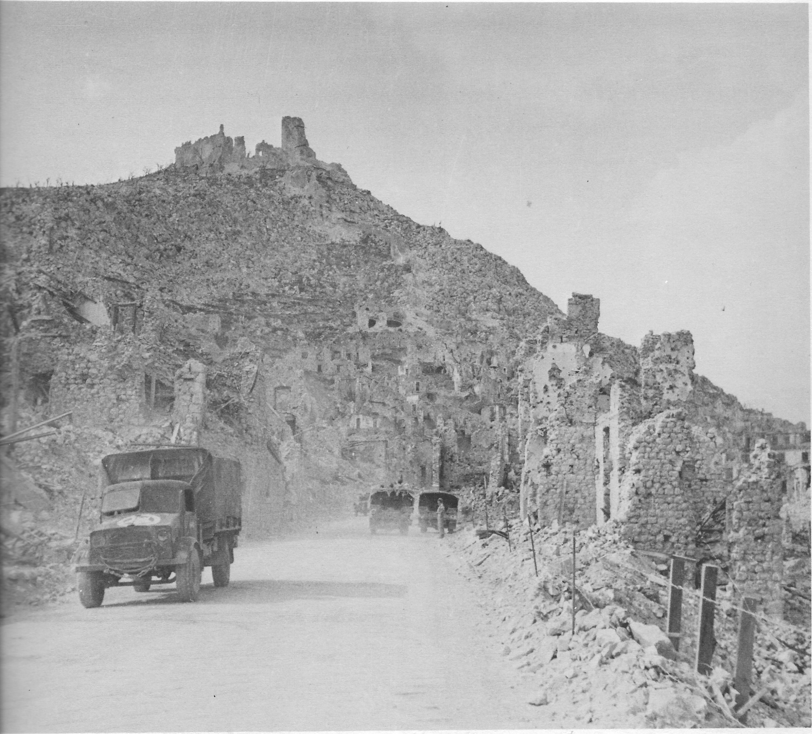

On 15 March, the Allies launched a massive bombing and artillery campaign that leveled the town of Cassino. Allied troops led by the New Zealanders, supported by the British and Indians once again attempted a breakthrough. After a week of brutal street-fighting with massive casualties, the attack was called off.

In late April, the 8th Hussars moved up under cover to prepare for the 4th Battle of Cassino. British, Indian, Canadian, Polish, French, Moroccan, Algerian, and American troops would open the largest offensive so far mounted in the Second World War by the Western Allies — the fourth, and last, Battle of Cassino.

Ten divisions were to swarm German units manning a thirty-kilometre stretch of the Gustav Line from the Tyrrhenian coast all the way to the smashed ruins of the Abbey of Monte Cassino. The assault of the Gustav Line was made by the British, French, Polish and American Corps. The Canadian Corps was held in reserve to attack the Hitler Line once the Gustav was finally taken.

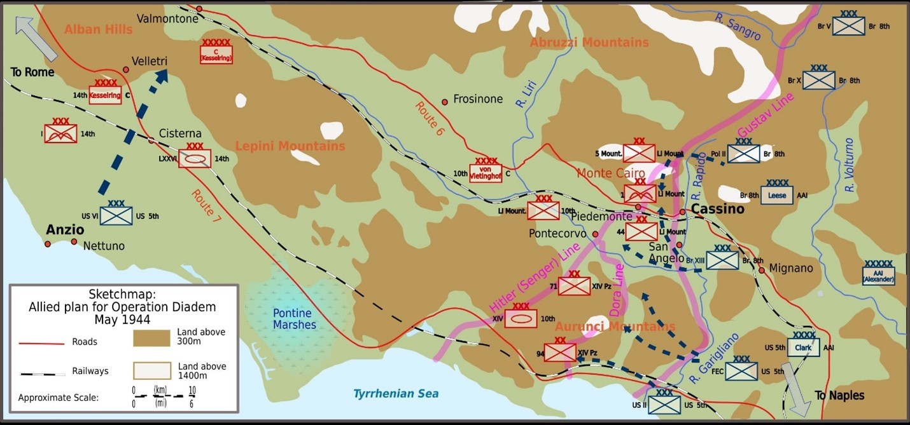

The 4th British and 8th Indian Divisions, supported by the 1st Canadian Armoured Brigade led the assault across the Gari River. The Canadians were assigned to the British Corps because MGen Chris Vokes despised Gen Wyman the 1st CAB commander and vowed never to work with him again. Wyman left Italy in preparation for D-Day, but the Brits were so impressed with the Canadians that they were not allowed to rejoin the Canadian Corps. LGen Leese, Commander of XXX Corps, said the Canadians were the best Armoured Brigade in Italy and he hung on to them.

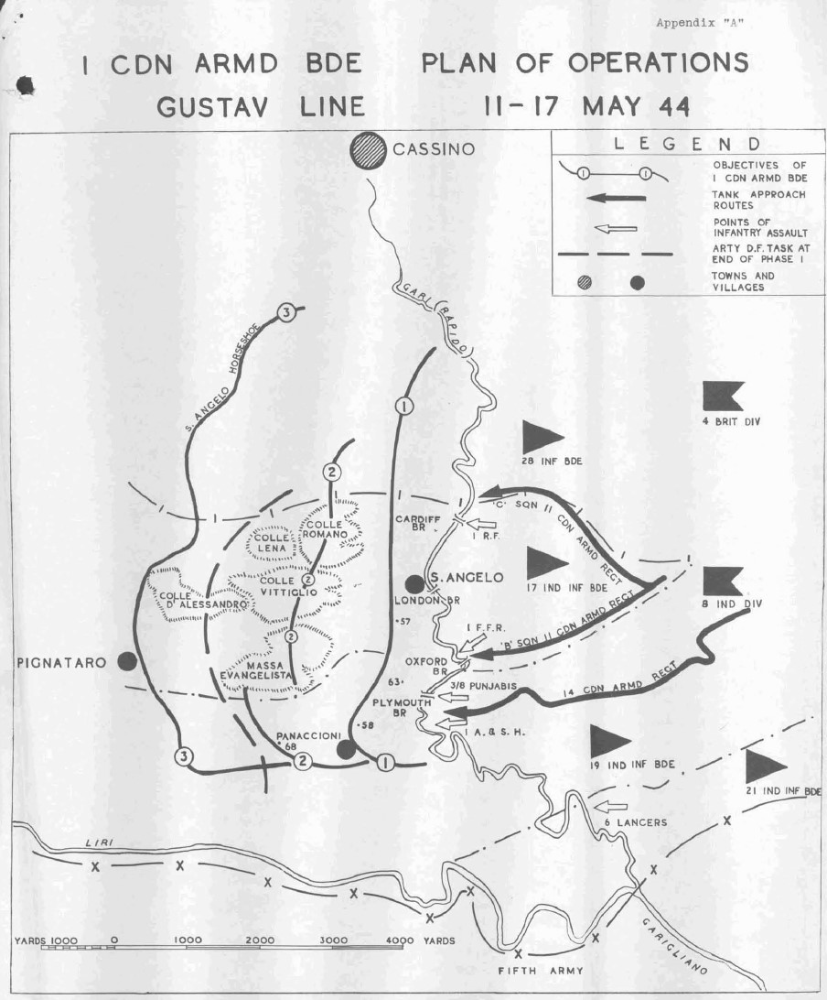

After inflicting as much damage as possible, the Germans fell back to the Hitler line. Before being ultimately broken, the Gustav Line effectively slowed the Allied advance for months between December 1943 and June 1944. Major battles in the assault on the Winter Line at Monte Cassino and Anzio alone resulted in 98,000 Allied casualties and 60,000 Axis casualties.

This part of the Gustav Line was one of the few battlefields of the Second World War to remain static for five months of intense combat. No building or tree remained standing, and the wreckage of earlier battles littered the ground. Hunter Dunn of Headquarters Troop remembers “the total devastation caused by shell fire and the stench of dead animals and humans. One never completely forgets the smell of the battlefield.”

### Liberating the Civilians

The Italian civilians were very happy to be liberated by Canadians. The Canadians shared their rations with the Italians, and the Italians plied them with wine.

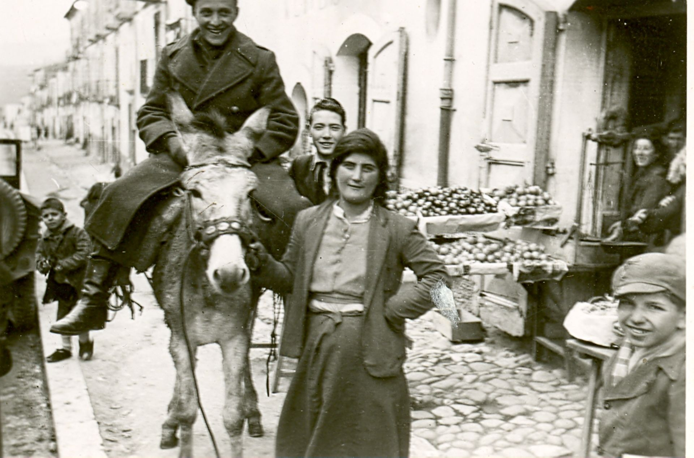

The Children flocked around the Canadians in hopes of getting Chocolate and treats.

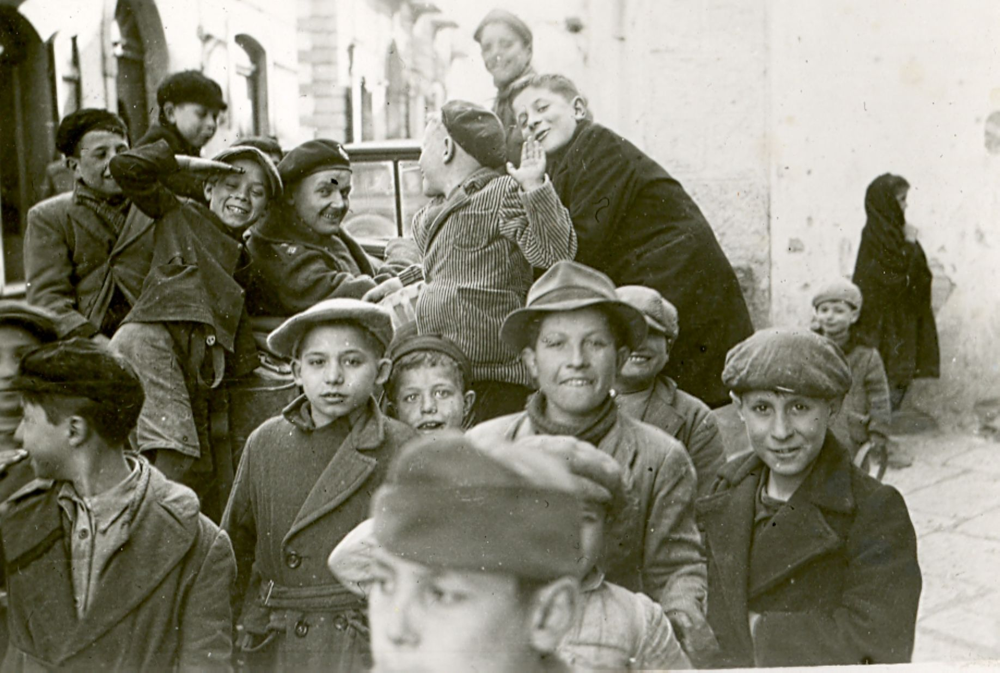

### Kingsmill Bridge

The first obstacle of the Gustav Line was the Gari River. The river was about 80 feet across and 8 feet deep. The infantry could paddle across the river in rubber boats but without tank support the highly defended bridgehead would quickly be defeated. The idea started as a joke “why don’t we just build a bridge and push it across the river”. Capt Tony Kingsmill of the Royal Canadian Electrical and Mechanical Engineers, attached to the Calgary Regiment of the 1st Armoured Brigade ran with the idea and concocted a plan to get a bailey bridge across the Gari River by having it carried atop a turretless Sherman tank which would plunge into the river and then have another tank push the bridge across from behind. This diagram shows how this simple plan allowed some of the first allied tanks to get across the Gari River and infantry to follow.

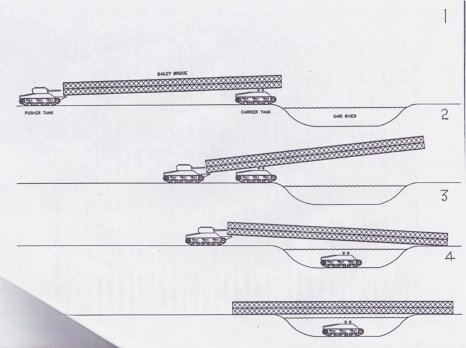

Since the area was less than 300 yards from the enemy front line and in full view of Monte Cassino it was impossible to build a Bailey Bridge on site in sections. The Calgary regiment was attached to the 8th Indian Division, so the Royal Sikh built the Bailey Bridge and supported the deployment. The Carrier tank had its turret removed and a span on top of four rollers mounted on a twelve-foot wide “I” beam bolted to the turret ring of the tank. A second tank was used as a pusher tank bolted to the span to help support and steer the span into position.

They started the procession at 2300, but due to soggy ground and heavy fog didn’t get to the river’s edge until daylight and heavy smoke was used to mask their work. The pusher tank pushed the bridge forward until it was over the opposite bank of the river. The carrier tank was again in danger of becoming bogged down in the mud when Kingsmill told the driver of the carrier tank to “step on it.” The tank lunged forward into the river and the bridge fell into place. Explosive bolts separated the Pusher tank from the bridge. Kingsmill and the tank crew swam to safety. Capt Kingsmill was injured by shrapnel and was awarded the Military Cross for his efforts. A number of Calgary Regiment tanks crossed the bridge and were essential to holding the bridgehead that was the first crack in the Gustav Line.

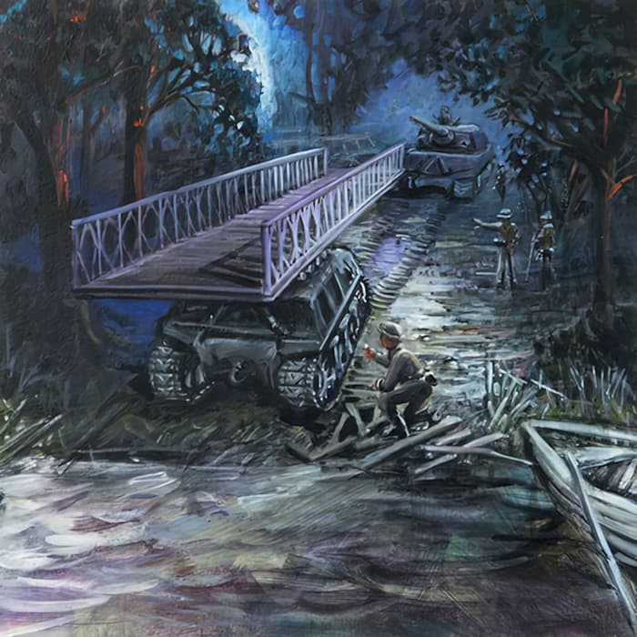

A painting celebrating the bridge laying. This is one of the fascinating sidebars that crop up during military research. One in the long line of great stories of ingenuity and perseverance where Engineers once again save the day. The idea of tank-launched bridges inspired further developments in mobile bridging equipment, enhancing the capabilities of armed forces to navigate challenging terrains.

It was standard practice for the retreating German soldiers to blow all bridges and culverts, so Allied engineers constructed over 3,000 Bailey bridges in Italy and Sicily, covering a total length of more than 55 miles. These bridges varied in length, with some spanning significant distances, such as the 1,126-foot bridge over the Sangro River.

## Hitler Line

The Assault on the Hitler Line was carried out by the 1st Canadian Division. The attack began at 0600 23 May, with a massive artillery barrage, including smoke to mask the Infantry positions, from 682 field guns. The barrage was lifted after 5 minutes and progressed in further 100 yard lifts every three minutes, a creeping barrage reminiscent of World War One.

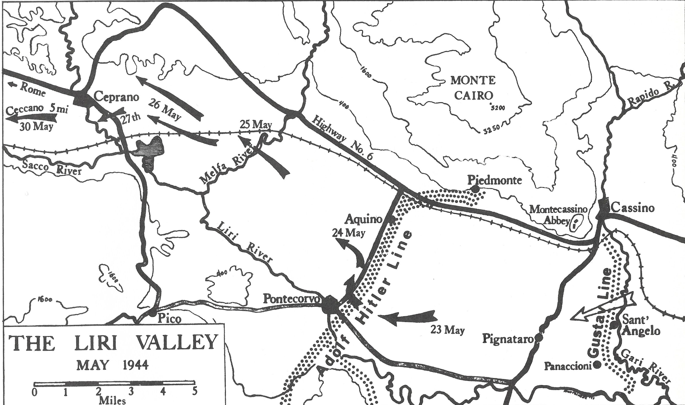

At the north of the Battlefield, The Princess Patricia’s Canadian Light Infantry (PPCLI) and the Seaforth Highlanders of the 2nd Canadian Infantry Brigade (CIB) suffered heavy casualties from machine gun and mortar fire from Aquino, sniper fire and anti-personnel mines. Casualties totaled 543 soldiers, with 162 killed, 306 wounded and 75 taken prisoner, the worst one-day loss of any Brigade in Italy. The tanks did not fare much better, repeatedly being held up by extensive mine fields and deadly fire from the anti-tank guns. More than 40 of the 58 tanks supporting 2nd Brigade were lost in the battle.

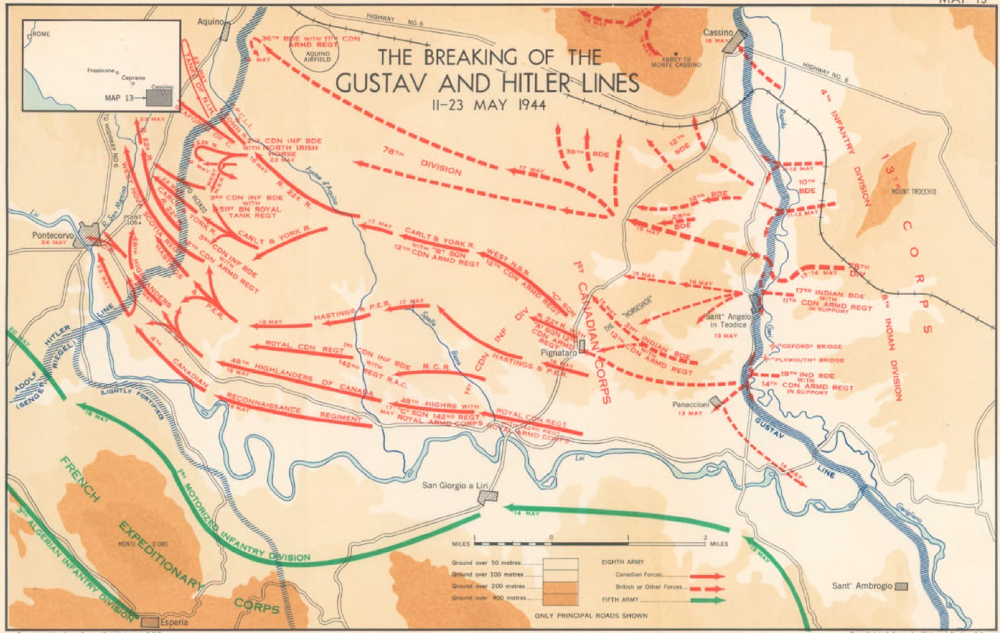

In the centre of the assault, the New Brunswick Carleton and York Regiment along with the West Nova Scotia Regiment of 3rd CIB did much better, overcoming barbed wire, minefields and heavy machinegun fire to launch a ferocious attack. German troops were being cut-off and surrendering in bunches. The Carletons had smashed the Hitler Line and progressed a mile past it. The West Nova Scotians passed through them and faced repeated counterattacks. Effective artillery fire was key to breaking up the attacks.

On the left flank, the 48th Highlanders from the 1st CIB opened the assault and suffered many casualties. The Hastings and Prince Edward Regiment (HastyPs) pressed the attack and in an outstanding display of initiative and courage, stormed forward, capturing Pontecorvo and taking Point 106 the high ground that overlooked the town, destroying many enemy and taking numerous prisoners. The HastyPs took 300 prisoners at the cost of only 30 casualties.

By the end of the Day, the 1st Canadian Infantry Brigade enter Pontecorvo, and the Germans were in full retreat, racing towards the next strong point, the Melfa River. The Canadians suffered 54 officer and 902 Other Rank Casualties, more than half from the 2nd CIB.

The 8th Hussars on the move up the Liri Valley to press the attack after the Hitler Line was taken.

First Canadian Infantry Division had paid a high price to break the Hitler Line. After the one-day fight, 47 officers and 832 other ranks were dead or wounded, more than half from 2 CIB. In addition, 7 officers and 70 men from other Canadian units were casualties.

### 8th Hussars in Action

Description of the battle taken from Steel Cavalry – Lee Windsor

The 5th Armoured Division was in reserve ready to exploit any breakthrough the Hitler Line. On 24 May as the Hussars advanced across the Hitler line, word was received that the 1st German Parachute Division were withdrawing to the Melfa River. The Hussars pushed forward to cut off the retreating Germans. While the Westministers and Strathcona Tanks were fighting to hold their bridgehead across the Melfa river, the Hussars were engaging the retreating German soldiers and preventing them from reforming to defend at the Melfa river. This was the first full scale action for the Hussars, and they lost several soldiers in isolated skirmishes with the enemy. German wreckage after the taking of the Hitler Line.

### Tank Battles from Cassino The Hollow Victory

*Yet the tanks behind came on. An infantry officer spoke of their crews in awed amazement: “I’ll never forget the way the tanks would keep coming and one would get knocked out and then another and still they’d keep coming.” They did so because they were brave men. But this should not lead us to ignore a rather unpalatable truth concerning the Allies’ handling of armour in this battle, or indeed during the whole Italian and North-West European campaigns. Allied tanks were under-gunned and under-armoured throughout most of the war. The sudden emphasis on so-called ‘Cruiser’ tanks to fight in the desert, and the subsequent tyranny of standardized mass-production, meant that the designers never had the chance to respond quickly to German innovations – be they increasingly powerful tanks, long-range anti-tank guns or one-man bazookas. So Allied generals had to rely on sheer weight of numbers to overwhelm the Germans and, no matter what the cost to the crews, be prepared to decide the issue in a crude war of attrition. This philosophy, if such a marked lack of finesse merits the title, was made quite explicit by the commanders themselves.*

*Of the Melfa Battles a staff officer in 5 Canadian Armoured Brigade wrote:*

*As for the main obstacle of the German tanks … the only reason why it was possible to make headway against their qualitative superiority was by the weight of numbers. General Leese [has been cited] as saying that in his offensive he was prepared to lose 1000 tanks. As he had 1900 at his disposal, the Panther stood a fair chance of becoming an extinct species among the fauna of Southern Italy. On our side losses had to be taken and replacements thrown in. Being somewhat up against it, the tankmen were compelled to improvise and make the most of what they had.*

*The tankmen were under no allusions as to the way in which they were employed. Of the fighting on the 25th, Lieutenant Hockin wrote: “I think we all grew up a lot that day. We discovered that if necessary higher command would throw in a squadron of tanks to stop a counterattack, regardless of consequences. The Y Camp days of soldiering were gone, the grim reality that we could get hurt took over.*

## Crossing the Melfa River

On 24 May, a small group of the reconnaissance troop of the Lord Strathcona’s Horse Regiment, led by Lt Perkins, crossed the Melfa river, carved a path up the steep bank and dug in to wait for reinforcements from the Strathcona Tanks and the Mechanized Westminster regiment. Maj Mahony of the Westministers couldn’t get his armoured cars across the river so his company crossed the river on foot.

At the same time, in what was their first baptism of fire, the Strathcona tanks engaged in the largest tank battle the Canadians had fought. In less than 90 minutes, they lost 17 tanks, but had captured or destroyed 7 Panther Tanks, 4 Mark IV tanks, 9 self-propelled guns, 5 antitank guns, 5 Nebelwerfers (multi-barrel Rocket launchers), 4 anti-aircraft guns, 21 vehicles and 3 motorcycles.

Mahony was everywhere, encouraging the troops, rescuing wounded soldiers, directing fire and holding off repeated counter attacks. Despite being wounded multiple times, Mahony effectively led his troops, finally receiving reinforcements after midnight. Lt Perkins was awarded the Distinguished Service Order (very rare for a Lieutenant) and Major Mahony received the Victoria Cross.

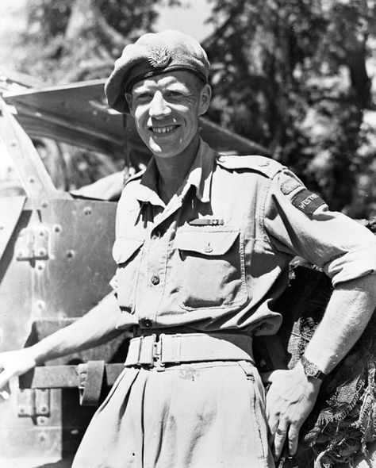

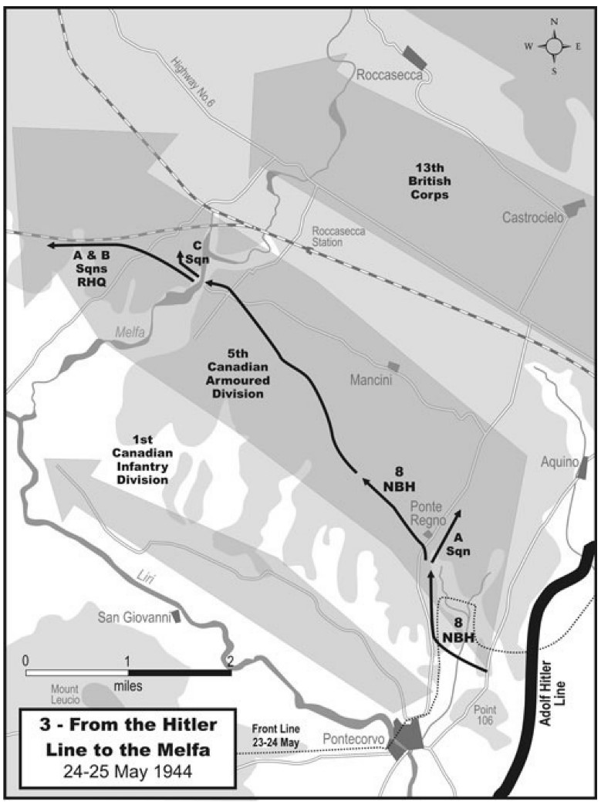

The next morning the Hussars were to meet up with the Cape Breton Highlanders to press the attack across the Melfa River but traffic, mine fields and sporadic German shelling slowed their progress. It was late afternoon when the tanks finally crossed the river behind the infantry. Two hundred metres further on, a line of German anti-tank, machine gun, sniper and mortar fire opened up on the Hussars. The lead tanks were hit, as described by Trooper Lowell Langin of Newcastle Bridge, New Brunswick.

*He was the radio operator/gun loader inside the turret of one that started to burn. His troop officer was fighting the tank from the open crew-commander’s hatch when a German shell struck them. “He was the natural one to go, but the gunner and I were trying to be the first one out, too. There were the three of us scrambling around, all trying to get out the top hatch at the same. There just wasn’t room. We jammed up. All the time the damn tank was burning like blazes. We came back and rared again and got stuck again, so I figured to myself that someone had to wait or we’d all burn. I lay on top of the gun until they got out. I got my hair singed for all my trouble, but we escaped.”*

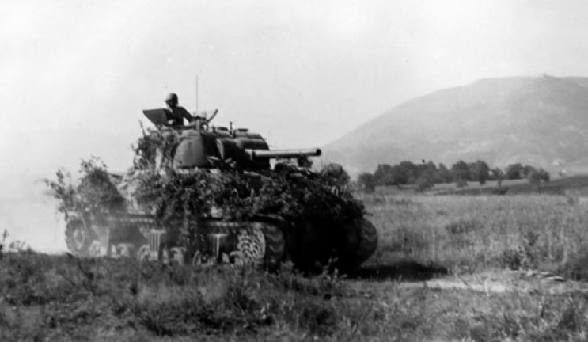

On 26 May just after starting off, the Hussars were harassed by machine gun fire. The machine gun nests were quickly blasted away, but the gullies were heavily mined, and all of the culverts destroyed by the retreating Germans, so the infantry went on while the mines were cleared and the tanks towed each other across the streams.

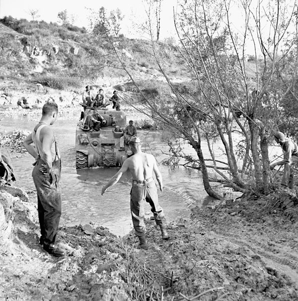

Near the railway embankment, where the Germans made a determined stand, artillery, and tank fire quickly eliminated the threat. The Allied policy was to use maximum force whenever the enemy took a stand, otherwise the Allies would have to face the same troops at the next river crossing.

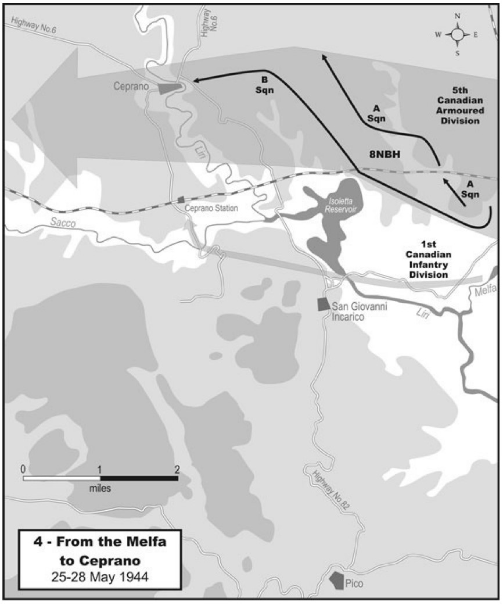

The Hussars advance slowly with the Cape Breton Highlanders as the Germans had blown every culvert and bridge, heavily mined the routes and made good use of snipers to slow progress. By late afternoon, the Hussars reached Point 130 overlooking Ceprano on the Liri River and met their first Panther Mark V tank. The Panther had a much more powerful gun than the Sherman and took out one tank at over 1000 yards. The Sherman returned fire despite having no chance to penetrate the Panther Armour at that range. The Shell deflected off the Panther gun cover and bounced into the Driver’s hatch, an extremely fortuitous shot that destroyed the tank.

Knocked out Panther Tank being inspected after the battle.

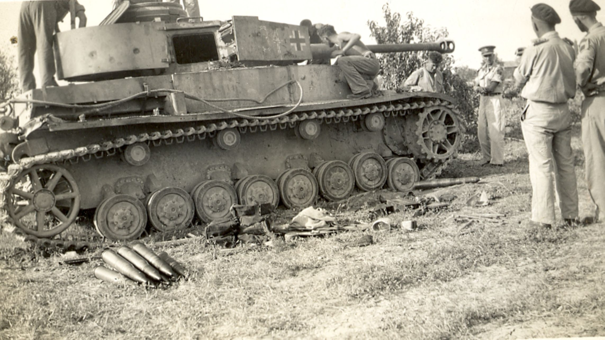

The Canadians overlooked the roads into Ceprano, but the Germans had the higher ground north of the town and shelled the Hussars. The infantry assaulted Ceprano, but the tanks could not cross the Liri River without a bridge, so were out of the action. The Germans continued to withdraw so the town was taken at a relatively low cost. During the shelling, the troops were out of their tanks and 5 were killed. They are buried at the Cassino CWGC Cemetery. In their first real action, the Hussars destroyed or captured eleven German anti-tank guns, two self-propelled guns, a half-dozen gun tractors, a 105mm field artillery piece, innumerable machine guns, and Jimmy Jones’s Panther tank. They killed or captured over a hundred German soldiers at the cost of 10 dead and 24 wounded.

In the aftermath of its first mobile armoured battle, 5th Division and the 8th New Brunswick Hussars could feel proud of their actions. The Germans, shocked that the Hitler Line defenders had been destroyed so quickly, made desperate efforts to feed more men and heavy weapons into the grinding battle to hold the Melfa River, and in so doing played into the Allies’ hands. Intercepted German signal traffic revealed that their Melfa blocking force was “completely destroyed.”

## Rest Period

The Canadians were pulled out of the line for rest and reorganization and spent June and July training near Dragone and taking leave on the beaches of Italy and the streets of Rome in preparation for the assault on the Gothic Line, the German’s strongest and last defensive line. Village near Amalfi.

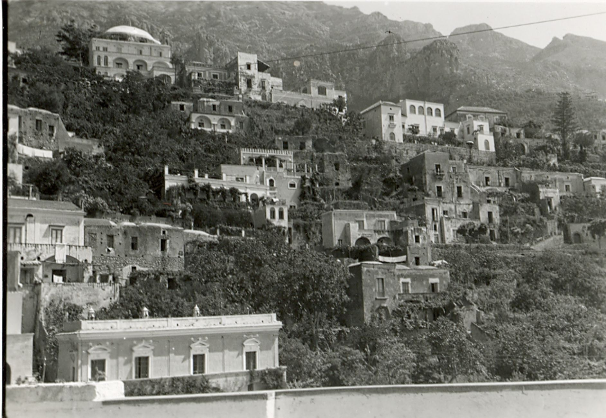

The troops also got extended leave in Rome.

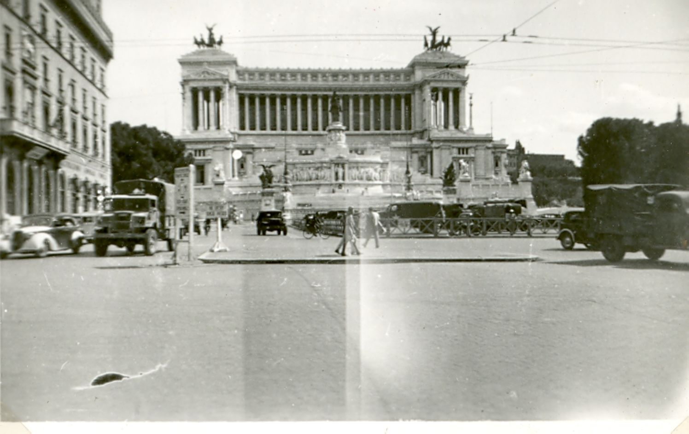

Officers visiting the coliseum.

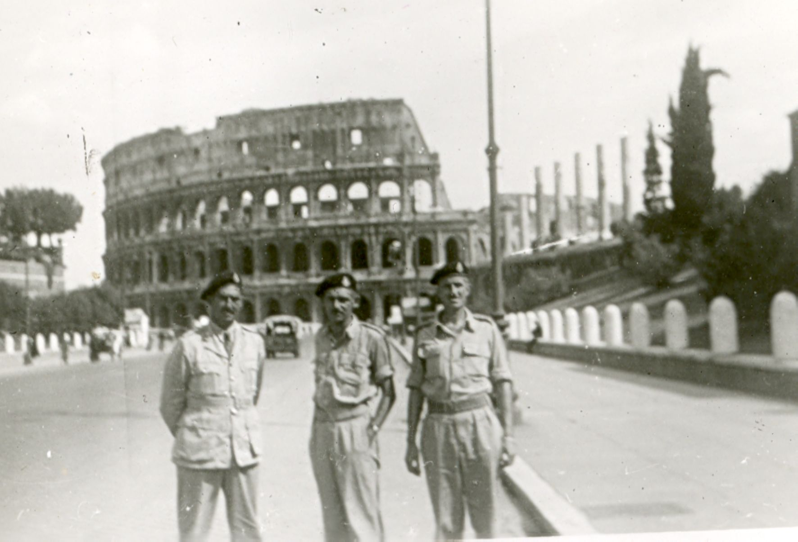

## Gothic Line

After an extended rest period, the Hussars moved first to Foligno south of Lake Trasimeno then to Ancona where the Canadian Corps was assembling for the attack on the Gothic Line. The 1st Canadian Division opened the attack at midnight on 26 August and had pushed through 3 German Divisions in 72 hours to reach the Gothic Line. Norm was promoted to Acting Sergeant on 12 August 1944 and served as a tank commander in B Squadron for the remainder of the war.

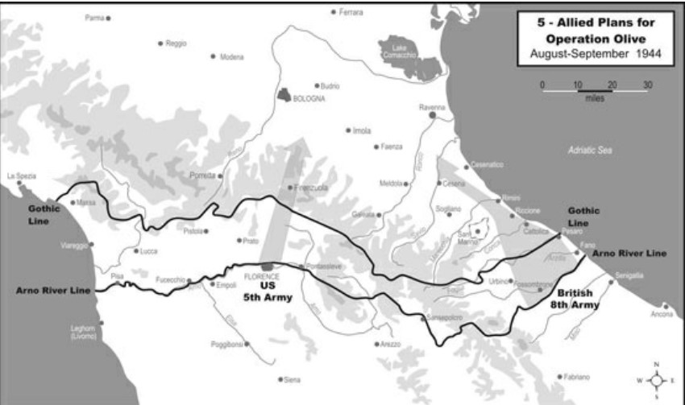

## Gothic Line Defences

The Gothic Line was one of the most formidable defensive lines of World War II, using both natural terrain and heavy fortifications to resist the Allied advance. Most impressive were the figures for the minor types of installations-2375 machine-gun posts, 479 antitank gun, mortar and assault-gun positions, 3604 dug-outs and shelters of various kinds (including 27 caves), 16,006 riflemen's positions (of trees and branches), 72,517 "T" Teller, anti-tank) mines and 23,172 "S" anti-personnel mines laid, 117,370 metres of wire obstacles, and 8944 metres of anti-tank ditch. Only four Panther turrets however had been completed (with 18 still under construction and seven more projected) and 18 out of an intended 46 smaller tank gun turrets (for 1- and 2-cm. guns) were ready.

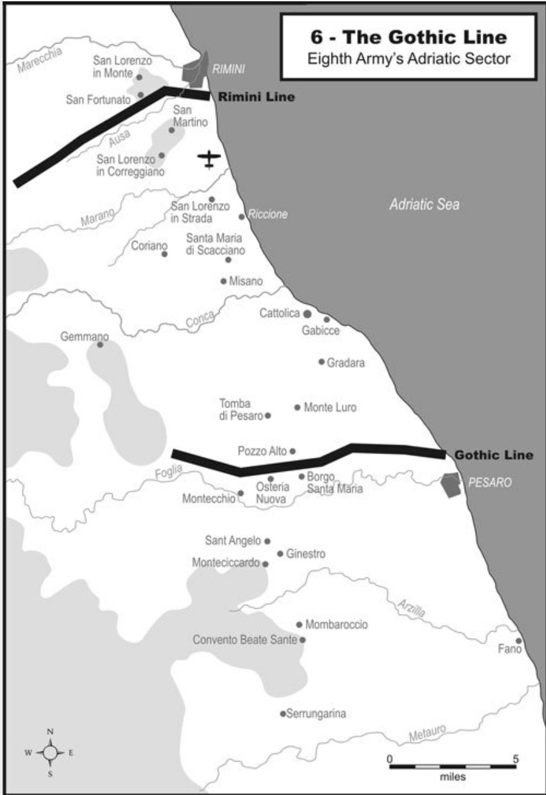

After the 1st Canadian Division attack, the Hussars took up their position near Monteciccardo. They were in the midst of planning an assault on the Gothic Line when reports of undermanned defences with reinforcements on the way caused the Allies to advance their attack. To avoid problems with traffic jams that were experienced in the Liri Valley, strict traffic control allowed for an orderly assembly.

The combined arms concept had an infantry Battalion coupled with an Armoured Squadron. The infantry protected the tanks against individual attacks on the tank, and the tank Squadron provided cover, transport and fire power to take out machine gun emplacements, tanks, anti-tank and artillery weapons. The mutual support was most evident in close quarter fighting in cities where the infantry would protect the tanks, and the tanks would blast any opponent hiding out in a building. Throughout the summer, each Hussar Squadron trained with a specific Battalion of 11th Brigade. A Squadron worked with the Perth Regiment, B Squadron with the Cape Breton Highlanders and C Squadron with the Irish Regiment of Canada.

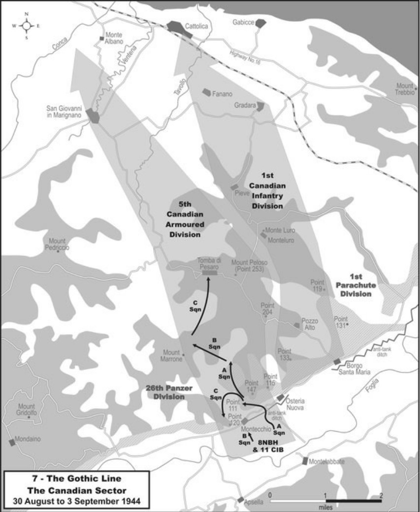

As the Hussars continued to Monte Marrone, other 5th Armoured Divisions took point 204. From the high ground the German counterattack to retake point 204 was visible, and heavy shelling decimated the German forces.

A squadron pushed forward towards Monte Marrone without infantry support and the dug in German anti-tank guns quickly dispatched 10 of the 19 A Squadron tanks. A Squadron held their ground, and several German counterattacks were broken up through the use of spotter aircraft and concentrated artillery fire. B Squadron and the Cape Breton Highlanders arrived to press the attack. From Monte Marone and Point 204, the Canadian Tanks had a full view of the German locations and a long-distance tank, and artillery battle raged on. By the end of the day the German defences had been destroyed and the village of Tomba di Pesaro was abandoned. The Germans had lost too many men to hold the area, and the Hussars had played a key role in breaking the Gothic Line.

## Battle of Coriano

After rest and integration of reinforcements on 02 Sep, all available Canadian and British tanks were assembled for a grand steel cavalry charge. The Hussars were paired with the Westminster Regiment for the assault. The Germans were retreating but the attacking force met up with concentrations of enemy, and several small but violent skirmishes ensued.

### CO Under Fire

LCol Robinson, the 8th Hussars Commanding Officer, got out of his tank to see what the hold up was. On his way back Robinson was some distance from his own Sherman when a Panzer IV crashed through a hedge beside him and onto the road. The enemy tank crew did not see or care about the Hussar colonel diving for cover in the ditch beside them. Instead, the German tank throttled up the road at high speed, making for Misano. It drove a hundred metres down the road before “C” Squadron Shermans plastered it with shells and knocked it out. Robinson remembered, “I was just recovering, having overcome my shaking, and was starting back for my tank when to my amazement a short-barrelled 88 started coming through the hedge in the same place as the previous one. It also had a German tank on the end of it.”

Robinson dove back into the ditch just as the second tank, actually an older-model Panzer IV, turned onto the road right beside him. Immediately, a “C” Squadron high-explosive round slammed into the enemy tank, showering the commanding officer with debris. McEwen’s squadron now was fully alert to the presence of Germans all around them and blazed fire at anything that moved. Every time Robinson emerged from his ditch, a burst of coaxial machine-gun fire sent him back to the bottom.

*Eventually, however, I managed to get out of the ditch and saw a tank across the road, about 75 yards away. I started to run towards it and the thing that impressed me most was that his guns were trained right on me and at the back of the tank was Cliff McEwen with his helmet half on, pounding the turret with his fists and shouting “shoot the bastard, kill the s.o.b.” I thought Cliff could not possibly be referring to me as he had never spoken in such disrespectful terms before. However, not taking any chances, I shouted at him “you bastard, if you shoot me, I’ll break your Goddamn neck.”*

*Painting of the Battle of Coriano Ridge.*

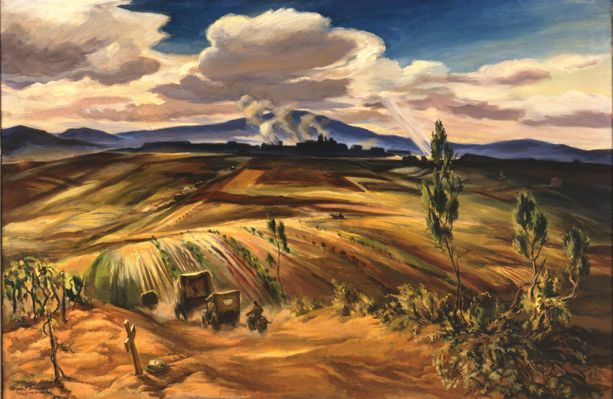

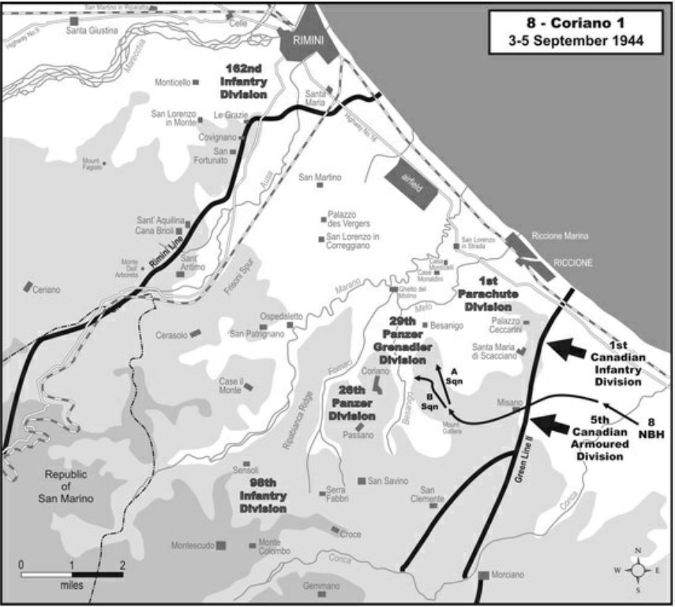

As the Hussars approached Coriano, it became obvious that the German reinforcements were well dug in and ready for the fight. As the tanks approached Coriano, deadly fire halted the advance. The Hussars were in a dead zone so relatively safe from German fire, but the 2nd British Armoured Brigade west of them lost over 200 tanks in the day’s fighting. A few of the still mobile Hussar tanks escaped, but due to a heavy assault by the German replacements, several Hussars were trapped for 6 days before finally being rescued by the Perth Regiment. The Allies reorganized and re-equipped for several days while constantly being shelled by German Artillery and bombed by the German Air Force.

In the interim, a tidal wave of German reinforcements arrived to stop the Allied breakout. Along Coriano Ridge, six British, Indian, and Canadian divisions faced eight German divisions. The next phase of the operation would be a massed battle of destruction against a now equal-sized enemy force.

Late on 12 Sep, a tremendous Artillery Barrage assaulted Coriano, but the well-hidden German Artillery was not destroyed by the onslaught. Coriano Ridge had a gradual slope, so the Canadians faced a 1000 metre kill zone of Great War proportions, topped by medieval stone walls and buildings that made an imposing fortress. While artillery and indirect tank fire kept the Germans in their bunkers, under cover of darkness, the Perth and Cape Breton regiments worked their way up the ridge as the engineers cleared paths through the minefields for the tanks. The tanks advanced at dawn and joined the infantry. They systematically eliminated German strong points, and a heavy artillery barrage broke up a German counterattack before it started.

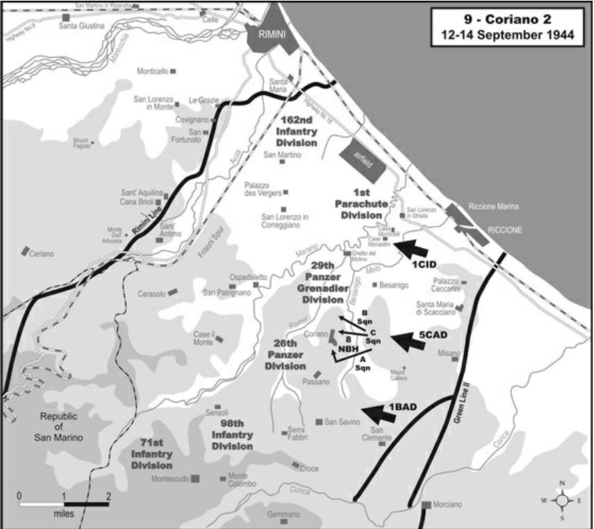

Coriano had been smashed by a week’s artillery fire, but as the Canadians went to occupy the town, mines, machine gun posts, snipers and tanks took their toll on the troops. The tanks and infantry spent the day clearing the town building by building. The Germans still occupied the church and castle at the top of the ridge and called in Artillery to stop Allied advances. Despite suffering 50% casualties on the first day of the battle, the German resolutely held the high ground. The town was still full of snipers and pockets of resistance. The Irish Regiment identified the sniper locations, and the Hussar tanks blasted their locations. These last remaining strong points were finally cleared by the Hussars and the Irish Regiment of Canada, by surrounding the castle and forcing the remaining Germans to surrender. This action ended the battle of Coriano after 18 consecutive days in combat for the Hussars.

### Trooper Hills

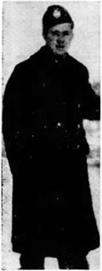

My sister Dale and I had researched the three people listed on the Phelps Cenotaph near our family home. One of the soldiers listed was B61168 Trooper William John Hills of Redbridge. In one of the many coincidences of war, William was also in the 8th Hussars and would have almost certainly known Norm in the army if not before. William was 2 years older, but they lived very close together in neighbouring villages. Their service numbers are 1 apart, so they signed up at the same time. They arrived at Borden on the same day, completed training the same day, were posted overseas a month apart and assigned to the 8th Hussars on the same day. They sailed to Italy on the same ship and served in the same regiment until Hills’ death on 14 September 1944 at Corriano.

In Lee Windsor’s Book Steel Calvary there are two stories about William Hills:

*An armour-piercing round punched through the front left side of Lieutenant J.H. Lackie’s tank. Everyone bailed out but the co-driver, whose hatch was blocked by the turret, which was traversed slightly right. Hunter Dunn watched what happened next. “I saw Trooper Hills climb back onto the tank, jump into the gunner’s seat, and traverse the gun away. He then opened the hatch and hauled the co-driver out.” The man’s foot was shot off.*

Even after the Germans had left the battlefield, they were still dangerous. Their engineers had developed the deadly practice of laying Improvised Explosive Devices (I.E.D.s) long before wars of the twenty-first century gave them notoriety.

Ten days later in the immediate aftermath of the Battle of Coriano Ridge:

*Trooper Hills asked Captain Hunter Dunn if he could go scrounging for German cooking pots; his crew’s pot set had been blown off the stowage racks on their turret during the battle. Dunn agreed, but went with him, searching through the wreckage of blown-out pillboxes and trenches left from the battle for Point 124 the day before. After a brief search, Dunn told Hills it was time to get back to the tanks. Hills asked if he could keep looking. Dunn gave him the OK and returned to the rear link tank. As he reached it, he heard an explosion. A trooper ran to Dunn’s tank to report that Hills had hit a mine or booby-trap and was wounded. “I told him to run back and tell Hills not to move.” Apparently, Hills had given up his search after Dunn left but then spotted a container on a dead German only fifty metres from his tank. It looked like it might do as the crew’s new pot. His crewmates warned him there were mines and booby-traps all around, but he went on anyway, eager to provide for his mates. Dunn got on the radio in his tank to call for the medics. In the meantime, he ordered his crew to fire up their engines and get over to the blast site, calculating that anti-personnel mines or explosive traps could not stop his Sherman. “I planned to drive up to Hills and have two members of my crew lift him onto the tank. I was in the process of turning the tank around when there was another explosion.” The same Hussar who had first alerted Dunn ran back and told him there was “nothing anyone could do.” Hills had tried to move, triggering a secondary device, and died at the scene. Trooper William John Hills was the same brazen Hussar who had rescued the trapped driver from a stricken Sherman ten days earlier during the first attempt to reach Coriano. He knew no fear.*

Hills had survived the worst battle the Hussars had faced, only to be needlessly killed in the aftermath. Trooper William Hills is one of 427 Canadians buried in Coriano Ridge War Cemetery.

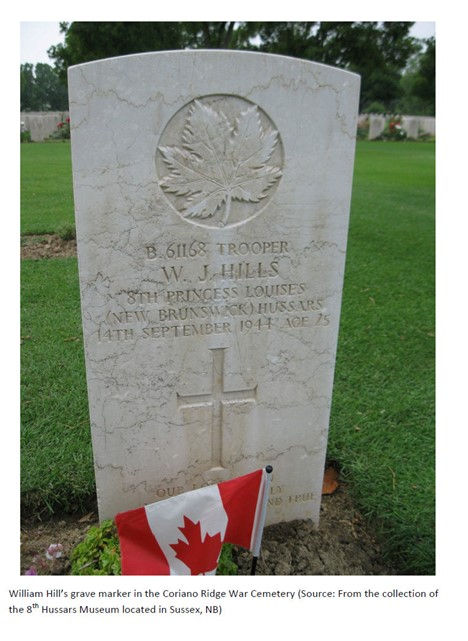

His inscription reads:

OUR LOVING SON AND BROTHER BILLY WHO WAS LOYAL, BRAVE AND TRUE TO THE END

Captain Dunn carried the burden of Hills’s death for decades after the war. “I still wish I had told him to return with me.” Dunn visits the twenty-five-year-old’s grave whenever he returns to the Coriano Ridge War Cemetery. He also regularly visits the twenty-eight other 8th Hussars left behind in the three cemeteries between the Gothic Line and Coriano Ridge. In 1944, the path between those three burial grounds marked an arduous sixteen-day journey through the fire and smoke of battle.

## Rest and Relaxation

The Hussars rode back to the harbour by San Giovanni for some well-deserved time out of the line.

Trips were laid on to the nearby beaches at Cattolica, still warmed by the late summer sunshine. Officers and men washed dust- and oil-caked bodies in the gentle surf. Hussars from southeastern New Brunswick were struck by the resemblance to the shallow tides and sandy beaches lining the Northumberland Strait off Shediac.

The regiment held a memorial ceremony to commemorate the 25 members lost during the battle.

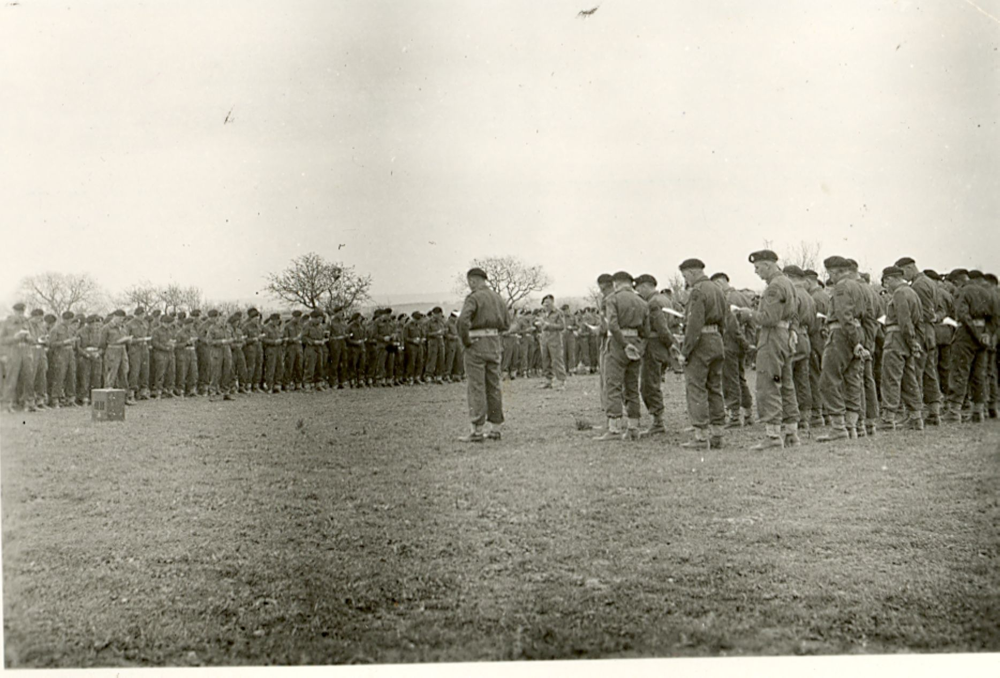

There was the measure of what had happened to the Corps. Its infantry battalions were stretched thin to the point of breaking. September had been Canada's deadliest month in the whole campaign; more than 4,000 officers and men had been knocked out, dead or wounded, and for many of them there were no replacements. Here was the reinforcement crisis that was soon to wrack all Canada. It was felt much above all in the infantry, but it was felt elsewhere as well.

In the last month in the Hussars Regiment, 93 of their number had become casualties, 31 of them killed in action. They had run through virtually their entire complement of tanks; 43 of them had been knocked out by enemy action. The tanks could be replaced. The problem of human replacement was not that simple.

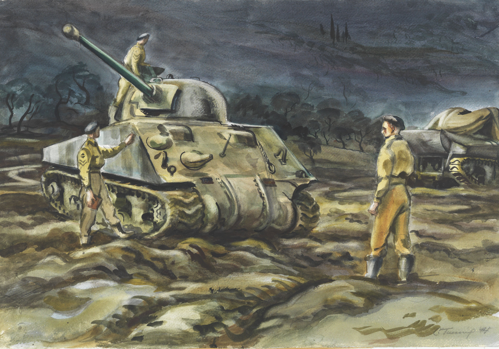

### Back to the Line

Before them, a vast sprawling plain stretched to the far horizon. This was what the division’s tankers, and the motorized infantry of the Westminster Regiment had longed for since their November 1943 deployment in Italy. The rugged terrain the Canadians encountered during their advances up either flank of the Apennines, which formed a hard spine in the country’s centre, had prevented this kind of mobile warfare. Now, however, the Apennines had doglegged westward to the French Alps and stood behind them. It seemed they had reached that final ridge and were ready to “emerge in flat country where the Tedeschi [Germans] would not be looking down (and accurately directing fire) from higher points further back.” Westminster Regiment’s Lieutenant Colonel Gordon Corbould returned to his battalion headquarters “fairly beaming. ‘As far as you can see from up there, it’s as flat as a pool table,’ he reported.

This would be possible in open country with the Eighth Army’s superiority in armour and air support. Map and aerial reconnaissance photography study encouraged Burns and the other British Eighth Army superior officers to consider this outcome inevitable.

Of course, this was too good to be true. What they saw when they reached the ground was water. Water that came in almost every imaginable form— rivers, creeks, canals, drainage ditches, swamps, and marshes. Yes, they faced a great plain, but it was one divided into two sectors by the defining waterways. The most northerly sector was entirely dominated by the mighty Po River, fed by tributaries flowing out of both the Alps and the Apennines. With one of the most complex deltas in Europe, the Po boasted at least fourteen river mouths and had a long history of causing devastating floods. As the Po was about a hundred miles north of Rimini, this sector of the plains was of no immediate concern. It was the southerly sector Burns, and his staff now investigated closely. The whole area, they discovered, was a great reclaimed swamp formed by lower courses of numerous rivers flowing out of the northwesterly curving reaches of the Apennines. So many rivers— with the Uso being the first principal one. It was followed by, in order, the Fiumicino, Savio, Ronco, Montone, Lamone, Senio, Santerno, Sillaro, and Idice. Between these rivers ran hundreds of smaller streams, canals, and irrigation ditches. Throughout the Roman and medieval eras, the great swamp had been patiently drained to create cultivable land— but some patches of swamp remained. A floating bridge across the Senio River showing the high dikes on banks of the river.

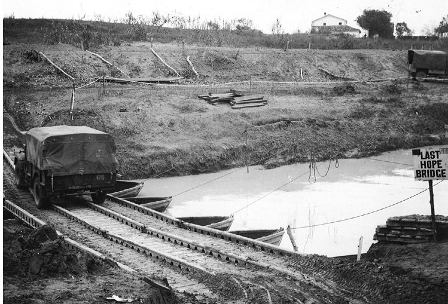

Dikes ran along their banks, high walls of solid earth that rose to heights of 25 and 30 feet above the plains. The Germans had turned them into fortifications. Between the rivers were canals which in themselves were hardy obstacles. It was a difficult and exhausting and casualty-ridden campaign the Canadians fought against these barriers and the Germans one year after the fighting on the Moro and in Ortona. The advance was carried forward despite growing shortages of many things, among them soldiers and ammunition.

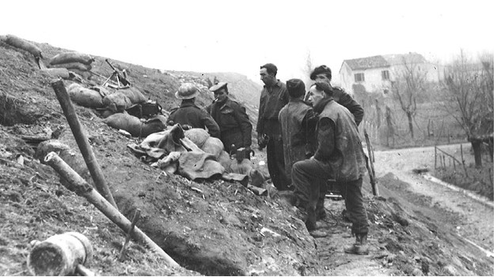

The Germans dug into every dyke, building shelters for the troops and firing posts for machine guns and anti-tank weapons. Each river or canal was a perfect anti-tank ditch as well as a strong point to inflict maximum damage on attacking forces. Once the defensive point was threatened, the Germans retreated to the next dyke and the process was repeated.

After a few weeks rest, the regiment pushed back up to Rimini. The fall rains had saturated the flood plains and made any movement difficult. The Hussars moved up to the Fiumicino River— considered by most historians quite likely to be the Rubicon that Julius Caesar had crossed unopposed two thousand years earlier in his march on Rome. Most of the rivers in the region were bounded by high earthen flood banks, built to confine the swollen torrents caused by heavy rain and the melting of mountain snows. The reclaimed swamp land between these is intersected by a network of long dykes and irrigation ditches. With their bridges destroyed, the majority of these watercourses became tank obstacles, and when filled by the rains of autumn and winter, barriers to infantry as well.

For reasons known only to the madness of Hitler, the Germans elected to fight bitterly for every inch of Italian soil even when that soil meant little in the final stakes and when their divisions in Italy were sorely needed in places far more vital. They tied up there roughly half as many divisions as they had in Western Europe. In the fall that now had come and, in the winter, due ahead, it became the task of the Allied armies to accommodate this folly, to keep those wasted divisions tied and tested.

In the Italian campaign, there were two wars, the war of the springs and the summers and the early autumns, and the war when these had gone. In the springs and the summers and the early autumns, there were great battles, lithe movement, sweeping victories, great and splendid hopes. When these had gone, when the rains came and then the cold, the war became a sluggish, trapped and stranded thing, thrashing restlessly in a prison only spring could free it from. It became, in the worst sense, reminiscent of the First World War. The fall rains turned streams into raging rivers that often overflowed its banks. The rapid flooding of the Marecchio River is evident as the Bailey Bridge is swamped in a few hours.

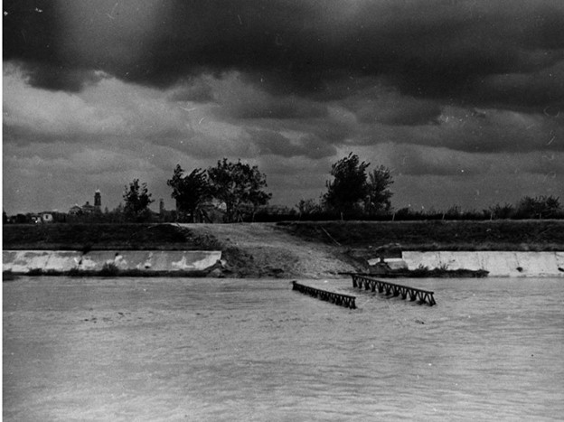

The Hussars were pulled out of the line on the 11 October, having lost 43 tanks, 8 officers and 85 Other Ranks since the end of August. They moved back to Cesena then Rimini and had a pleasant time out of the line until early December. Riccione was a good place to be. In Mussolini's heyday it had been a favorite summer sanctuary of some of the most influential members of the Fascist hierarchy including, it was reported, Il Duce himself. It had lots of swank resort hotels and villas which soon became officers' clubs and men's leave centres and theatres.

The manpower shortage and lack of trained crews severely impacted the Hussars’ operational capability.

*"For the first time that fall we used four-man crews. In a good number of cases, it might even have been more advisable to go in with three-man crews than with some of the reinforcements they sent us. One time we got a driver with 3 1/2 hours' training. You just can't drive in action with that sort of background. One group of reinforcements came in with very little training at all, but they were ambitious and eager, so we kept them. One kid came out to my troop. He was keen but scared to death, completely at a loss. One man said he'd driven a tank half an hour in his life; she was running when he took her over and she was running when he left. Another man, sent up as a gunner, didn't know the difference between a 75 and a Browning.”*

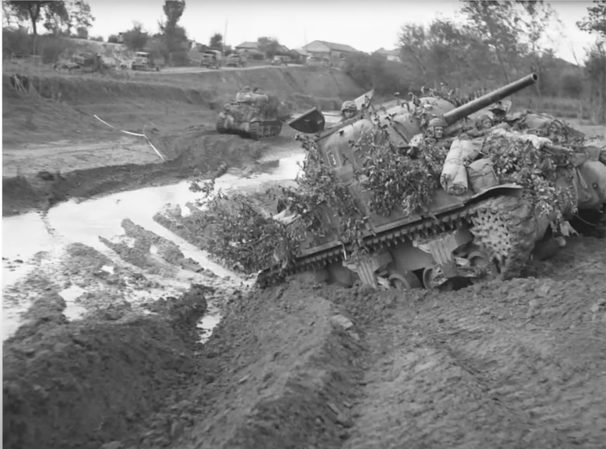

### Ravenna

On 08 December, with Maj. Ross in temporary command, the Hussars moved into Ravenna, a city of 30,000, in a dour and apprehensive mood, prepared for exposure to a role they had long respected but never for a moment envied: they were to act as infantry. Maj. Ross had lawyered with higher command long enough to get permission for one squadron at least to retain its tanks. On the 9th of December, therefore, C Squadron rolled its armour into Ravenna while the men of the other two fighting squadrons went unhappily through their infantry drill. Two days later their orders came through. They were to take their place in the line and strike on to the town of Mezzano, some eight miles along Highway 16 from Ravenna.

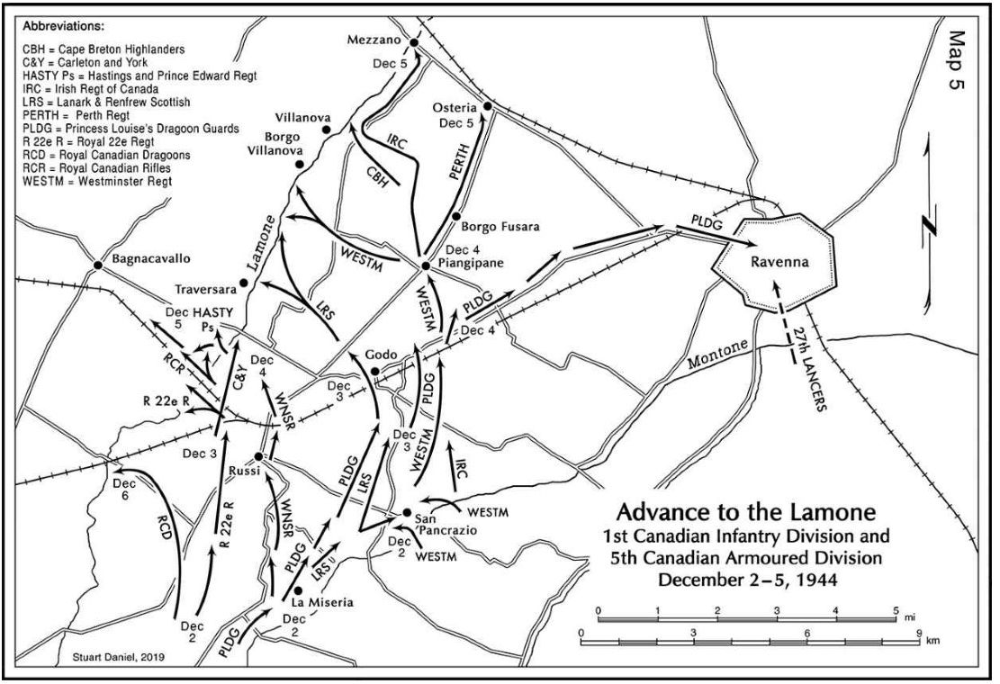

On 12 December, fighting as infantry, the regiment launched a successful attack on Mezzano after several days of heavy fighting by the rest of the Division to secure a bridgehead across the Lamone River. The Germans had abandoned Mezzano and moved back to the next canal. On 15 December, the Hussars came out of the line back to Cervia with their tanks heavily laden.

*"The tanks and other vehicles coming back from the front looked like gypsy caravans. A quarter of beef tied on here. A pig in a crate. Kegs of wine. Bedsteads, blankets, quilts. You'd see them all. The guy who couldn't round up a side of meat or a keg of vino was simply lacking in the most ordinary foraging talents.”*

The Hussars had Christmas dinner heavily stocked from their scrounging:

*"We were in a small town and feeling on the lonely side, so nine of us decided to have ourselves a Christmas dinner in spite of everything. We were in a house within a few hundred yards of the enemy lines.*

*"One of my pals and myself started on a hunt for turkeys. We travelled over what had once been streets but now had the appearance of plowed fields--result of shells. Eventually we found turkeys and we helped ourselves to three. The next problem was to get them roasted. The only thing we had were two petrol tins. After cutting the sides out, burning them out and washing them we proceeded to the town oven, a big thing about 10 feet by 10 feet in size. There they were roasted.*

*"The remainder of the dinner, consisting of mashed potatoes, peas and beets, was prepared by my chum and myself over a fire in a large fireplace. We didn't want to have anything lacking so we went through the vacated house until we could find something suitable for a tablecloth and we came upon a large linen bedsheet which really served the purpose.*

*"With that, there wasn't much lacking, including the wine, except the traditional fruit cake. I'd received one from home, but it was mouldy by the time it reached me. All in all, we had a great time, and the loneliness was overcome ... Things were not quiet by any means while we were feasting. We lost a petrol truck and an ammunition truck to enemy fire and one of our L.A.D. men lost the door off a white scout car. I was driver for Capt. Keith and his car was parked as close to the others as it could be, but it got off without a scratch. That's the way it seemed to be with shelling.”*

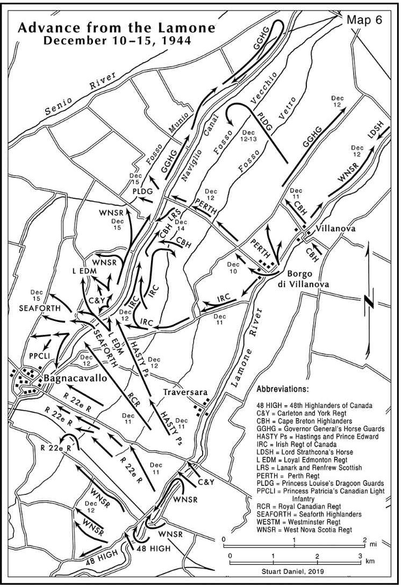

### Mezzano to Saint Alberto

Refreshed from their Christmas Dinner, the Hussars distinguished their regiment by winning Four Military Medals in two days.

On 02 January they pushed through Mezzano to Saint Alberto, to straighten out the line at the Remo River establishing a winter holding line. To the left of the Dragoons, the 8th Hussars had passed through the Perth Regiment. The country entered, however, proved “very close and poor visibility made it difficult to see and engage the numerous SPs and Panthers that were in the area,” 5th Brigade’s Brigadier Ian Cumberland wrote. ‘A’ Squadron was leading when it moved out into open ground backed by a row of trees at 1350 hours. “

The battle was over. The straightening had been done. The winter line was ready for defensive elaboration.

In four days of action, the Hussars had taken 199 prisoners, killed and wounded more than 200 Germans, knocked out two Panthers and seven anti-tank guns, captured a Panther and 25 bazookas and destroyed seven 3-cwt. trailers. It was a worthy climax to the months in Italy.

The Hussars went back into Corps Reserve in Cervia. They spent several weeks, cleaning up, training and going on leave. On 28 January, they had a memorial service for the 42 Hussars who lay buried in Italy.

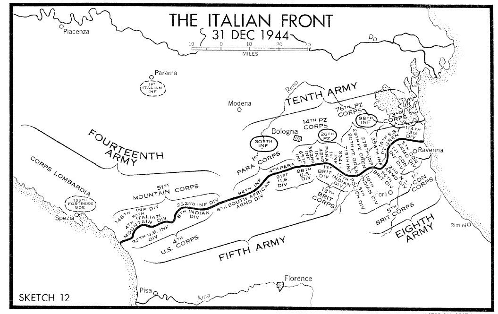

On 10 February, the regiment began to secretly move south by rail and road to Leghorn on the West coast of Italy to begin their journey to Northwest Europe. All identifying badges and symbols on the vehicles were removed, and they were in Leghorn for 3 days before it was confirmed that the 5th Armoured Division would be heading to Western Europe.

## Losses in Italy

Of the 92,757 Canadians served in Italy, 26,254 became casualties and 5,399 were killed. The Gothic Line Battle exacted the highest price.

Back along the miles the Regiment had covered, in England and Italy and Holland, ranged the white crosses and the mounds of earth that were the symbols of the price. By VE-Day, 65 Hussars had been buried overseas. All but 11 were killed in action or died of wounds. Nearly half of them had been lost in that costly month of September 1944, the month of the Gothic Line and Coriano and the plains beyond.

Another 187 Hussars bore in their flesh and bones the marks and scars of wounds sustained in action. Some would be seriously maimed and hampered for life. The majority were more fortunate.

On the tunics of 43 men were the ribbons of acknowledged courage, of the D.S.O., the M.C., the M.M. Others like Jimmy Jones, Dave Gass, Cliff Northrup, the lanky, raw-boned RSM, bore in their records the Mentions in Despatches which singled out their names and deeds for special notation.

Yet, as every soldier knew, there were a good number of men who got no medals and who had done outstanding things or had made real contributions to morale. There was no glamour in the battle, as evidenced by a Hussar letter home:

*"... War is a rotten business; the romantic part of it is a figment of the fevered imagination of some throwbacks to the pageantry of medievalism. There is no romance in the blood-soaked stretchers stacked against the walls of regimental aid posts and casualty collecting points or in the disfigured corpses lying outside, many of them dead on arrival. Nor is there any romance in digging out charred fragments of flesh and a few bones from burned-out tanks and endeavouring to reconstruct the identity of some member or members of a crew and eventually burying the few bits in a tin can. Especially is there no romance in going to some hastily-set-up cemetery to identify dead who have been lying in the sun for three days or more. To smell the sickening stench and see the approximate shape of friends wrapped up in blankets waiting for sufficient graves to be dug. To have blankets opened up and to be in tremendous doubt (the dead seem to look so much alike and so different from their living selves) as to whether it is one of yours or not. To come to blankets resembling bags of meal, still pursuing identifications, to open them up and find a torso or a head or simply some bits scarcely recognizable as being human; and over all and through all and permeating everything, the stench, the saturating stench that you can smell for hours after you have left the place ... “*

# North-west Europe

The Hussars departed the port of Leghorn (Livorno) Italy, west of Florence, on 17 Feb 1945.

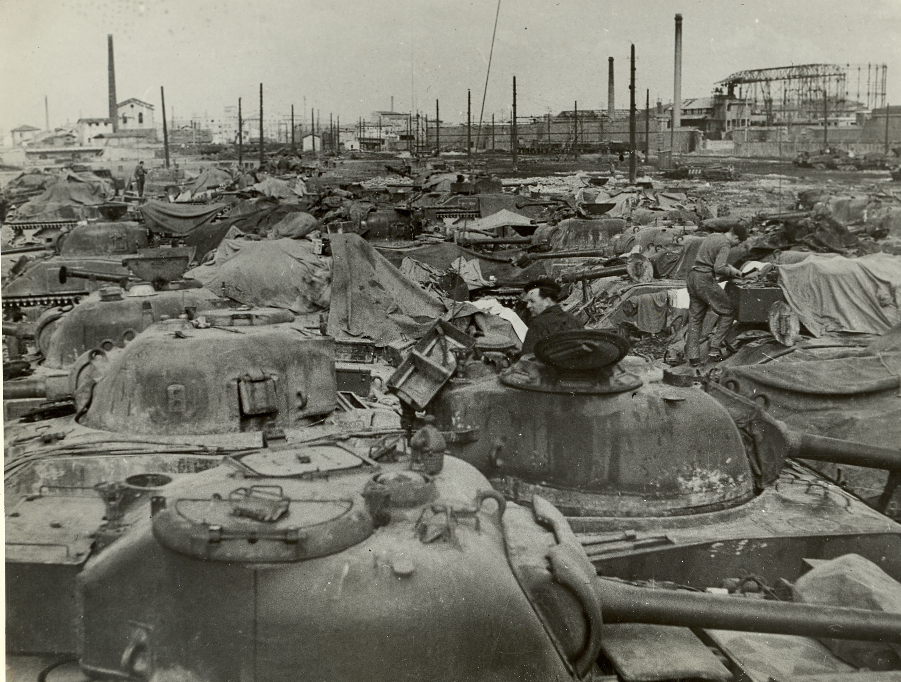

**Tanks Ready for Embarkation**

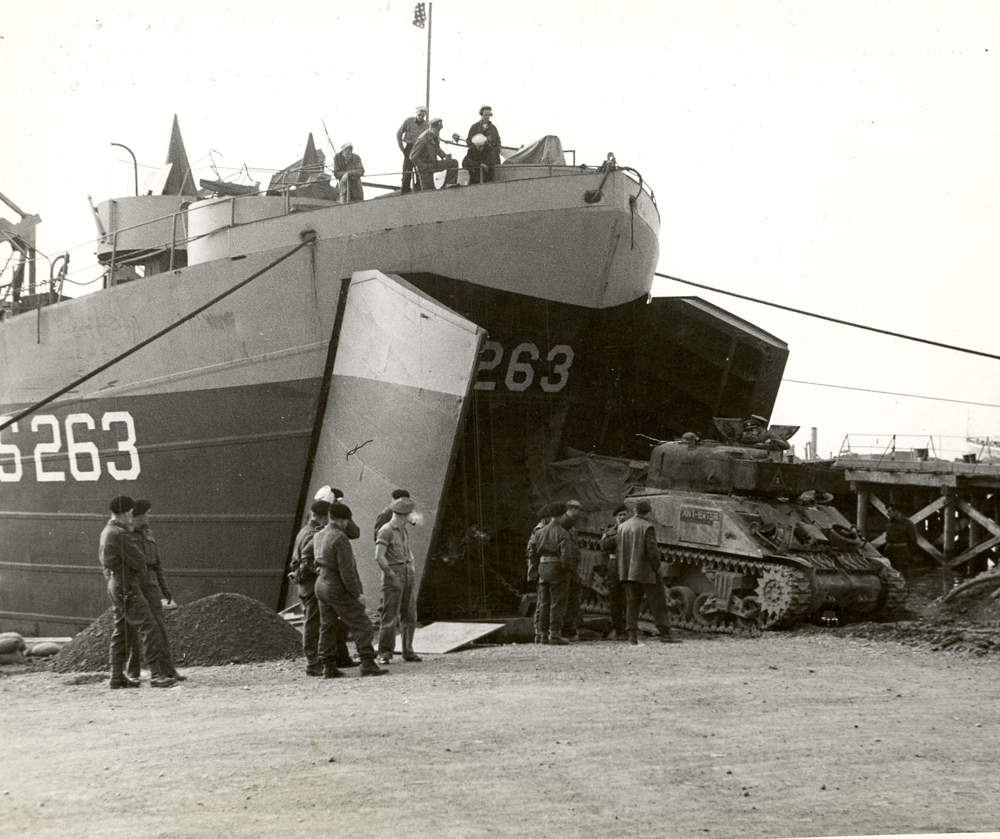

**Tank Being Loaded on Landing Ship Tank (LST)**

The tanks sailed across the Mediterranean to Marseilles, the moved by rail and road to Roulers, Belgium. An 8th Hussar ship entering Marseilles, wending its way through the wrecks and the damaged harbour.

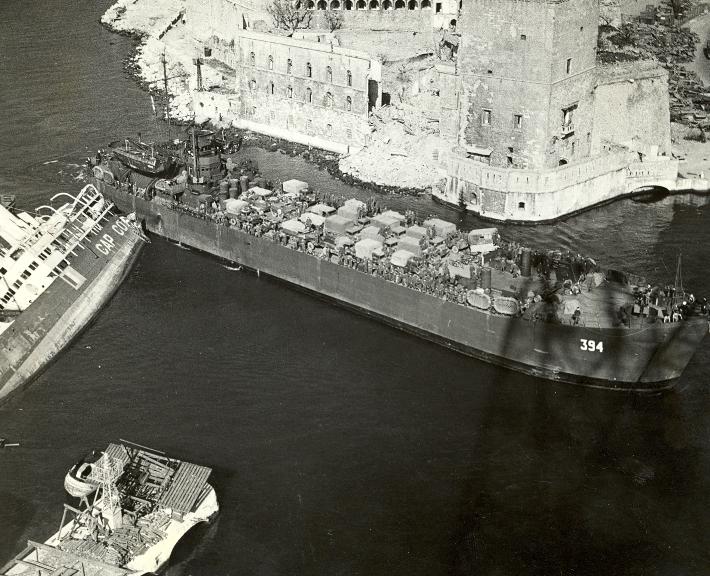

Unloading the tanks in Marseilles.

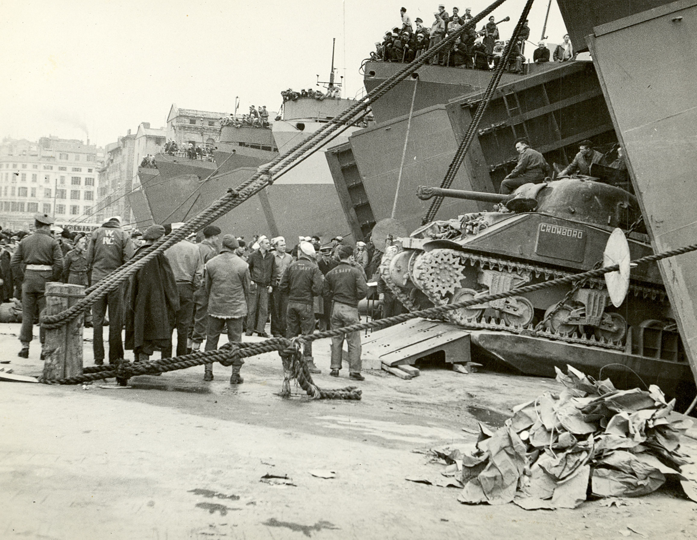

Transporting the tanks across France and into Belgium.

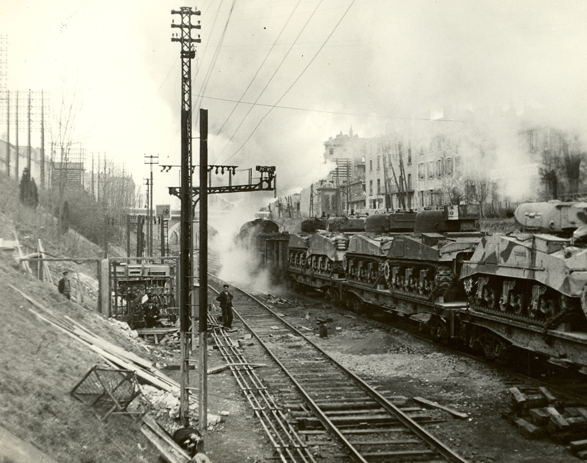

## Interactive Map Europe February to May 1945

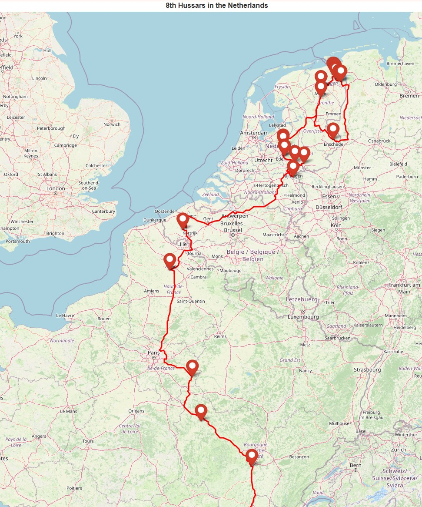

The map shows the 8th Hussars in action in Europe. Clicking on the [Interactive Map](https://pd-allen.github.io/docs/Hussars.html) opens the route in a new browser window. Hovering the mouse over the marker shows the date and place and clicking on the marker provides details of the daily action.

## Belgium

The unit was outfitted with Sherman Fireflies with their powerful 17 pounder guns and remained in Roulers until early April when they moved up to Nijmegen, Netherlands for the final push of the war. During their stay in Roulers, the troops billeted with the Belgian townsfolk who treated them like royalty. This period of rest and rebuilding was the most pleasant time spent by the Hussars and was accompanied with extended periods of leave to Paris and England.

## Liberation of the Netherlands

The Hussars joined the 1st Canadian Corps to support the push across the Rhine. Their job was defending the flank and there was relatively little Activity. The Canadians cleared the Netherlands in three separate offensives. The 3rd Division pushed up the Western Flank, 2nd and 5th Division up the middle and the 4th Armoured Division up the Eastern flank and into Germany.

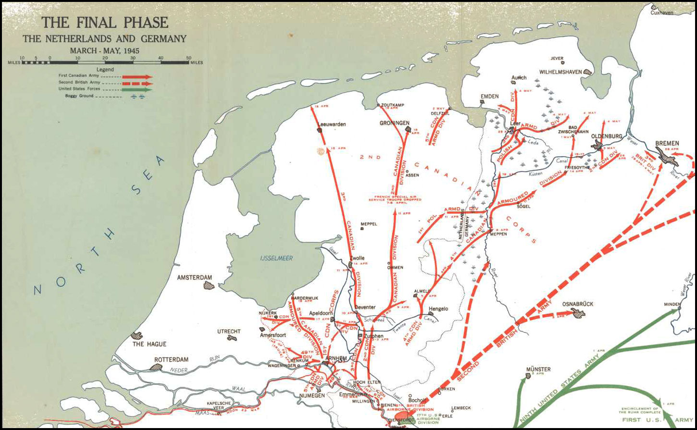

### Putten

Arnhem fell on 14 Apr and the Hussars prepared for a push to Putten as part of Operation Cleanser. The push to Putten was largely an Armoured advance, with the infantry following behind clearing up pockets of resistance. The Germans fought fiercely, and A Squadron lost 12 of 17 tanks, but amazingly only 1 soldier killed. There was a small band of Dutch SS troops who joined the German forces. They fought to the death rather than face the wrath of their countrymen after the war. The Hussars advanced over 30 miles in 4 days fighting as an armoured unit free to make major advances across flat lands. Their push to the sea split the German forces in Holland in two. The 5th Division only suffered 76 casualties in total while capturing more than 1700 prisoners.

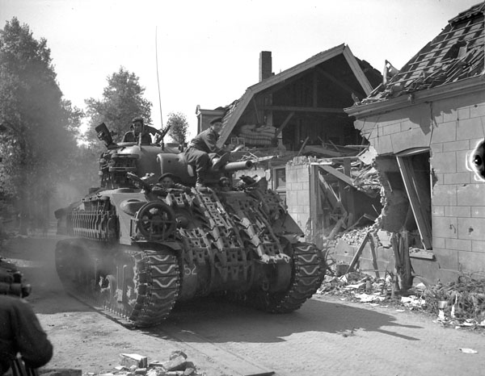

**Hussar Firefly entering Putten in April 1915.**

After a few days’ rest, the Hussars pushed north to Assen, completing the 174-mile trek in a single day.

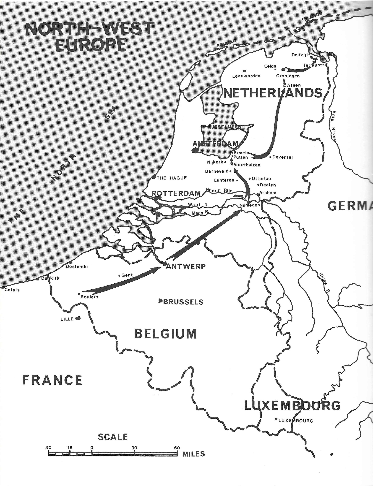

**8th Hussars Route Through the Netherlands**

### Delfzijl – The Final Fight

After a few days rest in Putten, the Hussars moved north, their target the port city of Delfzijl, the northernmost point of the Netherlands on the border of Germany. Delfzijl, with a pre-war population of 10,000, is one of the largest of the secondary ports of the Netherlands. It is located on the left bank of the Ems estuary, some 20 miles from the river's mouth. Topography hampered operations in this area. The ground was flat with very little cover and "a complicated network of ditches and canals made cross-country movement impossible. The weather was wet and the whole area subject to flooding, which meant that all vehicles were confined to roads."

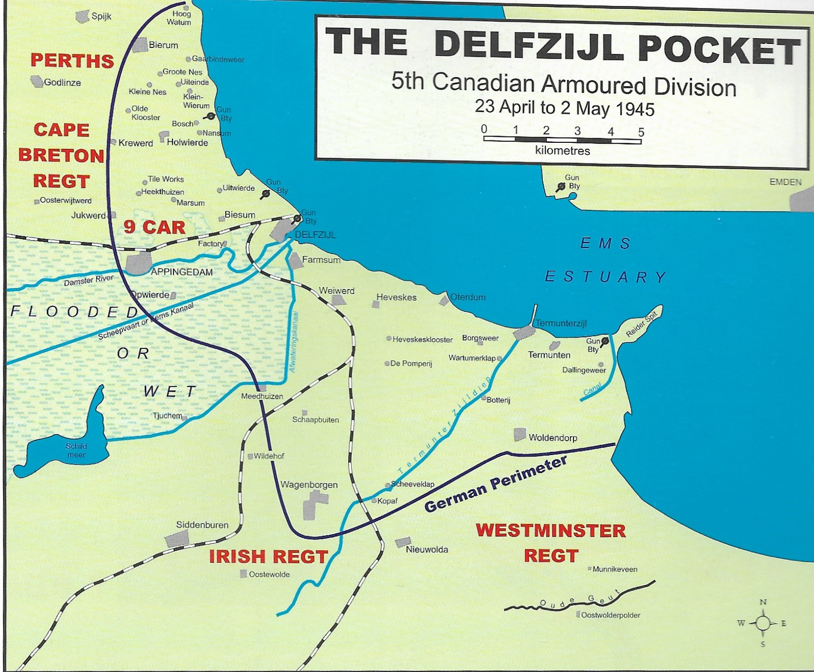

It was essential to capture the port intact as it would be critical for providing supplies to the staving Dutch people. Delfzijl was heavily defended and surrounded by low lying land that provided no cover for the attackers. The 5th Division created a semi-circle around the city. The infantry could only move forward at night, with the tanks providing covering fire. Due to the swampy conditions, the tanks were forced to stay on the roads and made easy targets. The 8th Hussars provided support for the Infantry Units executing the assault. There were tanks with the Westminsters, Irish Regiment, Cape Breton Highlanders and the Perth Regiment, so the Hussars surrounded the town.

The German garrison was estimated at about 1500 fighting troops with batteries and concrete emplacements in and around Delfzijl and "an outer perimeter of wire and a continuous trench system" surrounded the port. Heavy naval guns near Emden and on the island of Borkum could also provide defensive fire. "The going was slow as the advancing had to deal with mines and road demolitions before they could get any supporting arms forward." They also endured much shelling, some coming across the estuary from the vicinity of Emden. Destroyed port guns near Delfzijl.

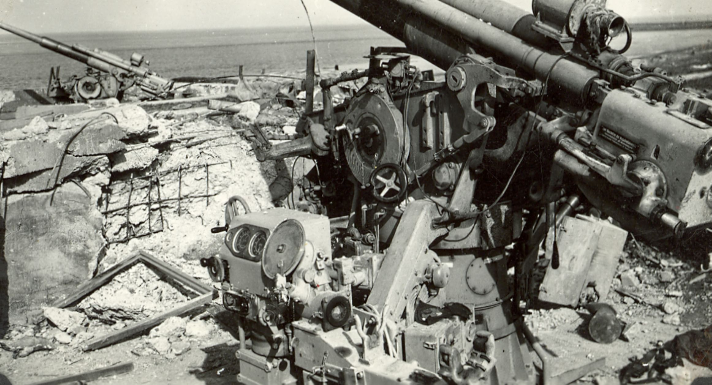

The Cape Breton Highlanders, supported by the 8th Hussars began the final assault on the night of 30 May. Minefields and wire delayed the advance as did the thick bunkers. The bunkers defending the port had reinforced concrete walls 7 ft thick. The standard rounds penetrated 5.5 ft, but it was only when the new Canadian Sabot round was used, were the Germans persuaded to surrender. The round is a small diameter projectile that has a bore riding outer casing (Sabot) that is discarded after clearing the barrel. The remaining projectile is much more aerodynamic than the conventional shell, so impacts the target with much higher energy, permitting deeper penetration.

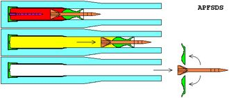

After 9 days of heavy fighting Delfzijl finally fell, on 01 May. Over 4300 Germans were captured throughout the battle, and although the locks and port facilities were wired for demolition, they were captured intact. The 5th Armoured Division’s 158 casualties were lighter than expected.

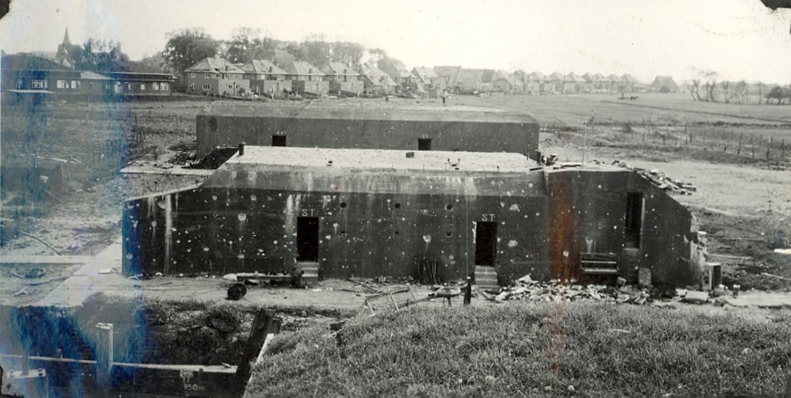

**Bunkers Defending Delfzijl**

### Description of the Final Battle

This description of the Fighting is taken from Douglas How – 8th Hussars.

*The Regiment's association with this struggle began April 24th and lasted eight days. The first squadron committed to action was and it was split up. One part under Capt. Cahoon went to join the Irish Regiment at Siddeburen, a village some seven miles south of Delfzijl. Another part, under Capt. Keith went to join the Westminsters at Oestwelde, about nine miles to the southeast of the port and some seven miles east of Siddeburen. To the Westminsters' front, too, went the six tanks armed with 105mm. guns. They acted, under Maj. Ellis, as a mobile troop of artillery. It was that evening when they first opened up in a counter-battery role against coastal guns east of Delfzijl.*

*When darkness came down over Oestwelde, the Westminsters moved forward. When the Germans detected their movements, they made the night leap and curdle with artillery fire. The Hussars retaliated with their heavy guns and succeeded in silencing the enemy. At first light, one troop of tanks struck forward to reinforce the infantry positions and then to go forward with the infantry, taking on occasional opposition.*

*Some miles to the left, the Irish were pressing northward too and two tanks, in strengthening their attack, went plunging through the waterlogged surface of a Class 3 road and settled deeply and dismally into the mud. They couldn't get out.*

*On that same day, the 25th, the Hussars appeared as well on the northern flank when A Squadron was committed in support of the Perths at a place called Bierum. Their appearance in an exposed area promptly provoked the German guns to sustained and heavy shellfire.   The pattern had formed. Around the perimeter of Delfzijl's fortress, Gen. Hoffmeister was building a semi-circle of bayonets and armour, and he was bringing it to bear at point after point, relentlessly, mercilessly and with all the efficiency that years of war could produce. From April 24 to May 1, the pincers drew inexorably together.*

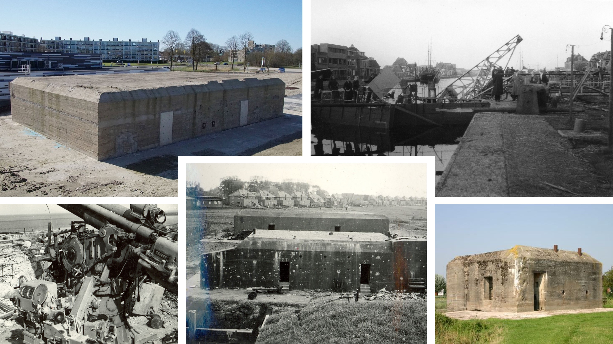

*The pattern of assault was repeated again and again. Again and again, the officers would look across the wet, watered, open, naked soil of Holland under a driving rain and know that only at night could attack succeed, and at night the infantry would go forward. Each man would know how close the war was to its finish and that Germany was defeated in all but nominal acquiescence and that, in these final hours, he could be killed or maimed for life, and each man would still go forward. The Irish and the Westminsters from the south, the Perths and, when they were exhausted, the Cape Bretons, from the north, would still go forward, walking or running or creeping forward and occasionally lurching drunkenly and falling down to die or bleed and be carried back.*

*Over the narrow, soggy roads and through the drenched spring fields and into the little towns, they kept going forward. Behind them the tanks would fire and then stalk on, with all their fierce and awkward purpose, to join them. At times they would move forward along roads where the German guns could concentrate on them and there was no alternative because the roads were surrounded by minefields and by marshes. It was at such a time that the side of one tank was crumpled in as by a monster's careless hand. For all the time the Germans were firing back from their pillboxes and entrenchments and from the houses and, most heavily of all, from the great batteries of death in the emplacements along the coast.*

*The Germans repeatedly launched counterattacks that were quickly pushed back by the advancing Canadians.*

*Into the villages of Woldendorp, of Nansum, Helweirde, Wagenborgen, and Termuntzijl, over coastal gun positions, the infantry kept storming with the tanks supporting them. Tanks were lost to gunfire, were immobilized by mines and finished off by guns, were sucked into the mud and held there.*

*By no means all of them came easily. The fortress was too stoutly walled for that. In the firming up after the assault on Uitwierde, the Hussars found just how stoutly walled it was. One tank engaged a concrete pillbox with a 17-pounder gun. The German emplacement survived one shell after another until the gunner finally inserted a new-type missile, a Canadian projectile known as a Sabot. Its exceptional powers of penetration finally brought the white flag. When the Hussars later investigated, they found that their conventional shells had penetrated 5 1/2 feet but still were 1 1/2 feet short of passing through entirely. The Sabot had struck high and caused the concrete to break loose inside.*

*In retrospect, there must be an extra touch of splendor to every bravery, an extra wisp of pathos to every soldier's death in any battle fought within a week of peace. It was that way in the final assault of the siege of Delfzijl.*

*It struck from both north and south along the crumbling perimeter. Far off to the east and south, Russian and Allied troops were already strangling the last gasps of life from the German Fatherland but still the Nazi garrison battled for this Dutch port as though El Alamein and Stalingrad had never yet been fought. The Canadians fought that way too. In the ranks of the 8th Hussars there were braveries on the 1st of May 1945, as on any other day of battle. Some of them were recognized in time through the award of the medals which honored them or through Mentions in Despatches. More were not. It had always been that way. It had to be that way if medals were to preserve their dignity and their meaning.*

*Through those and other acts of bravery, the siege of Delfzijl was consummated. The tanks and infantry broke through the last barriers and into the streets of the city itself. They were ready for a last-ditch struggle; it didn't happen.*

*The Germans had had enough. The mopping up went on into the next day but there was little to it. The garrison marched out in its hundreds, laid down its arms and quit. Nursing sisters marched with the men. In a cavernous headquarters, the very formal commanding officer very formally surrendered to the Irish O.C. and Maj. McEwen. Out of cellars and ruins and down empty streets, Netherlanders poured in hungry, happy celebration. The Canadians found themselves surrounded by thanks and booty.*

This was the final Canadian action of the war and a few days later on 05 May 1945, the War in Europe was officially over. The war diary says, with massive simplicity, "the Regiment celebrated."

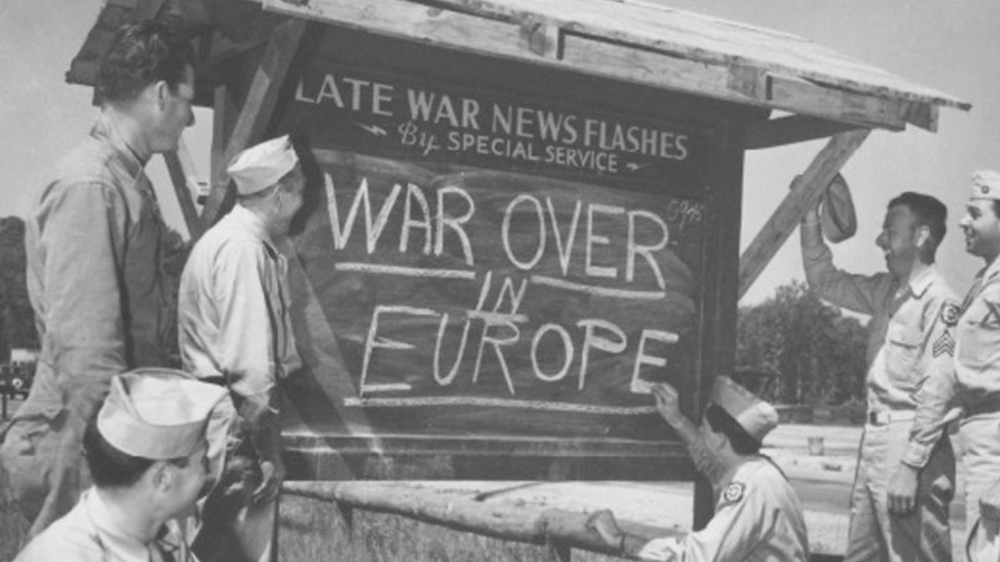

Victory-Europe Day sprang from the horizon in bright and splendid character. Across the brutalized soil of Europe, the spirits of the free arose to share it. Where the Hussars were, there were toasts to victory, there were songs and laughter and in the giddy streets of the Dutch towns that had known five dark years of tyranny there was dancing and merriment that seemed to know no end. Around their tanks and trucks and in the houses where they stayed, the men clustered in groups to hear the King and Prime Minister Churchill proclaim this victory that had taken so long to gain and, in the afternoon, they joined in a voluntary church service to give thanks to the God who had overseen it.

It was a time of holiday, a time of joy, and yet it was strangely true of Canadian soldiers generally that day of victory that theirs was less a day of tumult than a day of relief and thanks that at last the hideous thing was done.

The war was still too big, too close, too vast a tragedy, too deep a stain upon the human record. Too many good men had died.

## Support of the Dutch

The Dutch were very appreciative of their liberators. They continue to hold Canadians in very high regard to this day.

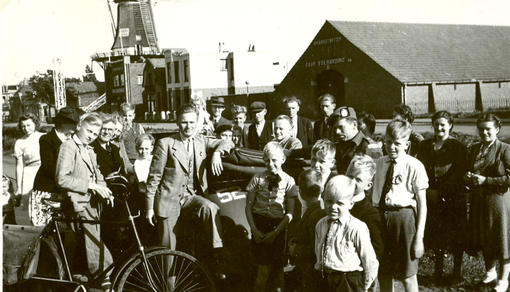

The locals participated in a Victory in Europe parade, celebrating the end of a very dark time. In the time between VE-Day and the going home, the regiment had a pleasant life thanks largely to its good fortune in being garrisoned in The Netherlands rather than in truculent and devastated Germany.

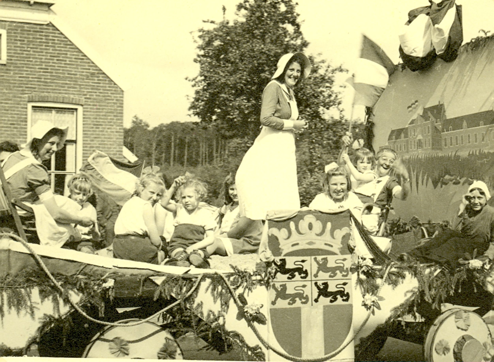

Out of this good fortune a lively social life sprang up, replete with romances, dances, movies, sightseeing, sailing and swimming, a whole welter of clubs in the immediate area and in the large nearby city of Groningen, Dutch Canadian study clubs and all sorts of personal liaisons. Holland was a good and grateful place to be the Hussars made the most of it.

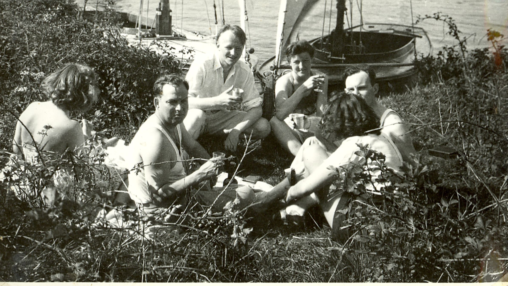

To these boons, headquarters added others in an effort to stave off the boredom and indiscipline which would inevitably lead to trouble and a lowering of regimental prestige. There were leaves to England, Paris, Brussels, and elsewhere, university and other educational courses, a heavy concentration on sports, and there was enough soldiering to keep the men smart and on their toes.

Relations with the local population were excellent.

*“I'll give you one example. The people of Eelde sadly needed peat for their fires but they had no means of moving it. So, we arranged a driver-maintenance course and just by coincidence it took our trucks out to where the peat was stacked. The Dutchmen piled it aboard and we drove it back to town for them. They'd stack it in the town square and dole it out from there.”*

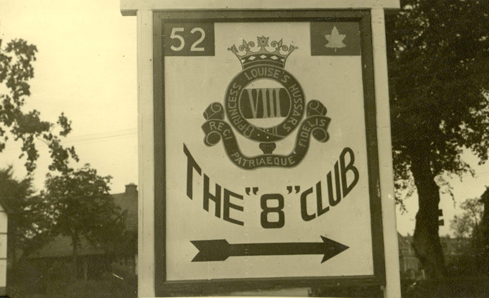

The Hussars remained in Eedle, Netherlands for an extended period, with the final soldiers not returning home until January 1946. The return was generally decided by seniority, with those who had spent the most time overseas being returned first.

The original hopes the regiment were for a voyage before Christmas. These were crushed by official information that there wouldn't be a voyage at least till Easter. But at last, in November the great word came; the last big move was on.

Regimental life once more became ordered pandemonium. In Paterswolde and Eelde and Groningen, farewells were said to the Dutch people. In the town hall of Eelde, there was an official farewell, kind words, an exchange of gifts to seal the months of friendship. The Burgomaster said, "We'd give you a gold medal of honour, but the Germans have taken all our gold." Instead, they gave a manuscript bearing Eelde's official seal. But someday, the Burgomaster said, the thanks of the community would be said in gold.

The ceremony was followed by an old-fashioned Dutch meal and a formal dance that went on long into the night before departure. Few Hussars slept that night. When the last of the Regiment pulled out early on the morning of Nov. 27, many Netherlands friends were still around to wave them on their way.

It was a sad farewell. As one Hussar has written:

*“In reviewing our stay in this country, it can truthfully be stated that in every respect it was one of the most pleasant and interesting interludes in the history of the Regiment.”*

Westward then, they turned. Back through Nijmegen, through Ostend, across the channel to Dover, into old Witley camp south of London went the 450 men who now made up the unit's strength. When Christmas came, they were scattered in many directions. When January came, they were on their way.

On the 26th day of January 1946, the regiment came home.

The town of Eedle became very close to the Hussars, and is still twinned with Sussex, NB, home of the Hussars, today.

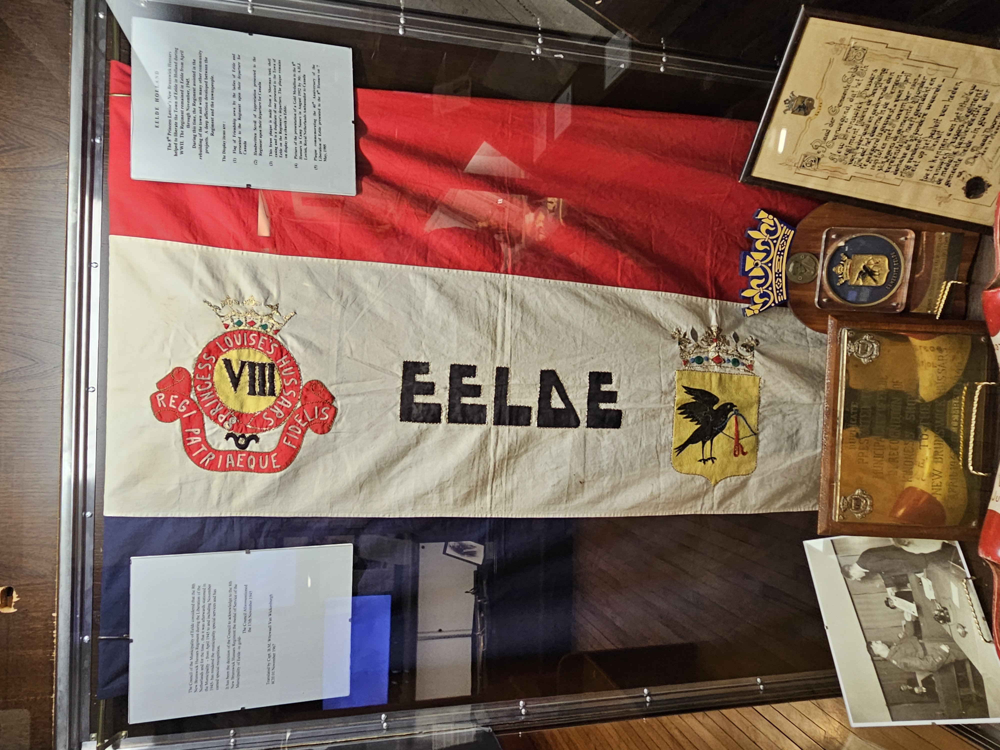

Plaque presented to the citizens of Eedle by the Hussars.

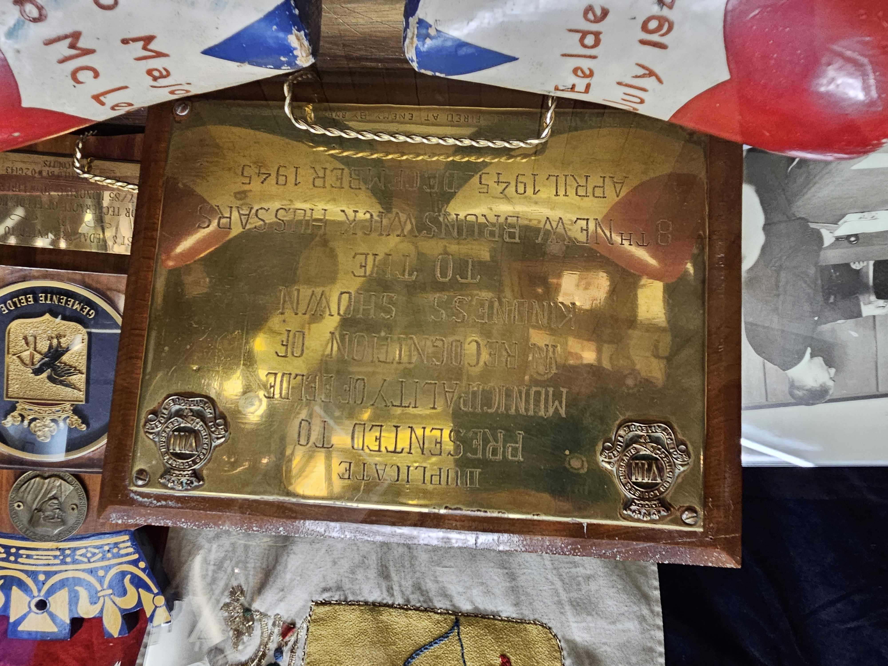

Most of the men had been away from home for 4 years and became very close to the people of Eedle. Maj MacDougall with Minica.

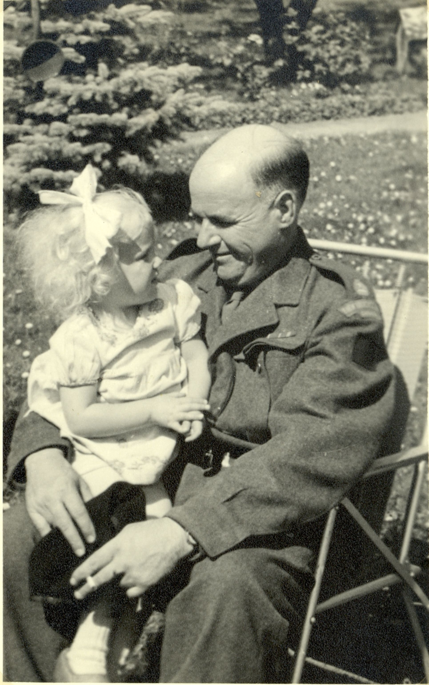

## Final Inspection

The Hussars gathered for a Final Inspection at Eedle, Netherlands on 23 May 1945. The 8th Canadian Hussars were reviewed by General Crearer, Officer Commanding the 1st Canadian Army, accompanied by LGen Charles Foulkes and LGen Guy Simmonds, 1st and 2nd Canadian Corps Commander, and MGen Bert Hoffmeister 5th Armoured Division Commander.

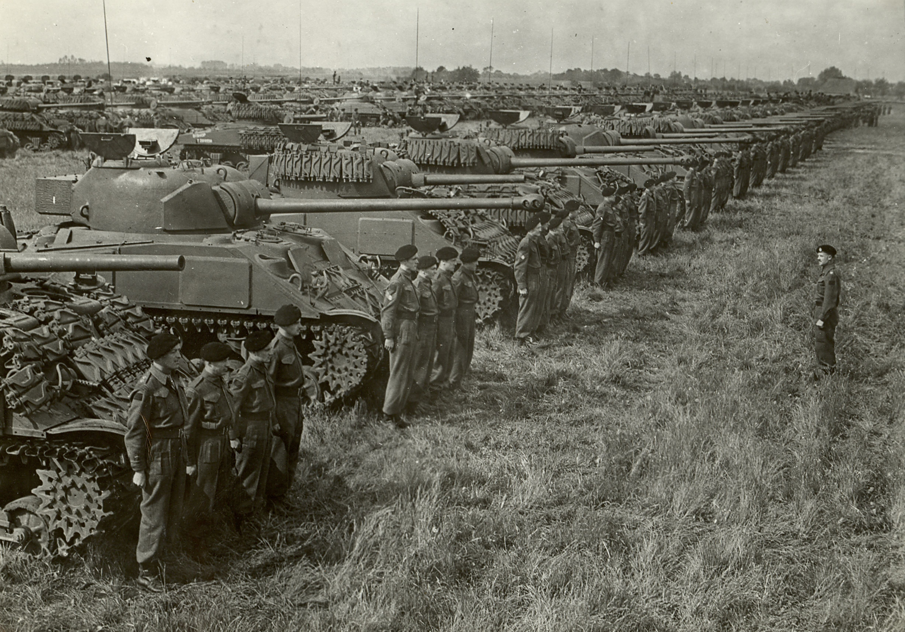

The final drive past of the reviewing stand.

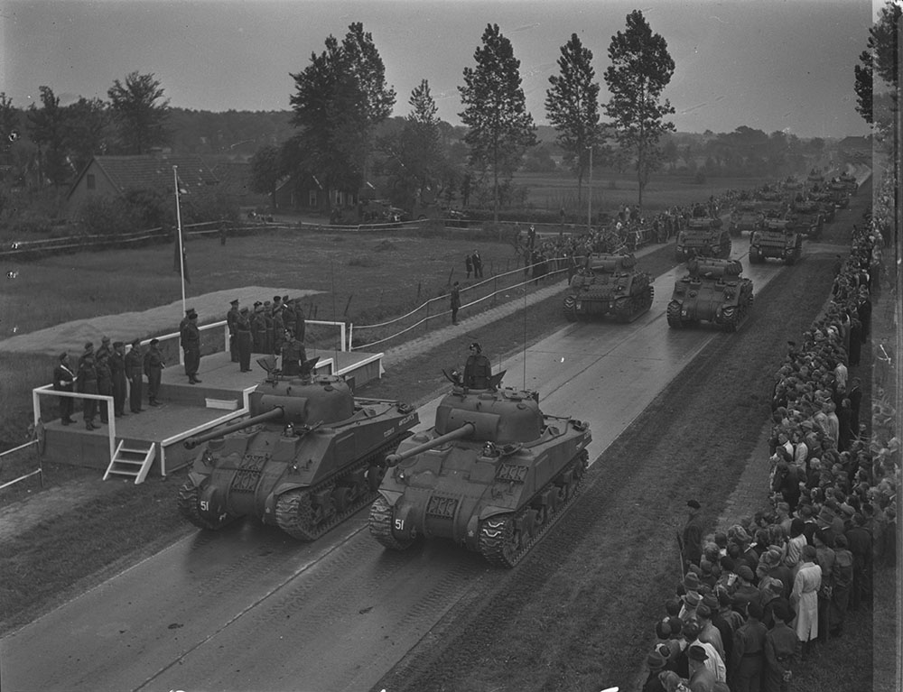

The 5th Canadian Armoured Division together for the final review.

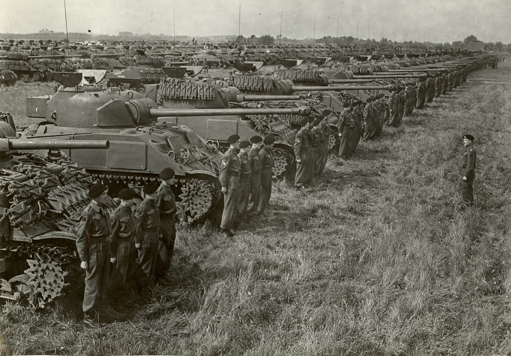

# Medals

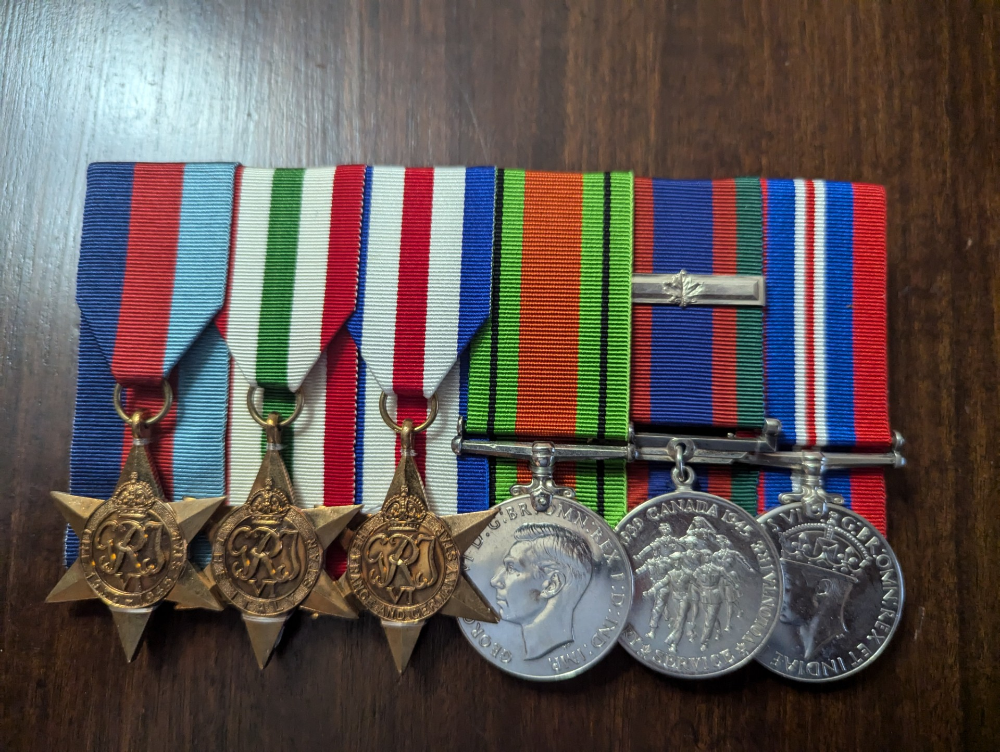

**Norm Kightley’s Medals**

Norm spent a total of 5 years and 3 Months in uniform ,with 45 months Overseas serving in the UK, North Africa, Italy, France and Holland, earning the following medals for his service:

·         1939-45 Star

o   6 months service on active operations

·         Italy Star

o   Service in Sicily or Italy

·         France and Germany Star

o   Service in France, Belgium, Holland or Germany

·         Defence Medal

o   6 months service in Britain

·         Canadian Volunteer Service Medal (with Clasp signifying Overseas Service)

o   A total of 18 months Voluntary Service

·         War Medal 1939-45

o   Full time service in the Armed Forces

# After The War

Many of the Hussars remained in Eedle until January 1946. The troops were returned home based on their time overseas. Uncle Norm returned in July 1945, having arrived in the UK in November 1941. He was discharged from the army on September 29, 1945, at the age of 24 years, 7 months. In comparison, great Uncle George Johnston did not return home until 16 Feb 1946 as he had only gone overseas in September 1944.

Norm and his brother-in-law and our uncle, Don Wilson jointly purchased a two-man chain saw and worked in the bush cutting logs. Later, Norm joined the Signals division of Canadian National Railway and worked for his other brother-in-law, Garnet Allen, installing signals across Northern Ontario. Norm’s wife, Marjorie travelled with him, living in a rail car and acted as cook for the signals gang. While working in Folyett, Norm got very ill and was taken by train to the Hornepayne Red Cross Hospital. A surgeon had to be brought in from Sudbury by train to perform a partial removal of his stomach. At the time of the surgery, the Hornepayne Red Cross Hospital only had two beds and an operating room.

The signals crew working outside Oba, ON.

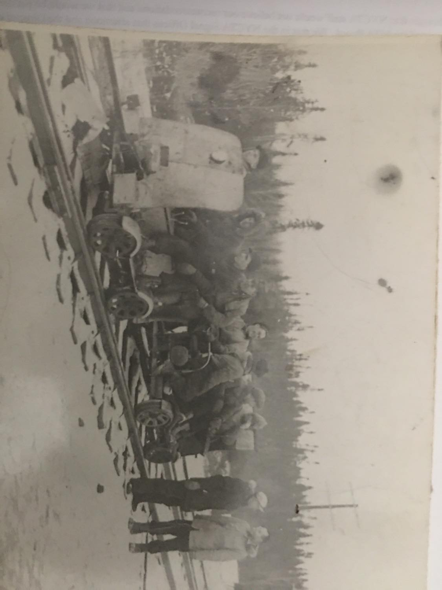

Norm continued working for Canadian National Railway until he passed away on May 26, 1979.

# Body Count

## 8th Hussars

In the battlefield accounting with the enemy, there was every cause for pride. 66 Hussars were killed in battle, almost half of them lost in September 1944 in the battle of the Gothic Line. Another 187 Hussars bore in their flesh and bones the marks and scars of wounds sustained in action. Some would be seriously maimed and hampered for life. The majority were more fortunate. The infantry battalions of the 5th Armoured Brigade each averaged 200 soldiers killed due to their increased exposure to artillery and small arms fire.

Hussars buried in the Netherlands.

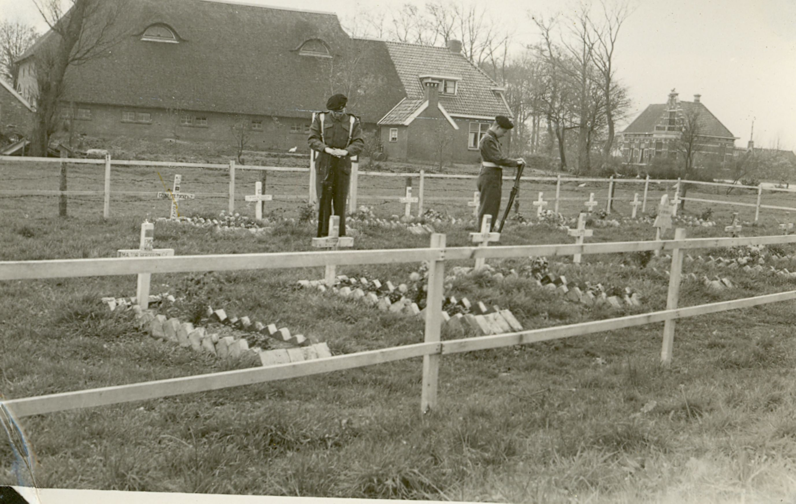

In enemy prisoners and dead, it had accounted for virtually the equivalent of a fighting brigade. For every Hussar who had fallen in action or been fatally wounded, more than 25 Germans had been killed. For every Hussar tank knocked out, nearly three of the tank's natural enemies--tanks, anti-tank and self-propelled guns--had been destroyed. Not one Hussar had been taken prisoner.

For this formidable record, and for its relatively low casualty record, the Regiment could offer thanks to a number of factors. The steel skins of their tanks had saved a good many lives. The long months and years of training, going back to England and back to Borden and Sussex and back beyond that into the long, arid years before the war, all these had helped. Good leadership and discipline had helped. The quality of the men themselves was of prime importance. A deep sense of teamwork and comradeship was a regimental hallmark. Good leadership had been its lot. But with all these things, it still remained a deeply rooted conviction of the average Hussar that his was a lucky regiment. That feeling in itself, whatever its mystic roots, had been a factor of no meagre significance all through the months of action.

## Canadians

Of the 92,757 Canadians of all ranks who served in the Italian theatre (the figure includes 1178 members of the 1st Special Service Battalion) more than a quarter became casualties. The killed numbered 408 officers and 4991 men; the wounded 1218 and 18,268 respectively; and 62 officers and 942 men were taken prisoner. The addition of 365 who died from causes other than enemy action brings the total Canadian casualties to 26,254. Approximately 60 per cent of these were suffered in the five major operations in which the Canadians were engaged, for, as we have seen, the men who wore on their shoulders the name of Canada were identified with the costliest struggles of the entire campaign.

Total Canadian battle casualties in these operations were: Sicily, 2227; the Moro River and Ortona, 2605; the Liri Valley, 3713; the Gothic Line and the Battle of the Rimini Line, 4511; and the advance from the Montone to the Senio, 2581.

## Totals

From the invasion of Sicily until 2 May, when the fighting ended, total Allied losses totaled 320,955, while the enemy losses had reached 658,339.

# War Stories

## House Call

Like most of the men who served in conflict, Uncle Norm almost never discussed his time in battle. The only story I ever heard happened in Italy. The regiment was taking fire from a single house and a number of high explosive rounds hadn’t discouraged the Germans. So, the tank commander decided to run his tank through the building to flush the survivors out. They successfully demolished the house with the tank, but unfortunately, the house was one of the few with a basement, so they crashed into the basement with the house collapsing on top of them. The crew was ok, and the tank salvaged, but they were mocked for their house call for an extended period of time.

## Tank Tragedy

The other family story was that Norm was the sole survivor of his tank, with the other 4 crew members killed. There were 66 Hussars killed throughout their war, so I took a look at the deaths to see if I could corroborate the story. There are two days in the Liri Valley Fighting in May 1944 where 4 or more tankers were killed on a separate day, as well as five separate days during the fighting on the Gothic Line. Usually, when a tank was hit one or two crew men would be killed, but if the ammunition was hit the tank would catch fire and explode. More often, when a tank was hit, the crew got out but could be killed by machinegun or artillery fire. So, it is definitely possible, but the Hussar Regiment histories describe many of the losses and there is no mention of four killed on a single tank.

## Group Photo

In the book New Brunswick Hussar, the story of Corporal Harold Skaarup, who was killed in the Battle of the Gothic Line on 31 August 1944, was written by Harold Skaarup, nephew of the deceased. In Corporal Skaarup’s belongings was a camera with a partially exposed roll of film. The family had the film processed and it contained a number of photos, mostly of Harold’s crew. One of the photos potentially includes Uncle Norm.

The caption reads:

Harold’s tank crew in the field in Italy. Sherman Allen is the first on the left, [#2](https://www.paulsbattlefieldtours.com/blog/hashtags/2) is M.T. Brewer G522, Harold is third from the left, [#4](https://www.paulsbattlefieldtours.com/blog/hashtags/4) (unknown), and [#5](https://www.paulsbattlefieldtours.com/blog/hashtags/5) seated on the right is “Doc” MacCallum. (This is either Guy E. MacCallum G800, or Vincent G. MacCallum G804).

We think the unknown tanker second from the right may have been Uncle Norm. The facial features are similar, and his pose is very similar to other family photos according to brother Kurt. So, we are not positive but will claim him until proven wrong.

The story of the battle from the book New Brunswick Hussar:

*The battle continued for most of the day, but at some time between 0915 and 1030 hours on the morning of the 31st of August, Harold’s tank (a Sherman Mark V nick-named “Acorn”) was hit by a shell fired from a German 88mm anti-tank gun. The shot entered the side of the tank just under the turret and took off both of Harold’s feet. All four of the tank’s crewmembers baled out of the burning tank, but just as they did so, a salvo of German mortar shells (possibly from a six-barreled “Nebelwerfer” mortar) landed in the midst of Harold’s tank crew. Already badly injured, Harold was hit again, this time with shrapnel fragments entering his chest. He was evacuated to a field hospital in the rear area but died from his wounds at the age of 24 on the 6th of September 1944.*

A picture of Norm (on the Right) in Italy. My theory on this shot is that this was Norm's crew taken later in the Italian campaign when the tanks were operated with 4 crew due to personnel shortages.

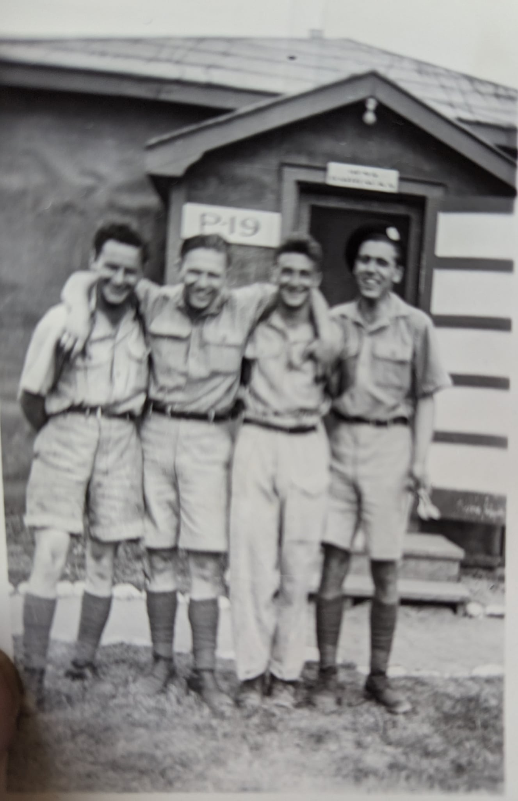

# Princess Louise

Her story taken from Steel Calvary by Lee Windsor.

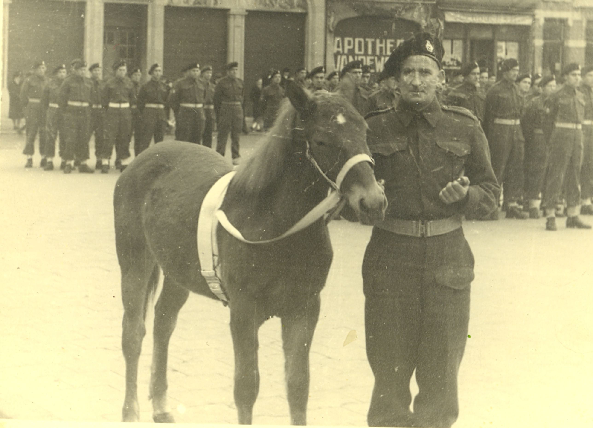

One new member officially added to the ranks differed from all the rest. She had four legs. She came to them from a farm in the valley of death between Graveyard Hill and Coriano Ridge. Accounts of when she joined them vary as to the date, but two witnesses agree that it was probably September 4, during the first Hussar drive on Coriano. Hunter Dunn and “A” Squadron spotted a foal only three- or four-months old pacing fearfully in the middle of the boiling, fire-swept battlefield. She was bleeding and starving, having beaten down a path around the body of her mother, killed by a shell. The squadron radioed back to the “A” echelon fitters coming along behind to recover damaged Shermans to rescue the foal before she met her mother’s fate. The fitters brought the injured animal to Lance-Sergeant Gerald Kelly and the medical officer at the regiment’s aid post, located dangerously close to the front. The M.O., Dr. Tom Dalrymple, grumbled about not being a horse doctor, but he and Kelly tenderly bandaged the wounds on her leg and belly anyway. They were not deep. The regimental history records that she was given that special tot of His Majesty’s service-issue cure for all that ails: “From the beginning, she was a true Maritimer in her appreciation of a shot of rum.” The foal’s rescue offered a glimpse of peace and hope for the future amid a war that was still yet to be won.

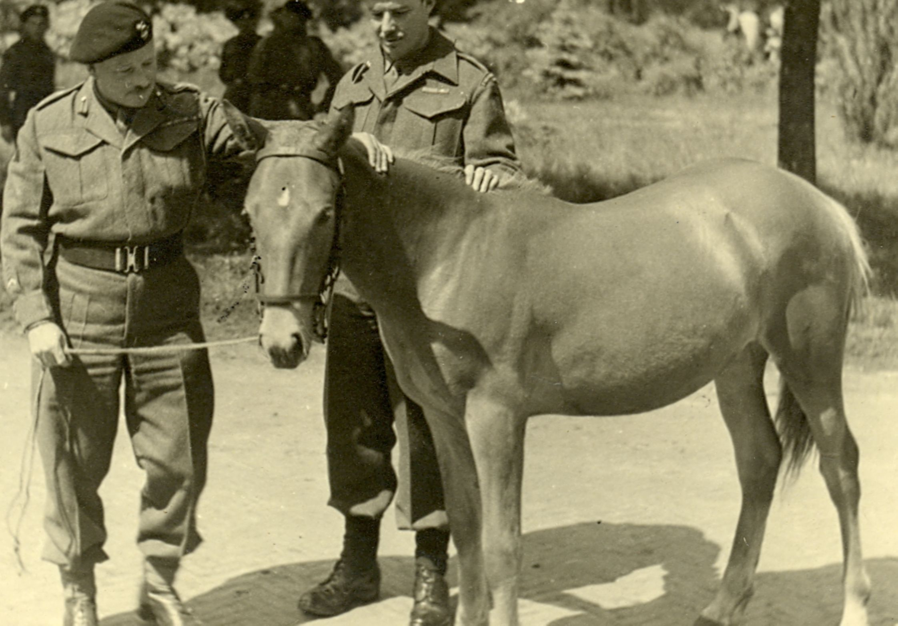

During the hard days around Coriano, Jack Boyer’s fitters kept her hidden behind the front with the “A” echelon vehicles. They named the young horse “Princess Louise.” By the time the regiment moved to San Giovanni to rest, word of the rescue had spread throughout the ranks. The 8th Hussars made Princess the regimental mascot. For the first time since the mid-1930s, the New Brunswick cavalrymen once again had a horse in their midst. Boyer and the fitters took steps to keep their acquisition quiet, while Major Bob Ross ran interference with higher headquarters.

Through a combination of trickery and ingenuity, they smuggled her with them through the rest of the campaign in Italy and from there to France and the Netherlands in 1945. There was a strict rule that no livestock was allowed on the ship from Italy, but that did not stop the Hussars.

"She was smuggled across in a three-ton truck. We built her a little home at the front of the back section, made a false end and covered it with a tarpaulin, and loaded the rest of the truck with supplies. We put in enough feed for several days, and we sent Tpr. A. E. Jackson along as her companion. We even had it figured out how to keep her from neighing.”

It worked. If anyone outside the Regiment suspected what was going on, they kept the secret.

After the war, they even managed to bring her home with them, where she lived out her days until 1973. The regiment’s love and devotion to Princess Louise became legendary. Princess Louise was granted Naturalized Citizenship of Canada and proclaimed as a Freewoman of Hampton New Brunswick.

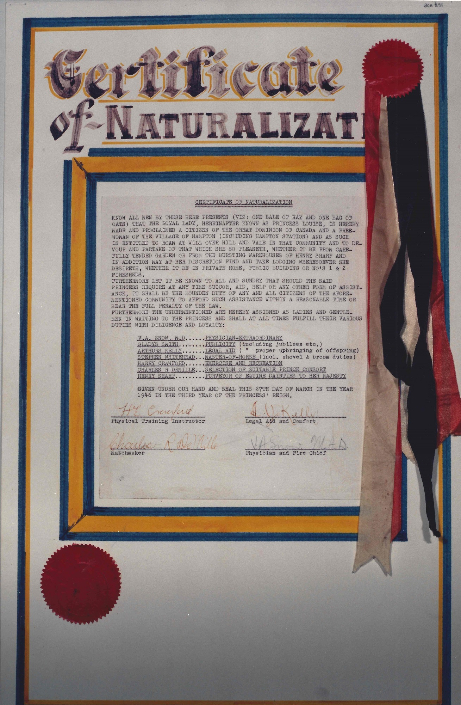

Here she is at her Citizenship Ceremony.

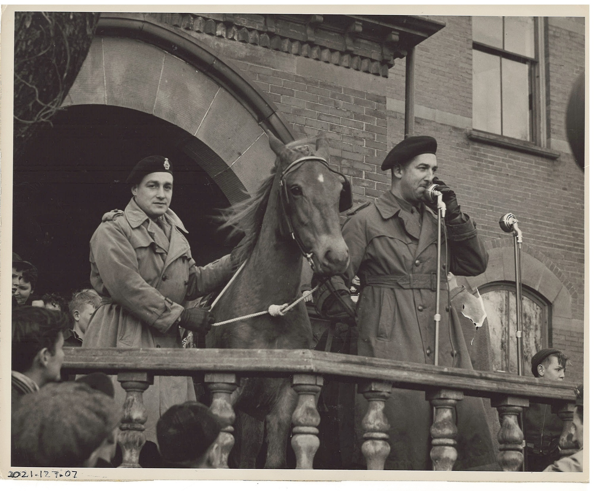

After the ceremony, it was obligatory that Princess Louise go to the mess.

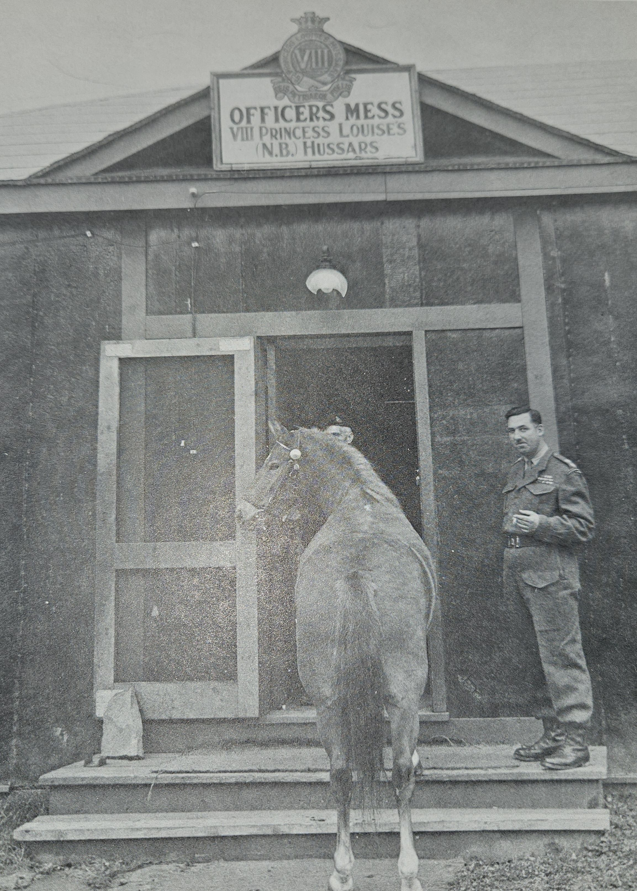

Very important for her future hydration, she also signed up as a member of the Hampton, NB Legion, with her hoof print signature.

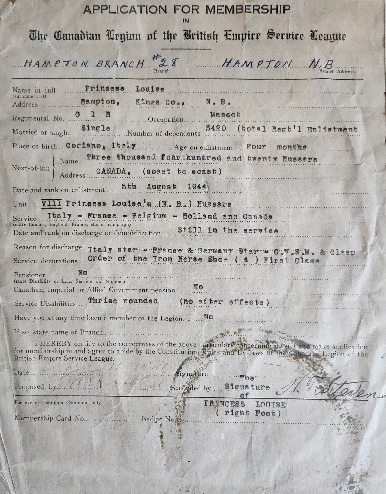

The medal collection of the first Princess Louise on top of her parade blanket.

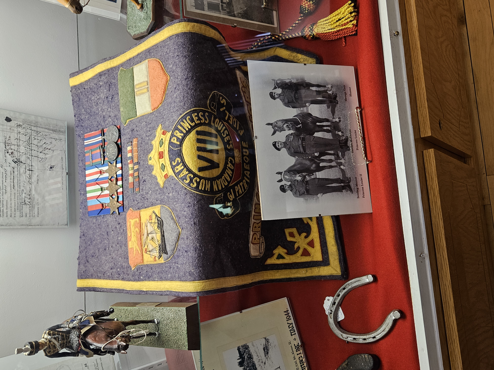

Mother and daughter in 1954.

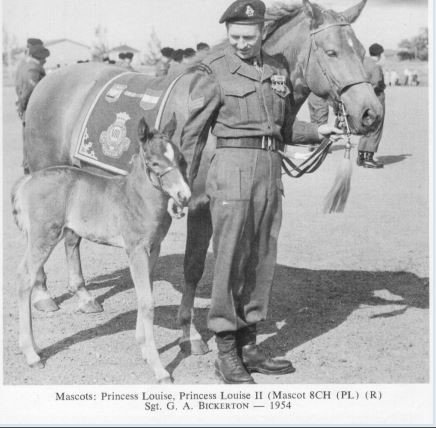

The second Princess Louise proudly wore this blanket on parade.

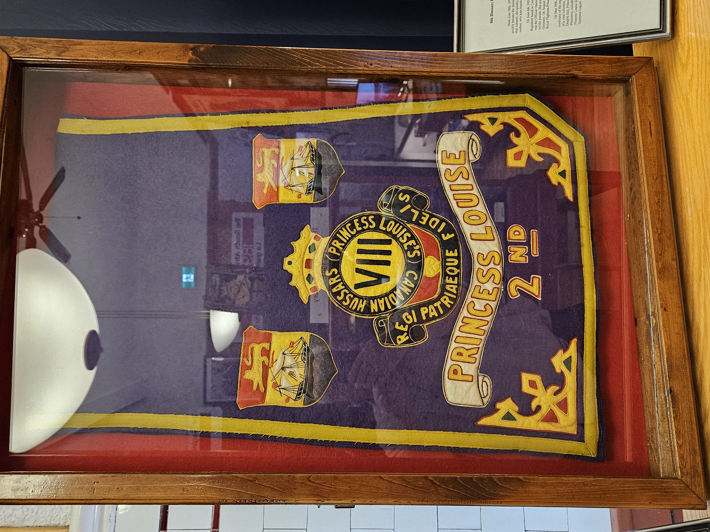

Princess Margaret inspection of Princess Louise II in 1958. Princess Louise, I served until 1973 and her daughter until 1981. Sadly, Princess Louise III passed away shortly after her birth in 1969.

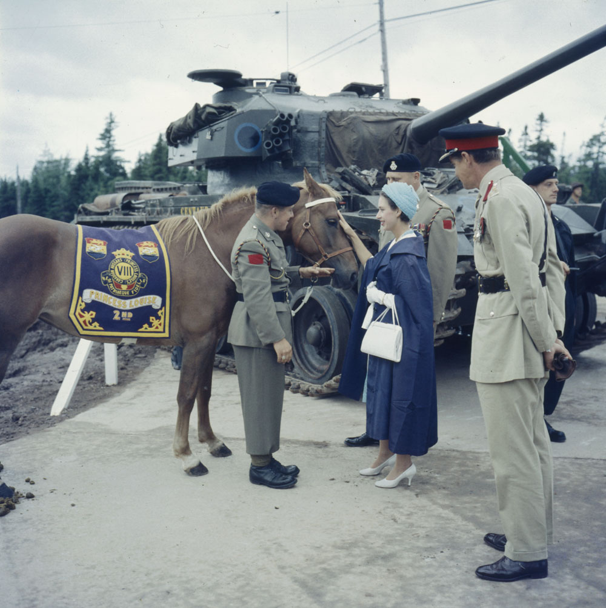

Prince Phillip was the Colonel in Chief of the 8th Hussars from 1953 until his death in 2021. Princess Anne is the present Colonel In Chief and attended the 175th Anniversary of the Regiment in 2023.

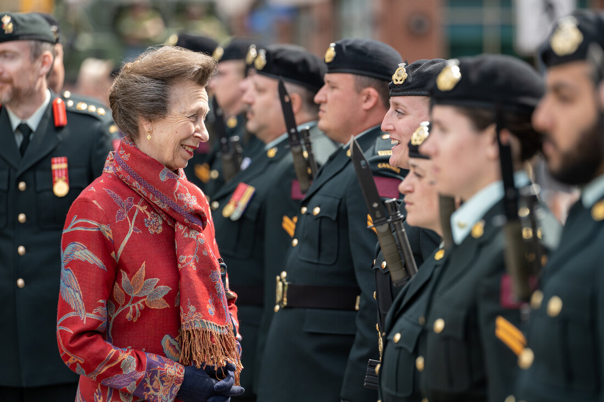

The story of Princess Louise highlights the lengths that the troops will go for a small bit of normalcy in their lives.

* [Second World War](https://www.paulsbattlefieldtours.com/blog/categories/second-world-war)
* [Family](https://www.paulsbattlefieldtours.com/blog/categories/family)