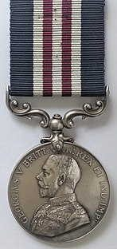
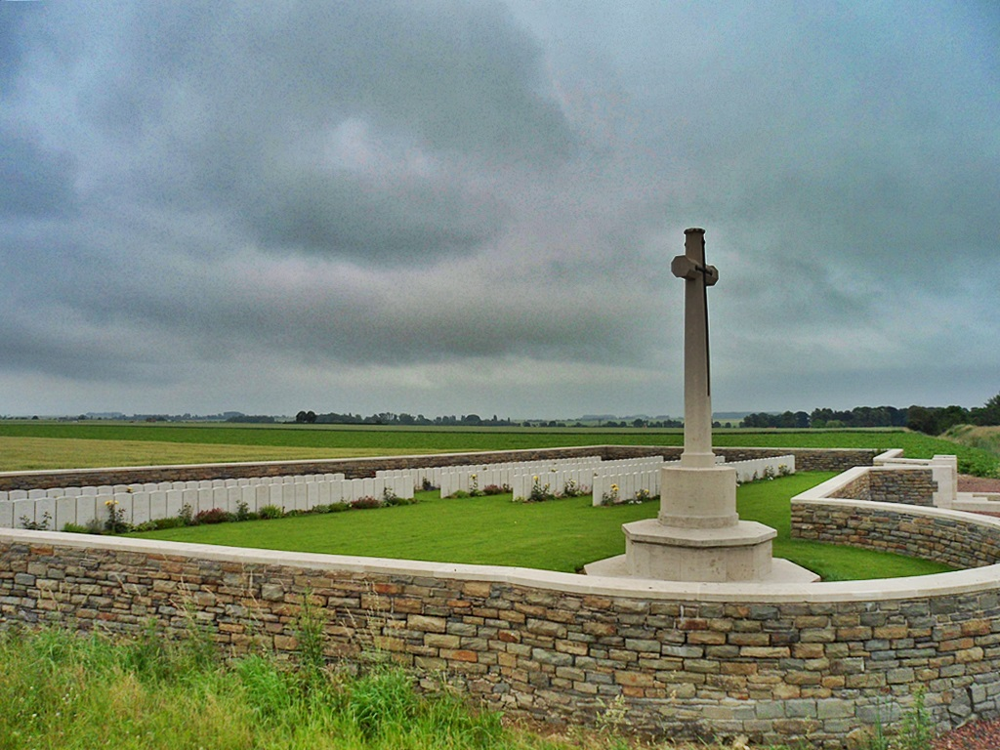
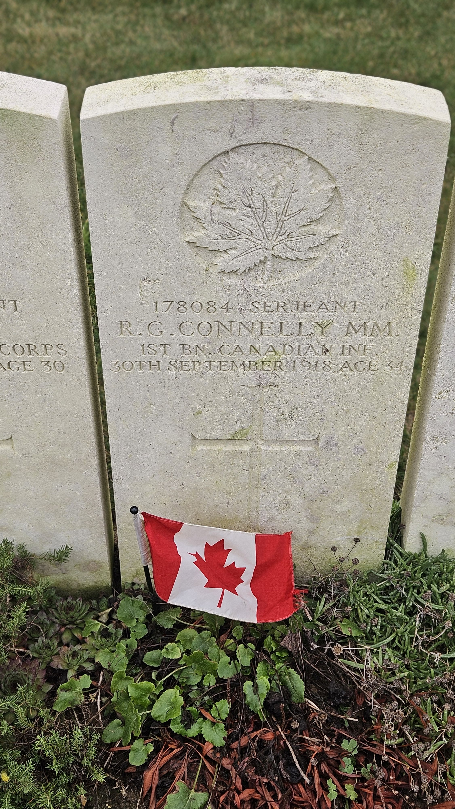

# Sgt Robert Connelly

* [pd-allen](https://www.paulsbattlefieldtours.com/profile/pd-allen/profile)
* Jan 8, 2024
* 8 min read

Updated: Jun 29, 2025

# 178084Sergeant Robert George Connelly, MM

# 1st Battalion Canadian Expeditionary Force

# EARLY YEARS

Robert George Connelly was born on the 24th of July 1884, in Bryson Quebec, son of Robert Connelly and Margaret McTiernan, one of 12 Children.

Robert Sr’s father, William, had immigrated to Canada in 1844 from Ireland. Shortly after his arrival, he married Margaret Atkinson. In 1868, he was awarded a 100-acre land grant in Pontiac Quebec. There he farmed and raised 12 children.

Robert worked as a prospector before joining the Army in December 1915, at the same time as his brother Fred (age 21), and they both served in the 1st Battalion Canadian Expeditionary Forces (CEF). Their brother Ernest had also joined the Army in June 1915.

# ENLISTMENT

Robert enlisted in North Bay, Ontario on the 9th of December 1915 at the age of 31, and was assigned to the 87th Battalion (Canadian Grenadier Guards). The Guards were based in Montreal but recruited in mining towns of Northern Quebec and Ontario.

The 87th Battalion, including Robert and Fred, sailed from Halifax on the 23rd of April 1916 aboard the 'Empress of Britain.' They arrived in Liverpool on the 4th of May, and were assigned to the 1st Battalion on the 16th of June 1916, as replacement for the losses suffered by the first Battalion at Mont Sorrel. The Canadian Corps lost 8,000 men killed or wounded and 536 were taken prisoner during this period. The 1st Battalion suffered 37 killed, 276 wounded and 69 missing, during the Battle of Mont Sorel.

In order to replenish the Battalion, a draft of 280 men from the 87th Battalion was received on the 21st of June as the 1st Battalion was in the rear at the Connaught Lines, resting and training.

My Grandfather was transferred from the 70th Battalion to the 58th Battalion as a replacement for the losses also suffered at Mont Sorrel.

# 1ST BATTALION

The first Battalion spent a few weeks in reserve training and reorganizing before re-entering the front lines east of Zillebeke and south of Hill 62. They moved to the Ypres-Commines Canal before moving to the Somme.

They arrived in Albert on the 31st of August and replaced the Australians during the final stages of the Battle of Pozières. They moved up to Courcelette on the 20th of September to replace the 4th Battalion, and continued in the push, also fighting at the Battle of Regina Trench.

The Battalion then moved into the Vimy Ridge area to prepare for the assault in 1917.

Robert was promoted to Acting Corporal in October 1916, and confirmed as Corporal in January 1917.

At Vimy Ridge on the 9th of April 1917, the 1st Canadian Division was on the right of the line and had to cross 4,000 yards to reach their final objectives. The soldiers advanced under a creeping artillery barrage (where a line of shellfire was targeted just in front of the advancing troops and kept it moving forward to shield the men as they crossed the battlefield).

The 2nd and 3rd Brigades led-off the assault, and secured the red and black-lines, before the 1st Brigade passed through and took the blue and brown-lines. Advance to the black-Line (Zwolfer Weg, the German Front line trenches), and then to the red-line was varying degrees of opposition. Some Battalions met very little opposition, while others suffered 50% casualty rates.

1st Division Troops reached the red line by 07.00hrs. The 1st Battalion was ready to move forward but had to wait until 09.35hrs for the artillery creeping barrage to continue. The blue-line was occupied by 11.00hrs, with relatively few casualties, and 1st Battalion dug in to protect against counterattacks.

3rd and 4th Battalions pushed on to the brown-line, capturing it around 13.00hrs. 1st Division had lost 2,500 men during their 4,000-metre assault, taking more than 1,200 prisoners. By sunset on the 9th of April, the Canadians controlled the ridge line.

The Canadians suffered 7,707 casualties for the 9th and 10th of April, including 2,967 dead. The remainder of Hill 145 was cleared on the 10th of April, and an attack on 'the Pimple' (a135m hill, 2,000 yards north of Hill 145) on the 12th of April completed the capture of Vimy Ridge, after multiple failed attacks by French and British Troops.

The 1st Battalion casualties for the Battle of Vimy Ridge were 2 officers killed, 5 wounded. Other ranks suffered 47 Killed, 26 Missing and 156 Wounded.

Second Division led the attack in the Battle of Arleux-en-Gohelle on the 28th of April, and the First Division led the attack in the Battle of Fresnoy on the 3rd of May 1917.

The Canadian attack of the 3rd of May was in effect a continuation of the successful assault on the Arleux Loop five days before. Principal target was the hamlet of Fresnoy, which lay, its red-roofed houses little damaged by war, in a slight depression beside the Drocourt road.

Three battalions of the 1st Canadian Brigade took part in the operation. While the 2nd Battalion attacked the village itself, the 1st and 3rd Battalions went respectively against the woods on the left and the right.

The attack started with a heavy artillery barrage at 03.45hrs, and by 05.45hrs the 1st Battalion had reached its objectives.

The Germans launched several counterattacks, the first commencing at 12.45hrs, but the attacks were successfully repulsed. The Germans heavily shelled the Canadians, and despite repeated counterattacks, never got closer than 75 yards to the line. By 19.45hrs, most of the officers, and many of the NCOs had been killed or wounded.

Heavy shelling continued throughout the next day. The 1st Battalion was relieved on the 5th of May. The British 5th Division took over from the Canadians, and after 2 days of extensive shelling, Fresnoy was retaken by the Germans.

The 1st Battalion suffered many casualties, with 4 officers killed and 16 wounded, 48 Other ranks were killed, 70 were missing and 208 were wounded. After being relieved, the battalion moved to the Coupigny Huts east of Lens for training and restaffing.

They remained in Coupigny until the 9th of June when they moved to Thelus Cave, and back into the line.

The 1st Canadian Division Memorial is located near Thelus.

# MILITARY MEDAL

General Arthur Currie took command of the Canadian Corps in June 1917, and the Battle of Hill 70 was the first attack of the Canadian Corps under Canadian command.

General Haig launched the assault on Passchendaele on the 31st of July 1917 and ordered the Canadians to attack Lens to draw reserves from the Flanders Front. General Currie was determined to take Hill 70 outside of Lens first, as the Germans would fiercely defend the high ground.

The Canadians mounted very effective counter-artillery fire, and advanced behind a creeping barrage, smoke and gas attacks. The attack was success with all objectives being met by 18.00hrs.

The Germans launched five unsuccessful counterattacks on the 15th of August, and a total of 21 over the duration of the battle.

On the 17th of August, the 1st Battalion moved forward at 17:00hrs, to relieve the 5th, 7th, 8th and 10th Battalions. The Battalion was severely bombarded with gas shells. Mustard gas had recently been introduced by the Germans and was debilitating to anyone not wearing protective equipment.

After a great deal of difficulty locating the units, the relief was complete at 05:50hrs.

The Battalion did not see much combat, so spent most of the time delivering food, ammunition, and lights to the forward trenches. They also strung wire and spent time cleaning and fortifying the positions. Despite the relatively quiet period, the 1st Battalion suffered 5 killed and 37 wounded during their four days in the front lines.

The Canadians then moved into the Passchendaele area to revive the flagging British assault.

The 3rd and 4th Divisions lead the initial assaults on the 26th and the 30th of October, and the 1st and 2nd Divisions led the assault on Passchendaele Ridge on the 6th and the 10th of November.

The Princess Patricia's Canadian Light Infantry (PPCLI) led-off the 1st Division assault, and the 1st Battalion passed through them from the blue-line and secured the area north of Passchendaele village by the end of the day.

The Canadians suffered 16,404 casualties over the campaign with 12,403 sustained between the 26th of October and the 11th of November, with more than 5,000 killed. The ratio of killed to wounded was close to one to two, instead of the usual one to three, because many wounded drowned after falling unconscious.

The total losses over the 109-day campaign were 275,000 for the British and Commonwealth and 220,000 for the Germans.

Although the 1st Battalion took their objectives quickly, there were a large number of casualties, with over half of the battalion killed or wounded, with 289 casualties out of the initial strength of 547.

Robert Connelly was awarded the Military Medal for his actions at Passchendaele. His citation reads:

"At Passchendaele, on Nov 6th, 1917, this NCO was in charge of a Platoon, the Officer being called upon to take charge of the company upon the Commander of the Company becoming a casualty. This NCO displayed marked tact and efficiency in handling his men and guiding them to their objective. He consolidated his portion of the line and reported for further instructions during a heave bombardment by the enemy. He exposed himself to heavy shell fire in order to assist a wounded comrade whose escort was dispersed by a shell falling near and led him to the dressing station."

Robert was promoted to Sergeant on 13 December 1917.

Military Medal Awarded to Robert Connelly ~ 06 Nov. 1917 (copyright unknown)

# LAST 100 DAYS

The Battle of Amiens started on the 8th of August. That day was the most successful of the war, with troops advancing 11 km.

The 1st Battalion was in reserve on the first day and pursued the assault on the 9th of August. The 1st Battalion met their objectives and suffered only 61 casualties. The Canadians suffered a total of 11,822 casualties over the battle, and captured 9,211 prisoners, 201 guns and 755 machine guns.

The Canadian received 12,000 replacements from the 5th Division located in England, so were able to fight the next battle at full strength.

The Canal Du Nord was not complete, so General Currie decided to cross over a small dry section. The canal presented a significant obstacle; the banks were several metres high, and it was unclear what awaited the Canadians on the other side.

The area around the canal had been deliberately flooded by the German Army, leaving a small area roughly 2km wide that was still dry. To cross the canal, the Corps would be squeezed into a small front, and then would have to fan-out to secure the rest of their section. Additionally, while tanks and infantry could cross quite easily, the artillery could not; Currie’s plan therefore, required the Canadian Engineers to install several portable bridges, likely under heavy fire, to allow the artillery across.

Once the initial canal crossing was achieved, the 1st Battalion followed the 4th Battalion to the red line. The Battalion crossed the canal at 06.20hrs, 60 minutes after the initial barrage. The 4th Battalion secured their position at the red-line on schedule and at 08.24hrs the barrage lifted, and the 1st Battalion advanced through the 4th Battalion and headed to the green-line.

The artillery barrage had been effective, so there was no large-scale resistance, but isolated machine gun posts had to be dispatched. Two batteries of enemy artillery started firing at the 1st Battalion over open-sights, leading to higher casualties from both the direct-fire artillery and long-range fire in the area between the red and green-lines.

'A' company on the right made swift progress, but 'B' company on the left were delayed by machine gun fire. All objectives were met by 09.50hrs and the 1st Battalion dug-in to consolidate their gains. The 1st Battalion suffered 140 casualties from the assembly to the taking of the green line.

At 12.30hrs the next day, the Battalion moved into position south-east of Haynecourt and at 17.30hrs on the 29th of September 1st Battalion relieved the 8th Battalion in the front line.

On the 30th of September, the 1st Battalion regrouped and prepared for an assault on Abancourt on the 1st of October. Although there were no advances, heavy shelling and machine gun fire harassed the battalion.

Sergeant Robert Connelly was killed by machine gun fire on the 30th of September, just south of Epinoy - a mere six weeks before the end of the war.

(From J.L. Granatstein's book, 'The Greatest Victory')

The 1st Battalion had 6,500 men pass through its ranks since its formation in Valcartier in 1914. The Battalion lost 49 officers and 699 men, and suffered 126 officers, and 3,055 other ranks wounded. The actual number of soldiers killed is likely much higher.

The CWGC database shows 377 1st Battalion members listed on the Vimy Memorial, 199 listed on the Menin Gate memorial, and a total of 1,409 members Killed.

Sergeant Robert Connelly is buried in Sancourt Military Cemetery.

Sancourt British Cemetery

Sgt Robert Connelly, MM Grave Marker

* [First World War](https://www.paulsbattlefieldtours.com/blog/categories/first-world-war)
* [Family](https://www.paulsbattlefieldtours.com/blog/categories/family)