# Somme Deja Vu

* [pd-allen](https://www.paulsbattlefieldtours.com/profile/pd-allen/profile)
* Jan 24, 2024
* 4 min read

Updated: Jun 29, 2025

I had posted about these locations during previous visit, but they are all iconic locations that tell the story of the Somme, so are well worth revisiting.

# Beaumont Hamel

The Newfoundland Memorial Park at Beaumont Hamel is another spot I have visited each time I have gone to the Somme Region. It is one of the best preserved battlefields on the Somme, and the Canadian War Museum story of the losses of the Newfoundland Regiment at Beaumont Hamel on the first day of the Battle of the Somme was the spark that ignited my interest in the Wars and their Battlefields.

The grounds feature recreated trenches so you can follow the regiment to the front lines.

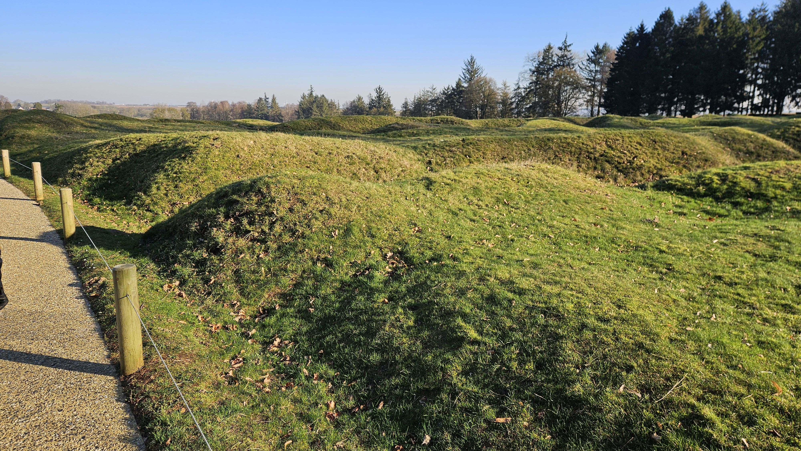

This is a great area to spend a few hours exploring the battlefield from both sides, but it was very chilly on the day we visited with a wicked wind chill, so we said hello the Caribou, paid our respect to the Newfoundland Regiment Missing, and got back into the car. A number of restaurants and sites were closed during our visit, so I googled l’Auberge de la Vallée d'Ancre which was near by and appeared to be open. It turned out to be a Michelin Star restaurant on the Ancre River, so we had a fabulous lunch commiserating on the terrible winter conditions for the troops while enjoying a multi-course feast. This was as close to a Chateau General that I could ever hope to be.

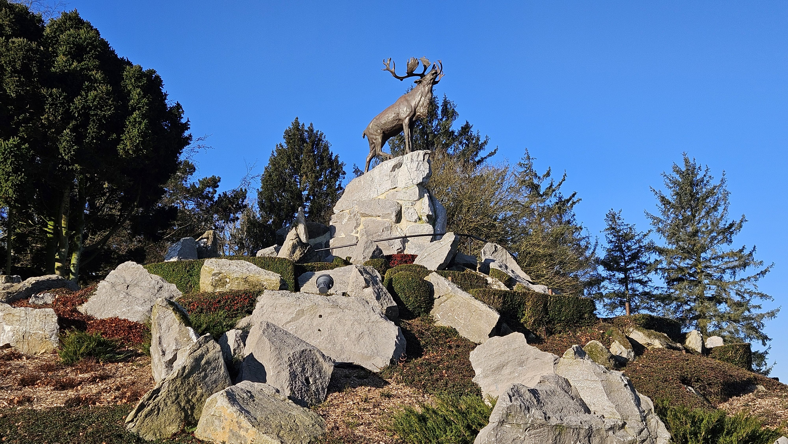

The Regiment deserved more, as they suffered 710 casualties on the first day of the Somme, and only 68 soldiers answered roll call the next day. The initial assault went over at 0730, so by the time the Newfoundlanders were to move forward, the trenches were clogged with dead and dying so a fatal decision was taken to leave the trenches and proceed over land. The regiment was highlighted against the background and in less than 30 minutes the regiment was decimated without reaching the front line trench. The memorial lists the names of the 821 Newfoundlanders missing throughout the war.

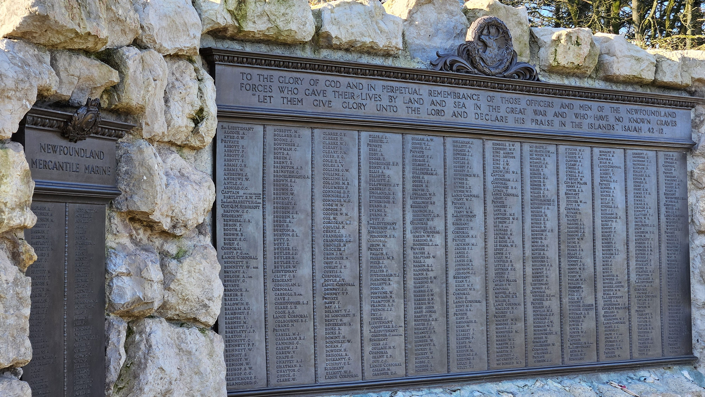

# Lochnagar Crater

The Lochnagar Crater was one of 19 mines blown on 01 Jul 1916, the first day of the Battle of the Somme, and the largest mine blown during the first world war. The Crater was 69 ft deep and 330 feet wide.

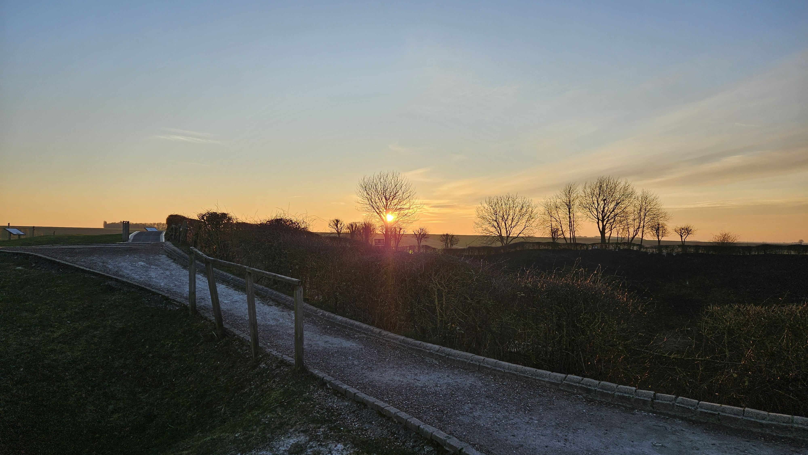

In 1978, Englishman Richard Dunning purchased the crater to preserve the battle site and prevent the crater from being filled in.

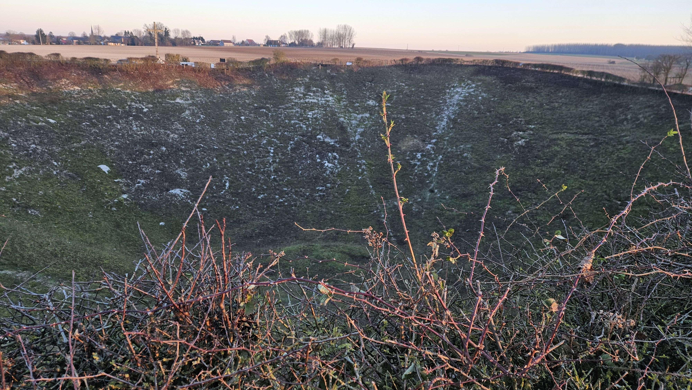

The site as seen from the air. The walking path around the crater has plaques that have been purchased to fund the site development. There are also several other unit memorials on the site, and an annual remembrance is held every 01 Jul to commemorate the mine explosion.

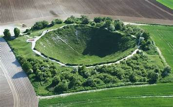

The position of the trenches are shown below.

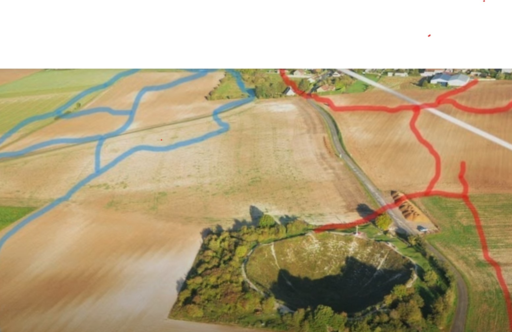

The amount of tunneling involved is impressive. The tunnel was 95 ft deep, and stretched over 900 ft, starting 330 ft behind the British Front Line. In order to maintain secrecy, the miners worked by hand, using a bayonet to carve out the chalk. The spoil was passed hand to hand by miners sitting on the ground. A total of 60,000 pounds of explosive was used in 2 chambers.

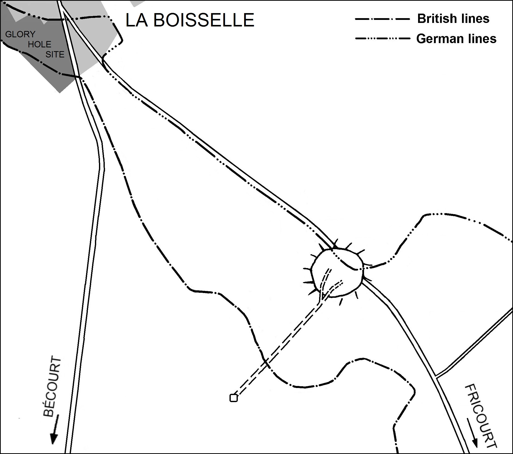

# Hawthorn Crater

I had talked about the Hawthorn Crater during a previous post, but it is one of the iconic locations from the Somme Battlefield, in no small part because the crater was filmed being exploded, and was part of the 1916 Movie “Battle of the Somme” that watched by most of Britain, and is still available today on You Tube <https://youtu.be/xQ_OZfaiUlc?si=gTWFelqB4330UDss>.

The map of the area shows the Sunken Lane, Beaumont Hamel British Cemetery and the Hawthorn Ridge Crater.

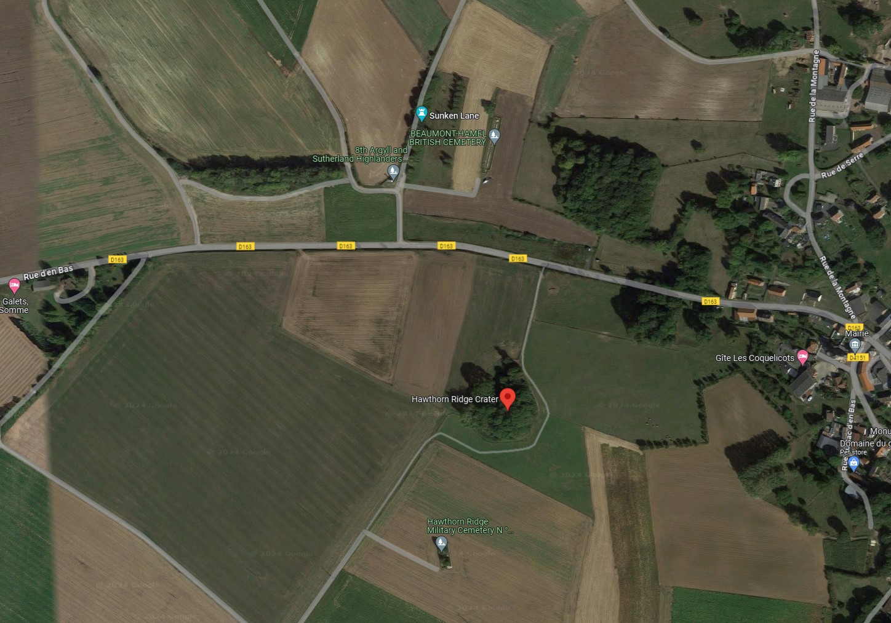

The 1st Battalion Lancashire Fusiliers had moved out of the trenches to the Sunken Lane to shorten their advance. They were filmed waiting in the Sunken Lane before the Hawthorn Ridge Mine was blown. Their advanced position did not help them much as the Battalion suffered over 600 casualties including 208 killed on 01 Jul 1916.

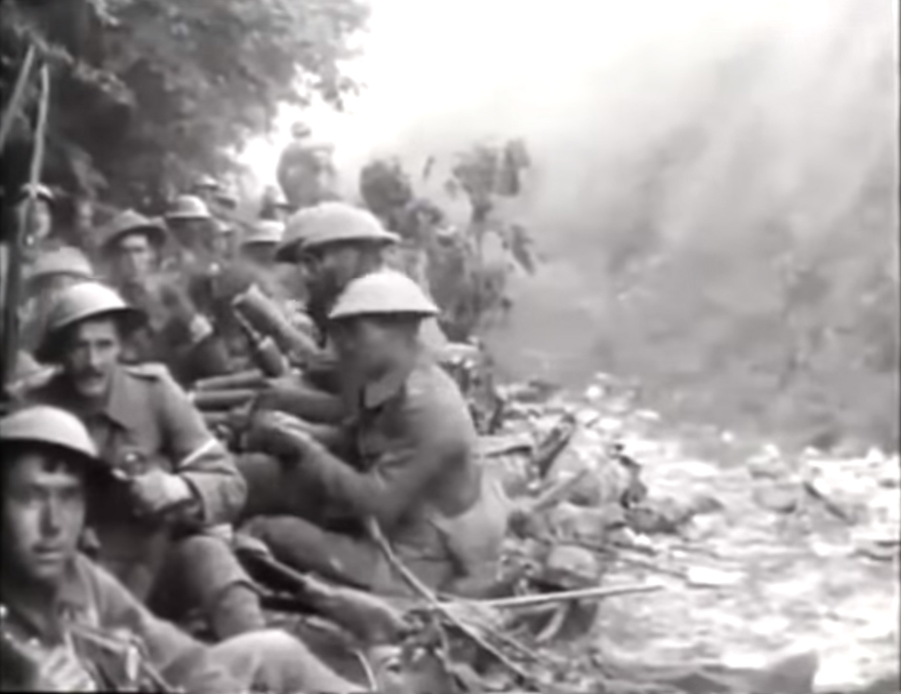

The Sunken Lane as it appears today (reverse angle from the original picture).

The view from the Beaumont Hamel Cemetery up to the Hawthorn Crater. The Crater is the stand of trees at the top of the hill. There is about a 65 ft rise from the Cemetery to the crater, and the ground was an open field, as it is now, so it’s not surprising the British suffered massive casualties.

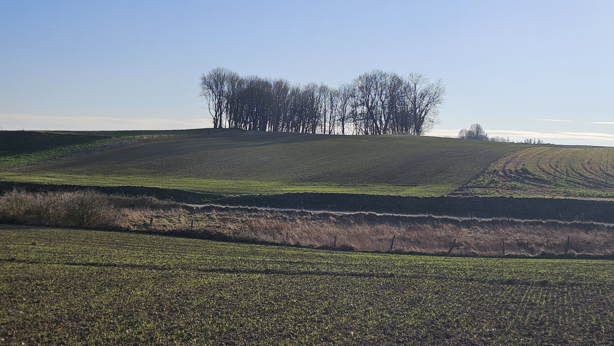

The view from the Crater Ridge shows the daunting task the Brits faced. Beaumont Hamel Cemetery is on the middle right of the picture, and the sunken lane is the strip of trees in the middle of the picture.

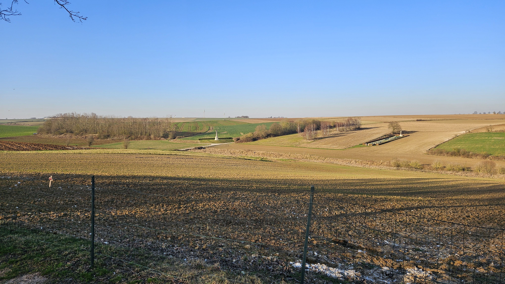

It was only a few degrees below 0 C, but a persistent wind of 30 km/hr made it a chilly day particularly on the exposed hilltop. As the great song writer Tom Waits says “It was colder than a well-diggers ass!” The church steeple at Marie is visible over Wine Bob’s shoulder.

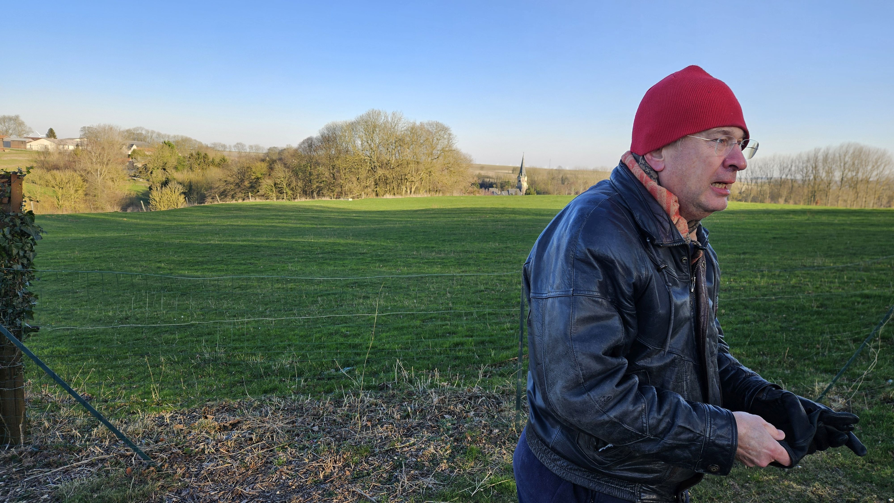

The Crater was blown at 0720 on 01 Jul 1916, 10 minutes before the attack, allowing the Germans time to recover and prepare for the upcoming attack. The photograph shows the crater being blown.

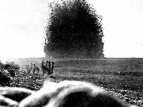

There was a second mine blown in November 1916, so the crater is not quite conical.

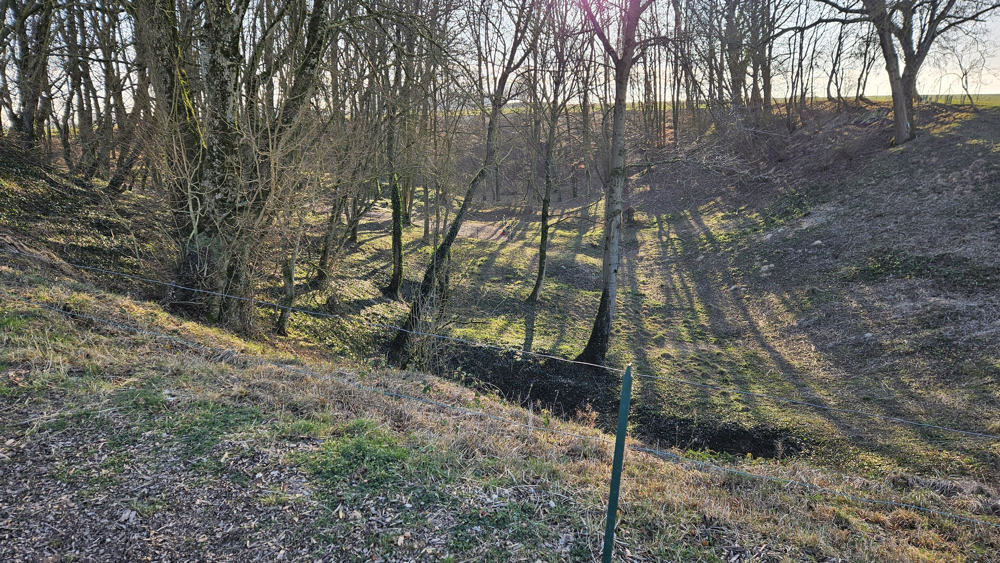

The digging of the tunnel for the mine was another exceptional effort. The tunnel was over 1,050 ft long, and 80 ft below the surface. The mine was packed with 40,000 lbs of explosives and blew a crater 60 ft deep and 200 ft wide. The explosion blew earth several hundred feet into the air.

The miners played a critical role in the Battle of the Somme, and throughout the War.

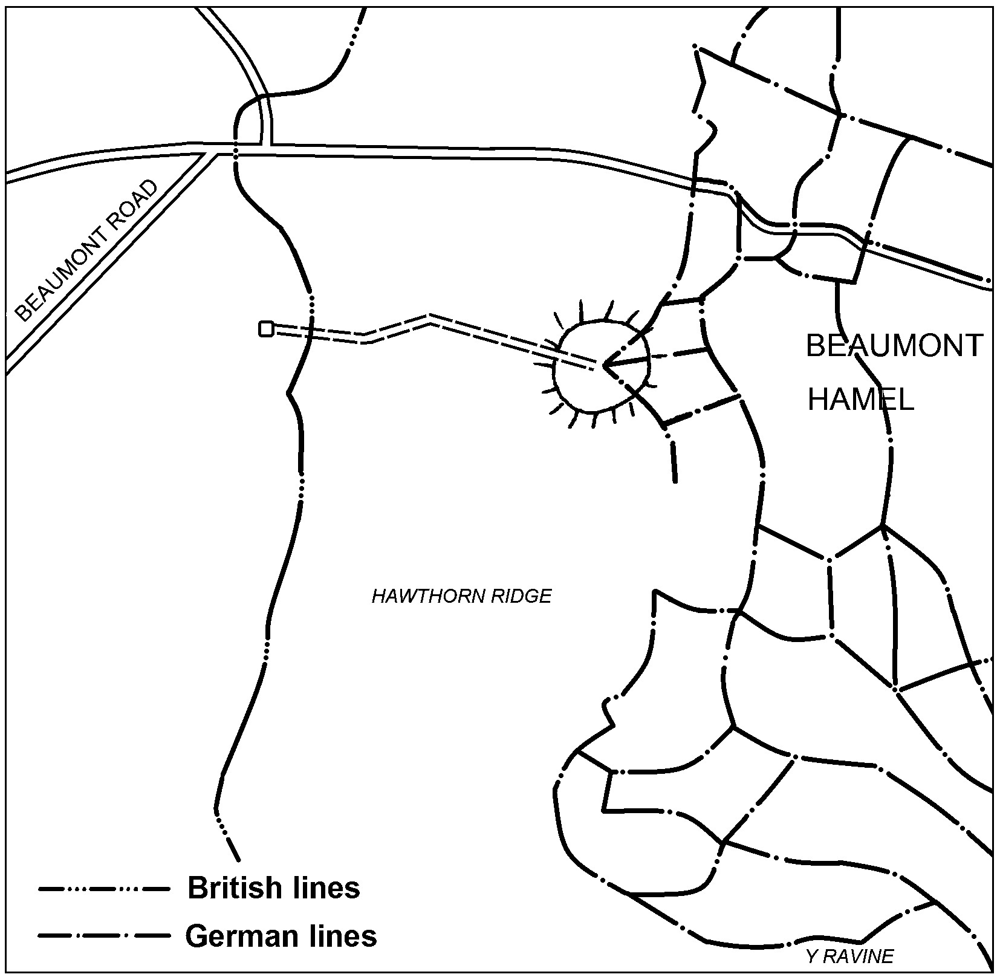

# Sheffield Memorial Park

Another site I try to visit when I go to the Somme is the Sheffield Memorial Park. It is another great example of the overwhelming terrain disadvantage suffered by the Commonwealth forces. The British units had their trenches in the woods about 60 feet below the German trenches and were forced to cross open fields in their advance. The red marker represents the Queen’s Cemetery shown in the next picture. The cemetery was located there as that was as far as the British forces advanced.

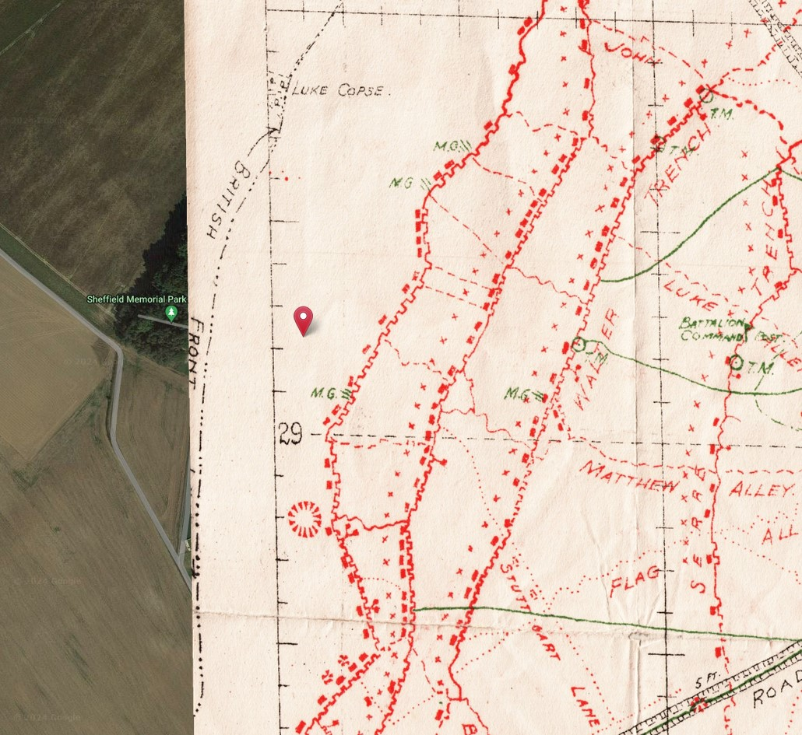

The photo is taken from the British trenches and shows the rise to the Queen’s cemetery. The  German trenches were just in front of the line of trees.

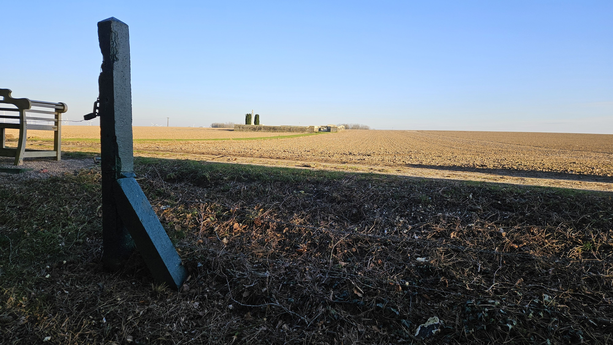

The attack failed in less than a half of an hour, with the Division troops suffering 1700 casualties in that short period.

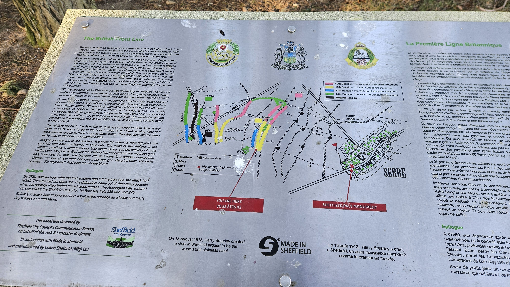

* [First World War](https://www.paulsbattlefieldtours.com/blog/categories/first-world-war)
* [Family](https://www.paulsbattlefieldtours.com/blog/categories/family)
* [Battlefield Tours](https://www.paulsbattlefieldtours.com/blog/categories/battlefield-tours)