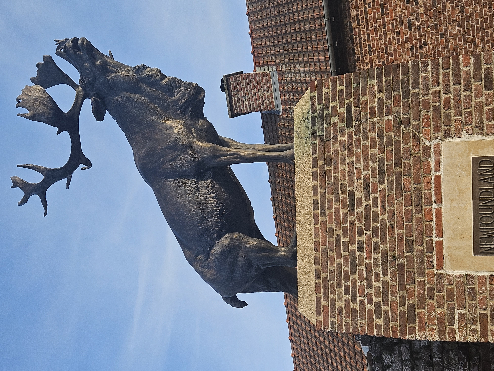
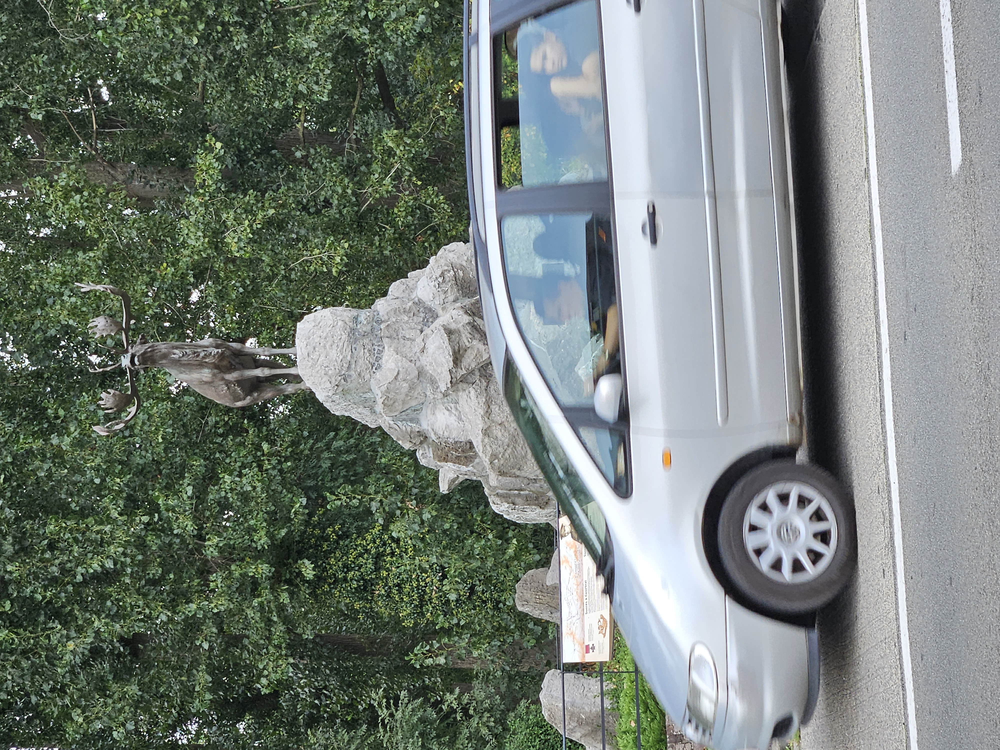
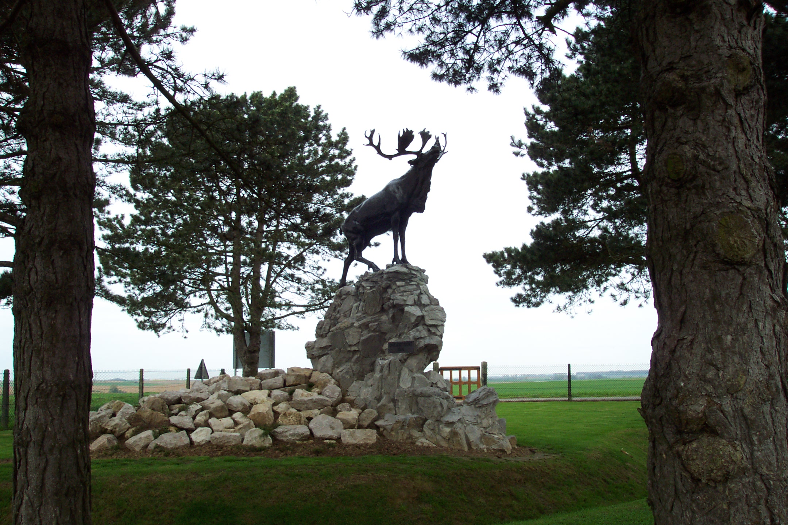

# The Caribou Trail

* [pd-allen](https://www.paulsbattlefieldtours.com/profile/pd-allen/profile)
* Sep 17, 2023
* 8 min read

Updated: Jan 27, 2024

During our trip, we have been able to hit 4 of the 5 Newfoundland Memorials in France and Belgium that honour Newfoundland's sacrifice in the First World War.

The first stop was the magnificant statue at the Newfoundland Park at Beaumont Hamel commemorating the sacrifice of the Newfoundland Regiment on the first day of the Somme Battle.

My post on the First Day of the Somme Details the losses.

The first stop yesterday was Monchy-le-Preux Newfoundland Memorial, located next to a church in this small town.

The veteran's affairs website [veterans.gc.ca](http://veterans.gc.ca) details the battle in 1917.

The encounter took place during Field Marshall Sir Douglas Haig's great spring offensive in which the British First and Third Armies attacked eastward from Arras on a 22-kilometre front. The 88th Brigade's operation was to be a two-battalion attack launched against Infantry Hill behind a creeping artillery barrage. The Newfoundland Regiment, commanded by Lieutenant-Colonel James Forbes-Robertson, was on the right and the 1st Essex Battalion on the left.

At 5:30 a.m. on April 14, the British barrage opened and the two battalions began their advance. At the end of 90 minutes the Essex had taken their part of the Infantry Hill objective. But as the Newfoundland companies advanced, they were raked by machine-gun fire. Suffering heavy casualties the Newfoundlanders pressed on to occupy the enemy's forward trenches in front of Infantry Hill.

As they reached the high ground of the Hill, a fresh German battalion met them. Second and third enemy battalions moved in and the Newfoundlanders were counter-attacked from three sides. Little knots of men held out until they were killed or captured.

At 10:00 a.m., Lieutenant-Colonel Forbes-Robertson received a report that not a single Newfoundlander remained unwounded east of Monchy and that some 200 to 300 Germans were advancing less than half a kilometre away. Quickly collecting all available men of his headquarters staff, he led them forward under fire to a trench on the village outskirts. They at once opened a series of rapid-fire bursts of rifle fire on the approaching Germans who, believing themselves opposed by a powerful force, speedily went to ground. For the next four hours these ten resolute men represented (to quote the British Official History) "all that stood between the Germans and Monchy, one of the most vital positions on the whole battlefield."

Every bullet fired by the defenders was made to count and by picking off scouts sent forward to appraise the situation, they kept the enemy in ignorance of their pitifully weak numbers. Relief came at mid-afternoon as British reinforcements arrived at Monchy. A final enemy attempt to launch an assault on Monchy was frustrated as heavy guns of the corps artillery bombarded German assembly areas in the Bois du Vert and the Bois du Sart.

Monchy had been saved, largely through gallantry and determination of ten men, but the Newfoundland Regiment's losses in the day's fighting had been severe. Total casualties for its part in the battle numbered 460 all ranks, including 153 taken prisoner.

The next stop was the Masnières Newfoundland Memorial near Cambrai, located in an idyllic park.

In mid-November 1917, the Newfoundland Regiment, with General Byng's Third Army, was preparing to attack the Hindenburg Line in front of Cambrai. Haig's "great experiment" was to use massed armour for the first time in the war in order to open a breach in the enemy's defences through which infantry and cavalry would advance to capture Cambrai.

The assault, which went in at daybreak on November 20 without the customary preliminary artillery bombardment, took the Germans completely by surprise. With the tanks leading the way and opening wide gaps in the enemy wire, the Third Army broke through both Hindenburg systems, advancing from five to seven kilometres on a ten-kilometre front.

During the morning the 29th Division, in which the Newfoundland Regiment formed part of the 88th Brigade, came forward from reserve to complete clearing out pockets of enemy from the Hindenburg Support Line. Next, it was the Division's task to seize the bridgeheads over the St. Quentin Canal - the 88th Brigade on the right being charged with the capture of Masnières. In hard fighting the Newfoundlanders gained the outskirts of Masnières by nightfall on the 20th and next day completed clearing the town.

The Third Army's advance had created a salient some 15 kilometres wide and about six and one-half kilometres in depth. On November 30, the German Second Army launched a powerful counter-attack against General Byng's exposed right flank. The full force of the blow from the German right wing fell on the Newfoundland Regiment and the other battalions of the 29th Division that were holding the bridgehead. When a German penetration south of Masnières threatened to encircle the slender holding, a spirited counter-attack by all four battalions of the 88th Brigade forced the enemy back almost a kilometre and a half. That night the Newfoundland Commanding Officer wrote in his diary:

"Our strength in the morning, 9 officers, 360 other ranks; at night, 8 officers, 230 other ranks." After clinging to their tenuous position astride the Canal for another 24 hours, the defending battalions were ordered to evacuate Masnières. The battle continued until December 4, when Byng ordered a withdrawal of the Third Army to a line that closely followed the old Hindenburg Support System.

In its struggle to seize and hold the bridgehead at Masnières, coupled with earlier fighting at the Third Battle of Ypres, the Newfoundland Regiment had earned unique recognition. It was granted the title "Royal" by His Majesty King George V. The distinction was one that no other regiment of the British Army was to have conferred on it during the First World War while fighting was still in progress.

The fourth memorial we visited was the Courtrai Memorial in Belgium. It is located at the corner of a busy street, very different than the other settings.

During the campaigns of 1918, the Royal Newfoundland Regiment's operations were confined to the northern sector of the Western Front. When the Germans launched their great April offensive, the Regiment fought defensive actions in the Battles of the Lys, adding the name "Bailleul" to its battle honours. In mid-September, the Battalion became part of the 28th Infantry Brigade, 9th (Scottish) Division. It was to serve with this formation for the remainder of the war.

On the opening day of the final offensive, the 9th (Scottish) Division, in the British Second Army, striking eastward from Ypres, recaptured positions on Passchendaele Ridge which the Germans had overrun in their spring offensive. At the end of two days the Newfoundland Battalion had advanced fourteen and one-half kilometres, having played an important part in breaking through the enemy's front "Flanders Position". Then came a pause in operations to allow heavy artillery and supplies to be brought forward through the mud of the old churned-up battlefield that the attacking British and Belgian forces had at last put behind them.

A resumption of the offensive on October 14 marked the beginning of what came to be called the Battle of Courtrai. As part of a general advance towards Ghent (now Gent), three corps of the Second Army, north of the River Lys (or Leie), were given the task of securing the line of the river to beyond Courtrai (Kortrijk), in readiness for establishing bridgeheads on the south bank. The 9th Division, which was on the Army's northern flank, had the greatest distance to cover. The Royal Newfoundland Regiment's objective, the railway running north from Courtrai, was eight kilometres from the starting line.

The attack went in at 5:35 a.m. on the 14th. As they moved forward, the Newfoundlanders had to deal with a number of German pillboxes that were threatening to stall the advance. A serious situation developed when leading companies were held up by German field gun shelling in some houses a few hundred metres away on the right flank. As a Newfoundland platoon moved out to try to outflank the German battery, Private Thomas Ricketts, a member of the Lewis Gun detachment, displayed great initiative and daring in engaging the enemy with his accurate fire. At one stage he had to double back across 90 metres of bullet-swept ground to replenish his ammunition. The fire from Ricketts' gun put the enemy to flight and the platoon was able to capture the four field guns, four machine-guns and eight prisoners without themselves sustaining any casualties. For his bravery, Private Ricketts, who was only 17 at the time, became the youngest winner of the Victoria Cross in the British Army.

When the Royal Newfoundland Regiment dug in at dusk on the 14th, it had taken 500 prisoners and 94 machine-guns, eight field guns and large quantities of ammunition. But this had not been accomplished without suffering heavy casualties. At dawn next day, the Battalion could muster only 300 rifles.

Separate attempts by three divisions to establish bridgeheads over the canalized Lys on October 16 and 17 for an advance to the River Scheldt failed in the face of determined German resistance. Finally, on the night of October 19-20, a major assault by three divisions abreast succeeded, the Newfoundlanders rafting across in the pre-dawn hours of the 20th.

The monument we missed was the Gueudecourt Newfoundland Memorial marking a second battle in 1916.

The village of Gueudecourt lies five kilometres directly south of Bapaume. Here, on October 12, 1916, the Newfoundland Regiment made its heroic assault during the Battle of Le Transloy, one of the major battles of the Somme. Arriving from the north where it had spent 10 weeks in the Ypres Salient, the 88th Brigade, in which the Newfoundland Regiment was serving, was temporarily attached to the British 12th Division, which was holding Gueudecourt.

By nightfall on October 10, the Newfoundlanders were manning a 450-metre section of the firing line on the northern outskirts of the village. The attack went in at 2:05 in the afternoon of the 12th, all four Newfoundland companies advancing in line with the 1st Essex Battalion on their left. So closely did the men keep up to the curtain of their artillery barrage that several became casualties from the shrapnel of their own supporting guns. In the front German trenches the defenders, compelled by the shelling to remain under cover, were quickly engaged in hand-to-hand fighting. By 2:30 p.m. both assaulting battalions of the 88th Brigade had secured their initial objective—Hilt Trench in the German front line.

As the Newfoundlanders advanced to their final objective, some 750 metres from their starting line, heavy machine-gun fire coming from the front and the right flank forced them back to Hilt Trench. On their left, a sharp German counter-attack drove the Essex Battalion back to the outskirts of Gueudecourt, leaving the Newfoundlanders with an open flank. Newfoundland bombing parties cleared and secured the vacated portion of Hilt Trench and with the Battalion's line suddenly doubled in length, all ranks began digging in the hard chalk to construct a new firing step and parapet and generally reverse the former German position.

In the late afternoon the expected counter-attack developed, but determined fire from the Newfoundlanders' rifles and Lewis guns drove off the enemy with costly losses. The position was held against further assaults and during the night, the arrival of a relieving battalion of the 8th Brigade enabled the weary defenders to hand over their responsibilities and go into reserve.

During the 55 hours that had elapsed since they had entered the trenches on October 10, the Newfoundland Regiment had suffered 239 casualties—of whom 120 had been killed or would die of wounds. But the Regiment had been one of the few units on the whole of the Fourth Army's front to capture and retain an objective. "The success," wrote the Brigade Commander later, "was all the more gratifying as it was the only real success recorded on that day."

By the end of the war, more than 6,200 Newfoundlanders had served in the Ranks of the Royal Newfoundland Regiment, with more than1,300 of them losing their lives, and a further 2,500 being wounded or taken captive.

* [First World War](https://www.paulsbattlefieldtours.com/blog/categories/first-world-war)
* [Battlefield Tours](https://www.paulsbattlefieldtours.com/blog/categories/battlefield-tours)