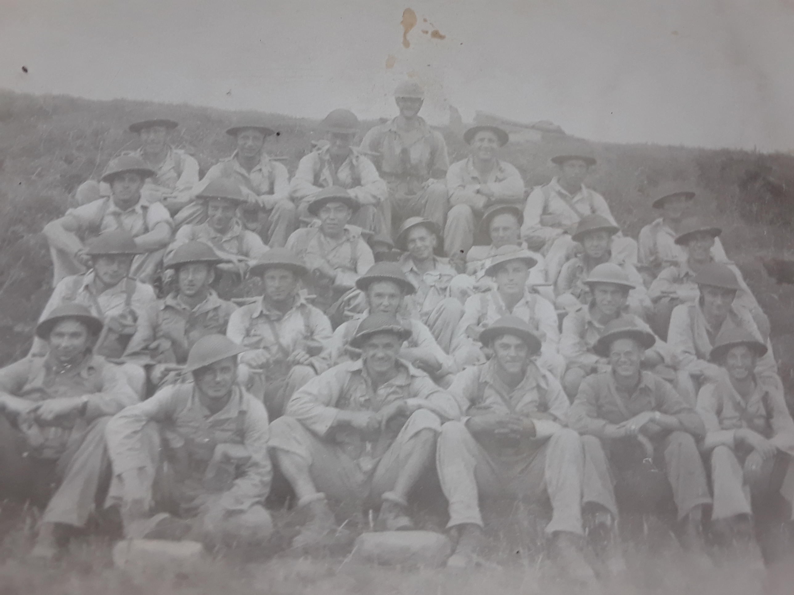

# Uncle George Johnston

* [pd-allen](https://www.paulsbattlefieldtours.com/profile/pd-allen/profile)
* Sep 19, 2023
* 9 min read

Updated: Sep 23, 2023

George is in the 3rd row, second from the right.

## Early Years

George David Johnston was born in Essex Ontario, on August 9, 1908, to Sam and Ada (Perry) Johnston. He was the fifth and final child of Samuel and Ada. George was only about 16 when he decided to move to Phelps Township outside North Bay, Ontario in 1925 to take advantage of a program that gave people crown land to homestead. The people who got the land had to clear 7 acres and build a cabin on the land and to work it for 7 years so that it would become their land. George’s property was located on what is now Pioneer Road. George cleared his land and planted his garden. He cut and sold logs and eventually grew a market garden.

## Military Service

In November 1942 at the age of 33, George enlisted in the Canadian Forestry Corps, first attending 26 Basic Training Centre in Orillia Ont then the Canadian Army Infantry Training Centre in Valcartier QC. In January 1944, George was assigned to [#1](https://www.paulsbattlefieldtours.com/blog/hashtags/1) Detachment Canadian Forestry Corps, Balsam Creek, ON less than 10 miles from his farm, and spent several months cutting logs.

In July 1944, George was briefly assigned to [#2](https://www.paulsbattlefieldtours.com/blog/hashtags/2) District Depot, Toronto as an Infantry replacement, then posted to [#1](https://www.paulsbattlefieldtours.com/blog/hashtags/1) Training Brigade Group in Debert, NS. He sailed for England on 01 September 1944, and arrived at [#3](https://www.paulsbattlefieldtours.com/blog/hashtags/3) Canadian Infantry Reinforcement Unit in Sussex. On 24 October 1944, he was assigned to the Argyll and Sutherland Highlanders of Canada, part of the 10th Infantry Brigade, 4th Canadian Armoured Division.

The Argylls landed at Arromanches and Courseulles on 26 July and were almost immediately thrown into action. From the 8th until 20th of August, they participated in Operations Totalize and Tractable and the closing of the Falaise Gap. A company of the Argylls was assigned to the South Alberta Regiment and were instrumental in taking and holding the bridge at St Lambert-sur-Dives. Major David Currie won the Victoria Cross for his leadership during this action, the only VC awarded to a member of the Royal Canadian Armoured Corps. The citation reads:

*Currie was awarded the Victoria Cross for his actions in command of a battle group of tanks from The South Alberta Regiment, artillery, and infantry of the Argyll and Sutherland Highlanders of Canada at St. Lambert-sur-Dives in France, during the final actions to close the Falaise Gap. This was the only Victoria Cross awarded to a Canadian soldier during the Normandy campaign (6 June 1944 through to the end of August 1944), and the only VC ever awarded to a member of the Royal Canadian Armoured Corps. The then 32-year-old Currie was a Major in The South Alberta Regiment, Canadian Army during the Second World War. During the Battle of Falaise, Normandy, between 18–20 August 1944, Currie was in command of a small mixed force of tanks, self-propelled anti-tank guns, and infantry which had been ordered to cut off one of the Germans' main escape routes. After Currie led the attack on the village of St. Lambert-sur-Dives and consolidated a position halfway inside it, his force repulsed repeated enemy attacks over the next day and a half. Despite heavy casualties, Major Currie's small force destroyed seven enemy tanks, twelve 88 mm guns, and 40 vehicles, which led to the deaths of 300 German soldiers, 500 wounded, and 2,100 captured. The remnants of two German armies were denied an escape route.*

The Argylls were part of the pursuit of German forces, and major Battles at Moerbrugge (Crossing the Ghent Canal) on 08 September and the Leopold Canal on 22 September. On 20 October the Argylls fought in the Battle of Scheldt. On 22 October, they took Essen and moved into the Netherlands. The Battalion establishment was for 817 Other Ranks, and the actual count at the end of October was 709, this despite the fact that 190 reinforcements had been taken on in 5 batches throughout the month of October. My Great Uncle, George Johnston B136879 was taken on strength to D company on 26 October 1944. The unit establishment had dipped as low as 536 on 02 September, an indication of the steady casualty rate.

The Argylls were taken back under the command of the 10th Canadian Infantry Brigade, and on 26 October moved up to Hoogerheide, Netherlands to clear the woods around Bergen Op Zoom. On 28 October word was received that the Lincoln and Welland and the South Alberta Regiments had taken Bergen op Zoom, so the Argylls moved into the town to a tremendous reception from the populace despite the fact that gunfire could be heard nearby. After a short rest, on 01 November the Argylls moved to the north-east towards Moerstraten and eventually, Steenbergen. The Lincolns and Algonquins attacked a German concentration on 03 November and were not able to push through, but the Germans withdrew overnight so the Argylls moved into Steenbergen unopposed.

The Argylls rested in Steenbergen for 3 days, receiving 130 reinforcements including several previously wounded soldiers rejoining the unit. On 09 November, they moved to 50 miles Northeast to Drunen where they spent a quiet time with only nuisance with the Germans. This quiet time lasted until 25 November when the Argylls were pulled out of the line completely and moved to the St Michaels-Gestel Monastery in Stokhoek for a two-week period. This was a period of maintenance, training, and recovery. The Battalion trained in the morning, participated in sports in the afternoon with cinemas, cafes and dances filling the evenings. After only a week, the Battalion moved backed to Drunen where they spent a quiet period until 21 December. The Argylls hosted a large Christmas party at Elshout, halfway between Drunen and Huesden for several hundred local children as they had done in England in 1943. The men saved all their rations, chocolate and candies so the children could have a good Christmas.

The Argylls participated in Operation Elephant (crossing the Maas River) on 26 January, before assembling for an attack on the Hochwald Gap.

The Battle of Hochwald Gap (Operation Blockbuster) was almost as big as Normandy, but with three times the number of casualties. The Battle itself a was masterpiece of defensive combat by Germans who intimately knew their own territory and set up one tank trap after another. Outnumbered hopelessly, the German fought about as well one could expect.

Operation Blockbuster was a major armoured assault to the town of Wesel on the bank of the Rhine River in preparation to the final push to Berlin. The attacking force included the 2nd and 3rd Canadian Infantry Divisions, 4th Canadian Armoured Division, 2nd Canadian Armoured Brigade 2nd Army Group Royal Canadian Artillery and the British 11th Armoured and 43rd (Wessex) Divisions. The assembled force included 90,000 infantry, 1300 artillery guns and over 1000 tanks, most attached to the Canadian 2nd Division. They were facing a force of 10,000 with 100 tanks and a few anti-tank weapons tanks including forces from the 2nd Parachute Corps and 47th Panzer Corps. The attack would head south from Kleve, then split and head East through the Hochwald Gap and on to the Rhine. There were few roads in the area, and the ones that were available were not in good condition. There were multiple German strong points built as part of the Siegfried Line, as well as wide anti-tank ditches, heavily mined and booby-trapped areas. The 2nd and 3rd Division would push to Udem, then the 4th Division would take the lead and push through the Hochwald Gap to the Rhine.

The Argylls started off at 1800 hours on 25 February. The plan was to head cross country in 4 lines, but heavy rain had softened the ground and the tanks churned up the earth resulting in many of the armoured carriers becoming stuck and disabled. With a great effort, the Argylls were in place awaiting the attack of the remainder of 2nd Corps. Many of the tanks from the Snuff and Jerry units were bogged down, some buried up to their turrets. The Germans counter-attacked just before H Hour, so the planned artillery started early. The RCA was using the newly deployed “Land-Mattress” rocket launchers, consisting of 12 rocket projectors, each having 32 barrels. Many of the tanks from the Snuff and Jerry units were bogged down, some buried up to their turrets, so the going was slow. The battlefield was congested and confusing, but the Arygll forces Snuff and Jock pushed on, meeting their objectives by 1930 on 26 February. The Battalion had taken 1500 prisoners, at the cost of 6 killed and 25 wounded. The 3rd Division moved to the hills east of Udem on the 27th, and the Tiger force pushed forward through the Hochwald forest, delayed by 5 hours due to the slow going through the mud. As a result, at daylight, they were still in open ground instead of in the forest, losing several tanks to anti-tank fire. They pushed through to their objective but were subjected to heavy fire from 3 sides and unable to advance any further. The Argylls then took over the assignment of the Tiger force and through heavy fighting managed to reach a point some 500 yards short of the gap by 1700. The position was untenable, so the Argylls withdrew to the woods. By this time 3 of the 4 company commanders had been wounded so LCol Wigle came forward to reorganize the troops.

At 0230 on 28 February, the Argylls advanced, and remained under heavy artillery and mortar fire, and repeated counterattacks by the German forces. B company was cut off and spent the entire day in direct combat with the enemy, unable to be resupplied or to evacuate the wounded. At 2000 tanks and units from the Lake Superior and Algonquin Regiments moved forward finally breaking through the Hochwald Gap. By this time B company had been reduced to 15 men after holding their position for 24 hours. The Argylls were replaced by the Mont Royal Fusiliers and went back to Udem. LCol Wigle who had been wounded twice by shrapnel fire was awarded the DSO, and members of B company, Capt Perry the Military Cross, Sgt Huffman who had been blinded in battle but remained int the fight the Distinguished Conduct Medal, and Ptes Murphy and Randall the Military Medal. Over the next two days 54 reinforcements were recei8ved as the Argylls rested while the battle raged on in front of them. The weather had finally cleared so air support from the Typhoon fighter bombers helped weaken the German positions. The Algonquins and Lake Superior troops advanced about 2500 yards past the gap but could advance no further, so the main body of the Battalion headed south towards Sonsbeck then traversed the Balberger Wald.

At 0800 on 06 March, the Argylls moved from Sonsbeck towards Veen. The land was very wet, so the tanks were forced to stay on the roads which were heavily cratered and mined. They advanced with little resistance until 800 yards from Veen where they faced a storm of small arms, mortars, and artillery fire. They waited until last light then B and D companies with tanks went forward into Veen. At the outskirts of town, they were engaged with heavy machine gun fire, and contact was lost between the Argylls and the tanks. They could make no headway and were ordered to withdraw, but Capt Perry, B Company did not receive the order and stayed in place. At dawn they were in shallow pits and dominated by German fire from 3 sides. Movement was impossible and the ammunition used up, so Capt Perry surrendered his force. A total of 31 members were taken prisoner including Lts Maxwell and Steward who were both severely wounded, and our great Uncle George Johnston.

The prisoners captured at Veen were taken to Stalag XIb in Fallingbostel. Pte Brimacombe was captured on the 07 Mar during the Attack on Veen, and taken prisoner at the same time as George, and both were held in Stalag XIb, so George’s experiences would have been very similar.

Before I was captured my weight was about 130 pounds and when I was liberated, I only weighed 85-90 pounds. This was not only due to the fact that I was undernourished but also because I got dysentery, probably form the bad drinking water, and the little bit of food I did eat went through me in about 10 minutes and I obtained very little nourishment from it. I was so weak at times, I could not stand and had to crawl from place to place. Men were so undernourished that their wounds would not heal and were washed and wrapped daily with paper bandages because of lack of medical supplies. Men shuffled around the compound with string tied from the toe of their boots to above the knee to keep their toes from dragging on the ground from lack of muscle power.

On 16 April 1945 the British 8th Hussars Recce Troop reached Fallingbostel. The camp had about 6,500 men, some of whom had been prisoners for 5 years. The prisoners stayed in the camp about a week or so until they were transported by trucks to an airfield not to far away from where we were flown to Brussels in a DC-3 Dakota. There they were issued new uniforms, and attended a fabulous banquet served by professional waiters. Next, they flew to England in Lancaster bombers where we were given a complete medical check up. On 05 May 1945 George was officially reported safe in England. George was sent to No 4 General Hospital in Farnborough near Aldershot, where he remained for a week.

Soldiers were normally returned home based on the amount of time they had spent overseas. Since George only arrived in Sep 1944, he spent an extended time in England and was among the last to be returned home. On 27 Jan 1946 George was assigned to Canadian Draft 1006 for his return to Canada, and on 16 Feb 1946 was formally removed from his overseas designation upon his assignment to the S-8 Canadian Army Training School, Hamilton. He was granted 30 days disembarkation leave form 24 Feb 1945 to 25 May, then assigned to the No 2 District Depot in Toronto where he started his military journey and was formally released from the Army on 02 Apr 1946.

George remained a bachelor his entire life, returning to his land in Phelps township, and quietly lived his life until his death in 1975.

* [Second World War](https://www.paulsbattlefieldtours.com/blog/categories/second-world-war)
* [Family](https://www.paulsbattlefieldtours.com/blog/categories/family)