# Vimy and the Canadian Memorials

* [pd-allen](https://www.paulsbattlefieldtours.com/profile/pd-allen/profile)
* Jan 27, 2024
* 6 min read

Updated: Jun 29, 2025

Vimy Ridge and the Canadian Memorials

I was originally going to call this Refocused on Lens to cover the locations I had previously visited, but I started with the Vimy Memorial and the story morphed into Canadian Memorials.

# Vimy Memorial

The Vimy Memorial atop hill 145 on Vimy Ridge is the most majestic memorial on the Western Front. The size, setting, intricate carvings and the surrounding preserved battlegrounds makes the memorial the universal choice. The monument stands 110m above the adjacent Douai Plain and dominates the landscape.

I had visited the memorial last fall, and Wine Bob hadn’t been since 2004 but we were both struck by the details of the monument. We were there on a crisp winter morning not long after sunrise, so there were only a few people around, but they are convenient to provide the scale of the monument.

The monument was extensively renovated in 2007 and all of the patch work repairs and water intrusion damage was repaired using limestone from the original quarry in Croatia. The limestone is from the same Quarry that was used to build Diocletian’s Palace in 305 AD, and Allward chose the stone because of its obvious durability. A cool side note, Rachel and I traveled to Croatia for the holidays, and spent Christmas at Diocletian’s Palace in Split.

The focus is on the memorial itself, but Vimy and Beaumont Hamel have some of the largest preserved battlefields on the Western Front. If you just walk up the central path, you only get a view of the groomed portion of the memorial. The site is 117 hectares (290 acres) in size and covers the battlefield crossed by the Canadians in the taking of the ridge.

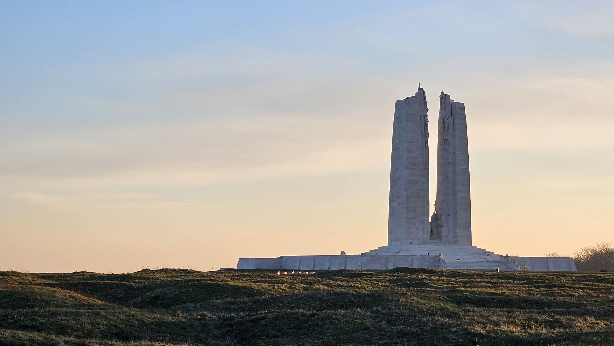

The shell holes are evident throughout the landscape, and much of the park

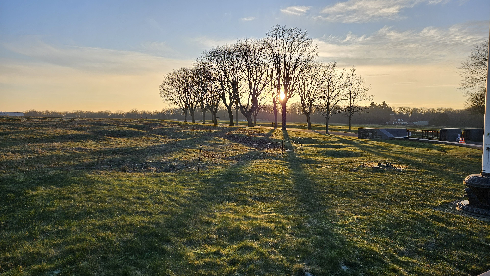

If you have looked at the Videos section of this blog, you will know that I am a fan of the Drone Videos produced by Steven Upton. He does a good job of placing the battle in context and coordinating the videos with trench maps. I particularly enjoy the videos of the cemeteries as it is impossible to capture their scope from ground level. His video on [Vimy](https://youtu.be/6HUTdwpucGU?si=pE-EV3AntYVIr-Lz) does a great job of setting up the battle, showing the battlefields and airborne views of the memorial and surrounding ground. I recommend watching the entire video, but if you are interested in the memorial, coverage starts around 8:08.

This picture shows the memorial, groomed areas, the preserved battlefield, and some of the grounds crew tending the grass. Most of the grounds are off limits because of the number of unexploded shells.

The ridge was a barren wasteland at the end of the war. It is reported that more that 60,000 trees were planted, one for each fallen Canadian Soldier. These trees are reaching the end of their life span, so a program is underway to replant more than 70,000 trees at Vimy and Beaumont Hamel.

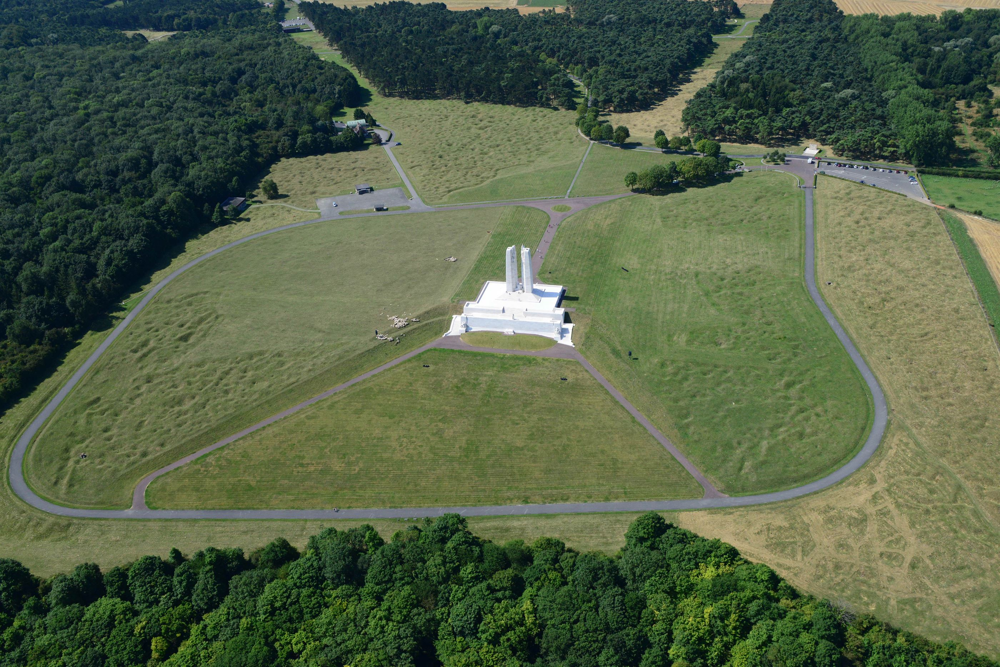

I’m fascinated by the sheep. The sheep were not out in January when we were there. Likely off in Spain like the rest of battlefield folks.

This picture shows an existing trench and the cratered ground. You can see the craters from the ground but don’t get a good appreciation of depth and extent of the devastation.

I am reminded of the old Johnny Carson joke every time I see sheep grooming the battlefields at Vimy or Beaumont Hamel.

“What sound does an exploding sheep make?  - Sisss Boom Baaah!”

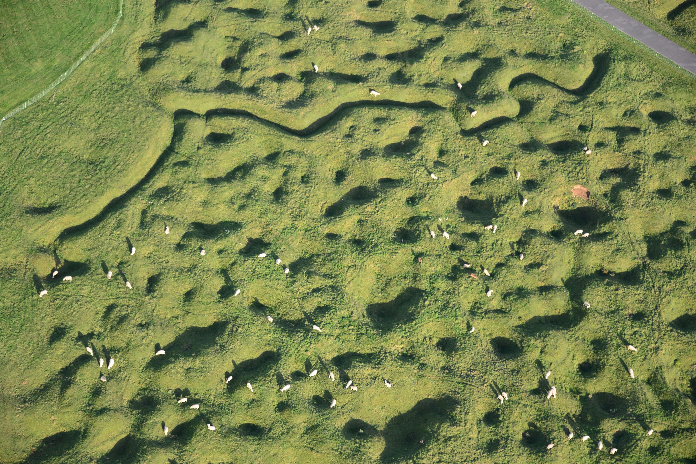

The light was perfect while we were there. The statue Canada Bereft glows in the morning light.

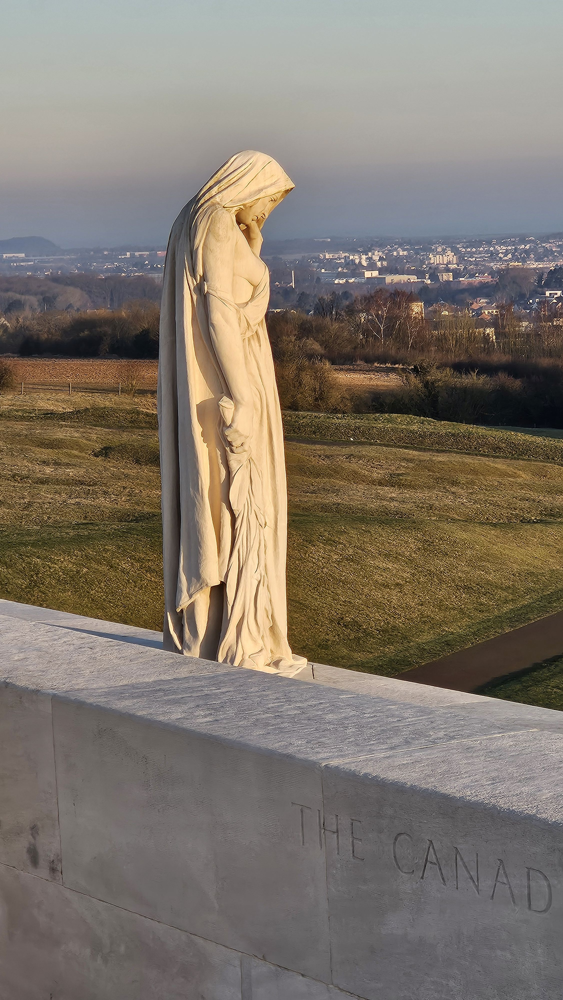

By contrast, the statues at the base of the pylons, Torch Bearer and Sacrifice, are in shadow and appear completely differently. The statues of Faith and Hope on the left pylons are also shaded, and Hope and Charity on the right are just starting to be illuminated.

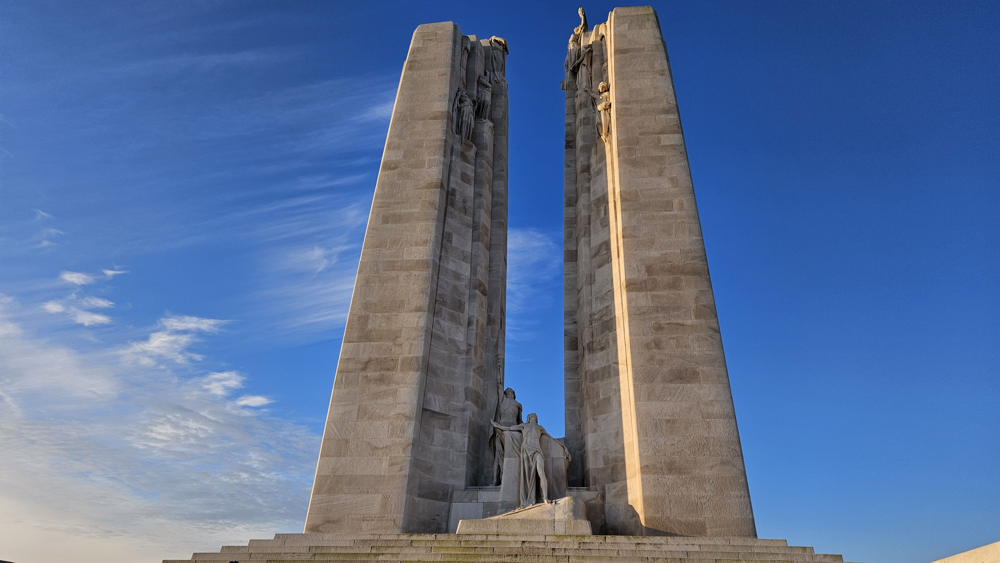

The sculptures for the Vimy Memorial were created life-size in clay by Walter Allward, then cast in plaster as plaster was much more durable. The plaster models were shipped to France, and the carvers used a pantograph to make the images twice the size, and the figures were carved on site. 17 of the 20 plaster models are now on display at the Regeneration Hall at the Canadian War Museum in Ottawa. The remaining 3 are on display at the Military Communications and Electronics Museum in Kingston.

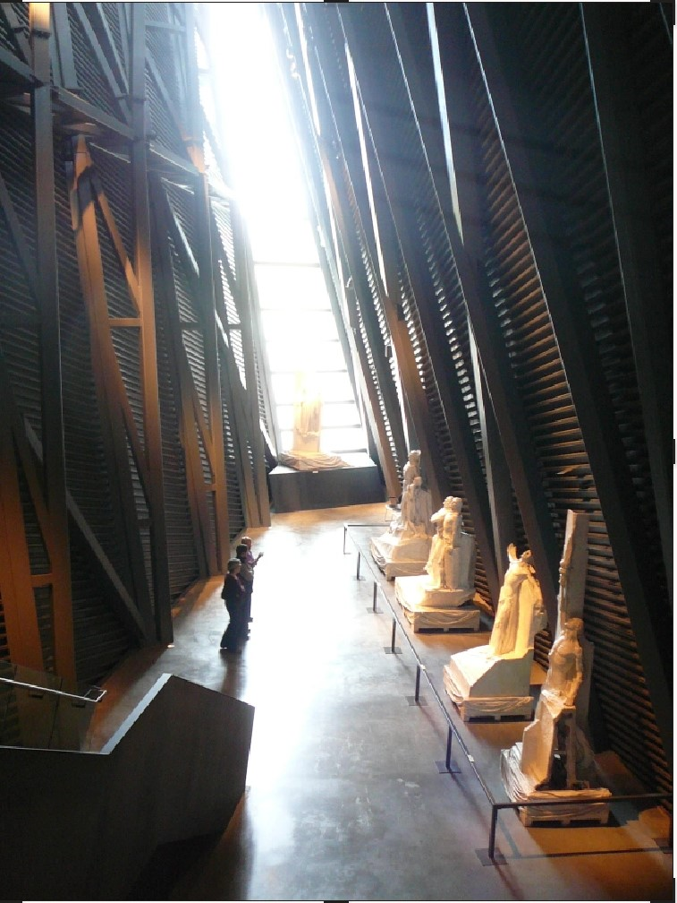

I've been to the War Museum several times, and was unaware of their presence. I look forward to visiting them all soon.

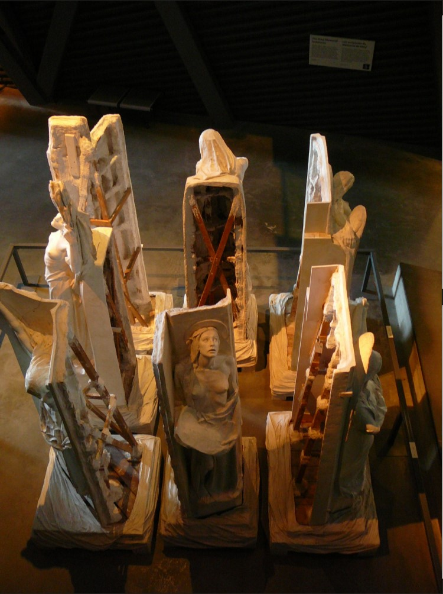

The view from the monument highlights the tactical advantage of Vimy Ridge and why the Germans fought so hard to defend their position.

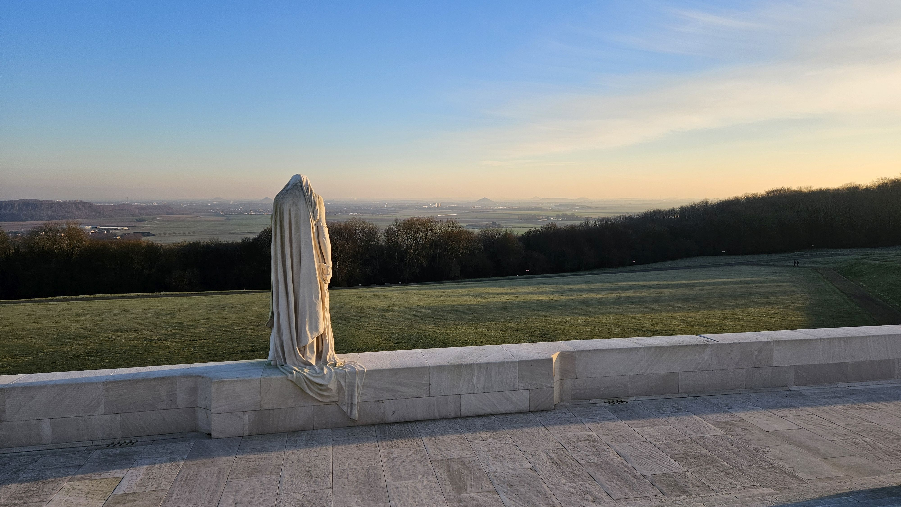

This magnificent memorial was designed by Walter Allward and took 11 years to build. His design in a nation-wide competition. It was selected from 160 initial submission drawings. The top 17 designs were paid to create plaster models. The second place selection was The Brooding Soldier that was erected at St Julian outside Ypres to commemorate the Canadian action during the 2nd Battle of Ypres in 1915.

The memorial was unveiled in 1936 by King Edward VIII, and more than 50,000 spectators including more than 6,000 Canadians who made the pilgrimage for the inauguration.

The Veterans Canada [site](https://www.veterans.gc.ca/eng/remembrance/memorials/overseas/first-world-war/france/vimy) has more details on the monument and construction.

There are the names of 11,285 Canadian soldiers who were killed in France and whose final resting place was then unknown. On some British memorials to the missing, if a soldier is subsequently identified, his name is removed from the memorial, but at Vimy the names remain.

There were 61,122 Canadians killed in the war, with another 3,800 dying between the end of the war and 1922. There are 19,660 Canadians with no known Grave. In addition to those listed on the Vimy Memorial, 6,940 Canadians who died in Belgium with no known Grave are listed on the Menin Gate memorial. The remaining 1,435 are commemorated on memorials in Canada and Europe.

A small sampling of the names of the missing on the Vimy Memorial is shown.

The dedication on the memorial.

*To the Valour of their country –*

*Men in the Great War and in*

*Memory of their Sixty Thousand*

*Dead this monument is raised*

*By the People of Canada*

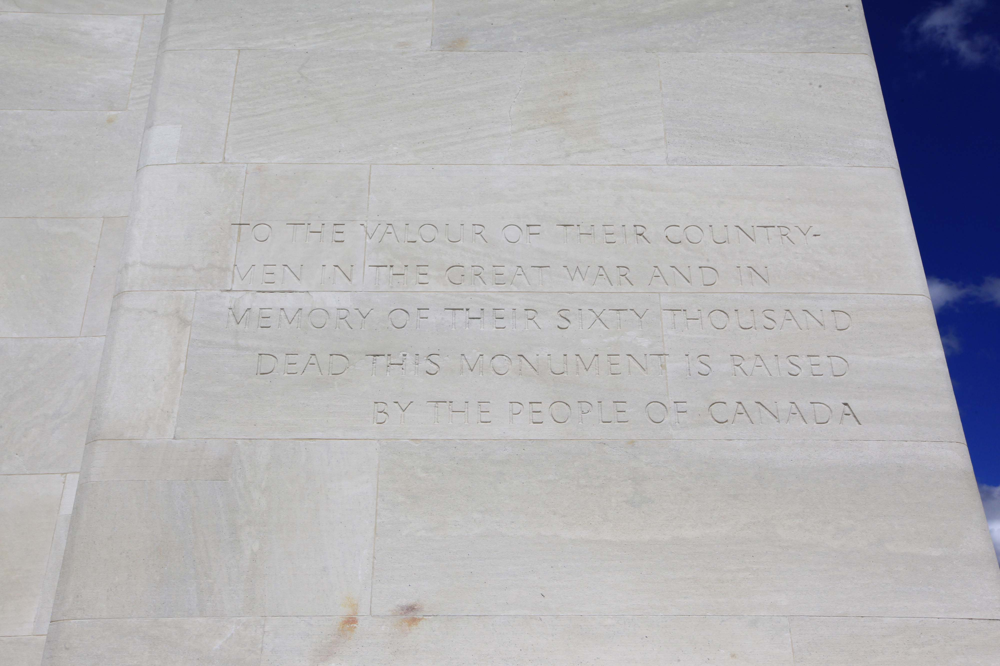

# Brooding Soldier

The Brooding soldier memorial at Vancouver Corner in St Julian, 7 km west of Ypres stands almost 11m high. The monument was designed by architect Frederick Chapman Clemesha, who was wounded while serving with the Canadian Corps during the war. He was a Lieutenant who served with the 46th Battalion and was wounded during the Battle of Amiens in Aug 1918 while attached to the 10th Brigade Headquarters. His battle experience is captured in the expression of the soldier.

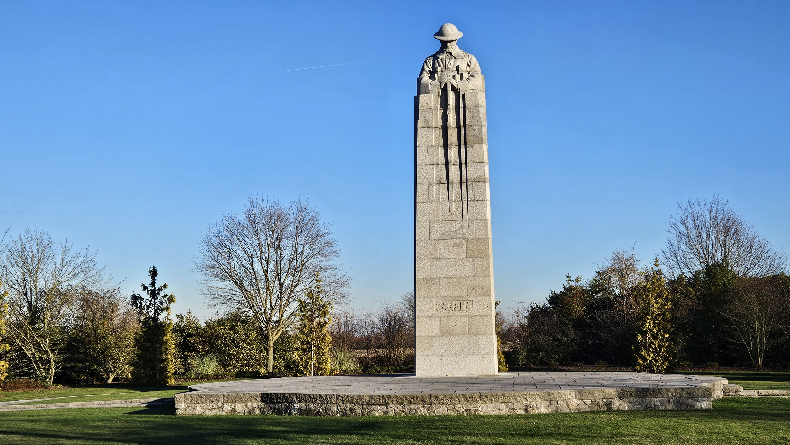

This sculpture won second place in the Vimy Memorial competition. It was built in 1923, and originally the design was planned to be used on the other 7 Canadian memorials in Belgium and France, but once it was unveiled, it was so striking that it was determined that this statue would be unique.

The Brooding Soldier is mounted on a single shaft of granite - the bowed head and shoulders of a Canadian soldier with folded hands resting on arms reversed. The expression on the face beneath the steel helmet is resolute yet sympathetic, as though its owner meditates on the battle in which his comrades displayed such great valour.

The use of granite makes this a darker, more foreboding monument that looks somber even in the brilliant sunshine.

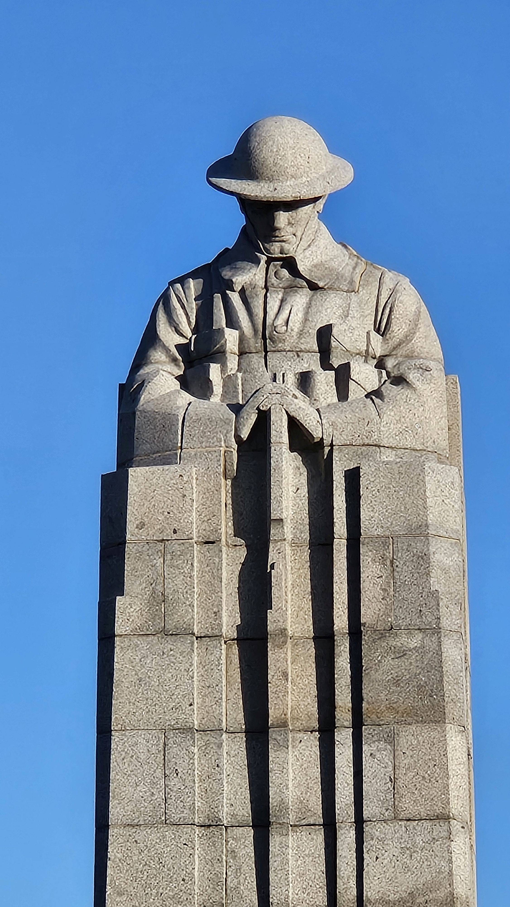

The memorial plaque reads:

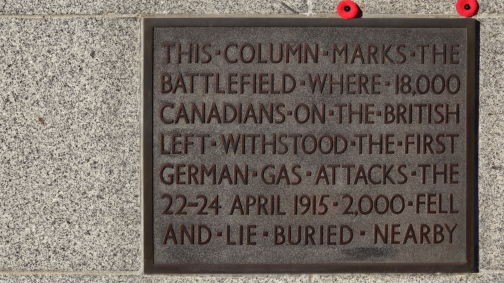

The Brooding soldier and the not so brooding battlefield tourist.

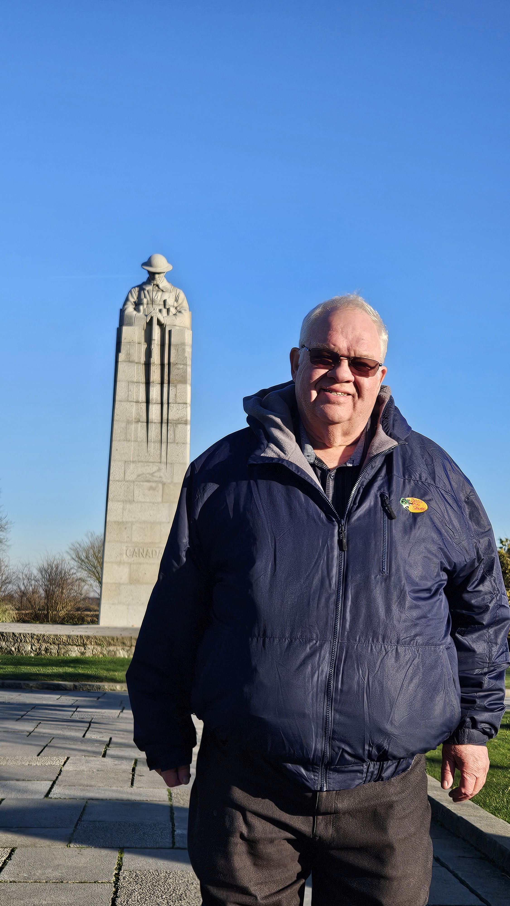

# Other Canadian Memorials

The remaining 6 Canadian Memorials in Belgium and France all use a granite block to commemorate the specific action. The memorials are located at:

·         Hill 62 – Battle of Mont Sorrel – Jun 1916

·         Courcelette – Battle of the Somme - Sep 1916

·         Le Quesnel – Battle of Amiens – Aug 1918

·         Dury – Battle of Drocourt-Queant Line – Aug/Sep 1918

·         Bourlon Wood – Battle of Canal du Nord – Sep/Oct 1918

·         Passchendaele – Battle of Passchendaele Oct/Nov 1918

The details are written in English on one side, and French on the other. These pictures are from the Hill 62 Memorial

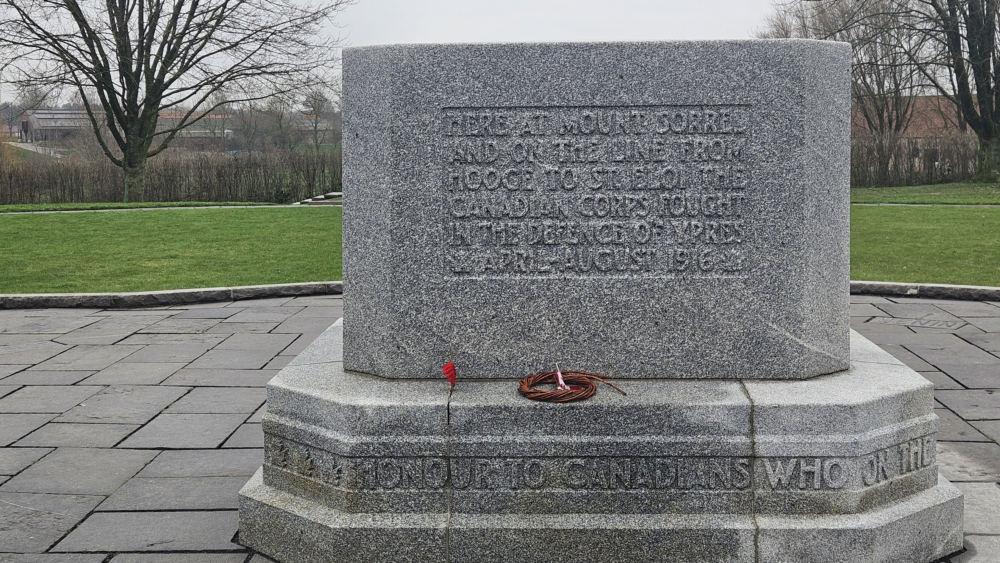

The wreath is shown on the other two sides.

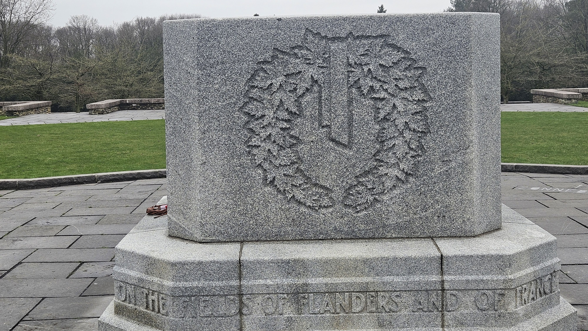

The layout of the memorial site is different for each memorial. The memorials I have been to all have the granite block on a platform surrounded by a circular walkway. The Hill 62 Memorial and the Bourlon Wood both have sets of stairs up to the monument, while others are flat.

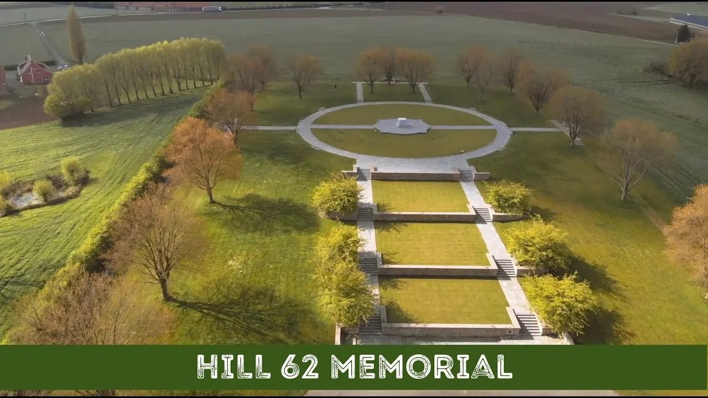

The Courcelette monument on the flat lands of the Somme has no stairs.

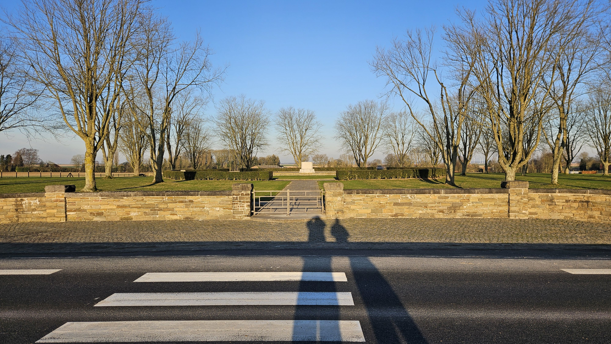

# Newfoundland Memorials

Since Newfoundland was not part of Canada during WWI, they have a separate set of memorials. I did a previous [post](https://www.paulsbattlefieldtours.com/post/the-caribou-trail) on the Caribou trail, showing the 5 Caribou on the trail in France and Belgium.

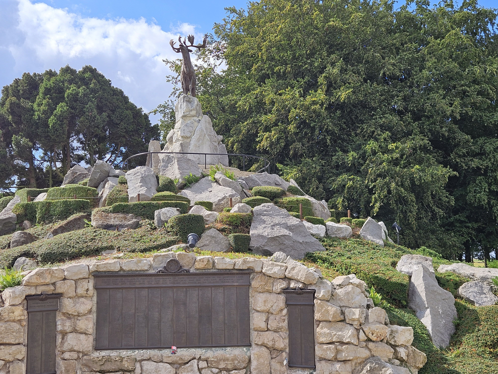

The Newfs are very proud of their Caribou, but everywhere the Caribou show up bad stuff happened, so I would be careful following the Trail.

* [First World War](https://www.paulsbattlefieldtours.com/blog/categories/first-world-war)
* [Family](https://www.paulsbattlefieldtours.com/blog/categories/family)
* [Battlefield Tours](https://www.paulsbattlefieldtours.com/blog/categories/battlefield-tours)