# Vimy and the Drummond Family

* [pd-allen](https://www.paulsbattlefieldtours.com/profile/pd-allen/profile)
* Mar 17, 2024
* 7 min read

In January 2024, my war story buddy Wine Bob Drummond and I visited several WWI battlefields. This is his story of the Drummond family's experience around Vimy.

My younger son, James, had moved to Paris in 2015 and two years later he informed me that he would attend the ceremony on 9 April 2017 at the National Vimy Memorial commemorating the 100th anniversary of the Canadian victory at Vimy Ridge.  We had visited the memorial as a family in 2004, so I was pleased that he would make the effort to attend this special national event.

To add further meaning to his attendance, James asked if any family members had fought at Vimy.  I knew nothing of my family’s service in WWI, let alone at Vimy Ridge, so I sent an email to one of the two surviving family members of my parents’ generation, my mother’s youngest sister, Audrey, to see what information she could share.

Aunt Audrey replied that she didn’t know of any family at Vimy, but she sent me the text of a notice prepared by her maternal grandfather for their local newspaper in England regarding the death in battle of his son, Corporal Percy Fowler, on 18 August 1916 during the Battle of the Somme.  The article mentions that Percy’s older brother, Fred, had recently been wounded and was visited in hospital by Percy a few days before he was killed (Fred recovered but was released from the army a year later).  The draft article included a photo of Percy as well as an excerpt of the battalion sergeant major’s letter informing the family of Percy’s death.

This was the first time I’d learned that my maternal grandmother, who I’d known well during my childhood, had brothers who had fought in WWI.  A couple of months later, my sister sent me a photo of the wartime grave of Private William Smith that she had found among the photos held by our father’s sister, Edith, who was in poor health.  The wooden grave marker showed that Pte. Smith was a member of the 29th Battalion, Canadian Expeditionary Force (CEF) and was killed in action on 8 June 1916.  As Smith was the maiden surname of Dad’s mother, we surmised and later confirmed this must have been her brother’s grave.  Although my sister and I also knew our Grandma Drummond née Smith during our youth, we had only ever heard of one of her brothers and this wasn’t him...

So, within a short time of James’s question about family involvement at Vimy Ridge, I discovered we had three great-uncles who had served in WWI, two of whom were killed and one wounded during a 10-week period in 1916.  While we still had no family connection to the battle or the area around Vimy, France, it was discovering my great-uncles’ service and sacrifice that started my quest to find what I could about them and also about my wife’s grandfather’s service with the Belgian Army.

Researching my Mom’s mother’s family, I discovered that “Nana” had a third brother, Sydney Albert, known as Jack, who also served during the war – so, now I’m researching four previously unknown (to me) great-uncles.  Jack was the youngest of the three Fowler brothers and was conscripted into the British Army in September 1917.

Here’s a photo of the pre-war community fife and drum band with Percy to the left of the bass drummer and young Jack/Sidney in civilian clothes, second from the right in the front row.

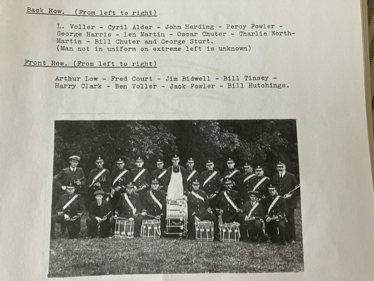

I hired an English researcher to compile reports on the wartime service of the three Fowler men.  From his reports and my own research, I learned that Jack’s older brothers had joined the British Army in September 1914 and first experienced battle a year later at the Battle of Loos.  While Fred and Percy both survived, their battalion, 8th Buffs/East Kent Regiment, suffered 75% - 85% casualties over a few hours on 26 September 1915.  Percy might have been wounded but recovered.  The Loos village and battlefield is on the north side of the French town of Lens, upon which Paul has focused and refocused, while Vimy Ridge is just south of the town.

My hired researcher discovered that Sidney/Jack Fowler had been placed in the 12th (Service) Battalion of the Rifle Brigade, 20th (Light) Division, joining the battalion in France on 10 April 1918 while it was in rear areas being reconstituted after sustaining significant casualties defending against the first phase of the German 1918 spring offensive.  After a period of training to assimilate the recently arrived men, on 1 May 1918 the 20th Division moved forward to take over the Lens and Avion sectors at the northern end of the Vimy Ridge – wait, wut?!

The report on Jack says that on 2 May 1918, the battalion “moved into the trenches, and it was presumably at this point that Sidney had his first experience on the front line.  It had an unusually long spell in the trenches, not being relieved until 20 May.  The situation proved to be relatively quiet, with occasional sniper and artillery fire which caused a small number of casualties.”

Following alternating periods of rest in rear areas and back in the front line, Jack’s battalion returned to the trenches of the “Albion Right Sub-Sector” a few kilometers east of Vimy Ridge on 24 July 1918.  Shortly after, German artillery increased in intensity and on 27 July, German shells included poison gas.  From the report, the war diary states, “It began to rain on 28 July, making trench conditions difficult, and next day – when Sidney was injured – gas was again used.  An enemy aircraft also dropped ten bombs on “Souris Trench.””

Sidney is named in the battalion war diary as having been “injured” on 29 July 1918.  It’s rare to find a war diary record of an enlisted man’s injury.  No detail exists as to the nature of his injury or whether he was returned to duty in France or Belgium.  It appears that he did not suffer an effect of his injury sufficient for entitlement to the Silver War Badge or a disability pension but a 1939 census record states he was an “incapacitated heavy equipment driver” and he died in 1949.  I wonder if the poison gas shells took their toll on him, as gas and the hardships associated with the trenches did to many others.

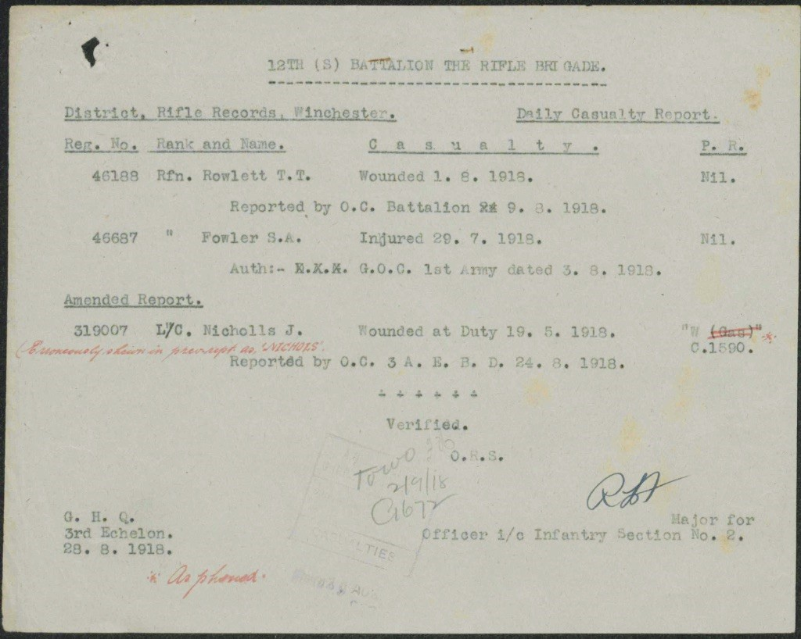

Luckily, several WWI trench maps are available showing the location of Souris and other trenches around Avion.  Since the Canadians took this area following the April 1917 Vimy Ridge victory, several trenches have Canadian-associated names (i.e., Souris, Manitoba).  <https://vimyfoundation.ca/battles/the-capture-of-avion-trench>

In the attached trench map with the British trenches in red and German trenches coloured blue, Souris Trench is to the right of the map center.

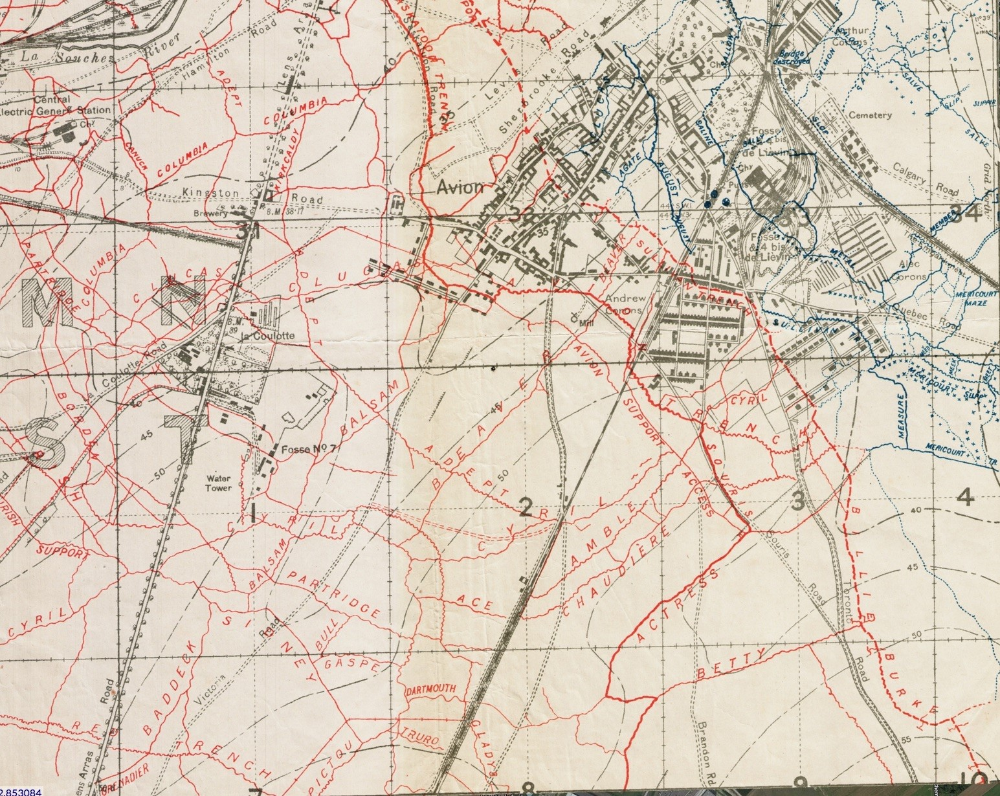

We’re fortunate to also have two aerial photos taken directly over the area: the first is dated 23 August 1917 while the second is dated 10 July 1918, two weeks before Sidney’s battalion returned to these positions and 19 days before he was injured.  These photos show the many artillery shell craters and general destruction of the area.  Both photos correspond well to the trench maps with Souris Trench clearly visible and the Avion Support Access Trench to its left.  In the July 1918 aerial photo, Actress and Billie Burke Trenches are evident.

The battalion war diary states that on 25 July, several German trench mortar bombs made direct hits on Beaver and Cyril Communications Trenches (i.e., trenches connecting to the front line trenches), which join Avion Support Access Trench immediately behind and slightly north of Souris Trench.

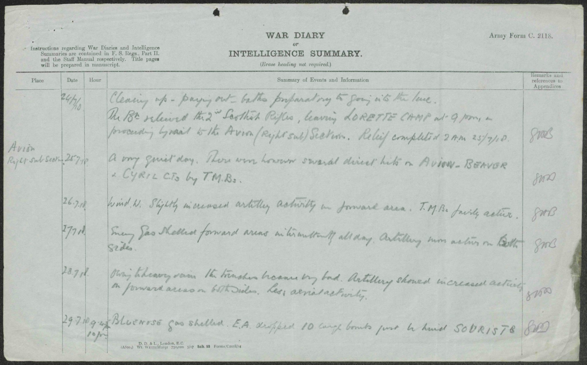

As shown on the following map, the Avion district and Souris trench are located about 8 kilometers south from where Fred and Percy Fowler attacked on 26 September 1915 and just 5 kilometers east of the Vimy Ridge Memorial.  In my three visits to the memorial, once with the family and twice previously with military visits, I didn’t know that the ridge looked out over where my grandmother’s brother had manned trenches in 1918 nor that her two older brothers participated in a terrible attack two years earlier just a few kilometers north.

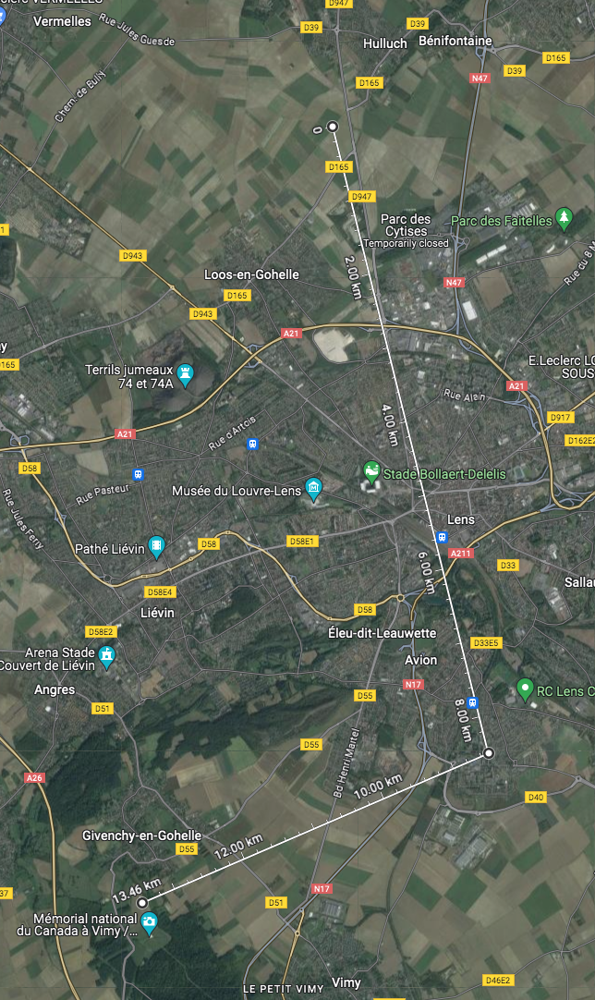

In addition to a “pilgrimage” with Paul back to this iconic site of Canadian sacrifice and victory, I was very keen to look east from the Vimy Memorial toward the site of Sidney’s injury and also to drive with Paul the road paved directly over Souris Trench – Rue Charles Helle Prolongée.

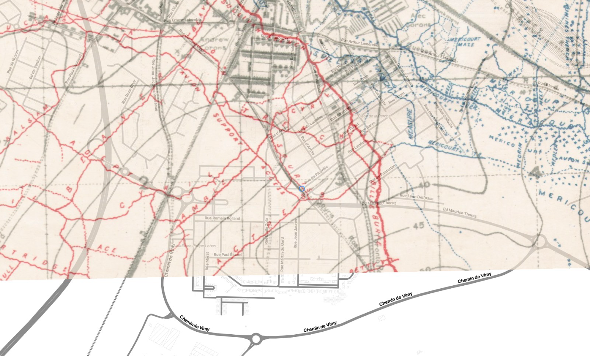

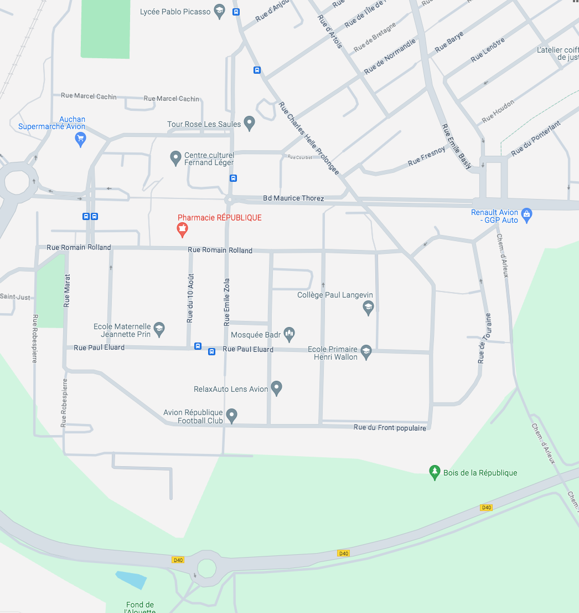

Having visited the Loos battlefield the day before, Paul and I left our Lens accommodation as dawn broke on 10 January, another clear but very chilly morning.  After getting some breakfast, we made our way south of Lens toward Vimy Ridge.  With Paul driving along part of the route that Jack Fowler and his battalion took between the Avion frontline trenches and the rear areas, and the route by which he would have been evacuated after his injury, I was able to catch a view of the memorial from below the ridge.

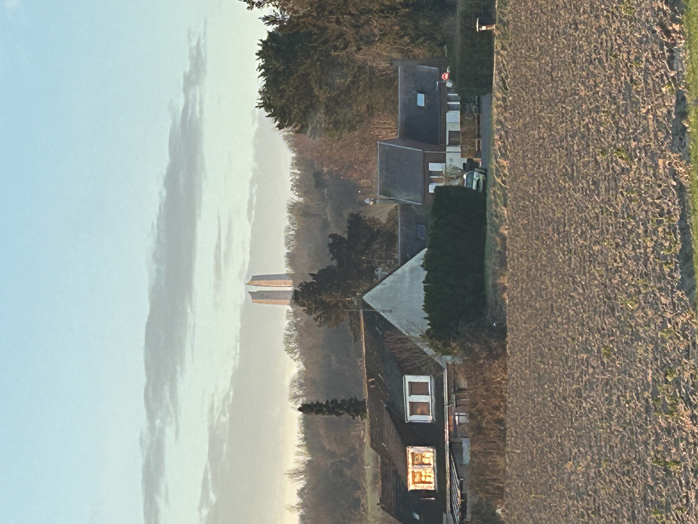

Back to James for a moment: since his attendance at the April 2017 Vimy ceremony, life had progressed quite a bit for him.  In August 2020, he married a wonderful lady whose mother is from the Alsace region of France and father is Moroccan.  James’s wife was born and raised in Casablanca, attended university in France and teaches French literature in a school not far from Versailles.  Two years later, they welcomed a son whose heritage is half Canadian, quarter Moroccan and quarter French.  The Canadian half breaks into half Belgian and half British.  His French grandmother being from Alsace makes German another possible heritage contribution, which is reinforced by her maiden family name.

So, we pulled into the Vimy Memorial parking lot and stopped immediately in front of a memorial I hadn’t noticed on my previous visits: a memorial to the Moroccan Division that fought at Vimy Ridge 9-11 May 1915.

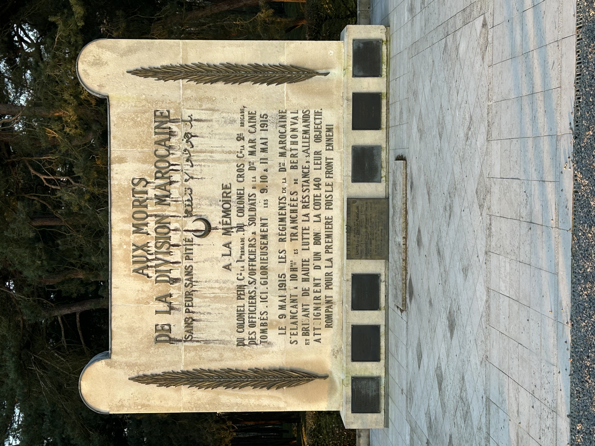

British and French Army units, including the Moroccans, had attempted to capture Vimy Ridge prior to the April 1917 Canadian Army victory.  Turning 180 degrees from facing the Moroccan Memorial is this view of the flagpoles with the Canadian and (usually but not that day) French flags and the Canadian Memorial – which I believe is the most beautiful memorial to any event, anywhere - in the distance.

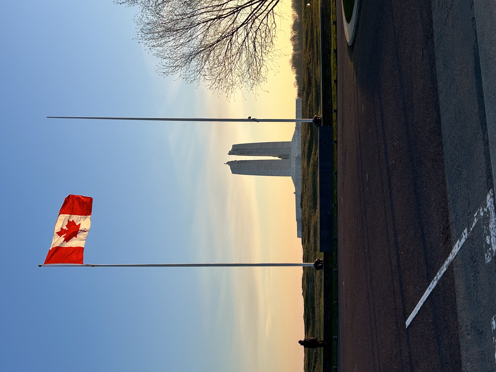

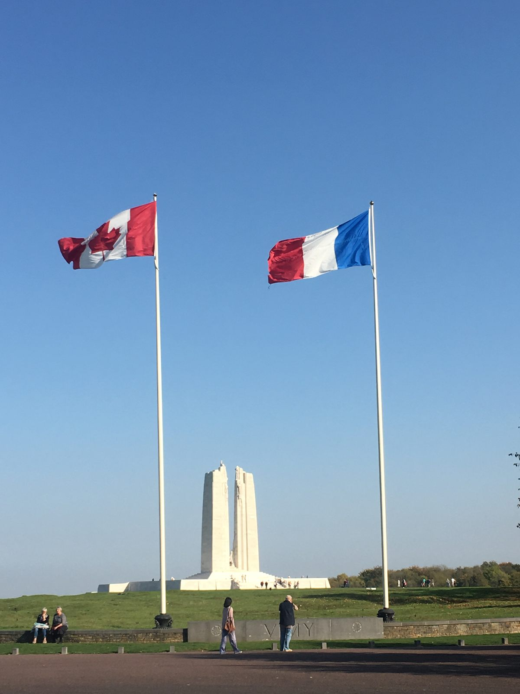

(above photo from Atlas Obscura) Making our way to the eastern viewpoint of the memorial, we could look out to the area of great-uncle Sidney/Jack’s trench – the developed area between the rectangular Amazon fulfillment center on the right and the pyramid-shaped coal slagheap on the left.

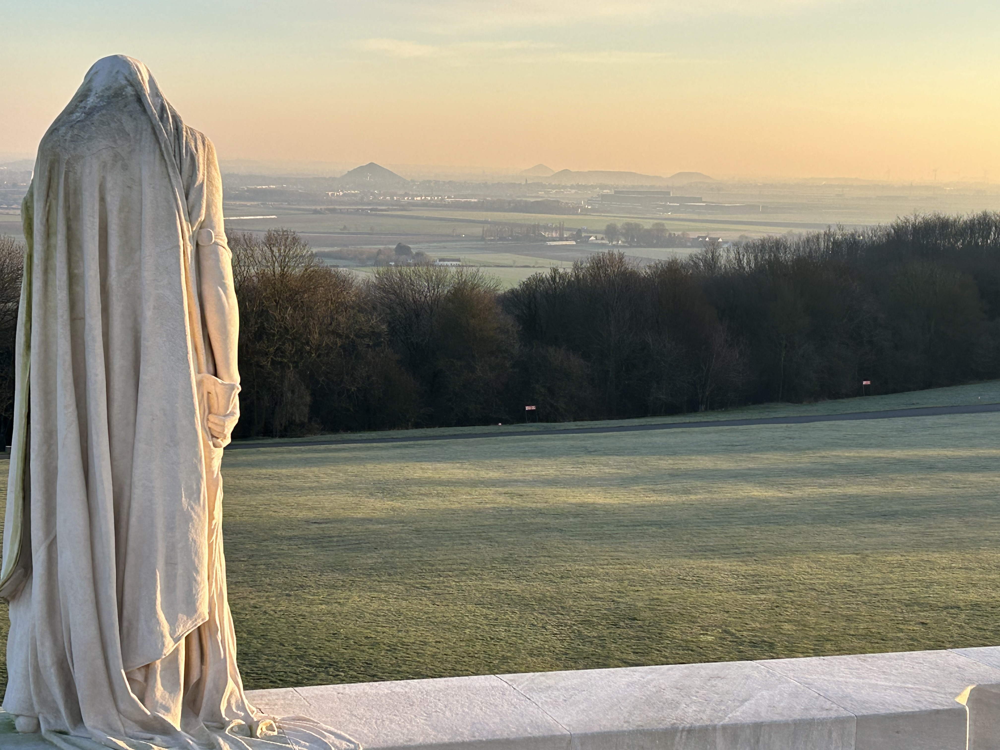

Upon leaving the Vimy area, we drove east over ground largely undeveloped from the WWI time until we reached the Avion community and drove Rue Charles Helle Prolongée, paved over Souris Trench.

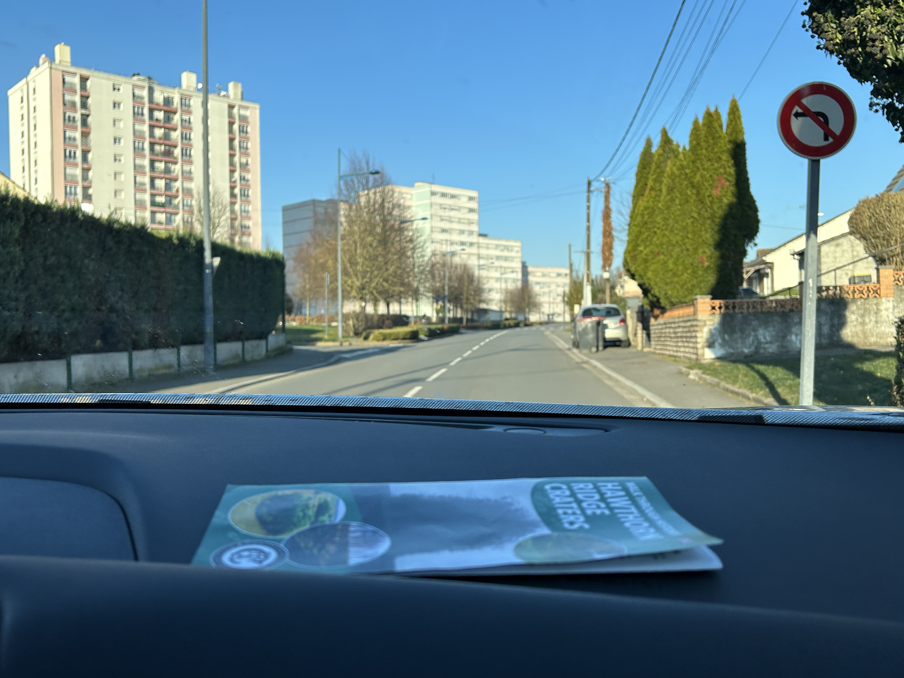

Looking upon the Vimy Memorial illuminated by the golden dawn light with the blue-sky background, I realized that Vimy Ridge had gone from “no known connection with our family” to a nexus of my grandson’s French-Moroccan-Canadian-English-German heritage (just missing the Belgian part, so far as I know).  As Paul and I remarked several times during our weeklong tour of the Western Front and as he’s said in his posts, sometimes the things you didn’t expect to find can be the most meaningful discoveries.

Vin Robert

* [First World War](https://www.paulsbattlefieldtours.com/blog/categories/first-world-war)
* [Family](https://www.paulsbattlefieldtours.com/blog/categories/family)