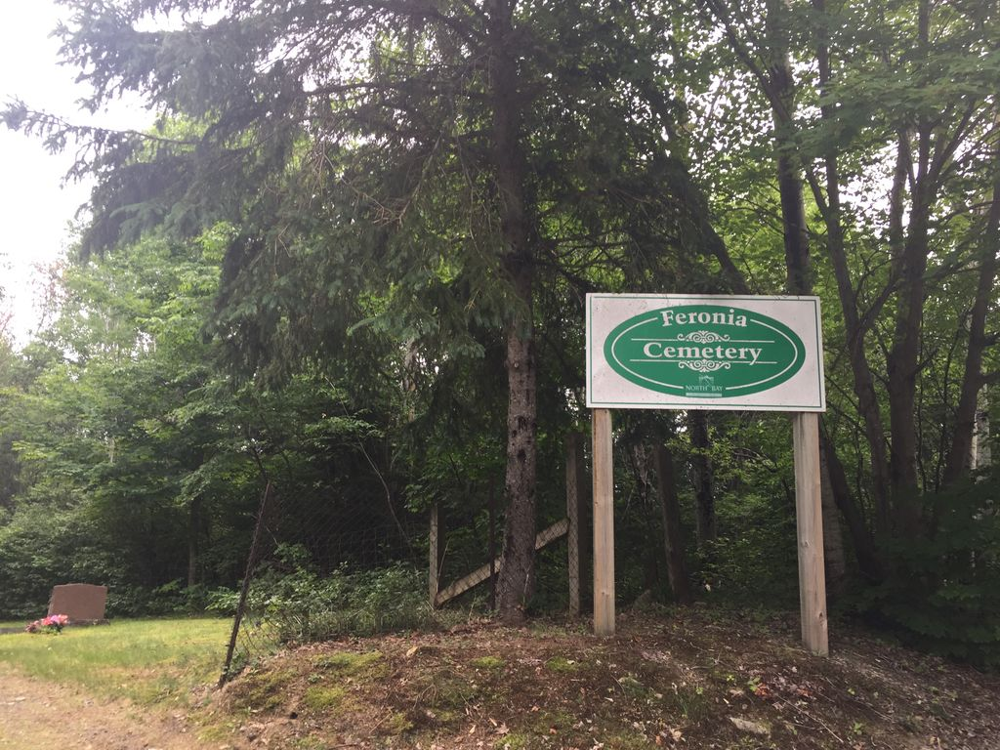

# Visiting Grandfather

* [pd-allen](https://www.paulsbattlefieldtours.com/profile/pd-allen/profile)
* Sep 4, 2023
* 1 min read

Updated: Sep 5, 2023

My sister Dale and I visited the homestead in Balsam Creek (outside North Bay, Ont) this weekend, and stopped to pay respects to our Maternal Grandfather, William Johnston at the Feronia Cemetery a small local cemetery with 68 grave markers.

.

Bill lied about his age to join up at 16, was wounded at Courcelette during his first battle, and spent the rest of the war in England at various Canadian training centres. He met and married our Grandmother Annie Goodfellow in England. Grandfather's is told in a separate post entitled Grandfather's War.

William Johnston

There are two other World War One veterans in the cemetery, David Allan and Albert Crowder. Both were wounded and spent the remainder of their service in England and lived for many years afterwards.

Albert Crowder

David Allan

* [First World War](https://www.paulsbattlefieldtours.com/blog/categories/first-world-war)
* [Family](https://www.paulsbattlefieldtours.com/blog/categories/family)