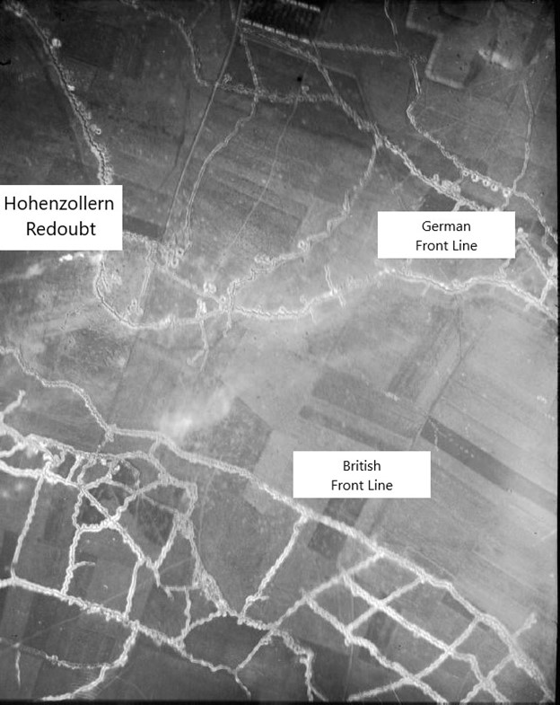
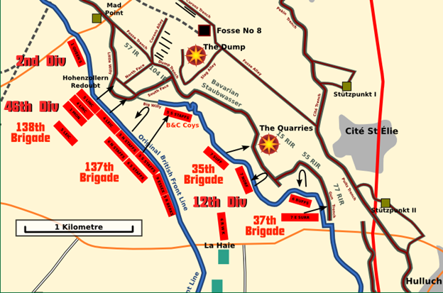
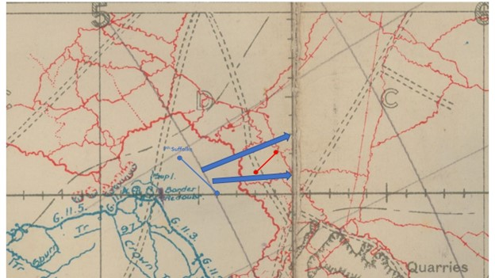
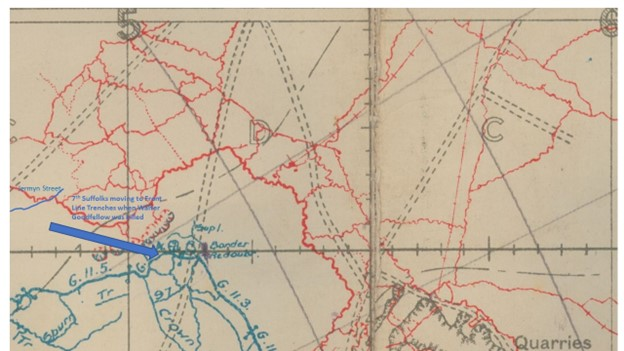
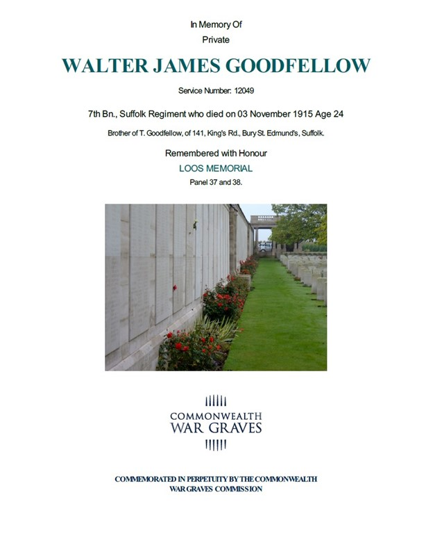
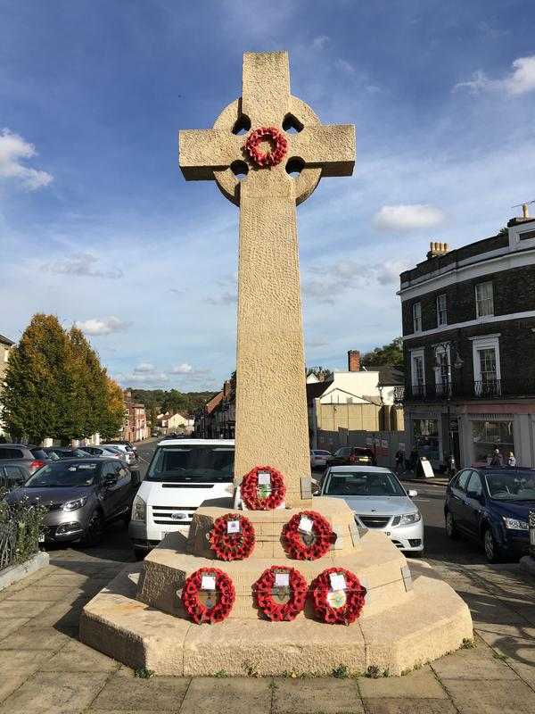

# Walter James Goodfellow 7th Battalion Suffolk Regiment

* [pd-allen](https://www.paulsbattlefieldtours.com/profile/pd-allen/profile)
* Oct 14, 2023
* 3 min read

Updated: Jan 27, 2024

Walter James Goodfellow was born on 13 Oct 1891 at 36 Cemetery Road, Bury St Edmunds, third son of Henry Goodfellow and Maria Reynolds.

Walter was one of 4 Goodfellow brothers to serve in the War. Sadly, Henry, Ernest and Walter were killed and the youngest Thomas survived the war, but had been gassed and was in ill health for the rest of his short life. The Goodfellow brothers were cousins to my maternal grandmother Annie Johnston (Goodfellow).

Walter enlisted in the 7th Battalion Suffolk Regiment; a Service Battalion raised in Bury St Edmunds on 20 Aug 1914 as part of Kitchener’s Army. Under direction of battalion staff, the unit quickly took shape. On 24 Feb 1915, the Battalion was marched to Aldershot, a distance of 110 miles that took a week to complete.

The 7th Battalion was part of the 35th Brigade in the 12th Division.

On 30 May, they entrained to Folkestone then crossed the Channel on the ships Invicta and Queen and arrived in Boulonge the same night. They travelled by rail and road to Acquin and spent 4 days training. On 05 Jun they marched to Champagne, then on to Pradelles and finally to Nieppe. The paved roads and extremely hot weather caused an average of 200 men per battalion to fall out of the marches. They trained for several days, then each company spent 24 hours in the trenches to familiarize the troops with trench life. On Jun 22, they went into the trenches at Ploegsteert, and rotated with the 9th Essex Regiment every 6 days.

On 30 Sep at Loos, one of the current hotspots of the western front. That night they took over the trenches in front of the Chalk Pit from the 1st Coldstream Guards. On 04 Oct they moved back to Vermelles for further training, and on 13 Oct moved to the front line to participate in the Battle of Hohenzollern Redoubt.

The Battle of the Hohenzollern Redoubt was a follow-on from the Battle of Loos 25 Sep – 15 Oct 1915, and the 7th Battalion were fresh troops brought in to press the attack.

The Hohenzollern Redoubt was a bulge in the German line southeast of Loos.

On 13 Oct, the 7th Suffolks as part of the 35th Brigade attacked the Quarries south of the Redoubt to prevent German reserves moving into position.

The attack was scheduled for 2PM under a cover of smoke, but a lack of communication caused the smoke to be stopped at 1:40 PM. The Suffolks advanced under heavy machine gun fire, and successfully took over the second line trench with a ferocious bombing (grenade) attack. They successfully pressed forward until they ran out of grenades and consolidated their positions. The whole position was consolidated and handed over to 9th Essex at 0330. 8 Officers were killed, and 3 wounded. Other ranks had 150 casualties.

Following the attack, the Suffolks were rotated in and out of the front lines every few days to repel periodic German counter attacks. On 03 Nov at 0900 the Suffolks started to relieve 9th Essex in the front line. During relief enemy shelled the leading company as it crossed open ground West of Railway trench and Walter was likely killed at this point. The map below shows the location where he was killed. He has no known grave and is commemorated at the Loos Memorial at Dud Corner Cemetery in Loos-en-Gohelle.

The Commonwealth War Graves Commission certificate is shown below.

Along with his brothers Henry and Ernest, Walter is also memorialized on the Bury St Edmunds War Memorial and the St Mary’s Memorial Chapel dedicated to the Suffolk Regiment.

St Mary’s Church

* [Family](https://www.paulsbattlefieldtours.com/blog/categories/family)
* [First World War](https://www.paulsbattlefieldtours.com/blog/categories/first-world-war)