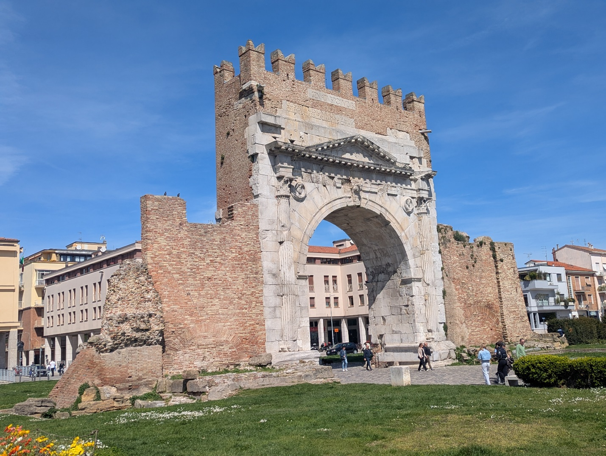
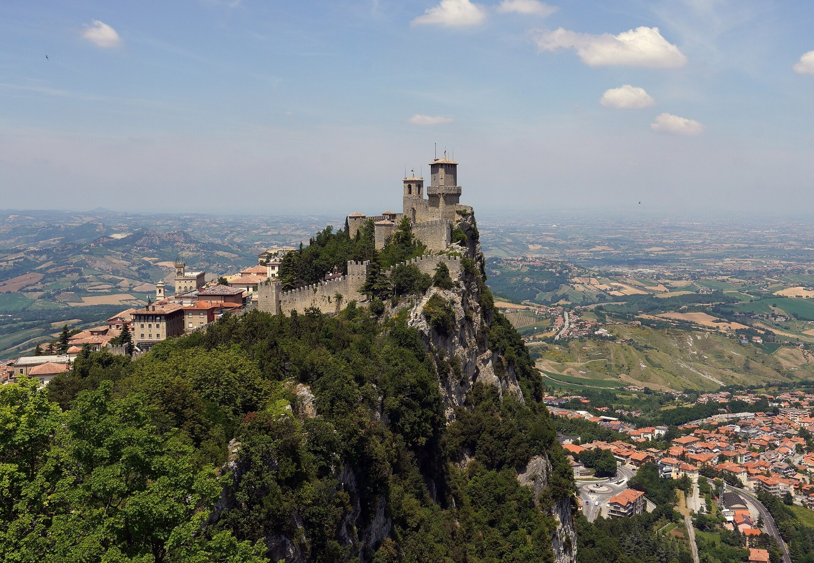
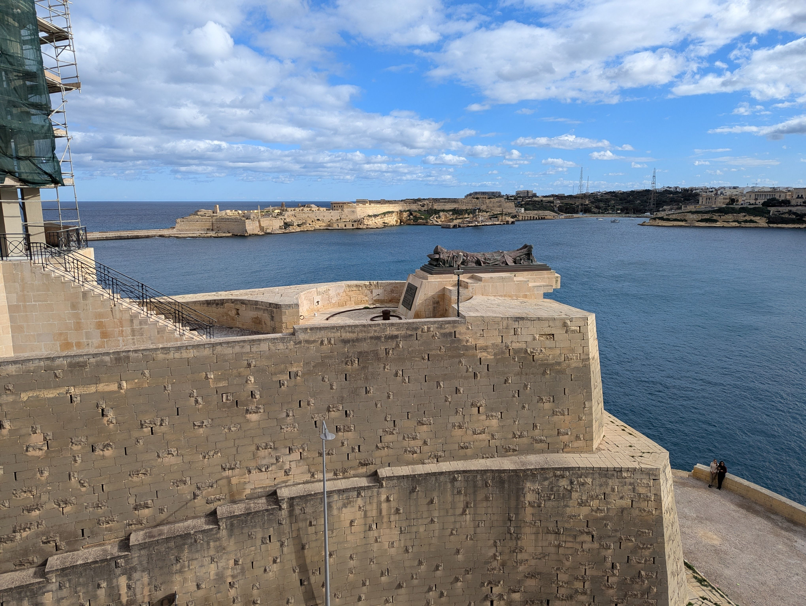

# Travel

Posts tagged with **Travel**.

## Posts

::::{grid} 1 1 1 1

::: {card}Rimini Ravenna And Bologna
:link:  /posts/rimini-ravenna-and-bologna
:header: 
Post Date 2026-05-14

In addition to our battlefield and tiny country tours, we took the opportunity to explore the ancient cities of Rimini, Ravenna and Bologna during our...

::: 

::: {card}The Tiny Country Of San Marino
:link:  /posts/the-tiny-country-of-san-marino
:header: 
Post Date 2026-05-07

During our recent visit to Italy, my daughter Rachel and I negotiated a travel package, two days of battlefield tours in exchange for the tiny country...

::: 

::: {card}Remind Me Where Slovenia Is
:link:  /posts/remind-me-where-slovenia-is
:header: 
Post Date 2025-05-08

Rachel and I spent a lovely Easter week in Slovenia. I’m not sure how we decided on Slovenia, some friends had visited a while ago, but I suspect it w...

::: 

::: {card}Historic Malta
:link:  /posts/historic-malta
:header: 
Post Date 2025-01-10

As part of the deal that has allowed me to explore the battlefields from Rachel’s base in Maastricht, Netherlands while she teaches at the NATO school...

:::

::::
