# WWI

Posts tagged with **WWI**.

## Posts

::: {card}Following The Caribou
:link:  /posts/following-the-caribou
:header: 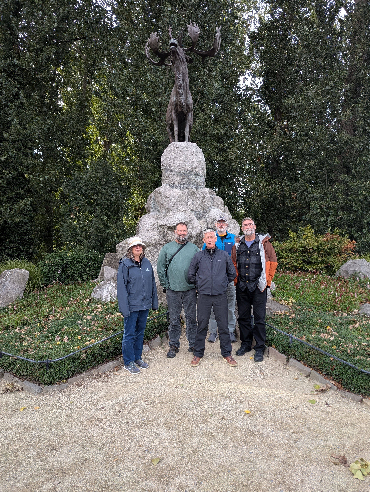
Post Date 2025-10-08

Clan Sullivan: Carol, Pat, Terry, Michael and Brian....

::: 

::: {card}Private Wallace Pike  - Royal Newfoundland Regiment
:link:  /posts/private-wallace-pike-royal-newfoundland-regiment
:header: 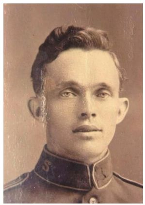
Post Date 2025-10-01

We recently conducted a WWI Tour with my good buddy Terry Sullivan and his wife Sandy Cyr. We were joined by four of eight of Terry’s siblings: Michae...

::: 

::: {card}Corporal William Sullivan - Royal Newfoundland Regiment
:link:  /posts/corporal-william-sullivan-royal-newfoundland-regiment
:header: 
Post Date 2025-09-20

This fall we are going on a Caribou Trail tour to visit all of the Royal Newfoundland Regiment Memorials in France and Belgium with my good Newfoundland buddy Terry ...

:::

::: {card}Slovenia In Wwi
:link:  /posts/slovenia-in-wwi
:header: 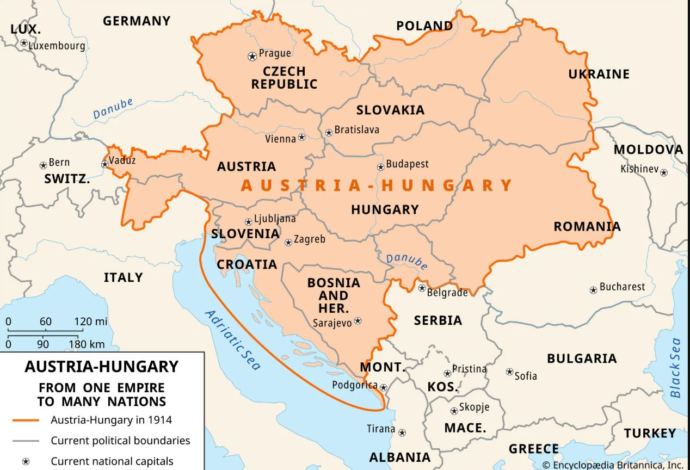
Post Date 2025-05-20

Once we decided to visit Slovenia this Easter, it was mandatory that I look into the battlefield situation. I knew Slovenia was part of Austria-Hungar...

::: 

::: {card}War Stories Of The Rich And Famous
:link:  /posts/war-stories-of-the-rich-and-famous
:header: 
Post Date 2024-09-04

top of page...

::: 

::: {card}Rachel Tours Cambrai
:link:  /posts/rachel-tours-cambrai
:header: 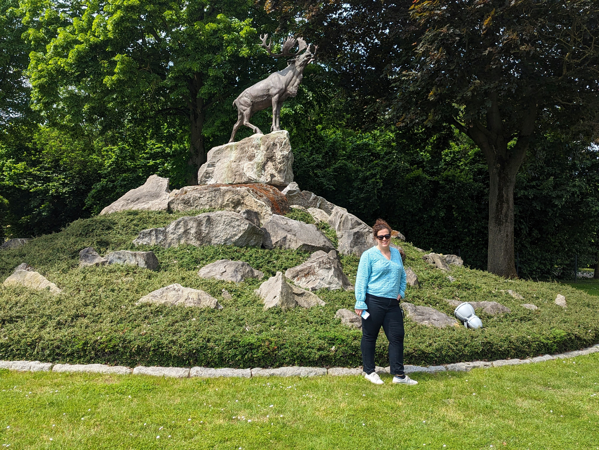
Post Date 2024-06-14

On our last day of touring, we worked our way back south of Arras before heading back home to Maastricht....

::: 

::: {card}Rachel Tours Arras
:link:  /posts/rachel-tours-arras
:header: 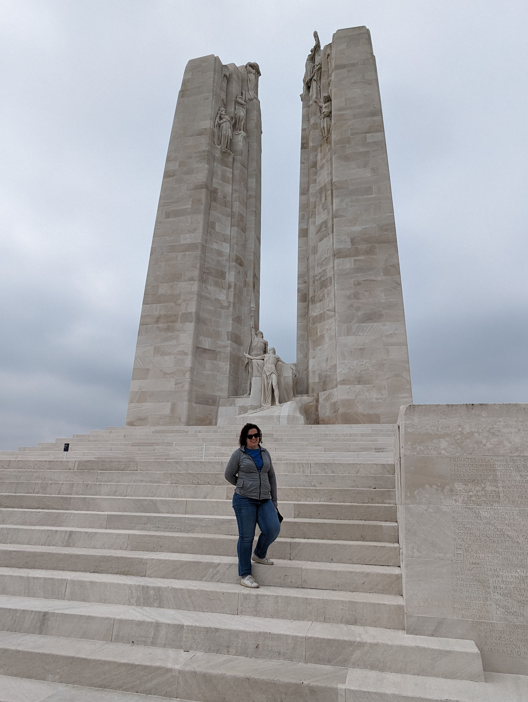
Post Date 2024-06-06

After a good day on the Somme, we headed up to Arras for Part Deux of the Rachel Battlefield Tour. Rob Wolsey, a Canadian Battlefield Guide who works ...

::: 

::: {card}Rachel Tours The Somme
:link:  /posts/rachel-tours-the-somme
:header: 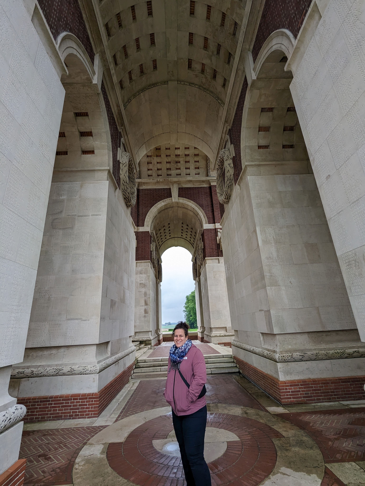
Post Date 2024-05-30

After listening to my war stories and some dedicated blog reading, Rachel decided it was time to see what all the fuss was about, so on the long weeke...

::: 

::: {card}Canadians At Passchendaele - Oct - Nov 1917
:link:  /posts/canadians-at-passchendaele-oct-nov-1917
:header: 
Post Date 2024-05-27

This tour is taken is following Norm Christie’s excellent series for King and Empire....

::: 

::: {card}Canadians At Mont Sorrel - June 1916
:link:  /posts/canadians-at-mont-sorrel-june-1916
:header: 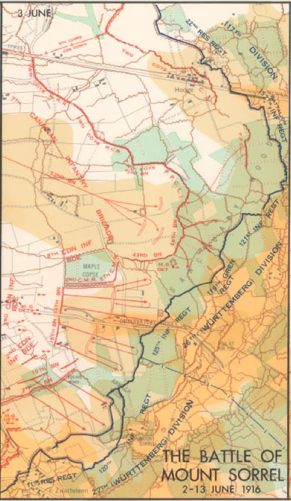
Post Date 2024-05-23

The next stop on my tour of Ypres was the Battle of Mont Sorrel, 2-13 Jun 1916. As with other tours, this adventure is following Norm Christie’s For K...

::: 

::: {card}Canadians At Second Battle Of Ypres - April 1915
:link:  /posts/canadians-at-second-battle-of-ypres-april-1915
:header: 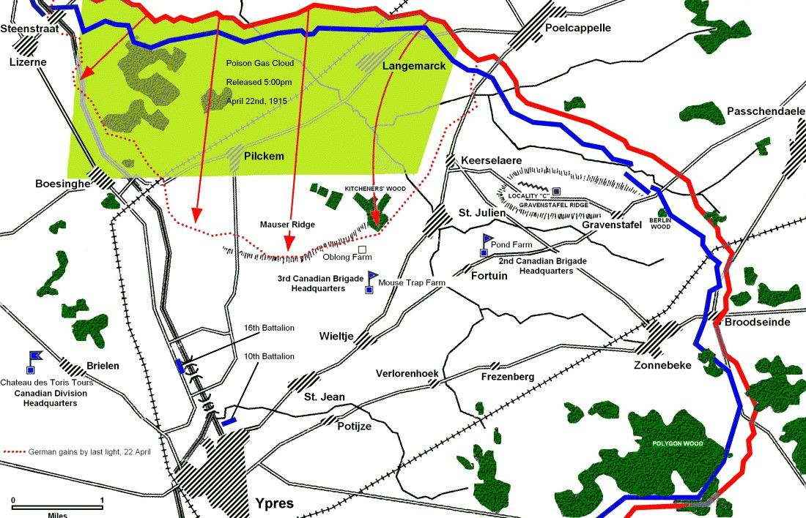
Post Date 2024-05-21

I recently spent a week in Ypres, following the Canadian action in the area. The tour was based on the excellent book series, For King and Empire, by ...

::: 

::: {card}Mining Messines
:link:  /posts/mining-messines
:header: 
Post Date 2024-05-15

During my recent trip to Arras, I became interested in the mining operations in the war. The Battle of Messines is the apex of the mining effort and a...

::: 

::: {card}Last 100 Days - Cambrai 27 Sep 1918
:link:  /posts/last-100-days-cambrai-27-sep-1918
:header: 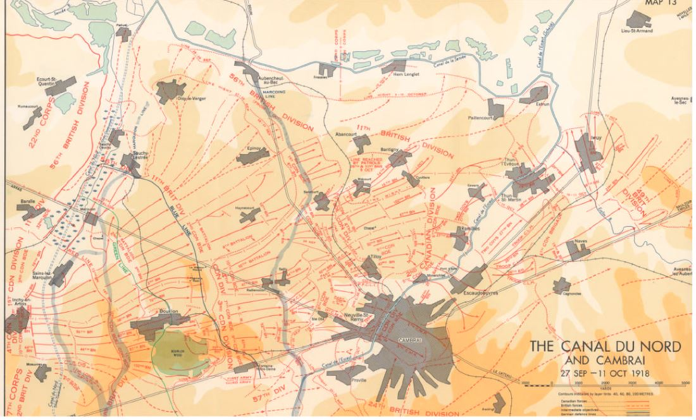
Post Date 2024-05-02

Less than 4 weeks after the success in the Battle of Arras, the Canadian Corps was again up to strength, and ready to take Cambrai, the last important...

::: 

::: {card}Last 100 Days - Arras 26 Aug 1918
:link:  /posts/last-100-days-arras-26-aug-1918
:header: 
Post Date 2024-04-29

Two weeks after completing the Battle of Amiens, the Canadian Corps received 12,000 replacement troops, moved back to the Arras sector and prepared to...

::: 

::: {card}Last 100 Days - Amiens 08 Aug 1918
:link:  /posts/last-100-days-amiens-08-aug-1918
:header: 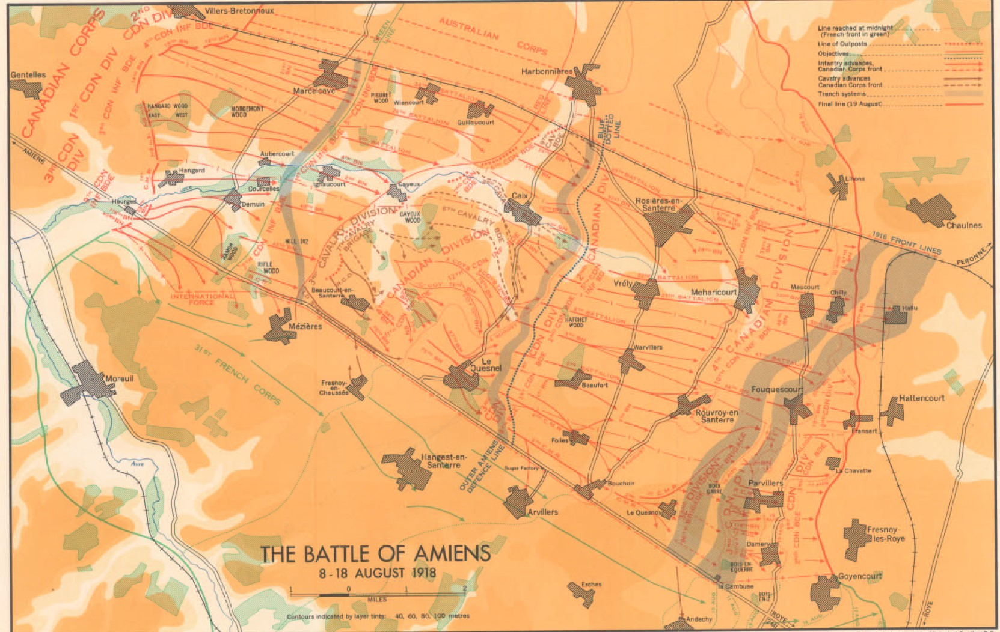
Post Date 2024-04-25

I recently visited Arras with the intention of tracing the three main battles of the Canadian’s Last 100 days of the War in 1918. For this tour, I am ...

::: 

::: {card}Underground Battle At Arras
:link:  /posts/underground-battle-at-arras
:header: 
Post Date 2024-04-23

Caves were dug out under the Place des Heroes Square from the nineth century onwards, to extract chalk or limestone material for the construction of t...

::: 

::: {card}Vimy And The Drummond Family
:link:  /posts/vimy-and-the-drummond-family
:header: 
Post Date 2024-03-17

In January 2024, my war story buddy Wine Bob Drummond and I visited several WWI battlefields. This is his story of the Drummond family's experience ar...

::: 

::: {card}Conscription During The Great War
:link:  /posts/conscription-during-the-great-war
:header: 
Post Date 2024-02-21

One of the things I have enjoyed most about documenting the Battlefield Touring is the Collateral Knowledge that you uncover when you are looking at s...

::: 

::: {card}In Search Of The Lost Vimy Models
:link:  /posts/in-search-of-the-lost-vimy-models
:header: 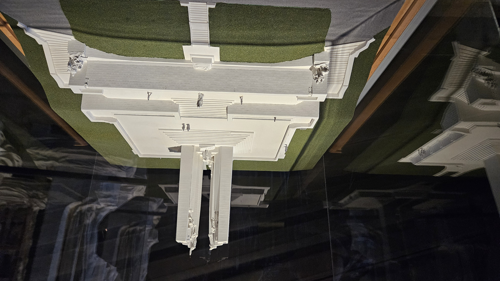
Post Date 2024-02-03

1:100 Scale model of the Vimy Memorial....

::: 

::: {card}Langemark German Cemetery
:link:  /posts/langemark-german-cemetery
:header: 
Post Date 2024-01-30

During our tour of Ypres, we visited Langemark German Cemetery just north of Ypres, one of the 4 German War Cemeteries in Belgium which contains the r...

::: 

::: {card}Goodfellow Brothers - Last Stand
:link:  /posts/goodfellow-brothers-last-stand
:header: 
Post Date 2024-01-28

Goodfellow Brothers – Missing in Action...

::: 

::: {card}Vimy And The Canadian Memorials
:link:  /posts/vimy-and-the-canadian-memorials
:header: 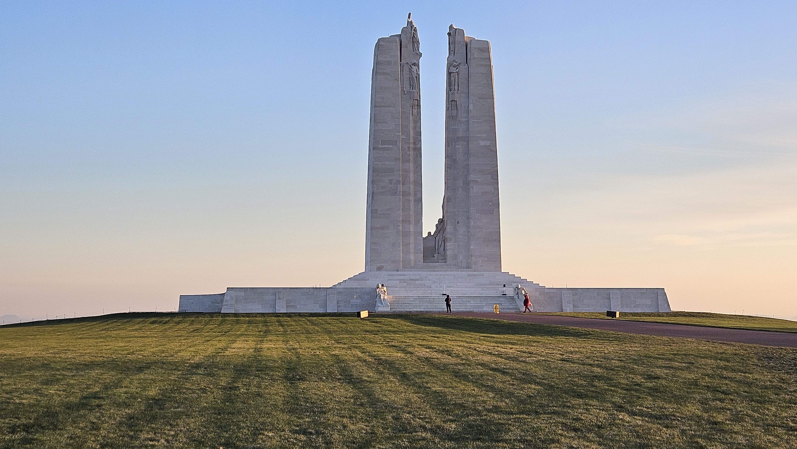
Post Date 2024-01-27

Vimy Ridge and the Canadian Memorials...

::: 

::: {card}Focused On Lens
:link:  /posts/focused-on-lens
:header: 
Post Date 2024-01-26

Our next stop on the tour was the area around Lens, which included Vimy Ridge, Hill 70 and a number of family battle sites....

::: 

::: {card}Somme Deja Vu
:link:  /posts/somme-deja-vu
:header: 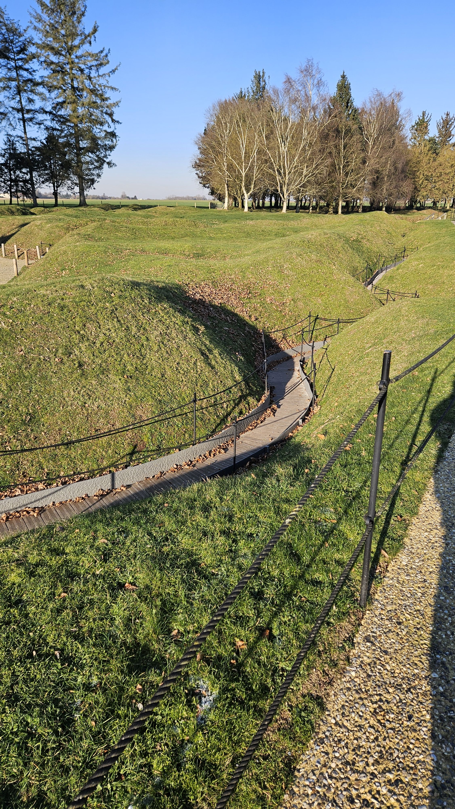
Post Date 2024-01-25

I had posted about these locations during previous visit, but they are all iconic locations that tell the story of the Somme, so are well worth revisi...

::: 

::: {card}A La Somme Avec Wine Bob
:link:  /posts/a-la-somme-avec-wine-bob
:header: 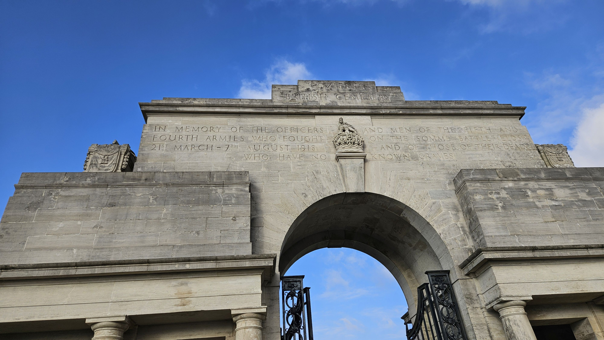
Post Date 2024-01-23

Recently I did a tour of the First World War Battlefields with my good buddy and fellow war story fan (Wine) Bob Drummond. We did a pilgrimage for sev...

::: 

::: {card}Sgt Robert Connelly
:link:  /posts/sgt-robert-connelly-1
:header: 
Post Date 2024-01-08

Robert George Connelly was born on the 24th of July 1884, in Bryson Quebec, son of Robert Connelly and Margaret McTiernan, one of 12 Children....

::: 

::: {card}Sancourt British Cemetery
:link:  /posts/sancourt-british-cemetery
:header: 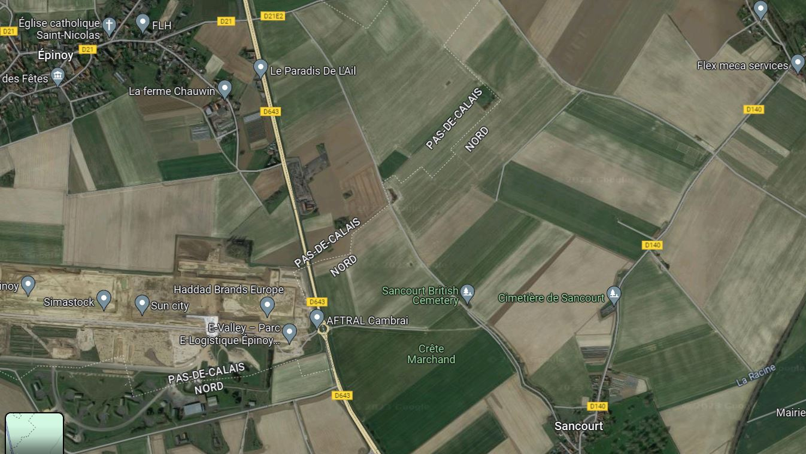
Post Date 2024-01-08

The Sancourt British Cemetery is located Northeast of the village of Sancourt, about 1 km down a single lane track amongst the fields....

::: 

::: {card}Austrian Museum Of Military History, Vienna
:link:  /posts/austrian-museum-of-military-history-vienna
:header: 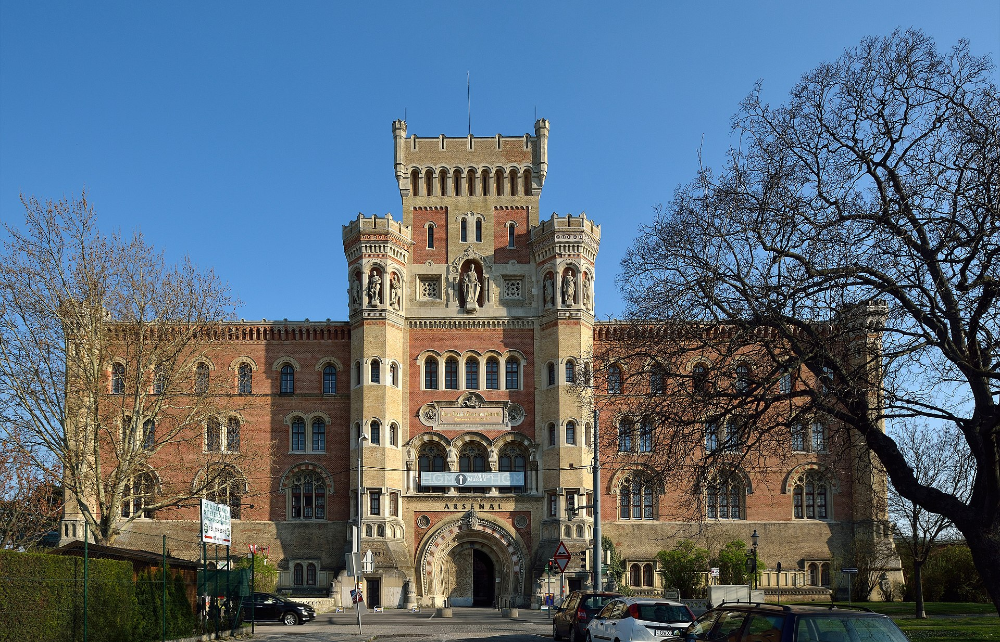
Post Date 2023-11-05

During Rachel’s fall break, we did a tour of Vienna, Bratislava and Prague. The tour was meant to be a break from war stories, but we did manage to sn...

::: 

::: {card}Commanding The High Ground
:link:  /posts/commanding-the-high-ground
:header: 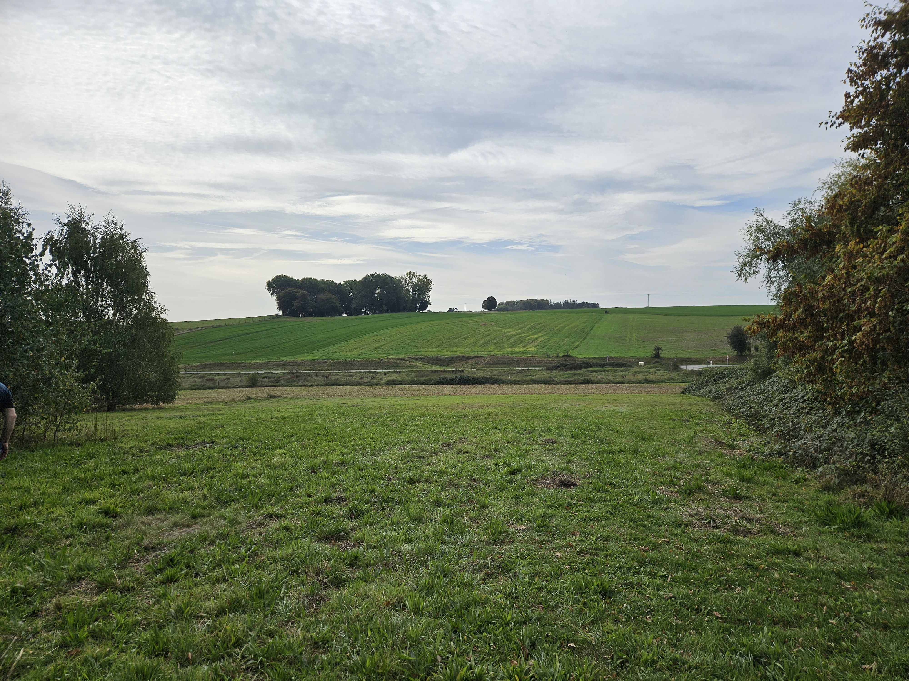
Post Date 2023-10-16

During my recent tour of the Somme, it became evident that the catastrophic losses on the first day of the Battle of the Somme was due in no small par...

::: 

::: {card}Ernest Goodfellow - 1St Battalion Suffolk Regiment
:link:  /posts/ernest-goodfellow-1st-battalion-suffolk-regiment
:header: 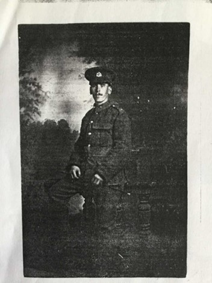
Post Date 2023-10-14

Ernest Robert Goodfellow was born 05 Jun 1889 at 10 Old Barracks, Cemetery Road, Bury St Edmonds. His father was Henry Goodfellow, and his Mother Mari...

::: 

::: {card}Walter James Goodfellow 7Th Battalion Suffolk Regiment
:link:  /posts/walter-james-goodfellow-7th-battalion-suffolk-regiment
:header: 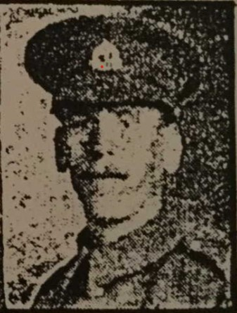
Post Date 2023-10-14

Walter James Goodfellow was born on 13 Oct 1891 at 36 Cemetery Road, Bury St Edmunds, third son of Henry Goodfellow and Maria Reynolds....

::: 

::: {card}Dud Corner Cemetery - Walter Goodfellow
:link:  /posts/dud-corner-cemetery-walter-goodfellow
:header: 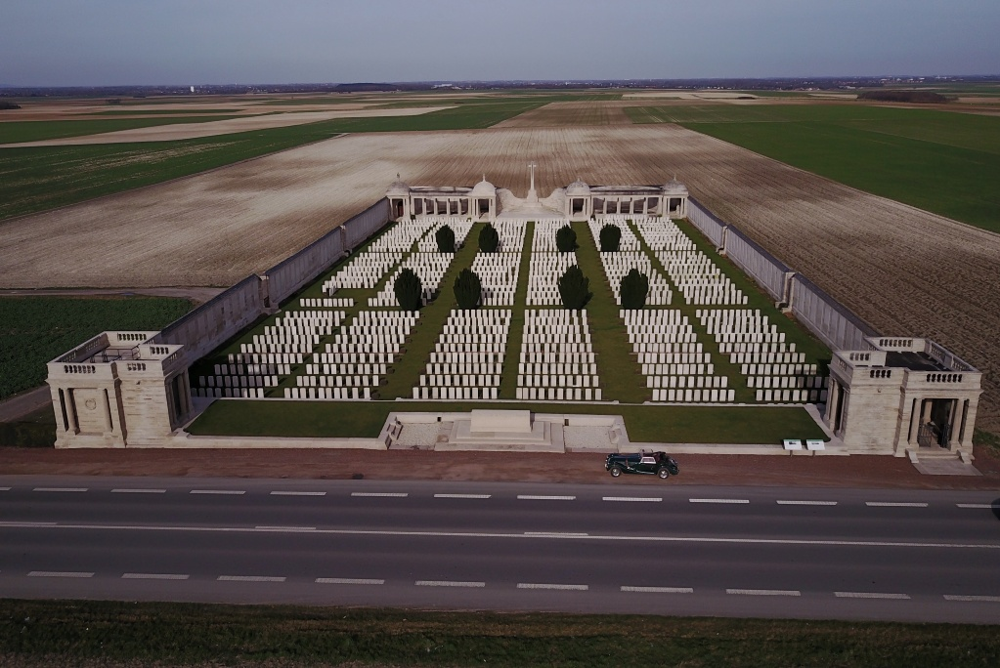
Post Date 2023-10-13

On our recent Somme Tour, we traveled from Fromelles to Vimy, and passed near by the Dud Corner Cemetery and Loos Memorial. We stopped in to pay respe...

::: 

::: {card}Australia'S Worst Day - Battle Of Fromelles
:link:  /posts/australia-s-worst-day-battle-of-fromelles
:header: 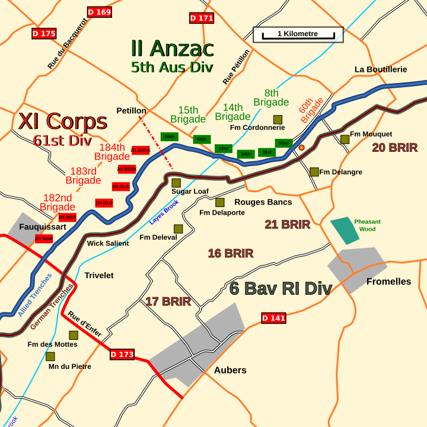
Post Date 2023-10-12

The Battle of Formelles was fought by the British 61st Division and the 5th Australian Division on 19 and 20 Jul 1916. The Australians had fought at G...

::: 

::: {card}Hawthorn Ridge Crater
:link:  /posts/hawthorn-ridge-crater
:header: 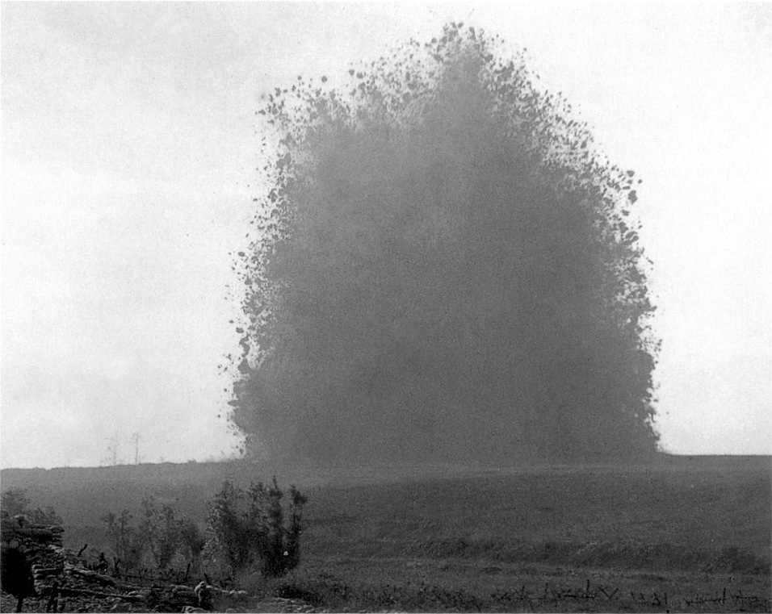
Post Date 2023-10-11

I had the opportunity to return to the Somme this week with 3 British fellows, and tour around several key battle sites. The guy who organized it like...

::: 

::: {card}Saving The British Expeditionary Force
:link:  /posts/saving-the-british-expeditionary-force
:header: 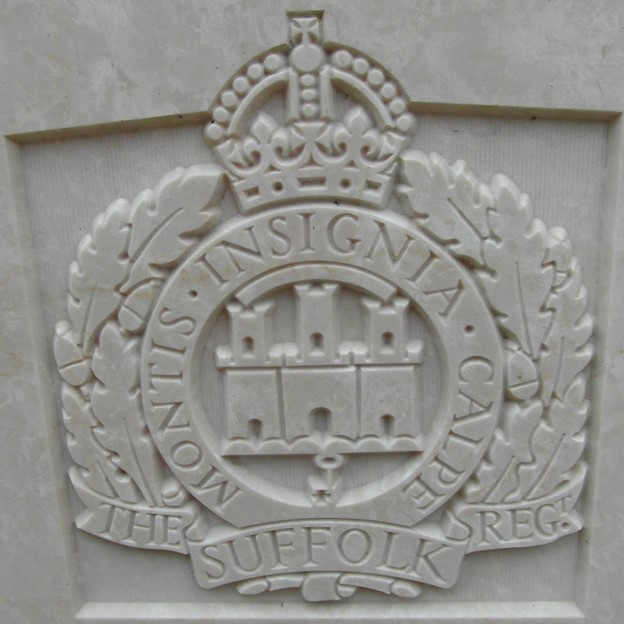
Post Date 2023-10-04

Lance Sgt Henry Goodfellow of the 2nd Battalion Suffolk Regiment was the oldest of 4 brothers who served in the war. Henry, Ernest, and Walter were ki...

::: 

::: {card}Following Grandfather'S Footsteps
:link:  /posts/following-grandfather-s-footsteps
:header: 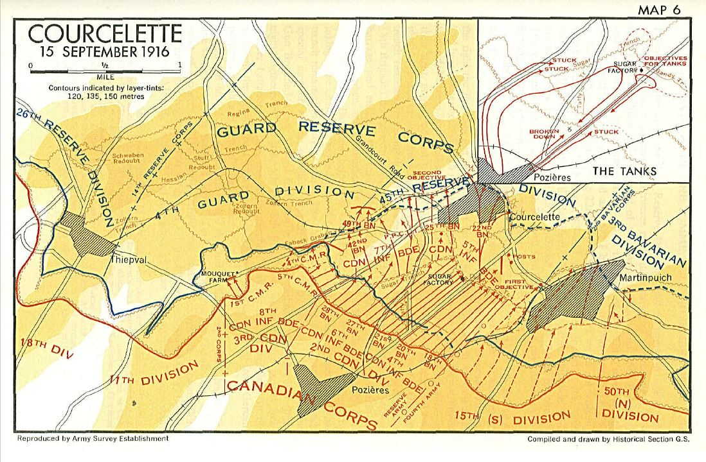
Post Date 2023-10-03

The Canadians were not involved in the disastrous first day of the Somme Battle, 01 Jul 1916, they were in the Ypres Salient, recovering from their he...

::: 

::: {card}The Caribou Trail
:link:  /posts/the-caribou-trail
:header: 
Post Date 2023-09-17

During our trip, we have been able to hit 4 of the 5 Newfoundland Memorials in France and Belgium that honour Newfoundland's sacrifice in the First Wo...

::: 

::: {card}In And Around Ypres
:link:  /posts/in-and-around-ypres
:header: 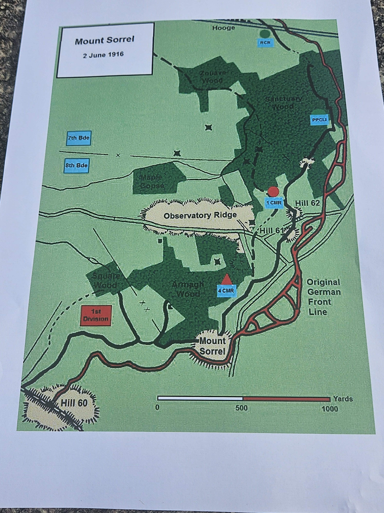
Post Date 2023-09-17

The first stop of the day was at the Canadian Memorial at Sanctuary Woods....

::: 

::: {card}Canada'S Hundred Days
:link:  /posts/canada-s-hundred-days
:header: 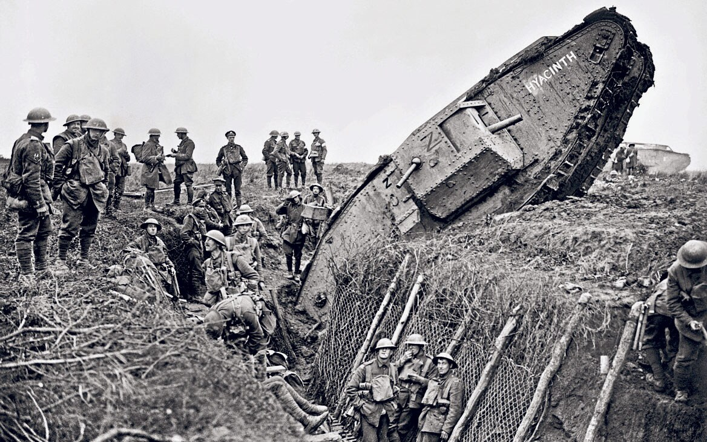
Post Date 2023-09-16

By 1918, the Canadians were known as the Allied Shock troops, so an elaborate deception took place to make the Germans think the Canadians were still ...

::: 

::: {card}Sgt Robert Connelly
:link:  /posts/sgt-robert-connelly
:header: 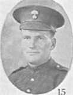
Post Date 2023-09-16

Robert George Connelly was born 24 July 1884, in Bryson Quebec, son of Robert Connelly and Margaret McTiernan, one of 12 Children. Robert Sr’s father,...

::: 

::: {card}Vimy Memorial
:link:  /posts/vimy-memorial
:header: 
Post Date 2023-09-15

On a glorious morning, we visited the Vimy Memorial atop Hill 145 (145 m above sea level), the highest point on Vimy Ridge. The ridge is 85 m above th...

::: 

::: {card}Corporal Percy Fowler, 1 June 1894 – 18 August 1916
:link:  /posts/corporal-percy-fowler-1-june-1894-18-august-1916
:header: 
Post Date 2023-09-14

I was able to visit Bob Drummond’s uncle Percy Fowler at the Theipval Memorial, and asked Bob to write his story....

::: 

::: {card}First Day On The Somme
:link:  /posts/first-day-on-the-somme
:header: 
Post Date 2023-09-14

Today's tour switches to the first world war. We started out at the Lochnagar Crater, one of 19 mine craters blown at 0728 on 1 Jul 1916, the first da...

::: 

::: {card}Lance Sgt 6537Henry Goodfellow
:link:  /posts/lance-sgt-6537henry-goodfellow
:header: 
Post Date 2023-09-09

Henry Goodfellow Sr and Maria Reynolds married on 29 August 1880 and had 8 children. Maria was 23 when they married and Henry Sr was 39, marrying afte...

::: 

::: {card}Pre-Season Tour La Ferté-Sous-Jouarre Memorial To The Missing
:link:  /posts/pre-season-tour-la-ferté-sous-jouarre-memorial-to-the-missing
:header: 
Post Date 2023-09-09

Pre-Season Tour La Ferté-sous-Jouarre Memorial to the Missing...

::: 

::: {card}Visiting Grandfather
:link:  /posts/visiting-grandfather
:header: 
Post Date 2023-09-04

My sister Dale and I visited the homestead in Balsam Creek (outside North Bay, Ont) this weekend, and stopped to pay respects to our Maternal Grandfat...

::: 

::: {card}Grandfather'S War
:link:  /posts/grandfather-s-war
:header: 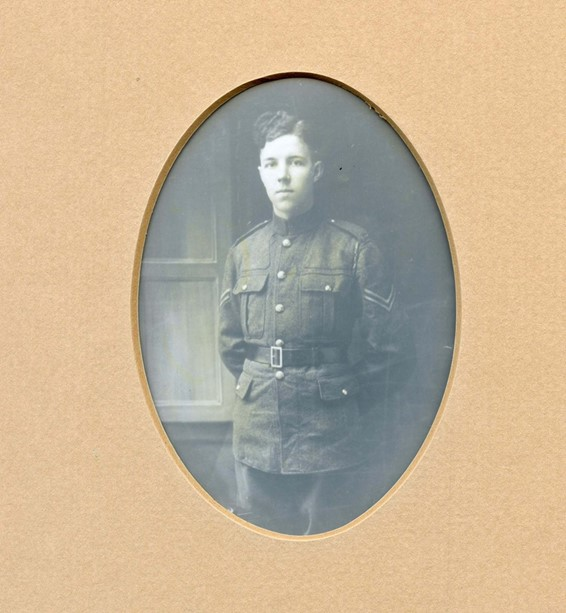
Post Date 2023-09-04

William Johnston...

::: 

::: {card}Travel Time
:link:  /posts/travel-time
:header: 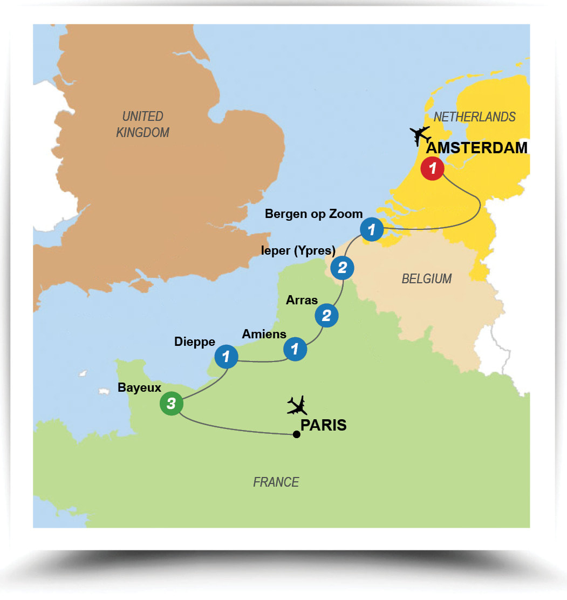
Post Date 2023-07-23

Almost time to embark on the North West Europe Canadian Battlefield Tour presented by Liberation Tours, kicking off on 09 Sep 2023. Key Canadian Battl...

::: 

::::
