# WW2

Posts tagged with **WW2**.

## Posts

::::{grid} 1 1 2 2

::: {card}Normandy Defensive Installations
:link:  /posts/normandy-defensive-installations
:header: 
Post Date 2026-06-18

I had visited Normandy several times, so this time, I concentrated on major German Defensive installations along the Normandy coast that I had not pre...

::: 

::: {card}John Scholte And The Dutch Princess Irene Brigade
:link:  /posts/john-scholte-and-the-dutch-princess-irene-brigade
:header: 
Post Date 2026-06-08

My good friend Sandy Cyr’s grandfather Jan (John) Scholte served in the Dutch Princess Irene Brigade in WW2. The Irenes briefly served under the Secon...

::: 

::: {card}The River Battles - Italy 1944
:link:  /posts/the-river-battles-italy-1944
:header: 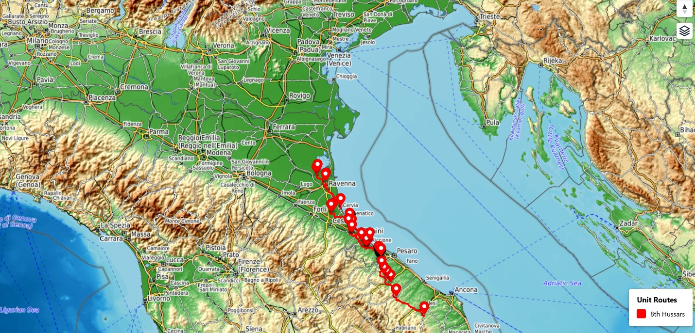
Post Date 2026-04-29

An interactive map of the Hussars’ journey is available [here](https://pd-allen.github.io/docs/html/8thHussarsRimini.html)....

::: 

::: {card}Breaking The Gothic Line
:link:  /posts/breaking-the-gothic-line
:header: 
Post Date 2026-04-22

This Easter, Rachel and I visited Italy, spending the week in the beach town of Rimini. Throughout our travels we have reached an exchange rate of com...

::: 

::: {card}Pfc James Loterbaugh - Us Army
:link:  /posts/pfc-james-loterbaugh-us-army
:header: 
Post Date 2025-12-12

November 5th, 2024, was an uncharacteristically warm and sunny day in the US Military Cemetery in Margraten, Netherlands. I visited the cemetery to pa...

::: 

::: {card}Canadian Liberation March – November 2025
:link:  /posts/canadian-liberation-march-november-2025
:header: 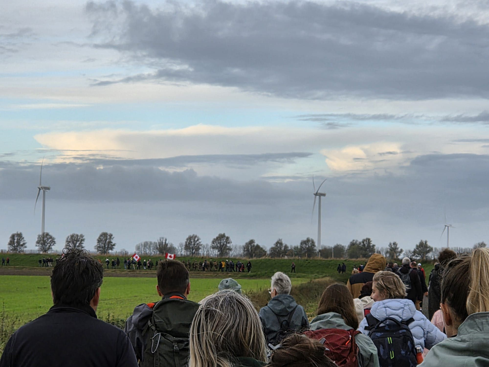
Post Date 2025-11-10

The Canadian Liberation March from Hoofdplaat to Knokke-Heist commemorates the 1944 liberation of Belgium and parts of the Netherlands by Canadian for...

::: 

::: {card}Dunkirk And The Atlantic Wall
:link:  /posts/dunkirk-and-the-atlantic-wall
:header: 
Post Date 2025-07-04

During my visit to the Channel Ports, I stopped at a number of Atlantic Wall fortifications and visited Dunkirk, the site of the great retreat of the ...

::: 

::: {card}Clearing The Channel Ports
:link:  /posts/clearing-the-channel-ports
:header: 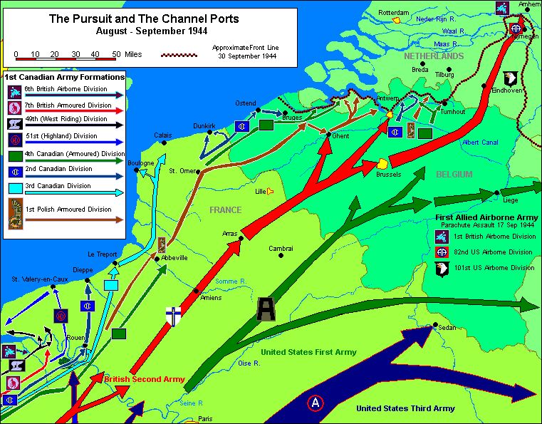
Post Date 2025-06-29

One of this spring’s tours was to follow the Canadians as they fought their way north from Normandy to clear the channel ports to reduce the logistic ...

::: 

::: {card}Canadian Memorials In The Netherlands
:link:  /posts/canadian-memorials-in-the-netherlands
:header: 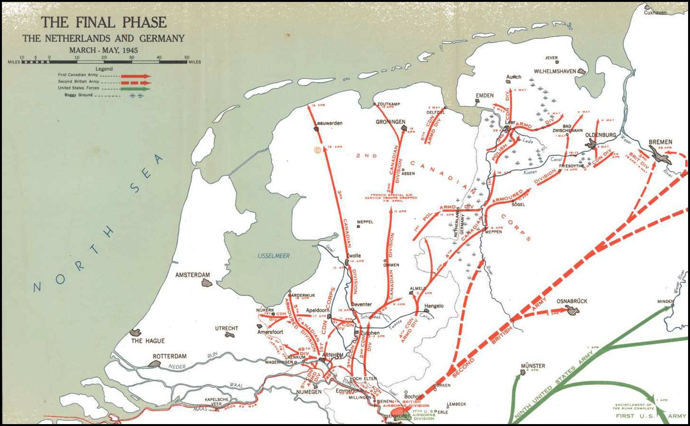
Post Date 2025-06-12

As part of my tour tracing the paths of Uncles Norm Kightley 8th Hussars and George Johnston, Argyll and Sutherland Highlanders of Canada through the ...

::: 

::: {card}Canadian Liberation Of The Netherlands
:link:  /posts/canadian-liberation-of-the-netherlands
:header: 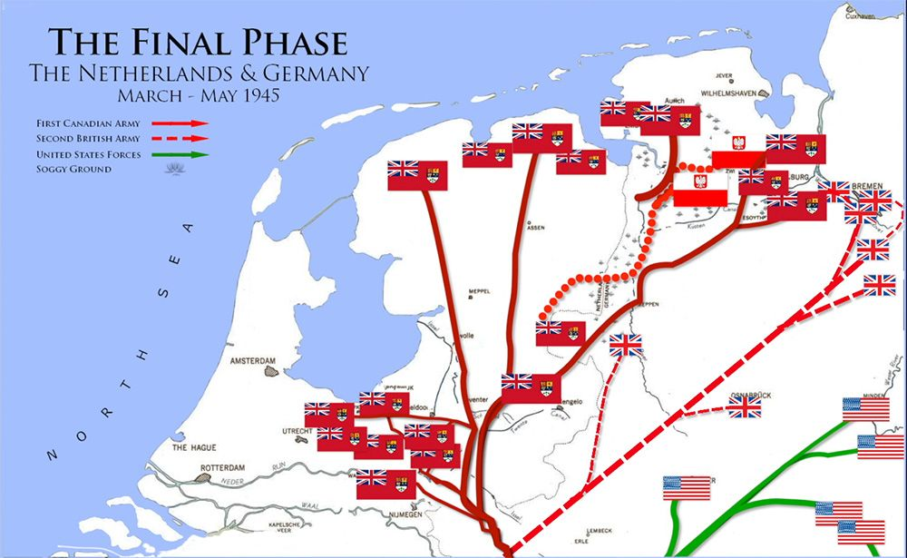
Post Date 2025-06-04

Rachel’s buddies Janaya and Beth were visiting for the weekend, so I took the opportunity to follow my Uncle Norm of the 8th Hussars of the 5th Armour...

::: 

::: {card}Sergeant Norm Kightley - 8Th Hussars
:link:  /posts/sergeant-norm-kightley-8th-hussars
:header: 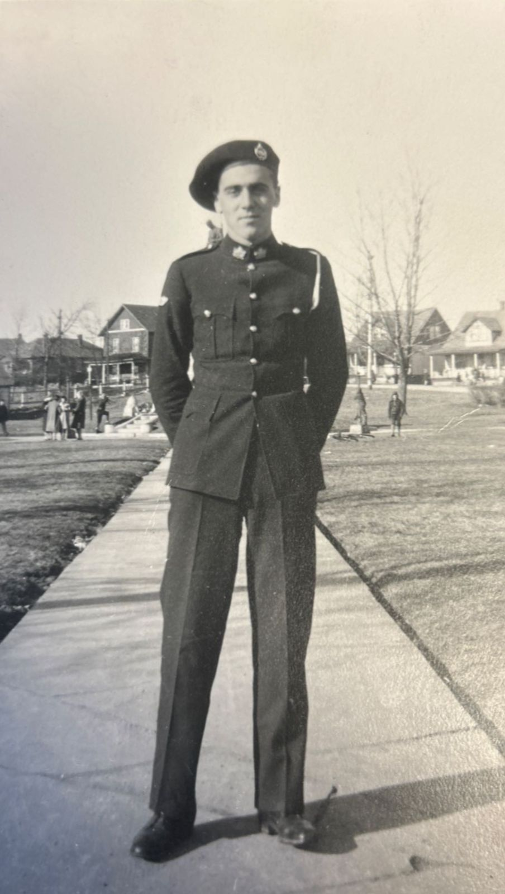
Post Date 2025-04-12

Norm Kightley was my uncle on my mother’s side of the family. He and his wife Marj were frequent visitors to our family, and I knew him better than an...

::: 

::: {card}Operation Husky - The Invasion Of Sicily
:link:  /posts/operation-husky-the-invasion-of-sicily
:header: 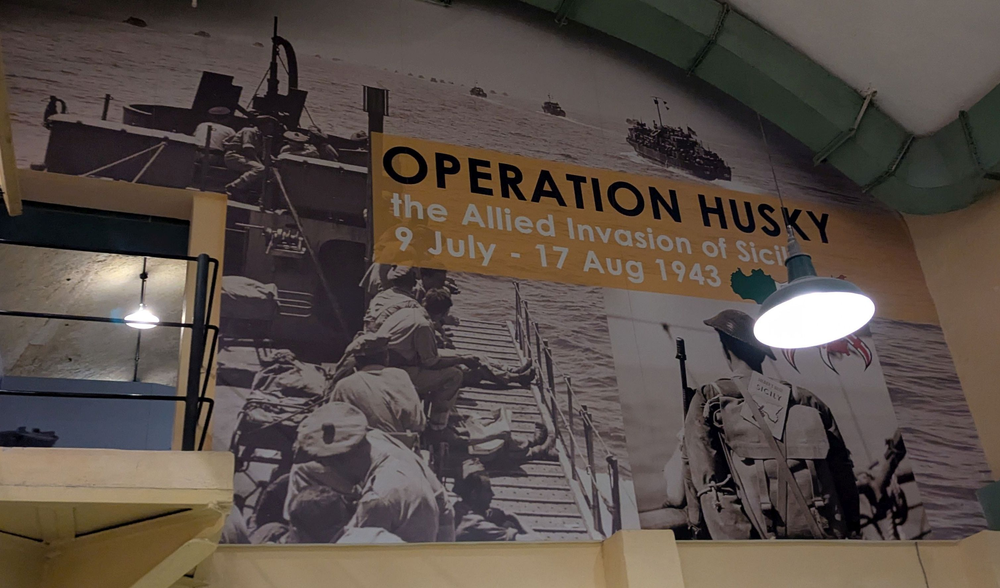
Post Date 2025-02-10

During our tour of Malta, we went to the Lascaris War Rooms, where the British controlled the air defence of Malta. The same location was used for the...

::: 

::: {card}The Siege Of Malta
:link:  /posts/the-siege-of-malta
:header: 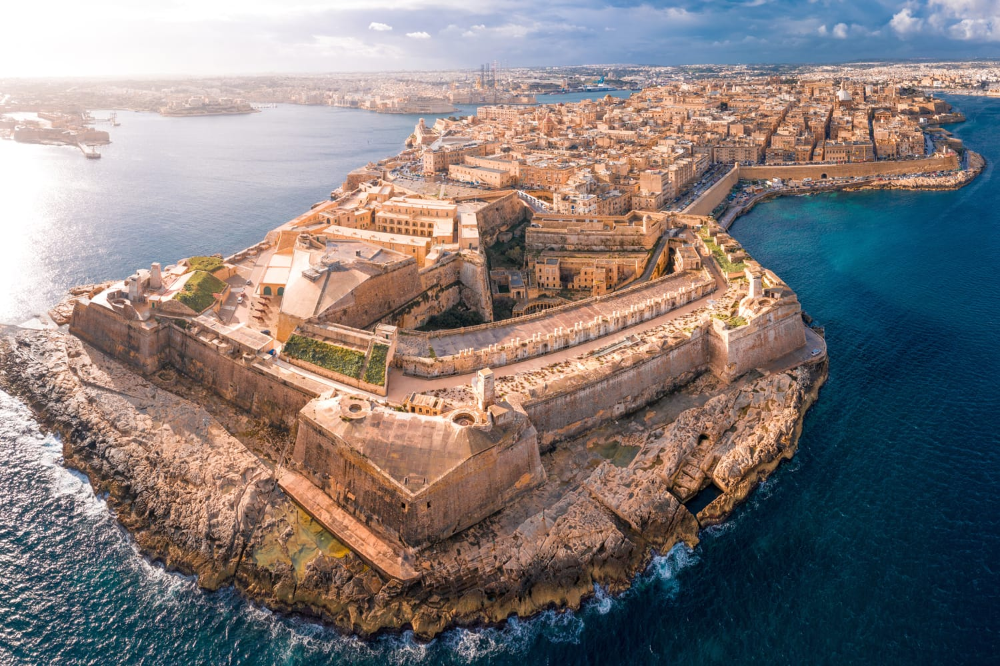
Post Date 2025-01-27

Malta was the most heavily bombed country in the Second World War. The history of Malta is fascinating and the struggles the island and its people wen...

::: 

::: {card}Jn954 Crash At Maastricht
:link:  /posts/jn954-crash-at-maastricht
:header: 
Post Date 2024-11-30

I was looking for something else and came across a number of RCAF aircrew who are buried in the Maastricht General Cemetery, very close to Rachel’s pl...

::: 

::: {card}Private Percy Mervyn At The Leopold Canal
:link:  /posts/private-percy-mervyn-at-the-leopold-canal
:header: 
Post Date 2024-11-26

Percy Ivan Mervyn was born on February 20, 1925, to Albert Mervyn and Dorothy Mittie Dickson in Sault Ste Marie. He was their second son. His older br...

::: 

::: {card}Canadian Liberation March
:link:  /posts/canadian-liberation-march-1
:header: 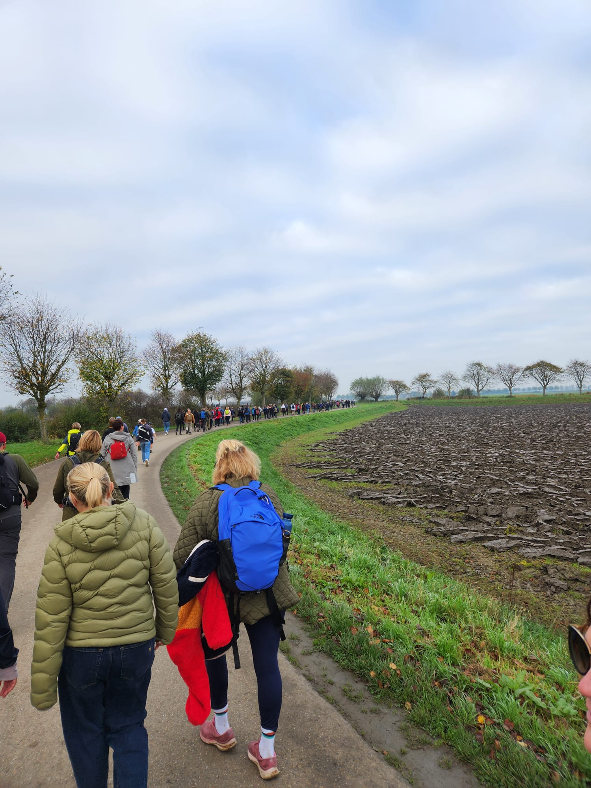
Post Date 2024-11-10

This year was the 80th Anniversary of the Liberation of Belgium and the Netherlands and the 50th Anniversary of the Canadian Liberation March....

::: 

::: {card}D-Day Gold Beach
:link:  /posts/d-day-gold-beach
:header: 
Post Date 2024-10-30

My next stop on the D-Day tour was Gold Beach, the British Beach in the centre of the D-Day landings. Gold Beach had 4 sectors, but due to the cliffs ...

::: 

::: {card}D-Day Juno Beach
:link:  /posts/d-day-juno-beach
:header: 
Post Date 2024-10-27

As I continued on my Normandy Tour, I took a one-day Canadian Beaches and inland tour. I had been to Juno beach before but felt since the tour was goi...

::: 

::: {card}D-Day The Us Beaches
:link:  /posts/d-day-the-us-beaches
:header: 
Post Date 2024-10-24

I hadn’t visited any US D-Day beaches during my previous visit to Normandy, so I decided to take a one-day tour of the beaches. Most of my research ha...

::: 

::: {card}Final Flight For Robert Mckenzie
:link:  /posts/final-flight-for-robert-mckenzie
:header: 
Post Date 2024-10-11

During a recent visit to Normandy, I visited a number of locations associated with Flight Lieutenant Robert McKenzie, a Typhoon Pilot who was tragical...

::: 

::: {card}Battle Of The Scheldt - North
:link:  /posts/battle-of-the-scheldt-part-two
:header: 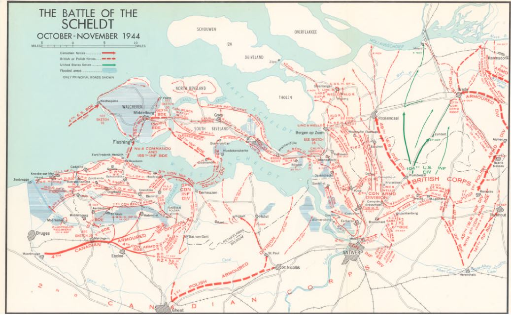
Post Date 2024-10-10

The exploration of the Battle of the Scheldt continued, looking at the Action on the Northern Bank. Fortunately, I did not have to sleep in a slit tre...

::: 

::: {card}Battle Of The Scheldt - Southern Bank
:link:  /posts/battle-of-the-scheldt-southern-bank
:header: 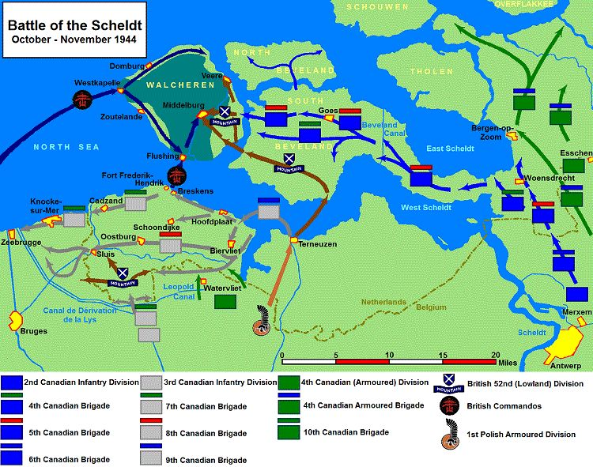
Post Date 2024-10-08

Thanks to a teacher girls’ weekend in Milan, Rachel’s car and I got to spend some time exploring the Battle of the Scheldt, a major Canadian battle to...

::: 

::: {card}Operation Market Garden
:link:  /posts/operation-market-garden
:header: 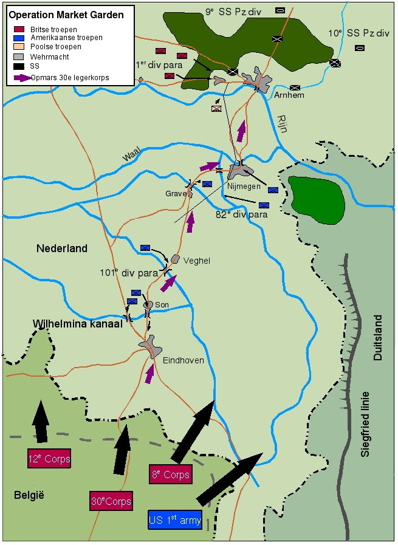
Post Date 2024-09-26

As part of the 80th Anniversary of Operation Market Garden there was a demonstration of the parachute drop at Eerde, just north of Eindhoven, original...

::: 

::: {card}Liberation Of The Netherlands
:link:  /posts/liberation-of-the-netherlands
:header: 
Post Date 2024-09-25

I was fortunate to arrive back in the Netherlands in time for celebrations of the 80th anniversary of the liberation of the Limburg region of the Neth...

:::

::: {card}Fortress Thyboron
:link:  /posts/fortress-thyboron
:header: 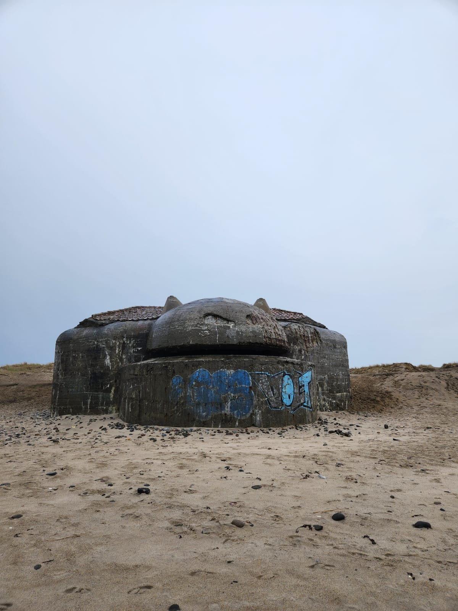
Post Date 2024-04-13

Adjacent to the Sea War Museum was the Thyboron Fortress, a portion of Germany’s World War Two Atlantic Wall.  The Atlantic Wall contains over 8000 co...

::: 

::: {card}Canadian Liberation March
:link:  /posts/canadian-liberation-march
:header: 
Post Date 2023-11-07

Every year, in order to honour the Liberation of Belgium and the Netherlands, the Canadian Liberation March from Hoofdplaat, Netherlands to Knokke-Hei...

::: 

::: {card}Fort Eben-Emael Gateway To Dunkirk
:link:  /posts/fort-eben-emael-gateway-to-dunkirk
:header: 
Post Date 2023-10-31

After a week off to explore some of the cultural aspects of Europe, Rachel and I visited the Belgian Fort Eben-Emael, just 10 km from Maastricht. The ...

::: 

::: {card}The Overloon Military Museum
:link:  /posts/the-overloon-military-museum
:header: 
Post Date 2023-10-20

During my trek through Germany and the Netherlands, I stopped at the Overloon Museum. The museum was founded in 1946 and became the first museum dedic...

::: 

::: {card}Pilot Officer Leslie Mckenna
:link:  /posts/pilot-officer-leslie-mckenna
:header: 
Post Date 2023-10-19

Leslie William Joseph McKenna was born on 28 Dec 1924 in Stonecliffe, ON son of William McKenna and Margret Ellen Conway. They lived in North Bay when...

::: 

::: {card}Reichswald Forest War Cemetery
:link:  /posts/reichswald-forest-war-cemetery
:header: 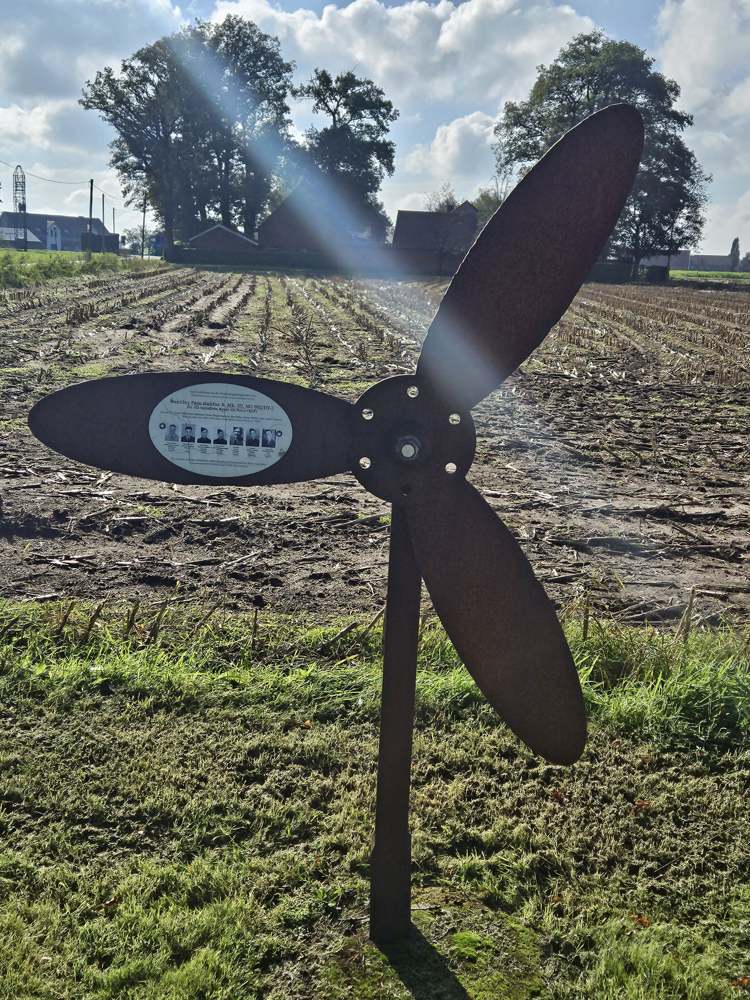
Post Date 2023-10-19

Steve McKenna has been a buddy of mine since grade nine. We went through high school together, signed up for RMC together, and spent most of our caree...

::: 

::: {card}Canada Poland Museum
:link:  /posts/canada-poland-museum
:header: 
Post Date 2023-09-29

The Canada Museum was founded in 1994, and the Polish section was opened in 2004 by Gilbert Van Landschoot as a tribute to the Canadian and Polish lib...

::: 

::: {card}For Freedom Museum
:link:  /posts/for-freedom-museum
:header: 
Post Date 2023-09-28

During my trip to the Atlantic Wall, I was recommended twice to visit the Private Museum For Freedom in Knokke–Heist, the final region to be liberated...

::: 

::: {card}Joseph Christopher Raymond Cadeau
:link:  /posts/joseph-christopher-raymond-cadeau
:header: 
Post Date 2023-09-27

Private Joseph Christopher Raymond Cadeau B/119256...

::: 

::: {card}Adegem Canadian War Cemetery
:link:  /posts/adegem-canadian-war-cemetery
:header: 
Post Date 2023-09-25

Adegem Canadian War Cemetery...

::: 

::: {card}Storming The Atlantic Wall
:link:  /posts/storming-the-atlantic-wall
:header: 
Post Date 2023-09-23

With Rachel in Dublin on a girl's trip, her car and I decided to storm the Atlantic Wall....

::: 

::: {card}Liberation - The Final Chapter
:link:  /posts/liberation-the-final-chapter
:header: 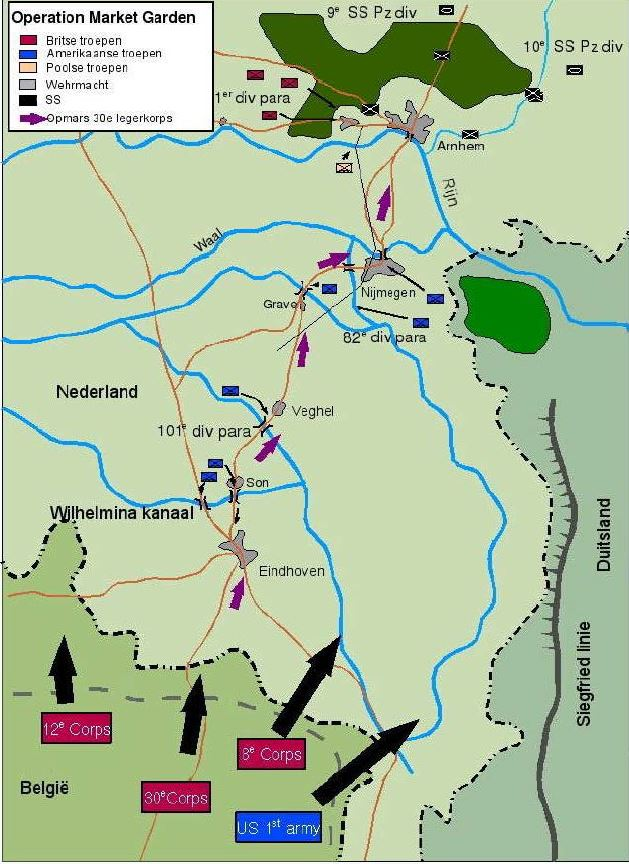
Post Date 2023-09-19

Operation Market Garden was Gen Montgomery's bold plan to take the bridge across the Rhine at Arnhem, by dropping the British 1st Para Division at Arn...

::: 

::: {card}Uncle George Johnston
:link:  /posts/uncle-george-johnston
:header: 
Post Date 2023-09-19

George is in the 3rd row, second from the right....

::: 

::: {card}Battle Of The Scheldt
:link:  /posts/battle-of-the-scheldt
:header: 
Post Date 2023-09-18

The Canadians were given the task of clearing the Scheldt Estuary, so that the liberated port of Antwerp could be used to supply the Allied Advance, a...

::: 

::: {card}Disaster At Dieppe
:link:  /posts/disaster-at-dieppe
:header: 
Post Date 2023-09-13

In 1942 the Allies were under pressure to open up a second front against the Germans. They did not have the resources for a full scale invasion, so it...

::: 

::: {card}Mulberry Harbour
:link:  /posts/mulberry-harbour
:header: 
Post Date 2023-09-12

There were 2 man-made harbours code named Mulberry Harbours, one on the US sector at Omaha Beach, and on in the British Sector at Gold Beach. Work on ...

::: 

::: {card}Moving In Land From The Beaches
:link:  /posts/moving-in-land-from-the-beaches
:header: 
Post Date 2023-09-11

Today's tour focused on the battles following the D-Day invasion. Despite the initial successes of D-Day, the Canadians had not met all their objectiv...

::: 

::: {card}Lance Sgt Thomas Easton
:link:  /posts/lance-sgt-thomas-easton
:header: 
Post Date 2023-09-11

Thomas Leonard Easton was born on February 17, 1915, in Sudbury to Harry James Easton and Florence Elizabeth Adcock. Harry and Elizabeth were both bor...

::: 

::: {card}Queen'S Own Rifles On D-Day
:link:  /posts/queen-s-own-rifles-on-d-day
:header: 
Post Date 2023-09-10

The 3rd Canadian Infantry Division and tanks of the 2nd Armoured Division were selected to attack a 10 km stretch of coastline known as Juno Beach....

::: 

::: {card}Juno Beach
:link:  /posts/juno-beach
:header: 
Post Date 2023-09-10

On our first real day of touring we hit Juno beach, and it hit back hard. I had written a Juno Beach story before seeing it in person, and that blog w...

::: 

::::
